# 赞助商大厅-免费代码营

> 原文：<https://www.freecodecamp.org/news/sponsors/>

freeCodeCamp 的绝大部分资金来自成千上万的人，他们每个月通过经常性捐款支持我们的 501(c)(3)非营利组织。

我们也有通过拨款支持非营利组织的组织。我们在此感谢这些组织。

如果您有兴趣支持我们的非营利组织和我们的使命，并在此被列为赞助商，请阅读本指南中关于如何赞助免费代码营的内容。

您的组织可以帮助赞助单个课程或整个课程的开发。

## 钻石赞助商

[Google's website](https://www.google.com/)

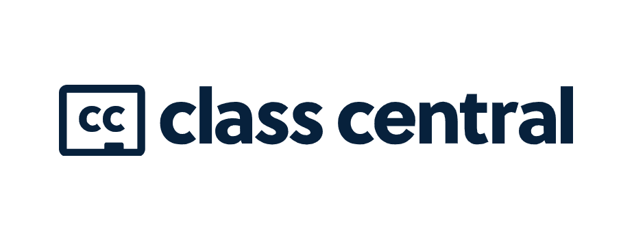

[Class Central's website](https://www.class-central.com/)

[Kaiju Kingz website](https://kaijukingz.io/#/)

## 白金赞助商

[InMotion Hosting website](https://www.inmotionhosting.com/)

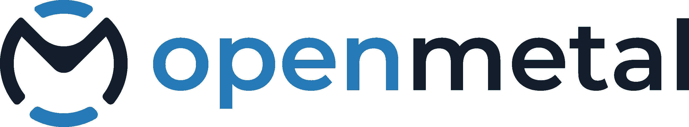

[Open Metal website](https://openmetal.io/)

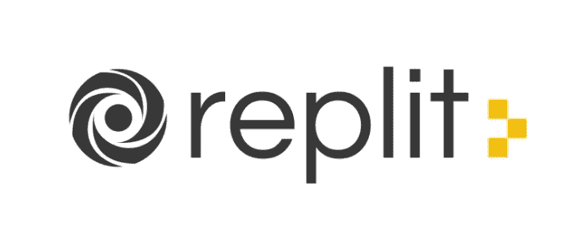

[Replit's website](https://www.replit.com)

[IEX Cloud's website](https://iexcloud.io/)

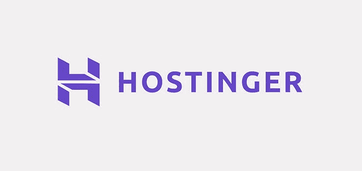

[Hostinger's Website](https://www.hostinger.com/)

[New Relic's website](https://www.newrelic.com)

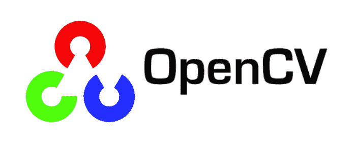

[OpenCV's website](https://opencv.org/)

[MongoDB's website](https://www.mongodb.com/)

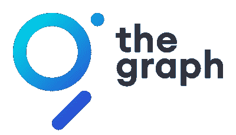

[The Graph's website](https://thegraph.com/en/)

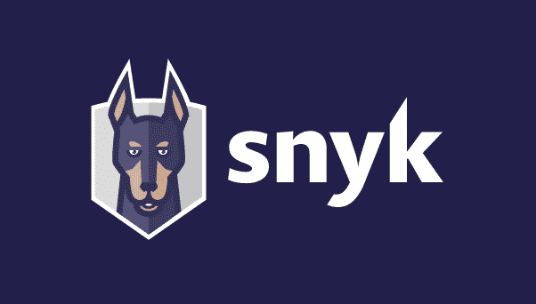

[Snyk's website](https://snyk.io/)

[Pulumi's website](https://www.pulumi.com)

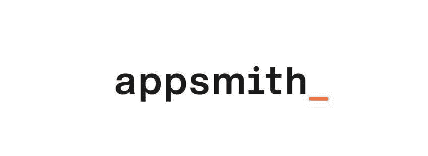

[Appsmith's website](https://www.appsmith.com/)

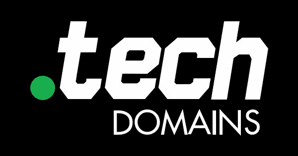

[.tech Domains' website](https://get.tech/)

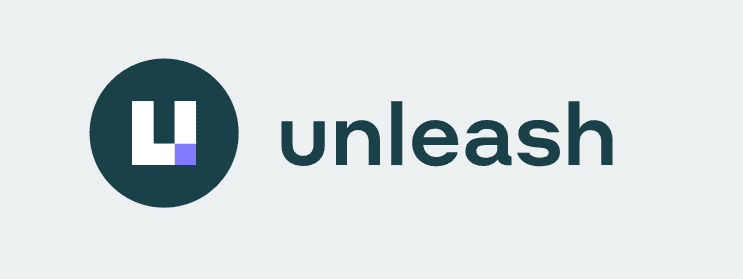

[Unleash's website](https://www.getunleash.io/)

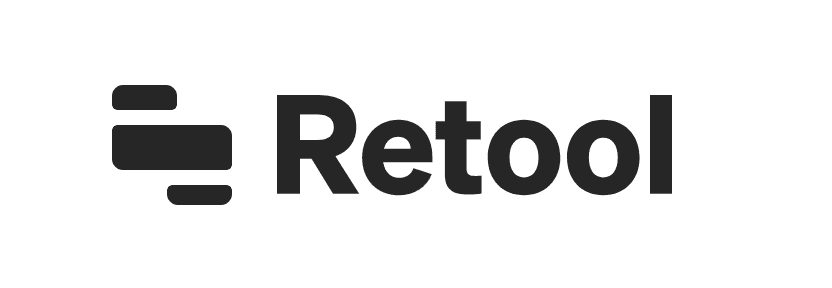

[Retool's website](https://retool.com/)

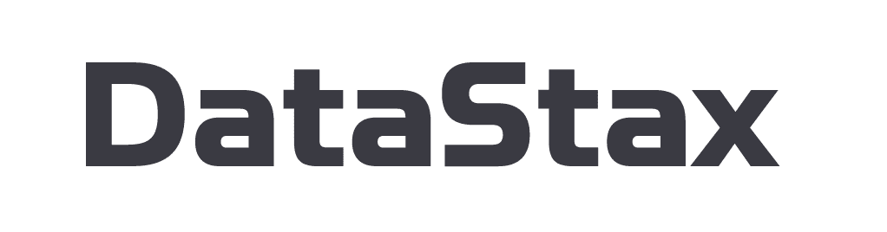

[DataStax's website](https://www.datastax.com/)

[InMotion Hosting's Website](https://www.inmotionhosting.com/)

## 金牌赞助商

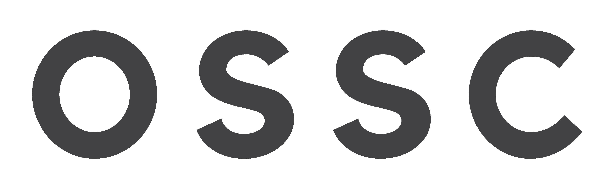

[OSS Capital's Website](https://oss.capital/)

[TsugiCloud's website](https://www.tsugicloud.org/)

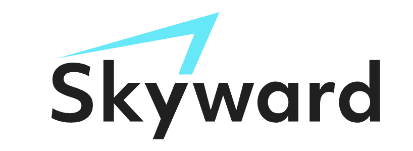

[Skyward Agency's website](https://skyward.digital/)

[Hashnode's website](https://hashnode.com/?source=fcc_sp)

[CodeSee's website](https://www.codesee.io/)

[Scrimba's website](https://scrimba.com/)

[dofollow.co.uk's website](https://dofollow.co.uk)

[Daily.dev's website](https://daily.dev/)

[Beeminder's website](https://www.beeminder.com/)

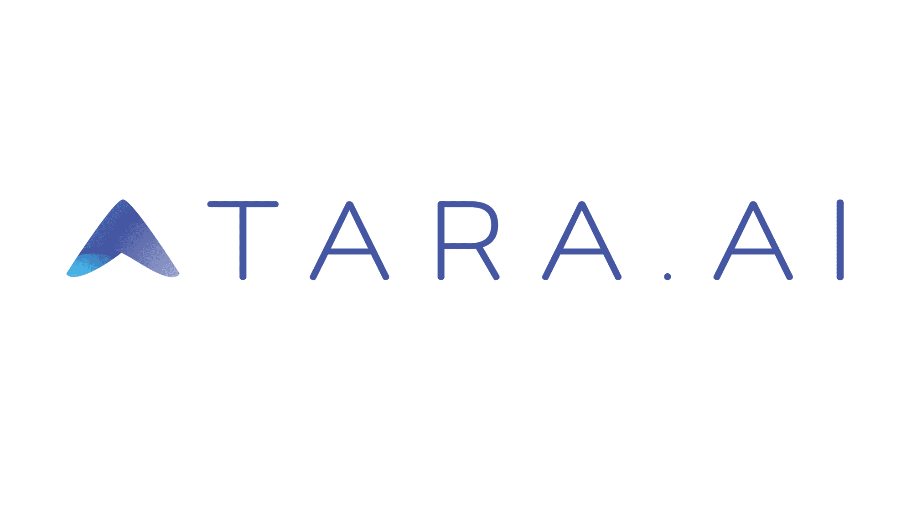

[Tara.ai's Website](https://tara.ai/)

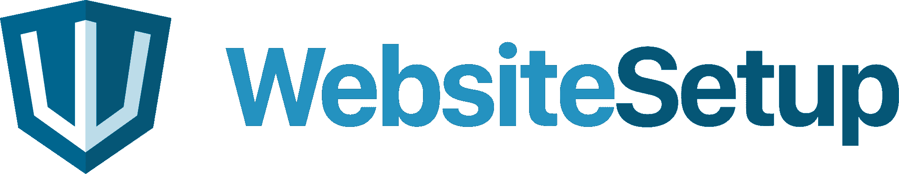

[WebsiteSetup.org's website](https://websitesetup.org)

[LoginRadius's website](https://www.loginradius.com/)

[CryptAPI's website](https://cryptapi.io/)

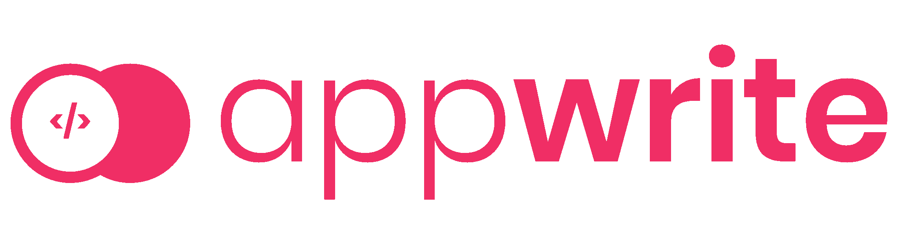

[Appwrite's website](https://appwrite.io)

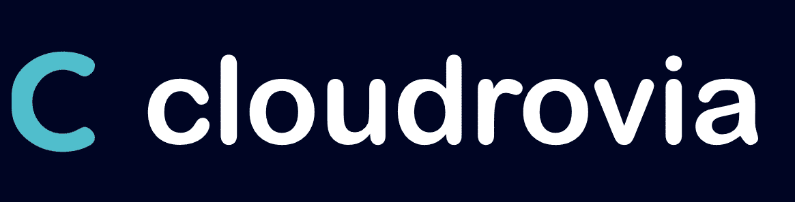

[Cloudrovia's website]( https://cloudrovia.com/)

## 

[Discourse's website](http://discourse.org)

[Auth0's website](https://auth0.com/)

[Super Mario Bros Game](https://supermario-game.com)

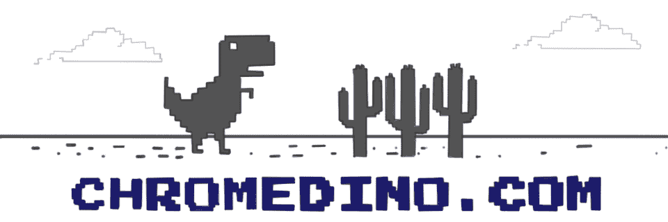

[T-Rex Dinosaur Game](https://chromedino.com/)

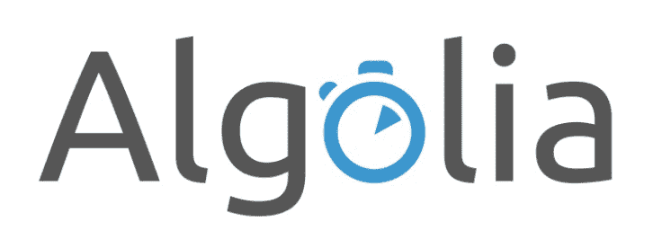

[Algolia's website](https://www.algolia.com/)

[soc.link's website](https://soc.link/)