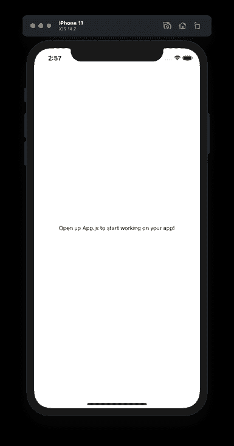
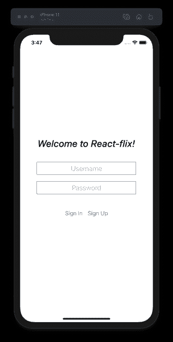
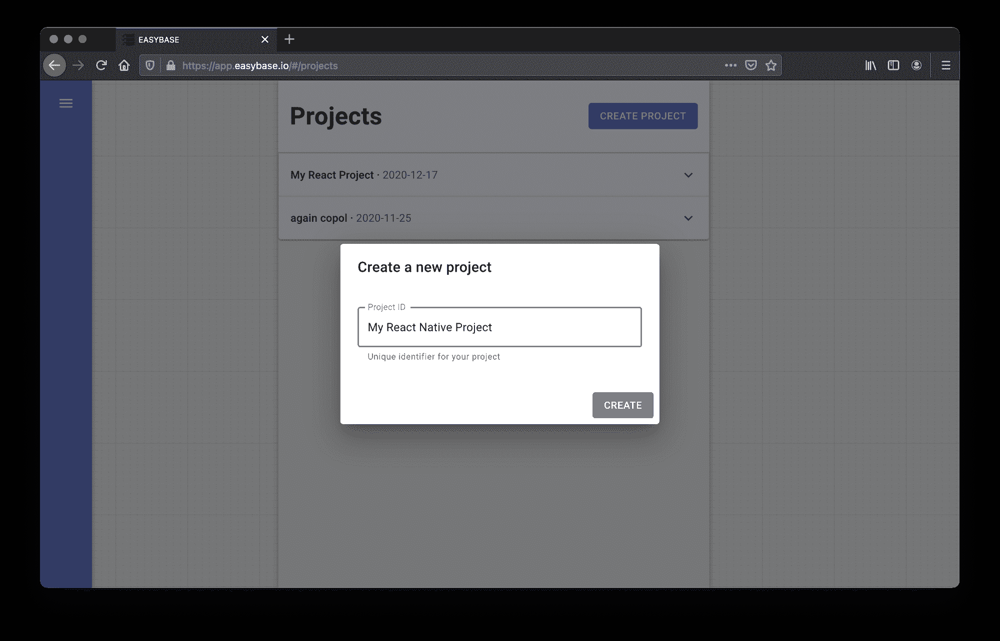
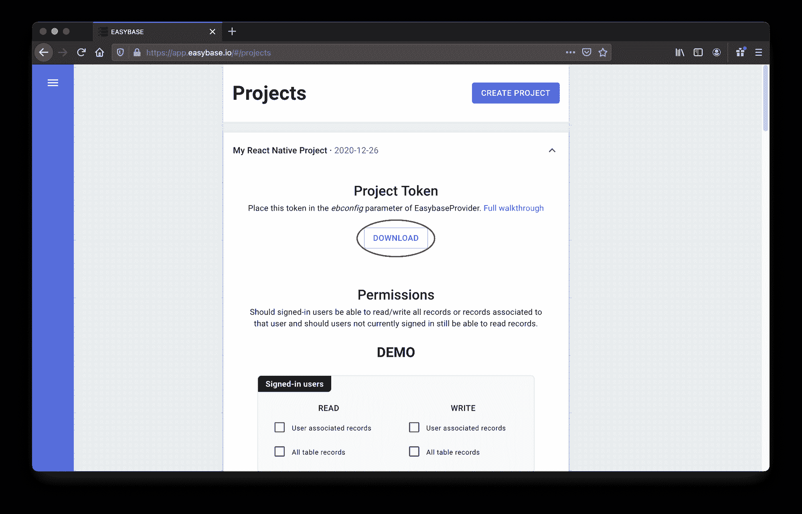
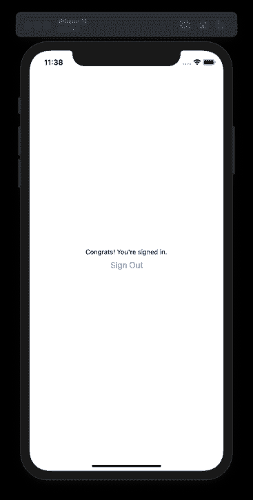
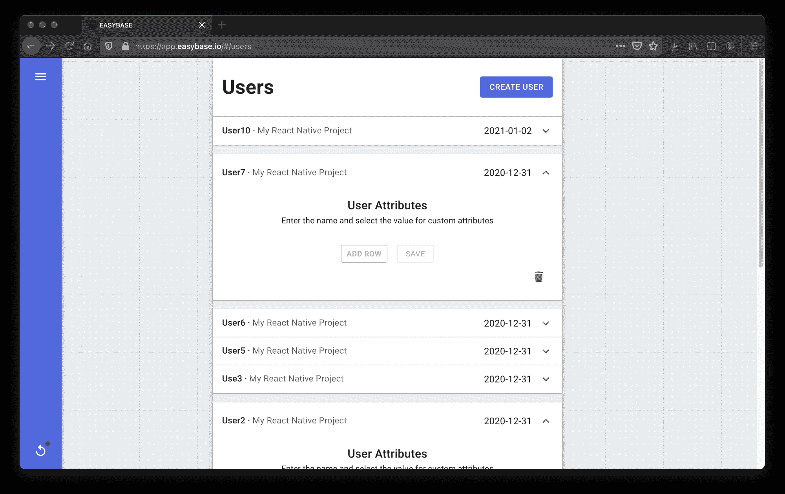

# 如何构建您的第一个无服务器 React 本地应用程序和用户认证

> 原文：<https://www.freecodecamp.org/news/build-react-native-app-user-authentication/>

React Native 已经成为移动应用程序开发领域的一个非常重要的工具。

*有什么不爱？*它很快，跨平台，挂钩到**本机**模块，并使用前端开发人员熟悉的语言和模式。

此外，无服务器技术使开发人员能够部署企业级应用**，而没有传统服务器基础设施的开销**。它消除了管理应用程序后端的管理任务，同时提高了工作效率。

这种无忧的即插即用基础设施与 React 和 React Native 等框架配合良好，因为它使个人和小型团队可以非常轻松地扩展生产应用程序，而无需开销成本。

让我们看看如何创建一个带有用户身份验证的 React 本地应用程序。然后，我将介绍如何将这个过程与无服务器数据库集成在一起。

现在，我的示例应用程序将只是一个简单的有状态用户认证的演示，但是发挥你的创造力，构建你感兴趣的**！**这个演示最终将变成一个全无服务器的协作式待办事项列表移动应用。

## 目录:

*   如何设置您的项目
*   注册/登录工作流
*   后端怎么插
*   结论

## 如何设置您的项目

在 React 项目中实现无服务器有许多不同的方法，但是我们将在这个项目中使用`easybase-react`库。这些函数是有状态的，是为 React 和 React Native 而构建的。

转到您的 React 原生项目并执行`npm install easybase-react`。

如果你不知道如何创建一个 React Native 项目，你可以通过在控制台中做`npx create-react-native-app MyNativeApp`来使用 [create-react-native-app](https://github.com/expo/create-react-native-app) 。完成后，**如上所述安装库**。

此时，您可以通过运行`npm run ios`或`npm run android`来打开您的应用程序，这取决于您想要测试的平台。你的起点看起来像这样的*:*

**

## *注册/登录工作流*

*在为我们的应用程序建立工作流时，如果用户没有登录，默认情况下应该显示这个视图。为了简洁起见，我的例子的样式非常简单，但是要有独特的样式！*

*让我们从一些基本的路由开始，这样我们就可以根据用户是否登录来区分两个不同的视图。**现在，我们只是让它自动返回`false`，直到我们实现了正确的钩子**。*

*如果用户没有登录，他们会看到登录或注册的视图。如果用户登录，我们将显示一条确认消息。*

```
*`import React, { useState, useEffect } from 'react';
import { StyleSheet, Text, View, TextInput, Button } from 'react-native';

export default function App() {
  return (
    <Router />
  );
}

function Router() {
  const isUserSignedIn = () => false;

  return (
    isUserSignedIn() ?
      <Text>Congrats! You're signed in.</Text>
      :
      <Account />
  )
}`*
```

*这个`Account`组件将包含一个**登录/注册**模板，看起来应该很熟悉。在 React Native 中，该视图可能如下所示:*

```
*`function Account() {
  const [userVal, setUserVal] = useState("");
  const [passVal, setPassVal] = useState("");

  return (
    <View style={styles.container}>
      <Text style={styles.title}>Welcome to React-flix!</Text>
      <TextInput value={userVal} onChangeText={e => setUserVal(e)} style={styles.accountInput} placeholder="Username" />
      <TextInput value={passVal} onChangeText={e => setPassVal(e)} style={styles.accountInput} placeholder="Password"/>
      <View style={{ display: "flex", flexDirection: "row", marginTop: 30 }}>
        <Button title="Sign In" />
        <Button title="Sign Up" />
      </View>
    </View>
  )
}

const styles = StyleSheet.create({
  container: {
    flex: 1,
    backgroundColor: '#fff',
    alignItems: 'center',
    justifyContent: 'center',
  },
  accountInput: {
    height: 40,
    borderColor: 'gray',
    borderWidth: 1,
    width: "75%",
    margin: 10,
    fontSize: 22,
    textAlign: "center"
  },
  title: {
    fontSize: 30,
    fontWeight: "500",
    fontStyle: "italic",
    marginBottom: 30
  }
});`*
```

*虽然有些基础，但这个视图提供了安全、功能性用户身份验证界面所需的一切。作为参考，这里有一个应用程序的截图:*

**

## *后端怎么插*

*现在，我们将本机应用程序连接到一个无服务器后端，以处理用户身份验证和令牌管理。*

*有各种各样的库旨在实现无服务器的反应和本机反应能力。我们要用的这个叫做 *Easybase* 。除了其他方面，这项服务旨在使 React + serverless 变得非常直观。*

*开发人员可以利用该服务的项目管理界面轻松有效地扩展他们的应用程序。我们将能够通过这个界面管理我们项目的用户。该服务的网络应用程序(截图如下)与`easybase-react` npm 包异常集成。*

*我选择使用这个包的原因有两个。首先，安装和配置过程非常简单，只需一个 *config* 文件。*

*第二，实现用户认证模块(如会话令牌存储和联网)会有很大的开销。组件处理大部分开销，这样我们就可以开始工作了。*

*登录到 [Easybase](https://easybase.io/) 并创建一个新表。如果您没有帐户，请快速创建一个(这是免费的)。从那里，创建一个新项目，如下所示:*

**

*然后，在这里下载您的项目令牌(我们稍后将创建一些表):*

**

*将新下载的`ebconfig.js`放在 App.js 旁边的 React 原生项目文件夹中，如下所示:*

```
*`├── android/
├── ios/
├── node_modules/
├── App.js
├── ebconfig.js <---
├── index.js
└── ...`*
```

*接下来，我们将在`App.js`中导入两件东西:*

*   *`import ebconfig from "./ebconfig"`*
*   *`import { EasybaseProvider, useEasybase } from "easybase-react"`*

*然后我们将把我们的应用程序包装在这个`EasybaseProvider`组件中，传递 *ebconfig* 作为相应的道具。这些更改将如下所示:*

```
*`import ebconfig from "./ebconfig";
import { EasybaseProvider, useEasybase } from "easybase-react";

// ...

export default function App() {
  return (
    <EasybaseProvider ebconfig={ebconfig}>
      <Router />
    </EasybaseProvider>
  )
}

// ...`*
```

*此时，我们可以通过使用`useEasybase()`钩子来访问各种无服务器应用程序功能。这包括`signIn`、`signUp`、`setUserAttributes`等功能。创建的用户及其相关属性将出现在 Easybase.io 的“用户”部分。*

*[此处](https://easybase.io/docs/easybase-react/interfaces/_reacttypes_.contextvalue.html)提供了`useEasybase`挂钩的文档。也可以在 [Github 回购](https://github.com/easybase/easybase-react)上获得信息。*

*所以我们现在可以通过用`useEasybase`钩子提供的相应功能填充按钮的`onPress`道具来完成我们的`Account`组件:*

```
*`function Account() {
  const [userVal, setUserVal] = useState("");
  const [passVal, setPassVal] = useState("");

  const { signIn, signUp } = useEasybase();

  const clearInputs = () => {
    setUserVal("");
    setPassVal("");
  }

  const handleSignInPress = async () => {
    await signIn(userVal, passVal);
    clearInputs();
  }

  const handleSignUpPress = async () => {
    const res = await signUp(userVal, passVal, {
      created_at: new Date().toString
    });
    if (res.success) {
      await signIn(userVal, passVal);
    }
    clearInputs();
  }

  return (
    <View style={styles.container}>
      <Text style={styles.title}>Welcome to React-flix!</Text>
      <TextInput value={userVal} onChangeText={e => setUserVal(e)} style={styles.accountInput} placeholder="Username" />
      <TextInput value={passVal} onChangeText={e => setPassVal(e)} style={styles.accountInput} placeholder="Password"/>
      <View style={{ display: "flex", flexDirection: "row", marginTop: 30 }}>
        <Button title="Sign In" onPress={handleSignInPress} />
        <Button title="Sign Up" onPress={handleSignUpPress} />
      </View>
    </View>
  )
}`*
```

*最后，我们必须处理在`Router`组件中使用的`isUserSignedIn`函数。幸运的是，`useEasybase`钩子也提供了与同名的**功能。只要把那个插上，我们就可以用它来进行条件渲染。***

```
*`function Router() {
  const { isUserSignedIn } = useEasybase();

  return (
    isUserSignedIn() ?
      <Text>Congrats! You're signed in.</Text>
      :
      <Account />
  )
}`*
```

*就这样，我们在 React Native 中实现了一个安全的用户认证工作流。请注意如果您关闭或重新加载应用程序，您的用户将保持登录状态，这是大多数移动平台的标准。*

### *如何添加注销按钮*

*最后，我将为已登录的用户添加一个**注销**按钮。那将需要改变当前的*恭喜*...登录用户的文本元素。*

*幸运的是，`useEasybase`钩子提供了一个同名的函数，所以我们可以如下编辑我们的`Router`组件:*

```
*`function Router() {
  const { isUserSignedIn, signOut } = useEasybase();

  return (
    isUserSignedIn() ?
      <View style={styles.container}>
        <Text>Congrats! You're signed in.</Text>
        <Button title="Sign Out" onPress={signOut} />
      </View>
      :
      <Account />
  )
}`*
```

**

*单击这个新按钮将处理当前用户的取消身份验证。这将改变您的`EasybaseProvider`的状态，现在应用程序将路由回`Account`组件，因为`isUserSignedIn()`将返回**假**。*

## *结论*

*导航到 Easybase 的“用户”部分将显示您当前的所有用户。作为参考，下面是我创建了一系列示例用户后的样子:*

**

*请注意，在该菜单中，您可以选择**删除用户**或编辑他们相应的属性。您也可以使用`setUserAttribute()`单独设置用户的属性。从那里，可以用`getUserAttributes()`函数在您的前端检索属性。*

*关于 React 和 React Native 的更多信息，请看一下 Easybase 的 React 页面。它在我的演示中还没有表达的其他主题上有一些很好的细节，但是我们将在后面讨论这些内容。*

*非常感谢您的阅读！我希望这种实现用户认证的方法能够对那些希望使用 React Native 进行软件开发的人有所帮助。*

*在我的下一篇文章中，我将介绍如何在无服务器数据库中使用这个认证工作流。该数据库将具有**用户权限**和**个人记录查询**。*