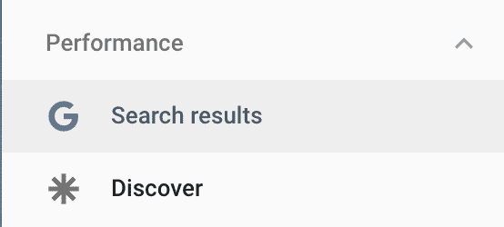
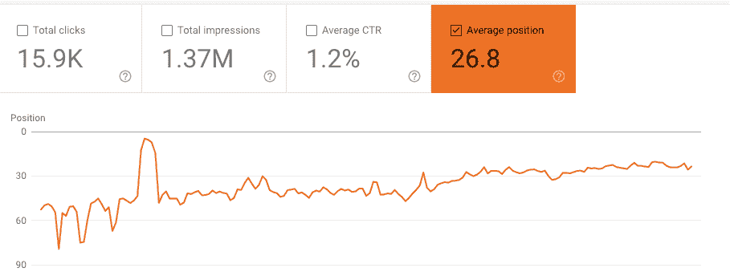
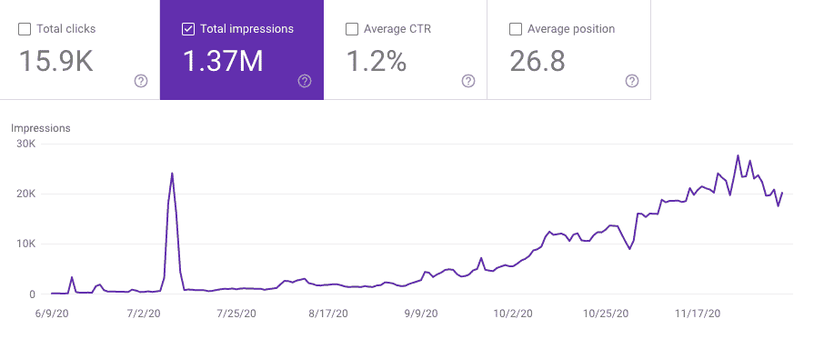
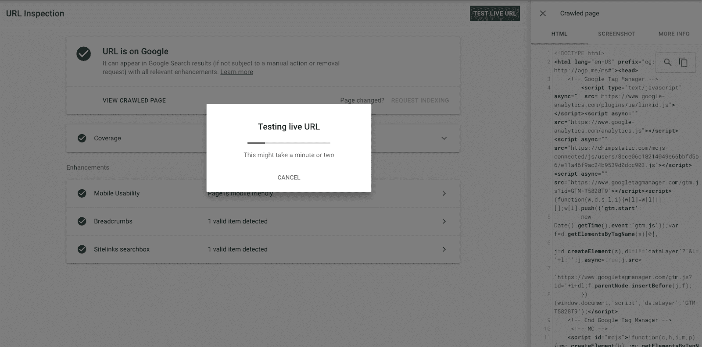
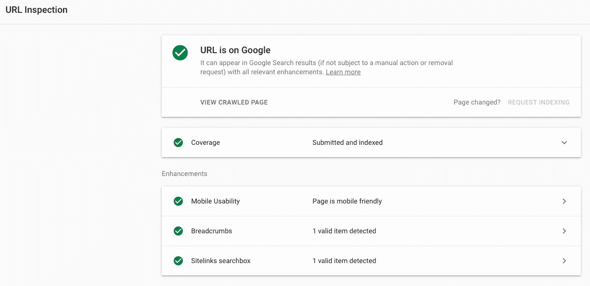

# 谷歌搜索控制台解释:什么是 GSC，如何使用它

> 原文：<https://www.freecodecamp.org/news/google-search-console-explained/>

谷歌搜索控制台是谷歌的一项网络服务，让你可以在谷歌搜索上看到你的网站和网页的索引和性能。

在一个高层次上，搜索控制台是一个强大的工具来确认你的网站是排名和谷歌可以访问你的网站。

您可以检查和设置抓取率，并查看关于您的流量在哪里登陆和您从哪里获取流量的统计数据。

控制台，像许多其他 web 开发工具一样，健壮而强大。如果你正在建立你的第一个网站，你应该花时间去理解它，尝试它，并学会利用它。

本教程将带您了解该工具的基本知识，并且可以作为一个有用的指南，帮助您在了解哪些指标对您的网站性能至关重要以及如何利用这些数据来构建更好的产品时节省时间。

在过去的六个月里，我一直生活在搜索控制台中，因为我建立了一个网站，我非常关心人们如何找到我写的内容。

在我建立这个网站之前，我并不是搜索控制台的常客。我必须了解这个工具，包括它能做什么来帮助我更好地理解我的用户和他们登陆我的网站时的意图。

关于搜索控制台的性能部分，我学到了三个重要的经验，我想把这些经验传授给你。

## 第一课:了解你的流量来源:搜索还是发现

谷歌给了你两种方式来查看人们是如何通过搜索到达你的网站的:通过搜索结果或通过发现。

“发现”(以前称为 Google Feed)是由 Google 创建的个性化内容提要，它主动向用户提供相关内容。您不能为 Discover 提名您的内容。如果谷歌认为你的网站与用户相关，谷歌会展示给人们看。

另一种类型的性能指标是“搜索结果”，它看起来要大得多。搜索结果向网站管理员显示了四条重要信息:

1.  总点击量
2.  总印象
3.  平均点击率
4.  平均位置

Discover 提供了除平均位置之外的相同信息，因为在此指标中没有相对排名位置。

当学习使用搜索控制台时，花时间通过搜索和发现的镜头来观察流量。如果您没有看到发现流量，这意味着您的内容尚未通过发现显示给用户。

创建网站或博客时，你会希望用户找到你的内容。搜索和发现是人们这样做的两种有机方式。知道有多少人通过每种方式找到你。

## 第二课:研究你的平均仓位

当我第一次开始使用搜索控制台时，我很惊讶(也很高兴)我居然有流量！随着时间的推移，如果你发布相关和有用的内容，你的点击量会增加。

随着越来越多的人找到你的网站，网站获得更多的印象，点击量会上升。

你可能会忍不住拍拍自己的背，然后就到此为止。没那么快！

如果你想被抓取和索引，你在网站上发布的每个页面都有资格出现在谷歌搜索上。

你的一些页面会表现得很好(也就是说，它们会出现在谷歌的第一页)，而其他的会出现在更靠下的位置(比如在第 12 页，没有人会看到它们)。

随着时间的推移，你会希望监控和跟踪你的平均位置，并通过制作更高质量和更相关的内容来提高你的平均位置，从而使读者受益。

这里有一个简单的策略可以看出你在一段时间内的平均位置:写一些长度、质量和对读者有用性相似的文章。

然后，在接下来的几周和几个月回来，看看哪些开始排名，他们的相对位置是什么。这种策略被评论网站、思想领袖帖，甚至在线编码学校所部署。

当我开始我的第一个网站时，我的平均仓位是 60 左右。这意味着在我的网站之前出现了 59 个其他网站。

今天，平均位置是 26.8。显然，我还有很长的路要走，但这是朝着正确方向迈出的一步。请注意这个指标，并花时间跟踪它。

*Source: https://wfhadviser.com/*

## 第三课:印象是漏斗的顶端

不管你的网站是什么类型——博客、教育、电子商务、娱乐——你都需要流量。

流量只是独特访客的另一种说法。根据你的网站所提供的内容，你可能更看重某些类型的流量:按地区、国家、用户年龄、设备操作系统等等。

但当你关注点击量和表现时，一切都始于印象。每次在搜索结果页面上显示您的网页时，都会计算一次印象。

换句话说，印象是漏斗的顶端。您将需要首先增加印象，以便增加所有其他指标。

提醒一句，我发现了艰难的道路。如果你的网站在搜索结果的下方，即使用户没有一直向下滚动，印象也是有价值的。

换句话说，谷歌计算印象的方式似乎与人计算印象的方式略有不同。用外行人的话来说(也就是说，不是技术)，印象就是你实际看到的东西。

用谷歌的话来说，印象就是当你的网站在一个结果页面上，而用户看到了这个结果页面。简而言之，滚动似乎不会影响印象计数。

## 将所有这些整合在一起:了解你的用户是如何访问你的网站来开发更好的产品的

如果你想打造一个产品，你总是需要知道你的用户是如何了解你的产品的，他们最看重的是什么。构建者从客户开始，逆向工作。

谷歌的搜索控制台是一个很好的工具，可以了解用户旅程的一个方面，更好地将你的产品、信息和价值主张与客户的需求结合起来。

您可以使用搜索控制台的“性能”部分来关注客户以及他们如何找到您。

Google 让实时测试变得很容易，这样你的反馈循环就最小化了:你可以自动或即时查看抓取的页面。

成长中的 SaaS 公司指出，搜索引擎优化是企业获取用户的核心策略之一，该公司也令人信服地指出，如果你不知道在哪里、做什么、如何或为什么测量流量，你将会失去为谁构建什么的指导。

如果你开发任何产品——一个网站，一个移动应用，或者一个企业工具——你需要知道人们是如何听说你的产品并联系到你的。

想象一下，如果你创建了一份时事通讯，但不知道你的电子邮件列表是如何随着时间的推移而增长的，也不知道你的订户最看重什么？听起来很疯狂，对吧？这类似于建立一个网站而不掌握搜索控制台。

当然，这对于任何编码者或创作者来说都是一种次优的情况。

建设者永远不会停止学习。

搜索控制台为您提供数据和可视化指导，帮助您改进网站和客户获取。通过对新的可能性感到好奇并采取行动去探索它们，你可以做得更好。

谷歌通过全程帮助指导你来强化这一点。这些绿色的圆圈和勾号表明该网站有实时页面，并且索引正确。当视觉设计帮助建造者时，这总是一个很好的加分项:)

建设者不仅索引什么是好的，以及如何改善这些趋势，而且索引什么是不好的，以便他们能够纠正。谷歌的搜索控制台，像其他在线工具一样，帮助用户看到断开的链接和错误页面，需要改进的页面，以及网站速度。

如果您正在查看一本书中的数百张纸或者大量电子邮件，或者数千个索引网页，您需要利用工具来理解您面前的数据。

搜索控制台就是这样。

它可以免费使用和快速部署。使用很重要，掌握也很关键——如果你利用它，你的产品和用户会得到更好的服务。