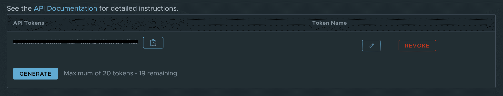

# 如何使用 Terraform 管理波前资源

> 原文：<https://www.freecodecamp.org/news/how-to-manage-wavefront-resources-using-terraform/>

在我之前的[文章](https://www.freecodecamp.org/news/microservice-observability-metrics/)中，我写了关于指标以及它们如何帮助您获得对硬件和软件系统运行状况的可见性。

**Wavefront** 是一个高性能流分析平台，支持 3D 可观察性(指标、直方图、轨迹/跨度)。

它可以扩展到非常高的数据接收速率和查询负载。您可以从整个应用程序堆栈中的许多服务和来源收集数据，并可以查看 Wavefront 收集的早期数据的详细信息。

Terraform 是一个开源的“基础设施即代码”工具，由 HashiCorp 创建。

它是一个*声明性*编码工具，使开发人员能够使用一种称为 HCL (HashiCorp 配置语言)的高级配置语言来描述基础设施的理想“最终状态”。

这个基础设施可以在云上，也可以在内部。然后，它生成一个达到最终状态的计划，并执行该计划来创建基础结构。

在本文中，我们将了解如何使用 Terraform 编写代码，在 Wavefront 中自动构建仪表板和警报。这对于在您的团队中维护 DevOps 文化非常有帮助，在这种文化中，所有的监控基础设施都是以代码的形式维护的，并被签入到您的版本控制系统(如 GitHub)中。


## 如何安装 Terraform

根据您的操作系统，Terraform 的安装说明[会有所不同。本文介绍了在 macOS 上安装它的说明。](https://learn.hashicorp.com/tutorials/terraform/install-cli)

在 macOS 上安装它的推荐方法是使用家酿软件包管理器。

### 安装地形

验证您是否安装了自制软件，如下所示:

```
$ brew --version

Homebrew/homebrew-core (git revision fe68a; last commit 2020-10-15)
Homebrew/homebrew-cask (git revision 4a2c25; last commit 2020-10-15)
```

如果没有，您可以使用以下命令安装 Homebrew:

```
$ /bin/bash -c "$(curl -fsSL https://raw.githubusercontent.com/Homebrew/install/master/install.sh)"
```

接下来，使用以下命令安装 Terraform:

```
$ brew tap hashicorp/tap
$ brew install hashicorp/tap/terraform
```

### 验证 Terraform 安装

要验证 Terraform 安装是否正确，请打开另一个终端会话，并尝试使用 Terraform 命令。

```
$ terraform --help

Usage: terraform [global options] <subcommand> [args]

The available commands for execution are listed below.The primary workflow commands are given first, followed byless common or more advanced commands.
```

## 如何获取 API 令牌

要允许 Terraform 访问您的 Wavefront 安装，您需要为其提供一个访问令牌。此令牌可以在您帐户的 API 令牌部分找到。

转到*齿轮图标>账户名称> API 访问*



Getting your Wavefront API Token

## 如何设置地形项目

首先，为 Terraform 项目创建一个新文件夹:

```
$ mkdir wavefront-terraform
```

一个普通的地形项目包含 3 个主要文件:

1.  **versions.tf** —这包含指定要使用的插件版本的 Terraform 提供者声明
2.  **variables.tf** —它包含了您可以在主 Terraform 代码中引用的变量
3.  **main.tf** —顾名思义，它包含构建资源所需的实际代码

在项目文件夹中创建一个 **versions.tf** 文件，并添加以下代码: