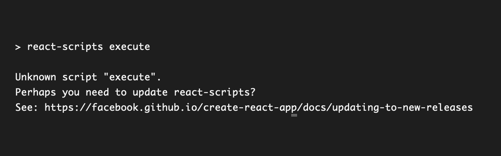
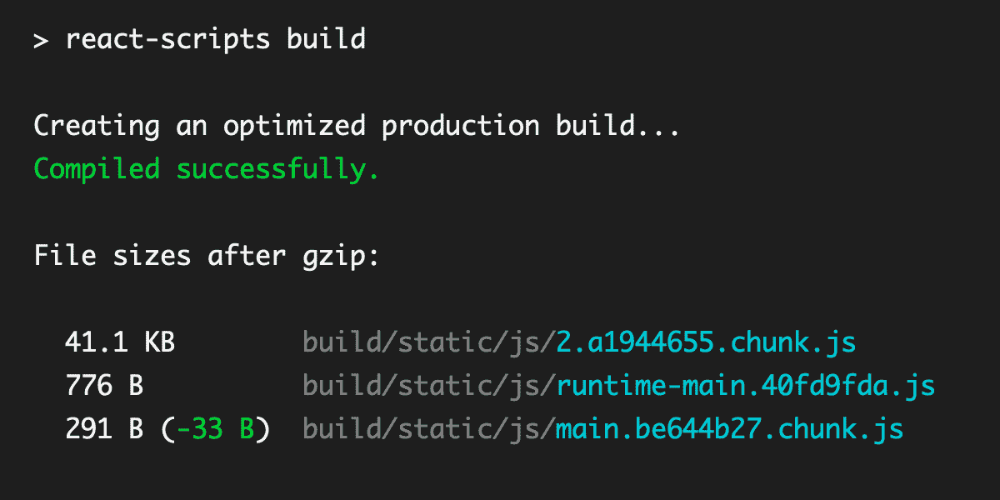
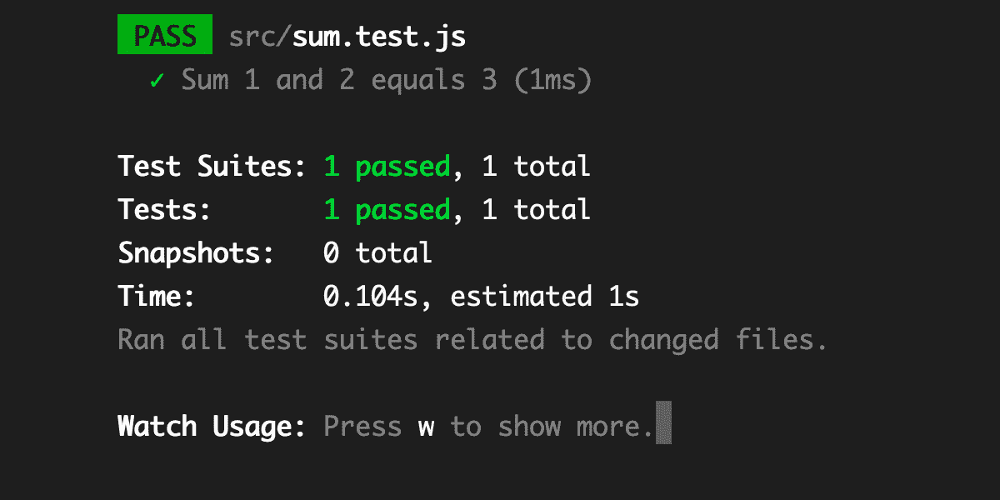

# React 脚本启动命令–创建-React-应用程序 NPM 脚本解释

> 原文：<https://www.freecodecamp.org/news/create-react-app-npm-scripts-explained/>

创建一个 React 应用程序需要你设置一些构建工具，比如 Babel 和 Webpack。这些构建工具是必需的，因为 React 的 JSX 语法是浏览器不理解的语言。

要运行 React 应用程序，您需要将 JSX 转换成浏览器能够理解的普通 JavaScript。

[Create React App (CRA)](https://github.com/facebook/create-react-app) 是一款创建单页面 React 应用的工具，由 React 团队官方支持。

该脚本生成启动 React 应用程序并在浏览器上运行它所需的文件和文件夹。这使您可以专注于编写应用程序，而不必担心构建配置。

## create-react-app 使用的依赖项

尽管在生成的`package.json`文件中你看不到 Babel 或 Webpack 被列为依赖项，但 CRA 仍然在幕后使用 Babel 和 Webpack。只是这些配置在 [`react-scripts`包](https://github.com/facebook/create-react-app/tree/master/packages/react-scripts)里对你是隐藏的。

当您查看 react-scripts 的`package.json`文件时，您会看到让 react 在浏览器中工作所需的所有包。它有 58 个包装，从第 31 行到第 88 行:

[facebook/create-react-appSet up a modern web app by running one command. Contribute to facebook/create-react-app development by creating an account on GitHub.facebookGitHub](https://github.com/facebook/create-react-app/blob/master/packages/react-scripts/package.json#L30)

那可是好多包啊！让我们稍微分解一下，了解一下这些包是用来做什么的。

*请注意，本文是使用 Create React App 版本 4.0.1 作为参考编写的。这篇文章将帮助您了解在使用 Create React App NPM 脚本时会发生什么。*

### 巴比伦式的城市

Babel 的主要目的是让你的代码可以被老版本的浏览器阅读。自 ES 2015 发布以来，浏览器在实现新的 JavaScript APIs 和功能方面取得了缓慢但稳定的进展。

Chrome 和 Safari 等最先进的浏览器可能支持新的 JavaScript 版本，但 JSX 是一个 React-only 功能，不是 ES 版本的一部分。

Babel 将您的现代 JavaScript 代码转换为旧版本，然后添加 *polyfills* ，这是一段代码，实现了浏览器中缺少但您的应用程序需要的功能。

### 埃斯林特

ESLint 是一个 JavaScript linter，它会扫描你的代码并标记任何代码错误。如果您有任何错误，库将从控制台警告您。它还可以很好地与现代代码编辑器(如 VSCode)配合使用。

### 玩笑

Jest 是脸书开发的一个测试库，与 React 配合得非常好。Jest 的依赖项允许您为您的应用程序编写测试脚本，而不必安装另一个测试库。

### PostCSS

PostCSS 是一个 JavaScript 插件，用于转换你的 CSS。PostCSS 插件可以 lint 你的 CSS，支持变量和 mixins 语法，transpile 未来的 CSS 语法，以及更多的东西，这取决于它的配置。

### 网络包

Webpack 是 JavaScript 的一个模块捆绑器，它把应用程序需要的所有东西放在一起。这个库还可以在你的代码上运行任务，比如运行 Babel、Jest、ESLint 和 PostCSS。

既然您已经知道了依赖项的用途，让我们继续理解`react-scripts`在幕后真正做了什么。

## 反应脚本做什么

react 脚本是运行构建工具的简单脚本，这些工具是通过编程将 React JSX 语法转换成普通 JavaScript 所必需的。

该软件包提供了四个脚本:

```
"scripts: {
  "start": "react-scripts start",
  "build": "react-scripts build",
  "test": "react-scripts test",
  "eject": "react-scripts eject"
},
```

CRA generated scripts command

当您运行其中一个脚本时，将执行 [/bin/react-scripts.js](https://github.com/facebook/create-react-app/tree/master/packages/react-scripts/bin) 来启动该流程。这个脚本将检查您传递到调用中的参数。它只接受开始、构建、测试和弹出参数。

您传递的任何其他参数都将导致脚本向日志中返回未知脚本:



CRA unknown script console output

当你传递一个有效的参数时，它将运行位于 [`/scripts`文件夹](https://github.com/facebook/create-react-app/tree/master/packages/react-scripts/scripts)中的脚本。我们先来看一下`start.js`脚本。

## react-scripts 启动过程如何工作

使用`start`参数，NPM 将开始为您的 React 应用程序提供一个开发服务器的过程。以下是该脚本的任务列表:

*   为 Node 和 Babel 设置构建环境为`development`
*   确保为构建过程读取环境变量
*   验证项目中安装的包没有过期
*   检查代码是否在 TypeScript 中
*   导入流程所需的包，主要是与 Webpack 相关的模块
*   检查可用端口和主机 IP，默认为 0.0.0.0:3000
*   运行编译器并监听来自 Webpack 的任何消息。Webpack 将负责使用 Babel、ESLint 和任何其他工具来准备代码
*   当 Webpack 运行时，脚本将打开您的浏览器并启动开发服务器

由 [WebpackDevServer](https://github.com/facebook/create-react-app/blob/8bf050aa7c16078fed5e51ac8388d6100c29e105/packages/react-scripts/scripts/start.js#L37) 创建的开发服务器也将为您的 JavaScript 文件中的更改创建一个监听器。当您做出更改并保存 JavaScript 文件时，开发服务器将重新编译您的代码并快速刷新浏览器。

## 如何使用 react-scripts 构建命令

`build`命令将开始为您创建一个生产就绪的 React 应用程序。除了将构建环境设置为`production`之外，它通常执行与`start`命令相同的步骤。

该脚本将运行 [`build`](https://github.com/facebook/create-react-app/blob/8bf050aa7c16078fed5e51ac8388d6100c29e105/packages/react-scripts/scripts/build.js#L152) [函数](https://github.com/facebook/create-react-app/blob/8bf050aa7c16078fed5e51ac8388d6100c29e105/packages/react-scripts/scripts/build.js#L152)，而不是检查可用的端口和运行开发服务器，这将把所有单独的文件捆绑成一个`bundle.js`文件。生产版本还将确保您的代码得到优化和精简，以确保它具有最佳性能。

如果您之前已经运行过`build`命令，脚本将获取您当前的文件大小，并与下一次构建进行比较。它将向您显示文件大小发生了多大的变化:



React shows comparison after gzip in the console

这个命令的最终输出可以在`build/`文件夹中找到，它是在项目的根目录下生成的。

## 如何使用 react-scripts 测试命令

`test`命令将运行您使用 [Jest](https://jestjs.io/) 编写的任何测试脚本。您的测试将在节点环境下运行。Jest 将在交互式观察模式下运行，这意味着每次保存文件时，它都会重新运行测试，就像`start`命令如何重新编译代码一样。

您可以将您的测试文件保存在`src/`文件夹中的任何地方，脚本将找到并执行任何带有`.test.js`或`.spec.js`扩展名的文件。它还会运行`__tests__/`文件夹下的任何`.js`文件。

您可以从终端看到测试结果:



Console log of react-scripts test command result

请记住，CRA 的测试命令只包括在稳定的环境下测试您的组件和业务逻辑。要在浏览器中运行端到端测试，您需要使用另一个测试库。

## 如何使用 react-scripts 弹出命令

最后一个命令`eject`，用于移除对`react-scripts`的依赖，并公开构建工具和配置供您修改。

来自`react-scripts`的所有配置文件将被复制到你的项目根目录的`config/`文件夹中，运行构建的脚本将被复制到`scripts/`文件夹中。依赖项也将被移动到您的根的`package.json`文件中。

该命令是单向操作。一旦你从 CRA 设定中被驱逐出去，你就不能撤销它。如果您已经将代码提交到一个像 Git 这样的源代码管理系统中，那么您可以使用`git checkout`或`git reset`来撤销更改。

通常，您不需要运行这个命令，因为 CRA 已经提供了适合中小型项目的合理配置。如果你有兴趣了解更多，我在这里写了一篇关于退出 React 应用的帖子:

你应该退出你的 Create React 应用吗？

## 结论

随着越来越多的人使用 CRA，开发团队将会收到更多关于该工具在实际项目中如何使用的反馈。开发团队所获得的见解将确保 CRA 能够获得最新的工具，并拥有构建 React 应用的最佳实践。

感谢您的阅读。我希望这篇文章能帮助你理解 CRA 是如何在幕后工作的🙂

**更多关于 React:**

*   在 React 组件中应该使用箭头函数吗？
*   [传道具的时候应该使用扩散属性吗？](https://sebhastian.com/react-spread-props/)
*   [了解 React 上下文 API](https://sebhastian.com/react-context-api/)