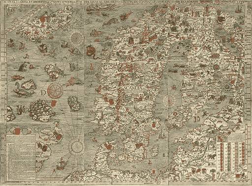
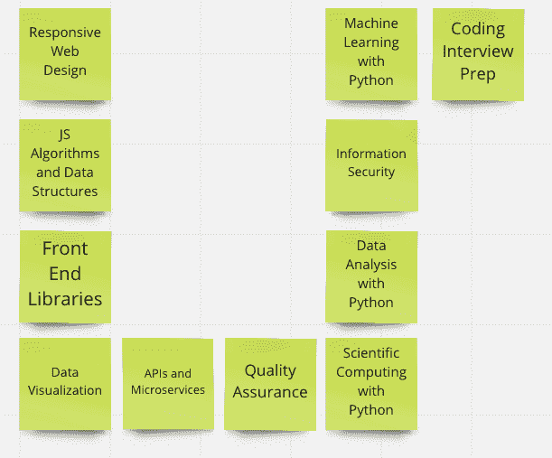
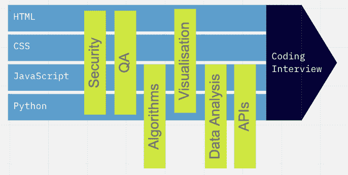
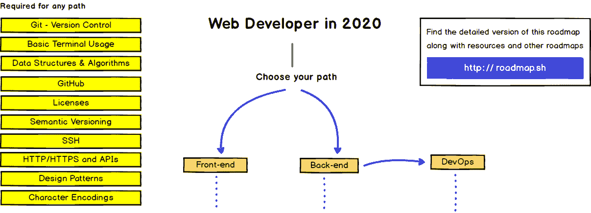
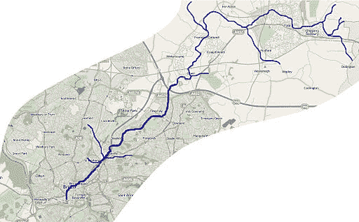

# 有人有地图吗？Web 开发路线图如何帮助您学习编码

> 原文：<https://www.freecodecamp.org/news/how-to-create-a-map-for-web-development/>

我是一个音乐剧迷。Covid 之前在伦敦西区看的最后一场戏是《亲爱的埃文·汉森》。这是一个关于青少年自杀、育儿和社交媒体的节目(听起来很棒，是吧？).

节目以两个母亲唱的一首歌开场，问谁有地图。

> 有人有地图吗？
> *有没有人可能碰巧知道这到底是怎么做到的？*
> *我不知道你能不能分辨出*
> *但这是我假装知道的*

地图是非常神奇的技术。它们提供了一种了解你知道什么和不知道什么的方法。

作为导航工具，它们让我们能够绘制和规划路线。你可以看到旅程的哪些部分将更具挑战性，哪些你了解得不够。

作为讨论的工具，它们有助于减少混乱和增加清晰度。你说的到底是哪座山？那有多远？到那里需要多长时间？

作为发现的工具，它们有助于显示哪里需要更多的调查。在古代，龙或海怪经常被画在不为人知的部分。我们的卫星图像更准确，但也可能让我们认为我们什么都知道。

Carta Marina - map of the Nordic countries with sea monsters to the west

歌曲中的妈妈们想要一些方法来导航育儿，来识别平坦的道路和崎岖的地形。

那么这和 web 开发有什么关系呢？

## 免费代码营课程

freeCodeCamp Certifications

freeCodeCamp 的课程非常棒。它概述了当今 web 开发的最重要的方面。

我在上面的图片中放置每个证书的方式表明它们是独立和不同的。事实上，它们重叠并贯穿使用核心知识。

通读课程名称和标题。他们引出了重点——前端、后端、算法、数据、HTML、CSS、JavaScript、Python 等等。合在一起看，这些画出了空间的地图。

Possible map of the FCC curriculum

周围还有其他地图。卡姆兰·艾哈迈德一直在更新的网络开发者路线图相当壮观。它们的优势在于看起来更像地图，但它们会让人感觉势不可挡。

## 地图的目的是什么？

几年前，我看到了 Kamran 早期版本的路线图，它们让我感到有些不知所措。要成为一名开发人员，我需要了解的东西太多了。至少，那是它的感觉。

不过，随着时间的推移，我开始将它与翻阅地图集或谷歌地图进行比较。我喜欢看到当你穿越河流或山脉时，国家是如何变化的。我喜欢追踪遍布各大洲的河流，想象在山脉间漫步。

我不会因为我没有去过所有这些国家或者我记不住每个国家或每个首都而感到不足。相反，通过大致了解各个国家的位置以及它们是如何融合在一起的，我感到充满力量和兴奋。

Map of the world

我住在布莱顿，如果我想和一个朋友去喝咖啡，那么一张街道地图会有用得多。

Street map of central Brighton

但是，如果我们要去乡下散步，例如追踪一条河流，那么还需要另一种类型的地图。

Map of the River Frome

我发现这对于任何学习项目都是一样的。对于 web 开发，您可以使用已经存在的地图(如 freeCodeCamp 课程或 Kamran 的地图),也可以开始开发自己的地图。

就像看国家一样，你可以缩小来看主要部分是如何结合在一起的。在这个层次上，你可以看到事物是如何组合在一起的。

在这里，我们有像“前端”或“质量保证”这样的大而全的主题。我们不需要知道关于这些话题的所有事情，但是我们可以看到它们与其他话题的关系。

就像观察城市一样，你可以放大观察某项技术是如何工作的。JavaScript 是如何工作的？语法是什么？有什么规律和模式？

就像追踪河流一样，您可以看到一个实践或惯例是如何在前端、后端以及两者之间的任何地方被处理的。

在这里，我们可能会考虑数据如何在 web 应用程序的不同部分之间流动。我们可以想象数据从用户到前端，到数据库，再返回的旅程。

## 如何成为一名装备精良的探险家

我是一名自学成才的开发人员。在我学习生涯的早期，我会听到一些有趣、酷或新技术的传闻，然后一头扎进去。我会读书、做教程和构建小的示例项目。但是，他们在我心目中并没有联系在一起。

继续地图的比喻，我被随机传送到一个城市，探索然后再离开。多年来，我对许多城市有了想法，但不知道它们如何融入国家，以及河流和风景如何将它们联系在一起。

只有当我有了空间的地图，我才明白我的知识是如何组合在一起的。我能看到我理解上的差距，并把我的努力引向正确的方向。

我意识到我不需要探索整个世界，但我可以意识到外面有什么。

## 你呢？

您在开发过程中使用了哪些地图来帮助您？你是否在后端技术上画了一条龙，并决定你不想接近它们？或者也许有一只海怪在 CSS 或算法上盘旋？

优秀的开发者总是在学习。他们正在研究他们的地图，并决定他们下一步要探索的地方。

你不必了解整个世界，但是知道你知道什么(和不知道什么)可以帮助你的技能更上一层楼。