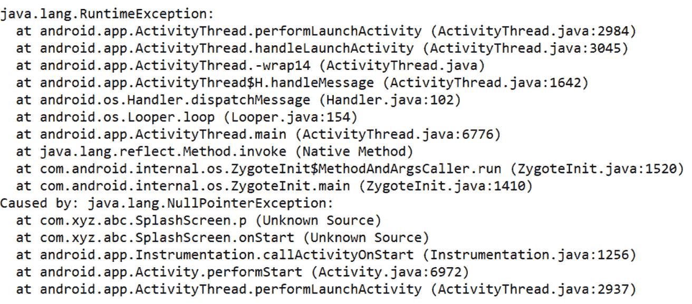
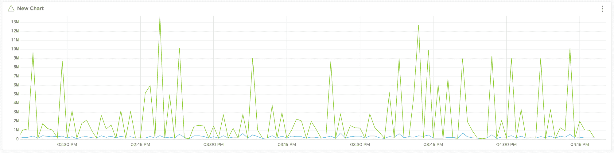
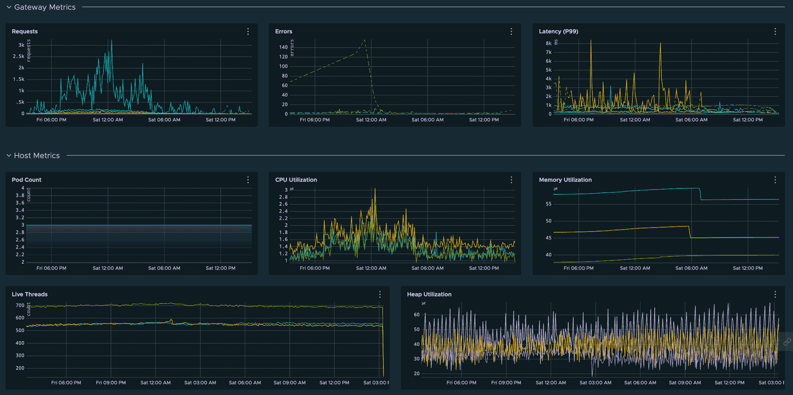

# 如何使用指标来监控您的微服务

> 原文：<https://www.freecodecamp.org/news/microservice-observability-metrics/>

在我之前的[文章](https://www.freecodecamp.org/news/how-to-handle-logs-in-microservices/)中，我谈到了日志的重要性以及结构化和非结构化日志记录的区别。

日志很容易集成到您的应用程序中，它们使您能够以字符串的形式表示任何类型的数据。

另一方面，度量是数据的数字表示。这些通常用于计算或测量一个值，并在一段时间内进行汇总。

指标让我们深入了解系统的历史和当前状态。因为它们只是数字，我们也可以用它们来进行统计分析和预测系统的未来行为。

您还可以使用指标来触发警报，并通知您系统行为中的问题。

# 日志与指标

## 日志和指标的格式

日志表示为字符串。它们可以是简单的文本、JSON 有效负载或键值对(就像我们在结构化日志中讨论的那样)。

典型的日志条目如下所示:

```
[2020-09-27T18:54:41,500+0530]-[ERROR]-[InventoryValidator]-[13] Exception in fetching product information - Product Not Available
```

指标用数字表示。它们测量一些东西(如 CPU 使用率、错误数量等)，本质上是数字。

典型的指标如下所示:

```
{class=InventoryValidator, exception=Product Not Available, timestamp=1609306200}
```

## 日志和指标的解析

日志包含高分辨率数据。这包括关于事件的完整信息，可用于关联事件通过系统的流程(或路径)。

如果出现错误，日志包含异常的整个堆栈跟踪，这允许我们查看和调试来自下游系统的问题。



A log entry showing the stacktrace of an error

简而言之，日志可以告诉你 **在某一时刻系统中发生了什么** 。

指标包含低分辨率数据。这可能包括参数计数(如请求、错误等)和资源度量(如 CPU 和内存利用率)。



A Metric showing number of hits to a service

简而言之，指标可以给你 **在某一时刻系统中发生** 的事情的计数。

## 日志和指标的成本

存储日志的成本很高。日志的存储开销也会随着时间的推移而增加，并且与流量的增加成正比。

度量具有恒定的存储开销。度量的存储和检索成本不会随着流量的增加而增加太多。然而，它依赖于我们用每个指标发出的变量的数量。

# 度量基数

指标由两条关键信息确定:

*   公制名称
*   称为标记或标签的一组键值对

这些值的排列提供了度量的基数。例如，如果我们正在测量一个有三台主机的系统的 CPU 利用率，该指标的基数值为 3，可以有以下三个值:

```
(name=pod.cpu.utilization, host=A)
(name=pod.cpu.utilization, host=B)
(name=pod.cpu.utilization, host=C)
```

类似地，如果我们在度量中引入另一个标记来确定主机的 AWS 区域(比如，`us-west-1`和`us-west-2`)，我们现在将得到一个基数为 6 的度量。

# 度量的类型

## 黄金信号

黄金信号是监控系统整体状态和识别问题的有效方法。

*   **可用性:**从客户端的角度衡量系统的状态(例如，总请求的错误百分比)。
*   **运行状况:**使用定期 pings 测量系统的状态。
*   **请求速率:**传入系统请求的速率。
*   **饱和度:**系统的空闲或负载程度(例如，队列深度或可用内存)。
*   **利用率:**系统有多忙(比如 CPU 负载或者内存使用情况)。这用百分比表示。
*   **错误率:**系统中产生错误的比率。
*   **潜伏期:**系统的反应时间，通常以第 95 或 99 百分位来衡量。

## 资源度量

默认情况下，基础设施提供商(AWS CloudWatch 或 Kubernetes metrics)几乎总是提供资源指标，并用于监控基础设施的健康状况。

*   **CPU/内存利用率:**系统核心资源的使用情况。
*   **主机数量:**运行您的系统的主机 pod 的数量(用于检测由于 pod 崩溃而导致的可用性问题)。
*   **活动线程:**服务中产生的线程(用于检测多线程中的问题)。
*   **堆使用情况:**堆内存使用情况统计(有助于调试内存泄漏)。

## 业务指标

业务指标可用于监控与服务中核心 API 或功能的细粒度交互。

*   **请求速率:**对 API 的请求速率。
*   **错误率:**API 抛出错误的比率。
*   **延迟:**API 处理请求所花费的时间。

# 指标的仪表板和警报

由于指标存储在时间序列数据库中，因此针对它们运行查询来测量系统状态会更加高效和可靠。

您可以使用这些查询来构建仪表板，以表示系统的历史状态。



A Wavefront dashboard with some important metrics

它们还可以用于在系统出现问题时触发警报(例如观察到的错误数量增加或 CPU 利用率突然激增)。

由于它们的数字性质，我们还可以创建复杂的数学查询(例如过去 Y 分钟内的 X%错误)来监控系统健康状况。

然而，处理指标的最大挑战是决定基数的正确数量，使指标有用，同时保持成本在控制之下。

发出太多的指标，或者维度太多的指标，会导致存储和处理成本的增加。您需要选择一个最小基数，这个基数足以给出系统的一个高层次的描述。

# 如何使用日志和指标

日志和度量各有利弊。然而，在任何生产系统中，我们需要同时使用日志和指标来有效地监控系统和调试任何问题。

指标通常是系统健康状况的第一线。让我们以亚马逊这样的电子商务应用程序为例。这种用例最重要的指标是成功和失败订单的总数。

在正常情况下，失败订单数量的指标将保持为零或某个非常小的数字。如果系统中存在导致订单突然开始失败的问题，此指标将显示数量增加。

您可以在两个指标的组合上创建一个*警报*——订单总数和失败订单。这将允许您在失败订单的百分比超过某个阈值(比如 5%)时发送通知。

一旦您收到订单失败的通知，您就可以参考日志来查找失败的原因。日志将包含导致失败的错误消息，以及可以确定失败根本原因的详细堆栈跟踪。

# 结论

在本文中，我们看到了指标和日志之间的区别，以及指标如何帮助我们更有效地监控系统的健康状况。使用 Wavefront 和 Grafana 等监控软件，指标还可用于创建仪表板和警报。

还需要协调使用度量和日志来准确地检测和调试问题。

谢谢你一直陪着我。希望你喜欢这篇文章。你可以在 LinkedIn 上和我联系，我经常在那里讨论技术和生活。也看看我在[媒体](https://medium.com/@theawesomenayak)上的一些其他文章。快乐阅读🙂