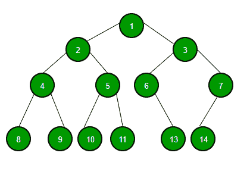

# React 服务器组件说明

> 原文：<https://www.freecodecamp.org/news/react-server-components/>

上周，React 团队发布了一个名为 React 服务器组件(RSC)的新功能。在本文中，我将向您介绍我对 RSC 几个方面的看法。

## 我不能在服务器上运行 React 吗？

是的，你可以。react 使用`react-dom/server`包支持服务器端渲染已经有很长时间了，它是 React 组件中静态 HTML 的 React 渲染器。

然而，请注意`react-dom/server`有一个简单的工作:它获取 React 树，并将其转换成静态 HTML 标记。

您必须重新水合状态(使用`ReactDOM.hydrate`)，使用客户端 JavaScript 添加任何交互性，并自己处理导航、缓存和其他一百万件事情。

像 Next.js 这样的框架已经为你做了很多繁重的工作，但那是以后的事了。

## 那么 React 服务器组件与服务器端呈现有什么不同呢？

服务器组件不是满的 SSR。将 React 网站想象成如下所示的组件层次结构:

让我们用 Next.js 作为 SSR 的例子，因为它是 React 最常见的 SSR 框架。Next.js (SSR)使您能够执行以下操作:

1.  不使用 JS 完成站点的静态导出
2.  每页部分静态导出(实验性 Next.js 特性)
3.  完成树的 SSR(然后再水化，等等)
4.  使用在客户端上呈现为 React 模块的动态导入来拆分组件。
5.  使用在服务器上作为 React 模块呈现的动态导入拆分组件。

你能猜出这里少了什么(或者更确切地说是*不是*少了什么)吗？在“从下一个静态导出”中，您不能静态导出组件，除非您为它创建了一个页面。

即使这样做，您也失去了从某些用户操作触发动态数据更新的能力(除非您使用另一个后端 API 服务器和客户机，使 UI 非 SSR)。

现在可能很难看到，但是 React 服务器组件填补了这个空白。再次考虑上图和上述 5 点:

1.  完全静态导出意味着上图中的所有节点都是没有 JS 的完整 HTML 文档。现在把`1`节点看作一个页面，假设有多个这样的根，所有的页面都是完全基于 HTML 的。
2.  部分静态导出意味着只有单个根(单个页面)是静态 HTML(本例中为`1`)
3.  完整的 SSR 意味着整个网站(或页面)每次按需呈现。这包括从上到下渲染页面，然后用 React 重新水合页面(如果你愿意，可以在*昂贵的*位置添加少量缓存)
4.  使用在客户机上作为 React 模块呈现的动态导入来拆分组件——这意味着一些节点(比如`4`和`7`)将不会在服务器上呈现，它们的组件的原始 JS 代码将通过网络发送，并像常规的客户端 JS React 组件一样运行。因为`4`和`7`没有在服务器上呈现，这也自动适用于它们的子节点(8，9，14)。
5.  使用在服务器上作为 React 模块呈现的动态导入来拆分组件——这是最接近 RSC 的方法。在这里，我们将组件代码分成不同的包(块)，在服务器上呈现它，并仅在客户端请求时(例如，在搜索字段中键入或单击按钮)通过网络发送它。

所以现在的问题变成了，RSC 和 Next.js 动态导入在 server 上渲染有什么不同？

## RSC 与服务器上呈现的动态导入

到目前为止，服务器上呈现的动态导入总是被下载并作为常规的 React 组件使用。这意味着您需要在获得的动态块上花费一些 CPU 周期，并将其放入客户端 React DOM。

用于客户端的 React 服务器组件根本不是组件。他们是别的什么东西。

首先，您的 React 服务器组件只能更新 UI 的一小部分(组件)。它们不同于典型的 SSR，因为它们从不在第一次加载时发送静态 HTML。

如果您使用 React 而不使用 SSR，而是使用 RSC，那么您的第一次加载将与常规客户端 React 看起来非常相似(没有 HTML 内容)。

让我们考虑一个应用程序，它使用搜索栏搜索电影，链接到你后端的数据库。假设搜索结果实际上是一个 React 服务器组件，而不是一个常规组件。对于常规组件，可能会发生以下情况:

1.  一旦输入，就会向某个远程 API 发出一个`fetch`请求，请求 JSON 有效负载。
2.  一旦获得数据，就将其解析为 JSON，并让它做出反应。
3.  React 呈现来自 JSON 数据的结果组件，并显示电影信息。

很简单。使用 RSC，将会发生以下情况:

1.  向您拥有的能够进行 RSC 渲染的后端发出网络请求。
2.  组件呈现在服务器上(上面的第 2 步和第 3 步)，现在您会收到一个非 JSON/非 HTML 格式的数据静态标记构建(将来可能会改变)
3.  前端将这个标记呈现为一个*静态 UI* (重要:不是一个 React 组件)。这节省了前端组件的额外处理。

在服务器上呈现动态导入，嗯，它没有多大意义，因为你的客户端不能告诉你的“动态导入”块来呈现一个依赖于状态的 UI。这是因为动态导入只是出于性能原因。

当您使用 RSC 时，还有许多事情需要注意:

1.  您不能让您的服务器组件具有交互性(因为它们只是大量的 UI 更新)
2.  但是，您可以在服务器端组件中包含客户端组件，这些组件可以是交互式的，并且会像您所期望的那样呈现。
3.  您的服务器 UI 会自动与客户端状态同步，因为您在自己更新部分 UI 时不会“破坏和创建”组件——React 会为您做到这一点。

## 结论

仅此而已！希望这篇文章能帮助你更清楚地了解 RSC。这项技术是新的，也可以与 Next.js 这样的框架集成。让我们看看未来会怎样。

想了解更多？React 团队有一个非常好的 57 分钟的官方视频，深入研究了 RSC，包括演示。你可以点击查看[。](https://www.youtube.com/watch?v=TQQPAU21ZUw)

如果你喜欢这篇文章，你可以在 [twitter](https://twitter.com/mehulmpt) 上关注我，了解更多类似的内容:)