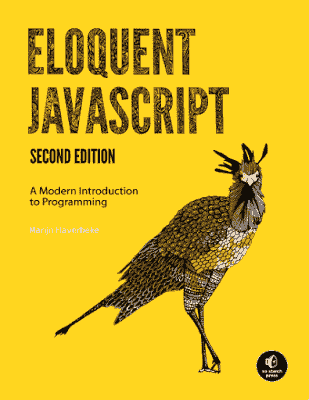
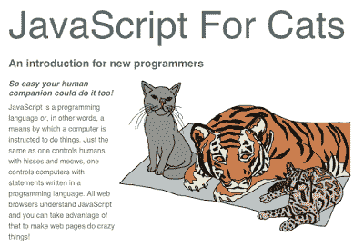
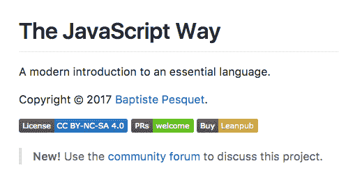
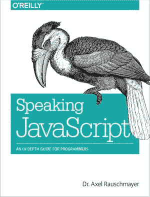
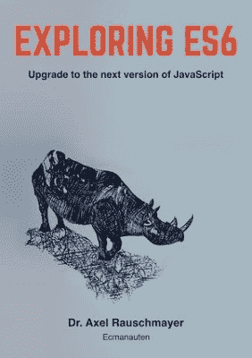
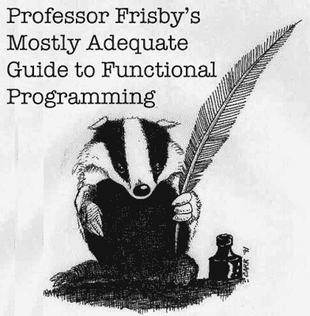
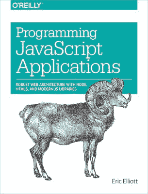
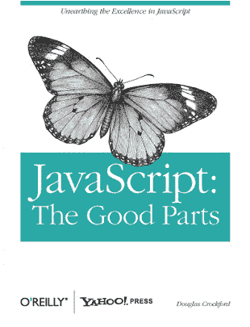

# 面向新 JavaScript 开发人员的 25 个免费资源

> 原文：<https://www.freecodecamp.org/news/25-free-resources-for-new-javascript-developers-11342cf1f4df/>

由免费代码营

# 面向新 JavaScript 开发人员的 25 个免费资源

我们要求我们的营员在[营员新闻](http://freecodecamp.com/news)上为新的 JavaScript 开发者分享他们最喜欢的免费资源。这份名单包括一些久经考验的书籍，以及你可能还没听说过的播客和视频。

#### 书

[雄辩的 Javascript](http://eloquentjavascript.net//) 是由 [Marijn Haverbeke](https://twitter.com/intent/user?screen_name=marijnjh) 撰写的《编程和 Javascript 现代入门》。还有一个[注释版](https://watchandcode.com/courses/eloquent-javascript-the-annotated-version)，作者是 [Gordon Zhu](https://twitter.com/intent/user?screen_name=gordon_zhu) 。

由[马克斯·奥格登](https://twitter.com/intent/user?screen_name=maxogden)为猫编写的 JavaScript】是对新程序员的介绍，非常简单，你的人类同伴也能做！

JavaScript Way T1 是由 freeCodeCamp 贡献者 T2 编写的。这是一个免费和开源的 JavaScript 介绍。

[你不知道 JS](https://github.com/getify/You-Dont-Know-JS) 是由[凯尔·辛普森](https://twitter.com/intent/user?screen_name=getify)撰写的系列书籍，深入探究 JavaScript 语言的核心机制。

由 [Henrik Joreteg](https://twitter.com/intent/user?screen_name=HenrikJoreteg) 撰写的《人类 JavaScript 是一本关于为人类优化的一组特定工具、模式和方法的书。

[由](http://speakingjs.com/es5/)[阿克塞尔·劳施迈尔](https://twitter.com/intent/user?screen_name=rauschma)撰写的《说 JavaScript 》旨在帮助程序员快速、正确地学习 JavaScript，同时也加深你现有的技能和查找特定的主题。

[ExploringJS](http://exploringjs.com/es6/) 非常详细地介绍了 ECMAScript 6，但它的结构便于您快速浏览。

由[雷金纳德·布莱斯维特](https://twitter.com/intent/user?screen_name=raganwald)撰写的 JavaScript 阿龙格涵盖了 JavaScript 中的函数式编程。

由[雷金纳德·布莱斯维特](https://twitter.com/intent/user?screen_name=raganwald)撰写的 JavaScript 讲稿是为读过 [JavaScript Allongé](https://leanpub.com/javascriptallongesix/read) 的读者而写的。它涵盖了函数、闭包和原型。

[什么是代码？](http://www.bloomberg.com/graphics/2015-paul-ford-what-is-code/)是 Paul Ford 写的一篇关于什么是代码以及它为什么重要的互动文章。

弗里斯比教授的《函数式编程指南》涵盖了 JavaScript 中的函数式编程。

由 [Eric Elliot](http://%28@_ericelliott%29/) 撰写的 JavaScript 应用程序编程专注于中级 JavaScript 编码。

#### 播客

[NodeUp](http://nodeup.com/) 是由 [@ffloat](https://twitter.com/intent/user?screen_name=ffloat) 和 [@dshaw](https://twitter.com/intent/user?screen_name=dshaw) 放在一起的 Node.js 播客。

[JavaScript Jabber](http://devchat.tv/js-jabber/) 是一个关于 JavaScript 的每周播客，包括 Node.js、前端技术、职业、团队等等。

[五 JS 播客](https://fivejs.codeschool.com/)是每周五分钟的播客，每周四发布。你可以[在推特](https://twitter.com/intent/user?screen_name=FiveJSPodcast)上关注他们，或者订阅 [iTunes](https://itunes.apple.com/us/podcast/5-minutes-of-javascript/id775261328?mt=2) 或 [RSS](https://fivejs.codeschool.com/feed.rss) 。

[这位开发人员的生活](http://thisdeveloperslife.com/)深入探讨了开发人员生活的不同方面。模仿 NPR 的《美国生活》,它以采访和不拘一格的音乐为特色。

CodeNewbie 播客是一个播客，讲述人们在编码之旅中的故事。每周一发布新的剧集。你可以在推特上关注他们 [@CodeNewbies](https://twitter.com/intent/user?screen_name=CodeNewbies)

#### 录像

JavaScript:这段来自视频创作者[道格拉斯·克洛克福特](http://javascript.crockford.com/)的视频涵盖了的精彩部分。

[提高 Tuts](http://leveluptuts.com/) 出于对更好的指导文档的需求。

以网页设计和开发为主题的每周视频为特色。

#### 其他资源

项目是一个在线环境，用于交互式地探索编程语言。

MDN JavaScript 指南是一个很好的参考，它提供了这种语言的概述。

Codewars 提供交互式用户提交的编码挑战。

[CodinGame](https://www.codingame.com/) 让你通过有趣的互动编码游戏练习 JavaScript 语法。

[jQuery 基础知识](http://jqfundamentals.com/)带您了解使用 jQuery 能够解决的常见问题。

*非常感谢 [@biancamihai](https://twitter.com/intent/user?screen_name=bubuslubu) 、 [@daylightsavings](https://twitter.com/intent/user?screen_name=daylightsavings) 、 [@elliescode](https://twitter.com/intent/user?screen_name=elliescode) 、 [@_maximization](https://twitter.com/intent/user?screen_name=_maximization) 、 [@ovivoicu](https://twitter.com/intent/user?screen_name=ovivoicu) 、 [@duttakapil](https://twitter.com/intent/user?screen_name=duttakapil) 、[@ romulazarde](https://twitter.com/intent/user?screen_name=RomuloLazarde)、 [@MatthewHarames](https://twitter.com/intent/user?screen_name=MatthewHarames) 、 [@ka11away](https://twitter.com/intent/user?screen_name=ka11away) 提交这些资源。*