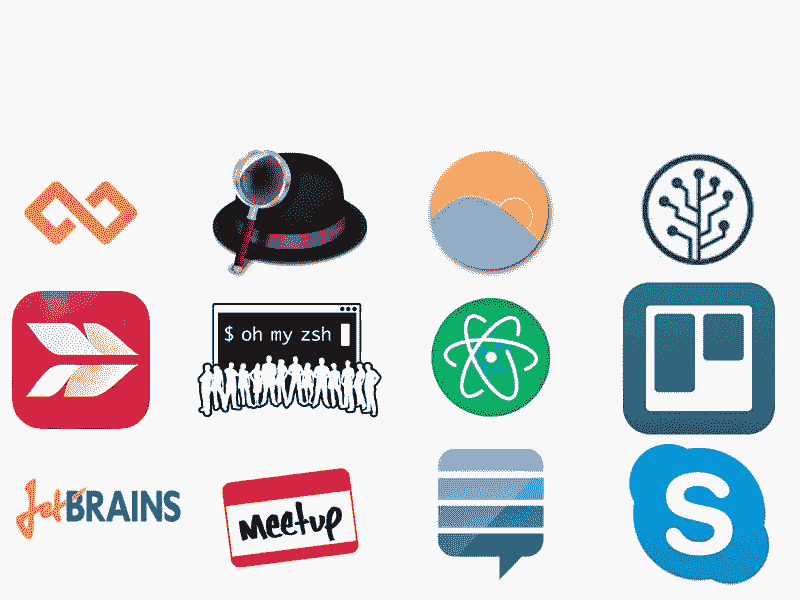
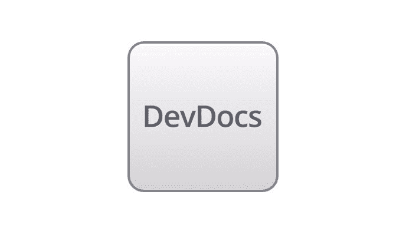
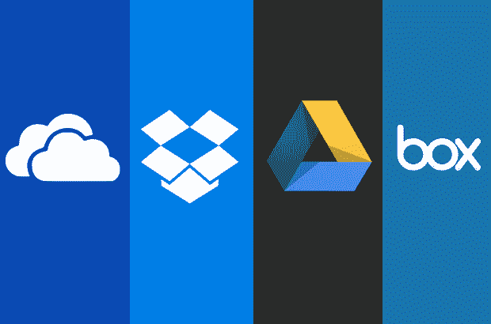

# 每个新程序员都需要的 25 种工具

> 原文：<https://www.freecodecamp.org/news/25-tools-every-new-coder-needs-61f375e3d41e/>

由免费代码营

# 每个新程序员都需要的 25 种工具

### 1.现代浏览器

#### Chrome 和 Firefox 速度很快，并且有调试控制台，这对 web 开发人员来说至关重要。你仍然应该在 Internet Explorer(很快会有 Microsoft Edge)和 Safari 中进行测试，但是你应该使用 Chrome 或 Firefox 来完成工作。

#### 免费在[https://www.google.com/chrome/browser/](https://www.google.com/chrome/browser/)或[https://www.mozilla.org/en-US/firefox/new/](https://www.mozilla.org/en-US/firefox/new/)

### 2.阿尔弗烈德

#### 把阿尔弗雷德想象成 OSX 聚光灯的涡轮增压版。Alfred 可以作为你整个电脑的命令行，通过一个通用热键，帮助你在任何地方启动应用程序、播放音乐和执行搜索。免费版本几乎什么都有，但一旦你本能地一天使用 Alfred 几十次，你可能会为 20 美元的 powerpack 而挥霍。

#### 在 http://www.alfredapp.com/免费

### 3\. Devdocs.io

#### Devdocs 是一个 API 文档浏览器。

#### 在 http://devdocs.io/免费

### 4.救援时间

#### 在你的数字生活中有如此多的干扰和可能性，很容易变得分散。RescueTime 帮助你了解你的日常习惯，这样你就可以集中精力，更有效率。救援时间在您的计算机和移动设备的后台安全运行。它可以跟踪在应用程序和网站上花费的时间，为您提供一天的准确画面，并根据您的活动为您提供详细的报告和数据，以帮助您每天提高工作效率。

#### 你也可以设定目标来帮助你继续前进，进一步提高你的生产力。您可以在仪表盘、每周电子邮件报告和目标报告中查看您的进度。

#### [https://www.rescuetime.com/](https://www.rescuetime.com/)

### 5.奇观

#### 不要最大化，最小化或拖动窗口-用热键管理它们的位置！当您想将两个窗口相邻放置时，眼镜可以节省时间。它还可以在显示器之间切换窗口，如果你使用多个屏幕，这是完美的。Divvy 工作得更好，但奇观是免费的。

#### 在 http://spectacleapp.com/[免费或者在 http://mizage.com/divvy/](http://spectacleapp.com/)[14 美元](http://mizage.com/divvy/)

### 6\. An IDE

#### 文本编辑器很适合处理简单的脚本，但是一旦您的项目变得复杂，您应该切换到集成开发环境。一个好的 IDE 将提供版本控制、测试、javascript 林挺和 diff 工具。最重要的是，它将提供合理的默认配置。JetBrains 是 JavaScript、Ruby、Python 和 PHP 的绝佳 ide。

#### 免费试用，然后 79 美元[http://www.jetbrains.com/](http://www.jetbrains.com/)

### 7.原子(或崇高)

#### GitHub 的自由文本编辑器非常适合编写小脚本或操作对 ide 来说太大的文件。它允许您使用宏和其他节省时间的文本编辑技术。Sublime Text 的效果甚至更好，如果你经常使用的话，注册它可能值 70 美元。

#### 免费在[https://atom.io/](https://atom.io/)或[http://www.sublimetext.com/2](http://www.sublimetext.com/2)

### 8.OhMyZSH

#### 如果你花时间在终端上，这是值得下载的。ZSH 颜色代码从你的命令行输出。它还显示了重要的视觉提示，比如您在哪个 git 分支上，以及您的最后一个命令何时结束运行。它的制表符补全和自动更正也节省了大量时间。

#### 在 https://github.com/robbyrussell/oh-my-zsh 免费

### 9.斯基奇

#### 用全局热键截图(或部分截图)，然后用箭头和大文字快速标记你的截图(默认颜色是热粉色！).您可以轻松导出为各种格式，或者将截图拖放到其他应用程序中。由于 Evernote 拥有 skitch，它会自动将你所有的截图备份到那里。

#### 在 https://evernote.com/skitch/免费

### 10.sourcetree(资源分区)

#### 这是 Git 最好的图形用户界面，而且是免费的(尽管你必须注册一个电子邮件地址)。即使您从命令行完成了大部分 Git，当您需要执行更复杂的 Git 任务(如反向提交、复杂的合并或精选)时，源代码树仍然很有帮助。

#### 在 http://www.sourcetreeapp.com/免费

### 11.特雷罗

#### 这种虚拟看板非常适合管理小团队的小产品。特雷罗比吉拉更视觉化(和触觉化)，比 Pivotal Tracker 更少教条化。它可以用于任何事情，从花哨的待办事项列表到支持 API 的 sprint story coordinator。

#### 在 https://trello.com/免费

### 12.通用控制键(Bash)快捷键

#### 你每次伸手去拿箭头键的数百次累积起来。这个 90 秒的视频可以让你在醒着的时候少活几天。这些通用的快捷方式在整个 OSX 都有效(当你通过 SSH 进入 Linux 系统时也是如此)。

#### 免费(包含在 OSX)

### 13.屏幕英雄

#### 如果你做任何远程配对，你肯定想使用屏幕英雄。它比企业替代产品(Citrix、LogMeIn)更便宜，比 Skype 更快。每个用户都有自己的鼠标和键盘！只有一个人需要有一个付费屏幕英雄帐户才能使用它。Team Viewer 具有类似的功能，可供个人免费使用。

#### Slack 最近收购了 Screen Hero，不过你还是可以在这里免费下载:[http://www . freecodecamp . com/field-guide/how-do-I-install-Screen Hero](http://www.freecodecamp.com/field-guide/how-do-i-install-screenhero)

### 14.文件保险库

#### 一定要启用 OSX 的内置硬盘加密机 File Vault。这样，即使您的笔记本电脑被盗，您的身份、代码和数据也是安全的。

#### 免费(包含在 OSX)

### 15.时间机器

#### OSX 包括一个名为时间机器的无障碍备份系统。即使你将所有文件都存储在 Dropbox、Evernote 或 Google Drive 中，你可能也不想花几个小时来重新配置你的开发环境。在你的桌子上放一个外置硬盘，每隔一段时间插上一次，就能自动备份所有东西。时间机器会每隔 10 天提醒你一次。

#### 免费(包含在 OSX)

### 16.云存储

#### 云存储不仅可以让您在与同事协作时轻松共享文件，它还可以作为珍贵照片和视频的防火备份(在世界各地的许多服务器中)。)空间一年比一年便宜。例如，Google Drive 上的额外空间仅为 0.25 美元/千兆字节/年。

#### 免费在[drive.google.com/](http://drive.google.com/)或[https://www.dropbox.com/downloading](https://www.dropbox.com/downloading)

### 17.last pass/1 密码/密码包

#### 普通人每年都要浪费数小时来重置他们忘记的密码。像这样的密码工具通过存储和自动填充你的密码来节省时间和精力。它们还允许你为每个网站设置长而独特的密码，使得黑客几乎不可能破解你的密码。

#### 免费在[https://lastpass.com/](https://lastpass.com/)或[https://agilebits.com/onepassword](https://agilebits.com/onepassword)或[https://www.passpack.com/](https://www.passpack.com/)

### 18.私人浏览/匿名模式

#### 很多人没有意识到这一点的存在，但你可以很容易地在浏览网站时隐藏自己的身份。在谷歌浏览器中，按 Command+Shift+N。在火狐浏览器中，按 Command+Shift+P。另外，这有助于在同一台电脑上运行两个浏览器会话，有时还能帮助你避开像[NYTimes.com](http://nytimes.com/)这样的付费网站。

#### 免费(包含在 Chrome 和 Firefox 中)

### 19.一个信息工具

#### 我们的团队研究并尝试了许多不同的信息工具。在所有我们喜欢的聊天室中，Gitter 是最适合正在进行的聊天室，它可以发送私人信息，创建针对群体需求的用户频道，以及简单的文件共享。除非你需要 25 人以上的包间，否则 Gitter 是完全免费的。当你在桌面和移动设备之间移动时，Gitter 帮助你保持每个人的同步。

#### 在 [http://gitter.im](http://gitter.im) 免费

### 20.堆叠交换

#### 很难想象 2008 年以前的编程。这时，工程师们放下了第一条胶带，现在通过创建 StackOverflow 将软件工程专业结合在一起。现在有了 ServerFault，超级用户和我们个人最喜欢的 UX 交换。无论你在谷歌上搜索什么样的错误信息，都很有可能会导致堆栈溢出，这是有充分理由的。创建一个帐户，并通过回答问题和投票支持有帮助的答案来支付。

#### 在 http://stackexchange.com/免费

### 21.流量

#### 如果你在长时间盯着电脑屏幕后失眠，Flux 就是为你准备的！你的昼夜节律不能区分阳光和显示器的光。这个免费工具在日落期间和之后逐渐改变你的计算机的颜色。

#### 在 https://justgetflux.com/免费

### 22.商务化人际关系网

#### 没有 LinkedIn，大多数雇主和招聘人员都不会注意到你。LinkedIn 的一些快速提示:1)和你能联系的所有人联系。2)详细描述你的工作经历、你参加过的在线课程以及你获得的证书。3)如果你收到招聘人员发来的无关或不受欢迎的信息，不要发牢骚。只是礼貌地回应或者干脆无视他们。

#### 在 http://www.linkedin.com 免费

### 23.聚会

#### 没有比参加晚间谈话、社交聚会和黑客之夜更快的方式来建立你的职业网络和接触新想法。这些活动很多都是免费的，通常在晚餐时间开始。有些甚至包括食物！前往[Eventbrite.com](http://eventbrite.com/)或[Meetup.com](http://meetup.com/)，浏览您所在地区的活动。

#### 免费在[http://www.meetup.com/](http://www.meetup.com/)和[https://www.eventbrite.com/](https://www.eventbrite.com/)

### 24.推特

#### 虽然 Twitter 让分享你脑海中闪现的每一个想法成为可能，但它的真正价值在于实时交流。许多你想与之交谈的人都有 Twitter 账户，你会惊讶于他们回复你的 Twitter 的频率(和速度)。一定要用一张个人资料照片(头像效果最好),并附上简短的相关描述。保持乐观！

#### 在 http://www.twitter.com 免费

### 25.谷歌(或 DuckDuckGo)

#### 人们常说，最有生产力的编码人员经常早早地搜索。可能有人遇到了你遇到的任何问题，并在博客或 StackOverflow 上发布了答案。如果你能清楚地表达你的问题，你通常能找到解决办法。

#### 在 http://www.google.com 免费

### 使用工具和繁荣！如果你想在编码方面做得更好，去看看[http://freecodecamp.com](http://freecodecamp.com)。