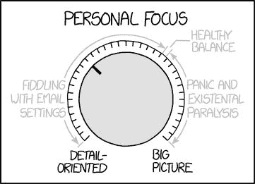

# 250 门常青藤联盟的课程你现在就可以免费在线学习

> 原文：<https://www.freecodecamp.org/news/250-ivy-league-courses-you-can-take-online-right-now-for-free-2cfc813fb68b/>

这里有三个值得你花时间的链接:

1.  这里有 250 门常青藤联盟的课程，你现在可以在网上免费选修
2.  无人驾驶汽车眼中的世界( [5 分钟阅读](http://bit.ly/2lravMA)
3.  大都会博物馆免费提供了 375，000 幅图片( [2 分钟阅读](http://nyti.ms/2lrq5If))

### 想到这一天:

> “伯克利有两种主要产品:迷幻药和 UNIX。我们不认为这是一个巧合。”杰里米·安德森

### 每日一图:

图片来源: [XKCD](http://bit.ly/2ksoIur)

### 今日学习小组:

达卡自由代码营

编码快乐！

–昆西·拉森，自由代码营的老师