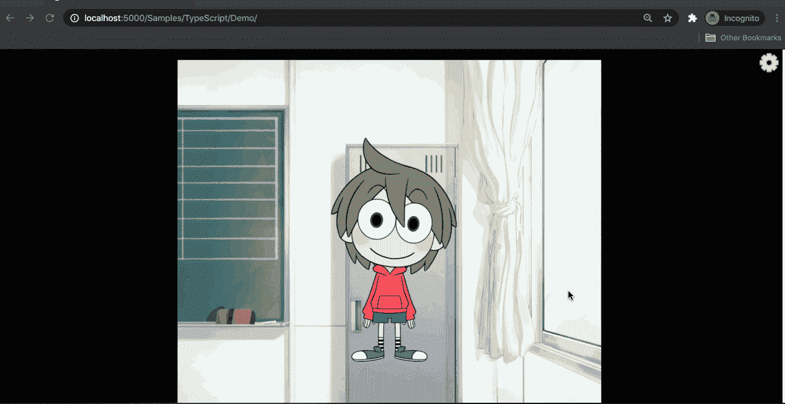
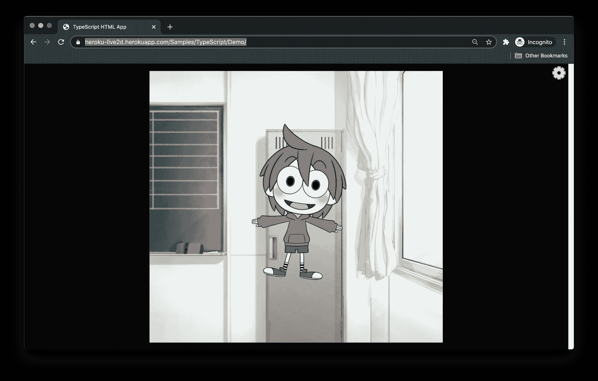

# 如何使用 Heroku 部署 Live2D Web 应用程序

> 原文：<https://www.freecodecamp.org/news/how-to-deploy-a-live2d-web-app-using-heroku/>

## 什么是 Live2D？

Live2D 是一项技术，允许艺术家轻松地转换传统的 2D 插图，以创建流畅的表情和动作。

Live2D 建模和动画最流行的软件是 Cubism，它也提供了用于 web、原生应用程序和 Unity 游戏开发引擎的文档齐全的 SDK。

在本教程中，我将带您了解如何在 Cubism 的官方 Live2D Web SDK 示例的基础上进行构建，并将其部署到 Heroku，这是一个流行的云应用托管平台。

## 如何设置环境

按照本教程，克隆我的 GitHub repo 并检查`start`分支。完成的项目在`develop`分支上。

我还在 YouTube 上录制了一个视频教程。

[RuolinZheng08/heroku-live2dContribute to RuolinZheng08/heroku-live2d development by creating an account on GitHub.RuolinZheng08GitHub](https://github.com/RuolinZheng08/heroku-live2d)

```
git clone https://github.com/RuolinZheng08/heroku-live2d.git
git checkout start

# update the submodule, Cubism's Live2d Web Framework
git submodule update --init
```

使用自制软件安装 Node.js 和 npm:

```
# if you need to install homebrew
/bin/bash -c "$(curl -fsSL https://raw.githubusercontent.com/Homebrew/install/HEAD/install.sh)"

# homebrew will install node and npm at the same time
brew install node
```

我将使用 Visual Studio 代码作为我的主要 IDE，但是您也可以使用自己选择的任何编辑器。

## 如何在本地运行启动代码

目录结构如下。我们的网络应用将从`Samples/TypeScript/Demo`开始提供服务。

```
.
├─ .vscode          # Visual Studio Code project setting
├─ Core             # Live2D Cubism Core JavaScript and TypeScript source code
├─ Framework        #  Source code for the rendering and animation features
└─ Samples
   ├─ Resources     # Live2D model files and web image assets
   └─ TypeScript    # [IMPORTANT] TypeScript sample project
```

在`heroku-live2d`目录中，运行以下命令:

```
cd Samples/TypeScript/Demo/

npm install

npm run-script build

npm run-script serve
```

导航到[http://localhost:5000/Samples/TypeScript/Demo/](http://localhost:5000/Samples/TypeScript/Demo/)，您应该能够看到一个 Live2D 字符。

要与模型互动，按住鼠标光标，角色的头部和眼睛会跟随光标移动。点击角色的身体可以看到一个特殊的动画。点击右上角的齿轮图标，在不同型号之间切换。



Mark from `Samples/Resources/Mark`

## 如何部署到 Heroku

起始代码使用 npm、TypeScript 和 webpack。

为了将我们的项目部署到 Heroku，我们需要创建一个`package.json`文件，Heroku 可以用它在我们的项目根目录中构建我们的项目。我们还需要修改`Samples/TypeScript/Demo/package.json`和`Samples/TypeScript/Demo/webpack.config.js`中的 webpack 配置。

### 顶层 package.json

Node.js Heroku 应用程序的样板文件`package.json`如下所示:

```
{
    "name": "heroku-live2d",
    "description": "Live2D Cubism Heroku Demo",
    "scripts": {
        "start": ...,
        "build": ...
    },
    "dependencies": {
    	...
    }
}
```

检查`Samples/TypeScript/Demo/package.json`中的`dependencies`和`devDependencies`属性，并将两组依赖项作为`dependencies`添加到`heroku-live2d/package.json`。

请记住，在本地构建和服务时，我们使用了来自`Samples/TypeScript/Demo`目录中的`npm run-script [build|serve]`。

因此，要从项目根目录运行这些 npm 命令，我们需要在 npm 命令前面加上`cd Samples/TypeScript/Demo`。例如，build 命令将变成:

```
cd Samples/TypeScript/Demo && npm run-script build
```

有了这些变化，顶级的`package.json`应该是这样的:

```
{
    "name": "heroku-live2d",
    "description": "Live2D Cubism Heroku Demo",
    "scripts": {
        "start": "cd Samples/TypeScript/Demo && npm run-script start",
        "build": "cd Samples/TypeScript/Demo && npm run-script build"
    },
    "dependencies": {
        "@typescript-eslint/eslint-plugin": "^2.18.0",
        "@typescript-eslint/parser": "^2.18.0",
        "eslint": "^6.8.0",
        "eslint-config-prettier": "^6.10.0",
        "eslint-plugin-prettier": "^3.1.2",
        "prettier": "^1.19.1",
        "rimraf": "^3.0.1",
        "serve": "^11.3.0",
        "ts-loader": "^6.2.1",
        "typescript": "^3.7.5",
        "webpack": "^4.41.5",
        "webpack-cli": "^3.3.10",
        "webpack-dev-server": "^3.10.1",
        "whatwg-fetch": "^3.0.0"
    }
} 
```

### samples/type script/Demo/package . JSON

在本地主机上，我们运行在端口 5000 上。然而，Heroku 会动态地为我们的 web 应用分配一个存储在变量`$PORT`中的端口。因此，我们需要`Samples/TypeScript/Demo/package.json`中的`npm run-script start`命令来启动端口`$PORT`上的 webpack 服务器。

追加到`scripts > start > webpack-dev-server --progress`，看起来像这样:

```
"scripts": {
    "start": "webpack-dev-server --progress --port $PORT",
    ...
}
```

### samples/TypeScript/Demo/web pack . config . js

将`disableHostCheck`添加到`devServer`的配置中，并移除`port`，因为我们已经在上面对其进行了动态配置。

```
module.exports = {
    ...,
    devServer: {
        contentBase: path.resolve(__dirname, '../../..'),
        watchContentBase: true,
        inline: true,
        hot: true,
        port: 5000, // delete this line
        host: '0.0.0.0',
        disableHostCheck: true, // add this line
        compress: true,
        useLocalIp: true,
        writeToDisk: true
    },
    ...
}
```

加上`watchOptions`这样我们的`node_modules`就不会被人看了。如果我们不这样做，当我们部署到 Heroku 时，我们将遇到关于超过最大观察器数量的错误。

```
module.exports = {
    ...,
    watchOptions: {
    	ignored: /node_modules/
    },
    ...
}
```

### 部署到 Heroku

要下载 Heroku 命令行客户端，请运行

```
brew tap heroku/brew && brew install heroku
```

使用`heroku login`从命令行登录 Heroku。

创建一个 Heroku 应用程序，并在应用程序名称后添加一些数字(例如，123)以确保唯一性。

```
heroku create heroku-live2d-NUMBERS
```

将 Node.js 设置为构建包:

```
heroku buildpacks:set heroku/nodejs
```

使用 git 添加并提交您的项目。注意，我们不一定需要`git push`:

```
git add .
git commit -m "Ready to deploy to heroku"
```

将项目推给 Heroku，假设你正沿着`start`分支前进。你可以随时检查你所在的分支，然后从那个分支开始推。

```
# check which branch we are on
git branch

# the syntax is
# git push heroku GIT_BRANCH_NAME:HEROKU_BRANCH_NAME
git push heroku start:master
```

您可能需要等待几分钟才能完成构建过程。

之后，导航至`YOUR-HEROKU-APP-NAME.herokuapp.com/Samples/TypeScript/Demo`。在我的例子中，网址是[https://heroku-live 2d . heroku app . com/Samples/TypeScript/Demo/](https://heroku-live2d.herokuapp.com/Samples/TypeScript/Demo/)。Live2D 的角色会在那里迎接你:)



Notice that the highlighted URL is already on Heroku

### 如何将 index.html 重定向到示例/类型脚本/演示

您可能已经注意到，`YOUR-HEROKU-APP-NAME.herokuapp.com`显示了一个目录结构列表，而不是 Live2D 模型。我们可以通过添加一个重定向到`Samples/TypeScript/Demo`的虚拟顶级`index.html`来解决这个问题。

```
<!DOCTYPE html>
<html>

<head>
    <title></title>
    <!-- Just a dummy html to redirect to my subdirectory -->
    <meta http-equiv="refresh" content="0; url=Samples/TypeScript/Demo">
</head>

<body>

</body>

</html> 
```

重新运行部署命令`git push heroku start:master`。现在当你访问`YOUR-HEROKU-APP-NAME.herokuapp.com`时，会自动重定向到 Live2D 模型页面。

祝贺您完成了本教程的最后一课！现在，您已经有了一个部署到 Heroku 的 Live2D Web 应用程序。

我希望你喜欢这个教程。让我们保持联系！在 [LinkedIn](https://www.linkedin.com/in/ruolin-zheng/) 、 [GitHub](https://github.com/RuolinZheng08) 、 [Medium](https://medium.com/@ruolinzheng) 与我联系，或者查看[我的个人网站](https://ruolinzheng08.github.io/)。

### 资源和链接

[本教程我的 GitHub repo】](https://github.com/RuolinZheng08/heroku-live2d/tree/develop)

[我的 Heroku App](https://heroku-live2d.herokuapp.com/)

[我的 YouTube 视频教程](https://youtu.be/uH1IczzE_t4)

[立体派的官方 SDK 文档](https://docs.live2d.com/cubism-sdk-tutorials/sample-build-web/)