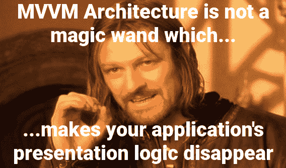

# 如何像专业人士一样在 Android 上使用模型-视图-视图模型

> 原文：<https://www.freecodecamp.org/news/model-view-viewmodel-android-tutorial/>

我在这篇文章中的目标是解释为什么模型-视图-视图模型架构模式在一些关于 GUI 架构的表示逻辑的情况下表现出一种非常尴尬的关注点分离。

我们将探讨 MVVM 的两种变体(有**没有**只有一种方法)，以及基于项目需求，您可能更喜欢一种变体的原因。

## MVVM vs MVP/MVC？

在周日的现场问答环节中，我最常被问到的问题很可能是这样的:

> MVVM vs MVP/MVC？

每当有人问我这个问题时，我都会很快强调，没有一个单一的 GUI 架构在所有情况下都能很好地工作。

你可能会问，为什么？给定应用程序的最佳架构(或者至少是一个好的选择)很大程度上取决于手头的需求。

让我们简单思考一下这个词**要求**实际上是什么意思:

*   你的用户界面有多复杂？简单的用户界面通常不需要复杂的逻辑来协调，而复杂的用户界面可能需要大量的逻辑和细粒度的控制才能顺利工作。
*   **你有多在乎测试？一般来说，与框架和操作系统紧密耦合的类(尤其是 T2 用户界面)需要额外的测试工作。**
*   你希望提高多少可重用性和抽象性？如果想跨不同平台共享应用的后端、域，甚至是表示逻辑，怎么办？
*   你天生是务实的、T2 的、完美主义的、T4 的、懒惰的，还是在不同的时间、不同的情况下都是这样？

我很想写一篇文章，详细讨论 MVVM 是如何满足上述要求和关注的。不幸的是，你们中的一些人可能被误导了，认为只有一种方法可以做到 MVVM。

相反，我将讨论两种不同的方法来理解 MVVM 的总体思想，这两种方法呈现出截然不同的优点和缺点。但首先，让我们从总体思路开始。

## 你不应该引用你的视图类

*对于不懂古英语的朋友:***你可以不参考视图类**

除了使用 ViewModel 这个名字(如果这个类充满了**逻辑**的话，这个名字本身就很混乱)，MVVM 架构的一个铁一般的规则是你永远不可以引用 ViewModel 中的视图。

现在，混淆的第一个领域可能来自“reference”这个词，我将使用几个不同层次的行话来重申它:

*   您的视图模型可能不拥有对任何视图的任何引用(成员变量、属性、可变/不可变字段)
*   您的视图模型可能不依赖于任何视图
*   您的视图模型可能不会直接与您的视图对话

现在，在 Android 平台上，这个规则的原因不仅仅是因为某个似乎了解软件架构的人告诉你它不好，所以违反它是不好的。

当使用来自架构组件的 [ViewModel](https://developer.android.com/topic/libraries/architecture/viewmodel) 类时(它被设计成在适当的时候让它的实例**比片段/活动生命周期**持续**更长的时间**，引用一个视图就是要求**严重的内存泄漏**。

至于为什么 MVVM 一般不允许这样的引用，目标是**假设**使视图和视图模型更容易测试和编写。

其他人可能会指出它促进了视图模型的可重用性，但是这正是这个模式失败的地方。

在我们看代码之前，请注意**我个人不在我自己的生产代码中使用 LiveData** 。现在我更喜欢编写自己的发布者-订阅者模式，但是我下面所说的适用于任何允许从视图模型到视图的发布者/观察者模式链接的库。

本文附有一个视频教程，其中涵盖了许多相同的想法:

[https://www.youtube.com/embed/j47CSoJ_Hc4?feature=oembed](https://www.youtube.com/embed/j47CSoJ_Hc4?feature=oembed)

## ViewLogic + ViewModel 还是 View + ViewModelController？

当我在上一节中说“打破”时，我并不是说模式真的打破了。我的意思是，它分解成(至少)两种不同的方法，它们有非常不同的外观、好处和后果。

让我们考虑这两种方法，当你想选择其中一种时。



Boromir explains that MVVM is not a magic wand that makes your application's presentation logic disappear.

### 第一种方法:区分可重用视图模型的优先级

据我所知，大多数实现 MVVM 的人都把提高视图模型的可重用性作为目标，这样它们就可以在 *n* 个不同的视图中重用(多对一比率)。

简单地说，有两种方法可以实现这种可重用性:

*   通过不引用特定的视图。希望这对你来说不是新闻。
*   通过**尽可能少地了解**关于 **UI** 的总体细节

第二点可能听起来含糊不清或违背直觉(它怎么能知道任何它不参考的东西呢？)，所以我觉得是时候看看一些代码了:

```
class NoteViewModel(val repo: NoteRepo): ViewModel(){
    //Note: you may also publish data to the View via Databinding, RxJava Observables, and other approaches. Although I do not like to use LiveData in back end classes, it works great with Android front end with AAC
    val noteState: MutableLiveData<Note>()
    //...
    fun handleEvent(event: NoteEvent) {
        when (event) {
            is NoteEvent.OnStart -> getNote(event.noteId)
            //...
        }
    }
    private fun getNote(noteId: String){
        noteState.value = repo.getNote(noteId)
    }
}
```

虽然这是一个非常简单的示例，但关键是这个特定的 ViewModel 公开公开的唯一内容(除了 handleEvent 函数)是一个简单的 Note 对象:

```
data class Note(val creationDate:String,
                val contents:String,
                val imageUrl: String,
                val creator: User?)
```

使用这种特定的方法，ViewModel 不仅与特定的视图，而且与细节，以及任何特定视图的**表示逻辑**都很好地、真正地解耦了。

如果我说的话仍然含糊不清，我保证一旦我描述了另一种方法，就会清楚了。

虽然我之前的标题“View logic+ViewModel…”并不意味着要认真使用或对待，但我的意思是，通过使用非常解耦和可重用的视图模型，我们现在依靠视图本身来完成如何在屏幕上呈现/绑定这个 Note 对象的工作。

我们中的一些人不喜欢用逻辑填充视图类。

这就是事情变得非常混乱并依赖于项目需求的地方。我不是说用逻辑填充视图类，例如:

```
private fun observeViewModel() {
    viewModel.notes.observe(
        viewLifecycleOwner,
        Observer { notes: List<Note> ->
            if (notes.isEmpty()) showEmptyState()
            else showNoteList(notes)
        }
    )
   //..
}
```

……难道**总是**不好吗，但是与平台紧密耦合的类(比如片段)很难测试，其中有逻辑的类是最重要的测试类！

一言以蔽之，就是没能应用我认为任何好的架构的黄金原则: [**关注点分离**](https://medium.com/datadriveninvestor/programming-fundamentals-part-5-separation-of-concerns-software-architecture-f04a900a7c50) **。**

我个人的观点是，在非常高的程度上应用关注点分离是值得的。但是不要搞错了，很多摇钱树应用程序是由那些对这意味着什么毫无头绪的人编写的。

无论如何，我们接下来将讨论的方法，虽然**有它自己的副作用**，再次从视图中移除了表示逻辑。

反正大部分都是。

### 第二种方法:谦逊的观点，控制狂的观点模型

有时对视图没有细粒度的控制(这是优先考虑视图模型的可重用性的结果)，实际上有点糟糕。

让我更加不热衷于不加选择地应用前面的方法，我发现我**经常** **不** **需要重用 ViewModel** 。

> 具有讽刺意味的是，“太抽象”是 MVP 对 MVVM 的普遍批评。

也就是说，我们不能简单地将一个引用添加回视图模型来重新获得对视图的细粒度控制。这基本上只是 MVP +内存泄漏(假设您仍然使用 AAC 的 ViewModel)。

那么，另一种选择是构建您的视图模型，使它们包含给定视图的几乎所有的**行为**、**状态**和**表示逻辑**。当然，视图仍然必须绑定到 ViewModel，但是在 ViewModel 中有足够多的关于视图的细节，视图的功能减少到一行(有一些小的例外)。

在马丁·福勒的命名惯例中，这被称为[被动视图/屏幕](https://martinfowler.com/eaaDev/PassiveScreen.html)。这种方法一个更通用的名字是**简单对象模式**。

为了实现这一点，您必须让您的视图模型为视图中出现的每个控件或小部件拥有一个可观察的字段(无论您如何实现——数据绑定、Rx、LiveData 等等):

```
class UserViewModel(
    val repo: IUserRepository,
){

    //The actual data model is kept private to avoid unwanted tampering
    private val userState = MutableLiveData<User>()

    //Control Logic
    internal val authAttemptState = MutableLiveData<Unit>()
    internal val startAnimation = MutableLiveData<Unit>()

    //UI Binding
    internal val signInStatusText = MutableLiveData<String>()
    internal val authButtonText = MutableLiveData<String>()
    internal val satelliteDrawable = MutableLiveData<String>()

    private fun showErrorState() {
        signInStatusText.value = LOGIN_ERROR
        authButtonText.value = SIGN_IN
        satelliteDrawable.value = ANTENNA_EMPTY
    }
    //...
}
```

随后，视图仍然需要将自己连接到视图模型，但是这样做所需的函数编写起来非常简单:

```
class LoginView : Fragment() {

    private lateinit var viewModel: UserViewModel
    //...

    //Create and bind to ViewModel
    override fun onStart() {
        super.onStart()
        viewModel = ViewModelProviders.of(
        //...   
        ).get(UserViewModel::class.java)

        //start background anim
        (root_fragment_login.background as AnimationDrawable).startWithFade()

        setUpClickListeners()
        observeViewModel()

        viewModel.handleEvent(LoginEvent.OnStart)
    }

    private fun setUpClickListeners() {
      //...
    }

    private fun observeViewModel() {
        viewModel.signInStatusText.observe(
            viewLifecycleOwner,
            Observer {
                //"it" is the value of the MutableLiveData object, which is inferred to be a String automatically
                lbl_login_status_display.text = it
            }
        )

        viewModel.authButtonText.observe(
            viewLifecycleOwner,
            Observer {
                btn_auth_attempt.text = it
            }
        )

        viewModel.startAnimation.observe(
            viewLifecycleOwner,
            Observer {
                imv_antenna_animation.setImageResource(
                    resources.getIdentifier(ANTENNA_LOOP, "drawable", activity?.packageName)
                )
                (imv_antenna_animation.drawable as AnimationDrawable).start()
            }
        )

        viewModel.authAttemptState.observe(
            viewLifecycleOwner,
            Observer { startSignInFlow() }
        )

        viewModel.satelliteDrawable.observe(
            viewLifecycleOwner,
            Observer {
                imv_antenna_animation.setImageResource(
                    resources.getIdentifier(it, "drawable", activity?.packageName)
                )
            }
        )
    }
```

你可以在这里找到这个例子的完整代码。

您可能已经注意到，我们可能不会在其他任何地方重用这个视图模型**。此外，我们的视图已经变得足够简单(取决于您对代码覆盖率的标准和偏好)，并且非常容易编写。**

**有时您会遇到这样的情况，您必须在视图和视图模型之间的**表示逻辑**的分布之间找到某种折中的方法，这并不严格遵循这两种方法中的任何一种。**

**我并不是提倡一种方法优于另一种方法，而是鼓励您根据手头的需求灵活地使用您的方法。**

## **根据偏好和需求选择您的架构**

**本文的重点是研究开发人员在 Android 平台上构建 MVVM 风格的 GUI 架构时可以采用的两种不同方法(有些方法可以移植到其他平台上)。**

**事实上，即使在这两种方法中，我们也可以更具体地了解微小的差异。**

*   **视图应该观察它拥有的每一个小部件/控件的一个字段，还是应该观察一个发布单个**模型**的字段，以便每次重新呈现整个视图？**
*   **也许我们可以避免让我们的视图模型一对一，同时保持我们的视图是不起眼的对象，简单地通过添加类似于演示者或控制器的东西来混合？**

**空谈是廉价的，我强烈建议你尝试学习代码中的这些东西**，这样你就不需要依赖像我这样的人来告诉你该做什么。****

**最终，我认为成就伟大架构的两个要素可以归结为以下几点:**

**首先，尝试几种方法，直到你找到一种你更喜欢的方法。最好的方法是在每种风格下实际构建一个应用程序(可以很简单)，看看**觉得什么是对的**。**

**其次，要明白，抛开偏好不谈，不同的风格会倾向于强调不同的利益，以换取不同的赤字。最终，你将能够根据你对项目需求的理解做出好的选择，而不是盲目的相信。**

### **了解有关软件架构的更多信息:**

 **[https://www.youtube.com/embed/B_C41SF0KbI?feature=oembed](https://www.youtube.com/embed/B_C41SF0KbI?feature=oembed)** 

#### **社会的**

**[https://www.instagram.com/rkay301/](https://www.instagram.com/wiseassbrand/)
https://www.facebook.com/wiseassblog/https://twitter.com/wiseass301http://wiseassblog.com/**