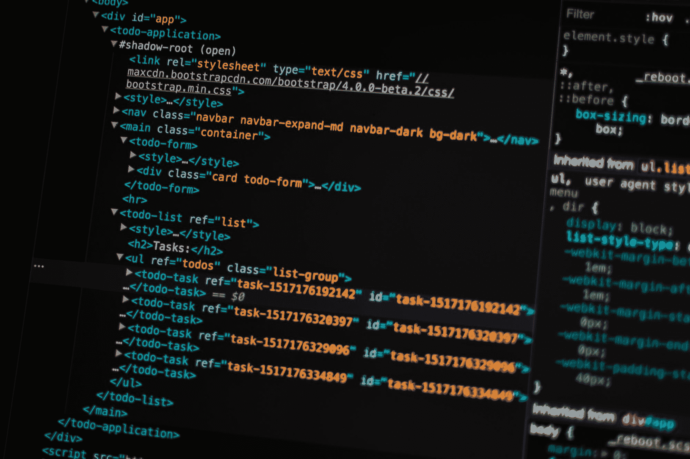
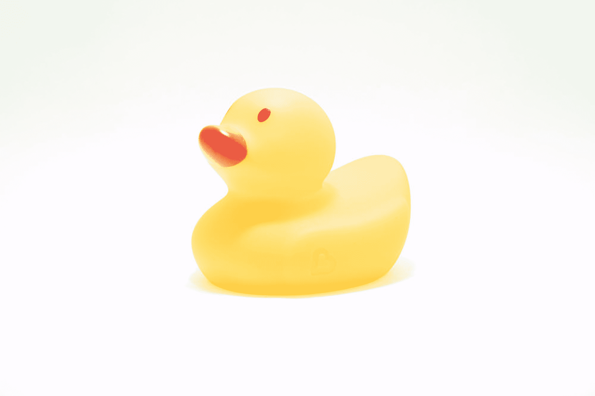

# 为什么我喜欢做一名初级程序员

> 原文：<https://www.freecodecamp.org/news/why-i-love-being-a-beginner-programmer/>

自从我七岁起，我就一直与音乐有着不解之缘。我是高中的那个孩子，是每个提供的乐队班的一部分。

在顶级音乐学校获得两个音乐学位后，我搬到了洛杉矶从事自由职业。

在过去的五年里，我一直在南加州表演、作曲和教授音乐。

但是当新冠肺炎来袭时，一切都变了。

学校停课，音乐会取消，所有人都被禁闭。

我唯一剩下的就是我的乐谱网站。所以我把所有的精力都投入到业务中，并开始考虑做出一些可能的改变。

## HTML？CSS？那是什么？

Photo by [Pankaj Patel](https://unsplash.com/@pankajpatel?utm_source=unsplash&utm_medium=referral&utm_content=creditCopyText) on [Unsplash](https://unsplash.com/s/photos/html?utm_source=unsplash&utm_medium=referral&utm_content=creditCopyText)

过去，我曾试图查看我的 WordPress 模板的源代码，但我不明白其中的任何含义。

保证金？填充？展示？

一切都很混乱。

但是现在我被关了起来，我决定是时候学习一些基本的 HTML 和 CSS 了。

所以我报了一个 edX 班，令我惊讶的是，我爱上了编程。

到目前为止，这段旅程是令人惊奇的，我想分享为什么我喜欢成为一名初级程序员的三个原因。

## 原因 1:资源太多了

Photo by [Susan Yin](https://unsplash.com/@syinq?utm_source=unsplash&utm_medium=referral&utm_content=creditCopyText) on [Unsplash](https://unsplash.com/s/photos/books?utm_source=unsplash&utm_medium=referral&utm_content=creditCopyText)

当我开始研究编程课程时，我对随手可得的海量信息感到惊讶。

有书籍、视频、互动学习环境等等。最棒的是，这些资源要么是免费的，要么非常便宜。

像哈佛和麻省理工这样的常青藤联盟大学为任何想学习编程的人提供免费的计算机科学课程。

我想不出还有哪个领域能以每个人都能接受的价格提供高质量的教育。

以下是目前为止我最喜欢的一些资源。

### 哈佛 CS50 -计算机科学导论

Photo by [Timothy Dykes](https://unsplash.com/@timothycdykes?utm_source=unsplash&utm_medium=referral&utm_content=creditCopyText) on [Unsplash](https://unsplash.com/s/photos/programmer?utm_source=unsplash&utm_medium=referral&utm_content=creditCopyText)

我刚加入 edX 平台的时候，哈佛的[计算机科学导论](https://online-learning.harvard.edu/course/cs50-introduction-computer-science?delta=0)课程是最值得推荐的课程之一。即使评价是积极的，我仍然觉得我不可能完成这门课程。

我忽略了大约一个月的建议，转而开始学习标记语言。在做了几个 HTML 和 CSS 的小项目后，我决定是时候开始学习编程语言了。

我想我会看几分钟 CS50 的第一堂课，觉得它会枯燥乏味。

哇，我错了！

那第一堂课是我看过的最有活力的视频。我最后看完了整整两个小时的讲座。

CS50 的伟大之处在于，尽管它很艰难，但他们有一个致力于帮助你的令人难以置信的社区。有这么多官方的 CS50 小组，你可以加入并获得关于你的问题集的帮助。

所有的成员都很热情，乐于助人，如果你完全偏离了你的代码，他们不会对你评头论足。如果你想开始编程，我强烈推荐这门课。

### 自由代码营

Photo by [Max Duzij](https://unsplash.com/@max_duz?utm_source=unsplash&utm_medium=referral&utm_content=creditCopyText) on [Unsplash](https://unsplash.com/?utm_source=unsplash&utm_medium=referral&utm_content=creditCopyText)

我不记得我是如何偶然发现 freeCodeCamp 的，但我真的很高兴我发现了。在我的编码之旅开始的几个星期后，我开始了课程的学习，我很喜欢面对挑战。

每个挑战都为我提供了一个试验代码并在编辑器中查看结果的机会，这对我真的很有好处。我也非常兴奋能够在响应式设计课程结束时建立五个小项目。

我喜欢这个平台的另一个原因是，它为我提供了编程各方面的丰富信息。我喜欢浏览 freeCodeCamp 的新闻栏目和 YouTube 频道。

这些资源对于我这样的新手来说，是极其宝贵的。它给了我一个机会去了解更多关于这个行业和技术的最新趋势。

## 原因 2:人们想帮助初学者

Photo by [nikko macaspac](https://unsplash.com/@nikkotations?utm_source=unsplash&utm_medium=referral&utm_content=creditCopyText) on [Unsplash](https://unsplash.com/s/photos/help?utm_source=unsplash&utm_medium=referral&utm_content=creditCopyText)

当我开始学习 freeCodeCamp 课程时，我加入了这个论坛，作为与其他开发者互动的一种方式，也许还可以回答一些问题。我很快就爱上了这个论坛，因为我惊讶于这个社区是如此的支持我。

有这么多经验丰富的开发人员乐于贡献他们的时间和专业知识来帮助像我这样的初学者。这是一个安全的学习和成长的地方，我从来没有觉得问问题不好。

论坛上我最喜欢的部分之一叫做你可以做到这一点！我喜欢阅读那些走上自学之路并找到第一份工作的人的帖子。

也有大量的帖子，在这些帖子中，初级程序员在学习过程中苦苦挣扎，并质疑这是否适合他们。阅读这些帖子让我感到安慰，因为我并不孤单。

学习如何自己编码有时真的很有压力和令人沮丧。

幸运的是，有人在你身后鼓励你继续度过艰难的时光。

## 原因 3:犯错误完全没问题

Photo by [Sebastian Herrmann](https://unsplash.com/@officestock?utm_source=unsplash&utm_medium=referral&utm_content=creditCopyText) on [Unsplash](https://unsplash.com/s/photos/frustration?utm_source=unsplash&utm_medium=referral&utm_content=creditCopyText)

当你真的很努力，但你所做的一切都不奏效时，有时会很沮丧。

你不断地修改你的代码，但是没有一个结果是有效的。

你猜怎么着？这完全没问题。

犯所有你想犯的错误。

犯错误只是又一个学习新事物的机会。

我记得在 CS50 的第四周挣扎。我开始变得非常沮丧，并怀疑自己的编码能力。

但我意识到，挣扎是正常的。

这个过程迫使我做更多的研究，更多的实验，问更多的问题。

## 最后的想法

Photo by [Pablo Heimplatz](https://unsplash.com/@pabloheimplatz?utm_source=unsplash&utm_medium=referral&utm_content=creditCopyText) on [Unsplash](https://unsplash.com/s/photos/sunrise?utm_source=unsplash&utm_medium=referral&utm_content=creditCopyText)

过去的 6 个月疯狂、有趣、充满挑战，同时也令人兴奋。

我给所有初学者的建议是试着享受学习过程，因为作为一个初学者是很棒的。

编码快乐！