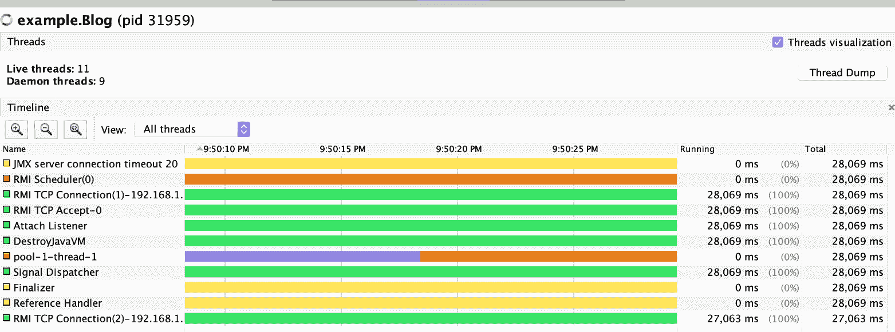
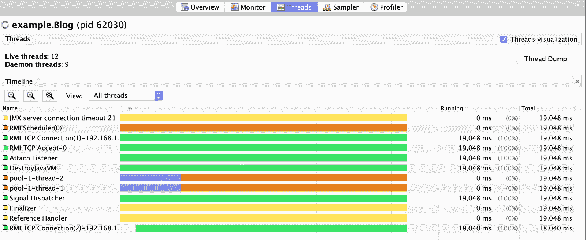

# 如何在 JVM 上使用 Thread.sleep 而不阻塞

> 原文：<https://www.freecodecamp.org/news/non-blocking-thread-sleep-on-jvm/>

像 Java 和 Scala 这样的 JVM 语言能够使用`Thread`类运行并发代码。众所周知，线程非常复杂，而且非常容易出错，所以对它们的工作原理有一个坚实的理解是非常重要的。

让我们从`Thread.sleep`的 Javadoc 开始:

> 使当前正在执行的**线程**休眠(暂时**停止执行)**指定的毫秒数

`**cease execution**`又叫**封杀**有什么含义，意味着什么？很糟糕吗？如果可以，我们能实现**无阻塞睡眠**吗？

### 我们将在本文中讨论的内容

这篇文章涵盖了很多领域，希望你能学到很多很酷的东西。

*   睡眠时 **OS 层面会发生什么？**
*   睡眠的**问题**
*   **项目织机**和虚拟线程
*   功能编程和设计
*   用于并发的 Scala 库

是的，所有这些都在下面。

但是首先，让我们从这个简单的 Scala 片段开始，我们将在整篇文章中修改它，以实现我们想要的:

```
println("a")
Thread.sleep(1000)
println("b")
```

很简单:它打印“a ”, 10 秒钟后打印“b”

让我们把注意力集中在`Thread.sleep`上，试着理解**和**是如何实现睡眠的。一旦我们理解了如何做，我们将能够看到问题并更具体地定义它。

## 睡眠在操作系统层面是如何工作的？

下面是在引擎盖下调用`Thread.sleep`时发生的情况。

*   它调用底层操作系统的线程 API
*   因为 JVM 在 Java 和内核线程之间使用一对一的映射，所以它要求操作系统在指定的时间内放弃线程对 CPU 的“权利”
*   当时间过去后，操作系统调度程序将通过中断唤醒线程(这是有效的),并为其分配一个 CPU 片以允许其恢复运行

这里的关键点是睡眠线程**被完全取出，在睡眠**时不可重用。

### 螺纹的限制

以下是线程带来的一些重要限制:

*   您可以创建的线程数量是有限制的。大约 30K 后，您会收到以下错误:

```
java.lang.OutOfMemoryError : unable to create new native Thread
```

*   创建 JVM 线程的内存开销可能很大，因为它们带有一个专用的堆栈
*   太多的 JVM 线程将会产生开销，因为昂贵的上下文切换和它们共享有限硬件资源的方式

现在我们对幕后发生的事情有了更多的了解，让我们回到睡眠问题上来。

## 睡眠的问题

让我们更具体地定义这个问题，并运行一个片段来显示我们所面临的问题。我们将用这个函数来说明这一点:

```
def task(id: Int): Runnable = () => 
{
  println(s"${Thread.currentThread().getName()} start-$id")
  Thread.sleep(10000)
  println(s"${Thread.currentThread().getName()} end-$id")
}
```

这个简单的功能将

*   打印`**start**` 后跟线程 id
*   睡眠 10 秒钟
*   打印`**end**` 后跟线程 id

### 如果你接受它，你的任务就是用一个线程同时运行两个任务

我们希望同时运行两个任务，这意味着整个程序总共需要 10 秒钟。但是我们只有一个线程可用。

你准备好迎接这个挑战了吗？

让我们稍微研究一下任务和线程的数量，以了解问题到底出在哪里。

### `1 task -> 1 thread`

```
new Thread(task(1)).start()
```

```
12:11:08 INFO  Thread-0 start-1
12:11:18 INFO  Thread-0 end-1
```

让我们启动`jvisualvm`来检查线程正在做什么:


可以看到 Thread-0 处于紫色的`sleeping`状态。

点击线程转储按钮将会显示如下内容:

```
"Thread-0" #13 prio=5 os_prio=31 tid=0x00007f9a3e0e2000 nid=0x5b03 waiting on condition [0x0000700004ac8000]  
  java.lang.Thread.State: TIMED_WAITING (sleeping)
  at java.lang.Thread.sleep(Native Method)
  at example.Blog$.$anonfun$task$1(Blog.scala:7)
  at example.Blog$$$Lambda$2/1359484306.run(Unknown Source)
  at java.lang.Thread.run(Thread.java:748)
  Locked ownable synchronizers:        - None
```

很明显，这个线程在完成休眠之前是不可用的。

### `2 tasks -> 1 thread`

让我们通过在只有一个线程可用的情况下运行两个这样的任务来说明这个问题:

```
import java.util.concurrent.Executors

// an executor with only 1 thread available
val oneThreadExecutor = Executors.newFixedThreadPool(1)

// send 2 tasks to the executor
(1 to 2).foreach(id =>
   oneThreadExecutor.execute(task(id)))
```

我们得到这样的输出:

```
2020.09.28 21:49:56 INFO  pool-1-thread-1 start-1
2020.09.28 21:50:07 INFO  pool-1-thread-1 end-1
2020.09.28 21:50:07 INFO  pool-1-thread-1 start-2
2020.09.28 21:50:17 INFO  pool-1-thread-1 end-2
```



您可以看到`pool-1-thread-1`的紫色(睡眠状态)。任务别无选择，只能一个接一个地运行，因为每次使用`Thread.sleep`时线程都会被取出。

### `2 tasks -> 2 threads`

让我们用两个线程运行相同的代码。我们得到这个:

```
// an executor with 2 threads available
val oneThreadExecutor = Executors.newFixedThreadPool(2)

// send 2 tasks to the executor
(1 to 2).foreach(id =>
   oneThreadExecutor.execute(task(id)))
```

```
2020.09.28 22:42:04 INFO  pool-1-thread-2 start-2
2020.09.28 22:42:04 INFO  pool-1-thread-1 start-1
2020.09.28 22:42:14 INFO  pool-1-thread-1 end-1
2020.09.28 22:42:14 INFO  pool-1-thread-2 end-2
```

每个线程一次可以运行一个任务。我们最终完成了我们想要的，同时运行 2 个任务，整个程序在 10 秒内完成。



这很容易，因为我们使用了 2 个线程(pool-1-thread-1 和 pool-1-thread-2)，但我们希望只用 1 个线程来做同样的事情。

让我们找出问题，然后找到解决办法。

### 问题:`Thread.sleep is blocking`

我们现在知道我们不能使用`Thread.sleep`——它阻塞了线程。

这使得它不可用，直到它恢复，防止我们同时运行 2 个任务。

幸运的是，有解决方案，我们将在接下来讨论。

## 第一个解决方案:用 Project Loom 升级您的 JVM

我之前提到过，JVM 线程一对一地映射到 OS 线程。这个致命的设计错误把我们带到了这里。

Project Loom 旨在通过添加虚拟线程来纠正这一点。

下面是我们使用 Loom 中的虚拟线程重写的代码:

```
Thread.startVirtualThread(() -> {
  System.out.println("a")  
  Thread.sleep(1000)  
  System.out.println("b")
});
```

神奇的是，`Thread.sleep`再也不会挡住了！它是完全异步的。最重要的是，虚拟线程非常便宜。你可以创建成千上万个这样的程序，而没有开销或限制。

我们所有的问题现在都解决了——除了 Project Loom 至少要到 JDK 17 年才能上市(目前计划在 2021 年 9 月)。

哦，好吧，让我们回过头来，用 JVM 目前给我们的解决睡眠问题。

### 关键观点:你可以通过安排未来的任务来表达睡眠

如果你告诉你的老板你很忙，你将在 10 分钟后继续工作，你的老板不知道你要小睡一会儿。他们只看到你在早上开始工作，然后暂停 10 分钟，然后继续工作。

这个:

```
start
sleep(10)
end
```

从外部来看相当于这样:

```
start
resumeIn(10s, end)
```

上面我们做的是**安排**任务在 10 秒内结束。

就这样，我们再也不需要睡觉了。我们只需要能够安排未来的事情。

我们把一个问题简化成另一个问题，一个更简单的问题，一个更简单的解决方案。

### 调度问题

幸运的是，安排任务非常简单。我们只需按如下方式切换出执行器:

```
val oneThreadScheduleExecutor = Executors.newScheduledThreadPool(1)
```

我们现在可以使用`schedule`函数来代替`execute`:

```
oneThreadScheduleExecutor.schedule
(task(1),10, TimeUnit.SECONDS)
```

这不是我们想要的。我们希望将开始打印和结束打印分开 10 秒，因此让我们将任务函数更改如下:

```
def nonBlockingTask(id: Int): Runnable = () => {
  println(s"${Thread.currentThread().getName()} start-$id")
  val endTask: Runnable = () => 
  {
    println(s"${Thread.currentThread().getName()} end-$id")
  }
  //instead of Thread.sleep for 10s, we schedule it in the future, no     more blocking!
  oneThreadScheduleExecutor.schedule(endTask, 10, TimeUnit.SECONDS)
  }
```

```
2020.09.28 23:35:45 INFO  pool-1-thread-1 start-1
2020.09.28 23:35:45 INFO  pool-1-thread-1 start-2
2020.09.28 23:35:56 INFO  pool-1-thread-1 end-1
2020.09.28 23:35:56 INFO  pool-1-thread-1 end-2
```

是啊！我们做到了！只有一个线程和两个并发任务，每个“睡眠”10 秒钟。

很好，但是你不能真的像这样写代码。如果您希望中间有另一个任务，如下所示:

```
00:00:00 start
00:00:10 middle
00:00:20 end
```

您需要更改`nonBlockingTask`的实现，并在那里添加另一个对`schedule`的调用。这将很快变得相当混乱。

## 如何使用函数式编程编写一个带非阻塞睡眠的 DSL

Scala 中的函数式编程是一种乐趣，使用 FP 原则编写 DSL(特定领域语言)是相当容易的。

让我们从结尾开始。我们希望我们的最终程序看起来像这样:

```
def nonBlockingFunctionalTask(id: Int) = {
  Print(id,"start") andThen 
  Print(id,"middle").sleep(1000) andThen
  Print(id,"end").sleep(1000)
}
```

这种迷你语言将实现与我们之前的解决方案完全相同的行为，但不会暴露所有令人讨厌的调度执行器和线程的内部机制。

### 模型

让我们定义我们的数据类型:

```
object Task {
sealed trait Task { self =>
  def andThen(other: Task) = AndThen(self,other)
  def sleep(millis: Long) = Sleep(self,millis)
}

case class AndThen(t1: Task, t2: Task) extends Task
case class Print(id: Int, value: String) extends Task 
case class Sleep(t1: Task, millis: Long) extends Task
```

在 FP 中，数据类型只保存数据，不保存行为。所以这整个代码“什么都不做”——它只是捕获我们想要的语言结构和信息。

我们需要两个函数:

*   `sleep`让任务休眠
*   `andThen`对任务进行连锁

请注意，它们的实现什么也不做。它只是将它包装在正确的类中，仅此而已。

让我们使用我们的`nonBlockingFunctionalTask`函数:

```
import Task._
//create 2 tasks, this does not run them, no threads involved here
(1 to 2).toList.map(nonBlockingFunctionalTask)
```

是对问题的描述。它什么也不做，只是建立了一个包含两个任务的列表，每个任务描述了要做什么。

如果我们在 REPL 打印结果，我们得到这个:

```
res3: List[Task] = List(
//first task  
AndThen(AndThen(Print(1,start),Sleep(Print(1,middle),10000)),Sleep(Print(1,end),10000)), 
//second task  
AndThen(AndThen(Print(2,start),Sleep(Print(2,middle),10000)),Sleep(Print(2,end),10000))
)
```

让我们编写`interpreter`，它将把这个树变成一个实际运行任务的树。

### 翻译

在 FP 中，将描述转换成可执行程序的函数被称为`interpreter`。它接受程序的描述，模型，并把它解释成可执行的形式。在这里，它将直接执行和调度任务。

我们首先需要一个`Stack`，它将允许我们对任务之间的依赖关系进行编码。认为`start >>= middle >>= end`会各自被压入堆栈，然后按执行顺序弹出。这在实施中是显而易见的。

现在是解释器(如果你不理解这段代码，不要担心，它有点复杂，有一个更简单的解决方案即将推出):

```
def interpret(task: Task, executor: ScheduledExecutorService): Unit = {
  def loop(current: Task, stack: Stack[Task]): Unit =
  current match {
    case AndThen(t1, t2) =>
      loop(t1,stack.push(t2))
    case Print(id, value) =>  
      stack.pop match {
        case Some((t2, b)) => 
          executor.execute(() => {
          println(s"${Thread.currentThread().getName()} $value-$id")
          })   
        loop(t2,b)
        case None => 
          executor.execute(() => {
          println(s"${Thread.currentThread().getName()} $value-$id")
          })
    case Sleep(t1,millis) => 
      val r: Runnable = () =>{loop(t1,stack)}
      executor.schedule(r, millis, TimeUnit.MILLISECONDS)
}
loop(task,Nil)
}
```

输出是我们想要的:

```
2020.09.29 00:06:39 INFO  pool-1-thread-1 start-1
2020.09.29 00:06:39 INFO  pool-1-thread-1 start-2
2020.09.29 00:06:50 INFO  pool-1-thread-1 middle-1
2020.09.29 00:06:50 INFO  pool-1-thread-1 middle-2
2020.09.29 00:07:00 INFO  pool-1-thread-1 end-1
2020.09.29 00:07:00 INFO  pool-1-thread-1 end-2
```

一个线程运行 2 个并发休眠任务。这需要大量的代码和工作。像往常一样，你应该经常问自己是否有一个已经解决了这个问题的库。原来有:ZIO。

## ZIO 中的非阻塞睡眠

`**[ZIO](https://zio.dev/)**`是异步和并发编程的函数库。它的工作方式类似于我们的小 DSL，因为它给了你一些类型，你可以混合和匹配来描述你的程序，仅此而已。

然后它给我们一个解释器，让你运行 ZIO 程序。

正如我所说的，这种解释器模式在 FP 的世界里很普遍。一旦你得到它，一个新的世界向你敞开。

### `ZIO.sleep`—`Thread.sleep`的更好版本

`ZIO`给了我们`ZIO.sleep`函数，一个非阻塞版本的`Thread.sleep`。下面是我们用`ZIO`编写的函数:

```
import zio._
import zio.console._
import zio.duration._
object ZIOApp extends zio.App {
def zioTask(id: Int) = 
  for {
  _ <- putStrLn(s"${Thread.currentThread().getName()} start-$id")
  _ <- ZIO.sleep(10.seconds)
  _ <- putStrLn(s"${Thread.currentThread().getName()} end-$id")
} yield ()
```

这与第一个片段惊人地相似:

```
def task(id: Int): Runnable = () => 
{
  println(s"${Thread.currentThread().getName()} start-$id")
  Thread.sleep(10000)
  println(s"${Thread.currentThread().getName()} end-$id")
}
```

明显的区别是`for`语法，它允许我们用`ZIO`类型链接语句。这与我们之前的迷你语言中的`andThen`函数非常相似。

和之前的迷你语言一样，这个程序只是一个描述。它是纯数据，什么也不做。为了做某事，我们需要翻译。

### ZIO 解释器

要解释一个 ZIO 程序，你只需要扩展`ZIO.App`接口并把它放在`run`方法中，然后`ZIO`会负责运行它，就像这样:

```
object ZIOApp extends zio.App 
{ 
override def run(args: List[String]) = {
  ZIO
  //start 2 ZIO tasks in parallel
  .foreachPar((1 to 2))(zioTasks)
  //complete program when done
  .as(ExitCode.success) 
}
```

我们得到这样的输出——任务在 10 秒内正确完成:

```
2020.09.29 00:45:12 INFO  zio-default-async-3-1594199808 start-2
2020.09.29 00:45:12 INFO  zio-default-async-2-1594199808 start-1
2020.09.29 00:45:33 INFO  zio-default-async-7-1594199808 end-1
2020.09.29 00:45:33 INFO  zio-default-async-8-1594199808 end-2
```

## 外卖食品

*   每个 JVM 线程以一对一的方式映射到一个 OS 线程。这是很多问题的根源。
*   `Thread.sleep`不好！它**阻塞当前线程**并使其无法继续工作。
*   Project Loom (将于 JDK 17 发售)将解决很多问题。[这里有一个很酷的谈论它的](https://www.youtube.com/watch?v=SJeAb-XEIe8)。
*   可以用`ScheduledExecutorService`来实现**无阻塞睡眠**。
*   你可以使用**函数式编程来模拟一种语言**，在这种语言中睡眠是非阻塞的。
*   ZIO 库提供了开箱即用的非阻塞睡眠。