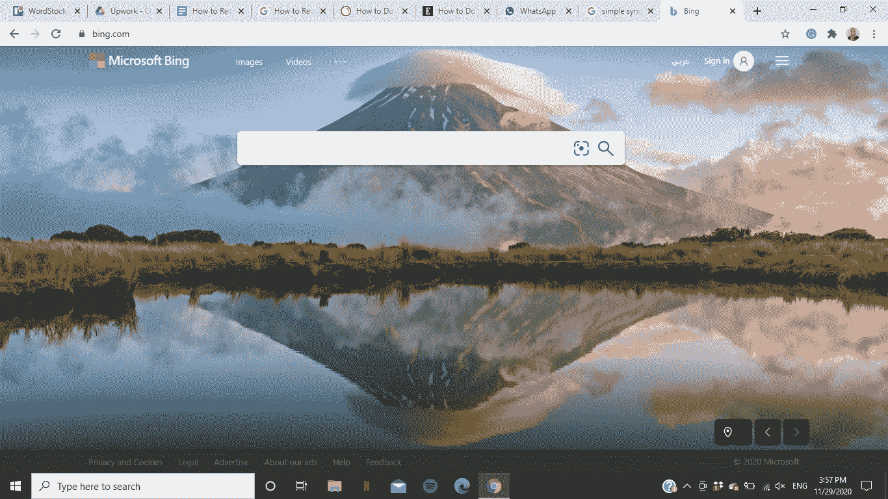
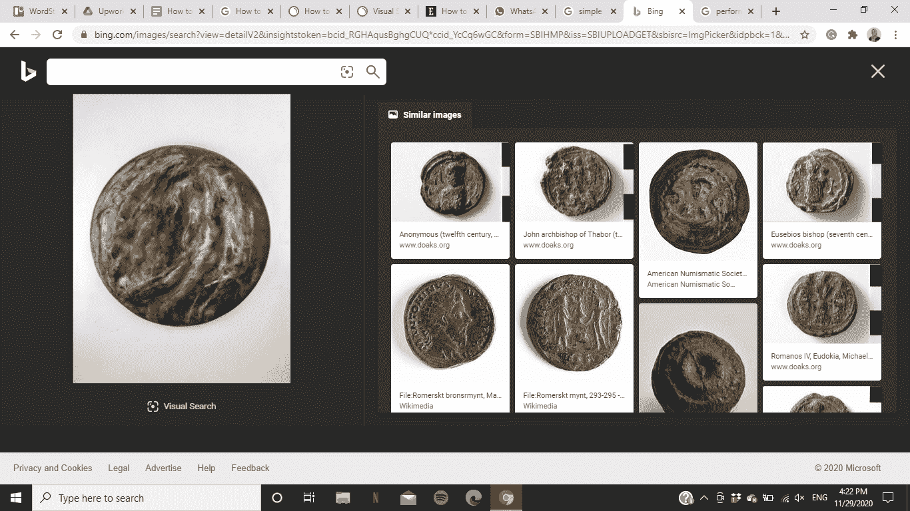
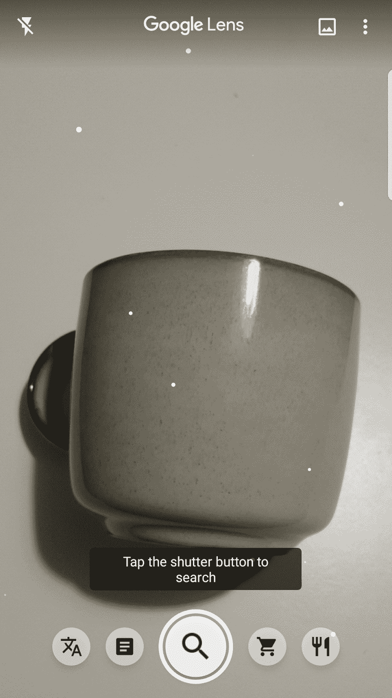
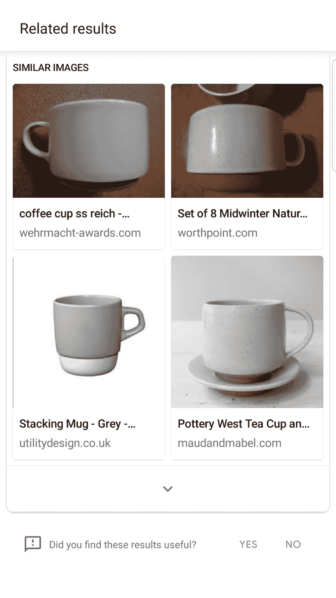

# 如何在你的手机或桌面上反向搜索图片——免费图片搜索工具

> 原文：<https://www.freecodecamp.org/news/how-to-reverse-image-search-on-your-phone-or-desktop/>

根据谷歌的数据，在过去的两年中，手机搜索“图片搜索”增长了 60%以上。

这是因为图像搜索允许用户从互联网上成千上万的图像中可视化任何给定的关键词。

也许你已经看到了来自在线图片编辑器的图片，一幅风景画，或者一个很酷的产品发布吸引了你的眼球，你想了解更多。

图片搜索就是答案。

反向图像搜索允许您反向工作，并从图像本身获得新的见解。我将详细说明反向图像搜索如何在多个平台上工作，这样你就可以做好充分的准备来利用这项技术向前发展。

## 什么是反向图像搜索？

这项技术使你能够谷歌任何照片、艺术品、图表或照片的来源。通过反向图像搜索，您可以在所有显示该图像的页面上找到该图像——即使该图像的长宽比或文件大小不同。

你也可以找到相似图片的图片搜索结果的链接。此外，图像搜索为您的查询提供了可能的相关搜索。

你可以通过谷歌、必应或任何类似的工具在手机或桌面上开始反向搜索图片。我现在将带你走过确切的步骤。

## 如何在桌面上进行反向图像搜索

根据您的偏好、操作系统和设备，您有几个图像搜索选项。

### **使用桌面浏览器进行反向图像搜索**

要执行此版本的图像搜索，请执行以下步骤:

1.  从去[images.google.com](https://images.google.com/)开始。
2.  接下来，单击相机图标，这将允许您从两个选项中进行选择。

*   首先，您可以从另一个页面粘贴图像的 URL。
*   第二种选择是上传图片本身。

3.然后，只需点击“输入”你的关键字或“搜索图片”按钮，以获得结果。

### **使用谷歌 Chrome 桌面浏览器进行反向图片搜索**

如果你已经在使用谷歌浏览器，那么你可以大大简化这个过程。当你在 Chrome 的任何网页上偶然发现一张图片时，你可以按照以下步骤进行反向图片搜索:

1.  右键单击您想要了解更多信息的图像。
2.  从下拉菜单中选择“搜索谷歌图片”。

这种简单的方法将立即显示您的搜索结果。

图片搜索非常强大。这里有一个例子。我最近看到这张照片，很感兴趣。我想了解更多。

所以我把它上传到了谷歌，并被告知这张照片的主角是 Sineenat Wongvajirapakdi，她是一名泰国护士、军官和泰国皇家法院的成员。

如果没有图片搜索，我永远也找不到这些信息。

### **使用微软必应进行反向图片搜索**

由于必应在全球拥有超过 10%的市场份额，可以肯定地说有一大批构建者和开发者在使用它。所以我想包括这个搜索引擎的步骤。

必应的视觉搜索与谷歌略有不同。例如，这是因为它检测购物意向，并提供包含其他类似产品及其价格信息的搜索结果。

以下是如何在微软必应上进行反向图片搜索:

1.  通过浏览器或应用程序打开 Microsoft Bing。

2.在搜索栏中点按相机形状的图标。

3.弹出式菜单将为您提供四个选项来搜索图片而不是文本。让我们探索一下选项:

*   首先，将一幅或多幅图像从您的电脑拖到搜索框中。
*   其次，浏览你的电脑，找到你想搜索的图片。
*   您也可以从先前浏览的在线页面粘贴图像的 URL。
*   最后一个选择是拍照并搜索更多相关信息。无论是产品还是地段，都可以了解更多。

最后，闲暇时浏览可视化搜索结果。

## 如何在手机上反向搜索图片

在手机上进行反向图片搜索可能会稍微有点难度。您有多种选择，但是它们需要更多的步骤。让我们一起走过它们。

### **使用谷歌 Chrome 应用程序进行反向图片搜索**

遗憾的是，谷歌 Chrome 应用本身并不支持移动端的反向图片搜索。但是你仍然可以通过一个聪明的变通办法来做到这一点，我将与你分享。下面是如何做到这一点:

1.  打开谷歌浏览器，输入“[images.google.com](https://images.google.com/)”。
2.  点击屏幕右上角的三点菜单。
3.  从下拉菜单中选择“桌面站点”。
4.  点击搜索栏中的照相机形状的按钮，用适合你的方法插入你的图片。

### **使用任何浏览器应用程序进行反向图像搜索**

你在浏览的时候有没有发现一张你想当场了解更多的图片？你如何逆向搜索照片？以下是步骤:

1.  长按您想要搜索的图像。

2.从下拉菜单中，选择“在谷歌上搜索此图片”。

除了浏览搜索结果以获取更多信息之外，别无选择。

### **使用谷歌镜头应用程序进行反向图像搜索**

Google Lens 是一个允许用户以多种方式通过图片进行搜索的应用程序。从扫描和翻译文本到在不同的在线商店搜索时尚商品，这个应用程序实现了你能想到的任何图像搜索场景。

让我们看看它是如何工作的:

1.  下载并启动谷歌镜头应用程序。
2.  为要搜索的图像选择所需的操作。以下是您的选择:

*   翻译:此功能允许您通过自动检测立即翻译任何图像上的任何文本。您可以选择文本使用的语言或您希望它翻译成的语言。
*   文本:这台即时复印机可以复制你图像上的任何文本，粘贴到你想粘贴的任何地方。

*   搜索:这个按钮很像标准的谷歌图片搜索，可以搜索你想要的任何物品或照片。

*   购物:这可以让你更了解图片中的某种产品，甚至通过它的条形码。
*   餐饮:这个有趣的功能可以让你找到更多关于一道菜的信息，或者翻译餐馆的菜单。

上传图像有两种选择:

*   拍一张你面前你想当场搜索的东西的照片。
*   或者从你的手机上传一张你想了解更多的照片。

### **使用 Pinterest 镜头进行反向图像搜索**

Pinterest 是世界上最受欢迎的应用之一。它以“Pinterest Lens”为名的图片搜索功能彻底改变了数字购物世界。

通过以下步骤，您可以找到、保存或购买您喜欢的图像中的任何项目:

1.  在手机上启动 Pinterest 应用程序。
2.  点击屏幕底部菜单中的搜索按钮。

3.轻按屏幕顶部搜索栏中的照相机形状的按钮。

4.您将有两个选择来挑选您的图像:

*   用手机摄像头拍张照片，然后开始搜索。
*   或者从您的图库中上传图片。

## 将这一切结合在一起

这篇文章介绍了一些有趣、简单、强大的技巧，可以完善手机或桌面上的反向图片搜索。

反向图像搜索丰富了学习、探索和好奇的建设者。

不仅消费者受益于这一技术，公司也受益于他们的产品。如果你认为反向图片搜索只是为了好玩和消费者，让我来帮你看看商业潜力。

客户服务软件越来越多地使用反向图像搜索来帮助代理商解决客户支持问题。对于技术机构来说也是如此，因为他们寻找产品来帮助他们的客户。

我的一个朋友建立了一家公司，为维护和维修用品制作视觉识别软件。那家公司是怎么结束的？嗯，被谷歌收购了。