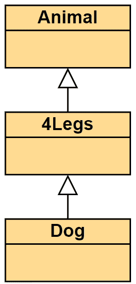

# 面向对象编程的四大支柱

> 原文：<https://www.freecodecamp.org/news/four-pillars-of-object-oriented-programming/>

JavaScript 是一种多范式语言，可以按照不同的编程范式编写。编程范式本质上是你在编写代码时遵循的一系列规则，以帮助你解决特定的问题。

这就是四大支柱。它们是帮助你编写干净的面向对象代码的软件设计原则。

面向对象编程的四大支柱是:

*   抽象
*   包装
*   遗产
*   多态性

让我们仔细看看它们。

# 面向对象编程中的抽象

抽象掉某些东西意味着隐藏某些东西内部的实现细节——有时是原型，有时是函数。所以当你调用这个函数的时候，你不需要理解它到底在做什么。

如果你必须理解一个大代码库中的每一个函数，你将永远不会编写任何代码。通读一遍要花几个月的时间。

通过抽象掉某些细节，你可以创建一个可重用的、简单易懂的、容易改变的代码库。让我给你举个例子:

```
function hitAPI(type){
	if (type instanceof InitialLoad) {
		// Implementation example
	} else if (type instanceof NavBar) {
		// Implementation example
	} else {
		// Implementation example
	}
}
```

This is not abstracted away at all.

在这个例子中，你能看到你是如何实现你的定制用例所需要的吗？

你需要的每一个新的 API 都需要一个新的`if`块，以及它自己的定制代码。这并不是抽象出来的，因为您需要为添加的每个新类型担心实现问题。它不可重复使用，是一个维护的噩梦。

像下面这样的怎么样？

```
hitApi('www.kealanparr.com', HTTPMethod.Get)
```

现在，您只需传递一个 URL 到您的函数，以及您想要使用的 HTTP 方法，就大功告成了。

你不必担心函数是如何工作的。已经处理好了。这极大地帮助了代码重用！并且使您的代码更易于维护。

这就是**抽象**的全部内容。在你的代码中寻找相似的东西，并提供一个通用的函数或对象来服务于多个地方/多个关注点。

这里有一个很好的**抽象**的最终例子:想象一下，如果你正在为你的用户创造一台煮咖啡的机器。可能有两种方法:

## 如何用抽象来创造它

*   有一个标题为“制作咖啡”的按钮

## 如何在没有抽象的情况下创建它

*   有一个标题为“烧水”的按钮
*   有一个标题为“给水壶加冷水”的按钮
*   有一个标题为“向一个干净的杯子里加入一勺研磨咖啡”的按钮
*   有一个标题为“清理脏杯子”的按钮
*   和所有其他按钮

这是一个非常简单的例子，但是第一种方法*将逻辑抽象到机器中。但是第二种方法迫使用户了解如何制作咖啡，并且实际上是自己制作。*

下一篇文章向我们展示了一种通过使用**封装来实现**抽象**的方法。**

# 面向对象编程中的封装

封装的定义是“将某物装入或仿佛装入胶囊的行为”。移除对部分代码的访问并使之私有正是**封装**的意义所在(通常人们称之为数据隐藏)。

封装意味着代码中的每个对象都应该控制自己的状态。状态是对象的当前“快照”。键、对象上的方法、布尔属性等等。如果你要重置一个布尔值或者从对象中删除一个关键点，它们都是对你的状态的改变。

限制您的代码可以访问的部分。让更多不需要的东西变得不可接近。

私有属性是通过使用闭包在 JavaScript 中实现的。下面是一个例子:

```
var Dog = (function () {

	// Private
	var play = function () {
		// play implementation
	};

	// Private
	var breed = "Dalmatian"

	// Public
	var name = "Rex";

	// Public
	var makeNoise = function () {
 		return 'Bark bark!';
	};

 	return {
		makeNoise: makeNoise,
		name: name
 	};
})(); 
```

我们做的第一件事是创建一个立即被调用的函数(称为**立即调用函数表达式**，简称 IIFE)。这创建了一个任何人都可以访问的对象，但是隐藏了一些细节。你不能调用`play`也不能访问`breed`，因为我们没有在最终的返回对象中公开它。

上面这个特殊的模式被称为**揭示模块模式**，但这只是一个如何实现**封装的例子。**

我想把重点更多地放在**封装**的想法上(因为这比仅仅学习一种模式并把**封装**算作现在完全完成更重要)。

反思，多想想如何隐藏你的数据和代码，并把它们分离出来。模块化和明确的职责是**面向对象**的关键。

为什么我们应该更喜欢隐私？为什么不把一切全球化呢？

*   大量不相关的代码将通过全局变量相互依赖/耦合。
*   如果名称 get 被重用，您可能会覆盖变量，这可能会导致错误或不可预测的行为。
*   你很可能会得到**意大利面条式的代码**——这些代码很难理解，也很难理解是什么在读写你的变量和改变状态。

可以通过将长代码行分离成更小的独立函数来应用封装。将这些功能分成模块。我们将数据隐藏在一个其他人不需要访问的地方，并清楚地公开需要的内容。

那就是**封装**就是果壳。将你的数据绑定到某个东西上，不管是类、对象、模块还是函数，尽你所能保持它的私密性。

# 面向对象编程中的继承

继承让一个对象获得另一个对象的属性和方法。在 JavaScript 中，这是通过**原型继承**来完成的。

可重用性是这里的主要好处。我们知道有时候多个地方需要做同样的事情，除了一小部分，他们需要做的事情都一样。这是一个继承可以解决的问题。

每当我们使用继承时，我们都试图使父和子具有**高内聚力。内聚性**是你的代码有多相关。比如`Bird`型是从`DieselEngine`型延伸出来的吗？

保持你的继承简单易懂和可预测。不要从完全不相关的地方继承，因为有一个方法或属性是你需要的。继承并不能很好地解决这个问题。

当使用继承时，您应该需要大部分的功能(您并不总是绝对需要所有的功能)。

开发者有一个原则叫做**利斯科夫替代原则**。它指出，如果你可以在任何使用子类的地方使用父类(姑且称之为`ParentType`)，并且`ChildType`继承了`ParentType`，那么你就通过了测试。

这个测试失败的主要原因是，如果`ChildType`正在从父对象中移除东西。如果`ChildType`移除了它从父代继承的方法，它将导致`TypeError`的情况，在那里事情是未定义的，这是你所期望的。



The arrows look like they're going the wrong way. But the Animal is the base - the parent.

继承链是一个术语，用来描述从基对象的原型(其他所有东西都继承自它)到继承链“末端”的继承流程(在上面的例子中，最后一个继承的类型是 **Dog** )。

尽你最大的努力保持你的遗产链干净和合理。当使用**继承时，你可以很容易地结束编码一个反模式(**称为**脆弱基反模式**)。这发生在你的基础原型被认为“脆弱”的地方，因为你对基础对象做了一个“安全”的改变，然后开始破坏你所有的子对象。

# 面向对象编程中的多态性

多态性意味着“以几种不同形式出现的情况。”这正是第四个也是最后一个支柱所关注的——同一继承链中的类型能够做不同的事情。

如果你正确地使用了继承，你现在可以像使用孩子一样可靠地使用父母。当两种类型共享一个继承链时，它们可以互换使用，代码中不会出现错误或断言。

从上一张图中，我们可能有一个叫做`Animal`的基本原型，它定义了`makeNoise`。然后，从该原型扩展的每个类型都可以重写以完成自己的自定义工作。大概是这样的:

```
// Let's set up an Animal and Dog example
function Animal(){}
function Dog(){}

Animal.prototype.makeNoise = function(){
	console.log("Base noise");
};

// Most animals we code up have 4\. This can be overridden if needed
Animal.prototype.legs = 4;

Dog.prototype = new Animal();

Dog.prototype.makeNoise = function(){
	console.log("Woof woof");  
};

var animal = new Animal();
var dog = new Dog();

animal.makeNoise(); // Base noise
dog.makeNoise();    // Woof woof- this was overridden
dog.legs;           // 4! This was inherited
```

`Dog`从`Animal`扩展而来，可以使用默认的`legs`属性。但是它也可以自己制造噪音。

多态的真正力量是共享行为，并允许自定义覆盖。

# 结论

我希望这已经解释了什么是面向对象编程的四个支柱，以及它们如何导致更干净和更健壮的代码。

如果你喜欢这篇文章并想看更多，我在 Twitter 上分享我的文章。