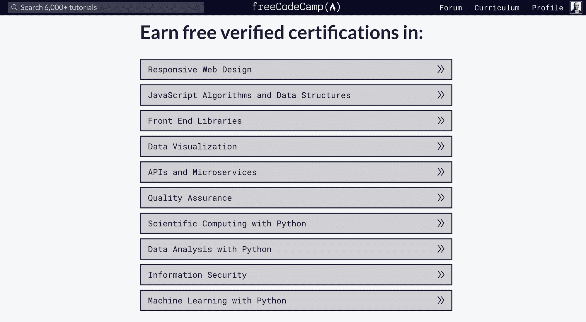
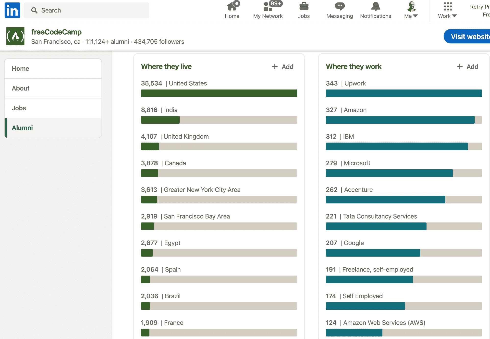
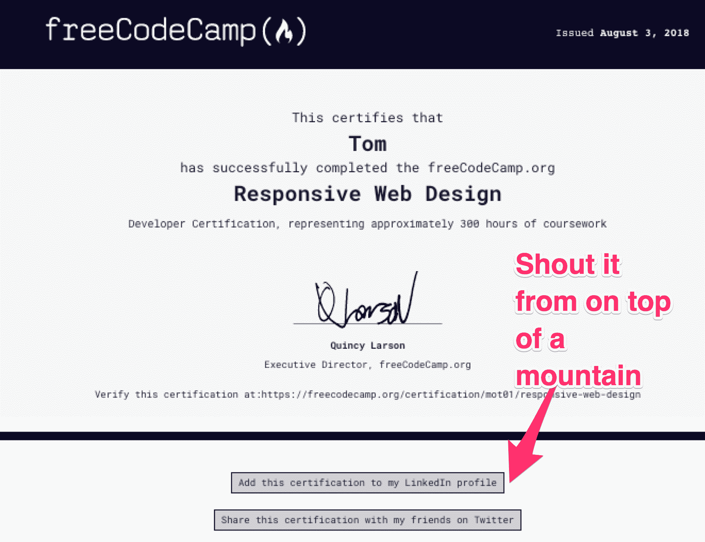
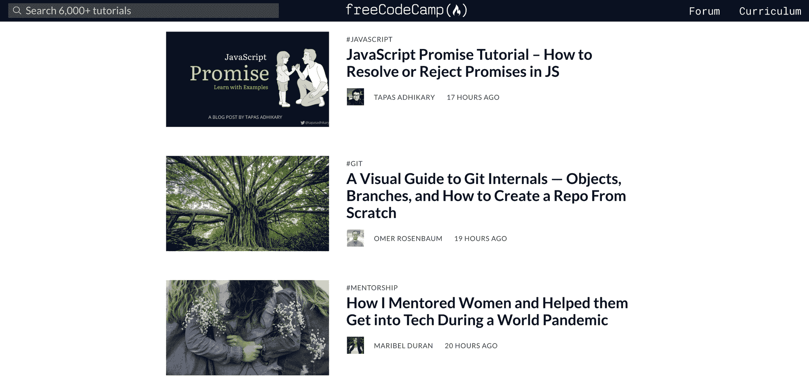
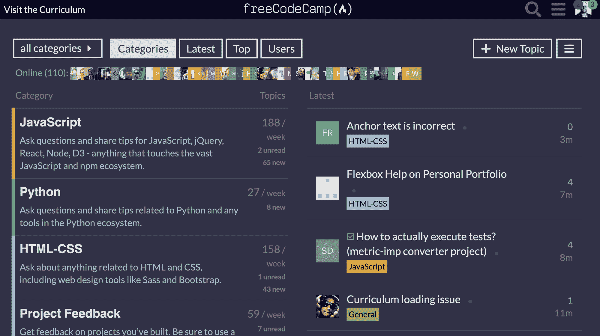
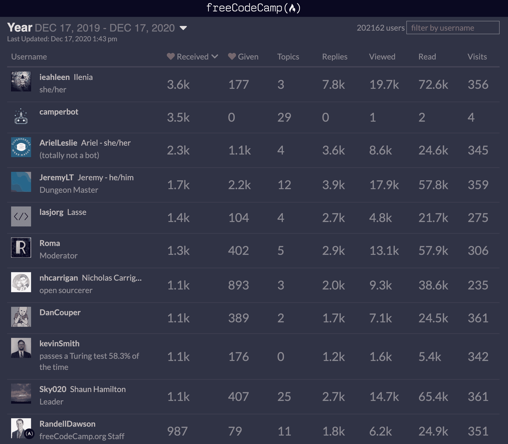
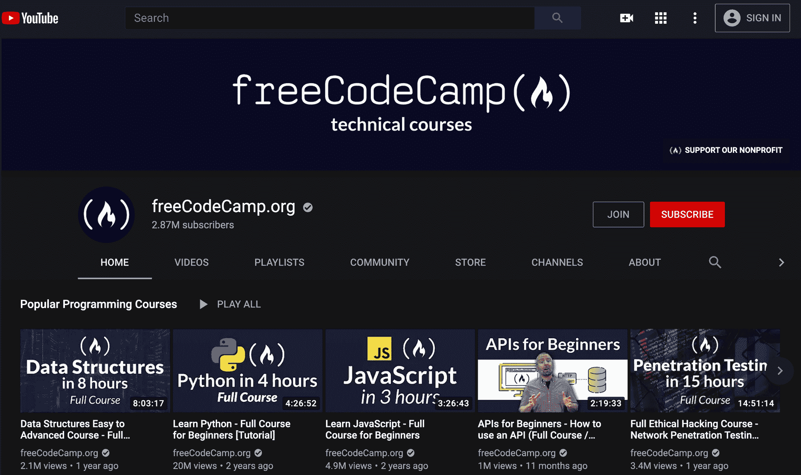
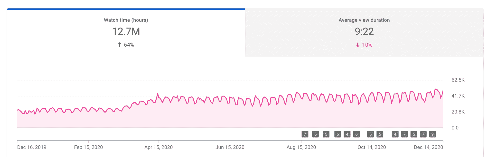
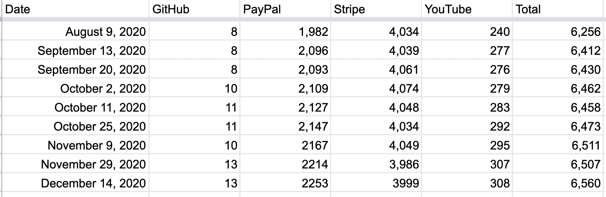
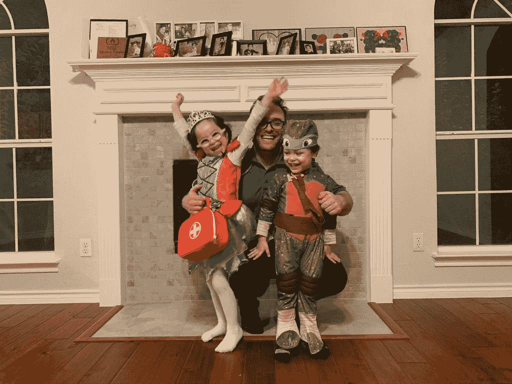

# 开发者在 2020 年花了 13 亿分钟使用 freeCodeCamp，以及其他年终事实

> 原文：<https://www.freecodecamp.org/news/freecodecamp-2021-year-in-numbers/>

这是一个关于 freeCodeCamp 社区走向 2021 年状态的快速更新。

首先，一些指标:

*   2020 年，freeCodeCamp 的整个运营预算仅为 498，521 美元。
*   凭借这一微薄的预算，我们的非营利组织能够提供超过**13 亿**分钟的教学——相当于全世界人民【2,519 年的学习时间。
*   以我们目前的资本效率水平，你捐给 freeCodeCamp 的每一美元都为全世界的人提供了近 50 个小时的学习时间。

从某种角度来说，我遇到过一些在 FAANG 公司工作的个人开发者，他们仅仅通过工作每年就能赚到超过 49.8 万美元。我们用它来运营一个全球性的非营利组织。

(顺便感谢每月捐款 5 美元支持 freeCodeCamp 的 6560 位好心人。如果你还没有捐款，你可以在这里加入这些令人敬畏的支持者。)

出于多种原因，2020 年是很长很长的一年。但好消息是，今年很多人利用空闲时间拓展他们的技能。他们中的许多人使用 freeCodeCamp 作为学习资源来做这件事。

首先你可能想知道这个社区是否还在增长。我们绝对是。


Both freeCodeCamp.org and our community YouTube channel have been steadily growing each year since 2015.

等等，条形图？好吧，你抓到我了。以下是他们未完成的荣耀中的确切数字:

```
+------+------------------+-------------+---------------+
| Year | freeCodeCamp.org |   YouTube   | Yearly Total  |
+------+------------------+-------------+---------------+
| 2015 |       37,367,085 |     246,639 |    37,613,724 |
| 2016 |      189,054,404 |   1,449,703 |   190,504,107 |
| 2017 |      307,802,640 |   8,331,843 |   316,134,483 |
| 2018 |      401,473,441 |  92,197,551 |   493,670,992 |
| 2019 |      347,393,464 | 474,000,000 |   821,393,464 |
| 2020 |      508,054,160 | 764,332,218 | 1,272,386,378 |
+------+------------------+-------------+---------------+
```

高层概述时间。freeCodeCamp 社区有四大支柱:

## 支柱 1:免费代码营课程



The 10 verified certifications you can earn if you can power through our lengthy, no-nonsense curriculum.

freeCodeCamp 有一个 3000 小时，10 个认证长的软件工程课程。截至 2020 年 12 月，我们有超过 110，000 人自称是校友(在他们的 LinkedIn 个人资料中列出至少一项认证)。



Where some of our alumni are from, and where they now work

这些人中的许多人在开始使用 freeCodeCamp 时已经是开发人员了，但其中至少有 40，000 人在获得认证后获得了他们的第一份技术工作。

这是对 freeCodeCamp 社区帮助了多少职业的保守估计。

关于这一点，如果你正在阅读这篇文章，并且还没有将你的 freeCodeCamp 认证添加到你的 LinkedIn 个人资料中，我们在你的认证下面添加了一个按钮，你可以点击它来这样做。



You can click the "Add this certification to my LinkedIn profile" button below your certifications.

今年，我们在 freeCodeCamp 课程的 7.0 版本上取得了重大进展，并发布了 4 个新的 Python 认证，您可以获得这些认证:

*   科学计算
*   数据分析
*   机器学习
*   信息安全

我们才刚刚开始。我们有超过 50 个指导项目(有完整的测试套件)在工作中。你可以[在这里](https://www.freecodecamp.org/news/python-curriculum-is-live/)阅读更多关于重大课程更新的信息。

## 支柱 2:自由代码营出版物



A screenshot of the freeCodeCamp publication

2019 年，我们将 freeCodeCamp 的出版物从 Medium.com 转移到我们自己的自托管基础设施上。结果是:更快、更干净的用户体验。

freeCodeCamp 的出版物一度占据了所有媒体流量的 10%,而我们的自托管出版物现在甚至超过了这个数字。

我们每周发表约 20 篇文章，全部由我们的编辑团队精心策划和编辑。它有点像面向开发人员的学术期刊。

最重要的是，我们强调质量和与开发者观众的相关性。最终结果是世界各地的广大读者都在学习新技能。

### 2020 年最受欢迎的 10 篇 freeCodeCamp 文章

以下是我们刊物 2020 年以来最受欢迎的 10 篇文章。

你可能想把它们标上书签，因为这些信息太多了，很多都需要多次阅读。

*   [系统设计面试问题——你应该知道的概念](https://www.freecodecamp.org/news/systems-design-for-interviews/)Zubin Pratap 著
*   弗拉维奥·科普斯的 Linux 命令手册
*   [Dijkstra 的最短路径算法 Estefania Cassingena Navone 的详细直观介绍](https://www.freecodecamp.org/news/dijkstras-shortest-path-algorithm-visual-introduction/)
*   自由网络开发者指南:如何通过自由编程工作赚钱
*   软件开发人员可以成长的 23 条职业道路
*   Sharvin Shah 的《Python 终极指南:如何从初学者到专业人员》
*   法尔汉·哈辛·乔杜里的《码头工人手册》
*   [我在 30 天内做了 60 多次技术访谈，从中我学到了什么](https://www.freecodecamp.org/news/what-i-learned-from-doing-60-technical-interviews-in-30-days/)
*   Nick McCullum 用简单的英语解释了 9 个关键的机器学习算法
*   如何使用 HTML、CSS 和 JavaScript 从零开始构建 PWA

## 支柱 3:自由代码营论坛

自由代码营论坛仍然是网上讨论技术的最有礼貌的地方之一。您可以向社区提出编程问题，或者获得对您的项目的建设性反馈。



A screenshot of the freeCodeCamp forum

2020 年，人们在 freeCodeCamp 论坛上花了大约 124，019，921 分钟(235 年)。这是花费在帮助其他开发人员上的大量时间。

当然，它之所以是一个如此礼貌、富有成效的地方，是因为我们有很棒的人在那里闲逛并帮助人们。以下是过去一年中最乐于助人的人。([全浏览排行榜](https://forum.freecodecamp.org/u?period=yearly))



The 10 most helpful people on the forum this past year, based on the number of hearts they received from other campers. Camperbot is very helpful, but isn't a person. Sorry, Camperbot. You don't count. But thanks for everything you do.

## 支柱 4:免费代码营社区 YouTube 频道



A screenshot of the freeCodeCamp community YouTube channel

最后但同样重要的是，我们有免费代码营社区 YouTube 频道。我们在那里发布免费的数学、计算机科学和编程的完整课程。

2020 年，我们在那里贴出了 120 多个全程课程，每个课程平均时长 5 个小时。有很多免费的学习资源。

视频课程是教世界各地的人的好方法，即使你不在键盘前，也是一种方便的学习方式。人们花了很多时间学习:



YouTube analytics for the past year. Campers watched more than 12 million hours of programming courses on freeCodeCamp's YouTube channel.

freeCodeCamp 社区频道现在是 YouTube 上最大的节目频道。但是我们才刚刚开始。

### 2020 年最受欢迎的 5 个免费代码营 YouTube 课程

以下是我们在 2020 年发布的 120 门新课程中点击率最高的课程:

*   [TensorFlow 2.0 完整课程](https://www.freecodecamp.org/news/massive-tensorflow-2-0-free-course/)–Tim RUS CICA 的 7 小时课程
*   [微积分 1 -完整的大学课程](https://www.freecodecamp.org/news/learn-college-calculus-in-free-course/)-Linda Green 博士(北卡罗来纳大学教堂山分校教授)教授的 12 小时课程
*   [面向初学者的 Android 开发](https://www.freecodecamp.org/news/learn-to-develop-and-android-app-no-experience-required/)–mei Sam Mansourzadeh 教授的 15 小时课程
*   [微软 Azure 基础认证课程](https://www.freecodecamp.org/news/azure-fundamentals-course-az900/)–由 Andrew Brown 教授的 3 小时课程
*   [编程和计算机科学简介](https://www.freecodecamp.org/news/introduction-to-computer-programming-and-computer-science-course/)–由 Steven 和 Sean 教授的 2 小时课程

同样，你可以把这些加入书签，以后再看。除非你现在想从头到尾看完。

如果你查看这些视频的评论，你几乎总是会看到有人评论说:“妈妈，睡觉前再看一个视频！”是的。我看到你了，评论者。我看见你了。

## 可持续性——我们的非营利组织表现如何？

这是我说，“如果你不捐赠给我们的非营利组织，免费代码营将不复存在，我们的服务器将停止运行，昆西将不得不卖掉他的一个肾脏来支付下个月的 AWS 法案。”

但那不是真的。一点也不。事实是，我们的非营利组织一直在小心翼翼地分配我们稀缺的捐赠资金。我们在力所能及的范围内运作良好。

我们试图尽可能公开我们如何运营我们的非营利组织。例如，我们有来自 GuideStar.org 的白金透明度评级。

如果你好奇，这是我们最新的 990 。本质上，这是非营利组织向美国政府提交的年度报告。

由于我们的精心规划，我们有了一个 10 年的项目路线图。我们不需要对任何投资者或公司利益负责。我们只对你负责——我们的社区。

我希望我们做得很好，给了你们所有人想要的:关于数学、计算机科学和编程的优秀免费学习资源。因为我们将会做更多这样的事情。有了你的帮助(和你的捐赠)，我们可以做得更多。

还记得之前的那些数字吗？每捐赠一美元，我们就为世界各地的人们提供近 50 个小时的学习时间。如果你想支持一个捐赠效率极高的非营利组织，你可以在这里成为每月支持者。我们只要求 5 美元。



The number of people who are supporting freeCodeCamp through $5 / month donations is growing. Currently: 6,560\. (And yes, it is possible to support our nonprofit through [GitHub](https://github.com/sponsors/freeCodeCamp).)

如果你每月没有 5 美元，没问题。我们将永远自由。如果你愿意，你可以以后支持我们，一旦你获得了应用这些新获得的开发者技能的报酬。

如果您在年底有一点额外的现金，您可以[通过 PayPal 向我们一次性捐款，金额不限](https://paypal.me/freecodecamp)。

您的捐赠将帮助我们扩大预算和任务规模:**通过创建视频、文章和交互式编码课程来帮助人们免费学习编码——所有这些都免费提供给公众。**

感谢您花时间阅读我们社区在 2020 年的快速回顾。2021 年对社区来说将是重要的一年。我很高兴你能和我们在一起。

圣诞快乐，节日快乐，2021 年再见。



Me with the kids: Jocelyn and Quentin. They'll learn to code when they feel ready :)