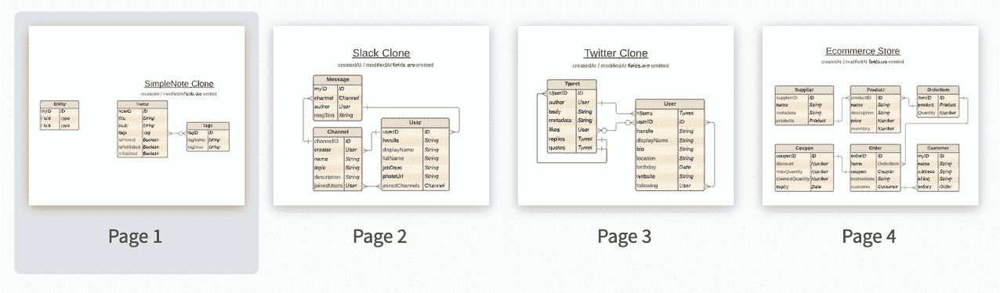
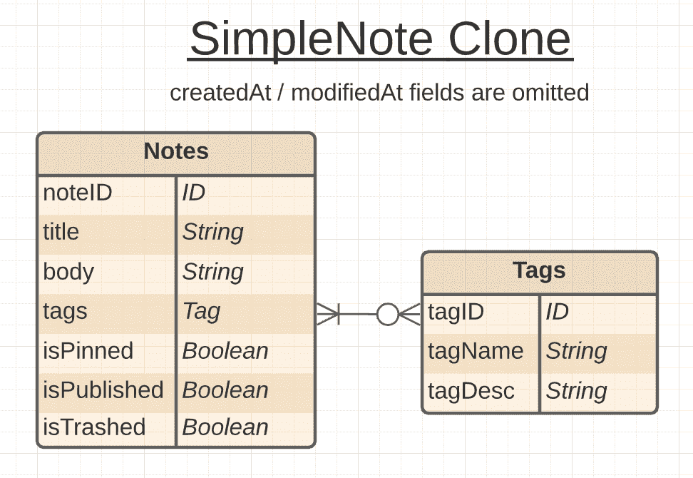
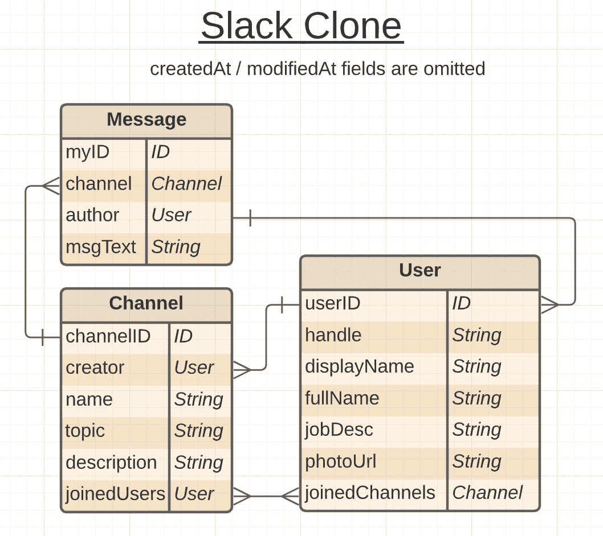
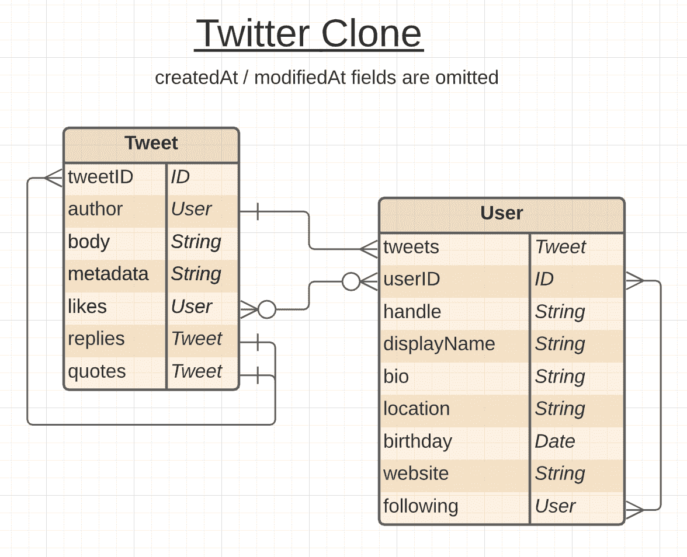
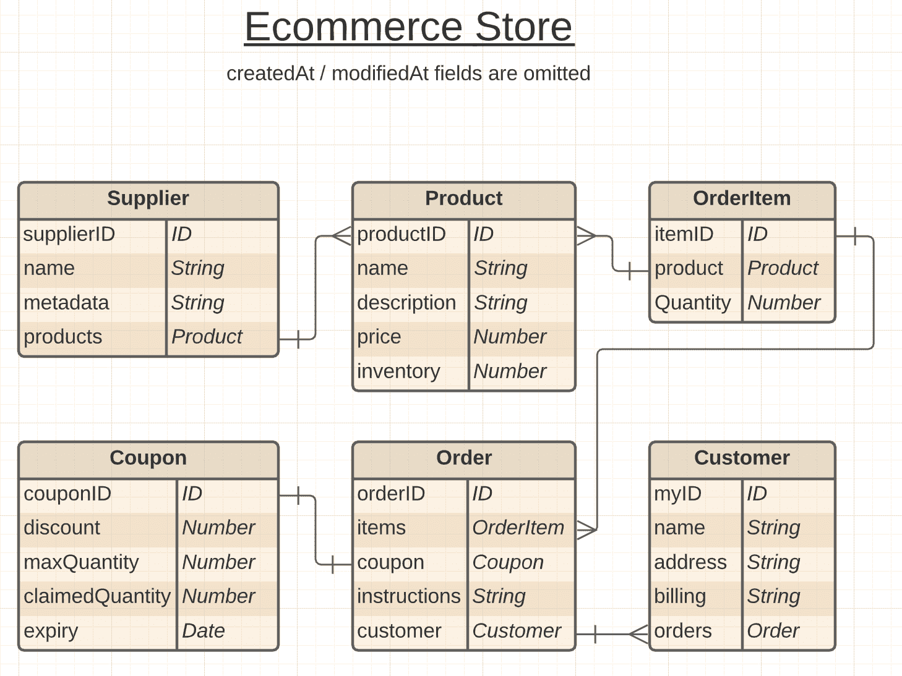
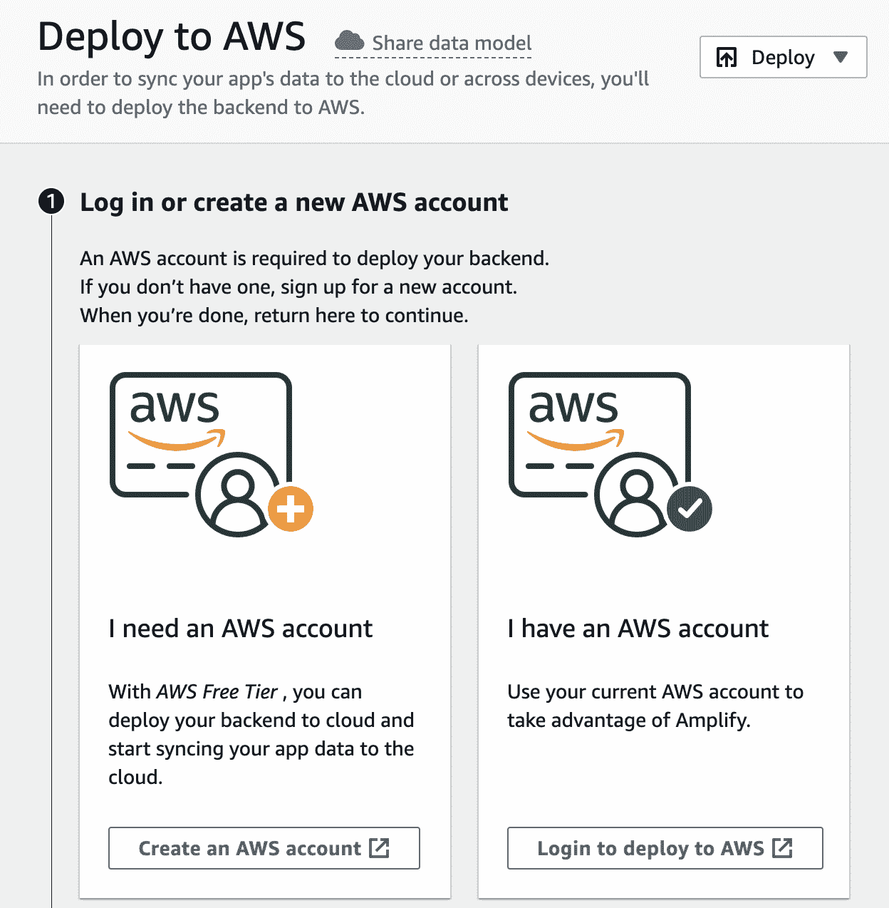
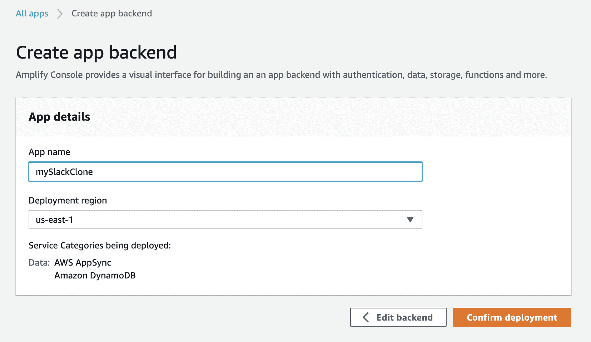

# 如何设计几乎任何后端，并在没有代码的情况下将其部署到 AWS

> 原文：<https://www.freecodecamp.org/news/design-and-deploy-backend-with-amplify-sandbox/>

在这篇文章中，我将向你展示如何设计四个不同的示例应用——一个 SimpleNote 克隆、一个 Twitter 克隆、一个 Slack 克隆和一个电子商务商店。我们将用 AWS re:Invent 2020 上发布的最酷的新玩具来做这件事。

## 介绍 Amplify 沙盒

[Amplify Admin UI](https://aws.amazon.com/blogs/aws/aws-amplify-admin-ui-helps-you-develop-app-backends-no-cloud-experience-required/) 是一个新的低代码接口，用于构建不需要任何 AWS 专业知识的应用后端。然而，许多人可能会忽略的是，Amplify Admin 还包括[一个奇妙的新沙盒](https://sandbox.amplifyapp.com/)，它让你无需 AWS 帐户就可以开始使用。

这个沙箱是 Amplify Admin UI 的一个公共共享版本，在这里你可以创建和原型化你的数据模型，甚至不需要登录 AWS 帐户！

目前只有[的数据沙箱](https://sandbox.amplifyapp.com/start#datastore)已经建成，但随着时间的推移，其他 AWS Amplify 类别也将推出。

当您第一次进入沙箱时，您会进入一个可视化构建器，您可以在其中添加您的[模型、枚举和自定义类型](https://docs.aws.amazon.com/appsync/latest/devguide/designing-your-schema.html)。大多数情况下，你只是创建模型。

您可以命名模型、添加字段和指定类型(包括它们是可选字段还是数组字段)，甚至可以在模型之间添加一对一、一对多或多对多的关系*。*

此外，它甚至允许您*共享*您创建的数据模型！这意味着你不必每次创建项目都从头开始，并且**你可以像共享代码一样共享你的数据模式**。

## 我们的四个示例沙盒

我认为通过勾勒出四个您可以使用的示例沙盒来展示它的强大功能是一个好主意:

*   一款**笔记**应用(灵感来自免费笔记应用 [SimpleNote](https://simplenote.com/)
*   一款**聊天**应用(灵感来自 Slack)
*   一个社交媒体应用程序(受 Twitter 启发)
*   一个**电子商务**后台(灵感来自每次购物体验)

## 如何创建实体关系图

Amplify Admin UI 让我们很容易上手，但是在开始之前做一些规划是值得的。

久经考验的方法是绘制[实体关系图](https://www.youtube.com/watch?v=QpdhBUYk7Kk)。我们选择[为我们的](https://lucid.app/lucidchart/invitations/accept/563dc191-6613-44f5-aef0-24224ad5fbe1)使用 Lucidcharts，但是你可以使用任何图表工具来做这件事。

## 笔记应用程序

这是一个我个人每天都在使用的极简应用，所以我喜欢它的简洁。我们有两个模型:注释和标签，为了方便查询，它们之间只有一个多对多的关系。

您可以通过提供协作的、基于角色的编辑来扩展这一功能，一旦您部署了这一模型，就可以使用这一功能。您还应该利用[客户端数据存储库](https://docs.amplify.aws/lib/datastore/getting-started/q/platform/js#datastore-with-amplify)来确保您的笔记离线工作。

这里可以看到沙盒:[https://Sandbox . amplifyapp . com/schema-design/1c 782 f 02-1 Fe 7-4785-9a 02-22 a 27 cc 96d 0d/clone](https://sandbox.amplifyapp.com/schema-design/1c782f02-1fe7-4785-9a02-22a27cc96d0d/clone)。注意，我们在模型之间使用双向**多对多**关系，因为注释可以有零个或多个标签，反之亦然。

## 松弛的克隆体

我们很多人在工作中使用聊天应用，所以我们从用户端熟悉这个应用用例。

这里新的细微差别是，每条消息都属于一个频道和一个用户，每个用户都可以创建和加入频道。所以在三个主要模型之间有一个有趣的三向关系。

这里可以看到沙盒:[https://Sandbox . amplifyapp . com/schema-design/5f 863684-fd1e-41 B4-BCA 1-36 c 2271 e 21 a 1/clone](https://sandbox.amplifyapp.com/schema-design/5f863684-fd1e-41b4-bca1-36c2271e21a1/clone)。**频道**是这里最复杂的模型——注意我们如何充分利用沙盒中所有可用的关系类型:

*   频道可以有**多个**用户，用户可以加入**多个**频道
*   频道只能由**一个**用户创建，并且不需要跟踪任何特定用户创建了什么频道
*   渠道可以有**多条**消息，但每条消息只能属于**一个**渠道

## 推特的克隆

社交媒体通常是建模最复杂的数据模型之一。我们实施最简单可行的社交媒体应用——一条推文和一个用户模型是我们所能提供的全部。

然而，推文本身有一套复杂的关系。它有一个作者用户，以及一组需要建模的赞、回复和引用。

你可以考虑对这个应用程序进行其他修改:提供其他类型的推文，包括投票、图像和视频，内置广告和直接消息。

这里可以看到沙盒:[https://Sandbox . amplifyapp . com/schema-design/ad 5b 5b 7 e-f207-42 D1-92 B1-0 ccef 056 a 26b/clone](https://sandbox.amplifyapp.com/schema-design/ad5b5b7e-f207-42d1-92b1-0ccef056a26b/clone)。注意，这里的递归是通过将赞、回复和引用建模为各自用户和 Tweet ID 的**数组**来实现的。

## 电子商务商店

当涉及到金钱时，风险就更大了。跟踪订单并确保良好的客户体验至关重要。

我们通过确保为供应商、产品、订单和客户建立独立的模型来模拟典型的电子商务后端。为了深入了解典型订购体验的细微差别，我们还提供了在单个订单中指定产品数量的功能，以及应用优惠券的功能。

由于电子商务体验有无限多的变化，我们不可能全部建模，但我希望这是一个足够好的起点。如果你对这个概念有什么想法，请分享你自己的想法！

这里可以看到沙盒:[https://Sandbox . amplifyapp . com/schema-design/aa 0e 7a 61-aa72-4b 27-b6db-ea8e 2031 f95e/clone](https://sandbox.amplifyapp.com/schema-design/aa0e7a61-aa72-4b27-b6db-ea8e2031f95e/clone)。注意，沙盒的特性很容易处理这种模型的复杂性。一个订单只能有一个客户，但是一个客户可以有多个订单。

当您在客户模型上设置它时，沙盒足够智能，可以自动设置相应的 customerID 字段作为订单模型上的“**关系源**”。这对于 GraphQL 查询来说非常方便。

## 如何将模型部署到 AWS

一旦你完成了你的模型，沙盒会提示你用 [Amplify CLI](https://docs.amplify.aws/cli) 下载它进行本地测试。但是，如果您只想在 AWS 上实现它，您可以跳过这一步，直接进入“部署到 AWS”阶段:

一旦你点击“登录部署到 AWS”，你就完成了！想象一下——您刚刚创建了一个实际的后端数据模型**,而没有编写任何代码**,并将其直接部署到 AWS。🤯

在这里，您可以设置进一步的定制，包括添加身份验证、邀请用户和分配角色、在每个模型上添加授权规则、使用我们的 WYSIWYG 编辑器创建内容等等。

如果你想了解更多，阿里·斯皮特尔写了一篇很棒的博客，关于 Amplify Admin UI 在你部署之后变得多么强大，而这篇文章是关于在部署之前不需要账户的沙盒环境*。*

Nader Dabit 还写了另外 10 个你可能想尝试的功能。

有了 Amplify 沙盒，通过任何应用后端场景建模和思考真的很容易，所以希望这些例子能激发你的创造力。如果您有任何请求或意见，[请告诉我](https://twitter.com/swyx)！