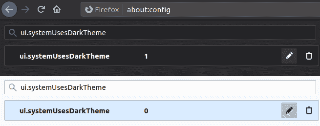
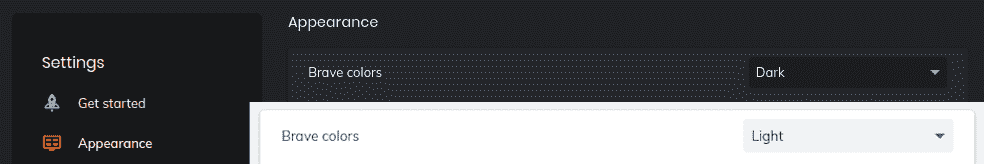

# 如何用最少的 CSS 创建响应性页面和颜色主题

> 原文：<https://www.freecodecamp.org/news/responsive-pages-and-color-themes-with-minimal-css/>

想建立一个颜色主题的响应网站？从根开始。

如果你碰巧路过我的网站，你可能会注意到我对它做了一些修饰。 [Victoria.dev](https://victoria.dev/) 现在可以更好地响应您的设备和偏好。

大多数现代设备和网络浏览器允许用户为用户界面选择亮或暗的主题。通过 [CSS 媒体查询](https://developer.mozilla.org/en-US/docs/Web/CSS/Media_Queries/Using_media_queries)，你可以改变自己网站的风格来匹配这个用户设置！

媒体查询也是改变网页元素以适应不同屏幕尺寸的常用方法。当结合在[根元素](https://developer.mozilla.org/en-US/docs/Web/CSS/:root)上设置的[定制属性](https://developer.mozilla.org/en-US/docs/Web/CSS/--*)时，这是一个特别强大的工具。

以下是如何使用 CSS 媒体查询和自定义属性来改善访问者的浏览体验，只需几行 CSS 代码。

## 如何迎合人们的色彩喜好

可以查询 [`prefers-color-scheme`媒体功能](https://developer.mozilla.org/en-US/docs/Web/CSS/@media/prefers-color-scheme)来提供用户选择的配色方案。如果没有设置活动的首选项，`light`选项是首选版本，它在现代浏览器中有[的体面支持](https://caniuse.com/mdn-css_at-rules_media_prefers-color-scheme)。

此外，在某些设备上阅读的用户还可以根据时间表设置浅色和深色主题。例如，我的手机在白天使用浅色，晚上使用深色。你可以让你的网站效仿。

通过在你的`:root`伪类上为你的颜色主题设置自定义属性来避免重复大量的 CSS。为您希望支持的每个主题创建一个版本。这里有一个简单的例子供你参考:

```
:root {
    color-scheme: light dark;
}

@media (prefers-color-scheme: light) {
    :root {
        --text-primary: #24292e;
        --background: white;
        --shadow: rgba(0, 0, 0, 0.15) 0px 2px 5px 0px;
    }
}

@media (prefers-color-scheme: dark) {
    :root {
        --text-primary: white;
        --background: #24292e;
        --shadow: rgba(0, 0, 0, 0.35) 0px 2px 5px 0px;
    }
} 
```

如您所见，您可以使用自定义属性来设置各种值。要将这些作为变量与其他 CSS 元素一起使用，请使用 [`var()`](https://developer.mozilla.org/en-US/docs/Web/CSS/var()) [函数](https://developer.mozilla.org/en-US/docs/Web/CSS/var()):

```
header {
    color: var(--text-primary);
    background-color: var(--background);
    box-shadow: var(--shadow);
} 
```

在这个简单的例子中，`header`元素现在将根据用户的浏览器设置显示他们喜欢的颜色。

根据浏览器的不同，用户可以用不同的方式设置首选配色方案。这里有几个例子。

### Firefox 中的明暗模式

你可以在地址栏输入`about:config`来测试火狐浏览器的`light`和`dark`模式。如果弹出警告，接受它，然后在搜索中键入`ui.systemUsesDarkTheme`。

为设置选择一个`Number`值，然后为暗输入一个`1`或为亮输入一个`0`。



### 勇敢中的明暗模式

如果你正在使用勇敢，在**设置** > **外观** > **勇敢的颜色**中找到颜色主题设置。



## 如何使用可变缩放

您还可以使用自定义属性根据用户的屏幕大小轻松调整文本或其他元素的大小。 [`width`媒体功能](https://developer.mozilla.org/en-US/docs/Web/CSS/@media/width)测试视口宽度。

虽然`width: _px`将匹配一个精确的大小，你也可以使用`min`和`max`来创建范围。

用`min-width: _px`查询匹配任何超过`_`像素的内容，用`max-width: _px`查询匹配任何不超过`_`像素的内容。

使用这些查询在`:root`上设置自定义属性以创建比率:

```
@media (min-width: 360px) {
    :root {
        --scale: 0.8;
    }
}

@media (min-width: 768px) {
    :root {
        --scale: 1;
    }
}

@media (min-width: 1024px) {
    :root {
        --scale: 1.2;
    }
} 
```

然后通过使用 [`calc()`](https://developer.mozilla.org/en-US/docs/Web/CSS/calc()) [函数](https://developer.mozilla.org/en-US/docs/Web/CSS/calc())使元素响应。这里有几个例子:

```
h1 {
    font-size: calc(42px * var(--scale));
}

h2 {
    font-size: calc(26px * var(--scale));
}

img {
    width: calc(200px * var(--scale));
} 
```

在这个例子中，用一个初始值乘以您的`--scale`自定义属性允许标题和图像的大小神奇地调整到您用户的设备宽度。

相对单位`rem`也会有类似的效果。您可以使用它来定义元素相对于在根元素中声明的字体大小的大小。

```
h1 {
    font-size: calc(5rem * var(--scale));
}

h2 {
    font-size: calc(1.5rem * var(--scale));
}

p {
    font-size: calc(1rem * var(--scale));
} 
```

当然，也可以将两个自定义属性相乘。例如，将`--max-img`设置为`:root`的自定义属性可以帮助您节省时间，因为您不必在多个地方更新像素值:

```
img {
    max-width: calc(var(--max-img) * var(--scale));
} 
```

## 提高你的反应游戏

尝试这些简单的方法，让网站迎合访问者的设备和偏好。我现在已经在 [victoria.dev](https://victoria.dev/) 上很好地利用了它们。我邀请你去[让我知道你有多喜欢它！](https://victoria.dev/contact)

如果你喜欢这篇文章，它的出处还有很多。订阅 [victoria.dev](https://victoria.dev) 抢先看新文章。