# 如何使用 SendGrid API 发送电子邮件简讯

> 原文：<https://www.freecodecamp.org/news/send-email-newsletter-with-the-sendgrid-api/>

多年来，昆西·拉森通过 freeCodeCamp 的 [Mail for Good](https://github.com/freeCodeCamp/mail-for-good) 平台发送每周电子邮件简讯，该平台由亚马逊 SES 提供支持。

他最近将这个过程迁移到了 SendGrid。在本文中，我将向您展示我是如何构建一个工具来实现这一点的。

## 如何设置 SendGrid 帐户

第一步是[注册 SendGrid](https://signup.sendgrid.com/) 并设置您的帐户。出于本教程的目的，自由层应该足够了。

随着应用程序规模的扩大，您可能需要通过平台增加可用的电子邮件数量。

## 如何在 SendGrid 上设置专用的 IP 地址

默认情况下，SendGrid 使用共享 IP 地址发送电子邮件。对于小规模的电子邮件应用程序来说，这可能是可以接受的，但是随着发送速率的提高，您将需要设置一个专用的 IP 地址。

这是一个好主意，因为您的“发件人信誉”(SendGrid 用来评估您在电子邮件服务提供商中的地位的指标)不会受到共享同一 IP 的其他用户的行为的负面影响。

要设置您自己的专用 IP 地址，请从侧面导航菜单中选择“设置”选项，然后选择“IP 地址”。不过，需要注意的是:这个选项在自由层上不可用。

根据您的付费计划，您可能已经设置了一个专用 IP 地址。如果您没有，或者如果您选择添加更多，您可以选择“添加 IP 地址”按钮来配置一个新的 IP 地址。

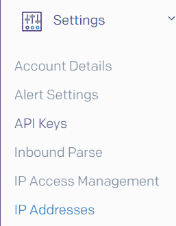

Setting menu for IP addresses

## 如何在 SendGrid 中授权电子邮件发送者

*注意:如果您使用自定义电子邮件域，可以跳过这一部分。*

要从您的个人电子邮件地址发送电子邮件，您需要验证该电子邮件地址属于您。

在左侧菜单中，选择“设置”，然后选择“发件人验证”。选择“验证单一发件人”来完成添加您的一个电子邮件地址的流程。

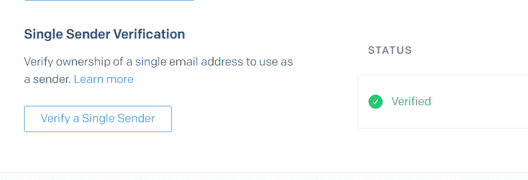

Single Sender option

## 如何在 SendGrid 中认证您的自定义域

*注意:如果您没有为您的电子邮件使用自定义域，您可以跳过这一部分。*

为了从您的自定义邮件域发送电子邮件，您需要使用 SendGrid 对该域进行身份验证。要进入此屏幕，请再次选择设置菜单，然后选择“发件人身份验证”。

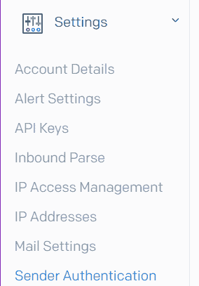

Setting menu for Sender Authentication

然后，您应该会看到一个带有“域认证”选项的屏幕。选择“验证您的域”选项，SendGrid 将引导您完成配置 DNS 记录的过程(根据您的 DNS 提供商提供具体说明)。

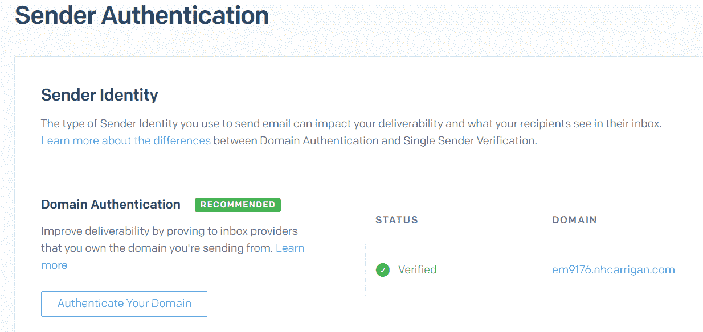

Sender Authenication settings page

## 如何在 SendGrid 中设置反向 DNS

*注意:如果您没有为您的电子邮件使用自定义域，您可以跳过这一部分。*

电子邮件提供商使用反向 DNS(域名系统)来查找给定 IP 地址的所有者。设置此项将允许电子邮件提供商验证您发送电子邮件的 IP 地址是否已连接到您的自定义域。

在与上面相同的发件人身份验证屏幕中，您会看到“反向 DNS”部分。将有一个选项来配置你的帐户上的每个专用 IP 的反向 DNS 像域认证，SendGrid 的平台将带你通过设置。

## 如何在 SendGrid 中设置电子邮件认证

*注意:如果您没有为您的电子邮件使用自定义域，您可以跳过这一部分。*

主要的电子邮件提供商(如 Gmail、Yahoo 和 Outlook)使用几种方法来验证电子邮件发件人的身份:SPF、DKIM 和 DMARC。

*   **SPF** (发件人策略框架)验证从您的域发送邮件的 IP 地址是否被授权这样做。
*   **DKIM** (域名密钥识别邮件)使用公钥字符串来验证电子邮件`from`地址是准确的，而不是伪造的。
*   **DMARC** (基于域的消息认证、报告和一致性)是一组指令，告诉电子邮件提供商当电子邮件未通过 SPF 或 DKIM 验证时如何做出反应。

作为域认证过程的一部分，SendGrid 的认证流程将引导您设置 SPF 和 DKIM，但是您需要手动配置 DMARC。

访问您的 DNS 托管提供商并访问 DNS 管理设置。从那里，添加一个名为`_dmarc.yourdomain.com`的新的`TXT`记录(用您的自定义域替换`yourdomain.com`)。

注意，一些提供者，比如 GoDaddy，会自动将您的域添加到记录中——在这种情况下，名称应该是`_dmarc`。

该记录的*值*应该采用与以下类似的结构:

```
"v=DMARC1; p=none; pct=100; rua=mailto:dmarc@yourdomain.com"
```

*   `v=DMARC`表示要使用的 DMARC 规则版本(目前只有版本 1 可用)。
*   `p=none`表示当电子邮件未通过 DKIM 或 SPF 时，电子邮件提供商应采取的措施。此设置应以`none`开头，以避免影响您的电子邮件的送达率。一旦您确认您的 DKIM 和 SPF 配置正确，您可以将此值更新为`quarantine`以使提供商自动将失败的电子邮件路由到垃圾邮件文件夹，或者`reject`以使提供商拒绝/退回失败的电子邮件。
*   `pct=100`表示应对其应用操作的失败电子邮件的百分比。
*   `rua=mailto:dmarc@yourdomain.com`是接收汇总报告的电子邮件地址。这些报告包含给定提供商从您的 IPs 收到的所有电子邮件的信息。将`dmarc@yourdomain.com`替换为您希望接收这些报告的电子邮件地址。

## 如何在 SendGrid 中创建动态模板

我们今天将构建的工具使用 SendGrid 的动态模板特性来设置电子邮件的主题和正文。要进行设置，请选择侧面导航菜单中的“电子邮件 API”选项，然后选择“动态模板”。

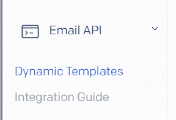

Setting menu for Dynamic Templates

您将看到一个屏幕，提示您创建第一个动态模板。选择“创建动态模板”选项。

给你的新模板起一个名字:“freeCodeCamp SendGrid Tutorial”。SendGrid 会将该模板添加到可用模板列表中。选择模板以查看`Template ID`(记下这一点，因为我们将在稍后的工具中需要它)并点击“添加版本”按钮。

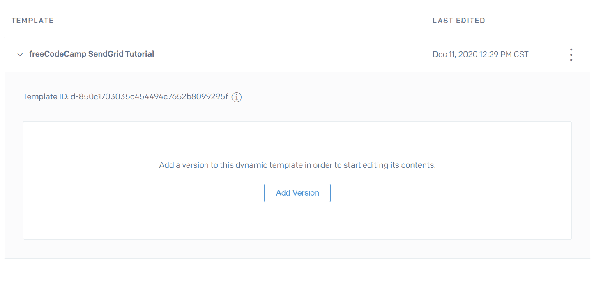

Preview of the newly-added template

在出现的屏幕上选择“空白模板”，然后选择“代码编辑器”。您现在应该可以看到编辑器视图。SendGrid 的编辑器使用 HTML 构建电子邮件正文——然而，当我们构建工具时，我们将发送纯文本版本。

现在，用以下代码替换编辑器的内容:

```
<p>This is a test email used with the freeCodeCamp SendGrid tutorial</p>
<p>Unsubscribe: {{{unsubscribeId}}}</p>
```

Our tool will be sending plaintext emails, so the extra HTML boilerplate is unnecessary.

你会注意到我们添加了`{{{unsubscribeId}}}`。SendGrid 的模板使用手柄来动态替换值——我们将在构建工具时利用这一特性。

现在从左上角选择 settings 选项——你可以选择给你的模板版本起一个名字，但是“Subject”字段是我们想要修改的。将这个值设置为`{{{subject}}}`，从我们的工具中动态加载主题值。

要测试动态模板，从顶部菜单中选择“测试数据”选项。将这个 JSON 数据插入到编辑器中:

```
{
    "unsubscribeId": "1",
    "subject": "Testing emails!"
}
```

Remember that JSON requires keys to be wrapped in quotes!

现在，您应该看到屏幕右侧的预览反映了模板中的这些值。记得点击`Save`按钮保存您的更改！

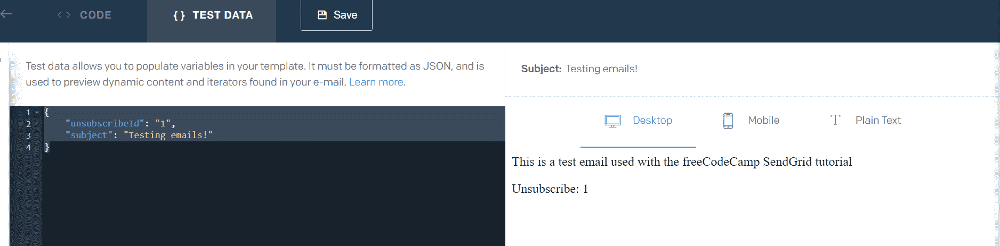

Editor and Preview screen showing the dynamic loading of template values

## 如何在 SendGrid 中生成 API 密钥

配置 SendGrid 帐户的最后一步是为我们的工具生成一个 API 密匙。

单击左上角的后退箭头返回到 SendGrid 主页面。然后选择“设置”和“API 键”。选择“创建 API 密钥”以生成新密钥。您可以选择授予您的密钥“完全访问”权限，但是在本教程中，您只需要“邮件发送”权限。

请务必为您的密钥指定一个描述性名称，以便您在再次访问此屏幕时能够记住它的用途。配置好权限后，选择“创建和查看”来生成密钥- **保存在安全的地方，因为您将无法再次查看它**。

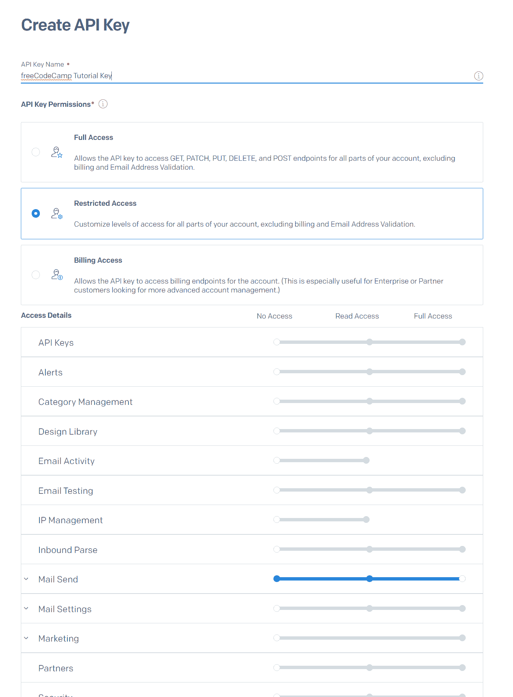

Create API screen with the Mail Send permission enabled

## 如何构建电子邮件工具

现在是时候编写代码来实际发送一些电子邮件了。您可以[查看我们的实时应用程序](https://github.com/nhcarrigan/sendgrid-email-blast)的代码，但是出于本教程的目的，我们将构建一个[稍微简化的版本](https://github.com/nhcarrigan/fcc-sendgrid-tutorial)，主要关注 SendGrid API 的使用。

### 自定义电子邮件活动脚本所需的软件

您需要安装以下工具来处理此项目:

*   [Node.js](https://nodejs.org/en/) -推荐 LTS 版本
*   一个 IDE，比如 [VSCode](https://code.visualstudio.com) 或者 [Atom](https://atom.io/)

您也可以选择使用`git`进行版本控制。

我们的 live 工具使用 MongoDB Atlas 集群，但是我们的教程示例不会。如果你不熟悉 MongoDB，freeCodeCamp 的课程包括[一个关于设置和使用 MongoDB](https://www.freecodecamp.org/learn/apis-and-microservices/mongodb-and-mongoose/) 的精彩章节。

### 如何初始化项目

创建一个目录(文件夹)来处理这个项目。然后用您选择的编辑器和终端打开该文件夹。

首先，我们需要将它设置为一个节点项目。最快的方法是在您的终端中使用`npm init`。这将引导您创建一个`package.json`，它是一个节点应用程序的核心文件。

默认值对我们的应用程序来说很好，但是我们想要修改`scripts`部分:

```
 "scripts": {
    "build": "tsc",
    "send": "node ./prod/send.js"
  },
```

`npm init` will create a `test` script - this can be removed for our project.

`build`脚本将用于将我们的类型脚本编译成 JavaScript，而`send`脚本将运行我们的应用程序。

接下来我们将安装并设置[类型脚本](https://www.typescriptlang.org/)。如果您不熟悉 TypeScript，它本质上是 JavaScript 的超集，具有更强的类型定义和编译时错误检查。

要在项目中安装 TypeScript，请在终端中运行`npm install --save-dev typescript`。(`--save-dev`标志将其保存为开发依赖关系——运行时不需要 TypeScript，因此可以在生产环境中清除)。

TypeScript 需要自己的配置文件来设置生成 JavaScript 文件时应该遵循的规则。在项目的根目录下创建一个名为`tsconfig.json`的文件，并插入以下内容:

```
{
    "compilerOptions": {
      "target": "es5",
      "module": "commonjs",
      "strict": true,
      "esModuleInterop": true,
      "skipLibCheck": true,
      "forceConsistentCasingInFileNames": true,
      "outDir": "./prod",
      "rootDir": "./src"
    }
  }
```

If you view the tutorial repository, you will see an extra `excludes` property. That value is specific for the tutorial file structure and you will not need it.

为了简洁起见，我们将不深入研究这些配置设置。如果你想要更多的信息，TypeScript 有[非常深入的文档](https://www.typescriptlang.org/docs/)。

如果您使用`git`进行版本控制，并将它上传到一个存储库(比如 GitHub)，那么您将希望在项目的根目录下创建一个`.gitignore`文件。该文件应包含:

```
/node_modules/
.env
/prod/
```

*   `/node_modules/`将忽略已安装的软件包。这被认为是使用版本控制时的最佳实践。
*   `.env`将忽略我们的环境变量文件。这是非常重要的，因为你*永远不要*想把你的秘密提交给一个仓库。
*   `/prod/`将忽略我们编译的 JavaScript 文件。我们还将使用该文件夹来存放我们的电子邮件列表，因此避免意外提交私人身份信息非常重要。

在您的根项目目录中创建一个`.env`文件。我们将通过该文件加载以下环境变量:

```
SENDGRID_API_KEY=
SENDGRID_FROM=
SENDGRID_TEMPLATE_ID=

MAIL_SUBJECT=
```

When you fill in the values, remember to wrap them in double quotes. Also, no spaces around the `=` sign!

*   `SENDGRID_API_KEY`应该是您在前面步骤中生成的 API 密钥。
*   `SENDGRID_FROM`应该是您的电子邮件地址(这是用于`from`字段的地址)。
*   `SENDGRID_TEMPLATE_ID`应该是您之前创建的动态模板的`id`字符串。
*   `MAIL_SUBJECT`将是您发送的电子邮件的主题行。目前，将此设置为“fCC 教程电子邮件”。

最后，在您的根项目目录中创建一个`src`文件夹，并在该文件夹中创建一个`send.ts`文件。

### 如何安装您的依赖项

首先我们需要安装`sendgrid` Node.js 包。这个包充当 SendGrid API 的包装器，并将简化我们进行 API 调用来发送电子邮件的过程。运行`npm install @sendgrid/mail`来安装这个包。

然后我们需要几个开发依赖项。运行`npm install --save-dev dotenv @types/node`。

*   `dotenv`将允许我们从本地的`.env`文件中加载环境变量。
*   `@types/node`为 Node.js 提供类型定义——TypeScript 依靠这些定义来理解内置方法和函数的结构。

### 逻辑怎么写

现在我们将在我们的`/src/send.ts`文件中工作——这是我们构建大部分应用程序逻辑的地方。我们将从从我们的包中导入所需的值开始。

首先，我们要加载`dotenv`包并解析我们的环境变量。

```
import dotenv from "dotenv";
dotenv.config();
```

`dotenv` is only needed for local development - most online hosts like Heroku and Repl.it can handle environment variables natively

`dotenv.config()`调用读取我们的`.env`文件并将值加载到`process.env`节点对象中。

接下来，我们从 SendGrid 包中导入所需的模块:

```
import sgMail, { MailDataRequired } from "@sendgrid/mail";
```

TypeScript can automatically import things, but it's good to practise manual imports.

`sgMail`是主要的 API 包装器，`MailDataRequired`是我们将需要的类型定义。

最后，我们引入了一些内置的节点特性来处理我们的文件:

```
import path from "path";
import { createWriteStream, readFile } from "fs";
```

The { syntax } is for importing specific modules from the package.

*   `path`将用相对路径定位我们的电子邮件列表文件
*   `fs`将用于读写那些文件

是时候开始构建逻辑了！我们的应用程序依赖于在`.env`文件中设置的一些基本值，所以我们需要从验证这些变量是否设置正确开始。如果有任何丢失，我们希望我们的应用程序早点退出，以避免在我们发送电子邮件时抛出错误。

```
// Here we check for a valid API key
const apiKey = process.env.SENDGRID_API_KEY;
if (!apiKey) {
  console.error("Missing SendGrid Key");
  process.exit(1);
}

// Here we check for a valid from address
const fromAddress = process.env.SENDGRID_FROM;
if (!fromAddress) {
  console.error("Missing sender email address!");
  process.exit(1);
}

// Here we check for a dynamic template ID
const sgTemplate = process.env.SENDGRID_TEMPLATE_ID;
if (!sgTemplate) {
  console.error("Missing SendGrid Template ID");
  process.exit(1);
}

// Here we check for the mail subject, but if it is missing
// we do not need to exit. Instead we use a fallback value.
const subjectValue = process.env.MAIL_SUBJECT || "Fallback value - check your env!";
```

The `||` syntax tells the code that if `process.env.MAIL_SUBJECT` is undefined or falsy, use the string instead.

您在每个条件检查中看到的`process.exit(1)`调用告诉 Node 用退出代码`1`终止流程(我们的应用程序)。这表明我们的应用程序由于其中一个检查失败而崩溃。

SendGrid 要求我们设置 API 密钥。在您的环境变量逻辑下面，添加函数调用来设置密钥。

```
// Here we set the SendGrid API key
sgMail.setApiKey(apiKey);
```

在继续之前，在您的终端中运行`npm run build`——这将创建一个包含我们编译的 JavaScript 的`prod`文件夹。您现在应该会看到以下文件结构:

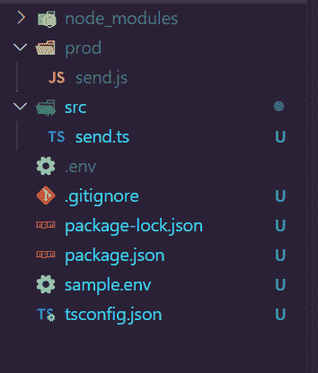

File Tree for this point in the tutorial

**此时，如果你正在使用`git`，你希望*非常确定*文件夹`prod`不会被提交到你的存储库中。**

在`prod`文件夹中，创建一个`validEmails.csv`文件。我们的应用程序将使用这个文件来读取电子邮件列表。用以下内容初始化文件(用你实际的电子邮件地址替换`your@email.com`):

```
email,unsubscribeId
your@email.com,1
iama@fake.email,2
```

`.csv` files do not have spaces around the comma.

现在我们可以编写代码来解析成一个电子邮件列表！在您的`src/send.ts`文件中，添加以下代码:

```
// Here we concatenate our file path for the valid email file
const filePath = path.join(__dirname + "/../validEmails.csv");

// This is where we start reading the file!
readFile(filePath, "utf8", (err, data) => {
    if (err) {
        console.error(err);
        return;
    }
    console.log(data)
});
```

We are using ES6 arrow function syntax throughout this process. You are welcome to use `function` declarations instead, if you prefer.

现在，如果您运行`npm run build`和`npm run send`，您应该会在终端中看到我们的`validEmail.csv`文件的内容。如果你愿意，你可以[查看我们目前为止的进展](https://github.com/nhcarrigan/fcc-sendgrid-tutorial/blob/main/tutorial-steps/step-1.ts)。

太好了！现在我们需要将该字符串解析成一个对象数组，这样我们就可以遍历它并构建我们的电子邮件消息。更新我们的回调函数:

```
// This is where we start reading the file!
readFile(filePath, "utf8", (err, data) => {
    if (err) {
        console.error(err);
        return;
    }

  // Here we parse the data into an object array
  const emailList = data
    .split("\n")
    .slice(1)
    .map((el) => {
      const [email, unsubscribeId] = el.split(",");
      return { email, unsubscribeId };
    });
});
```

`[email, unsubscribeId]` applies destructuring to assign the values of the split array to those two variables.

*   `.split("\n")`通过换行符分割字符串。**注意**:如果你在 Windows 上，你可能需要将你的`validEmails.csv`的行尾设置从`CRLF`改为`LF` (Windows 会插入额外的换行符，这会影响我们的数据处理)
*   `.slice(1)`删除数组的第一个元素(我们的`email,unsubscribeId`行)。
*   我们的`map`函数将把每个`email,unsubscribeId`字符串转换成一个`{email, unsubscribeId}`对象。

这个解析函数的最终结果将是一个具有`email`和`unsubscribeId`属性的对象数组——使用起来比字符串要流畅得多。

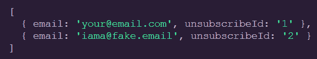

Example output from parsing function

现在是时候发送一些电子邮件了。在你的解析函数下面(但是仍然在`readFile`回调函数中),为我们的迭代方法添加结构。因为我们想要访问数组中的每个值，所以我们将使用`.forEach`方法。

```
 // Here we iterate through the emailList array
  emailList.forEach((user) => {});
```

The `user` parameter will be an `{email, unsubscribeId}` object. We have called it `user` because it represents a freeCodeCamp userdata object in the full application.

在对`.forEach`的回调中，我们可以构造 SendGrid API 期望的消息对象。

```
 // Here we iterate through the emailList array
  emailList.forEach((user) => {

    // This is the message object SendGrid needs
    const message: MailDataRequired = {
        to: user.email,
        from: fromAddress,
        subject: subjectValue,
        text: "This goes away!",
        templateId: sgTemplate,
        dynamicTemplateData: {
            subject: subjectValue,
            unsubscribeId: user.unsubscribeId
        }
    }

  });
```

在继续之前，让我们更仔细地看看这个消息对象。我们之前导入的`MailDataRequired`在这里被用作类型定义，所以如果我们碰巧错过了一个必需的属性，TypeScript 可以提醒我们。幸运的是，我们拥有所有需要的属性。但是它们是什么意思呢？

*   `to:`接收邮件的电子邮件地址。这将是我们的`validEmails.csv`文件中每行的`email`
*   发送邮件的电子邮件地址。这是我们之前在`.env`设置的(应该是*你的*邮箱)。
*   这个字段不是必需的，但是如果动态模板不能正确解析我们的主题，它会给我们一个后备值。
*   `text:`该文本值被模板覆盖。但是，使用起来还是很重要的。SendGrid 可以以`plaintext`或`html`的身份发送电子邮件——通过使用`text`属性而不是`html`属性，我们确保我们的模板以`plaintext`的身份发送。电子邮件提供商更有可能将 HTML 邮件标记为垃圾邮件，因此这有助于提高我们的送达率。
*   这是 SendGrid 应该在电子邮件中使用的动态模板的 ID。
*   `dynamicTemplateData:`这些值对应于我们之前在动态模板中设置的把手字符串。

太好了！我们的下一步是把这个构造好的消息发送出去。在消息对象下面(但仍在`.forEach`回调中)，让我们添加我们的发送调用:

```
 // Here we send the message we just constructed!
    sgMail.send(message);
```

这将向我们的`validEmails.csv`中的每一个电子邮件发送消息。不幸的是，我们的代码将静默运行，我们不知道每次发送是否成功。让我们添加一些错误处理。

`.send()`调用返回一个承诺，所以我们可以使用`.then().catch()`来处理这个返回。

```
 // Here we send the message we just constructed!
    sgMail.send(message)
        .then(() => {
            // Here we log successful send requests
            console.info(`Message send success: ${user.email}`)
        }).catch((err) => {
            // Here we log errored send requests
            console.error(err);
            console.error(`Message send failed: ${user.email}`)
        });
```

You could also use async/await, but this is a case where .then.catch is more clear

现在，如果你运行`npm run build`和`npm run send`，你会在收件箱里看到一封漂亮的邮件！

至此，您已经有了一个功能正常的电子邮件发送应用程序。恭喜你！如果您愿意，您可以[查看我们目前的进度](https://github.com/nhcarrigan/fcc-sendgrid-tutorial/blob/main/tutorial-steps/step-2.ts)。

请继续阅读，了解如何处理退回的电子邮件和发送失败的额外逻辑，这是我们接下来要讨论的内容。

### 如何处理 SendGrid 中被退回的电子邮件

你可能已经注意到`iama@fake.email`并不是一个真实的电子邮件地址。SendGrid 将每天为您前一天的活动生成退回报告。

每封被退回的邮件都会损害您的 SendGrid 声誉，并可能导致电子邮件提供商将您的邮件标记为垃圾邮件。因此，我们需要添加逻辑来防止发送到已知的弹跳地址。

首先在你的`prod`文件夹中创建一个`bouncedEmails.csv`文件(它应该在你的`validEmails.csv`旁边)。我们在这里不需要`unsubscribeId`值，所以用以下值初始化它:

```
email
iama@fake.email
```

We have added the fake email for demonstration purposes

现在回到我们的`send.ts`文件。在第 38 行，就在我们现有的`filePath`声明下面，为新的`bouncedEmails.csv`文件配置路径。

```
// Here we concatenate our file paths for the CSV files
const filePath = path.join(__dirname + "/validEmails.csv");
const bouncePath = path.join(__dirname + "/bouncedEmails.csv");
```

__dirname refers to the current directory of this file (in our case, the `send.ts` file).

太好了！现在我们需要读那个文件。紧接在这些文件路径声明的下面(在我们现有的`readFile`调用之前)，添加读取被反弹文件的逻辑。

```
// Read through the bounce list, parse into array
readFile(bouncePath, "utf8", (err, data) => {
  if (err) {
    console.error(err);
    process.exit(1);
  }
  bounceList = data.split("\n").slice(1); 
```

`readFile`是异步的——所以我们需要将回调函数包装在所有现有发送逻辑的*周围。确保您的回调结束`})`被移动到我们文件的最后。*

我们读取`bouncedEmails.csv`文件，在新的一行上分割它(记住你需要确保你的行尾是`LF`)，并删除`email`行。最后，我们继续现有的发送逻辑。

回到我们的发送逻辑。在我们的`.forEach`函数中，添加逻辑来跳过被阻止的电子邮件(我们将在构造消息对象之前添加这一点，以避免创建不必要的变量)。

```
 // Here we iterate through the emailList array
  emailList.forEach((user) => {
    // Here we check if the email has been bounced
    if (bounceList.length && bounceList.includes(user.email)) {
        console.info(`Message send skipped: ${user.email}`);
        return;
    } 
```

If our `bounceList.csv` file is empty, calling `includes` will throw an error. So we check for a `.length` value first.

通过利用早期的`return`语句，当`bounceList`包含该电子邮件时，我们结束特定的`.forEach`迭代。这可以防止我们尝试向之前被退回的电子邮件地址发送邮件。现在，如果您运行`npm run build`和`npm run start`，您应该在您的终端中看到这个输出:

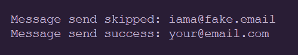

Example console output for a skipped email and successful email

[查看我们到目前为止的进度](https://github.com/nhcarrigan/fcc-sendgrid-tutorial/blob/main/tutorial-steps/step-3.ts)。

### 如何在 SendGrid 中捕获失败的邮件

目前，如果电子邮件发送失败，我们的应用程序将记录一个错误。这对于小的用例是可行的，但是当你扩展你的应用程序时，你会发现发现那些失败并尝试再次发送变得越来越困难。

但是，我们可以让我们的应用程序将这些电子邮件保存在一个新文件中。

在您的`prod`文件夹中创建一个`failedEmails.csv`文件。该文件可以为空。我们将编写代码来添加标题行。

回到我们的`send.ts`文件，转到第 38 行的路径声明。让我们为我们的新`failedEmails.csv`再加一个:

```
// Here we concatenate our file paths for the CSV files
const filePath = path.join(__dirname + "/validEmails.csv");
const bouncePath = path.join(__dirname + "/bouncedEmails.csv");
const failedPath = path.join(__dirname + "/failedEmails.csv");
```

与我们的其他路径不同，该路径将用于一个`write`操作。因为我们希望在处理电子邮件时连续地写，所以我们需要创建一个流来这样做。就在这些路径声明下面，让我们创建那个流并添加我们的初始标题行。

```
// Here we create our write stream for failed emails
const failedStream = createWriteStream(failedPath);

// Here we add the header row
failedStream.write("email,unsubscribeId\n")
```

是时候改进我们的错误处理逻辑来合并这个新的流了。我们需要在`send`调用中向我们的错误处理添加另一个`write`操作。

```
 // Here we send the message we just constructed!
    sgMail
      .send(message)
      .then(() => {
        // Here we log successful send requests
        console.info(`Message send success: ${user.email}`);
      })
      .catch((err) => {
        // Here we log errored send requests
        console.error(err);
        console.error(`Message send failed: ${user.email}`);
        // And here we add that email to the failedEmails.csv
        failedStream.write(`${user.email},${user.unsubscribeId}\n`)
      });
```

We want to preserve the console statements to ensure we see feedback while the script runs.

这将把`email`和`unsubscribeId`以正确的格式写到我们的新`failedEmails.csv`中——允许我们将数据复制到`validEmails.csv`中进行另一次发送尝试。

恭喜你！现在，您已经构建了一个成功的、功能齐全的发送电子邮件的工具。如果你想确认你的工作，你可以[看到完成的代码](https://github.com/nhcarrigan/fcc-sendgrid-tutorial/blob/main/tutorial-steps/step-4.ts)。但是请继续阅读一些可选的“最好拥有”的特性。

## 电子邮件工具的可选功能

因为我们的工具是基于 CLI 的(意味着它在命令行界面或终端中使用)，所以没有太多的用户反馈。我们可以利用一些额外的控制台功能来提供关于脚本进度的更多信息。

让我们从增加一些“检查点”开始。在我们的环境变量验证之前，让我们打印一条消息，说明脚本已经启动并正在检查变量:

```
console.info('Script started. Validating environment variables...')
```

console.info indicates this is an informational message

然后，在我们验证之后，我们可以打印一条成功消息。

```
// Here we set the SendGrid API key
sgMail.setApiKey(apiKey);

console.info('Variables confirmed!')
```

在我们读取被退回文件的函数中，我们可以添加一些关于开始、失败和成功的消息。

```
console.info('Reading bounced email list...')

// Read through the bounce list, parse into array
readFile(bouncePath, "utf8", (err, data) => {
  if (err) {
    console.error(err);
    console.error('Failed to read bounced emails!')
    process.exit(1);
  }
  bounceList = data.split("\n").slice(1);

console.info('Bounced emails read!')
```

我们的有效电子邮件列表也是如此:

```
console.info('Reading send list...')
// This is where we start reading the file!
readFile(filePath, "utf8", (err, data) => {
  if (err) {
    console.error(err);
    console.error('Failed to read send list!')
    return;
  }
```

现在，如果在操作完成时打印出一条消息就太好了。然而，如果我们在我们的`.forEach`循环之后添加一个`console.info`，它实际上会在电子邮件发送完毕之前打印出*！*

这是因为`.send`方法创建了一个网络调用并返回一个承诺，而这个承诺在我们的迭代完成之前可能还没有解决/拒绝。

因此，我们可以建立一个计数器来跟踪我们已经发送的电子邮件数量与电子邮件总数的比值。就在我们的`.forEach`循环之前，添加这些变量:

```
 // Here we create variables for counting
    const emailTotal = emailList.length;
    let emailCount = 0;
```

By assigning .length to a variable, we avoid having to read it on each iteration.

我们希望将退回的电子邮件视为已处理，即使我们跳过了它们。

```
 // Here we iterate through the emailList array
  emailList.forEach((user) => {
    // Here we check if the email has been bounced
    if (bounceList.includes(user.email)) {
      console.info(`Message send skipped: ${user.email}`);
      emailCount++;
      if (emailCount === emailTotal) {
        console.info(
          `Sending complete! Sent ${emailTotal} emails. Have a nice day!`
        );
        return;
      }
    }
```

最后，我们需要添加逻辑来查看我们发送的电子邮件是否是最后一封电子邮件。这个逻辑放在我们发送调用的成功和错误处理程序中:

```
 // Here we send the message we just constructed!
    sgMail
      .send(message)
      .then(() => {
        // Here we log successful send requests
        console.info(`Message send success: ${user.email}`);
        // Here we handle the email counts
        emailCount++;
        if (emailCount === emailTotal) {
          console.info(
            `Sending complete! Sent ${emailTotal} emails. Have a nice day!`
          );
        }
      })
      .catch((err) => {
        // Here we log errored send requests
        console.error(err);
        console.error(`Message send failed: ${user.email}`);
        // And here we add that email to the failedEmails.csv
        failedStream.write(`${user.email},${user.unsubscribeId}\n`);
        // Here we handle the email counts
        emailCount++;
        if (emailCount === emailTotal) {
          console.info(
            `Sending complete! Sent ${emailTotal} emails. Have a nice day!`
          );
        }
      });
```

至此，我们的应用程序就完全完成了！如果您运行`npm run build`和`npm run send`脚本，您应该在您的终端中看到这个输出:

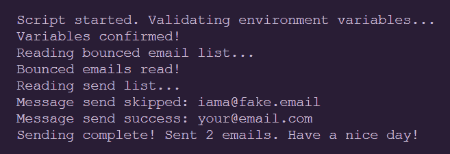

Example console output for completed application.

您应该收到了几封类似于以下内容的电子邮件:

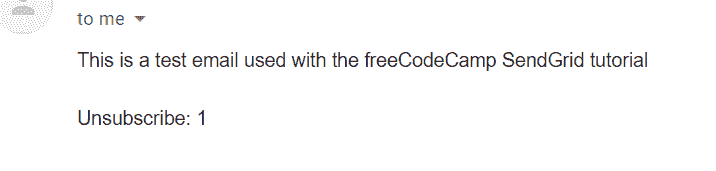

Sample image of test email result

你可以[在这里](https://github.com/nhcarrigan/fcc-sendgrid-tutorial/blob/main/tutorial-steps/step-5.ts)查看我们的最终代码，或者你可以[查看为 freeCodeCamp 打造的扩展版本](https://github.com/nhcarrigan/sendgrid-email-blast)。