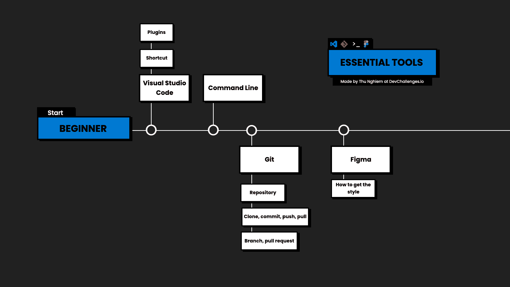
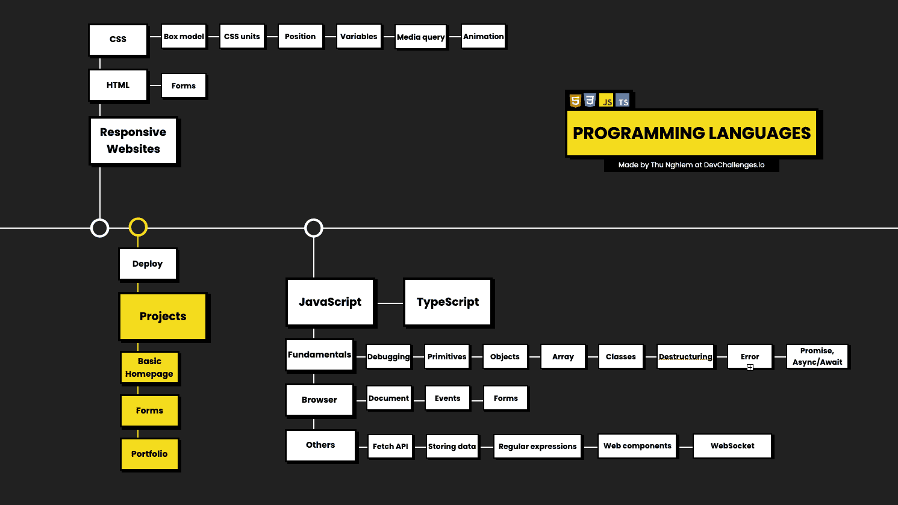
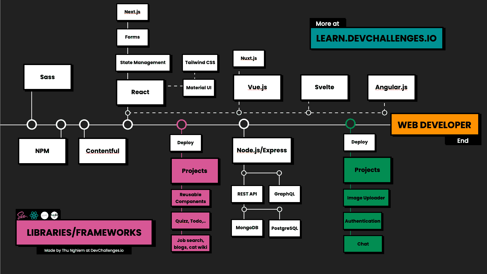

# 如何在 2021 年学习 Web 开发——Web 开发者路线图

> 原文：<https://www.freecodecamp.org/news/how-to-learn-web-dev-in-2021-roadmap/>

对于网络开发者来说，有一些很棒的路线图。但是有些会让你在开始之前就解决一个“难题”，因为你必须做出多种选择。

当我开始学习 Web 开发时，我希望我能找到一个有经验的开发人员，告诉我他们是如何成为 Web 开发人员的。可惜找不到人。

现在我已经在这个行业工作了 4 年，我想和你分享我将如何在 2021 年开始学习 Web 开发。在本文中，我将向您展示从初学者成为开发人员的每一步。

我将从一些你应该知道的**基本工具**开始，然后涵盖成为前端或全栈开发者需要学习的**编程语言**和**库/框架**。

我还将讨论一些**示例项目**，你可以构建这些项目来练习你的技能。

[https://www.youtube.com/embed/GAkZfIYWsO4?feature=oembed](https://www.youtube.com/embed/GAkZfIYWsO4?feature=oembed)

If you prefer a video, you can check it out here

你也可以在我的网站上找到更新的路线图。

## 成为一名网站开发者你需要知道的工具

我会假设你是初学者。在这种情况下，在开始编程之前，您需要了解一些工具。

### VS 代码(或其他代码编辑器)

首先，你要学会如何使用 [**Visual Studio 代码**](https://code.visualstudio.com/) ，这是一个源代码编辑器。这是一个免费且强大的工具。

在开始时，我建议学习一些基本的快捷方式，并安装一些扩展，如 ESlint、Prettier 或 Live Server。

这里有一个[免费的全长课程](https://www.freecodecamp.org/news/learn-visual-studio-code-to-increase-productivity/)在免费代码营 YouTube 频道上，让你开始学习。

### 命令行

接下来，你需要了解一下 **[命令行](https://developer.mozilla.org/en-US/docs/Learn/Tools_and_testing/Understanding_client-side_tools/Command_line)** 。您应该了解它是什么，以及一些基本的命令，如如何移动目录、如何创建新目录或如何创建新文件。

这里有一篇关于如何使用 Linux 命令行 Bash 的文章。这里有一个可以帮助你[更有效地使用命令行](https://www.freecodecamp.org/news/basic-linux-commands-bash-tips-you-should-know/)。

### 版本控制- Git 和 GitHub

无论你做什么，作为一个开发者，你都需要了解 **[Git](https://git-scm.com/)** 。Git 是一个用于跟踪变更的版本控制系统。通常与 **GitHub** 配合使用，GitHub 是一个代码托管平台。

一开始，学习 Git 可能会很难，因此你只需要知道一些基础知识，比如如何创建一个新的*库*，如何*克隆*一个项目，如何进行新的*提交*，以及如何*拉*和*推*新的变更。

实践 Git 的最好方法之一是在团队中工作。在那里，你需要知道如何创建一个新的*分支*，如何发出*拉请求*，以及如何解决*冲突*。

freeCodeCamp YouTube 频道上有一个很棒的 [Git 和 GitHub 速成班](https://www.freecodecamp.org/news/git-and-github-crash-course/)，可以帮助你进行版本控制。

### 设计工具- Figma

最后一个工具是 **[菲戈玛](https://www.figma.com/)** 。Figma 是一个设计工具，个人可以免费使用。但是这里我想说一下作为开发者如何使用 Figma。

作为开发人员，您可能会从团队中的设计师那里获得设计。使用 Figma，您可以检查元素的代码并测量布局。因此，你需要知道如何阅读 Figma design，比如如何获得正确的颜色、排版或间距。

这里有一篇关于[各种设计工具的文章，Figma 包括了](https://www.freecodecamp.org/news/adobe-xd-vs-sketch-vs-figma-vs-invision/)。这里有一个关于[在 Figma](https://www.freecodecamp.org/news/creating-realistic-3d-objects-in-figma-carton-box-example-f674c21c3452/) 中创建 3D 草图的有趣教程。

好了，这些是你开始工作时需要知道的工具。**你不需要知道所有的事情**，但是要确保你理解了基础知识，这样你就可以在学习编码的同时提高。

## Web 开发人员应该学习的编程语言

### HTML 和 CSS

接下来，让我们继续学习编程语言。让我们从谈论**响应式网站**开始。

响应式网站是看起来不错的网站，可以在所有设备或屏幕尺寸上使用。你可能知道建立一个响应迅速的网站有多重要，因为现在人们使用这么多不同的设备。

那么让我们跳到建立网站需要知道的前两种语言: **HTML** 和 **CSS** 。

**HTML** 代表*超文本标记语言。它是用来为你的网站构建框架的。HTML 并不难学，但是你可能需要更多地关注 HTML 表单，因为它们在未来将是基础。*

**CSS** 代表*级联样式表*。这是一种标记语言，但我也认为它是一种编程语言。CSS 不一定难学，但是很难掌握。

很少有话题会让你更加关注，比如:

*   **盒子模型** -边距、填充和边框如何一起工作。
*   **CSS 单位** -用于表示长度(例如:rem、vh 和 vw)。
*   **位置**-**-**指定了定位方法的类型。这也让很多人感到困惑，所以一定要花些时间在这上面。
*   **变量** -或**自定义属性**是可以在整个文档中重用的实体。这是 CSS 中我最喜欢的特性。它们让使用 CSS 变得如此有趣，你只需要几行代码就可以创建主题。
*   **媒体查询** -决定在不同尺寸的屏幕上显示什么。他们是[响应式设计](https://developer.mozilla.org/en-US/docs/Web/Progressive_web_apps)的关键组成部分。
*   动画 -让一个元素从一种风格变成另一种风格。如果你知道如何正确使用动画，它会让你的网站脱颖而出。否则会让你的网站看起来不专业，一定要小心。
*   **Flexbox，CSS Grid**——用于构建响应式布局(我忘了在视频中提到这一点)。

这里有一本完整的手册会教你所有 HTML 的基础知识。这里有一个关于 CSS 的[完整课程](https://www.freecodecamp.org/news/learn-css-in-this-free-6-hour-video-course/)，在免费的 CodeCamp YouTube 频道上，它会让你开始美化你的网站。

当你了解了 HTML 和 CSS 的基础知识后，下一步就是建立一些基本的网站。例如，你可以尝试一个*主页*、*一个表单*，比如登录页面或者结账页面。你甚至可以建立一个*文件夹*。你可以在 [DevChallenges.io](https://devchallenges.io/paths/responsiveWebPaths) 上找到示例项目。

### 网站部署

一旦你有了自己的网站，你需要把它放在互联网上，这样人们就可以看到它。部署是将代码部署到宿主平台的过程。

在过去，这要困难得多。但是现在，它超级简单，你可以使用像 [GitHub Pages](https://pages.github.com/) 、 [Netlify](https://www.netlify.com/) 或 [Vercel](https://vercel.com/) 这样的工具。

这里有一个关于如何让你的网站上线的完整 YouTube 课程，涵盖了从开始到结束的整个过程。

### JavaScript -基础知识

好了，[下一个话题是**JavaScript**T3。JavaScript 是一种流行的编程语言，广泛用于 Web 开发等。](https://www.freecodecamp.org/learn/javascript-algorithms-and-data-structures/basic-javascript/)

你需要学习语言的一些基本特性，比如**[循环](https://www.freecodecamp.org/news/javascript-loops-explained-for-loop-for/)** 和 **[条件句](https://www.freecodecamp.org/news/what-in-the-world-is-a-javascript-conditional-for/)** 。

然后是你想深入探究的话题。

首先，我们进行**调试。**这是发现并修复错误的过程。这里有一个[伟大的深入指南，以挤压](https://www.freecodecamp.org/news/the-beginner-bug-squashing-guide/)让你开始。

然后还有其他主题，如**对象**、**原语**和**数组**。尤其是在使用数组时，你还需要了解 **[数组方法](https://www.freecodecamp.org/news/javascript-map-reduce-and-filter-explained-with-examples/)** 。

**函数**是你程序中的主要构件。所以确保你不会忽略它们。

JavaScript 中我最喜欢的特性之一是 **[去结构化](https://www.freecodecamp.org/news/array-and-object-destructuring-in-javascript/)–**它很容易编写，并且使语言变得超级强大。

像 C#、Java 或其他编程语言一样，在现代 JavaScript 中，我们也有**类**。当谈到[面向对象编程和坚实的原则](https://www.freecodecamp.org/news/solid-principles-explained-in-plain-english/)时，这些是有用的。

无论你编程有多好，你的脚本中也会有错误。这意味着您将希望[了解**错误处理**以及](https://www.freecodecamp.org/news/how-to-write-error-messages-that-dont-suck-f31c53b64c3e/)。

异步编程很重要，尤其是当您需要与服务器通信时。所以花点时间了解一下 [**承诺**和**异步/等待**](https://www.freecodecamp.org/news/learn-promise-async-await-in-20-minutes/) 。

### JavaScript 浏览器

让我们继续讨论 JavaScript 是如何在浏览器中使用的。

首先，你需要知道什么是*文档对象模型*或 **DOM** 。然后你需要知道如何获得元素，如何改变类，或者如何用 JavaScript 改变样式。

这里有一个关于 JS DOM 的很好的[介绍，这里有一个关于](https://www.freecodecamp.org/news/an-introduction-to-the-javascript-dom-512463dd62ec/)[如何操作 DOM](https://www.freecodecamp.org/news/learn-how-to-manipulate-the-dom-by-building-a-simple-javascript-color-game-1a3aec1d109a/) 的指南(你将通过构建一个项目来学习)。

你还需要了解不同的 **[用户界面事件](https://www.freecodecamp.org/news/javascript-dom-events-onclick-and-onload/)** ，比如点击、鼠标悬停、鼠标按下等等。

此外，您还需要更加注意 JavaScript 中的 [**表单**，因为它们有许多事件和属性](https://www.freecodecamp.org/news/build-and-validate-beautiful-forms-with-vanilla-html-css-js/)

### JavaScript -其他特性

[**取 API** 是一个重要的话题](https://www.freecodecamp.org/news/javascript-fetch-api-tutorial-with-js-fetch-post-and-header-examples/)。它允许您向服务器发送网络请求。例如，当我们需要提交表单或获取用户信息时，这很有用。

另一个重要的话题是 [**在浏览器**](https://www.freecodecamp.org/news/how-to-store-data-in-web-browser-storage-localstorage-and-session-storage-explained/)中存储数据。这里您需要知道 Cookies、本地存储和会话存储之间的区别。

刚入门时，其他不太重要的主题是正则表达式、Web 组件和 Websockets。

**[正则表达式](https://www.freecodecamp.org/news/regular-expressions-demystified-regex-isnt-as-hard-as-it-looks-617b55cf787/)** 用于搜索和替换文本。 **Web 组件**，是一个新事物，但你应该完全了解它们。

最后，我们有 **[网络套接字](https://www.freecodecamp.org/news/beginners-guide-to-websockets/)** 。当您需要像在聊天应用程序中那样进行连续的数据交换时，它们非常有用。

所以学完 Javascript 后，你可能想花点时间[了解一下 **TypeScript**](https://www.freecodecamp.org/news/learn-typescript-data-types-from-zero-to-hero/) 。我喜欢 TypeScript，因为它让我在编写代码时有一种安全感。

TypeScript 提供静态类型，允许您在调试过程的早期捕捉错误。它还可以节省您的时间，因为它可以在代码运行之前找到 bug。

这里有一个关于[类型脚本类型](https://www.freecodecamp.org/news/a-mental-model-to-think-in-typescript-2/)的有用帖子，帮助你以正确的方式思考它们。

你可以在这里停下来，开始做一些项目。但就个人而言，我会继续学习至少一个框架。然后就可以同时练习 JavaScript 了。

好吧，那我们继续。

## 需要了解的库和框架

要成为前端开发人员或全栈开发人员，您需要了解一些现有的库和框架。

### 面向前端开发人员的库和框架

所以我们先从 **Sass** 说起，它是一种预处理程序脚本语言。我几乎在我的每个项目中都使用 Sass。它使 CSS 看起来更干净，开发起来更快。

这里有一个关于 Sass 的完整课程，将教你如何赋予你的 CSS 超能力。

接下来，我们有 **NPM** ，它是 JavaScript 编程的一个包管理器。这允许你在你的机器上快速安装不同的软件包。

这里有一本很好的[NMP](https://www.freecodecamp.org/news/what-is-npm-a-node-package-manager-tutorial-for-beginners/)初学者指南，可以帮助你马上开始下载软件包。

我的一个遗憾是我没有早点知道。Contentful 是一个无头内容管理系统或 CMS。它不同于传统的 CMS，因为你可以在 Contentful 中存储数据，并将其用于你的前端。

而要得到一份前端的工作，你至少需要了解一个前端框架。我个人会选择**反应**。稍后我们将讨论其他框架。

除了[学习 React](https://www.freecodecamp.org/news/the-react-handbook-b71c27b0a795/) 的基础知识，你还需要注意 React 应用程序中的**状态**是如何管理的，以及 React 中的**表单**是如何工作的。

一旦你学会了一些基础知识，你可以通过在 YouTube 的课程中使用 React [构建一系列项目来巩固你的技能。](https://www.freecodecamp.org/news/solidify-your-react-skills-by-building-15-projects/)

我的另一个遗憾是我没有早点知道**[【next . js】](https://nextjs.org/)**。Next.js 用于*服务器端渲染*或*生成静态网站*。是的，Next.js 仍然很新，但是我相信这是我们作为 React 开发者必须具备的技能。

你可以在这本深度手册中学习所有的 Next.js 基础知识。

学习完这些工具后，你可能还想看看 React 组件库 **[Material UI](https://material-ui.com/)** 或 CSS 框架 [**Tailwind CSS**](https://tailwindcss.com/) 来帮助你加快工作速度，例如在原型制作或自由职业时。

所以在学习了 JavaScript 和一个框架之后，你需要**通过搭建项目来练习**。

您可以通过构建一些简单的可重用组件来理解 React 的工作原理。然后你可以构建更复杂的应用程序，比如一个*问答应用程序*或者一个*待办事项应用程序*。

在那之后，你会想要构建更难的应用程序，比如*求职工具、*T2 博客、或*文档页面*。同样，您可以在 [DevChallenges.io](https://devchallenges.io/paths/frontEndPaths) 上找到示例项目。

### 全栈开发人员

现在你准备申请一份前端开发人员的工作。如果想继续成为全栈开发者，可以从[学习 **Node.js**](https://www.freecodecamp.org/news/nodejs-course/) 和 **[Express](https://www.freecodecamp.org/news/learn-express-js-in-this-complete-course/)** 开始。

在这里，你需要知道如何构建一个 RESTful API 并且在处理数据库时可以使用 **[MongoDB](https://www.freecodecamp.org/news/mongodb-crud-app/)** 。如果您已经了解 JavaScript，那么学习起来非常简单。

之后，如果你想了解更多，你可以[研究一下**graph QL**T3，这是一种用于 API 的数据查询和操作语言。就个人而言，我也会花一些时间学习 **PostgreSQL** 。与 MongoDB 相比，学习起来有点困难，因为您还需要](https://www.freecodecamp.org/news/learn-how-to-use-react-and-graphql-to-make-a-full-stack-social-network/)[学习 SQL](https://www.freecodecamp.org/news/sql-recipes/) 。

学会这些工具后，你可以通过构建像*图片上传器*、*认证*或*聊天室*这样的应用来练习。你也可以在 [Devchallenges.io](https://devchallenges.io/paths/fullStackPaths) 上找到这些项目。

现在你可以申请全栈职位了。如果你的工作需要你了解**[棱角](https://www.freecodecamp.org/news/angular-tutorial-course/)** 甚至 **[苗条](https://www.freecodecamp.org/news/the-svelte-handbook/)** 你也可以花些时间学习这些工具。一旦你已经知道反应，这应该不会太难。

路线图到此结束。希望你觉得有用。我 2021 年的目标之一是为我们刚刚谈到的每个话题制作视频。所以，别忘了看看我的 [**Youtube 频道**](https://www.youtube.com/c/thunghiem) 和 **[DevChallenges 学习](https://learn.devchallenges.io/)** 。

## __________ 🐣关于我 _ _ _ _ _ _ _ _ _ _ _ _

*   我是[发展挑战](https://devchallenges.io/)的创始人
*   订阅我的 [Youtube 频道](https://www.youtube.com/channel/UCmSmLukBF--YrKZ2g4akYAQ?sub_confirmation=1)
*   关注我的[推特](https://twitter.com/thunghiemdinh)
*   加入[不和](https://discord.com/invite/3R6vFeM)