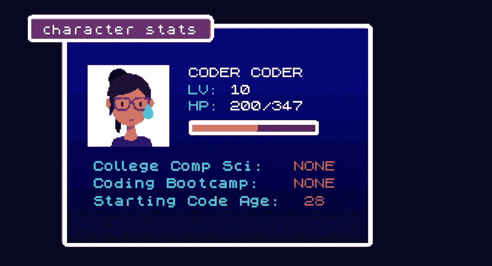
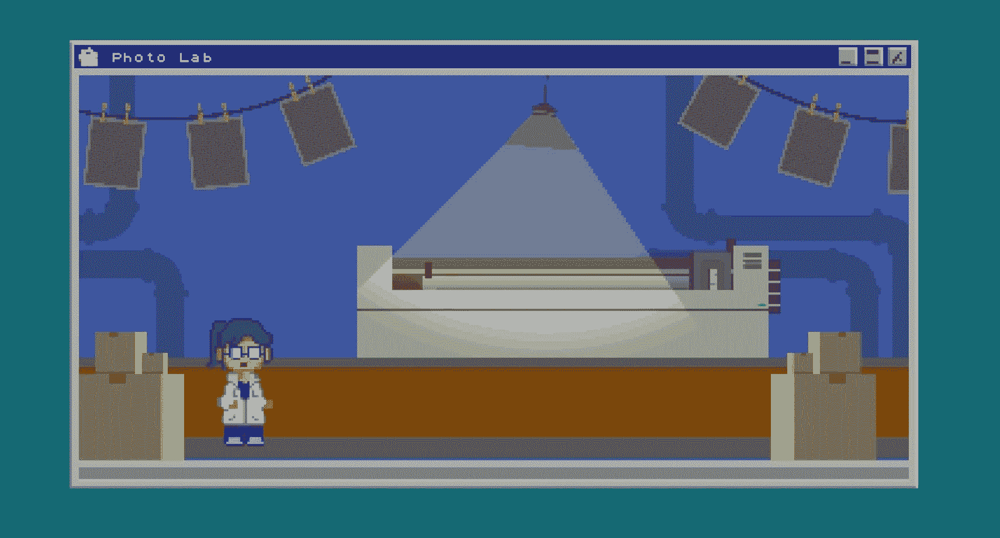
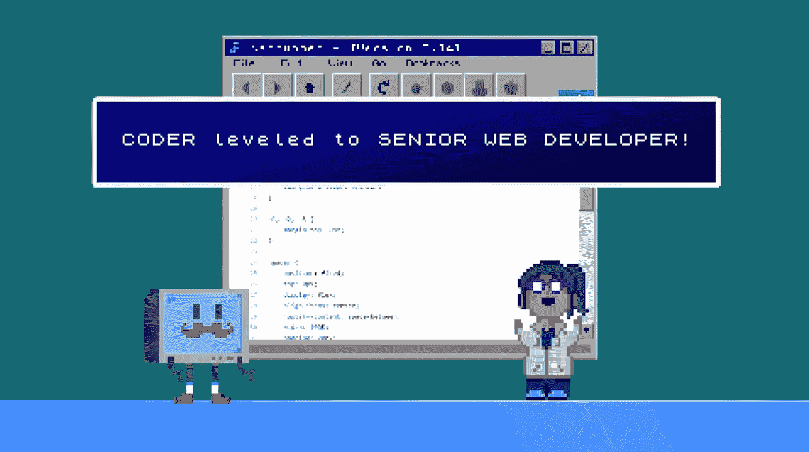
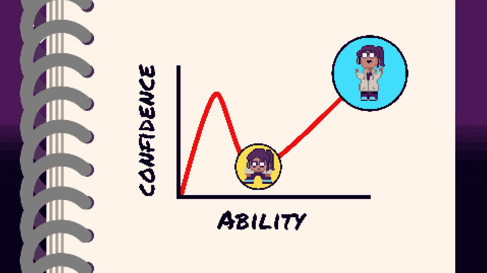

# 我如何学习编码(没有计算机科学学位或训练营)

> 原文：<https://www.freecodecamp.org/news/how-i-learned-to-code-without-a-cs-degree-or-bootcamp/>

我已经做了 8 年的专业 web 开发人员，在后台和前端都工作过。

但让人惊讶的是，我没有上过计算机科学的学校，也没有上过课程或参加过编码训练营！直到我快 30 岁的时候，我才进入这个领域。

那么，在没有任何正规编程教育的情况下，我是如何学会编码的呢？

## 编程只是一种爱好...

这一切都是从高中开始的，当时我发现了互联网，为了好玩，我自学了基本的 HTML 和 CSS。

大部分时间，我都在制作网页，致力于我当时痴迷的滑雪运动。我也喜欢用 CSS 定制我的 Xanga 博客，让它成为我想要的风格。(还记得 Xanga 吗？？😂)

回想起来，我没有考虑在学校学习计算机科学或 web 开发，这似乎令人难以置信。但老实说，这只是我的一个爱好。我计划成为一名医生，就像我父母希望的那样。

但这并没有成功，相反，我花了几年时间努力找出一条路。发生了什么事？

## 摄影工作

在大学里，在放弃了整个医学预科课程后，我决定拥抱我的创造力，主修艺术。我获得了摄影学位，并在一家商业摄影实验室找到了一份工作。我在暗房里打印照片，为客户拍摄艺术品。

实验室很有趣，但它只支付 8 美元/小时。而且，我当时没有意识到这一点，但整个电影摄影行业是一艘正在下沉的船。由于数码相机和 Photoshop 的出现，我们只使用已经没有多少人使用的胶片。

就在我到那里几年后，实验室破产了，事情变得更糟。

## 临时办公室工作

最终，我找到了临时的办公室工作。扫描纸张、装订、填充信封，通常是公司机器中的一个低级齿轮。不是最迷人的工作，但是，嘿，它支付帐单。大部分是。

我从一个演出到另一个演出漂泊了好几年，并没有攒下多少钱，靠一张又一张的薪水过活。但我找到的一份临时工作最终改变了一切。

## Craigslist 的工作

一天，我在 Craigslist 上找工作，发现了一个数据录入职位的招聘信息。我对计算机工作很满意，所以我申请了这份工作，并马上得到了回复。我被录用了！

该公司是一个小型的网站开发商店，为他们的客户建立和维护网站。一开始，我做的是非常基本的数据输入工作。但是随着时间的推移，我的老板开始教我一些后端编码和使用他们的 SQL 数据库。

这份工作报酬不错，可能每小时 10-12 美元，但只是兼职。我留在那里主要是因为我获得了一些有价值的新技能。

学习编程是艰难的，但也是值得的。而且，我越来越善于学习如何学习。例如，我学会了如何通过谷歌自己寻找解决方案。

你看，如果我不止一次地问如何做某事，我的老板会生气的。我是吃了苦头才知道的。所以在寻求帮助之前，我总是花时间尽我所能找到解决办法。

我还做了详细的笔记来记住新的东西，尤其是如果我花了很长时间才弄清楚的话。然后下一次，我可以简单地查阅我的笔记本，而不是再一次搜索，或者更糟，问我暴躁的老板。

在网站开发商店工作两年后，我获得了很多编程经验。但是我仍然勉强支付我的生活费用。我知道我必须做出改变，这就是事情真正开始的时候。

## 获得一份真正的网络开发工作

在 Craigslist 工作了两年后，我觉得自己掌握了足够的编码技能，可以应用到一些实际的 web 开发工作中。

由于我缺乏经验，被拒绝了很多次，但最终我在一家广告公司获得了面试机会。

面试那天，我的倾听技巧、笔记和学习意愿给老板留下了深刻的印象。一切都很顺利，他们给了我一份工作。一份真正的工作！加上工资和福利，整个九码。

我很确定当我告诉我父母我被录用的时候，我妈妈侧手翻了。他们很激动。但是得到这份工作仅仅是开始。在一个新的领域开始并不容易。毕竟当时我只懂基本的编码。

一个基本上自学成才的人如何在这样一份快节奏的工作中取得成功？

## 冒名顶替综合症糟透了。

我实话实说。我新工作的第一年压力非常大，我一直在和冒名顶替综合症做斗争。我的老板和同事都在学校学过计算机科学，他们中的一些人甚至还获得了 it 硕士学位。

我害怕我会被“发现”并因不称职而被解雇。更糟糕的是，我的很多工作都需要全新的技能。

我有时不得不花几个小时去完成我知道老板可以在 30 分钟或更短时间内完成的任务。就我个人而言，我讨厌做坏事，所以每天都感觉自己什么都不知道...有点糟糕。

但我坚持下来，做了我一直做的事情:我谷歌了一下。很多。在寻求帮助之前，我总是试图自己找到解决办法，谢天谢地，当我真的陷入困境时，我的老板愿意给我指出正确的方向。

我在那份工作上总共呆了 6 年，随着时间的推移，我变得更加有能力和自信。我甚至在第四年被提升为高级开发人员。

## 我的最大收获

我在那份工作中学到了很多。不仅仅是编码本身，还有如何学习新技能，尤其是如果你是自学的话。如果你正在学习编码，这里是我在那里的时候最大的收获:

首先，我学会了通过足够的谷歌搜索，我可以知道如何做任何事情。当然，如果你还在学习基本的 HTML，你可能无法构建一个超级复杂的应用程序，但是你最终可以做到。

我还学会了如何对代码进行逆向工程——我可以研究我公司现有的项目，弄清楚代码是如何工作的，然后转身对我的新项目使用类似的解决方案。

您可以通过检查现有网站中的代码，并在 GitHub 上找到可以学习的项目来自己完成这项工作。现在，我不是建议抄袭别人的代码，而是学习代码背后的原理，这样你就可以自己做了。

我学到的最大的一个教训是，冒名顶替综合症很糟糕，但随着时间的推移，它真的会变好。

在某个时候，我几乎每天都在学习一项新技能。把一年中所有的日子综合起来，它就累加起来了。所以在我工作的第五年，我不再害怕那些我不知道怎么做的事情。因为我可以相信我自己的技能来完成它。

## 最后

最终，我离开了那份工作，但今天我仍然是一名网站开发人员，拿着六位数的薪水。这是一条漫长的道路，但却非常令人满意。如果你正在考虑从事 web 开发，我希望我的故事能激励你！

想看完整的 8 位动画故事吗？请在我的 YouTube 频道上查看:

[https://www.youtube.com/embed/jA14r2ujQ7s?feature=oembed](https://www.youtube.com/embed/jA14r2ujQ7s?feature=oembed)

我也在我的博客[Coder-Coder.com](https://coder-coder.com/)上写编程教程。以下是一些你可能会喜欢的帖子:

*   [作为绝对初学者学习 web 开发](https://coder-coder.com/learn-web-development/)
*   【z-index 不起作用的 4 个原因(以及如何修复)
*   [新手入门教程](https://coder-coder.com/gulp-tutorial-beginners/)