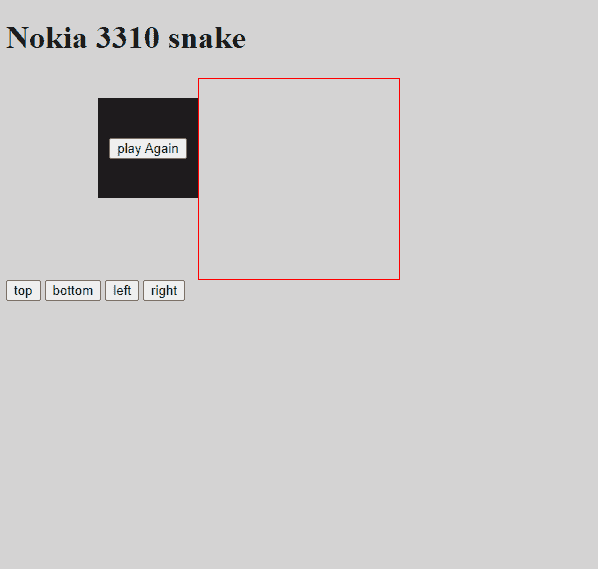
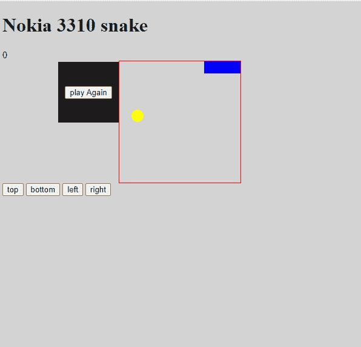

# 如何用 JavaScript 构建一个贪吃蛇游戏

> 原文：<https://www.freecodecamp.org/news/how-to-build-a-snake-game-in-javascript/>

在这篇文章中，我将向你展示如何用 JavaScript 构建一个贪吃蛇游戏。

贪吃蛇游戏是一个简单的游戏，其中一条蛇在一个盒子周围移动，试图吃掉一个苹果。一旦它成功吃掉苹果，蛇的长度就会增加，移动速度也会变快。

当蛇撞上自己或盒子的四面墙时，游戏就结束了。

好的，让我们从 HTML 和 CSS(我们游戏的框架)开始。

### 超文本标记语言

```
<h1>Nokia 3310 snake</h1>
<div class="scoreDisplay"></div>
<div class="grid"></div>
<div class="button">
  <button class="top">top</button>
  <button class="bottom">bottom</button>
  <button class="left">left</button>
  <button class="right">right</button>
</div>
<div class="popup">
  <button class="playAgain">play Again</button>
</div> 
```

上面的 HTML 非常简单。

*   我们有一个显示我们分数的 div 类`scoreDisplay`。
*   有一个类`grid`的 div 将容纳游戏(这将是一个 10 乘 10 的网格)
*   类`button`基本上包含一个按钮，供用户在手机上玩游戏(我们将通过键盘为桌面用户自动操作)。
*   而`popup`类将持有我们的重放按钮。

现在让我们用 CSS 添加一些样式。

### 半铸钢ˌ钢性铸铁(Cast Semi-Steel)

```
body {
  background: rgb(212, 211, 211);
}

.grid {
  width: 200px;
  height: 200px;
  border: 1px solid red;
  margin: 0 auto;
  display: flex;
  flex-wrap: wrap;
}

.grid div {
  width: 20px;
  height: 20px;
  /*border:1px black solid;
box-sizing:border-box*/
}

.snake {
  background: blue;
}

.apple {
  background: yellow;
  border-radius: 20px;
}

.popup {
  background: rgb(32, 31, 31);
  width: 100px;
  height: 100px;
  position: fixed;
  top: 100px;
  left: 100px;
  display: flex;
  justify-content: center;
  align-items: center;
} 
```

在 CSS 中，作为游戏板的`grid`具有设定的尺寸和显示的`flex`。这允许这个网格的内容(div)以水平方式排列，就好像它们是行内元素，而不是它们拥有的正常块显示。

`flex wrap`属性只是将 div 移动到下一行，防止它们超过其父元素(网格)的设置尺寸。

我们将从 JS 动态创建游戏板内容，但我们可以在这里给出宽度和高度(用`.grid` div)。我在这里添加了注释，以帮助您实际查看 div，因此随着时间的推移，我们将取消对代码的注释。

`snake`和`Apple`类向我们展示了蛇和奖励在游戏中的位置，而`popup`类是一个固定的 div，包含了`replay` div。

此时，您应该有这样的东西:



Structure with HTML and CSS

现在我们已经为 JavaScript 做好了准备。

## Java Script 语言

我们需要做的第一件事是定义变量:

```
let grid = document.querySelector(".grid");
let popup = document.querySelector(".popup");
let playAgain = document.querySelector(".playAgain");
let scoreDisplay = document.querySelector(".scoreDisplay");
let left = document.querySelector(".left");
let bottom = document.querySelector(".bottom");
let right = document.querySelector(".right");
let up = document.querySelector(".top");
let width = 10;
let currentIndex = 0;
let appleIndex = 0;
let currentSnake = [2, 1, 0];
let direction = 1;
let score = 0;
let speed = 0.8;
let intervalTime = 0;
let interval = 0; 
```

可变宽度就是它本身(网格的宽度，即 10)。随着我们的继续，其他变量将变得更有意义——但是信不信由你，我们的 snake 实际上是一个名为`currentSnake`的数组。

现在让我们从函数开始:

```
document.addEventListener("DOMContentLoaded", function () {
  document.addEventListener("keyup", control);
  createBoard();
  startGame();
  playAgain.addEventListener("click", replay);
}); 
```

在名为`DomContentLoaded`的文档对象上有一个`eventListener`,一旦 HTML 内容加载到我们的屏幕上，这个事件就会立即触发。

一旦发生这种情况，我们在文档上设置一个 eventListener 来监视键盘上的点击(稍后将详细介绍)。之后，我们要创建`gameBoard`，开始游戏，并注意点击我们的重放按钮。

### createBoard 函数

```
function createBoard() {
  popup.style.display = "none";
  for (let i = 0; i < 100; i++) {
    let div = document.createElement("div");
    grid.appendChild(div);
  }
} 
```

就像我之前说的，这是一个 10 乘 10 的网格，这意味着我们需要 100 个 div。因此，从上面开始，我们关闭 div 弹出窗口，每次创建一个新的 div 并将其添加到网格(游戏板)时，循环到 100。

这将立即添加一些我们在上面创建的样式。网格划分)。您可以取消对 CSS 样式的注释，您将看到创建的 div(取消对它们的注释)。

### 开始游戏功能

```
function startGame() {
  let squares = document.querySelectorAll(".grid div");
  randomApple(squares);
  //random apple
  direction = 1;
  scoreDisplay.innerHTML = score;
  intervalTime = 1000;
  currentSnake = [2, 1, 0];
  currentIndex = 0;
  currentSnake.forEach((index) => squares[index].classList.add("snake"));
  interval = setInterval(moveOutcome, intervalTime);
} 
```

`startGame`函数首先获取所有的 div(因为我们在运行时创建 div，所以我们不能在代码的顶部获取它们)。

接下来，我们为苹果选择一个位置。我们将在下面的 **`randomApple`** 函数中进行说明。`direction`表示蛇的前进方向——1 表示向右，1 表示向左，依此类推。

`intervalTime`设置蛇移动的时间，而`currentSnake`定义蛇在网格上的确切位置(注意，蛇基本上是一对给定特定颜色的 div)。

为了在屏幕上显示我们的蛇，我们将用`forEach`循环遍历`currentSnake`。对于我们得到的每一个值，我们将把它与**平方**一起使用。记住我们用`querySelectorAll`访问网格 div，然后我们可以像访问数组一样访问它们，也就是使用数字。在我们的例子中，这些是`currentSnake`的值。

在这之后，我们简单地将一个`setInterval`调用(带有函数 move `Outcome`和时间`intervalTime`，我们在上面设置过)附加到变量`interval`。这样我们就可以很容易地调用这个变量的`clearInterval`。

`moveOutcome`每 1000 毫秒运行一次，基本上定义了当你移动蛇时会发生什么。

### moveOutcome 函数

```
function moveOutcome() {
  let squares = document.querySelectorAll(".grid div");
  if (checkForHits(squares)) {
    alert("you hit something");
    popup.style.display = "flex";
    return clearInterval(interval);
  } else {
    moveSnake(squares);
  }
} 
```

所以像上面的`startGame`函数一样，我们首先获取所有的`grid`div，然后我们检查 **`checkForHits`** 函数是否返回 true。

如果是这样，这意味着我们已经击中了什么，然后它显示重播按钮，并清除间隔。如果它返回 false，这意味着我们没有击中任何东西，我们用 **`moveSnake`** 函数移动蛇。

所以基本上，每隔 1 秒，如果`checkForHits`为真，游戏就结束；如果`checkForHits`为假，我们就把蛇向前移动一步。我先说说`moveSnake`功能。

### moveSnake 函数

```
function moveSnake(squares) {
  let tail = currentSnake.pop();
  squares[tail].classList.remove("snake");
  currentSnake.unshift(currentSnake[0] + direction);
  // movement ends here
  eatApple(squares, tail);
  squares[currentSnake[0]].classList.add("snake");
} 
```

`moveSnake`函数接收一个名为`squares`的参数，这样我们就不必得到**。网格 div** 再次出现在这个函数中。

我们需要做的第一件事是通过 pop 移除 **`currentSnake`** 数组的最后一个元素(这是尾部，第一个元素总是头部)。基本上，蛇向前移动了一步，离开了原来的位置。在这之后，我们简单地用`unShift`向数组的开头添加一个新值。

让我们假设我们的蛇刚刚开始移动，并且面向右侧(即方向= 1)。该方向将被添加到`currentSnake`的头部，总和将作为新的`snakeHead`被推送。

例如，如果蛇位于位置**【2，1，0】**，我们移除最后一个元素，使其位于位置【2，1】。然后我们取头部 **2** ，加上方向 **1** ，并把这个值设为新值**【3，2，1】**，一秒钟后我们的蛇向右移动一步。

如果我们想要向下移动蛇，方向将被设置为宽度(即 10)并添加到第一个元素(即 12 并被推动)**【12，2，1】**。

之后，我们简单地检查蛇是否吃了苹果，并在 DOM 上显示新的蛇头。

### checkForHits 函数

```
function checkForHits(squares) {
  if (
    (currentSnake[0] + width >= width * width && direction === width) ||
    (currentSnake[0] % width === width - 1 && direction === 1) ||
    (currentSnake[0] % width === 0 && direction === -1) ||
    (currentSnake[0] - width <= 0 && direction === -width) ||
    squares[currentSnake[0] + direction].classList.contains("snake")
  ) {
    return true;
  } else {
    return false;
  }
} 
```

`checkForHits`函数有一个 if 语句。根据定义的条件，它可以返回 true(意味着我们击中了什么)或 false。

第一个条件是如果`currentSnake` [0】(蛇头)+ width (10)等于宽度的总面积(即 width*width = 100)且方向等于宽度。

所以基本上让我们假设蛇的头在位置 97，这是我们网格的最后一层。如果你把 10 加到 97 (= 107)，那就比整个网格的 100 还要大。如果蛇的方向仍然是向下，那么蛇已经触及底部边界。

如果蛇在 97，97+10 =107，但玩家能够改变方向，比如说，1(比如，他们按下了左键)，那么它不会击中任何东西。

或者( **||** )如果蛇头除以宽度= **宽度-1** (例如 9)且方向为 **1** 时的余数。右侧的最后一个 div 的值为 **9、19、29** 等等。所以基本上，当你除以 10 时，它总是保持为 9。

如果我们的蛇的头部在 39 号位置，方向还是 1(也就是蛇还在向墙移动)，那么它已经撞到了什么东西(右边的墙)。

其他每一种情况都与上面两种情况完全相反。最后一个条件是，如果蛇头去了一个已经有蛇的地方，这仅仅意味着蛇在咬自己。

因此...如果上面的任何一个条件为真，那么这条蛇击中了什么东西，将返回**真**(否则为假)。如果是这样，游戏就结束了。但是如果是假的，用`moveSnake`将蛇向前移动一步。

### eatApple 函数

```
function eatApple(squares, tail) {
  if (squares[currentSnake[0]].classList.contains("apple")) {
    squares[currentSnake[0]].classList.remove("apple");
    squares[tail].classList.add("snake");
    currentSnake.push(tail);
    randomApple(squares);
    score++;
    scoreDisplay.textContent = score;
    clearInterval(interval);
    intervalTime = intervalTime * speed;
    interval = setInterval(moveOutcome, intervalTime);
  }
} 
```

每当蛇移动一步，就从`moveSnake`函数调用`eatApple`函数。

它接收两个自变量平方，**。格子 div** 和**尾巴**(基本上是从`moveOutcome`中的蛇弹出来的值)。然后它检查我们的蛇移动到的下一个位置是否包含一个苹果。

如果是的话，它只是把我们弹出的尾部加回数组。这是因为我们的蛇每吃一个苹果，我们都希望蛇的长度增加一个值——还有什么比添加移动时被弹开的尾巴更好的方法呢？

然后我们简单地用`randomApple`为我们的苹果选择一个新的位置(见下文)。之后，我们将**的值加 1**并显示给用户，清除`timeInterval`(这样我们可以增加蛇的速度，这是每次移动发生的时间)，然后我们简单地将时间间隔设置回来。

### 随机苹果函数

```
function randomApple(squares) {
  do {
    appleIndex = Math.floor(Math.random() * squares.length);
  } while (squares[appleIndex].classList.contains("snake"));
  squares[appleIndex].classList.add("apple");
} 
```

`randomApple`通过使用 **do while** 循环，简单地选择一个点来放置我们的苹果。首先，它在 do 循环中用`Math.random()`选择一个随机位置，并检查它选择的点是否已经包含一个 snake 类。

这意味着 do 语句中的条件将继续运行，直到找到一个不包含蛇的点(当这为真时继续这样做)。一旦它找到一个点，它就给这个点一个苹果的等级。

### 设置控件

现在我们需要设置我们的控制。我们将从键盘用户开始。

```
function control(e) {
  if (e.keycode === 39) {
    direction = 1; // right
  } else if (e.keycode === 38) {
    direction = -width; //if we press the up arrow, the snake will go ten divs up
  } else if (e.keycode === 37) {
    direction = -1; // left, the snake will go left one div
  } else if (e.keycode === 40) {
    direction = +width; // down the snake head will instantly appear 10 divs below from the current div
  }
} 
```

记得从上面我们为`**keyup**`设置了一个`eventListener`。手按下和后，此功能会立即启动。在键盘上留下一个键。

现在键盘上的每个按钮都有一个名为 keycode(数字)的值，我们可以访问这个值，让我们知道哪个数字被点击了。基本上，我们将关注箭头键和它们各自的键码。这样我们就可以改变方向，例如 **-1，10** 等等。

好的，我希望你明白我们现在如何移动这条蛇。

接下来，这组按钮是用于移动设备的，我们基本上在做同样的事情:

```
up.addEventListener("click", () => (direction = -width));
bottom.addEventListener("click", () => (direction = +width));
left.addEventListener("click", () => (direction = -1));
right.addEventListener("click", () => (direction = 1)); 
```

我们需要做的最后一件事是创建一个 **`replay` div** ，当蛇碰到什么东西时，它就会弹出来。按钮帮助我们重置游戏。

### 重放功能

```
function replay() {
  grid.innerHTML = "";
  createBoard();
  startGame();
  popup.style.display = "none";
} 
```

从上面，我们基本上清除了网格(游戏板)并运行前面的功能。

恭喜你-你坚持到了最后！下面是最终结果:



Final game

我希望你能够编码，并喜欢它。

在本教程中，我们学习了如何用 JavaScript 创建自己的贪吃蛇游戏。我们涉及的其他一些重要概念包括 **push、pop、setInterval、clearInterval** 和 **eventListener** 。

你可以在这里查看最终的比赛:[https://codepen.io/Fako29/pen/dyppXZG](https://codepen.io/Fako29/pen/dyppXZG)。

感谢您的阅读。在推特上关注我:[https://twitter.com/fakoredeDami](https://twitter.com/fakoredeDami)