# 如何使用 Cypress 和 Applitools 在 Next.js 应用程序上运行可视化回归测试

> 原文：<https://www.freecodecamp.org/news/how-to-run-visual-regression-testing-on-a-next-js-app-with-cypress-and-applitools/>

任何开发项目的一个关键组成部分是测试，确保项目总是做它应该做的事情。

有大量的测试工具可供我们使用，但并不是所有的工具都能测试一个人的真实体验。我们如何使用 Applitools 来可视化测试我们的项目，并确保它实际上工作正常？

*   什么是视觉回归测试？
*   [柏树是什么？](#what-is-cypress)
*   [什么是 Applitools？](#what-is-applitools)
*   我们要建造什么？
*   [步骤 0:用 Next.js 创建一个新的 React 应用程序](#step-0-creating-a-new-react-application-with-next-js)
*   [第一步:在 Next.js 应用中安装和配置 Cypress](#step-1-installing-and-configuring-cypress-in-a-next-js-app)
*   [步骤 2:在 Next.js 应用程序中创建你的第一个 Cypress 测试](#step-2-creating-your-first-cypress-test-in-a-next-js-app)
*   [步骤 3:安装和配置 Applitools 眼睛](#step-3-installing-and-configuring-applitools-eyes)
*   [步骤 4:用 Applitools Eyes 进行视觉回归测试](#step-4-visual-regression-testing-with-applitools-eyes)

[https://www.youtube.com/embed/3dF4t56LHhs?feature=oembed](https://www.youtube.com/embed/3dF4t56LHhs?feature=oembed)

你也可以从[我的 Twitch 频道](https://twitch.tv/colbyfayock)查看[我的直播流](https://www.youtube.com/watch?v=Bei0Cvu7D7I)，在那里我经历了设置一个新应用程序并用 Cypress 和 Applitools 测试它的整个过程。

坦白说，我最近接受了一份 Applitools 的开发人员的工作。但是你可以使用它的免费层来完成这个教程，不需要信用卡。

## 什么是视觉回归测试？

与大多数测试类似，视觉回归测试是一种定期运行的测试，在项目生命周期的不同阶段运行，如在拉式请求或生产部署时，以确保应用程序中的一切正常运行。

然而，可视化回归测试的不同之处在于，它直接比较项目的可视化快照。它通过静态访问页面或与页面交互以预览交互结果来检测内容、布局或任何其他细节的任何变化。

## 柏树是什么？

Cypress 是一个基于 JavaScript 的测试框架，我们将用它来运行我们的测试套件。它在浏览器中运行测试，允许我们直接检查人们将实际使用它的项目的状态。

Cypress 的伟大之处在于它还提供了与页面交互的能力。例如，如果我们想测试使用我们的应用程序的人是否能够登录，我们可以输入凭证并提交登录表单，然后检查身份验证过程是否正常工作。

## 什么是 Applitools？

Applitools 是一个可视化测试工具和自动化平台，让我们可以在不同的时间点直观地比较我们的应用程序，让我们能够检查某些东西是否发生了变化或运行不正常。

虽然 Applitools 有一些不同的特性我们可以利用，但我们将重点使用 Eyes API，我们将使用它来捕获我们的快照并将其发送到 Applitools 仪表板。

## 我们要建造什么？

虽然我们真的可以在各种项目类型上运行 Cypress 和 Applitools，但我们将使用 Next.js 快速构建一个新的 T2 React 应用程序。这将允许我们专注于测试工具，而不是应用程序本身。

一旦我们设置好应用程序，我们将安装 Cypress 和 Applitools，这样我们就可以使用它们来运行我们的视觉回归测试。

*注意:你需要有一个 Applitools 账户来设置可视化回归测试。你可以在 applitools.com 注册一个免费账户。*

## 步骤 0:用 Next.js 创建新的 React 应用程序

首先，我们将使用[创建下一个应用](https://nextjs.org/docs/api-reference/create-next-app)来创建一个新的 Next.js 应用。

一旦您在您想要创建新项目的目录中，在您的终端中运行:

```
npx create-next-app my-testing-app 
```

*注意:您可以将项目名称从`my-testing-app`更改为您喜欢的任何名称。*

这将从 GitHub 克隆默认的 Next.js 示例，安装依赖项，并立即允许我们使用测试工具提高效率。

完成后，导航到您的新项目:

```
cd my-testing-app 
```

启动您的开发服务器:

```
npm run dev 
```

现在您的站点应该可以在 [http://localhost:3000](http://localhost:3000) 上找到了！

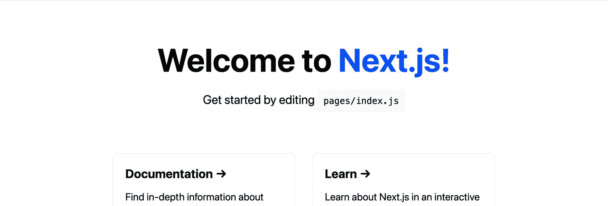

New Next.js App

## 步骤 1:在 Next.js 应用程序中安装和配置 Cypress

现在我们已经设置好了我们的应用程序，我们想安装 Cypress，这样我们就可以用它来运行我们的测试。

回到我们的终端，我们可以安装 Cypress:

```
npm install cypress --save-dev 
```

这里，我们包含了`—save-dev`标志，因为我们不需要 Cypress 在我们应用程序的生产版本中运行，所以我们将它作为一个开发依赖项安装。

一旦完成，我们需要一种从命令行运行 Cypress 的方法。虽然我们可以导航到 Cypress 本身，但我们可以添加一个新的脚本命令，这将使运行 Cypress 变得更容易。

在`package.json`内的`scripts`下，添加以下内容:

```
"cy:open": "cypress open" 
```

现在，在我们的终端中，我们可以运行脚本来打开 Cypress:

```
npm run cy:open 
```

如果这是您第一次运行 Cypress，可能需要额外的一秒钟并在您的项目中安装 Cypress。

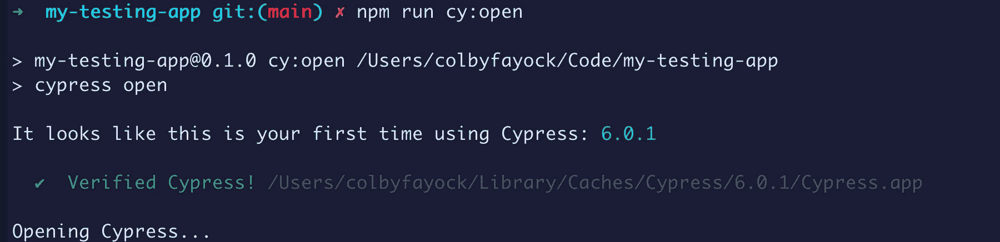

Opening Cypress for the first time

一旦完成，Cypress 将打开一个新的对话面板，它将作为您运行项目测试的仪表板。

您还会注意到 Cypress 让您知道他们还在`cypress`向您的项目添加了一个新目录。这包括示例文件，让您看到 Cypress 是如何工作的，并立即开始。

为了进行测试，在 Cypress 面板的右侧，点击**运行 19 个集成规格**。

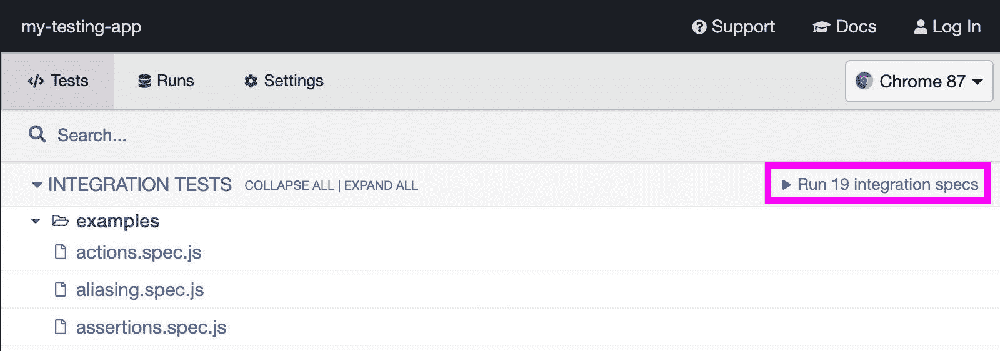

然后 Cypress 将打开一个新的浏览器并运行所有的示例测试。

接下来，我们将添加一些我们自己的测试。

[跟随提交！](https://github.com/colbyfayock/my-testing-app/commit/ba73974d4521443d64fa4bddbc07500c0bb7b74f)

## 步骤 2:在 Next.js 应用程序中创建第一个 Cypress 测试

既然我们可以成功地运行我们的测试，让我们试着添加我们自己的测试。

我们实际上不需要 Cypress 在示例中包含的任何测试，所以让我们删除整个`integration/examples`目录。

然后，在`integration`下创建一个名为`home.spec.js`的新文件，并在其中添加以下内容:

```
/// <reference types="cypress" />

context('Home', () => {
  beforeEach(() => {
    cy.visit('http://localhost:3000');
  });

  it('should find the title of the homepage', () => {
    cy.get('h1').contains('Welcome');
  });
}); 
```

在上面的代码中，我们:

*   首先添加 Cypress 作为引用类型，这允许 Cypress 找到文件并知道应该使用它来运行测试
*   为我们的测试创建一个新的上下文，并将其定义为 Home
*   告诉 Cypress，在每次测试之前，我们希望它访问我们的主页
*   定义一个测试来获取 h1 并检查它是否包含“Welcome”

如果我们现在回头看看 Cypress，我们会发现我们只有一个集成测试。如果我们点击它并尝试运行测试，我们将看到我们实际上得到一个错误，因为我们从未启动我们的开发服务器，这意味着它不可用。

为了解决这个问题，我们将使用一个叫做[开始-服务器-测试](https://www.npmjs.com/package/start-server-and-test)的工具。

顾名思义，这个包将会:

*   根据我们提供的命令启动我们的服务器
*   运行我们提供的测试
*   完成后停止服务器

要添加它，让我们在终端内部运行:

```
npm install start-server-and-test --save-dev 
```

然后，在我们的`package.json`文件中，我们将向`scripts`对象添加另一个新命令:

```
"test": "start-server-and-test dev 3000 cy:open" 
```

这里，我们告诉 start-server-and-test 我们想要运行`dev`命令来启动我们的服务器，它将在端口 3000 可用，并且我们想要在运行我们的测试之后运行`cy:open`命令。

如果我们回到终端运行:

```
npm run test 
```

我们会看到柏树像以前一样开放。但是如果我们现在运行我们的测试，我们可以看到它成功地打开了我们的 Next.js 应用程序，并且在我们的`h1`中看到了单词“Welcome ”!

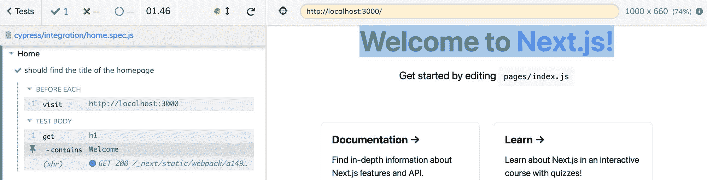

Successfully running a test in Cypress

[跟随提交](https://github.com/colbyfayock/my-testing-app/commit/b7fdcada3c6642521baa8c34949c4b9df3e56c18)。

## 步骤 3:安装和配置 Applitools 眼睛

随着 Cypress 成功运行我们的测试，我们现在可以挂钩到我们的测试中，并使用 Applitools 对我们的项目运行可视化回归测试。

在我们开始之前，请确保您已经在 Applitools 上设置了一个[免费帐户](https://info.applitools.com/ucXsg)，我们需要它来设置 API 密钥。

首先，我们需要将眼睛库安装到我们的项目中。

在我们的终端中，我们可以运行:

```
npm install @applitools/eyes-cypress --save-dev 
```

这将为 Applitools Eyes 安装 [Cypress 专用 SDK。](https://www.npmjs.com/package/@applitools/eyes-cypress)

安装完成后，我们可以运行 Eyes 设置脚本。

```
npx eyes-setup 
```

这将贯穿整个项目，并为 Cypress 添加必要的配置，以使 Eyes 正常工作。

最后，无论何时运行我们的测试，我们都需要使我们的 Applitools API 密钥可用。

首先，我们需要在 Applitools 帐户中找到我们的 API 密钥。

在 Applitools 仪表盘中，选择账户下拉菜单下的**我的 API 密钥**。

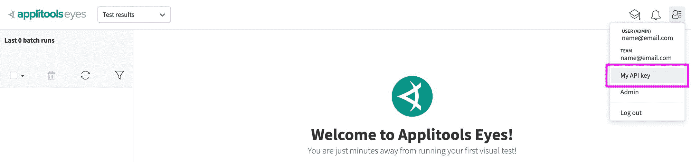

Finding the Applitools API key

这将打开一个对话框，您可以在其中选择和复制您的 API 密钥。

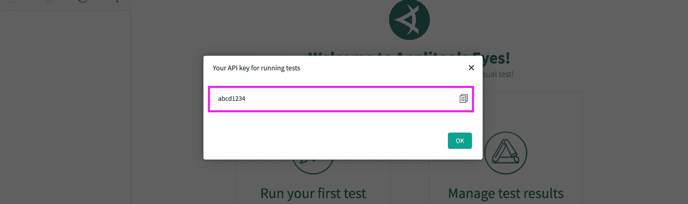

Copying the Applitools API key

当我们运行测试时，您将希望保存这个 API 键。

接下来，我们希望能够设置我们的 API 键。我们可以通过几种方式做到这一点:

*   在运行测试之前，在我们的 shell 中导出环境变量
*   在测试命令前添加 API 密钥
*   将 API 密钥添加到 [applitools.config.js](https://www.npmjs.com/package/@applitools/eyes-cypress#advanced-configuration) 文件中
*   使用 dotenv 和 [cypres-dotenv](https://github.com/morficus/cypress-dotenv) 包创建一个环境变量

对于这个演示，我们将通过在命令前添加 API 键来运行我们的测试。这将使我们能够快速测试出这一点。

为此，每当我们运行类似于`npm run test`的命令时，我们都要在它前面包含我们的 API 键，就像:

```
APPLITOOLS_API_KEY="abcd1234" npm run test 
```

*注意:记住用您的唯一 ID 替换 API 密钥。*

现在，我们应该准备好添加我们的第一个测试。

[跟随提交！](https://github.com/colbyfayock/my-testing-app/commit/0b11b0238270b320969ac9982b271a48981634f4)

## 步骤 4:用 Applitools Eyes 进行可视化回归测试

我们已经配置好了 Cypress 和 Applitools 并准备好了，这意味着我们现在可以添加 Applitools Eyes 来直观地测试我们的应用程序！

我们的应用程序还没有很多功能。，所以我们可以从一个基本的检查开始，确保我们的主页在每次测试运行时看起来都是它应该的样子。

首先，在我们的`cypres/integrations/home.spec.js`文件中，让我们在现有的`it`语句下面添加以下内容:

```
it('should verify the homepage looks as expected', () => {
  cy.eyesOpen({
    appName: 'My App',
    testName: 'Homepage Check',
  });

  cy.eyesCheckWindow({
    tag: 'App Window',
    target: 'window',
    fully: true
  });

  cy.eyesClose();
}); 
```

我们现在要做的是:

*   首先，我们正在“打开”Applitools 的眼睛，它将准备眼睛功能来检查我们的应用程序
*   接下来，我们对应用程序的窗口进行检查，主要是捕获应用程序的屏幕截图并将其发送到 Applitools
*   最后，我们“闭上”Applitools 的眼睛，让眼睛知道我们正在运行检查

现在，如果我们运行测试命令并开始测试:

```
APPLITOOLS_API_KEY="abcd1234" npm run test 
```

我们可以看到 Cypress 运行了我们的新测试用例，它看起来并没有在我们的浏览器中做任何事情，而是显示了一个通过指示器。

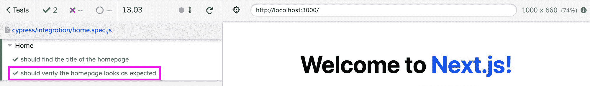

Successfully ran an Applitools Eyes check in Cypress

现在，如果我们回到 Applitools 控制面板:

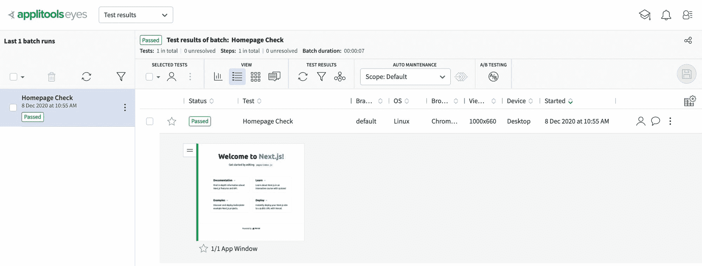

First snapshot in Applitools

我们可以看到，我们有一个新的“运行”标题主页检查(我们在代码中指定)，显示它通过了我们的应用程序的快照。

现在，仅仅有这张截图并不能让它变得强大。从现在开始，每当我们运行这个测试时，Applitools 都会将我们的应用程序与这个原始快照进行比较，并让我们知道是否有任何变化。

为了测试这一点，我们将改变页面标题的颜色。这可能看起来是一个简单的变化，但是对于像 Cypress 这样的工具来说，风格变化可能更具挑战性，这是 Applitools 的眼睛将通过其快照比较发光的地方。

在`styles/Home.module.css`文件中，让我们将以下内容添加到`.title`类中:

```
color: #ddd;
```

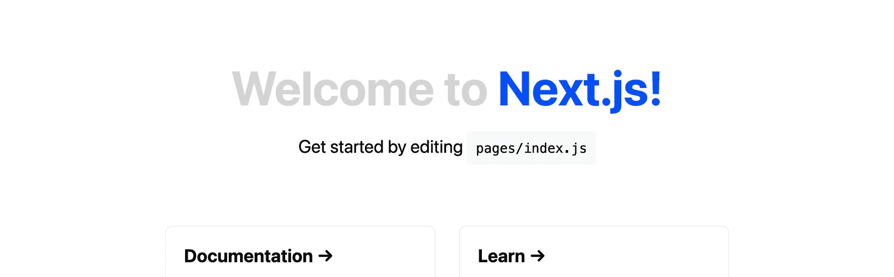

Next.js app with light gray title

虽然我们在实践中可能没有故意做这样的改变，但如果我们改变了级联到我们标题的样式，这种情况就可能发生。这使得我们的标题很难阅读，但这对于测试用例来说是完美的。

现在，让我们再次运行我们的测试:

```
APPLITOOLS_API_KEY="abcd1234" npm run test
```

但是这一次，我们可以看到我们的测试失败了！

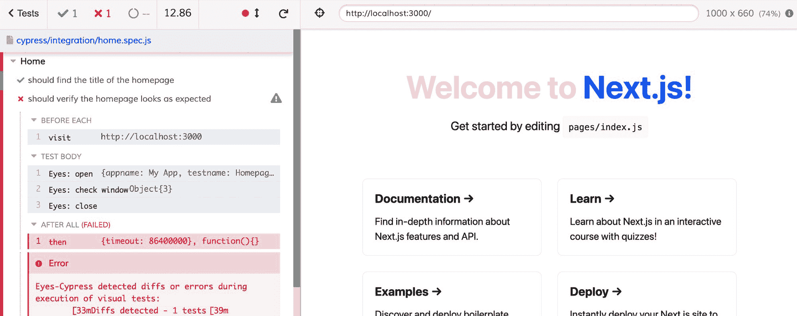

Cypress throwing an error with the Applitools Eyes check

我们的 Applitools 测试失败，因为它声明“Eyes-Cypress 在执行视觉测试期间检测到差异或错误”。

如果我们看一下 Applitools 仪表板的内部:

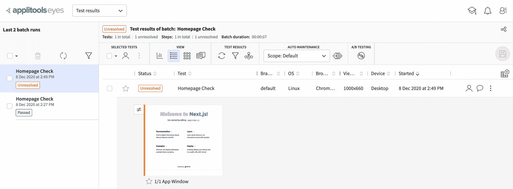

Change detected in text of app title in Applitools Eyes

我们可以看到，我们现在有一个“未解决的”运行，Applitools 在页面上向我们显示了差异，在我们的情况下，这是我们标题的“欢迎使用”部分。

这在项目中非常有用，因为测试应用程序中的每一个页面或每一类页面都是一项挑战。我们可以确保如果有任何变化或损坏，它会立即在 Applitools 中标记出来。

从这里开始，如果我们对颜色变化感到满意，我们可以接受新版本的应用程序。

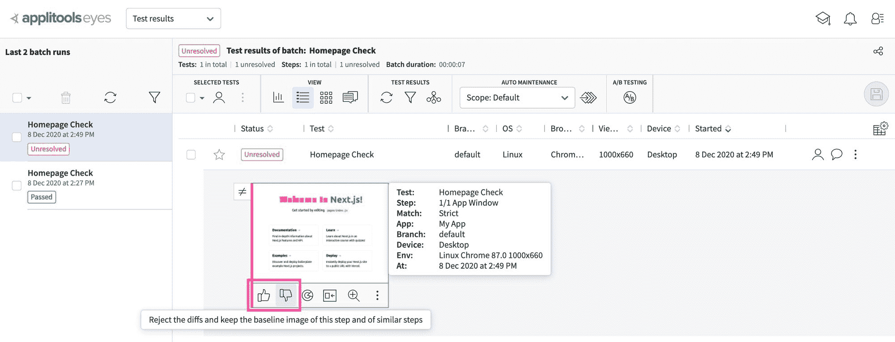

Accept or reject changes in Applitools Eyes

否则我们可以拒绝它，并让我们的团队知道它需要修复。

[跟随提交！](https://github.com/colbyfayock/my-testing-app/commit/6c5f5655d0e15878e870a893652201979244e986)

## 下一步是什么？

在 Cypress 和 Applitools 之间，我们可以做很多事情来确保我们的应用程序按照我们想要的方式运行。

大多数时候，当我们开发一个应用程序时，我们开发这个应用程序是为了让人们能够与之互动。

使用 Cypress，我们可以点击页面的不同部分，改变页面的状态，然后用 Applitools Eyes 进行检查，以确保它按照我们期望的方式运行。

我们还可以让 Cypress 在不同的浏览器上运行，以确保我们的应用程序在任何有人试图使用它的地方都能正常工作！

[](https://twitter.com/colbyfayock)

*   [🐦在 Twitter 上关注我](https://twitter.com/colbyfayock)
*   [📺订阅我的 Youtube](https://youtube.com/colbyfayock)
*   [📫注册我的简讯](https://www.colbyfayock.com/newsletter/)
*   [💝赞助我](https://github.com/sponsors/colbyfayock)