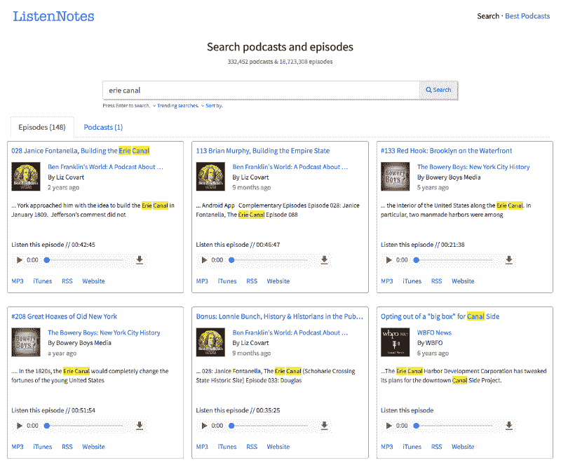
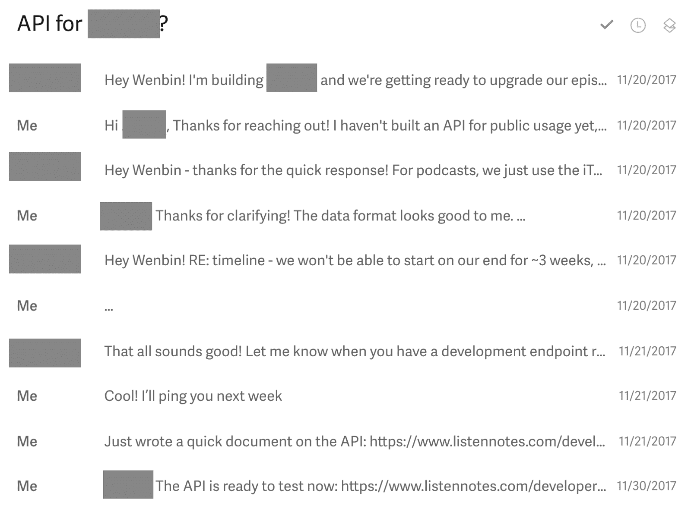
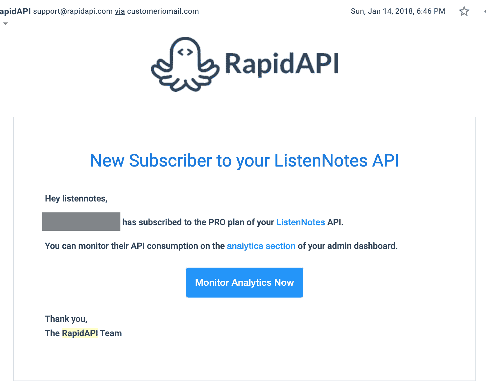
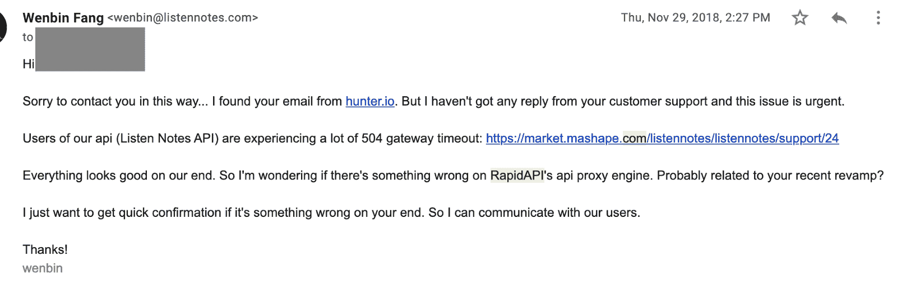
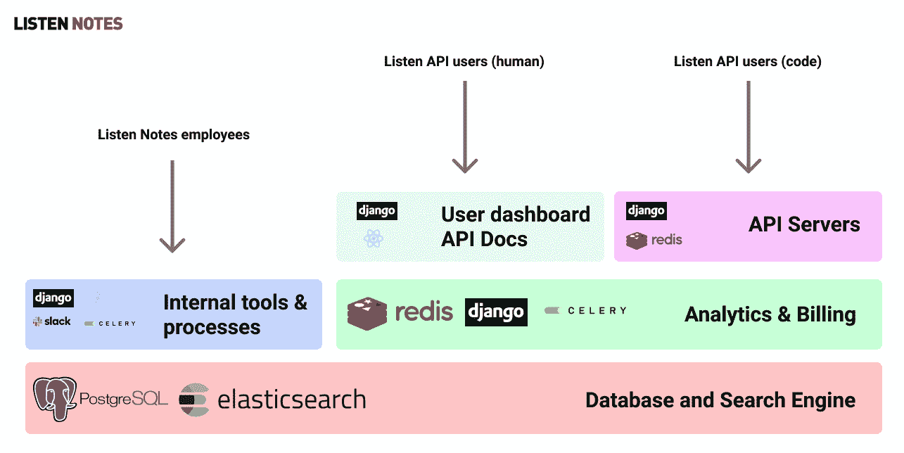
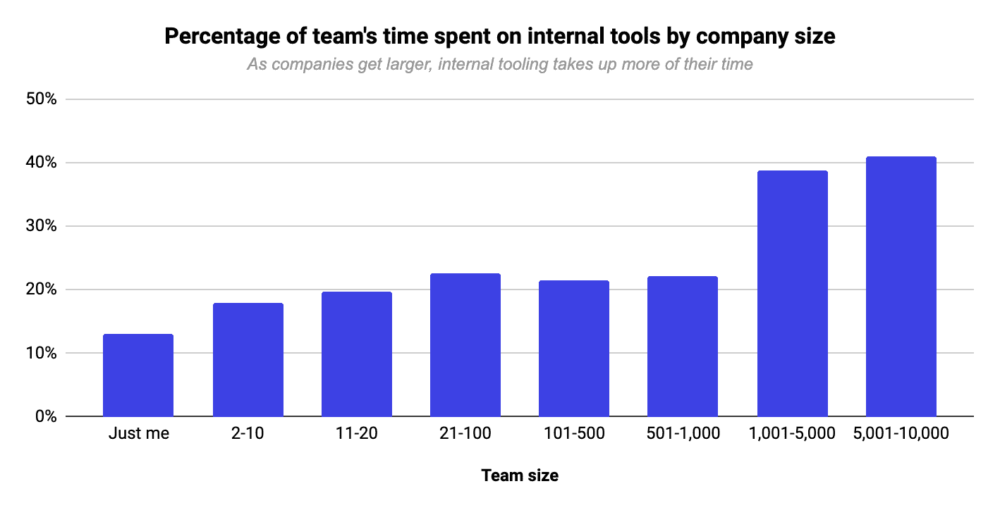
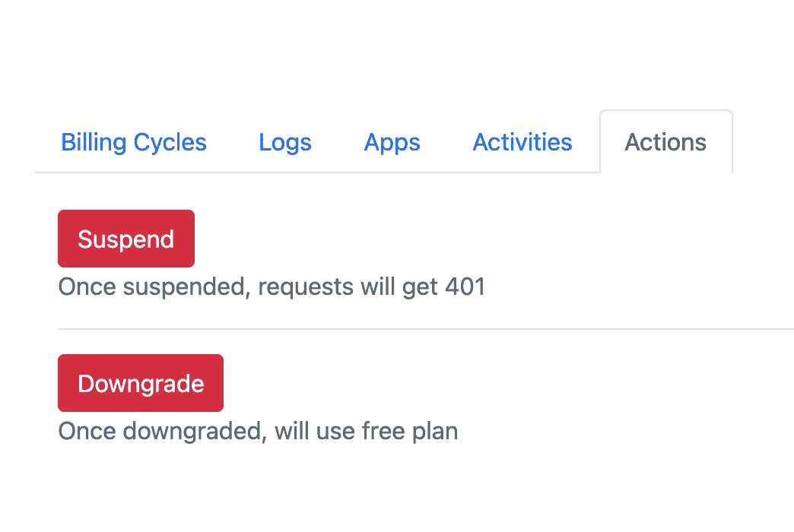
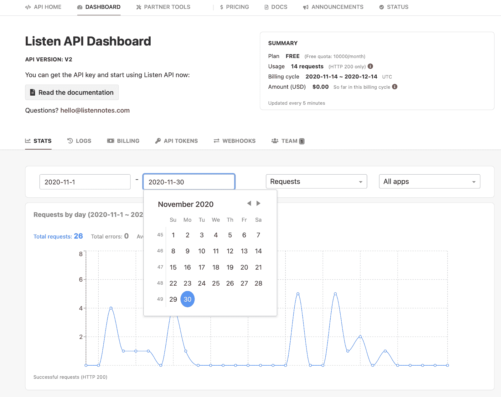
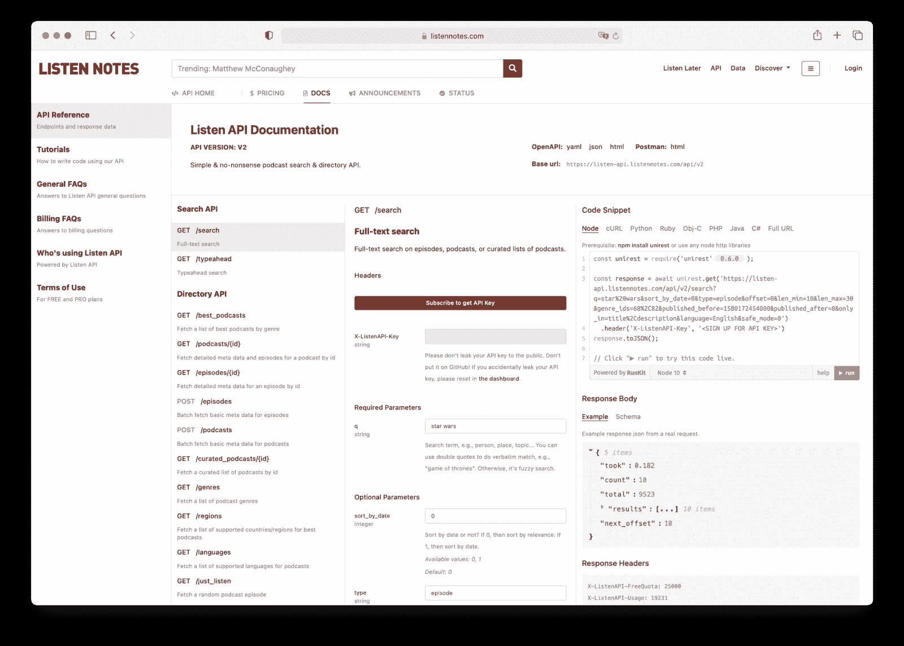
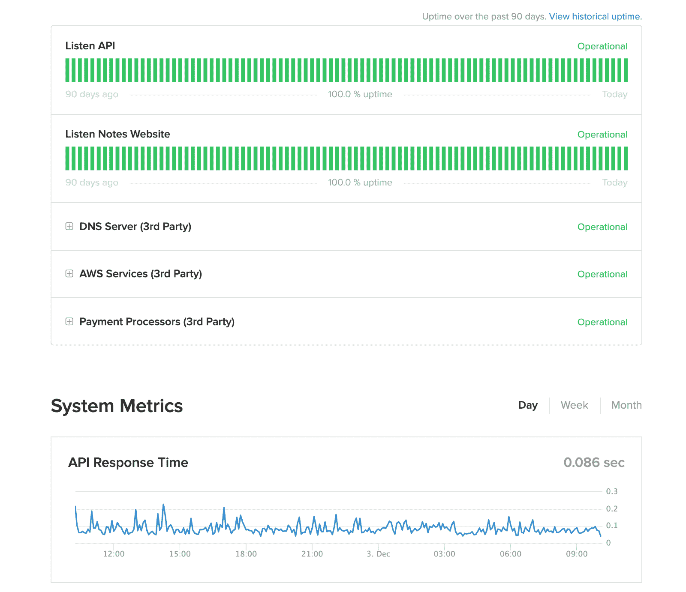

# 我如何意外地建立了一个 API 业务

> 原文：<https://www.freecodecamp.org/news/how-i-accidentally-built-an-api-business/>

在这篇文章中，我将分享我构建 API 业务的旅程，背后的技术，以及如何在未来构建自己的 API 业务。

首先，简单介绍一下我建立的业务: [Listen Notes](https://www.listennotes.com/) 是一个播客搜索引擎，允许人们按人物或主题搜索[近 200 万个播客和超过 8900 万集](https://www.listennotes.com/podcast-stats/)。我们还提供了一个[播客 API](https://www.listennotes.com/api/) 供开发者使用，名为 Listen API。它已经成为我们业务的核心部分。

## **一次偶然的 API 业务**

我在 2017 年 9 月离开了之前失败的创业公司。经过几天的修补，我拿起我的一个羽翼未丰的副业项目来润色一下 UI。

那个副业项目是 [Listen Notes](https://www.listennotes.com/) ，一个播客搜索引擎网站，它只是一个单页 React JS 应用程序，运行在三个每月 10 美元的 DigitalOcean droplets 上。

几年前，我一点也不知道，我的这个被忽视的小副业，会变成一个有益的事业，而且已经开花结果。

An early version of Listen Notes

我继续全职研究 Listen Notes，并于 2017 年 10 月将 Listen Notes 注册为特拉华州 C-Corp。我的目标之一是体验尽可能多的业务方面，而不仅仅是在幕后写代码。

我最初的计划是这样的:(不要笑我！)

*   建立一个播客搜索引擎网站，从广告中赚点钱，就像谷歌一样。简单！
*   如果这个听笔记的东西在两三个月内不工作，那么我会用完现金，我会欠下信用卡债务来维持一个月左右。如果还是不行，那我就得找份全职工作了。尽管杰夫·贝索斯的父母向早期亚马逊投资了 30 万美元，马克·扎克伯格的父母向早期脸书贷款了 10 万美元，但并不是每个家庭都能在网络项目上随意投入六位数的现金。

然后发生了一些事情。

2017 年 11 月 20 日，我收到了一个新的播客应用程序的开发者的邮件，他问我 Listen Notes 是否提供了 API。他希望能够在他的应用程序中搜索剧集，但他不想构建整个后端。

我问了几个问题(例如，终端看起来怎么样，他需要什么数据字段，他愿意付多少钱……)。我得到了他的答案。几天之内，所有的东西都在一封电子邮件中。

2017 年 11 月 30 日，我快速实现了三个端点( *GET /search，GET /podcasts/{id}，GET /episodes/{id}* )，基本就是三个 [Django 视图](https://docs.djangoproject.com/en/3.1/topics/http/views/)。

我谷歌了“API gateway”或类似的东西，发现了一个名为 [Mashape](https://konghq.com/blog/mashape-has-a-new-homepage/) 的服务，这是一个处理支付、用户管理和 API 文档的 API 市场。

所以我把我的三个端点放在 Mashape 上，并在那里创建了两个计划:免费和专业。我给开发者回了邮件，告诉他 API 已经可以使用了。

The email thread that prompted me to build Listen API

然后什么都没发生。播客应用开发者没有使用我们的 API，而是逐步淘汰了他们的项目。

最终，我把主要精力转移到了 listennotes.com 的发展上。API 在开放网络上基本上处于自驱动模式。任何碰巧发现我们 API 的人都可以注册，不需要和任何人交谈。

2018 年 1 月 14 日，我有了第一个付费用户。同年，又有一些付费用户加入进来。

The email notification I received for my first paying user

等等，什么是 RapidAPI？Mashape 被一家名为 RapidAPI 的初创公司收购。直到 2018 年年中，他们才完全将 Mashape 更名为 RapidAPI。创业公司通常不会以干净和有条不紊的方式做事，这完全可以理解。

然后发生了一些事情。

2018 年 11 月 29 日 RapidAPI 端停电。

The email I sent to people in RapidAPI when the outage happened

RapidAPI 在那段时间进行了一次大型后端升级。作为一名工程师，我完全理解停机会发生，尤其是在后端进行巨大更改时。但是我感到很无奈，因为他们的客服没有回复我的邮件。电话没起作用，不出所料。

通常他们的客户支持是非常积极的。也许是假日季节，人们都在度假。

所以我用 hunter.io 找到了 RapidAPI 员工、首席执行官和首席技术官的工作邮件。几个小时后，问题终于解决了。换句话说，我们的 API 在那些停机时间里完全不可用。我为我们的付费用户感到非常遗憾。

然后在 2019 年 2 月中旬左右，RapidAPI 出现了计费问题，未能支付我们几千美元。我们的付费用户先付了 RapidAPI。RapidAPI 拿了 20%的提成。然后他们把剩下的 80%(减去 PayPal 费用)付给我们。

经过几个来回的电子邮件和电话，我们终于拿到了我们的付款。可以理解。还是那句话，创业公司会犯错。

2019 年 2 月下旬，我决定打造我们自己的 RapidAPI 替代产品，原因如下:

*   我们的 API 收入变得非同小可。RapidAPI 降价 20%对我们来说太多了。
*   我们希望 API 请求直接到达我们自己的服务器，从而降低用户的延迟。
*   当 RapidAPI 停机时，我不想感到无助。总的来说，他们在运营这项服务方面做得很好。但我想掌握自己的命运。
*   我想直接联系我的 API 用户。使用 RapidAPI，像我这样的 API 提供者无法访问我们用户的电子邮件地址。可以理解。这就像“X 的优步”公司不希望员工和客户绕过他们，私下达成交易。市场不希望用户跳过中间人的佣金费用。

此外，我发誓要为我们的新 API 系统做好两件事:

*   我们必须为付费用户提供优质的客户服务。
*   我们将为客户提供非常稳定可靠的后端服务。

经过 30 天的努力，[我们于 2019 年 3 月 27 日推出了 Listen API v2](https://www.listennotes.com/blog/listen-api-v2-simple-pricing-same-endpoints-39/) 。RapidAPI 上托管的传统 API 变成了 Listen API v1，这个版本我们不会添加新功能，但也不想关闭，因为截至 2020 年 12 月，一些应用程序仍在使用它！

我们通过添加新的端点、新的数据字段、提高运营效率以及整理用户仪表板和我们的内部工具来继续改进我们的新 Listen API v2。

事情逐渐加快了速度。从那以后我一直很开心。

所以，这就是 Listen API 到目前为止的历程。

注意:虽然我们决定离开 RapidAPI，但我仍然认为它是一项很棒的服务。创业公司在早期都会犯错。他们修理东西并不断改进服务，这太棒了！

## **监听 API 背后的技术**

开发者可以使用我们的 API 来搜索播客并获取详细的播客剧集元数据。为了让整个事情顺利进行，我们需要确保一些核心组件就位。

Listen API's main components and the technologies used

### **数据存储和搜索引擎**

这是与我们的网站共享的组件。因此，在构建我们的 API 基础设施时，我不需要更改数据存储和搜索引擎中的任何东西。

我们使用 Postgres 作为主要的数据存储(例如，用于播客元数据、用户账户等)，使用 Elasticsearch 作为搜索引擎。

我写了一篇旧的博客文章，介绍了整个技术体系的细节。

### **内部工具和流程**

如果你在任何网络公司工作过，你可能知道我在这里指的是什么。

互联网业务很少是 100%自动化的。公司总是需要构建大量的内部工具，并设置手动流程来保持服务的功能。这就是为什么现在像 [Retool 这样的公司有这么高的估值](https://www.bloomberg.com/news/articles/2020-10-20/retool-nears-1-billion-valuation-with-funding-from-sequoia)。

公司在终端用户看不见的内部工具上投入了大量资金:

Percentage of team's time spent on internal tools. Credits: [Retool](https://retool.com/blog/state-of-internal-tools-2020/)

为了开始我们的 API 业务，我们需要构建(至少)两种类型的内部工具:

*   **对于数据操作**:我们需要能够保持播客元数据最新，修复损坏的元数据，并审查和批准用户所做的任何更改。
    此外，我们需要一个框架来处理新的、罕见的播客数据损坏的边缘情况。在某种程度上，构建一个软件产品意味着在很长一段时间内(比如几年)处理大量的边缘案例，而不是每天都推出新的功能。
*   **对于用户操作**:我们需要能够暂停一个坏用户的帐户，以及立即查找与特定用户相关的所有信息，该特定用户就特定问题与我们联系。
    此外，当用户抱怨时，我们必须能够快速评估是“是我们的错”(服务器端错误)还是“是他们的错”(客户端错误)。

内部工具由公司内部的员工使用。其中一些工具是完全自动化的，比如执行预定任务的 cron 作业。但是许多工具应该由人类员工手动使用，例如当输入用户的 ID 号并点击按钮时。

我们的大多数内部工具都有难看的 web 用户界面，默认的[引导](https://getbootstrap.com/)样式:)

A portion of our internal tool’s UI that allows us to suspend an API user’s account.

幸运的是，我们的 API 与网站共享许多内部工具。所以我们不需要在这里建造太多新的东西。

### **分析和计费系统**

API 的定价模型通常是基于使用的。查看一些真实世界的例子:

*   [https://www.twilio.com/pricing](https://www.twilio.com/pricing)
*   [https://sendgrid.com/pricing/](https://sendgrid.com/pricing/)
*   [https://cloud.google.com/maps-platform/pricing/](https://cloud.google.com/maps-platform/pricing/)
*   [https://www.microsoft.com/en-us/bing/apis/pricing](https://www.microsoft.com/en-us/bing/apis/pricing)

必须实时跟踪用户使用了多少请求。我们使用 Redis 来跟踪这些统计数据，并定期将其转储到 Postgres 中进行持久存储。

如果我们的 Redis 出现故障会怎么样？我们可能会暂时失去一些跟踪数据。在这种情况下，我们有一个内部工具来同步原始 Nginx 日志中的统计数据。

我们必须在不影响现有用户的情况下改变计费方案。例如，如果我们提高价格，现有用户仍应享受旧计划的好处。如果做得不对，很容易出现各种不一致的状态，愤怒的用户会被收取错误的账单！

支付失败是非常常见的事情，必须妥善处理。我们不能马上暂停用户。我们需要能够通知自己“该用户未能付款”，并通知用户“您未能付款”

重试几次后，我们手动暂停用户——嗯，我们可以自动完成最后一步。但是我们现在不经常暂停用户，所以手动这样做也没问题。没有必要让一切都尽善尽美(至少目前是这样)。

我们有一个仪表板(上帝的视角)来查看每个用户在当前计费周期中使用了多少请求。我们能够从 web 用户界面查看每个用户的原始日志，而无需从 S3 手动获取日志文件。

Stripe 和 PayPal(通过 Braintree)是我们的支付处理器。我们的大多数国际用户都使用 PayPal。

最后，将所有这些因素放在一起，我们可以根据用户的使用情况，计算出用户应该实时支付给我们的实际金额。我们通过 [Celery](https://docs.celeryproject.org/en/stable/getting-started/introduction.html) 运行异步任务来收取到期账单。

如果用户在计费周期中途退订，会发生什么情况？我们根据时间和使用情况按比例收取费用。在这些情况下，用户不需要支付整月的费用。

### **API 服务器**

我们运行 Django 应用程序来服务 API 请求。每个端点都是一个简单的 Django 视图。Django 中间件验证请求是否合法，然后立即生成日志或拒绝请求。

我们在 Redis 中缓存每个 API 键+唯一 URL 的响应数据。总的来说，[我们的 API 性能相当不错](https://www.listennotesstatus.com/)。

我们使用 Nginx 作为负载平衡器，并提供多个 API 服务器。这里进行滚动部署很简单，通过一系列健全性检查来确保 API 正常工作。

总的来说，简单和健壮的部署过程增加了我经常进行增量代码更改和频繁部署的信心。

API 端点是 RESTful 的，并返回一个 JSON 响应，这在当今相当标准。

### **用户仪表板和 API 文档**

每个 API 用户都可以访问我们网站上的[仪表板](https://www.listennotes.com/api/dashboard/)，了解他们在当前计费周期中使用的请求数量，并查看最近的原始日志。他们还可以更新支付方式，创建或重置新的 API 密钥，设置 webhooks，以及将同事添加到同一个 API 帐户。

Listen API's user dashboard

[API Docs](https://www.listennotes.com/api/docs/) 可能是一个 API 业务最重要的 UI。因此，许多 API 公司雇佣了整个全职工程师团队来“仅仅”构建和维护 API 文档页面。

一个 API 文档页面不仅仅是一整页的英文单词。它必须显示不同编程语言的代码片段。

用户必须能够直接从页面运行您的代码示例。您需要设计一个可重复的过程(无论是自动的还是手动的)来保持文档与代码同步。有很多细微差别。

我们花费了大量的时间和精力来构建和迭代多个版本的 API 文档页面。以下是最终结果:

[Listen API Docs Page](https://www.listennotes.com/api/docs/)

最初，我们尝试了一些 API 文档的开源解决方案。理解一个开源项目并对其进行定制是非常耗时的。最终，我们决定从头开始构建页面比定制其他人构建的开源解决方案更快。

我们的 API 文档页面基本上是一个 React JS 单页应用程序。

我们将所有端点、响应数据模式和示例响应编入一个 [OpenAPI 规范](https://listen-api.listennotes.com/api/v2/openapi.yaml)。API 文档页面的 React JS 应用程序直接读取我们的 OpenAPI 规范。

使用 OpenAPI 的副作用是我们可以很容易地与像 [Postman](https://www.postman.com/) 这样的工具集成，因为 [OpenAPI](https://en.wikipedia.org/wiki/OpenAPI_Specification) 是当今(相对)广泛采用的 API 文档标准。

## **为什么监听 API 工作**

听着，API 对我来说是个不错的生意。

但是不要指望我公开分享收入数据:)

一些公司正在做这种[开放式创业](https://www.google.com/search?q=open+startup)的事情，向公众分享每一个商业指标，这很棒。

但是我们不应该责怪大多数公司(包括我的小公司 Listen Notes，Inc .)不愿意公开分享业务指标。

不是每个人都喜欢在公共场合裸体，不管是字面上还是象征性的。

同样，有很多商业建议(或陈词滥调)你不必遵循。

*   你不需要找一个联合创始人——有一个糟糕的联合创始人比没有更糟糕。
*   你不必向公众透露你的收入或做任何“开放式创业”的事情。没有压力。如果你没有做其他酷孩子正在做的事情，不要感到内疚。你经营自己的公司。你自己做决定。
*   你不必像 Twitter 风投哲学家在一条类似幸运饼干的推文中敦促你的那样去做 XYZ。
*   你不必是 100%的自举，也不必是 100%的风投支持。很多事情并不完全是这样或那样。通常，有中间立场。
*   ...这样的例子不胜枚举。

底线是，没有一个是绝对错误或绝对正确的。每个人的视野/知识都是有限的。每个人的偏好可能大不相同。

一个 API 业务可能对世界上大多数人来说太过晦涩，但我非常喜欢我的 API 业务。大公司(如苹果、亚马逊或微软)的人可能会检查我的业务，并认为它“很可爱”。但我认为这是我个人的成功。

而成功是相对的。关键是给顾客带来快乐(通过节省他们的时间和金钱，帮助他们解决问题)，给我自己带来快乐(一种职业成就)，给我的家人带来快乐(通过保持冰箱满满的)。

那么为什么 Listen API 会起作用呢？

### **需求和 MVP**

我不是为了发现问题而构建解决方案的。正是这个问题(一个想要添加搜索功能的播客应用)找到了我们——我们一开始构建了一个非常简单的解决方案。

我们没有花几个月的时间来发布 API。我们花了几个小时。在旧金山雇佣一个不错的工程师每小时至少要花费 100 美元，所以启动这个 API MVP 的成本大约是 200 美元。即使它是 2000 美元，我仍然认为它是值得的。

我们能够快速推出 MVP 的两个原因是:

*   由于我们的播客搜索引擎网站，构建播客数据库、搜索引擎和数据操作工具的繁重工作已经完成。
*   Mashape / RapidAPI 的存在为我们提供了一个即插即用的解决方案来管理用户和创建付费计划，而无需在我们这边编写代码。

然而，事后看来，商业搜索引擎许可他们的技术(通过 API 或其他方式)实际上非常普遍。一些例子:

*   雅虎搜索大约在 2000 年由谷歌提供支持，现在由必应提供支持。
*   早期，百度唯一的商业模式是在一些中国门户网站上进行网络搜索
*   今天，Bing 提供了一堆搜索 API。

通过快速推出 MVP，我们能够在早期获得反馈，特别是在推出后一个月左右获得第一个付费用户之后。

### **良好的文档记录**

用户反馈证明，我们的 [API 文档页面](https://www.listennotes.com/api/docs/)在客户决定使用我们的 API 时发挥了重要作用。API 公司雇佣整个工程师团队“仅仅”维护他们的文档页面肯定是有原因的。

优秀的文档可以建立信任。

### **稳定的后端服务**

稳定是 API 业务的基本基础。如果一个 API 根本不稳定(例如，它经常中断或者运行非常非常慢)，它就不能使用。

但是，执行提高后端稳定性的工作很无聊。稳定后端服务的大多数任务都是预防性的，包括广泛的监控和警报、满怀信心地部署代码的过程、端到端回归测试等等。

没有消息就是好消息。

没有中断是好消息。

我们使用 [Statuspage.io](http://statuspage.io/) 连接我们的 Datadog 指标来构建一个状态页面:【listennotesstatus.com】。 

[System status page of Listen Notes](https://www.listennotesstatus.com/) 

我们希望状态页面能够说服我们的潜在用户试用我们的 API:)

### **卓越的客户服务**

我们都是别人产品和服务的客户。我们都曾在生活中的某个时候对糟糕的客户服务感到沮丧。很明显，优质的客户服务会有很大的帮助。

许多人可能没有意识到你必须支付 AWS 一大笔钱来获得更好的客户服务。

我们的客户不仅为使用我们的在线服务 API 付费。他们还为能够从真实的人类那里获得高质量的客户帮助而付费。在我们的例子中，是我，建造这个东西的人。

我使用[超人](https://superhuman.com/)快速有效地处理电子邮件。我有一大堆预先写好的电子邮件模板来处理最流行的客户支持单。我经常可以在 5 秒钟内回复一封邮件，使用 CMD + K 选择一个邮件模板。

### **投资内部工具和流程**

对于知识工作，一个人(或一个小团队)可能比一个大团队创造 10 倍、100 倍甚至 1000 倍的价值。

我们来看一个极端的例子:图书出版。雇佣 10，000 名优秀的作家一起合作写一本书，并希望它比单个作者写的《哈利·波特》更有凝聚力，这几乎是不可能的。

JK 罗琳，一个人，比世界上大多数拥有数百名员工的公司创造了更多的价值(在可测量的金钱数量和不可测量的快乐和美好时光方面)。

最终，软件业务将以类似的方式增长。

[我们已经见证了拥有 13 名员工的 Instagram 在 2012 年被 1B 收购](https://www.dailymail.co.uk/news/article-2127343/Facebook-buys-Instagram-13-employees-share-100m-CEO-Kevin-Systrom-set-make-400m.html)。我们什么时候才能看到一家拥有 5 名或更少员工的 1B+软件/互联网公司取得同样的成就？

优秀的内部工具和流程提供了杠杆作用，使一个小团队变得超级高效。这个很好理解。我们人类已经制造了很多工具来极大地扩展我们的身体/精神极限，例如自行车和汽车(相对于步行)，计算机(相对于手工计算)，等等。

鉴于互联网业务(几乎)不可能 100%自动化，我们必须提高人工操作的效率。提高人工操作员的生产率是一项巨大的投资。

## 将 Listen API 作为一项业务来运行的花絮

这里有一些我以前不知道的事情…

### **任何人都可以报名= >先提交你的申请**

几年前，我注意到某些 API 要求我首先提交一个应用程序，描述我的用例，然后才给我一个 API 密钥。

我当时不明白其中的原理。

经营了自己的 API 业务，现在明白了。

互联网是巨大的。世界是巨大的。有好人也有坏人。如果你提供的 API 是有用的，一些人会试图滥用你的 API。

这就是我们最初允许任何人创建 API 帐户时发生的情况。我们看到用户创建了几十个帐户，以绕过免费的配额限制。

今天，我们要求人们首先提交申请。我们通过 Slack 得到通知。然后，我们使用我们的内部工具来审查和批准或拒绝申请。申请者会收到一封自动发送的电子邮件。在我们这边，完成所有这些操作只需两三次点击。

为了帮助我们的审查过程，我们使用了一系列启发式方法:

该用户以前是否创建了多个帐户？

该 IP 地址是知名垃圾邮件发送者通过发现的吗？(提示:有一个相关的 API)

诸如此类…

同样，我们不时会看到新的边缘案例。然而，我们也在学习如何处理这些独特的情况。

### **理想客户和兴趣客户**

我们最好的客户大多是已经创业很长时间的创业者。

他们可以自己做决定。他们了解我们提供的价值。他们有最终决定购买的权力。他们有足够的能力自主阅读我们的文档，并且很少提问——或者他们甚至根本不和我们说话。

另一方面，来自资金雄厚的风投支持的初创公司或大公司(世界上一些最大的公司)的人经常要求折扣或免费试用，而我们没有。为什么？我这里也没有很好的答案。

当然，总有例外。

### **开发商店和编码训练营**

我们的许多用户雇佣自由职业者或海外开发商店来构建应用程序和网站。

一般来说，来自 dev shops 的开发者不如内部开发者。虽然不是 100%真实，但是几率还是挺高的。

本质上，我的一堆客服回复都是教计算机科学 101。有时候他们会发来 PHP(或者一种我不懂的语言)的代码片段，让我们通过电子邮件调试。

我知道一些来自开发商店的开发人员刚刚走出编码训练营(或者说开发商店本身就是一个编码训练营)。大多数时候我会谷歌他们，给他们发一个 StackOverflow 链接或者类似的东西。但偶尔，如果我心情不好，我不会回复那些不付钱给我们的免费用户发来的“帮我调试 PHP 代码”的邮件。

还有，相当多的编码训练营用我们的 API 教学生如何写代码，这很棒。在现实世界的 web 项目中，您无法避免使用第三方 REST APIs。教新程序员如何与 REST API 对话是必要的。

### **API 是一项缓慢的业务**

通常用户要过几个月才会开始付钱给我们。

他们需要添加一个大的产品功能，甚至首先构建一个完整的应用程序。然后他们需要做一些营销，获得一些牵引力。最后，他们要么付钱，要么放弃并关闭应用程序。

我们肯定应该考虑如何帮助我们的用户快速构建产品功能。

[Stripe](https://stripe.com/) 在这方面做得很棒。他们构建了许多不错的 UI 组件，开发者可以直接使用，而无需编写大量代码，比如 [Checkout](https://stripe.com/payments/checkout) 。

### **API 是一个稳定的业务**

我们的流失率很低。人们花了好几个月的时间用我们的 API 来开发一个应用，所以他们不太可能在一夜之间转向其他东西。

我对这个事实感到高兴。

与此同时，我也非常看好所有其他 API 业务，如 Stripe、格子和 Twilio。(这不是投资建议，但看看股票 [TWLO](https://finance.yahoo.com/quote/TWLO/?guccounter=1&guce_referrer=aHR0cHM6Ly93d3cuZ29vZ2xlLmNvbS8&guce_referrer_sig=AQAAAD_FoGY9a1EMiBkUZnYb_ByV8xNHfzcUKtujgYNthliWl55I0UWnIhIDivMvPxpFu5Fzuuyn1fh9lCU4p3tRZmjFFIJIxEKdx4Jlnp5U1Bb_HD4AZRMH3pri07JrBsKu6LqPk4M1ruR5QQefUPmS0Mg9-3R54fpr7AzYBnutkxbK) 。)

### **从鲸鱼开始，然后多样化**

在早期阶段，可能会有一些用户“鲸鱼”，他们占了很大一部分甚至大部分收入。

不要惊慌。

有收入总比没有收入好。

在初期阶段，我们没有资格挑剔。我们可以一路多元化。

我喜欢读 [S-1](http://www.investopedia.com/terms/s/sec-form-s-1.asp) s。

当一些 SaaS 或 API 公司上市时，看到一些鲸鱼并不罕见。如果他们失去了一条或两条这样的鲸鱼，他们的收入会立即下降 10%，甚至 20%以上！他们已经是上市公司了。没必要担心他们。他们知道下一步该做什么。

### **定价是一项正在进行的工作**

我们总是在尝试新的定价。一般来说，与构建软件项目类似，定价总是一项进行中的工作。

我们允许老用户坚持他们注册时获得的较低价格。未来的任何价格变化都不会影响现有的付费用户。

我知道，精选定价专家会警告我，这种做法会把钱留在桌子上。但是我感谢长期以来一直支持我们的顾客。我想让他们享受低价带来的好处。

顺便说一下， [ProfitWell](https://www.profitwell.com/) 在定价方面拥有丰富的资源。

### **憎恨者/无关紧要的批评**

你可能见过这个理论:[当你有憎恨者时，你在做正确的事情](https://www.google.com/search?q=When+you+have+haters%2C+you%27re+doing+something+right)。

曾国藩(19 世纪中国最重要的军事领袖和政治家之一)也有类似的话:

不招人妒者皆庸才。“如果没人羡慕你，那你就是无能。”

旁注:你可以在中国很多机场书店里面找到曾国藩的智慧。如果他出生在我们这个时代，他会是一个伟大的 Twitter 用户，并击败那些 Twitter VC 哲学家——在幸运饼干的游戏中，很难击败一个中国历史人物:)

如果你的项目在互联网上是可见的，并得到一些关注，有些人会无缘无故地讨厌你。

一旦你提供付费服务，你永远不会提供一个足够低的价格让世界上的每个人都满意。不，1 美元在世界上很多地方都不便宜。不是你的目标用户的人会抱怨你的定价。

根据我的经验，忽略大多数批评者、建议者和非用户的建议是安全的。有时人们试图比较两个名字相似的东西。

例如，如果你在谷歌上搜索“podcast API”，你会发现其他一些名称中带有“podcast API”的 API。然而，如果您花几分钟浏览文档，您会发现明显的不同。这就好比拿两个同名同姓的人来比较，他们毕竟是两个完全不同的个体。

我唯一关心的批评或建议大多来自我们的用户。我可以看到它们的 API 用法。我知道他们在表达有意义的事实。所以我听他们的。

## 那么，你有兴趣建立一个 API 业务吗？

如今，“激情经济”或“创客经济”炙手可热。

谁是创造者？作家，播客，飘带…

别忘了软件开发者也是创作者！

如果你已经有了一个网站或者有了一些有趣的数据，你也可以开始做 API 生意。

感谢阅读这篇长文:)让我知道你的想法:wenbin@listennotes.com。你可以在我的博客 *上阅读更多我的文章。*