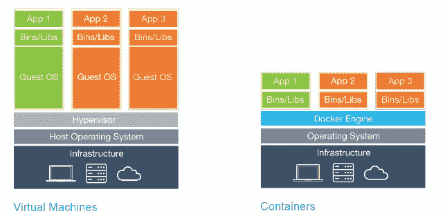
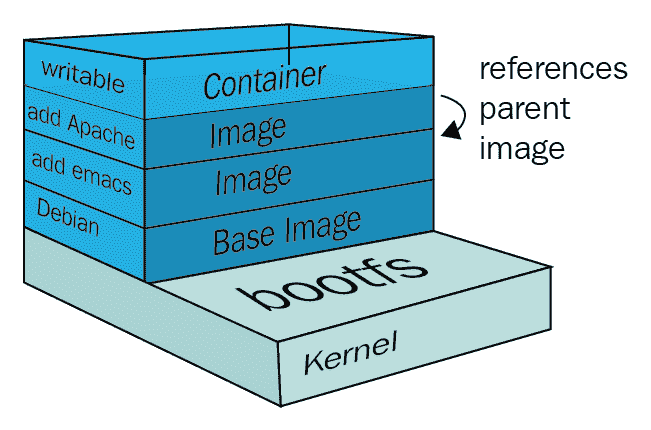
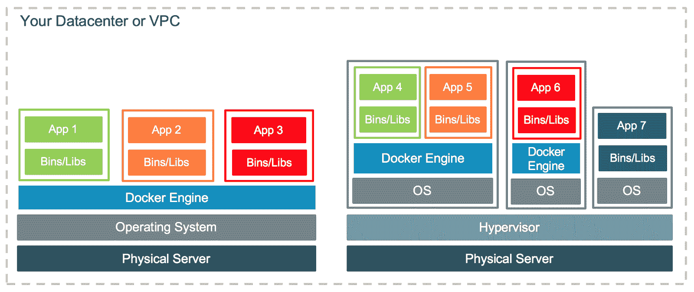
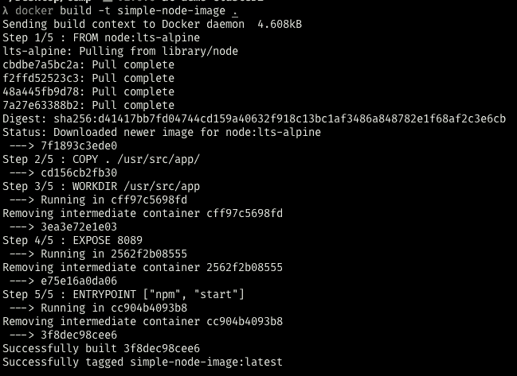
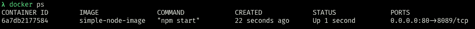
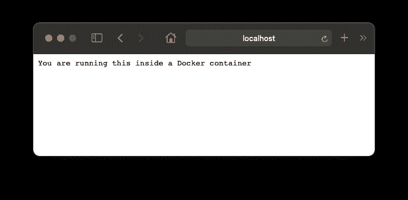

# Docker 是做什么用的？面向初学者的 Docker 容器教程

> 原文：<https://www.freecodecamp.org/news/what-is-docker-used-for-a-docker-container-tutorial-for-beginners/>

作为一名开发人员，您可能在职业生涯中的某个时候听说过 Docker。您可能意识到它已经成为任何应用程序开发人员都应该了解的重要技术。

如果你不知道我在说什么，不要担心——这就是这篇文章的目的。

我们将踏上一段旅程，探索这个人人都在谈论的 Docker 是什么，以及你可以用它做什么。最后，我们还将创建、发布和运行我们的第一个 Docker 映像。

但首先，让我们为我们的故事打下基础。我将使用 Rani Osnat 的这篇[精彩文章](https://blog.aquasec.com/a-brief-history-of-containers-from-1970s-chroot-to-docker-2016)，这篇文章更深入地解释了容器的整个历史。我会在这里总结一下，这样我们就可以专注于重要的部分。

## 一点点容器的历史

Docker 是一个容器运行时。很多人认为 Docker 是同类产品中的第一个，但这是不正确的——Linux 容器从 20 世纪 70 年代就已经存在了。

Docker 对开发社区和容器社区都很重要，因为它使得使用容器变得如此简单，以至于每个人都开始使用它。

### 什么是容器？

容器，或 Linux 容器，是一种技术，它允许我们隔离某些内核进程，并欺骗它们认为它们是运行在全新计算机中的唯一进程。

与虚拟机不同，容器可以共享操作系统的内核，同时只加载不同的二进制文件/库。

换句话说，您不需要在您的主机操作系统中安装完全不同的操作系统(称为**客户操作系统**)。您可以在一个操作系统中运行多个容器，而无需安装多个不同的客户操作系统。



Difference between Virtual Machines and Docker Containers (Source: Docker)

这使得容器更小、更快、更高效。虽然一个虚拟机可能需要大约一分钟的时间来启动，并可能重达数千兆字节，但一个容器的平均重量为 400 到 600mb(最大的)。

它们也只需要几秒钟就能旋转起来。这主要是因为他们在运行该进程之前不必旋转整个操作系统。

这一切都始于六个字。

### 容器的开始

容器的历史始于 1979 年的 Unix v7。那时候我还没出生，父亲 15 岁。集装箱在 1979 年就已经存在了吗？不要！

1979 年，Unix 版本 7 引入了一个名为 [chroot](https://en.wikipedia.org/wiki/Chroot) 的系统调用，这是我们今天所知的**进程** **虚拟化**的开端。

`chroot`调用允许内核改变进程及其子进程的根目录。

简而言之，该进程认为它是在机器中单独运行的，因为它的文件系统与所有其他进程是隔离的。同样的系统调用在 1982 年被引入 BSD。但是直到二十年后，我们才第一次广泛应用它。

2000 年，一家托管服务提供商在寻找更好的方法来管理他们客户的网站，因为他们都安装在同一台机器上，并争夺相同的资源。

这个解决方案被称为`jails`，它是第一次真正尝试在流程级别隔离东西。Jails 允许任何 FreeBSD 用户将系统划分成几个独立的更小的系统(称为`jails`)。每个监狱可以有自己的 IP 配置和系统配置。

Jails 是第一个扩展`chroot`用途的解决方案，不仅允许文件系统级的隔离，还允许虚拟化用户、网络、子系统等等。

2008 年，LXC(**L**inu**X**Containers)上市。在当时，这是第一个也是最完整的容器管理系统的实现。它使用了控件组、名称空间以及在此之前构建的许多东西。最大的进步是它直接从 Unix 内核使用，不需要任何补丁。

## 码头工人

最后，在 2010 年，Solomon Hykes 和 Sebastien Pahl 在 Y Combinator 创业孵化器集团期间创建了 Docker。2011 年，该平台启动。

最初，Hykes 在法国启动了 Docker 项目，作为 2016 年关闭的 PaaS 公司 dotCloud 内部项目的一部分。

Docker 在当时并没有给容器运行时增加多少——Docker 对容器生态系统最大的贡献是**意识**。其易于使用的 CLI 和概念使普通开发人员可以使用容器，而不仅仅是出于某种原因需要容器的深度黑客公司。

2013 年后，几家公司开始采用 Docker 作为默认的容器运行时，因为它在全球范围内标准化了容器的使用。2013 年，红帽宣布与 Docker 合作，2014 年是时候与微软、AWS、Stratoscale 和 IBM 合作了。

2016 年，发布了针对不同于 Linux 的操作系统的第一个 Docker 版本。Windocks 发布了 Docker 的 OSS 项目的一个端口，旨在运行在 Windows 上。同年年底，[微软](https://azure.microsoft.com/blog/microsoft-and-docker-collaborate-on-new-ways-to-deploy-containers-on-azure/?WT.mc_id=containers-11424-ludossan)宣布 Docker 现在通过 [Hyper-V](https://docs.microsoft.com/virtualization/hyper-v-on-windows/about/?WT.mc_id=containers-11424-ludossan) 在 [Windows](https://azure.microsoft.com/blog/microsoft-and-docker-collaborate-on-new-ways-to-deploy-containers-on-azure/?WT.mc_id=containers-11424-ludossan) 上得到原生支持。

> 2019 年，微软公布了 [WSL2](https://docs.microsoft.com/windows/wsl/install-win10?WT.mc_id=containers-11424-ludossan) ，使得 Docker 无需在 [Hyper-V](https://docs.microsoft.com/virtualization/hyper-v-on-windows/about/?WT.mc_id=containers-11424-ludossan) 上运行虚拟机就可以在 Windows 上运行。Docker 现在是本机多平台的，同时仍然利用 Linux 的容器方法。

最后，在 2020 年，Docker 成为集装箱的全球选择。这并不一定是因为它比其他的更好，而是因为它将所有的实现统一在一个简单易用的平台上，有一个 CLI 和一个守护进程。它使用我们将在下一节探讨的简单概念完成所有这些工作。

## Docker 是如何工作的？

Docker 将一个应用程序及其所有依赖项打包在一个虚拟容器中，该容器可以在任何 Linux 服务器上运行。这就是我们称之为容器的原因。因为它们在一个软件中包含了所有必要的依赖关系。

Docker 由以下元素组成:

*   一个守护进程，用于构建、运行和管理容器
*   允许用户与守护程序通信的高级 API，
*   还有一个 CLI，我们用来实现这一切的界面。

### 码头集装箱

容器是应用层的抽象。他们将所有的代码、库和依赖项打包在一起。这使得多个容器可以在同一个主机上运行，因此您可以更有效地使用该主机的资源。

每个容器在用户空间中作为一个独立的进程运行，由于其分层架构，占用的空间比常规虚拟机少。

这些层被称为**中间图像**，每次在`Dockerfile`中运行新命令时都会创建这些图像，例如，如果您有一个 docker 文件，如下所示:

```
FROM node:stable

COPY . /usr/src/app

WORKDIR /usr/src/app

RUN npm install grpc

RUN npm install

ENTRYPOINT ["npm", "start"] 
```

在每个像`COPY`或`RUN`这样的命令下，你将在你的容器图像上创建另一层。这允许 Docker 将每个命令拆分和分离成单独的部分。因此，如果你最终再次使用这个`node:stable`图像，它将不需要拉它的所有层，因为你已经安装了这个图像。

此外，所有层都经过哈希处理，这意味着 Docker 可以缓存这些层，并为那些在构建中没有变化的层优化构建时间。如果复制步骤没有改变，您不需要重新构建和重新复制所有文件，这大大减少了构建过程所花费的时间。

在构建过程的最后，Docker 在所有层之上创建了一个新的空层，称为**瘦可写层。**该层是您使用`docker exec -it <container> <command>`时访问的层。这样，您可以在图像中执行交互式更改，并使用`docker commit`提交这些更改，就像您处理 Git 跟踪的文件一样。

由于 AuFS 文件系统，这种散列分层体系结构是可能的。这是一个分层的文件系统，允许文件和目录一层一层地堆叠。

auf 在处理 DnD (Docker 中的 Docker)时会带来一些问题，但这是另一篇文章的主题！你可以在本文中查看更深入的解释。


可以在不同版本之间对层进行散列区分。这样 Docker 就可以在构建映像时检查一个层是否发生了变化，并决定是否重建它，从而节省了大量时间。

所以，如果你已经在你的电脑上下载了 Ubuntu 映像，并且你正在构建一个依赖于该映像的一个或多个层的新映像，Docker 将不会再次构建它们。它只会重复使用相同的图层。



(source: Packt) Docker layers explained

如果你想更深入地挖掘层，这篇文章给出了很多关于如何找到、列出和管理它们的细节。

### 为什么码头集装箱是伟大的

你可能听说过标志性的短语“它在我的机器上工作”。那么，我们为什么不把那台机器给顾客呢？

这正是 Docker 和 containers 通常要解决的问题。Docker 容器是所有应用程序的库和依赖项的打包集合，这些库和依赖项已经预先构建好，可以随时执行。

许多公司已经从虚拟机迁移到容器，不仅仅是因为它们更轻、运行更快，还因为它们非常容易维护。

单个容器可以使用它的`Dockerfile`进行版本控制(我们将在下一节讨论图像)，因此对于一个开发人员(或者甚至一个小型开发团队)来说，运行和维护整个容器生态系统是非常容易的。另一方面，您需要一名基础架构人员来运行和管理虚拟机。



(source: Docker) Your Datacenter with VMs and containers

这是否意味着我们不再需要虚拟机了？不，相反，如果您希望为每个客户提供一个完整的操作系统，或者只是需要整个环境作为沙箱，那么仍然非常需要虚拟机。当您有一个大型服务器机架和几个将使用它的客户时，虚拟机通常用作中间层。

易用性和可维护性让我们明白了为什么容器如此重要的另一个重要方面:对于一个公司来说，使用容器比使用成熟的虚拟机要便宜得多。

这不是因为基础设施或硬件更便宜，而是因为你需要更少的人来管理容器，这意味着你可以更好地组织你的团队专注于产品，而不是专注于管理。

仍然与节约有关，单个中型虚拟机可以运行大约 3 到 8 个容器。这取决于容器使用了多少资源，以及在运行整个应用程序之前需要引导多少底层操作系统。

有些语言，比如 Go，只允许你用编译好的二进制文件构建一个映像。这意味着 Docker 容器需要加载的内容更少，因此使用的资源也更少。通过这种方式，您可以在每个虚拟机上运行更多的容器，并更有效地使用您的硬件。

由于容器是短暂的，这意味着当容器被删除时，容器中的所有数据都会丢失。这很好，因为我们可以将容器用于像 CI 这样的突发任务。

容器的使用带来了 DevOps 发展的全新水平。现在，您可以简单地旋转许多容器，每个容器执行部署管道中的一小步，然后直接杀死它们，而不用担心是否有遗漏。

容器的无状态特性使它们成为快速工作负载的完美工具。

现在我们已经看到了容器是多么的棒，让我们来理解如何构建一个容器！

## 什么是 Docker 图像？

Docker 图像是写在一个叫做`Dockerfile`的特殊文件中的指令。它有自己的语法，并定义了 Docker 将采取什么步骤来构建您的容器。

由于容器只是一层又一层的变化，您在 Docker 映像中创建的每个新命令都会在容器中创建一个新层。

最后一层是我们称之为**的可写薄层**。一个可由用户更改并使用`docker commit`命令提交的空层。

这是 Node.js 应用程序的一个简单图像示例:

```
FROM node:stable
COPY . /usr/src/app/
RUN npm install && npm run build
EXPOSE 3000
ENTRYPOINT ["npm", "start"]
```

在这个简单的例子中，我们正在创建一个新的图像。所有的图片都是基于一个现有的图片，或者一个临时的图片(我在我的博客文章中用葡萄牙语解释过，这里的，这里的，这里的)。

这些图像是从**容器注册处**下载的，该注册处用于存储容器的图像。其中最常见的是 [Docker Hub](https://hub.docker.com/) ，但是你也可以使用云解决方案创建一个私有的，比如 [Azure Container Registry](https://azure.microsoft.com/services/container-registry/?WT.mc_id=containers-11424-ludossan) 。

当您在 Docker 文件所在的目录下运行`docker build .`时，Docker 守护进程将开始构建映像并打包，以便您可以使用它。然后你可以运行`docker run <image-name>`来启动一个新的容器。

注意，我们在 Dockerfile 文件中公开了某些端口。Docker 允许我们在自己的操作系统中分离网络，这意味着您可以将端口从您的计算机映射到容器，反之亦然。此外，您可以使用`docker exec`在容器内执行命令。

让我们把这些知识付诸实践。

## 如何部署您的 Dockerized 应用程序

这将是一个关于如何使用 Node.js 服务器创建一个基本 Docker 映像并使其在您的计算机上运行的简单而容易的演练。

首先，在您选择的目录中启动一个新项目，并运行`npm init -y`来创建一个新的`package.json`文件。现在让我们创建另一个名为`src`的目录。在这个目录中，我们将创建一个名为`server.js`的新文件。

现在，在你的`package.json`文件中，将`main`键改为`src/server.js`。此外，删除已创建的`test`脚本，并替换为`"start": "node src/server.js"`。您的文件应该是这样的:

```
{
  "name": "your-project",
  "version": "1.0.0",
  "description": "",
  "main": "src/server.js",
  "scripts": {
    "start": "node src/server.js"
  },
  "keywords": [],
  "author": "",
  "license": "ISC"
} 
```

现在，创建一个名为`Dockerfile`(没有扩展名)的文件。让我们写下我们的形象！

```
FROM node:lts-alpine
COPY . /usr/src/app/
WORKDIR /usr/src/app
EXPOSE 8089
ENTRYPOINT ["npm", "start"]
```

我们来解释一下:

1.  首先，我们从 Docker Hub 获取节点映像。因为图像是按名称保存的，所以我们用标签来区分图像。你可以在这里查看所有标签[。](https://hub.docker.com/_/node)
2.  接下来，我们使用`COPY`将当前目录中的所有文件(使用`.`)复制到名为`/usr/src/app`的容器中的一个新目录中。目录是自动创建的。这是必要的，因为我们需要所有的应用程序文件在那里。
3.  现在我们将开始目录改为`/usr/src/app`目录，这样我们就可以从应用程序的根目录运行程序了。
4.  我们暴露我们的港口，
5.  我们说，一旦我们的容器运行，我们将执行“npm start”。

让我们通过运行`docker build . -t simple-node-image`来构建映像。这样，我们将标记我们的图像，并给它一个名称。



你会看到它将创建和下载图像，以及所有必要的层。让我们用下面的命令运行这个映像:

```
docker run -p 80:8089 simple-node-image 
```

我们将我们的端口`80`映射到容器内的端口`8089`。我们可以这样输入`docker ps`来检查一下:



现在尝试访问`localhost:80`，看看会发生什么:



## Docker 是做什么用的？

既然我们已经看到了如何构建 Docker 容器，那么让我们来看看 Docker 的一些实际用途，以及如何充分利用它。

### 短暂数据库

您是否尝试过开发需要数据库才能运行的应用程序？或者更糟，试图运行别人的应用程序，而这个应用程序需要一个您没有安装的数据库？

旧的解决方案是先安装数据库，然后运行应用程序。有了 Docker，你只需要运行数据库容器。让我们运行一个简单的 MongoDB 容器:

```
$ docker run -p 27017:27017 --name my-ephemeral-db mongo 
```

就是这样！现在，您可以通过端口 27017 从您的计算机访问您的数据库，就像您通常所做的那样。

### 持久数据库

前一个例子的问题是，如果您删除容器，您的所有数据都将丢失。那么，如果您想运行一个本地数据库而不需要安装它，但是在删除它之后保留数据，会发生什么呢？您可以将 Docker 绑定到一个卷上！

当您将 Docker 绑定到本地卷时，您实际上是将文件系统挂载到容器中，反之亦然。让我们看看:

```
$ docker run -p 27017:27017 -v /home/my/path/to/db:/data/db --name my-persistent-db mongo 
```

在这个命令中，我们将`/data/db`装载到`/home/my/path/to/db`中。现在，如果我们使用`docker stop my-persistent-db`和`docker rm my-persistent-db`，我们所有的数据将继续存储在那里。

以后，如果我们再次需要这个数据库，我们可以使用相同的命令挂载它，所有的数据都会恢复。

### 一次性工具

所有开发人员都做的另一件事是:我们安装只使用一次的应用程序。例如，访问旧数据库简单 CLI，或者访问某些 CI 服务器的简单 GUI。

许多工具已经有 Docker 容器，你可以像这样使用它们，所以你不必在你的笔记本上再安装一个工具。

最好的例子是 Redis。它将`redis-cli`构建在另一个容器中，所以如果您很少使用它，就不需要在您的 shell 中安装`redis-cli`。

让我们想象一下，您使用绑定到本地主机接口的`docker run -d --name redis redis --bind 127.0.0.1`构建一个 Redis 实例。您可以使用以下命令通过另一个容器访问它:

```
$ docker run --rm -it --network container:redis redis-cli -h 127.0.0.1 
```

`--rm`标志告诉 Docker，一旦容器停止，它就应该删除容器，而`-it`标志告诉它，我们需要一个交互式会话(使用 shell ),并且我们需要一个 TTY。

### 运行整个堆栈

如果你需要测试一个依赖于另一个应用的应用，你会怎么做？Docker 通过提供`docker-compose`使之变得简单。这是您工具箱中的另一个工具，它允许您编写一个描述您的环境的`docker-compose.yml`文件。

该文件如下所示:

```
version: "3.8"
services:
  web:
    build: .
    ports:
      - "5000:5000"

  redis:
    image: "redis:alpine"
    ports:
      - "6379:6379" 
```

如你所见，我们定义了两个服务，一个叫做`web`，在`web.build`路径上运行`docker build`。那是一只`Dockerfile`。

之后，它在主机和容器中公开端口`5000`。另一个服务是`redis`，它在端口`6379`上拉取并运行`redis`映像。

最好的部分是网络层是共享的，换句话说，你可以通过简单地输入`redis`和端口从`web`服务访问`redis`。

您可以用一个简单的`docker-compose up`来启动这个文件，看看奇迹发生了。

## 结论

就是这样！这是 Docker 的历史，它是如何产生的，以及它是如何工作的 3000 字。我希望你喜欢它，我也希望这能让你在 Docker 的发展更容易一些。

正如您所看到的，Docker 的大多数用途是让开发人员在开发应用程序时更加轻松。但是还有许多其他的用途，比如基础设施层和使你的应用程序的管理更加容易。

如果你想联系我，只需在我的网站上点击我的社交网络。

*封面照片由[格奥尔格·沃尔夫](https://unsplash.com/@georgewolf?utm_source=unsplash&utm_medium=referral&utm_content=creditCopyText)在[Unsplash](https://unsplash.com/s/photos/whale?utm_source=unsplash&utm_medium=referral&utm_content=creditCopyText)T5 拍摄*