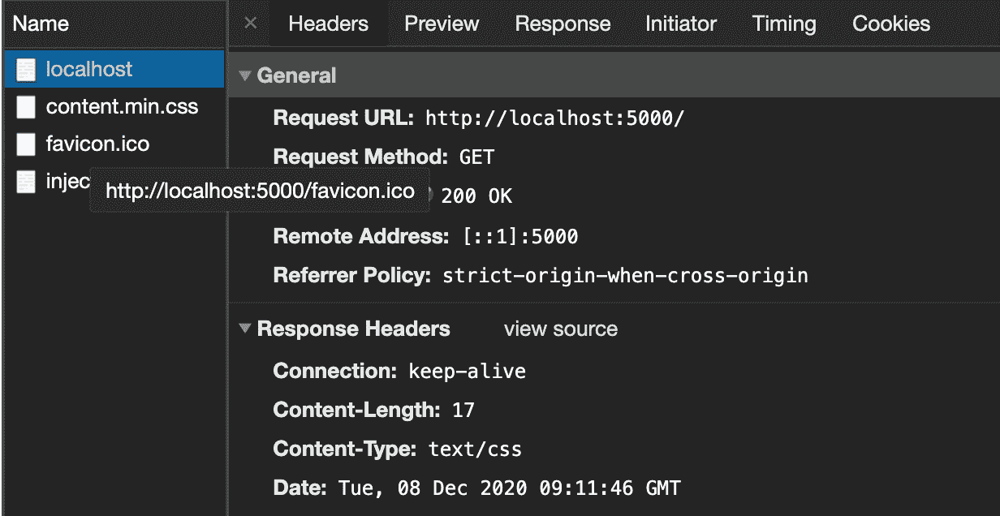

# JSON 的正确内容类型是什么？请求标头 Mime 类型已解释

> 原文：<https://www.freecodecamp.org/news/what-is-the-correct-content-type-for-json-request-header-mime-type-explained/>

互联网上使用的每种资源都有一种媒体类型，也称为 MIME 类型，代表多用途互联网邮件扩展。这些信息对于服务器和客户端之间的事务是必需的。

浏览器需要知道发送给它的资源的媒体类型，以便它能够正确地处理它们。

服务器也是如此。它需要知道发送给它的资源的类型，以便进行准确的解析和处理。

## 内容类型在哪里声明？

任何资源的媒体类型都在请求头的`Content-Type`属性中声明(在客户端，当向服务器发出请求时)或在响应头中声明(在服务器上，当发送响应时)。

如果没有显式声明资源的内容类型，客户端可能会尝试自动检测类型，但结果可能不准确。这就是为什么显式声明它很重要。

## 媒体类型

媒体类型以各种形式存在。它们被分为不同的组:

*   应用
*   声音的
*   字体
*   例子
*   图像
*   消息
*   模型
*   几部分的
*   文本
*   和视频

这些类别也有它们的类型。例如，`application/json`是`application`下的类型，`text/html`是`text`下的类型。

你可以在 IANA 媒体类型中找到媒体类型的完整列表。

所有这些类型涵盖了各种数据类型，如文本、音频、图像、HTML 以及互联网上使用的更多类型。

## 浏览器需要知道资源的媒体类型

正如我上面提到的，浏览器需要知道它接收的是什么类型的内容。这里有一个例子来说明。

以下代码是一个为 HTML 文件提供服务的节点服务器:

```
const http = require("http");
const fs = require("fs");
const path = require("path");

const server = http.createServer(function (req, res) {
	const filePath = path.join(__dirname, "index.html");
	var stat = fs.statSync(filePath);

	res.writeHead(200, {
		"Content-Type": "text/css",
		"Content-Length": stat.size,
	});

	const readStream = fs.createReadStream(filePath);
	readStream.pipe(res);
});

server.listen(5000);

console.log("Node.js web server at port 5000 is running.."); 
```

不要担心代码的细节。你所关心的是我们提供的`index.htm`文件，而`Content-Type`是`text/css`。

下面是`index.html`的内容:

```
<h1>Homepage</h1> 
```

当然，HTML 文档不同于 CSS 文件。下面是服务器启动时在`localhost:5000`上的结果:


您还可以通过检查 DevTools 的 network 选项卡中的标题来确认得到的响应。

这是 Chrome 浏览器上的结果:



浏览器以 CSS 类型获取内容，因此，它尝试将其视为 CSS。

此外，请注意，全面了解浏览器获取的内容类型也可以减少安全漏洞，因为浏览器知道为这些数据设置的安全标准。

现在您已经理解了 MIME 类型的概念及其重要性，让我们来看看 JSON。

## JSON 的正确内容类型

浏览器必须正确地解释 JSON，才能正确地使用它。`text/plain`通常用于 JSON，但是根据 [IANA](https://www.iana.org/assignments/media-types/media-types.xhtml) 的说法，JSON 的官方 MIME 类型是`application/json`。

这意味着当你向服务器发送 JSON 或从服务器接收 JSON 时，你应该总是将头的`Content-Type`声明为`application/json`，因为这是客户机和服务器理解的标准。

## 结论

如上所述，服务器(就像浏览器一样)需要知道发送给它的数据的类型，比如在 POST 请求中。这就是文件的`forms`通常包含值为`multipart/form-data`的`enctype`属性的原因。

如果不以这种方式对请求进行编码，POST 请求将无法工作。此外，一旦服务器知道了它获得的数据类型，它就知道如何解析编码的数据。

在本文中，我们研究了什么是 MIME 类型以及它们的用途。此外，我们还研究了 JSON 的官方内容类型。我希望您现在知道了在互联网上使用时声明资源类型的重要性。