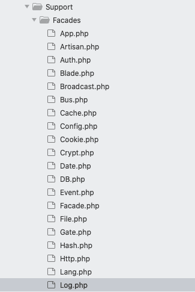
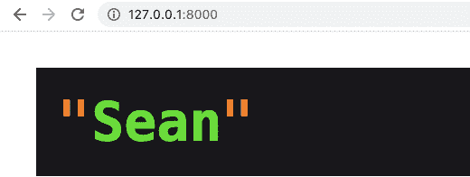

# 如何在 Laravel 中使用立面

> 原文：<https://www.freecodecamp.org/news/how-to-use-facades-in-laravel/>

在学习 Laravel 的时候，立面是你应该了解的一个关键的东西。

我花了相当多的时间来弄清楚立面是如何工作的，我写这篇文章是为了帮助那些在理解这个概念上有困难的人。

在这篇文章中，我们将介绍什么是立面，它们在 Laravel 中是如何使用的，如何构建自己的简单立面，等等。

## 什么是门面？什么是包装？

Laravel 中的 facade 是一个非静态函数的包装器，它将非静态函数转化为静态函数。

在描述设计模式时，也可以使用“包装器”这个词。包装一个对象以提供一个简化的接口通常被称为“外观”模式。

所以简而言之，[包装](https://en.wikipedia.org/wiki/Wrapper_function) 就是门面。

在深入研究外观之前，理解 PHP 中的静态和非静态函数是很重要的。

### 静态方法

在静态方法中，我们不需要创建一个类的实例来引用它。静态方法在访问类的属性或方法时使用双冒号(::):

```
<?php
class Calc {
    const GOLDEN_RATIO = '1.618';
}

echo Calc::GOLDEN_RATIO;  //1.618 
```

保留关键字如`self`、`static`和`parents`用于引用类中的属性或方法:

```
<?php
class backend {
	private const language = "php";
	public static function language() {
    	echo self::language;
  	}
}

backend::language();  //php 
```

### 非静态方法

非静态方法要求给定的类被实例化。换句话说，它们需要类别的执行个体来执行:

```
<?php
class backend{

	public function language($name){

		echo $name;
	}

}

$test = new backend; //creating an instance of the class

$test->language('php'); //php
```

现在我们已经讨论了静态和非静态方法，我们可以更深入地研究 Laravel 中的外观。

## 拉勒维尔立面

在`vendors > laravel  > framework > src > illuminate > support > Facades`目录中，有一个默认情况下 Laravel 附带的各种外观的文件列表。

下面是我们的编辑器中目录结构的截图:



让我们使用`Log.php`中的工作代码来更详细地检查外观——同样的解释应该适用于任何 Laravel 应用程序中的所有外观。

### 拉勒维尔的原木立面

以下是 Laravel 的`Log`门面代码:

```
<?php

namespace Illuminate\Support\Facades;

class Log extends Facade
{
    /**
     * Get the registered name of the component.
     *
     * @return string
     */
    protected static function getFacadeAccessor()
    {
        return 'log';
    }
} 
```

`Log`是一个类，它扩展了上面命名空间中的基本外观。

在`Log`类中，我们有一个受保护的访问修饰符`getFacadeAccessor`，这个方法的作用是返回`log`。

这个 facade 的名称`log`被返回，因此我们可以在 Laravel 应用程序中的任何地方访问这个命名的 facade，而无需初始化它。所以我们可以在任何地方很容易地做类似于`Log::info('hello there');`的事情。

正如你所看到的，外观使代码更容易阅读，更有条理，并使测试容易 10 倍。

自从从我的一个同事那里了解到`Log`之后，它就成了我最喜欢的调试工具。

## 如何在 Laravel 创建一个门面

在这一节中，我们将实现我们自己的外观。这里的主要目的是帮助学员理解 Laravel 立面的工作原理。

我们将通过创建一个 StudentFacade 来实现这一点，该 student Facade 将从一个基本 Facade 扩展属性，该基本 Facade 在被解析后返回一个 name 属性。这个 name 属性的类型为 string，每次我们实例化该类时都会返回它，如下所示:



好奇我们将如何实现这一点？跟着我走，我会带你走过这些步骤。

我们不会使用普通的 Laravel 约定来创建我们的 facade，在这里，我们在`app > facade`中有一个`.php file`，然后在`providers`中有另一个，最后我们在`config > app`中注册它。

相反，我们将在本图中使用`routes`中的`web.php`,因为我们只是想看看在典型的 Laravel 应用程序中外观是如何工作的。

首先，我们从`web.php`中的这个开始:

```
<?php 
class Student{
    public function students(){
        return 'Sean';
    }
}

 app()->bind('student', function(){
 	return new Student;   
 }); 
```

我们已经创建了一个类`Student`，在它里面我们有一个非静态的`students`方法，返回一个学生数组。

然后我们调用*绑定*方法，让它总是实例化`new Student`，这样我们就不再需要手动这么做了。

接下来，让我们在同一个`web.php`中创建一个基本的`Facade`类:

```
 class Facade{
    public static function __callStatic($name, $args){
        return app()->make(static::getFacadeAccessor())->$name();
    }

    protected static function getFacadeAccessor(){
        //override take place 
    }
}
```

我们以后可能创建的任何外观都将扩展这个基础外观的属性。

在`Facade`类中，我们有一个`__callStatic` [魔法方法](https://www.php.net/manual/en/language.oop5.magic.php)，帮助我们用`app()->make()`从容器中解析出`static::getFacadeAccessor()`。有了这些我们就能进入`$name`的财产。

```
class StudentFacade extends Facade {
	protected static function getFacadeAccessor(){
    	return 'student';
    }
}
```

这里，`StudentFacade`继承了基础 facade 的属性。然后我们覆盖`getFacadeAccessor()`并将返回值设置为每次我们在`student`上面的绑定中实例化时的值。

```
StudentFacade::students(); //output "Sean"
```

当我们试图调用我们创建的 facade 时，它会像预期的那样返回“Sean”。现在，在最后一步，我们必须将所有这些步骤整合在一起:

```
<?php

class Student{
    public function students(){
        return 'Sean';
    }
}

 app()->bind('student', function(){
    return new Student;   
 }); 

 class Facade{
    public static function __callStatic($name, $args){
        return app()->make(static::getFacadeAccessor())->$name();
    }

    protected static function getFacadeAccessor(){
        //override take place 
    }
}

class StudentFacade extends Facade {
    protected static function getFacadeAccessor(){
        return 'student';
    }
}

//log or die it to the output
dd(StudentFacade::students());
```


## 结论

我希望在这一课结束时，你已经能够拓宽你对外墙工作的知识。如果您有问题或希望继续对话，请随时发微博给我。

### 参考

[Laravel 初学者教程](https://www.youtube.com/watch?v=zD2VJhOdI5c)-bitfuses

[什么是编程中的包装器，它有什么帮助？](https://stackoverflow.com/questions/3293752/where-and-how-is-the-term-used-wrapper-in-programming-what-does-it-help-to-do) - Stackoverflow