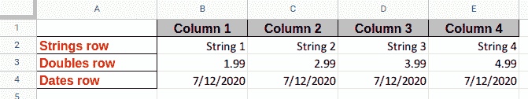
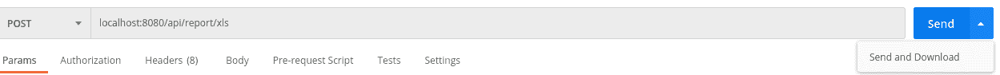
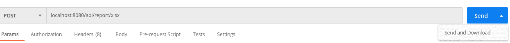

# 如何使用 Apache POI 和 Kotlin 在 Spring Boot REST API 中生成 Excel 报表

> 原文：<https://www.freecodecamp.org/news/generate-excel-report-in-spring-rest-api/>

在本文中，我将向您展示如何在**中生成 Excel 报表。xls** 和**。xlsx** 格式(也称为开放 XML)在一个 **Spring Boot REST API** 中，带有 **Apache POI 和 Kotlin** 。

完成本指南后，您将对如何创建自定义单元格格式、样式和字体有一个基本的了解。最后，我将向您展示如何创建 Spring Boot REST 端点，以便您可以轻松下载生成的文件。

为了更好地可视化我们将要学习的内容，请查看结果文件的预览:



## 步骤 1:添加必要的导入

作为第一步，让我们创建一个 Spring Boot 项目(我强烈推荐使用 [Spring Initializr](https://start.spring.io/) 页面)并添加以下导入:

```
implementation("org.springframework.boot:spring-boot-starter-web")
implementation("org.apache.poi:poi:4.1.2")
implementation("org.apache.poi:poi-ooxml:4.1.2")
```

让我解释一下每个库的用途:

*   在我们的应用程序中创建 REST API 时， **Spring Boot 启动 Web** 是必需的。
*   Apache POI 是一个复杂的 Java 库，用于处理 Excel 文件。如果愿意，只能与 **合作。xls** 格式，那么 *poi* 导入就足够了。在我们的例子中，我们想添加对**的支持。xlsx** 格式，所以 *poi-ooxml* 组件也是必要的。

## 步骤 2:创建模型

下一步，让我们用 4 个常量创建一个名为 **CustomCellStyle** 的枚举类:

```
enum class CustomCellStyle {
    GREY_CENTERED_BOLD_ARIAL_WITH_BORDER,
    RIGHT_ALIGNED,
    RED_BOLD_ARIAL_WITH_BORDER,
    RIGHT_ALIGNED_DATE_FORMAT
}
```

虽然这个 enum 类的目的目前看起来有点神秘，但在接下来的部分中，它将变得很清楚。

## 步骤 3:准备单元格样式

Apache POI 库附带了 **CellStyle** 接口，我们可以用它来定义行、列和单元格中的定制样式和格式。

让我们创建一个 **StylesGenerator** 组件，它将负责准备一个包含我们自定义样式的地图:

```
@Component
class StylesGenerator {

    fun prepareStyles(wb: Workbook): Map<CustomCellStyle, CellStyle> {
        val boldArial = createBoldArialFont(wb)
        val redBoldArial = createRedBoldArialFont(wb)

        val rightAlignedStyle = createRightAlignedStyle(wb)
        val greyCenteredBoldArialWithBorderStyle =
            createGreyCenteredBoldArialWithBorderStyle(wb, boldArial)
        val redBoldArialWithBorderStyle =
            createRedBoldArialWithBorderStyle(wb, redBoldArial)
        val rightAlignedDateFormatStyle =
            createRightAlignedDateFormatStyle(wb)

        return mapOf(
            CustomCellStyle.RIGHT_ALIGNED to rightAlignedStyle,
            CustomCellStyle.GREY_CENTERED_BOLD_ARIAL_WITH_BORDER to greyCenteredBoldArialWithBorderStyle,
            CustomCellStyle.RED_BOLD_ARIAL_WITH_BORDER to redBoldArialWithBorderStyle,
            CustomCellStyle.RIGHT_ALIGNED_DATE_FORMAT to rightAlignedDateFormatStyle
        )
    }
}
```

正如您所看到的，使用这种方法，我们一次创建一个样式，并把它放在一个地图中，以便我们以后能够引用它。

这里有很多我们可以使用的设计技术，但是我相信使用 map 和 enum 常量是保持代码更干净和更容易修改的最好方法之一。

话虽如此，让我们在生成器类中添加一些缺失的函数。让我们先从自定义字体开始:

```
private fun createBoldArialFont(wb: Workbook): Font {
    val font = wb.createFont()
    font.fontName = "Arial"
    font.bold = true
    return font
}
```

**createBoldArialFont** 函数创建一个新的粗体 Arial 字体实例，我们将在后面使用。

类似地，让我们实现一个 **createRedBoldArialFont** 函数，并将字体颜色设置为红色:

```
private fun createRedBoldArialFont(wb: Workbook): Font {
    val font = wb.createFont()
    font.fontName = "Arial"
    font.bold = true
    font.color = IndexedColors.RED.index
    return font
}
```

之后，我们可以添加负责创建单个 **CellStyle** 实例的其他函数:

```
private fun createRightAlignedStyle(wb: Workbook): CellStyle {
    val style: CellStyle = wb.createCellStyle()
    style.alignment = HorizontalAlignment.RIGHT
    return style
}

private fun createBorderedStyle(wb: Workbook): CellStyle {
    val thin = BorderStyle.THIN
    val black = IndexedColors.BLACK.getIndex()
    val style = wb.createCellStyle()
    style.borderRight = thin
    style.rightBorderColor = black
    style.borderBottom = thin
    style.bottomBorderColor = black
    style.borderLeft = thin
    style.leftBorderColor = black
    style.borderTop = thin
    style.topBorderColor = black
    return style
}

private fun createGreyCenteredBoldArialWithBorderStyle(wb: Workbook, boldArial: Font): CellStyle {
    val style = createBorderedStyle(wb)
    style.alignment = HorizontalAlignment.CENTER
    style.setFont(boldArial)
    style.fillForegroundColor = IndexedColors.GREY_25_PERCENT.getIndex();
    style.fillPattern = FillPatternType.SOLID_FOREGROUND;
    return style
}

private fun createRedBoldArialWithBorderStyle(wb: Workbook, redBoldArial: Font): CellStyle {
    val style = createBorderedStyle(wb)
    style.setFont(redBoldArial)
    return style
}

private fun createRightAlignedDateFormatStyle(wb: Workbook): CellStyle {
    val style = wb.createCellStyle()
    style.alignment = HorizontalAlignment.RIGHT
    style.dataFormat = 14
    return style
}
```

请记住，上面的例子只代表了 **CellStyle 的**种可能性的一小部分。如果你想看到完整的名单，请参考官方文件[这里](https://poi.apache.org/apidocs/dev/org/apache/poi/ss/usermodel/CellStyle.html)。

## **步骤 4:创建 ReportService 类**

下一步，让我们实现一个负责创建 **的 **ReportService** 类。xlsx** 和**。xls** 文件并将它们作为 ByteArray 实例返回:

```
@Service
class ReportService(
    private val stylesGenerator: StylesGenerator
) {
    fun generateXlsxReport(): ByteArray {
        val wb = XSSFWorkbook()

        return generateReport(wb)
    }

    fun generateXlsReport(): ByteArray {
        val wb = HSSFWorkbook()

        return generateReport(wb)
    }
 } 
```

如您所见，这两种格式生成之间的唯一区别是我们已经实现的**工作簿**的类型。二手的。*为**为*。xlsx 格式我们将使用 **XSSFWorkbook** 类，而对于。xls 我们将使用 **HSSFWorkbook** *。*

让我们将剩余的代码添加到 **ReportService** 中:

```
private fun generateReport(wb: Workbook): ByteArray {
    val styles = stylesGenerator.prepareStyles(wb)
    val sheet: Sheet = wb.createSheet("Example sheet name")

    setColumnsWidth(sheet)

    createHeaderRow(sheet, styles)
    createStringsRow(sheet, styles)
    createDoublesRow(sheet, styles)
    createDatesRow(sheet, styles)

    val out = ByteArrayOutputStream()
    wb.write(out)

    out.close()
    wb.close()

    return out.toByteArray()
}

private fun setColumnsWidth(sheet: Sheet) {
    sheet.setColumnWidth(0, 256 * 20)

    for (columnIndex in 1 until 5) {
        sheet.setColumnWidth(columnIndex, 256 * 15)
    }
}

private fun createHeaderRow(sheet: Sheet, styles: Map<CustomCellStyle, CellStyle>) {
    val row = sheet.createRow(0)

    for (columnNumber in 1 until 5) {
        val cell = row.createCell(columnNumber)

        cell.setCellValue("Column $columnNumber")
        cell.cellStyle = styles[CustomCellStyle.GREY_CENTERED_BOLD_ARIAL_WITH_BORDER]
    }
}

private fun createRowLabelCell(row: Row, styles: Map<CustomCellStyle, CellStyle>, label: String) {
    val rowLabel = row.createCell(0)
    rowLabel.setCellValue(label)
    rowLabel.cellStyle = styles[CustomCellStyle.RED_BOLD_ARIAL_WITH_BORDER]
}

private fun createStringsRow(sheet: Sheet, styles: Map<CustomCellStyle, CellStyle>) {
    val row = sheet.createRow(1)
    createRowLabelCell(row, styles, "Strings row")

    for (columnNumber in 1 until 5) {
        val cell = row.createCell(columnNumber)

        cell.setCellValue("String $columnNumber")
        cell.cellStyle = styles[CustomCellStyle.RIGHT_ALIGNED]
    }
}

private fun createDoublesRow(sheet: Sheet, styles: Map<CustomCellStyle, CellStyle>) {
    val row = sheet.createRow(2)
    createRowLabelCell(row, styles, "Doubles row")

    for (columnNumber in 1 until 5) {
        val cell = row.createCell(columnNumber)

        cell.setCellValue(BigDecimal("${columnNumber}.99").toDouble())
        cell.cellStyle = styles[CustomCellStyle.RIGHT_ALIGNED]
    }
}

private fun createDatesRow(sheet: Sheet, styles: Map<CustomCellStyle, CellStyle>) {
    val row = sheet.createRow(3)
    createRowLabelCell(row, styles, "Dates row")

    for (columnNumber in 1 until 5) {
        val cell = row.createCell(columnNumber)

        cell.setCellValue((LocalDate.now()))
        cell.cellStyle = styles[CustomCellStyle.RIGHT_ALIGNED_DATE_FORMAT]
    }
}
```

如您所见， **generateReport** 函数做的第一件事是对初始化进行样式化。我们将**工作簿**实例传递给**样式生成器**，作为回报，我们得到一个映射，稍后我们将使用它来获得适当的单元格样式。

之后，它会在我们的工作簿中创建一个新的工作表，并为它传递一个名称。

然后，它调用负责设置列宽和逐行操作工作表的函数。

最后，它将我们的工作簿写出到 ByteArrayOutputStream。

让我们花点时间分析一下每个函数的确切作用:

```
private fun setColumnsWidth(sheet: Sheet) {
    sheet.setColumnWidth(0, 256 * 20)

    for (columnIndex in 1 until 5) {
        sheet.setColumnWidth(columnIndex, 256 * 15)
    }
}
```

顾名思义， **setColumnsWidth** 负责设置工作表中的列宽。传递给 **setColumnWidth** 的第一个参数指示 columnIndex，而第二个参数设置宽度(以字符宽度的 1/256 为单位)。

```
private fun createRowLabelCell(row: Row, styles: Map<CustomCellStyle, CellStyle>, label: String) {
    val rowLabel = row.createCell(0)
    rowLabel.setCellValue(label)
    rowLabel.cellStyle = styles[CustomCellStyle.RED_BOLD_ARIAL_WITH_BORDER]
}
```

**createrowlabelsell**函数负责在传递的行的第一列中添加一个单元格，同时将其值设置为指定的标签并设置样式。我决定添加这个函数来稍微减少代码的冗余。

以下所有功能都非常相似。他们的目的是创建一个新行，调用**createrowlabelsell**函数(除了 **createHeaderRow** )并将五列数据添加到我们的工作表中。

```
private fun createHeaderRow(sheet: Sheet, styles: Map<CustomCellStyle, CellStyle>) {
    val row = sheet.createRow(0)

    for (columnNumber in 1 until 5) {
        val cell = row.createCell(columnNumber)

        cell.setCellValue("Column $columnNumber")
        cell.cellStyle = styles[CustomCellStyle.GREY_CENTERED_BOLD_ARIAL_WITH_BORDER]
    }
}
```

```
private fun createStringsRow(sheet: Sheet, styles: Map<CustomCellStyle, CellStyle>) {
    val row = sheet.createRow(1)
    createRowLabelCell(row, styles, "Strings row")

    for (columnNumber in 1 until 5) {
        val cell = row.createCell(columnNumber)

        cell.setCellValue("String $columnNumber")
        cell.cellStyle = styles[CustomCellStyle.RIGHT_ALIGNED]
    }
}
```

```
private fun createDoublesRow(sheet: Sheet, styles: Map<CustomCellStyle, CellStyle>) {
    val row = sheet.createRow(2)
    createRowLabelCell(row, styles, "Doubles row")

    for (columnNumber in 1 until 5) {
        val cell = row.createCell(columnNumber)

        cell.setCellValue(BigDecimal("${columnNumber}.99").toDouble())
        cell.cellStyle = styles[CustomCellStyle.RIGHT_ALIGNED]
    }
}
```

```
private fun createDatesRow(sheet: Sheet, styles: Map<CustomCellStyle, CellStyle>) {
    val row = sheet.createRow(3)
    createRowLabelCell(row, styles, "Dates row")

    for (columnNumber in 1 until 5) {
        val cell = row.createCell(columnNumber)

        cell.setCellValue((LocalDate.now()))
        cell.cellStyle = styles[CustomCellStyle.RIGHT_ALIGNED_DATE_FORMAT]
    }
}
```

## **步骤 5:实现 REST ReportController**

最后一步，我们将实现一个名为 **ReportController** 的类。它将负责处理到达我们两个 REST 端点的 POST 请求:

*   */api/report/xlsx -* 在*中创建报表。xlsx* 格式**
*   */API/report/xls*——同上，但格式为. xls

```
@RestController
@RequestMapping("/api/report")
class ReportController(
    private val reportService: ReportService
) {

    @PostMapping("/xlsx")
    fun generateXlsxReport(): ResponseEntity<ByteArray> {
        val report = reportService.generateXlsxReport()

        return createResponseEntity(report, "report.xlsx")
    }

    @PostMapping("/xls")
    fun generateXlsReport(): ResponseEntity<ByteArray> {
        val report = reportService.generateXlsReport()

        return createResponseEntity(report, "report.xls")
    }

    private fun createResponseEntity(
        report: ByteArray,
        fileName: String
    ): ResponseEntity<ByteArray> =
        ResponseEntity.ok()
            .contentType(MediaType.APPLICATION_OCTET_STREAM)
            .header(HttpHeaders.CONTENT_DISPOSITION, "attachment; filename=\"$fileName\"")
            .body(report)

}
```

上述代码中最有趣的部分是 **createResponseEntity** 函数，它将传递的 ByteArray 及其生成的报告设置为响应体。

此外，我们将响应的 **Content-Type** 报头设置为**应用/八位流**、**，将 Content-Disposition 设置为**附件；文件名= <文件名>** 。**

## **第六步:用 Postman 测试一切**

最后，我们可以运行并测试我们的 Spring Boot 应用程序，例如使用`gradlew`命令:

```
./gradlew bootRun
```

默认情况下，Spring Boot 应用程序将在端口 8080 上运行，所以让我们打开 [Postman](https://www.postman.com/) (或任何其他工具)，指定 **POST** 请求到**localhost:8080/API/report/xls**并点击**发送和下载**按钮:



如果一切顺利，我们应该会看到一个允许我们保存**的窗口。xls** 文件。

同样，让我们测试第二个端点:



这个时候，文件扩展名应该是 **。xlsx** 。

## **总结**

本文到此为止！我们已经介绍了使用 Apache POI 和 Kotlin 在 Spring Boot REST API 中生成 Excel 报表的过程。

如果你喜欢它，并想通过类似的文章学习其他主题，请访问我的博客， [**Codersee**](https://codersee.com/) 。

最后一件事:一个完整工作项目的源代码，请参考[这个 GitHub 库](https://github.com/codersee-blog/freecodecamp-spring-boot-kotlin-excel)。