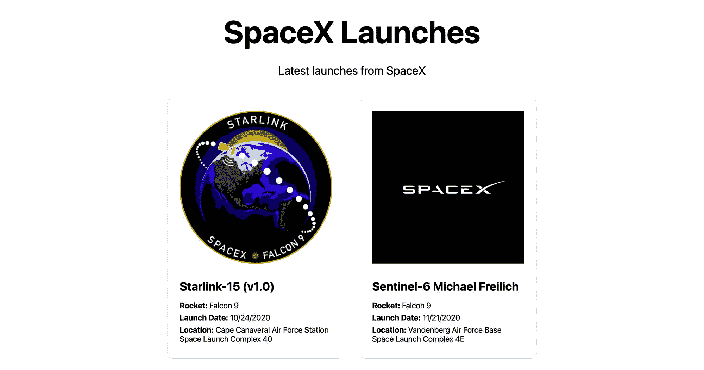
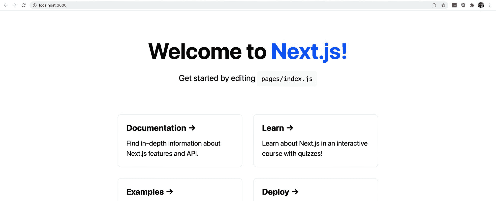
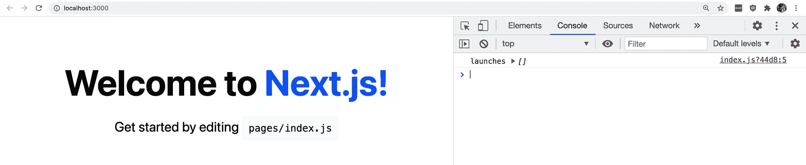
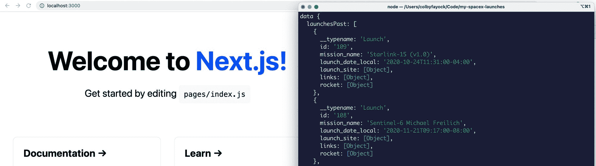
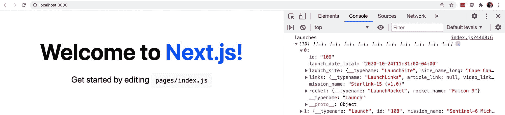
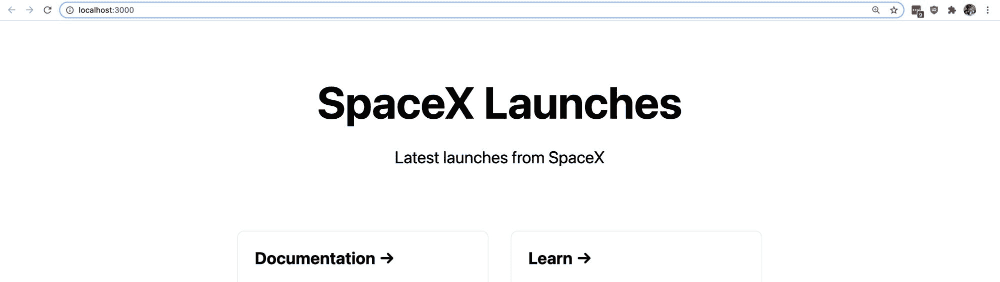
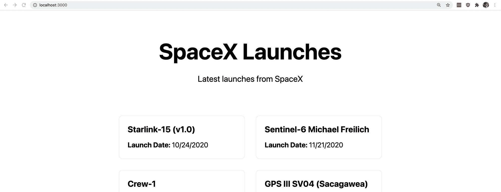

# 如何用 Apollo GraphQL 在 Next.js 中提取 GraphQL 数据

> 原文：<https://www.freecodecamp.org/news/how-to-fetch-graphql-data-in-next-js-with-apollo-graphql/>

Next.js 一直在稳步发展，成为开发 React 应用程序的开发人员的必备工具。它之所以伟大，部分原因是它的数据获取 API 为每个页面请求数据。但是，我们如何使用该 API 为我们的应用程序进行 GraphQL 查询呢？

*   [什么是 GraphQL？](#what-is-graphql)
*   [什么是 Apollo GraphQL？](#what-is-apollo-graphql)
*   [获取 Next.js 中的数据](#fetching-data-in-next-js)
*   我们要建造什么？
*   [步骤 0:创建新的 Next.js 应用](#step-0-creating-a-new-next-js-app)
*   [第一步:将 Apollo GraphQL 添加到 Next.js 应用程序中](#step-1-adding-apollo-graphql-to-a-next-js-app)
*   [步骤 2:使用 getStaticProps](#step-2-adding-data-to-a-next-js-page-with-getstaticprops) 将数据添加到 Next.js 页面
*   [步骤 3:使用 Apollo 客户端在 Next.js 中用 GraphQL 查询获取数据](#step-3-fetch-data-with-a-graphql-query-in-next-js-using-apollo-client)
*   [步骤 4:向页面添加 SpaceX 发射数据](#step-4-adding-spacex-launch-data-to-the-page)

[https://www.youtube.com/embed/oxUPXhZ1t9I?feature=oembed](https://www.youtube.com/embed/oxUPXhZ1t9I?feature=oembed)

## GraphQL 是什么？

GraphQL 是一种查询语言和运行时，它提供了一种与传统 REST API 不同的交互方式。

当获取数据时，GraphQL 端点采用“查询”，而不是向 URL 发出 [GET](https://developer.mozilla.org/en-US/docs/Web/HTTP/Methods/GET) 请求来获取数据。该查询包含您想要获取的数据，无论是整个数据集还是其中的有限部分。

如果您的数据如下所示:

```
Movie {
  "title": "Sunshine",
  "releaseYear": "2007",
  "actors": [...],
  "writers": [...]
} 
```

如果您只想获取书名和发行年份，您可以发送如下查询:

```
Movie {
  title
  releaseYear
} 
```

仅获取您需要的数据。

酷的是，您还可以提供数据之间的复杂关系。使用单个查询，您还可以从数据库的不同部分请求数据，而使用 REST API 传统上需要多次请求。

## 阿波罗图 QL 是什么？

Apollo GraphQL 的核心是一个 GraphQL 实现，它帮助人们将他们的数据汇集成一个图表。

Apollo 还提供并维护了一个 GraphQL 客户端，这就是我们将要使用的，它允许人们以编程方式与 GraphQL API 进行交互。

使用 Apollo 的 GraphQL 客户端，我们将能够向 GraphQL API 发出请求，类似于我们对基于 REST 的请求客户端的期望。

## 在 Next.js 中提取数据

当使用 Next.js 提取数据时，对于如何提取数据，您有几个选项。

首先，您可以走客户端路线，在页面加载后发出请求。这样做的问题是，你把花时间提出这些请求的负担放在了客户身上。

像`getStaticProps`和`getServerSideProps`这样的 Next.js APIs 允许你在生命周期的不同部分收集数据，让我们有机会[制作一个完全静态的应用](https://www.youtube.com/watch?v=6ElI2ZJ4Uro)或者一个服务器端渲染的应用。这将把已经呈现在页面上的数据直接提供给浏览器。

通过使用这些方法中的一种，我们可以随页面请求数据，并将这些数据作为道具注入到我们的应用程序中。

## 我们要建造什么？

我们将创建一个 Next.js 应用程序，显示 SpaceX 的最新发射。



SpaceX launches demo

我们将使用由 [SpaceX Land](https://spacex.land/) 维护的 API 进行 GraphQL 查询，获取最近 10 次航班。使用 [getStaticProps](https://nextjs.org/docs/basic-features/data-fetching#getstaticprops-static-generation) ，我们将在构建时发出请求，这意味着我们的页面将使用我们的数据静态呈现。

## 步骤 0:创建新的 Next.js 应用程序

使用 Create Next App，我们可以快速构建一个新的 Next.js 应用程序，我们可以使用它立即开始研究代码。

在您的终端中，运行命令:

```
npx create-next-app my-spacex-launches 
```

*注意:你不必使用`my-spacex-app`，随意用你想给这个项目起的名字来替换它。*

运行该脚本后，Next.js 将建立一个新项目并安装依赖项。

完成后，您可以启动您的开发服务器:

```
cd my-spacex-launches
npm run dev 
```

这将在 [http://localhost:3000](http://localhost:3000) 启动一个新服务器，您现在可以访问您的新应用程序了！



New Next.js app

## 步骤 1:将 Apollo GraphQL 添加到 Next.js 应用程序中

要开始进行 GraphQL 查询，我们需要一个 GraphQL 客户机。我们将使用 Apollo GraphQL 客户端对 SpaceX GraphQL 服务器进行查询。

回到终端内部，运行以下命令来安装我们的新依赖项:

```
npm install @apollo/client graphql 
```

这将添加 Apollo 客户机和 GraphQL，我们需要它们来形成 GraphQL 查询。

一旦安装完成，我们就可以开始使用 Apollo 客户端了。

[跟随提交！](https://github.com/colbyfayock/my-spacex-launches/commit/0fcc3a0141e7bfb795c3c91c355fdfc459a17332)

## 步骤 2:使用 getStaticProps 将数据添加到 Next.js 页面

在我们使用 Apollo 获取任何数据之前，我们将设置我们的页面，以便能够请求数据，然后在构建时将该数据作为道具传递给我们的页面。

让我们在页面底部定义一个新的函数，在我们的`Home`组件下面，叫做`getStaticProps`:

```
export async function getStaticProps() {
  // Code will go here
} 
```

当 Next.js 构建我们的应用程序时，它知道要寻找这个函数。所以当我们导出它时，我们让 Next.js 知道我们想在那个函数中运行代码。

在我们的`getStaticProps`函数中，我们将最终把我们的道具返回到页面。为了测试这一点，让我们在函数中添加以下内容:

```
export async function getStaticProps() {
  return {
    props: {
      launches: []
    }
  }
} 
```

这里，我们传递了一个新的道具`launches`，并将其设置为一个空数组。

现在，回到我们的`Home`组件内部，让我们添加一个新的析构参数作为我们的道具，同时添加一个`console.log`语句来测试我们的新道具:

```
export default function Home({ launches }) {
  console.log('launches', launches); 
```

如果我们重新加载页面，我们可以看到我们现在正在注销我们的新道具`launches`,它包括一个我们定义的空数组。



Logging launches prop

这一点的好处在于，假设我们正在创建的`getStaticProps`函数是异步的，我们可以发出任何我们想要的请求(包括 GraphQL 查询)并将它作为道具返回到我们的页面，这就是我们接下来要做的。

[跟随提交！](https://github.com/colbyfayock/my-spacex-launches/commit/868a4f6b31200cd2407b4aa2fe37a243fc235932)

## 第 3 步:使用 Apollo 客户端在 Next.js 中用 GraphQL 查询获取数据

现在，我们的应用程序已经准备好向页面添加道具，并且我们已经安装了 Apollo，我们终于可以请求获取我们的 SpaceX 数据了。

这里，我们将使用 Apollo 客户端，它将允许我们与 SpaceX GraphQL 服务器进行交互。我们将使用 Next.js getStaticProps 方法向 API 发出请求，允许我们在构建页面时为页面动态创建道具。

首先，让我们将 Apollo 依赖项导入到项目中。在页面顶部添加:

```
import { ApolloClient, InMemoryCache, gql } from '@apollo/client'; 
```

这将包括 Apollo 客户端本身，`InMemoryCache`允许 Apollo 通过从缓存读取进行优化，以及`gql`我们将使用它来形成我们的 GraphQL 查询。

接下来，要使用 Apollo 客户机，我们需要设置它的一个新实例。

在`getStaticProps`函数的顶部，添加:

```
const client = new ApolloClient({
  uri: 'https://api.spacex.land/graphql/',
  cache: new InMemoryCache()
}); 
```

这使用 SpaceX API 端点创建了一个新的 Apollo 客户机实例，我们将使用它进行查询。

有了我们的客户，我们终于可以查询了。在客户端下方添加以下代码:

```
const { data } = await client.query({
  query: gql`
    query GetLaunches {
      launchesPast(limit: 10) {
        id
        mission_name
        launch_date_local
        launch_site {
          site_name_long
        }
        links {
          article_link
          video_link
          mission_patch
        }
        rocket {
          rocket_name
        }
      }
    }
  `
}); 
```

这做了几件事:

*   在`gql`标记内创建一个新的 GraphQL 查询
*   使用`client.query`创建新的查询请求
*   它使用`await`来确保在继续之前完成请求
*   最后从结果中析构`data`,这是我们需要的信息存储的地方

在 GraphQL 查询中，我们告诉 SpaceX API，我们希望获得`launchesPast`，这是 SpaceX 以前的发射，我们希望获得其中的最后 10 次发射(限制)。在其中，我们定义了我们想要查询的数据。

如果我们花点时间添加一个新的控制台日志语句，我们可以看到`data`是什么样子。

一旦你刷新了页面，你会注意到你在浏览器的控制台中看不到任何东西。

`getStaticProps`在构建过程中运行，也就是说，它在节点中运行。因此，我们可以查看终端内部，在那里可以看到我们的日志:



Logging data to the terminal

看到这一点后，我们知道在`data`对象内部，我们有一个名为`launchesPast`的属性，它包含一组启动细节。

现在，我们可以更新我们的 return 语句来使用`launchesPast`:

```
return {
  props: {
    launches: data.launchesPast
  }
} 
```

如果我们将我们的`console.log`语句添加回页面顶部，看看我们的`launches`道具是什么样子，我们可以看到我们的发布数据现在可以作为我们页面的道具:



Logging props to web console

[跟随提交！](https://github.com/colbyfayock/my-spacex-launches/commit/f273bcde3d2baccd54e4c65930ab499dbe4862ed)

## 步骤 4:向页面添加 SpaceX 发射数据

现在是激动人心的部分！

我们有我们的发射数据，我们能够使用阿波罗客户端从 SpaceX GraphQL 服务器请求。我们在`getStaticProps`中提出了这个请求，这样我们就可以将我们的数据作为包含我们发布数据的`launches`道具。

深入页面，我们将利用已经存在的内容。例如，我们可以从更新`h1`标签和它下面的段落开始，来更好地描述我们的页面。



Updated page title

接下来，我们可以使用现有的链接卡来包含我们所有的发布信息。

为此，让我们首先在页面的网格中添加一个 [map](https://developer.mozilla.org/en-US/docs/Web/JavaScript/Reference/Global_Objects/Array/map) 语句，其中我们返回的组件是一张卡片，并填充了启动细节:

```
<div className={styles.grid}>
  {launches.map(launch => {
    return (
      <a key={launch.id} href={launch.links.video_link} className={styles.card}>
        <h3>{ launch.mission_name }</h3>
        <p><strong>Launch Date:</strong> { new Date(launch.launch_date_local).toLocaleDateString("en-US") }</p>
      </a>
    );
  })} 
```

我们还可以去掉剩余的默认 Next.js 卡，包括文档和学习。



Page with SpaceX launches

我们的页面现在包括 SpaceX 最近的 10 次发射以及发射日期！

我们甚至可以单击这些卡片中的任何一张，因为我们链接到了视频链接，所以我们现在可以看到发布视频。

[跟随提交！](https://github.com/colbyfayock/my-spacex-launches/commit/e35ed076253e3648fa5d8cd62e993e4e9e436396)

## 下一步是什么？

从这里开始，我们可以在页面上包含来自我们的`launches`数组内部的任何附加数据。API 甚至包括任务补丁图像，我们可以用它来显示每次发射的精美图形。

您甚至可以向 GraphQL 查询添加额外的数据。每次发射都有很多信息，包括发射人员和火箭的更多细节。

[https://api.spacex.land/graphql/](https://api.spacex.land/graphql/)

[](https://jamstackhandbook.com/)

[](https://twitter.com/colbyfayock)

*   [🐦在 Twitter 上关注我](https://twitter.com/colbyfayock)
*   [📺订阅我的 Youtube](https://youtube.com/colbyfayock)
*   [📫注册我的简讯](https://www.colbyfayock.com/newsletter/)
*   [💝赞助我](https://github.com/sponsors/colbyfayock)