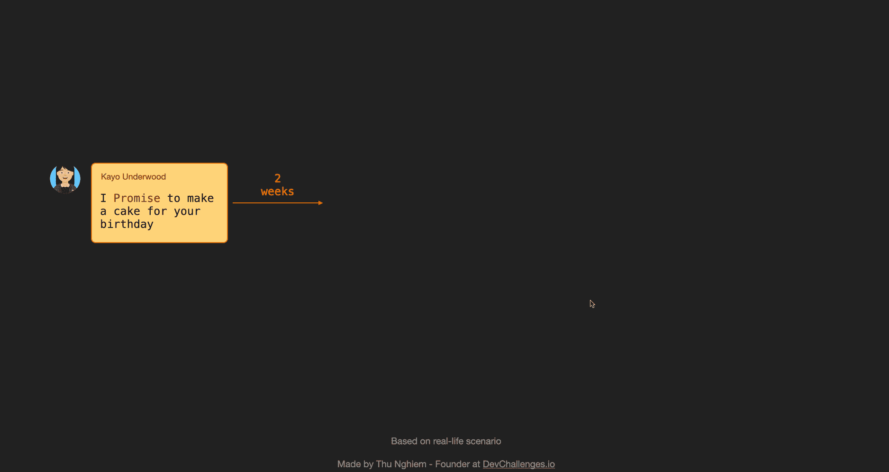
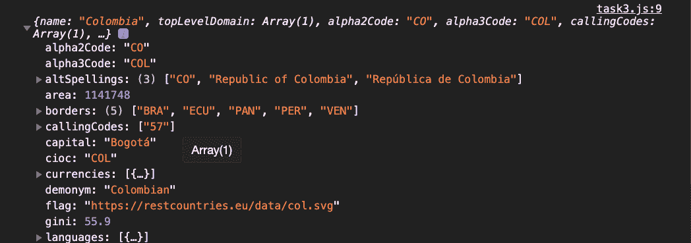
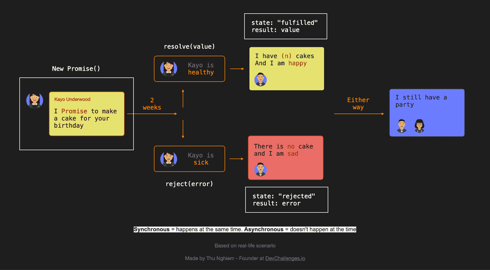

# 如何在 20 分钟内学会 JavaScript 承诺和异步/等待

> 原文：<https://www.freecodecamp.org/news/learn-promise-async-await-in-20-minutes/>

在网络上，许多事情往往很耗时——如果你查询一个 API，可能需要一段时间才能收到响应。因此，异步编程是开发人员的必备技能。

在 JavaScript 中使用异步操作时，我们经常会听到术语`Promise`。但是要理解它们的工作原理和使用方法是很困难的。

与许多传统的编码教程不同，在本教程中，我们将边做边学。到本文结束时，我们将完成四项任务:

*   任务 1:用我的生日解释承诺基础知识
*   任务 2:构建一个猜谜游戏
*   任务 3:从 API 获取国家信息
*   任务 4:获取一个国家的邻国

如果你想跟着做，一定要下载这里的资源:[https://bit.ly/3m4bjWI](https://bit.ly/3m4bjWI)

[https://www.youtube.com/embed/J29jeuyMJ38?feature=oembed](https://www.youtube.com/embed/J29jeuyMJ38?feature=oembed)

## 任务 1:用我的生日解释承诺基础知识



我的朋友加贺答应两周后为我的生日做一个蛋糕。

如果一切顺利，加贺不生病，我们会有一定数量的蛋糕。(蛋糕在本教程中是可数的😆).否则，如果加贺生病了，我们就没有蛋糕吃了。

不管怎样，我们还是要开派对。

第一项任务，我们将把这个故事翻译成代码。首先，让我们创建一个返回`Promise`的函数:

```
const onMyBirthday = (isKayoSick) => {
  return new Promise((resolve, reject) => {
    setTimeout(() => {
      if (!isKayoSick) {
        resolve(2);
      } else {
        reject(new Error("I am sad"));
      }
    }, 2000);
  });
};
```

在 JavaScript 中，我们可以用`new Promise()`创建一个新的`Promise`，它接受一个函数作为参数:`(resolve, reject) => {}`。

在这个函数中，`resolve`和`reject`是 JavaScript 中默认提供的回调函数。

让我们仔细看看上面的代码。

当我们运行`onMyBirthday`功能时，在`2000ms`之后:

*   如果加贺没有生病，那么我们用`2`作为参数运行`resolve`
*   如果加贺病了，那么我们运行`reject`，用`new Error("I am sad")`作为参数。尽管您可以将任何东西作为参数传递给`reject`，但还是建议将它作为`Error`对象传递。

现在，因为`onMyBirthday()`返回一个`Promise`，我们可以访问`then`、`catch`和`finally`方法。

我们还可以访问之前在`then`和`catch`中传递给`resolve`和`reject`的参数。

让我们仔细看看代码。

如果加贺没有生病:

```
onMyBirthday(false)
  .then((result) => {
    console.log(`I have ${result} cakes`); // In the console: I have 2 cakes  
  })
  .catch((error) => {
    console.log(error); // Does not run
  })
  .finally(() => {
    console.log("Party"); // Shows in the console no matter what: Party
  }); 
```

如果加贺生病了:

```
onMyBirthday(true)
  .then((result) => {
    console.log(`I have ${result} cakes`); // does not run 
  })
  .catch((error) => {
    console.log(error); // in console: Error: I am sad
  })
  .finally(() => {
    console.log("Party"); // Shows in the console no matter what: Party
  }); 
```

好了，到现在为止，我希望你已经了解了`Promise`的基本概念。让我们进入任务 2。

## 任务 2:构建一个猜谜游戏

要求:

*   用户故事:用户可以输入一个数字
*   用户故事:系统从 1 到 6 中选择一个随机数
*   用户故事:如果用户的数字等于一个随机数，给用户 2 分
*   用户故事:如果用户的数字与随机数相差 1，
    给用户 1 分。否则，给用户 0 分
*   用户故事:用户可以想玩多久就玩多久

对于前 4 个用户故事，让我们创建一个`enterNumber`函数并返回一个`Promise`:

```
const enterNumber = () => {
  return new Promise((resolve, reject) => {
    // Let's start from here
  });
};
```

我们需要做的第一件事是向用户索要一个数字，并在 1 到 6 之间选择一个随机数:

```
const enterNumber = () => {
  return new Promise((resolve, reject) => {
    const userNumber = Number(window.prompt("Enter a number (1 - 6):")); // Ask the user to enter a number
    const randomNumber = Math.floor(Math.random() * 6 + 1); // Pick a random number between 1 and 6
  });
}; 
```

现在，`userNumber`可以输入一个值，那不是数字。如果是这样，让我们调用带有错误的`reject`函数:

```
const enterNumber = () => {
  return new Promise((resolve, reject) => {
    const userNumber = Number(window.prompt("Enter a number (1 - 6):")); // Ask user to enter a number
    const randomNumber = Math.floor(Math.random() * 6 + 1); // Pick a random number between 1 and 6

    if (isNaN(userNumber)) {
      reject(new Error("Wrong Input Type")); // If the user enters a value that is not a number, run reject with an error
    }
  });
}; 
```

接下来我们要做的是检查`userNumber`是否等于`randomNumber`，如果是，我们要给用户 2 点，我们可以运行`resolve`函数，传递一个对象`{ points: 2, randomNumber }`。注意这里我们也想知道承诺被解决时的`randomNumber`

如果`userNumber`与`randomNumber`相差 1，那么我们给用户 1 分。否则，我们给用户 0 分:

```
return new Promise((resolve, reject) => {
  const userNumber = Number(window.prompt("Enter a number (1 - 6):")); // Ask the user to enter a number
  const randomNumber = Math.floor(Math.random() * 6 + 1); // Pick a random number between 1 and 6

  if (isNaN(userNumber)) {
    reject(new Error("Wrong Input Type")); // If the user enters a value that is not a number, run reject with an error
  }

  if (userNumber === randomNumber) {
    // If the user's number matches the random number, return 2 points
    resolve({
      points: 2,
      randomNumber,
    });
  } else if (
    userNumber === randomNumber - 1 ||
    userNumber === randomNumber + 1
  ) {
    // If the user's number is different than the random number by 1, return 1 point
    resolve({
      points: 1,
      randomNumber,
    });
  } else {
    // Else return 0 points
    resolve({
      points: 0,
      randomNumber,
    });
  }
});
```

好的，让我们创建另一个函数来询问用户是否想继续游戏:

```
const continueGame = () => {
  return new Promise((resolve) => {
    if (window.confirm("Do you want to continue?")) { // Ask if the user want to continue the game with a confirm modal
      resolve(true);
    } else {
      resolve(false);
    }
  });
}; 
```

注意这里我们创建了一个`Promise`，但是它没有使用`reject`回调。这完全没问题。

现在让我们创建一个函数来处理猜测:

```
const handleGuess = () => {
  enterNumber() // This returns a Promise
    .then((result) => {
      alert(`Dice: ${result.randomNumber}: you got ${result.points} points`); // When resolve is run, we get the points and the random number 

      // Let's ask the user if they want to continue the game
      continueGame().then((result) => {
        if (result) {
          handleGuess(); // If yes, we run handleGuess again
        } else {
          alert("Game ends"); // If no, we show an alert
        }
      });
    })
    .catch((error) => alert(error));
};

handleGuess(); // Run handleGuess function 
```

这里当我们调用`handleGuess`时，`enterNumber()`现在返回一个`Promise`:

*   如果`Promise`被解析，我们调用`then`方法并显示一条警告消息。我们还会询问用户是否想继续。
*   如果`Promise`被拒绝，我们会显示一条带有错误的警告消息。

如你所见，代码很难阅读。

让我们使用`async/await`语法稍微重构一下`handleGuess`函数:

```
const handleGuess = async () => {
  try {
    const result = await enterNumber(); // Instead of the then method, we can get the result directly by just putting await before the promise

    alert(`Dice: ${result.randomNumber}: you got ${result.points} points`);

    const isContinuing = await continueGame();

    if (isContinuing) {
      handleGuess();
    } else {
      alert("Game ends");
    }
  } catch (error) { // Instead of catch method, we can use the try, catch syntax
    alert(error);
  }
}; 
```

您可以看到，我们通过将`async`放在括号前创建了一个`async`函数。然后在`async`功能中:

*   不使用`then`方法，我们只需将`await`放在承诺之前，就可以直接得到结果
*   我们可以使用`try, catch`语法来代替`catch`方法

这里再次列出该任务的所有代码供您参考:

```
const enterNumber = () => {
  return new Promise((resolve, reject) => {
    const userNumber = Number(window.prompt("Enter a number (1 - 6):")); // Ask the user to enter a number
    const randomNumber = Math.floor(Math.random() * 6 + 1); // Pick a random number between 1 and 6

    if (isNaN(userNumber)) {
      reject(new Error("Wrong Input Type")); // If the user enters a value that is not a number, run reject with an error
    }

    if (userNumber === randomNumber) { // If the user's number matches the random number, return 2 points
      resolve({
        points: 2,
        randomNumber,
      });
    } else if (
      userNumber === randomNumber - 1 ||
      userNumber === randomNumber + 1
    ) { // If the user's number is different than the random number by 1, return 1 point
      resolve({
        points: 1,
        randomNumber,
      });
    } else { // Else return 0 points
      resolve({
        points: 0,
        randomNumber,
      });
    }
  });
};

const continueGame = () => {
  return new Promise((resolve) => {
    if (window.confirm("Do you want to continue?")) { // Ask if the user want to continue the game with a confirm modal
      resolve(true);
    } else {
      resolve(false);
    }
  });
};

const handleGuess = async () => {
  try {
    const result = await enterNumber(); // Instead of the then method, we can get the result directly by just putting await before the promise

    alert(`Dice: ${result.randomNumber}: you got ${result.points} points`);

    const isContinuing = await continueGame();

    if (isContinuing) {
      handleGuess();
    } else {
      alert("Game ends");
    }
  } catch (error) { // Instead of catch method, we can use the try, catch syntax
    alert(error);
  }
};

handleGuess(); // Run handleGuess function 
```

好了，我们完成了第二个任务。让我们接着看第三个。

## 任务 3:从一个 API 中获取国家信息

你会看到`Promises`在从 API 获取数据时被大量使用。

如果你在新的浏览器中打开[https://restcountries.eu/rest/v2/alpha/col](https://restcountries.eu/rest/v2/alpha/col)，你会看到 JSON 格式的国家数据。

通过使用[获取 API](https://developer.mozilla.org/en-US/docs/Web/API/Fetch_API/Using_Fetch) ，我们可以通过以下方式获取数据:

```
const fetchData = async () => {
  const res = await fetch("https://restcountries.eu/rest/v2/alpha/col"); // fetch() returns a promise, so we need to wait for it

  const country = await res.json(); // res is now only an HTTP response, so we need to call res.json()

  console.log(country); // Columbia's data will be logged to the dev console
};

fetchData(); 
```

现在我们已经有了想要的国家数据，让我们进入最后一个任务。

## 任务 4:获取一个国家的邻国

如果您打开任务 4，您会看到我们有一个`fetchCountry`函数，它从端点`https://restcountries.eu/rest/v2/alpha/${alpha3Code}`获取数据，其中`alpha3code`是国家代码。

你还可以看到，它会捕捉到获取数据时可能发生的任何`error`。

```
// Task 4: get the neigher countries of Columbia

const fetchCountry = async (alpha3Code) => {
  try {
    const res = await fetch(
      `https://restcountries.eu/rest/v2/alpha/${alpha3Code}`
    );

    const data = await res.json();

    return data;
  } catch (error) {
    console.log(error);
  }
}; 
```

让我们创建一个`fetchCountryAndNeighbors`函数，通过将`col`作为`alpha3code`传递来获取 Columbia 的信息。

```
const fetchCountryAndNeighbors = async () => {
  const columbia = await fetchCountry("col");

  console.log(columbia);
};

fetchCountryAndNeighbors(); 
```

现在，如果你看你的控制台，你可以看到一个物体看起来像这样:



在该对象中，有一个`border`属性，它是哥伦比亚邻近国家的`alpha3codes`列表。

现在如果我们试图让邻国通过:

```
 const neighbors = 
    columbia.borders.map((border) => fetchCountry(border)); 
```

然后，`neighbors`将是一个由`Promise`个对象组成的数组。

当处理一系列承诺时，我们需要使用`Promise.all`:

```
const fetchCountryAndNeigbors = async () => {
  const columbia = await fetchCountry("col");

  const neighbors = await Promise.all(
    columbia.borders.map((border) => fetchCountry(border))
  );

  console.log(neighbors);
};

fetchCountryAndNeigbors(); 
```

在`console`中，我们应该能够看到国家对象的列表。

这里再次列出任务 4 的所有代码供您参考:

```
const fetchCountry = async (alpha3Code) => {
  try {
    const res = await fetch(
      `https://restcountries.eu/rest/v2/alpha/${alpha3Code}`
    );

    const data = await res.json();

    return data;
  } catch (error) {
    console.log(error);
  }
};

const fetchCountryAndNeigbors = async () => {
  const columbia = await fetchCountry("col");

  const neighbors = await Promise.all(
    columbia.borders.map((border) => fetchCountry(border))
  );

  console.log(neighbors);
};

fetchCountryAndNeigbors(); 
```

## 结论



完成这 4 个任务后，你可以看到`Promise`在异步动作或不同时发生的事情时很有用。

你可以在我的一个教程中看到这一点，在那里我们用 React 和 Next.js 从头开始构建一个应用程序:

[https://www.youtube.com/embed/v8o9iJU5hEA?feature=oembed](https://www.youtube.com/embed/v8o9iJU5hEA?feature=oembed)

## __________ 🐣关于我 _ _ _ _ _ _ _ _ _ _ _ _

*   我是[发展挑战](https://devchallenges.io/)的创始人
*   订阅我的 [YouTube 频道](https://www.youtube.com/channel/UCmSmLukBF--YrKZ2g4akYAQ?sub_confirmation=1)
*   在推特上关注我
*   加入[不和](https://discord.com/invite/3R6vFeM)