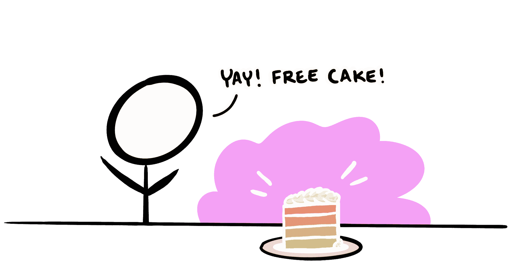
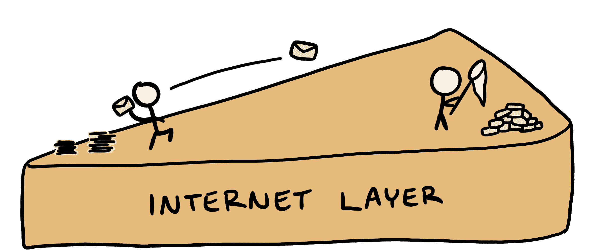
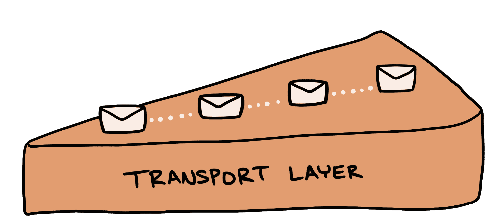
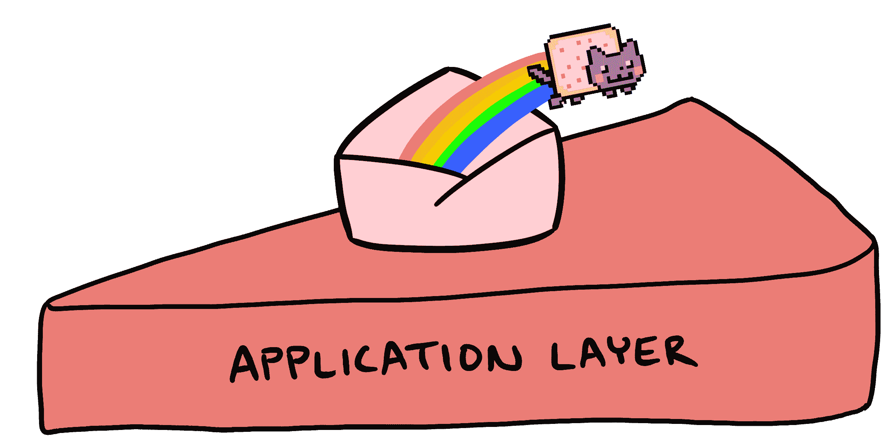
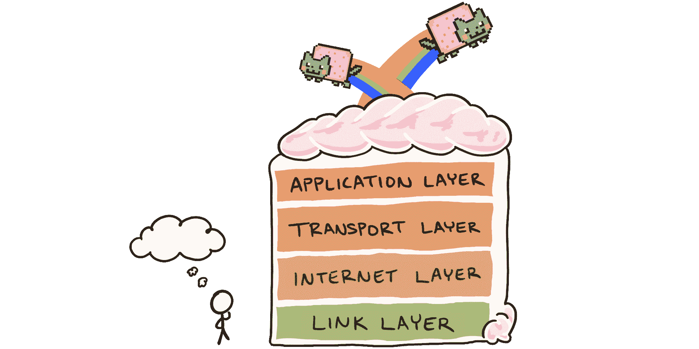

# 什么是 TCP/IP 模型？解释了层和协议

> 原文：<https://www.freecodecamp.org/news/what-is-tcp-ip-layers-and-protocols-explained/>

创造过程的一个重要部分是想象尚不存在的事物的能力。

这种技能对互联网的创建起了重要作用。如果没有人想象出现在大多数人每天都认为理所当然的基础技术，就不会有猫迷因。

为了让互联网成为可能，需要想象的两件事是*层*和*协议。*

层是将相似的功能组合在一起的概念划分。“协议”这个词或多或少意味着“我们同意在这里做事的方式”。

简而言之，层和协议都可以向一个五岁的孩子解释为“人们同意的想法听起来不错，然后他们把它们写下来，以便其他人可以用同样的想法做事情。”

互联网协议组是按照层和协议来描述的。总的来说，该套件指的是支持我们无休止滚动的通信协议。

它通常被称为其基础协议:传输控制协议(TCP)和互联网协议(IP)。这些协议统称为 TCP/IP，描述了互联网上的数据是如何打包、寻址、发送和接收的。

这就是为什么互联网协议套件，或 TCP/IP，是一个想象中的彩虹层蛋糕。

## **层是假想的**

如果你考虑彩虹层海绵蛋糕的一般性质，它主要是由柔软的，入口即化的香草味组成的。这种好处本身是由鸡蛋、黄油、面粉和甜味剂组成的。

彩虹海绵蛋糕的一层和另一层没有太大的区别。通常，各层之间唯一的区别是食用色素和一点糖霜。仔细想想，从上到下都是蛋糕。彩虹层在那里只是因为面包师认为它们应该在那里。

与蛋糕配料类似，计算机网络环境中的层主要由协议、算法和配置组成，其中还夹杂着一些数据。

如果把计算机网络的许多功能分成几个组，讨论起来会更容易，所以有些人提出了分层的描述，我们称之为网络模型。TCP/IP 只是众多网络模型中的一种。从这个意义上说，层是概念，不是事物。

有些人是互联网工程任务组(IETF)的成员。他们创建了 RFC-1122 出版物，讨论互联网的通信层。整体的一半，标准:

> …涵盖通信协议层:链路层、IP 层和传输层；它的伙伴 [RFC-1123](https://tools.ietf.org/html/rfc1123) 涵盖了应用和支持协议。

RFC-1122 和 RFC-1123 描述的每一层都封装了满足该层功能的协议。让我们来看看每一个通信层，看看 TCP 和 IP 在这个 Internet 层蛋糕模型中是如何堆叠的。

## **链路层协议**

[链路层](https://tools.ietf.org/html/rfc1122#page-21)是通信协议的最基本或最低级分类。它负责在同一本地网络中的主机之间发送信息，并将数据从较高层传输到物理层。

链路层中的协议描述了数据如何与传输介质交互，例如通过特定硬件发送的电子信号。与其它层不同，链路层协议依赖于所使用的硬件。

## **互联网层协议**

[互联网层](https://tools.ietf.org/html/rfc1122#page-27)中的协议描述了如何通过互联网发送和接收数据。该过程包括将数据打包成数据包、寻址和发送数据包，以及接收传入的数据包。

这一层中最广为人知的协议是 TCP/IP 的最后两个字母。IP 是一种无连接协议，这意味着它不能保证数据包以正确的顺序、沿同一路径发送或接收，甚至不能保证数据包是完整的。

可靠性由该组中的其他协议处理，例如传输层。

目前使用的 IP 有两个版本:IPv4 和 IPv6。这两个版本都描述了互联网上的设备是如何被分配 IP 地址的，当导航到猫迷因时会用到 IP 地址。

IPv4 使用更广泛，但只有 [32 位用于寻址](https://tools.ietf.org/html/rfc791#section-2.3)，允许大约 43 亿(ca。4.3×10 ⁹ 可能的地址。这些正在耗尽，随着越来越多的人在互联网上使用更多的设备，IPv4 最终将遭遇地址枯竭。

后续版本 IPv6 旨在通过使用 128 位地址来解决地址耗尽的问题。这提供了，嗯，一个*地段*更多的地址可能性(约。3.4×10 ^(38) 。

## **传输层协议**

1974 年 5 月，温顿·瑟夫和鲍勃·卡恩(统称为“互联网之父”)发表了一篇名为[分组网络互通协议](https://web.archive.org/web/20160304150203/http://ece.ut.ac.ir/Classpages/F84/PrincipleofNetworkDesign/Papers/CK74.pdf)的论文。

这篇论文包含了传输控制程序的第一个描述，这个概念包含了后来被称为传输控制协议(TCP)和用户数据报协议(UDP)的内容。(我有幸见到了 Vint，并且可以亲自证实，是的，他看起来确实和《黑客帝国》电影中的建筑师一模一样。)

[传输层](https://tools.ietf.org/html/rfc1122#page-77)目前封装 TCP 和 UDP。像 IP 一样，UDP 是无连接的，可以用来优先考虑时间而不是可靠性。

另一方面，TCP 是一种面向连接的传输层协议，其可靠性优先于延迟或时间。TCP 描述了按照数据发送的顺序传输数据，重新传输丢失的数据包，并控制影响数据传输的速率。

## **应用层协议**

应用层描述了软件应用程序最常与之交互的协议。该规范包括对远程登录协议 [Telnet](https://tools.ietf.org/html/rfc1123#section-3) 、[文件传输协议(FTP)](https://tools.ietf.org/html/rfc1123#section-4) 和[简单邮件传输协议(SMTP)](https://tools.ietf.org/html/rfc1123#section-5) 的描述。

应用层还包括超文本传输协议(HTTP)及其继任者安全超文本传输协议(HTTPS)。

HTTPS 由传输层安全性(TLS)保护，这可以说是互联网协议套件描述的网络模型的最顶层。

如果你想进一步了解 TLS 和这个协议如何保护你的猫迷因观看，我邀请你[阅读我关于 TLS 和密码学的文章](https://victoria.dev/blog/tls)。

## **互联网蛋糕还在烤**

就像一个仍在上升的海绵蛋糕，每天都在开发层的描述、更好的协议和新的模型。互联网，或者将来会变成什么样子，还在想象的过程中。

如果你喜欢从这篇文章中学习，这里还有更多！我写的是计算、网络安全和建立优秀的技术团队。加入成千上万从我在 [victoria.dev](https://victoria.dev) 上的文章中学习的人们吧！通过电子邮件或 RSS 访问和订阅，首先查看新文章。