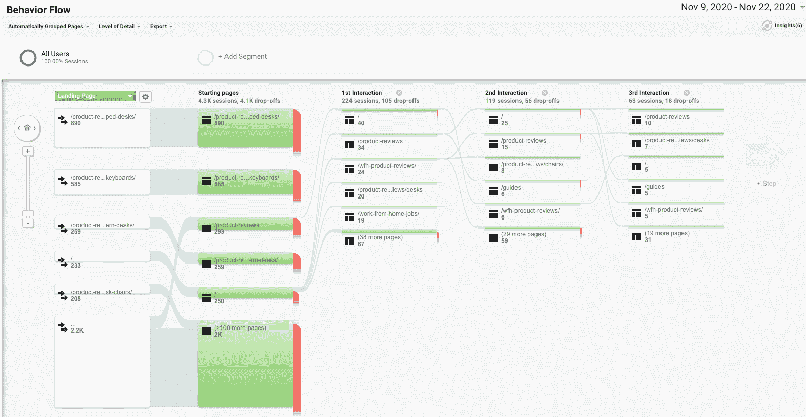
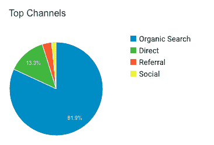

# 应用数据分析——如何使用贝叶斯定理和其他概念来改善你的业务

> 原文：<https://www.freecodecamp.org/news/applied-data-analytics/>

我以前在 freeCodeCamp 上写过关于数据分析的文章。

在我以前的文章中，我提供了与数据分析基础相关的例子和概念。我还讨论了如何使用这门学科的框架，在多个学术和专业领域解决问题。

鉴于 freeCodeCamp 社区充满了热爱技术并希望利用软件和硬件来制作有用和有趣的产品的人，我想深入研究应用数据分析以及它如何在专业上帮助你。

具体来说，我想讨论在建立公司或产品时，如何思考并应用数据分析来解决业务问题。

在本文中，我只关注三个核心概念:

1.  贝叶斯定理
2.  回归平均值
3.  风险回报率

## 如何将贝叶斯定理应用于万维网

让我们看看网站建设，看看它教给我们什么关于贝叶斯定理。

首先，一些背景。

对于许多互联网企业家来说，建立一个网站或从事电子邮件自动化是测试一个想法、收集用户反馈和产品货币化的第一步。

但是你怎么知道建立什么类型的网站呢？如何知道你的网站或联盟营销计划表现良好？

数据分析提供了重要的方向性答案。

当建立一个网站或软件产品时，对它充满热情是有帮助的。但仅有激情不足以推动成功的结果。激情与数据相结合，可以释放新的洞察力和价值。

看看这个来自谷歌分析的 Wordpress 聊天机器人的行为流程图。你看到了什么？

数据分析中的一个关键概念是贝叶斯定理。它描述了一个事件发生的概率，基于可能与该事件相关的条件的先验知识。

例如，假设用户离开我的网站的风险随着用户在主页上花费的时间减少而增加。贝叶斯定理允许更准确地评估个人离开的风险(通过以在主页上花费的时间为条件)，而不是简单地假设个人是整个人口的典型。

想一想。对你如何设计和制造产品的影响是深远的。

通过利用贝叶斯定理，我可以更好地了解用户如何在我的网站上花费时间，以及他们可能离开的地点和原因。

如果没有这个定理的应用，我可能会错误地检查所有用户，好像他们具有相同的属性，而实际上他们并不具有相同的属性。

在主页上花更多时间的用户更有可能在分支页面上花更多时间，从而成为更好的客户(就我建立的网站而言)。

挑战自己，将贝叶斯定理应用到当前的学习和工作中。通过计算条件概率——并利用过去来帮助指导未来——你能做些什么不同呢？或者更好？

## 回归平均值

我发现的与技术和软件学习特别相关的第二个核心数据分析主题是均值回归。这一概念无处不在——正如我们将要讨论的，这既是好消息也是坏消息。

均值回归解释了随机变量的样本点极端(接近异常值)时出现的现象。

在进一步的测量中，未来的点将更接近平均值。

这个概念在考察网站流量、电子商务销售或者进行产品质量测试时非常重要。

假设你的网站平均由 X 个页面组成。你成功的一个关键因素将是你的用户与你的页面内容的互动程度。其中的一个关键驱动因素是您的页面的响应速度。

在谷歌分析(和其他测量网站性能的客户分析软件)中，你可以很容易地测量你的平均页面加载时间。

如果其中一个页面在 9 秒内缓慢打开，或者在 0.04 秒内快速打开，你认为会发生什么？

基于这些数据，我们不希望这些异常结果重复出现。事实上，我们预计未来的数据点将更接近或等于平均值。

当学习如何编码或构建你的第一个产品时，确保你理解你的真实平均值。如果你得到的数据差别很大，预计未来的数据会回到平均值。

这些知识可以帮助你更好地理解未来(因为你知道未来会发生什么)，因此，你可以相应地设定期望。

## 风险回报率

为了一定的收益，你应该冒多大的风险？风险回报率是一个特定时期内风险回报的衡量标准。你可能不太了解这个公式，但我相信你应该了解。

在不了解风险和回报的情况下，你怎么能开发一个产品，投资一项业务，或者巩固你的软件的发布时间表呢？

按理说你不能。

这里有一个例子。对于一个网站来说，大部分流量来自有机搜索，或搜索引擎优化。

这意味着网站不需要付费来直接获取流量，而是受制于控制网站访客流量的搜索算法的突发奇想。

你认为这个网站在搜索上被过度索引了吗？你如何使流量多样化，以获得相似的回报，同时降低风险？一种方法是应用多样化原则，这是一种通过在不同类别中分配资源来降低风险的技术。

如果你通过投资对同一事件反应不同的不同领域来最大化回报，你的网站(或产品)可以降低风险，同时仍然保持强劲的上升势头。

## 将所有这些整合在一起:在现实世界中应用数据分析

正如我之前所说，数据分析是检查、清理、转换和建模数据的过程，目的是发现有用的信息。这个领域有很多值得深究的概念。

当考虑将数据分析应用到您的工作中时——包括研究、编码挑战和产品构建工作——理解和应用最有影响力的是贝叶斯定理、均值回归和风险回报率。

不管你是在构建一个登陆页面，一个强大的网站，一个移动应用程序，还是像员工参与软件这样的企业工具。数据是你的朋友。

数据是最快、最具成本效益的合同接洽流程之一。它总会出现，随时准备引导你。

如果你想制造伟大的产品，你需要数据。你需要时间来评估和使用这些数据。

您将需要工具——如数据分析提供的工具——来释放洞察力并更好地为您的用户服务。

这就是为什么数据分析研究很重要，但在实践中应用更重要。