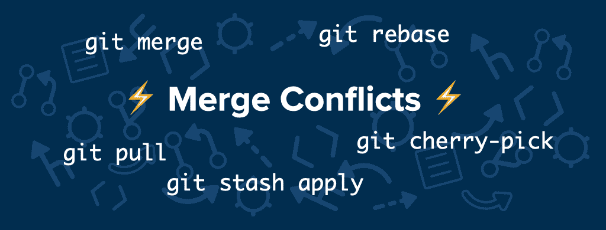
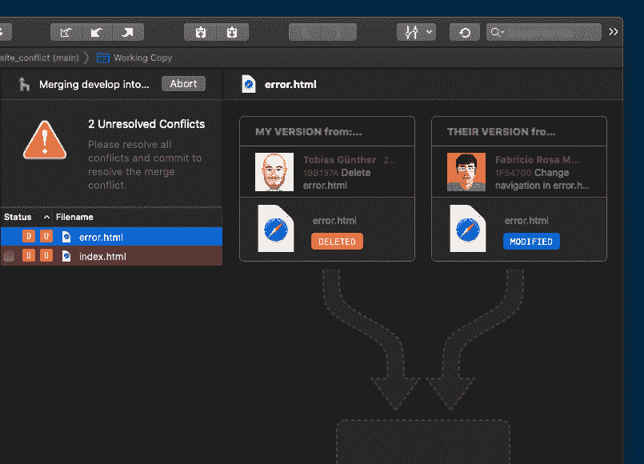
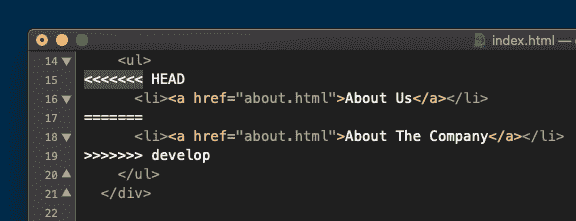
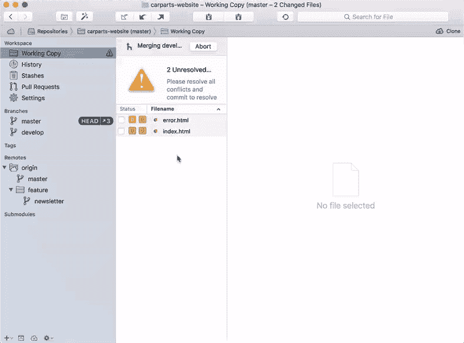
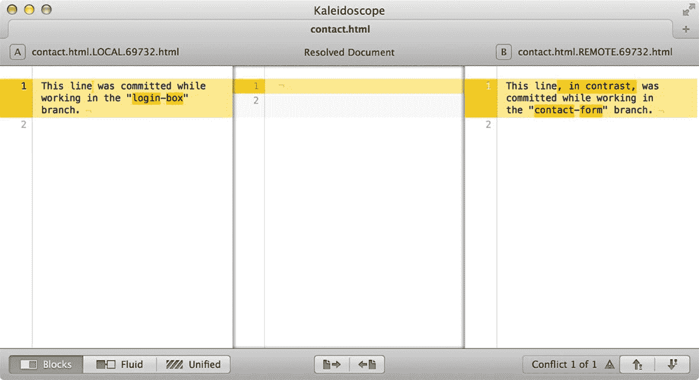

# 如何理解和解决 Git 中的冲突

> 原文：<https://www.freecodecamp.org/news/how-to-handle-merge-conflicts-in-git/>

就是这个，每个开发者都讨厌看到的词:**冲突。**😱在使用 Git(或其他版本控制系统)时，没有办法避免偶尔的合并冲突。

但是当与开发人员交谈时，我经常听到围绕合并冲突的话题有一种焦虑感或 T2 不舒服感。

处理冲突通常是一个黑暗、神秘的地方:事情被严重破坏，不知道如何摆脱(不使事情变得更糟)。

虽然合并冲突是开发人员生活中不可避免的一部分，但是这种情况下的不适是完全可以选择的。

我写这篇文章的目的是为了澄清这个话题:冲突通常是如何以及何时发生的，它们实际上是什么，以及如何解决或者消除它们。

当你正确理解这些事情时，你将能够以一种更加轻松和自信的方式处理合并冲突。😍

## 冲突发生的方式和时间

顾名思义:“合并冲突”可能发生在集成来自不同来源的提交的过程中。

但是，请记住，“集成”不仅限于“合并分支”。这也可能发生在重定基础或交互式重定基础时，在执行精选或拉动时，甚至在重新应用存储时。

所有这些操作都执行某种集成——这就是合并冲突可能发生的时候。



但是当然，这些动作不会每次都导致合并冲突(感谢上帝！).理想情况下，你应该很少发现自己处于这种情况。*但是冲突到底发生在什么时候？*

实际上，Git 的合并功能是其最大的优势之一:合并分支在大多数时候都毫不费力，因为 Git 通常能够自己解决问题。

但是在有些情况下,**矛盾的变化**发生了——技术根本无法决定什么是对什么是错。这些情况只需要人类做出决定。

真正经典的情况是，在两次提交中，在两个不同的分支上，*完全相同的代码行*被更改。Git 无法知道你更喜欢哪种变化！🤔

还有一些其他类似的情况——例如，当一个文件在一个分支中被*修改*,而在另一个分支中被*删除*——但是它们不太常见。

例如， [**“塔”Git 桌面 GUI**](https://www.git-tower.com/?utm_source=freecodecamp&utm_medium=guestpost&utm_campaign=understand-and-solve-conflicts) ，有一个很好的方式来可视化这些情况:



## 如何知道冲突何时发生

不要担心:当冲突发生时，Git 会非常清楚地告诉你。😉

首先，在的情况下，它会让您立即知道*，例如，当合并或重定基础由于冲突而失败时:*

```
$ git merge develop
Auto-merging index.html
CONFLICT (content): Merge conflict in index.html
CONFLICT (modify/delete): error.html deleted in HEAD and modified in develop. Version develop of error.html left in tree.
Automatic merge failed; fix conflicts and then commit the result.
```

从上面的例子中可以看出，当我试图执行合并时，我创建了一个合并冲突 Git 非常清楚和迅速地传达了这个问题:

*   文件“index.html”中发生冲突。
*   文件“error.html”中发生了另一个冲突。
*   最后，由于冲突，合并操作失败了。

在这些情况下，我们必须深入研究代码，看看需要做些什么。

当冲突发生时，如果您忽略了这些警告消息，Git 会在您运行`git status`时额外通知您:

```
$ git status
On branch main
You have unmerged paths.
  (fix conflicts and run "git commit")
  (use "git merge --abort" to abort the merge)

Unmerged paths:
  (use "git add/rm <file>..." as appropriate to mark resolution)
	deleted by us:   error.html
	both modified:   index.html
```

换句话说:不用担心*没有注意到*合并冲突。Git 确保你不能忽略它们。

## 如何撤销 Git 中的冲突并重新开始

合并冲突带有某种紧迫感。理所应当的是:在你继续工作之前，你必须处理好这些问题。

但是尽管忽略它们不是一个选项，“处理合并冲突”并不一定意味着您必须解决它们。**撤销**也是可以的！

这可能值得重复:**您总是可以选择撤销合并冲突并返回到之前的状态。**即使当你已经开始解决冲突的文件并发现自己走进了死胡同，这也是事实。

在这些情况下，最好记住，你总是可以重新开始，回到冲突发生前的干净状态。

为此，大多数命令都带有一个`--abort`选项，例如`git merge --abort`和`git rebase --abort`:

```
$ git merge --abort
$ git status
On branch main
nothing to commit, working tree clean
```

这应该给你信心，你真的不会搞砸。你可以随时中止，回到干净的状态，重新开始。

## Git 中的冲突到底是什么样的

现在，安全的知识，没有什么可以打破，让我们看看什么样的冲突真正看起来像引擎盖下的。这将揭开那些小家伙的神秘面纱，同时，帮助你失去对他们的尊重，获得对自己的信心。

例如，让我们在编辑器中查看(当前冲突的)“index.html”文件的内容:



Git 好心地在文件中标记了问题区域，将它封装在`<<<<<<< HEAD`和`>>>>>>> [other/branch/name]`中。第一个标记之后的内容来自我们当前的工作分支。最后，一条带有`=======`字符的线将这两个冲突的更改分开。

## 如何解决 Git 中的冲突

作为开发人员，我们现在的工作是清理这些行:在我们完成之后，文件必须看起来完全像我们想要的样子。

可能有必要与编写“其他”更改的团队成员讨论，并决定哪个代码实际上是正确的。也许是我们的，也许是他们的——或者两者兼而有之。

这个过程——清理文件并确保它包含我们真正想要的东西——不需要任何魔法。只需打开文本编辑器或 IDE 并开始进行更改，就可以做到这一点。

然而，通常你会发现这不是最有效的方法。这时专用工具可以节省时间和精力:

*   Git GUI 工具:Git 的一些图形用户界面在解决冲突时会很有帮助。例如， [**塔式 Git GUI**](https://www.git-tower.com/?utm_source=freecodecamp&utm_medium=guestpost&utm_campaign=understand-and-solve-conflicts) ，提供了一个专用的“冲突向导”来帮助可视化和解决情况:



*   **专用的合并工具:**对于更复杂的冲突，手边有一个专用的“Diff &合并工具”可能会很棒。您可以使用“git config”命令配置您选择的工具。(有关详细说明，请参考您的工具文档。)然后，如果发生冲突，只需输入`git mergetool`就可以调用它。举个例子，下面是 macOS 上“ [**万花筒**](https://www.kaleidoscopeapp.com) ”的截图:



在清理完文件之后——手动地或者在 Git GUI 或合并工具中——我们必须像提交任何其他更改一样提交它:

*   通过对(先前)冲突的文件使用`git add <filename>`,我们通知 Git 冲突已经解决。
*   当所有冲突都已解决并添加到临时区域后，您需要通过创建常规提交来完成解决。

## 如何变得更加自信和高效

很多年前，当我开始使用版本控制时，合并冲突经常让我感到害怕:我担心，最终，我已经成功地打破了一些东西。😩

只有当我花时间去真正理解幕后发生的事情时，我才能自信而有效地处理冲突。

例如，在处理错误时也是如此:只有当我学会如何用 Git 撤销错误时，我才能在工作中变得更加自信和高效。

我强烈推荐看一看免费的“[**Git**](https://www.git-tower.com/learn/git/first-aid-kit?utm_source=freecodecamp&utm_medium=guestpost&utm_campaign=understand-and-solve-conflicts)急救包”，这是一个关于如何用 Git 撤销和恢复错误的短片集。


祝你成为更好的程序员愉快！

## 关于作者

Tobias Günther 是 [Tower](https://www.git-tower.com/?utm_source=freecodecamp&utm_medium=guestpost&utm_campaign=understand-and-solve-conflicts) 的首席执行官，这是一款流行的 Git 桌面客户端，帮助全球超过 100，000 名开发人员使用 Git 提高工作效率。