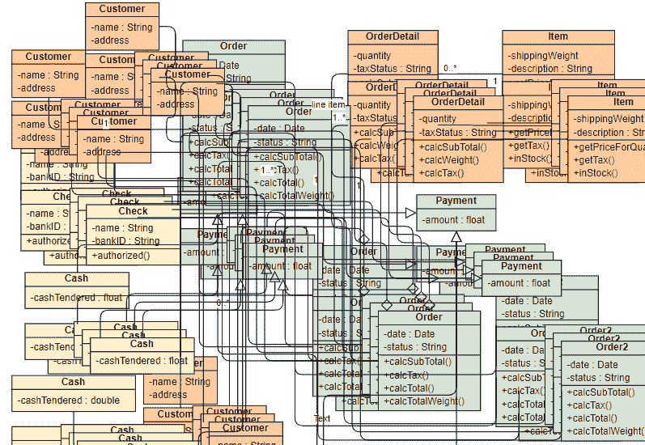

# 您应该在代码中避免使用反模式

> 原文：<https://www.freecodecamp.org/news/antipatterns-to-avoid-in-code/>

每个开发人员都希望编写结构化的、简单规划的、注释良好的代码。甚至有无数的设计模式给了我们清晰的规则去遵循，以及一个需要牢记的框架。

但是我们仍然可以在软件中找到反模式，这些反模式写得太慢或者太快。

一个无害的快速解决问题的基本技巧可以在你的代码库中建立一个先例。它可以跨多个位置复制，并变成您需要解决的反模式。

# 那么什么是反模式呢？

在软件中，反模式是一个描述如何解决代码中反复出现的问题的术语。反模式被认为是糟糕的软件设计，并且通常是无效的或者模糊的修复。

他们通常还会加上“技术债务”——也就是你必须回头正确修复*的代码。*

我将在本文中讨论的六种反模式分别是**意大利面代码**、**金锤**、**船锚**、**死代码**、**增殖代码**和**神物**。

# 意大利面条代码

**意大利面条代码**是最广为人知的反模式。它是几乎没有结构的代码。

没有模块化的东西。随机的文件散布在随机的目录中。整个流程很难理解，完全纠结在一起(就像意大利面条)。

通常，这是一个问题，有人没有仔细考虑他们的程序流程，只是开始编码。

### 它是做什么的？！我不明白这个



这不仅是一个维护的噩梦，而且几乎不可能增加新的功能。

你会不断地打破东西，不了解你的变化范围，或者对你的工作给出任何准确的估计，因为在做这样的考古/猜测时，不可能预见到无数突然出现的问题。

你可以在这里阅读更多关于**意大利面条代码**反模式的[。](https://en.wikipedia.org/wiki/Spaghetti_code#:~:text=Spaghetti code is a pejorative,and insufficient ability or experience)

# 金锤

> “我想，如果你唯一的工具是一把锤子，那么把一切都当成钉子是很有诱惑力的。”亚伯拉罕·马斯洛

想象一下我的情况:你的开发团队非常非常擅长全新的 Hammer 架构。它对你过去的所有问题都非常有效。你们是世界领先的锤子架构团队。

但是现在，不知何故，一切最终总是使用这种架构。平头螺丝？锤子。菲利普头螺丝？锤子。你需要内六角扳手吗？不，你没有，锤它。

你开始应用一种架构方法，这种方法并不完全符合你的需求，但却能完成工作。你过度依赖一种模式，需要为最好的工作学习最好的工具。

您的整个程序最终可能会受到严重的性能影响，因为您试图将一个正方形变成一个圆形。你知道，在这个问题上，使用 hammer 架构编写代码和执行程序需要两倍的时间，但这更容易，也更容易。

这也不太容易预测。不同的语言对它们面临的问题有共同的解决方法，也有它们自己的标准。你不能把一种语言中对你有效的每一条规则都毫无问题地应用到另一种语言中。

不要忽视职业生涯中的持续学习。为你的问题选择正确的语言。想想建筑，走出你的舒适区。研究和调查解决你面临的问题的新工具和新方法。

你可以在这里阅读更多关于**金锤**反模式的[。](https://sourcemaking.com/antipatterns/golden-hammer)

# 船锚

**船锚**反模式是程序员将代码留在代码库中，因为*他们以后可能会需要它。*

他们编写了一些稍微超出规范的代码，现在还不需要，但是他们确信下个月会需要。所以他们不想删。将它发送到生产部门，以后当他们需要它时，他们可以很快让它工作。

但是这导致了包含所有过时代码的代码库中的维护噩梦。最大的问题是，他们的同事将很难找出哪些代码是过时的，哪些代码没有改变流程，而哪些代码改变了流程。

想象一下，您正处于一个棘手的问题上，拼命地想弄清楚是什么负责将客户的卡详细信息发送给 API，以便从他们的银行提取资金。您可能会浪费时间阅读和调试过时的代码，而没有意识到您甚至没有处于代码库中正确的位置。

最后一个问题是，过时的代码会使你的构建时间变长，你可能会混淆工作代码和过时的代码。你甚至可能开始在生产中不经意地“打开它”。

现在你可能明白为什么它被称为船锚反模式了——它携带起来很重(增加了技术负担),但却什么也不做(相当字面的意思，代码没有任何用途，它不起作用)。

你可以在这里阅读更多关于**船锚**反模式的[。](https://sourcemaking.com/antipatterns/boat-anchor)

# **死代码**

你是否曾经不得不去看那些已经不在你公司工作的人写的代码？有一个函数看起来没有任何作用。但是到处都在叫！你四处打听，没人知道它在做什么，但每个人都太担心了，不想删除它。

有时候你可以看到它在做什么，但是上下文却不在。你能够阅读并理解这个流程，但是*为什么？*看起来我们不再需要达到那个终点了。对于每个不同的用户，响应总是相同的。

这通常被称为**死代码**反模式。当你看不到什么是你的程序的流程和成功执行所必需的“实际”代码，而不是 3 年前才需要的，现在不需要。

这种特殊的反模式在最终投入生产的概念证明或研究代码中更为常见。

有一次在一次技术会议上，我遇到了一个人，他也有同样的问题。他有成吨的死代码，他知道这些代码已经死了，而且他怀疑很多代码已经死了。但是他无法从管理层那里获得删除所有死代码的许可。

他称自己的方法为**猴子测试，**他开始注释掉并关闭一些东西，看看生产中出了什么问题。也许有点太冒险了！

如果你不喜欢**猴子测试**你的生产应用，试着把对管理层的技术债务框定为[“技术风险”](https://killalldefects.com/2019/12/24/technical-debt-as-risks/)来更好地解释为什么你认为整理是如此重要。

或者甚至写下您的特定模块/部分想要重写的所有内容，并采用迭代的方法一段一段地删除死代码。每次检查你没有打破任何东西。

你不必放弃一个有成千上万变化的巨大的重写。但是你要么理解为什么它如此重要，并记录为什么需要它，要么按照你的意愿删除死代码。

你可以在这里阅读更多关于**死代码**反模式的[。](https://sourcemaking.com/antipatterns/lava-flow)

# **代码扩散**

对象或模块定期与其他对象通信。如果你有一个干净的、模块化的代码库，你经常需要调用其他独立的模块和新的函数。

代码反模式的**扩散是当你的代码库中的对象只存在于调用另一个更重要的对象时。其目的只是作为中间人。**

这增加了一个不必要的抽象层次(增加了一些你必须记住的东西),除了让那些需要理解你的代码库的流程和执行的人迷惑之外，没有任何作用。

一个简单的解决方法就是删除它。把调用你真正想要的对象的责任转移给调用对象。

你可以在这里阅读更多关于代码反模式**扩散的[。]( https://flylib.com/books/en/4.425.1.31/1/)**

# 上帝物体

如果你的代码库中的每个地方都需要访问一个对象，那么它可能是一个 God 对象。

上帝做的事情太多了。他们负责用户 id、交易 id、客户的名字和姓氏、交易总额、用户购买的商品...你明白了。

它有时被称为**瑞士军刀**反模式，因为你只需要用它来切断一些麻线，但它也可以是指甲锉、锯子、镊子、剪刀、开瓶器和软木塞螺丝。

在这种情况下，你需要更好地分离和模块化你的代码。

程序员经常把这个问题比作要一根香蕉，却收到一只拿着香蕉的大猩猩。你得到了你想要的，但比你需要的更多。

坚实的原则在面向对象的语言中明确地讨论了这一点，以帮助我们更好地建模我们的软件([如果你不知道什么是坚实的原则，你可以阅读这篇文章](https://www.freecodecamp.org/news/solid-principles-explained-in-plain-english/))。

首字母缩略词中的 S 代表单一职责——每个类/模块/函数都应该对系统的一部分负责，而不是多个部分。

你可以一遍又一遍的看到这个问题，下面这个界面怎么样？

```
interface Animal {
        numOfLegs: string;
        weight: number;
        engine: string;
        model: string;
        sound: string;
        claws: boolean;
        wingspan: string;
        customerId: string;
} 
```

即使只是简单地浏览一下这个界面，你能看出它的责任太大了，需要重构吗？无论是谁实现了这一点，都有可能成为上帝的物品。

这个怎么样？

```
 interface Animal {
        numOfLegs: string;
        weight: number;
        sound: string;
        claws: boolean;
}

interface Car {
        engine: string;
        model: string;
}

interface Bird {
        wingspan: string;
}

interface Transaction {
        customerId: string;
} 
```

接口分离将使你的代码清楚责任在哪里，并且不再强迫只需要`wingspan`的类也实现`engine`、`customerId`和`model`等等。

你可以在这里阅读更多关于**上帝对象**反模式的[。](https://en.wikipedia.org/wiki/God_object)

# 结论

在任何大型代码库中，管理技术债务、开始新的开发和管理产品的一系列错误之间都有一个持续的平衡。

我希望这篇文章能帮助你发现什么时候你可能会掉进反模式的兔子洞，并提供一些工具来彻底解决这个问题。

如果你喜欢这篇文章，并想看更多，我在 Twitter 上分享我的文章。