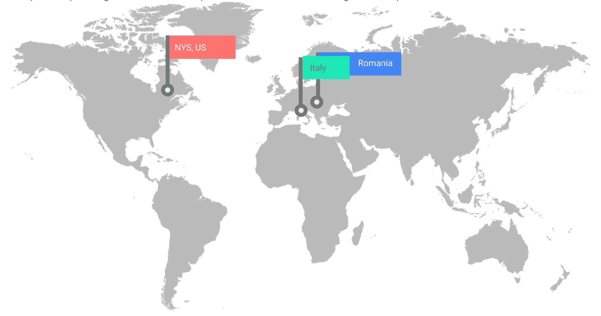
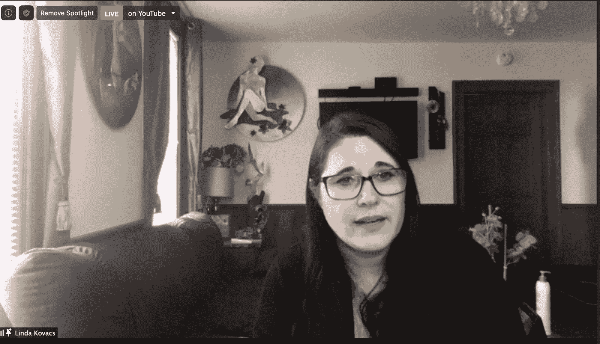
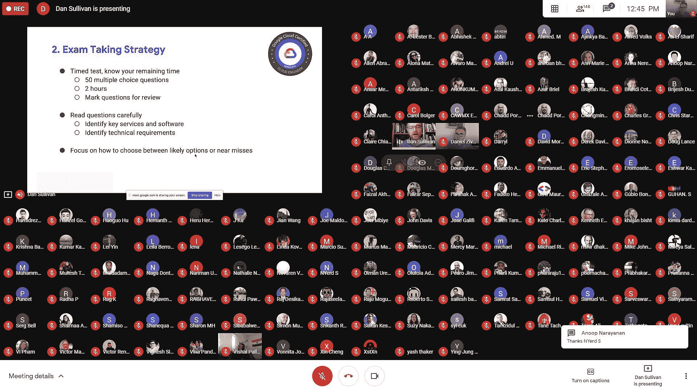
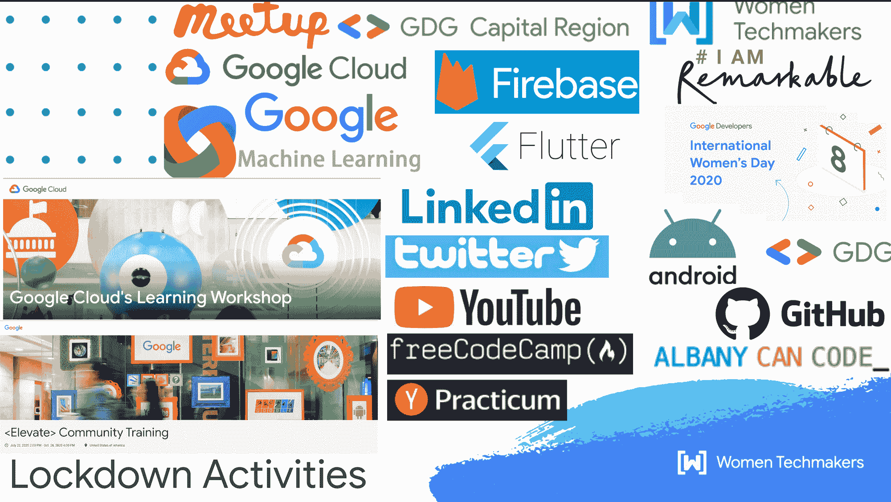

# 我是如何在封锁期间自学编程并找到工作的

> 原文：<https://www.freecodecamp.org/news/how-i-got-a-job-during-lockdown/>

我最近在埃森哲找到了一份软件工程师的工作。此后不久，我开始收到每个人关于我的旅程的问题——所以我决定把它写下来，这样人们可以从我的经历中受益。

我想激励其他人相信自己，继续他们的 web 开发之旅。希望我的故事给他们启发，让他们坚持下去，直到实现自己的梦想。

在我开始之前有一个简短的提示:我的成功是建立在我在疫情之前所做的许多活动之上的。我试图实现我的梦想，但疫情实际上让我的过程更快了。

我这样说，因为如果没有疫情，也许我会花更长的时间来决定前进，并准备好迈出职业生涯的下一步。

## 关于我和我对软件开发的热情的一点背景

我出生在罗马尼亚，在高中时，我开始在广播和电视台做了大约 5 年的记者。

在大学学习计算机科学两年后，我搬到了意大利，在那里生活了 12 年。起初我做翻译，然后做网页开发和设计。我还在业余时间为一家杂志做了 5 年的记者。

我十几岁时搬到美国的梦想终于在 2013 年实现了。搬家后不久，我开始志愿担任翻译和 IT 部门的工作。然后继续为一家公司做网页开发和设计。2018 年成为美国公民，开始了远程自由职业者全栈开发者的职业生涯。

2017 年我加入了 GDG 首都地区。2019 年 2 月，我成为了谷歌开发者团队的领导，我被提名为女性技术大使[。](https://www.freecodecamp.org/news/international-womens-day-2019-celebration/)

这是让女性更多参与编码活动和聚会的第一步。

Traveling across Europe and the US: living, working and studying

## 接下来的步骤:[编写训练营、聚会和赢得黑客马拉松](https://www.freecodecamp.org/news/how-joining-coding-bootcamps-meetups-and-winning-a-hackathon-changed-my-life-completely-2addc66f1665/)

### 生活的学校

软件开发的世界，以及一般的技术，发展得如此之快。所以，除非你愿意一直提高技能，否则要成为顶尖高手是不容易的。

我最大的问题是我的专业英语水平，这让我很难解释在工作面试中我需要说什么。

尽管我在大学里学过一些计算机科学，但我还是决定放弃它，去寻找自己的出路。多年来，我一直为自己放弃毕业梦想的决定而自责。

但是现在回想起来，我感觉好多了，因为我比只在一个国家生活的时候取得了更多的成就。我有机会生活在不同的地方，并改变了大陆。与此同时，我有机会学习新的语言。我喜欢周游世界，结交新朋友，追求不同的有趣的工作，等等。

然而这并不容易——很多时候我只想放弃一切。每天都充满挑战。我以为我永远也不会成功，我永远也不能学会说任何其他语言，因为在学校里，我学外语很差。但我做到了。

### 我的第一次网页开发和设计经历

在我的职业生涯中，我担任过各种各样的 IT 职位，从硬件到软件都有，这取决于我能做什么。

这些年来，我发现我最喜欢 Web 开发和设计，这一点在我的最终决定中占了很大比重。在意大利工作期间，我第一次接触到了网页开发和设计。

这家公司有一份他们打印出来的月刊。我能够将它转换成数字格式，并在我为他们的同事创建的网站的私人区域分发。

我能够把网站从一个静态的 5 页发展成一个功能齐全的网站，每天更新，还有一个私人区域。然后我继续为杂志建立了一个新的网站。

当我需要弄清楚一些事情时，我不得不通过谷歌搜索从头开始学习一切。

### 美国梦实现了

当我搬到美国时，我的网络开发经验派上了用场。我曾经在一家公司做网页开发和设计。我负责维护和更新四个网站和三个内部网站。我还创建了两个新网站，主要使用 PHP、JavaScript、HTML、CSS、JQuery 等等。

我还参与更新公司的宣传册、海报、传单、目录、徽标(Adobe Creative Suite)和 Adobe PDF 表单。和他们一起工作了四年后，我想自己创业。我开始阅读关于自由职业的书籍，并对其有了更多的了解。我甚至在 2018 年加入了自由职业者联盟，该联盟为自由职业者提供服务和咨询。

### 建立投资组合

先前的经验帮助我在 2018 年底开始自由职业，成为一名网络开发人员和设计师。

这也让我更容易用的作品集创建自己的网站。在那里，我展示了我从事的专业项目，以及我从 FreeCodeCamp、AlbanyCanCode、Hack Upstate/CareersInCode 和 Practicum 学习的项目。

我真的很喜欢做自由职业者。我开始不喜欢的唯一部分是处理所有的文书工作，如合同、医疗保险、税收等等——所有的事情都使用我不熟悉的英语。

这时候我又开始考虑申请大公司的工作了。我会有职业发展的机会，而且我也不用处理我不喜欢的东西，比如官僚表格和合同。

## 我的免费代码营体验

我是一名自学成才的网页开发和设计人员，2016 年开始学习新的编码语言比如 ES6，React，NodeJS on[**freeCodeCamp**](https://www.freecodecamp.org/lindakovacs)。我获得了五个认证中的四个(现在甚至更多),并且创建了大多数附带认证的项目，总共大约 16 个。

我花了大约两年时间完成课程和项目。这是我最新的编码技能的基础。

在学习 freeCodeCamp 课程的同时，我还兼职做网页开发和设计师。但是我并不总是能够在日常工作中实践我所学的东西，因为我使用不同的编程语言和不同的环境。

7 pull requests in GitHub to help Open Source freeCodeCamp Earth curriculum for the 2018 DigitalOcean Hacktoberfest challenge

## 我在 AlbanyCanCode 和 CareersInCode/HackUpstate 的经历

2019 年，我从 SUNY 举办的 [**AlbanyCanCode**](https://albanycancode.org/) 训练营毕业，该训练营专注于后端的前端 JavaScript 框架。

为了毕业，我们做了两个独立的项目:一个 Trello 板和一个 Good Reads 应用程序。我们还使用敏捷/Scum 方法进行了两个团队项目(研究生门户和数据可视化)。

为了构建我们的项目，我们使用了 Bootstrap、HTM5、CSS3、JavaScript、React、Redux、Axios、NodeJs、MongoDB、Mongoose 和 D3。这是一个很大的技术！

AlbanyCanCode Graduation

同样在 2019 年，我和我的团队凭借我们的[停车助手应用](https://devpost.com/software/parking-assistant)在 **[Hack Upstate XIII 黑客马拉松](https://medium.com/@hackupstate/hack-upstate-xiii-the-results-are-in-28c801576637)** 上赢得了两个奖项。为了构建这个项目，我们使用了 React Native、 [**Stae API**](https://medium.com/city-as-a-service/hack-upstate-debrief-24837aa2f77a) 、Heroku 和 Expo.io。

Hack Upstate XIII Hackathon - The Parking Assistant App Winner

我还获得了来自 [**CareersInCode**](https://medium.com/@hackupstate/careers-in-code-student-testimonials-16584bfa7e51) 的全栈开发者荣誉文凭。这是一个北部的训练营，我在那里帮助学生完成作业和顶点项目。

## 下一个:Yandex 实习

今年，由于冠状病毒的封锁，我决定接受来自女性编码的邀请，成为 Yandex 平台 **[实习的内测员。所以我加入了他们的 Web Developer 专业证书项目。](https://practicum.yandex.com/)**

Working remotely enjoying the beautiful days from my terrace in the backyard

当我加入这个项目时，我确信我以前的职业经验会让我轻松地冲浪。但是当我们谈到算法、JavaScript、React、NodeJs、数据库和后端部分时，我预料会有一些问题。这些领域通常更具挑战性，即使对于有经验的开发人员来说也是如此。

令我惊讶的是，我被以前我认为自己擅长的事情淹没了，比如 CSS。这是真的——我从来不知道像 BEM 这样的东西，这让我大吃一惊，在某种程度上让我感到困惑。这是艰难和令人沮丧的。

代码可重用性是训练营的主要焦点。实习课程通过最新的可访问性和 Web 标准增加了我的知识，使我成为一名更好的开发人员和设计人员。Practicum 的课程是专门设计的，在你完成了大部分基于理论的讲座后，你会直接陷入基于代码的挑战中。这意味着你必须找到反映真实世界经验的解决方案。

除了这些挑战之外，sprints 还为学生提供了独立完成项目和小组合作的空间。

该课程旨在帮助你建立自己的投资组合。你完成了 15 个项目，按照原始模型设计文件，并按照每个项目的指示添加功能。

您还可以通过 GitHub 使用专业开发人员的工作流程进行协作，这将有助于您未来的开发工作。

该计划长达 10 个月，审查过程和项目旨在为参与者提供真实的工作经验。它的目标是让你做好准备，随时加入任何公司的开发团队。

但这并不容易。当我在做项目的时候，我想放弃每一次冲刺。我觉得我不能坚持到最后，我很害怕失败。我本可以休学赶上进度，但我努力奋斗，并和我最初的同学在一起。

经历实习是一次奇妙的经历。我在这么短的时间里学到了这么多，并且有机会通过短跑和双周项目来检验我的技能。这种经历相当艰难，但却无比珍贵。

Practicum 还使用 GitHub 页面来部署我们创建的项目，这使我更容易公开展示它们。这无疑帮了我大忙，不仅展示了我的 GitHub 活动，还展示了我的最终项目(潜在雇主只需点击一下就能看到)。

## 然后冠状病毒疫情来袭

一旦封锁发生，我意识到我需要换个职业。许多人失去了工作，我们了解到改变是多么痛苦。所以我决定现在是换职业的时候了，是时候提升我的技能了。

在疫情大受欢迎之前，我们就已经知道每个人都必须数字化。如今，在线存在是必须的，数据和云是未来(和现在)。

封锁只是加快了转变的速度。我知道我需要不断提高技能来保持领先。我需要快速适应，忘记传统的方式，跳出框框思考，有创造力和创造力。

举几个例子，看看亚马逊和优步，看看他们对传统的做事方式造成了多大的破坏。这是你行动的正确时机。一切触手可及。投入时间，做出牺牲，很快就会有回报。

在疫情事件之前，我是一名自由职业者。我很幸运地从我在 GDG 聚会上认识的联系人和公司以及 AlbanyCanCode 那里得到了我的客户。我的生意开始增长，我为此感到非常自豪。

当然，疫情改变了一切。我知道我们真的是在一起。

## 我在禁闭期间做了什么

那时我开始评估形势。我决定花时间投资自己。我利用一级防范禁闭来思考我需要做些什么来提高我的技能。

我需要对自己负责并保持动力。这就是开发人员社区在我的锁定之旅中发挥重要作用的地方。

Online GDG Meetups

我实际上每晚只睡 4-5 个小时，参加我在网上能找到的所有课程。这些课程通常是付费课程，但在封锁期间，许多课程提供商在网上免费提供材料。

作为首都地区的 [**谷歌开发团队负责人**](https://gdg.community.dev/gdg-capital-region/) 和 **[女性技术大使](https://www.meetup.com/Google-Developer-Group-of-the-Capital-Region/events/past/)** ，我了解了谷歌和其他重要培训机构的培训机会。所以我把这些机会分享给了世界各地的 Meetup 社区。这帮助每个人都这样做了，我们一起提高了技能！

Online GDG Meetups

### 我通过 Google Meet 和 YouTube 组织了很多 GDG 首都地区的在线活动

我开始组织一系列联合在线活动**，由全球 GDG 牵头。这些让来自世界各地的与会者聚集在一起，分享我们的学习愿望。**

**我们邀请了来自谷歌和其他地方的优秀演讲者加入我们的行列，并与我们永远“饥渴”的社区成员分享他们的知识。赞助商提供了惊人的数字奖励，参加者获得了大量的新技能。**

**我们要提供很多额外津贴，比如:**

*   **免费 Udemy 和 Pluralsight 订阅**
*   **免费的奥莱利书籍和订阅**
*   **投资回报培训券**
*   **免费的 Qwiklabs 和其他免费的谷歌云认证资源**
*   **实习奖学金面向所有人，一些专门面向退伍军人，黑科技社区**
*   **为科技领域的女性开发一个项目**
*   **通过学院免费在线访问整个 Coursera 图书馆。**

**对我们所有人来说，这是一个双赢的局面！**

**

Lockdown Activities** 

### **我利用我的在线社交网络，比如 LinkedIn 和 Twitter**

**通过在网上分享所有这些活动，我看到我的社交网络如 LinkedIn 和 Twitter 上的活动大幅增加。我开始引起招聘经理的注意，他们开始联系我(现在仍然如此)询问空缺职位。**

**这让我更容易申请更有针对性的工作，因为我知道我的简历会被考虑，而且我会因为曝光率而得到工作面试。**

**帮助别人无疑帮助了我。我不是一个喜欢在社交网络上发帖的人，但如果我是有目的地发帖，那么我总是愿意这样做。**

**这不仅帮助了我，也帮助了我们的社区。当我看到我们社区成员的 LinkedIn 证明，他们正在庆祝通过我们共享的免费在线资源的谷歌云工程师认证，我为他们的成就感到高兴。**

### **我在开发者社区做志愿者**

**如你所见，我在在线技术社区非常活跃，我喜欢帮助他人成功。我总是试图在网上传播任何可能的机会。**

**我试图帮助解决编码问题，并在可能的情况下提供职业建议。有时，我会收到超出我处理能力的问题，我不得不推迟一些问题。有时候我不得不分清轻重缓急，选择我能做什么。我们每个人一天只有 24 个小时，但我是一个不喜欢说不的人，这让我很为难。**

**因此，我开始根据我能奉献给社区的时间做出选择。这帮助我避免了精疲力尽和在截止日期前过度紧张。**

**我喜欢帮助每个人，但同时当我需要在短时间内完成自己的最后期限时，我会感到压力。我不得不艰难地认识到，我是一个人，我可以做这么多。现在我已经学会了这一点，我仍然可以在社区内外成为一名积极的志愿者。**

### **我参加了谷歌的<elevate>社区培训项目</elevate>**

**在禁闭期间，我得到了另一个绝佳的机会。我参加了谷歌的<elevate>社区培训项目。Elevate 是一个为期 3 个月的项目，提供领导力、沟通、批判性思维和团队合作等领域的培训。</elevate>**

**该计划提供资源和内容，帮助参与者通过应用技能会议/研讨会增加他们的技能，帮助他们将职业生涯提升到一个新的水平。**

**这帮助我找到了定制我的 LinkedIn 个人资料的方法，以过滤我的求职。这样，潜在雇主会在我的简历中看到，我只对偏远的职位开放。**

**它还帮助我提高了面试技巧，完善了我的简历、求职信和求职方法。**

### **我加入了谷歌云的学习工作室**

**我还参加了一个为期 9 周的谷歌云研讨会，为我的云认证做准备。我得到了准备考试所需的所有材料。对于我们毕业前的最后一个项目，我们与团队合作构建了一个谷歌云解决方案。我做到了！

——所有这些项目和课程——**免费代码营、实习、AlbanyCanCode、HackUpstate、GDG Meetups、谷歌培训**(不胜枚举)——对我今天的成就起到了不可或缺的作用。**

## **一般什么时候适合应聘工作和远程工作？**

**这是远程工作的最佳时机——句号！有这么多职位空缺。就业市场已经改变，我们需要适应。**

**这种变化在历史上已经发生过很多次了，我们适应变化的能力对我们的成功起到了很大的作用。**

**在我的一生中，我有过大大小小的梦想。我总是在脑海中对每件事都有一个愿景，并写下我的目标。我通过完成帮助我实现梦想的小任务和步骤来为这些目标采取行动。**

**但是我做出了很多牺牲，这并不容易。我心里一直知道有一天我会成功的。如果我发现自己在一个地方或者和一些人在一起，而这些人不是我想要的，我会调整我的方向。**

**这就像带着指南针在森林里行走一样——你把它从口袋里拿出来检查，并不时调整你的轨迹，这样你就能到达你想要的目的地。**

### **如何准备面试**

**那么在开始求职之前，你要准备多少呢？嗯，我的答案是现在就开始申请。你将通过面试为你的工作面试做准备。**

**没有人仅仅通过阅读书籍和观看视频就能提高驾驶水平——你需要开始驾驶了！面试也是一样。你需要开始这个过程，首先从那些可能不是你首选的公司开始，然后从那些你愿意为之工作的公司开始。**

**这样你可以测试你的技能，看看你收到了多少电话，得到了多少面试机会，这将有助于你为理想的工作进行培训。**

**记住，你也可以向你理想的工作公司申请，对他们的面试过程有所了解。如果第一次没有拿到 offer，你可以准备的更充分一些，提升自己的技能，以后再申请。**

**在这个过程中，你会对公司和员工有更多的了解，你是否愿意和他们一起工作。**

**我面试过的一些公司都在我的梦想之列，但面试结束后，我感到失望，并决定我真的不想和他们一起工作。所以没有重新申请。**

**真的，面试就像约会:你不想每天花 8 个小时在一个有毒的地方，和只会毁掉你生活的有毒的人在一起。你需要在一个你喜欢的地方工作，和你喜欢的人在一起。**

### **对大公司的采访**

**我的梦想是在像谷歌、脸书或亚马逊这样的大公司工作——这就是为什么我总是申请所有这些公司。我也经历了求职面试过程。**

**我没有参加完所有的面试，但我获得了大公司面试流程的经验。我开始测试我的简历，看看它是否通过了自动扫描程序，并到达了一个人。我还经历了最初的电话筛选，并开始练习技术面试(这对我来说是最可怕的部分)。**

**最终，我得到了在那些我渴望工作的公司进行面试的机会。这为我最终的成功做好了准备。**

**我没有用在线工具测试我的简历，而是获得了真实的体验。当我没有得到这份工作时，我也会精心制作感谢信，并把它们寄给那些花时间训练我走向成功的面试官。**

**最重要的是(也是非常幸运的)，我没有严格的时间限制来快速找到工作，所以我不必接受任何出现在我面前的工作机会。我可以选择什么对我最有利。自 2018 年以来，我一直是一名自由职业者，我一直在准备中大奖。**

## **我的埃森哲之旅**

**去年，当我在 SUNY 大学上课时，我从 AlbanyCanCode 得知埃森哲有一个职位。**

**当我作为一名网页开发者和设计师开始远程自由职业工作时，AlbanyCanCode 一直在我身边，帮助我获得客户。去年我们毕业后，我就知道了这个职位，但在埃森哲的几轮面试后，不幸的是我没有成功。**

**今年，像往常一样，AlbanyCanCode 继续给我提供机会。嗯，我坚持了下来，又经历了一遍面试过程，然后我就来了。**

### **埃森哲面试流程**

**正如你可能会怀疑的那样，埃森哲的面试过程非常漫长。大公司通常需要 2-3 个月的时间来面试并找到合适的候选人。**

**你从两次人力资源面试和技巧开始，为技术面试做准备。人力资源经理和招聘人员是你最大的盟友——你应该尽可能多地问问题，这样他们才能帮你成功。**

**当然，你必须付出巨大的努力才能得到这个角色。对我来说，技术面试总是最可怕的部分，我使用 freeCodeCamp、Practicum、Hacker Rank 或 Code Wars 来准备算法和数据结构部分。**

**除了实际的面试准备，做你的项目组合，确保你在 GitHub 上是活跃的。技术面试官会去寻找那些东西，你会得到关于它们的问题。**

**其中一个技术面试将侧重于你的编码和分析思维能力，另一个将更侧重于你的解决问题和软技能。**

### **获得工作后在埃森哲的生活**

**所以我得到了这份工作！我最近以软件工程师的身份加入了埃森哲。目前我们正在训练，我们在九月中旬开始了定向训练。**

**第二周，我们在团队中进行项目工作，学习埃森哲的工作方法并为客户带来价值。**

**之后，我们开始就分配给我们的项目进行培训。因为埃森哲的客户包括财富 100 强公司、政府机构和其他高知名度的客户，所以我不能告诉你我的工作职责。但是我可以给我盘子里的东西一个概念。**

**我将从事一个 401k/退休计划产品的金融项目，我将加入设计团队。也许当我真正完成培训并加入我的团队时，我会被分配到一个新的项目，谁知道呢？**

**这是我知道我在与埃森哲合作的任何时候都能预料到的。我不会无聊的，这是肯定的。再说一次，我只需要能够拥抱变化并快速适应。**

### **我是如何以及为什么得到这份工作的**

**我认为被录用的最大因素是我坚持不懈，每天都准备尽我所能做到最好。这并不容易，需要花费大量的时间和精力不断地做大量的准备工作。**

**同样有帮助的是我的沟通能力，尽管我的英语有差距。我解决问题的技巧和我的决心无疑是我最有价值的技能。能够提问以获得澄清是非常有帮助的。**

**能够跳出框框思考，从不同的角度看待事物，这无疑给了我优势。**

**最后，我在不同国家生活的经历让我看到和学到了一些东西，否则如果我一生都住在同一个地方，我将无法做到这些。**

**事实上，我相信自己，我努力提高自己的技能，我保持动力，坚持不懈，最终都得到了回报。**

## **远程工作的好处**

**尽管我经常搬家，在世界各地工作，但我到达了人生中的一个转折点，远程工作是获得更多曝光率的必要条件。**

**我嫁给了一个在创作中使用铝的艺术家。他需要大型机械来改造艺术中的铝。几年前，我们已经为我以前的一份工作搬过一次家，搬运那些沉重的工具相当困难。**

**尽管我在 2018 年获得了谷歌 UX/UI 职位的面试机会，但这要求我搬到纽约——这是不可能的。**

**但是我也喜欢我的小镇。我在罗马生活了 7 年，这是一个真正的大都市(就交通和混乱而言，它很像纽约)。现在我发现我更喜欢并真正享受我在纽约州的平静生活。**

**但是进办公室呢？嗯，我在现场工作，总体来说我喜欢这种体验。我从与人相处中学到了很多，我能够提出问题并马上得到答案。远程创建这样的环境肯定会更加困难。**

**另一方面，作为一名自由职业者，现在为埃森哲工作，远程工作让我更有效率。我可以更有效地利用开车去上班或和公司里的人聊天的时间。**

**当我需要的时候，我也有机会脱离一切，专注于我当前的项目。**

**幸运的是，在埃森哲营造的这种环境中，这很容易做到，因为埃森哲的基础是与来自世界各地的 50 多万名员工建立联系。如果您需要帮助，您可以在内部门户网站上发布问题。你会发现很多同事愿意帮助你，尽快回答你的问题。**

**能够在自己的环境中工作不仅让我更有效率，同时也更有创造力。当天气不好的时候，从我的窗户看到太阳、雨或雪而不用出去是没有代价的。我也可以选择在我后院的露台上工作，享受美丽的天气。**

**通过远程工作，我有更多的时间和我的丈夫以及我们的宠物在一起。我可以通过使用埃森哲的培训计划和商务英语及云上的技术书籍来继续提高技能。**

## **那么下一步是什么？**

**我明年的职业重点将是与我的团队一起成长，并为我正在从事的项目做出有价值的贡献。**

**在埃森哲，有很多职业发展的机会，这正是我所寻找的。我正在努力提高自己的技能，并期待新的冒险——但首先我必须传递信任、价值和信誉，并在公司扎根。然后我就开始成长，像一棵树一样。**

**我可以说这是我生活中的一个巨大变化——这是我的梦想成真。我对未来充满期待。**

**与此同时，我还有很多东西要学，我必须一天一天地生活，一步一步地前进。我的英语仍在进步，有时我不得不克服我的语言差距。幸运的是，和来自世界各地的人一起工作让我更容易学习和获得自信。**

**实现我的梦想是不断变得更好的巨大动力。我努力工作，牺牲了很多才来到这里，现在我必须付出更多的努力继续前进。**

**幸福不仅仅是达到我们的目标，而是达到这些目标的过程。得到我喜欢的工作让我觉得这不是一份工作，而是我的激情。**

**我是一个梦想家，这让我想在我的职业生涯中成长，在我正在做的事情上做得更好，并向前迈进。我喜欢挑战，并期待着更多的挑战。我希望每天都能成长，成为一个更好的我。这只是我生命中一个伟大故事的开始！**