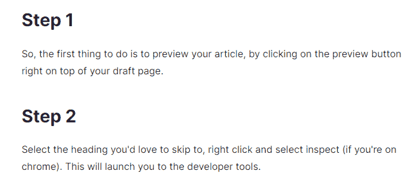
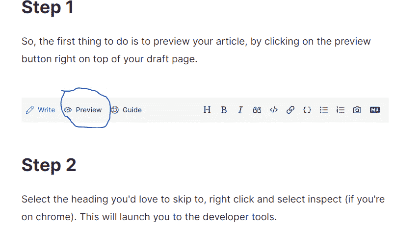
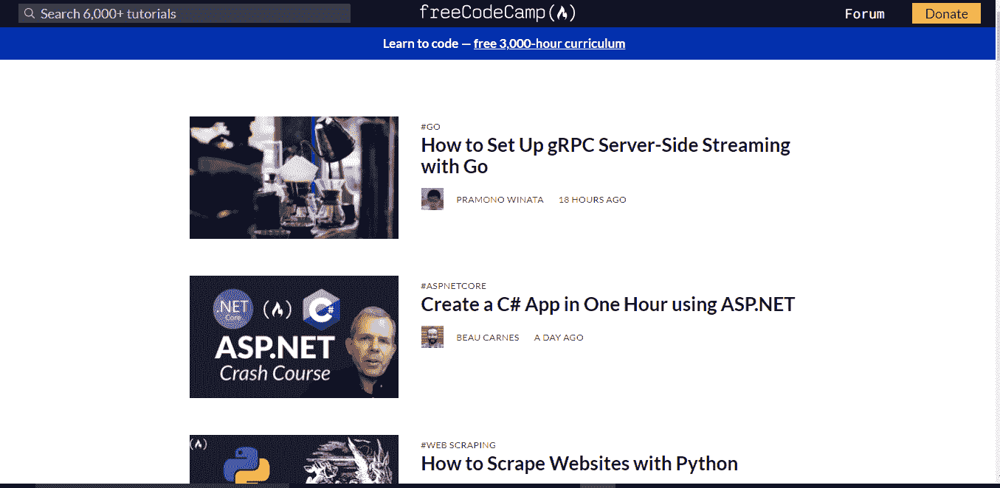

# 新手技术写作——技术博客基础 A-Z 指南

> 原文：<https://www.freecodecamp.org/news/technical-writing-for-beginners/>

如果你热爱写作和技术，技术写作可能是一个适合你的职业。如果你热爱技术，但不喜欢整天写代码，这也是你可以做的事情。

如果你喜欢通过教别人、为开源项目做贡献以及教别人如何做来学习，或者基本上喜欢通过写作以简单的方式解释复杂的概念，那么技术写作也可能适合你。

让我们深入基础知识，了解在开始技术写作时应该知道和考虑的内容。

## 目录

在本文中，我们将了解:

*   [什么是技术写作](#what-technical-writing-is)
*   [技术写作的好处](#benefits)
*   [作为技术写作者必备的技能](#some-necessary-skills)
*   [技术写作流程](#the-technical-writing-process)
*   [发表文章的平台](#platforms-for-publishing-your-articles)
*   [技术写作课程](#technical-writing-courses)
*   [技术写作论坛和社区](#technical-writing-forums-and-communities)
*   [跟随一些了不起的技术作家](#Some-amazing-technical-writers-to-follow)
*   [最终文字和参考文献](#final-words)

## 什么是技术写作？

技术写作是一门艺术，提供面向细节的指导，以帮助用户理解特定的技能或产品。

技术作者是写这些说明的人，也称为技术文档或教程。这可能包括用户手册、在线支持文章或面向编码人员/API 开发人员的内部文档。

技术写作者以一种展示技术信息的方式进行交流，这样读者就可以将这些信息用于预期的目的。

## 技术写作的好处

技术作家是终身学习者。因为这份工作需要用简单明了的术语来表达复杂的概念，所以你必须精通你所写的领域。或者愿意去了解它。

这很好，因为随着你研究和撰写每一份新的技术文档，你将成为该领域的专家。

技术写作也能让你更好地理解用户。它帮助你更多地关注产品的读者或用户的感受，而不是你的想法。

你也可以通过为组织做贡献来赚钱。下面是一些付钱让你为他们写文章的组织，比如 T2 砸杂志，T4 AuthO，Twilio，T7，T8 堆栈溢出，T9。

除此之外，你还可以为开源社区做贡献，参与付费的开源项目，比如 [Google Season of Docs](https://edidiongasikpo.com/how-to-crack-the-google-season-of-docs-application-process-for-2020) 和 [Outreachy](https://outreachy.org) 。

你也可以把技术写作作为全职工作——很多公司都需要具备这些技能的人。

## 作为技术写作者必须具备的技能

### 理解正确英语的用法

在你考虑写作之前，有必要很好地掌握英语，它的时态，拼写和基本语法。你的读者不想看到一篇充斥着错误语法和糟糕用词的文章。

### 知道如何简单明了地解释事情

知道如何实现一个特性并不一定意味着你可以清楚地向他人传达这个过程。

为了成为一名好老师，你必须有同理心，能够以适合你的目标受众的方式教授或描述术语。

> 如果你不能向一个六岁的孩子解释，你自己也不会理解。[人名]阿尔伯特·爱因斯坦(犹太裔理论物理学家)

### 拥有一些写作 skills‌‌

我相信作家是后天培养的，不是天生的。你只能通过实际写作来学习如何写作。

在你动笔之前，你可能永远不会知道自己有写作的能力。只有一个方法可以知道你是否有写作技巧，那就是写作。

所以我鼓励你从今天开始写。你可以选择从我在本节中[列出的任何一个平台开始，来伸展你的写作肌肉。](#Platforms-for-publishing-your-articles)

当然，拥有某个技术领域的经验也是一个巨大的好处。

## 技术写作过程

### 分析并理解谁是你的读者

当你写一篇技术文章时，要考虑的最大因素是你的预期读者。它应该永远在你的脑海里。

一个好的技术作家基于读者的背景来写作。**举个例子**，假设你正在写一篇针对初学者的文章。重要的是不要假设他们已经知道某些概念。

你可以通过概述任何必要的先决条件来开始你的文章。这将确保你的读者在进入你的文章之前已经(或者能够)获得他们需要的知识。

您还可以包含有用资源的链接，这样您的读者只需点击一下就可以获得他们需要的信息。

为了知道你在为谁写作，你必须收集尽可能多的关于谁将使用这个文档的信息。

重要的是要知道你的听众是否有这个领域的专业知识，这个话题是否对他们来说是全新的，或者他们是否介于两者之间。

你的读者也会有自己的期待和需求。你必须确定当读者开始阅读文档时，他们在寻找什么，以及他们将从中获得什么。

为了理解你的读者，在你开始写作之前，问自己以下问题:

*   谁是我的读者？
*   他们需要什么？
*   他们将在哪里读书？
*   他们什么时候会读书？
*   他们为什么要读书？
*   他们将如何阅读？

这些问题也有助于你思考你的读者在阅读你的作品时的体验，我们现在将对此进行更多的讨论。

### 考虑用户体验

用户体验在技术文档中与在网络上的任何地方一样重要。

既然你已经了解了你的读者和他们的需求，请记住文档本身是如何满足他们的需求的。人们很容易忽略读者实际上是如何使用文档的。

当你写的时候，不断后退，看着文档，就像你是读者一样。扪心自问:是否可以实现？你的读者会如何使用它？他们什么时候会使用它？容易导航吗？

目标是写一个对你的读者既有用又有用的文档。

### 规划您的文档

记住谁是你的用户，然后你就可以构思和设计你的文档。

这一过程包括许多步骤，我们现在来看一下。

#### 对主题进行彻底的研究

在计划你的文档时，你必须研究你要写的主题。有大量的资源，只需谷歌搜索一下，你就可以消费并从中获得更深刻的见解。

不要试图抄袭别人的作品或文章，然后冒充自己的，因为这是剽窃。相反，使用这些资源作为你工作的参考和想法。

尽可能多地搜索，从研究期刊、书籍或新闻中获取事实和数据，尽可能多地收集与你的主题相关的信息。然后就可以开始做大纲了。

#### 做一个提纲

在展开之前概述文档的内容有助于你以更集中的方式写作。它也让你组织你的想法，实现你的写作目标。

大纲也可以帮助你确定你希望你的读者从文档中得到什么。最后，它建立了完成写作的时间表。

#### 获取相关图形/图像

有一个提纲非常有助于确定你需要在文档的不同部分嵌入的各种虚拟辅助工具(信息图、gif、视频、tweets)。

如果你把这些相关的图片放在手边，这将使你的写作过程更加容易。

### 以正确的风格写作

终于可以开始写了！如果你完成了所有这些步骤，写作应该会变得容易得多。但是你仍然需要确保你的写作风格适合技术文档。

写作需要通俗易懂、直接且专业。华丽或情绪化的文字在技术文档中是不受欢迎的。为了帮助你保持这种风格，这里有一些你应该培养的关键特征。

#### 使用主动语态

在你的文章中使用主动语态是个好主意，因为它比被动语态更容易阅读和理解。

主动语态意味着句子的**主语**是主动执行动词的**动作**的人。被动语态意味着**主语**是动词**动作**的接受者。

这里有一个**被动语态**的例子:文档应该被每个 web 开发者每年阅读六次。

这里有一个**主动声音**的例子:每个 web 开发人员应该每年阅读这个文档 6 次。

#### 小心选择你的词语

选词很重要。确保你在上下文中使用了最好的词。避免过度使用代词，如“it”和“this ”,因为读者可能很难识别他们所指的名词。

还要避免俚语和粗俗的语言——记住你是在为更多的读者写作，他们的性格和文化倾向可能与你不同。

#### 避免过多的行话

如果你是你所在领域的专家，很容易使用你熟悉的行话，而没有意识到它可能会让其他读者感到困惑。

你也应该避免使用你以前没有解释过的缩略语。

**这里有一个例子**:

不太清楚的是:**pwa**确实被认为是多平台开发的未来。它们在 Android 和 iOS 上的可用性使它们成为未来的应用。

改进:**渐进式 Web 应用程序(PWAs)** 真正是多平台开发的未来。它们在 Android 和 iOS 上的可用性使得 **PWAs** 成为未来的应用。

#### 使用简单的语言

使用更少的单词，以任何读者都能理解的方式写作。‌‌避免大篇幅的文字。尽可能清晰地解释概念和术语。

#### 视觉格式化

一墙的文字很难阅读。即使是最清晰的说明也可能在视觉表现不佳的文档中丢失。

他们说一张照片胜过千言万语。即使在技术写作中也是如此。

但是并不是所有的图片都值得作为技术文档。技术信息很难只用文字来表达。一个合适的图像或图表可以澄清你的解释。

人们也喜欢视觉效果，所以把它们插入合适的位置会有所帮助。想想下面的图片:

首先，这是一个没有视觉效果的博客片段:

这是同一个博客的片段，但是有视觉效果:

在你的文章中添加图片会使内容更具关联性，更容易理解。除了图片，你还可以在必要的地方使用 gif、表情符号、嵌入(社交媒体、代码)和代码片段。

深思熟虑的格式、模板、图像或图表也会让你的文本对读者更有帮助。你可以从@ Bolajiayodeji 找到下面的技术写作模板。

#### 做一个仔细的回顾

任何类型的好文章都必须没有拼写和语法错误。这些错误可能看起来很明显，但是要发现它们并不容易(尤其是在冗长的文档中)。

在点击“发布”之前，一定要仔细检查你的拼写(你知道，在你的“是”上点点，在你的“是”上划叉)。

有很多免费的工具，比如语法上的和 T2 的海明威应用，你可以用来检查语法和拼写错误。你也可以和别人分享你的文章草稿，以便在发表前校对。

## 在哪里发表你的文章

既然你已经决定从事技术写作，这里有一些好的平台，你可以开始免费发布技术内容。他们还可以帮助你建立一个有吸引力的投资组合，供未来的雇主查阅。

[**Dev.to**](https://dev.to) 是一个由数千名技术人员组成的社区，作者和读者可以在这里进行有意义的交流，分享想法和资源。

[**Hashnode**](https://hashnode.com) 是我最喜欢的博客平台，它提供了很多额外的好处，比如自定义域名映射和一个互动社区。在这个平台上建立一个博客也很简单快捷。

freeCodeCamp 有一个非常大的社区和读者群，是一个发表文章的好地方。然而，你需要用一些以前的写作样本来申请他们的出版物。

你的申请可能被接受，也可能被拒绝，但不要气馁。当你变得更好的时候，你随时可以重新申请，谁知道呢？你可能会被录取。

如果你真的为他们写作，他们会在发表前审阅和编辑你的文章，以确保你尽可能发表最完美的文章。他们还会在社交媒体平台上分享你的文章，以帮助更多人阅读。

Hackernoon 拥有超过 7000 名作家，可以成为一个很好的平台，让你开始向社区中超过 200，000 名每日读者发布文章。

Hacker Noon 通过在平台上发布文章之前校对文章来支持作者，帮助他们避免常见错误。

## 技术写作课程

就像在其他领域一样，在技术写作中有各种各样的过程、规则、最佳实践等等。

参加技术写作的课程会帮助你了解你需要学习的每一件事，也会给你极大的信心来启动你的写作之旅。

这里有一些技术写作课程，你可以去看看:

*   [谷歌技术写作课程](https://developers.google.com/tech-writing)(免费)
*   Udemy 技术写作课程(付费)
*   [Hashnode 技术写作训练营](https://hashnode.com/bootcamp/batch-2)(免费)

## 技术写作论坛和社区

> 单独我们能做的很少，团结在一起，我们能做很多

与和你有同样激情的人一起成为社区或论坛的一部分是有益的。你可以从社区中的其他作者那里获得反馈、纠正、提示，甚至学习一些风格技巧。

这里有一些社区和论坛供您加入:

*   [哈希节点](https://hashnode.com)
*   [开发到](https://dev.to)
*   [技术写作世界](http://technicalwritingworld.com/forum)
*   [技术作家论坛](https://www.linkedin.com/groups/112571/profile)
*   [写文档论坛](http://forum.writethedocs.org/)

## 一些了不起的技术作家值得关注

在我的技术写作之旅中，我跟随一些伟大的技术作家，他们的写作之旅、连贯性和风格激励了我。

这些是我所敬仰的作家，我认为他们是技术写作的虚拟导师。有时，他们会提供一些我认为有用的技术写作技巧，并从中受益匪浅。

以下是其中一些作者(他们的推特账号有超链接):

*   昆西·拉森
*   [伊迪翁·阿西克波](https://twitter.com/didicodes)
*   [Catalin Pit](https://twitter.com/catalinmpit)
*   [维多利亚·罗](https://twitter.com/lo_victoria2666)
*   博拉吉阿约吉
*   [安卡拉达](https://twitter.com/amrutaranade)
*   克里斯·邦格斯
*   科尔比·法约克

## 最后的话

你不需要一个技术写作的学位就可以开始发布技术内容。你可以开始在你的个人博客和公共 GitHub 库上写作，同时建立你的作品集并获得实践经验。

真的——开始写吧。

通过为现有程序或项目创建新文档来练习。GitHub 上有许多开源项目，您可以查看并添加到它们的文档中。

有没有一个你爱用的 app，但是它的文档写的很差？写下你自己的想法并在网上分享以获得反馈。你也可以在 [hashnode](https://hashnode.com) 上快速建立你的博客并开始写作。

> 你通过写作来学习写作，通过阅读和思考作家是如何创造他们的角色和编造他们的故事的。如果你不是读者，就别想当作家。-让·m·奥尔

技术作家总是在学习。通过潜入新的主题领域和接受外部反馈，一个好的作家永远不会停止磨练他们的手艺。

当然，好的作家也是贪婪的读者。通过回顾高阅读率或高使用率的文档，你自己的写作肯定会提高。

迫不及待想看你的技术文章！

### 参考

[技术写作入门](https://www.bittbox.com/advice/introduction-technical-writing) ‌‌

[如何撰写一篇技术文章](https://amarachiazubuike.com/how-to-structure-a-technical-article-ckg9yiy9c01sns9s17jk1aazd) ‌‌

[了解你的受众，原因和方式](https://edidiongasikpo.com/understanding-your-audience-the-why-and-how)

‌‌ [技术写作模板](https://github.com/BolajiAyodeji/technical-writing-template)

我希望这有所帮助。如果是这样，请在 [Twitter](https://twitter.com/msamarachukwu) 上关注我，并告诉我！