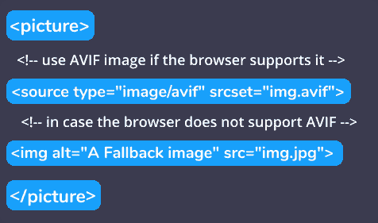

# 什么是 AVIF？如何在你的网站上使用 AV1 图像格式的图像

> 原文：<https://www.freecodecamp.org/news/how-to-use-avif-images-on-your-website/>

AV1 图像格式，或 AVIF，是地球上最新的图像编解码器。AVIF 是一种优化的图像格式，旨在保持相同质量(无损)的同时缩小图像。AVIF 的文件扩展名为`.avif`。

在这篇文章中，我想谈谈它的特点和好处，以及为什么你应该开始使用 AVIF。我还会告诉你在你的网站上包含 AVIF 图片的安全方法。

## 什么是 AVIF，它是如何工作的？

AVIF 是从现在流行的视频格式 [AV1](https://en.wikipedia.org/wiki/AV1) 的关键帧中提取出来的，该格式由[开放媒体联盟(AOM)](http://aomedia.org/) 开发。

AOM 开发 AVIF 的目标是提供免版税的图像，与现有的图像格式相比，具有更好的压缩效率和更多的功能支持。

AVIF 现在有来自谷歌、网飞和苹果等大公司的支持者。

## 为什么 avibetter？

继其前辈( **WebP** 、 **JPEG-XR** 、 **JPEG2000** 和 **PNG** 、 **GIF** )之后，AVIF 兼容高动态范围成像。它支持全分辨率下的 **10-** 和 **12 位**色彩，可生成比其他已知格式小 10 倍的图像。

AVIF 是网络开发者的好选择，因为:

*   它是免版税的，所以你可以免费使用，不用担心许可问题。
*   它目前得到了谷歌、亚马逊、网飞、微软等科技巨头的支持。
*   它有最佳的压缩。
*   它具有更多现代功能，如透明度、HDR、宽色域等。

## 如何开始使用 AVIF 图像

现在我们进入本教程的有趣部分。开始使用 AVIF 图像有两种主要方式:

1.  一种是把你的旧图像转换成 AVIF。
2.  另一种是通过使用 AVIF 支持的图像编辑器创建 AVIF 图像。

### 如何将您的旧图像转换为 AVIF

因为 AVIF 仍处于起步阶段，创建 AVIF 格式图像的最简单方法是转换旧格式。

这可以简单地在网上完成，因为有许多在线 AVIF 图像转换器。AVIF 在线转换器是我的选择，因为它更简单，似乎是最快的在线转换器。

只需按照以下步骤将您的图像转换为 AVIF:

1.  访问[网站](https://avif-converter.online/)。
2.  上传你的旧图片(可以是 **PNG** 、 **JPEG** 、* * GIF * *等)。
3.  请等待网站处理转换。
4.  保存您的新 AVIF 文件。

### 如何使用 AVIF 支持的图像编辑器创建 AVIF 图像

图像编辑器增加了对 AVIF 图像创建的支持。这些编辑器现在完全支持 AVIF 图像:

*   微软画图——从[“19 h1”更新](https://www.howto-connect.com/windows-10-1903-version-support-avif-file-type/)开始，你现在可以在微软画图上以“另存为”AVIF 的方式绘制图像。
*   GIMP for Windows 和 Linux 现在从 2.10.22 更新开始[支持 AVIF。](https://www.ghacks.net/2020/10/09/gimp-2-10-22-update-introduces-support-avif-and-heic-support/)
*   Photoshop 开发者也在讨论如何支持 AVIF。希望这将很快得到支持。

## 如何在你的网站上使用 AVIF

AVIF 仍然是一项相对较新的技术。但是现在大多数现代浏览器都支持这种格式，这意味着你可以直接在``标签中使用它。请记住，并非所有的浏览器都完全支持这种格式。

使用 AVIF 的最佳方式是与**进行内容协商。**我们将使用 HTML 5 `<picture>`和支持内容协商的`<source>`。

你可以在这里用来玩转[这个活生生的例子。](https://lyty.dev/diy/how-to-use-avif-on-website.html)

### 哪些浏览器支持 AVIF

*   第一个完全支持 AVIF 的浏览器是 Chrome 85。
*   微软 [Windows 10](https://www.howto-connect.com/windows-10-1903-version-support-avif-file-type/) 也在“19H1”更新中增加了支持。
*   Mozilla 仍在努力支持 Firefox 中的图像格式。[155].

## 包扎

AVIF 是一个游戏改变者，它将很快成为世界上事实上的图像格式。由于其潜在的功能，它很可能很快会在所有平台上获得全面支持。

不像谷歌花了整整 10 年时间来支持的 WebP 形象，AVIF 很快吸引了苹果的兴趣，以至于他们现在为这个项目做出了贡献。

你准备好开始在你的网站上使用 AVIF 了吗？