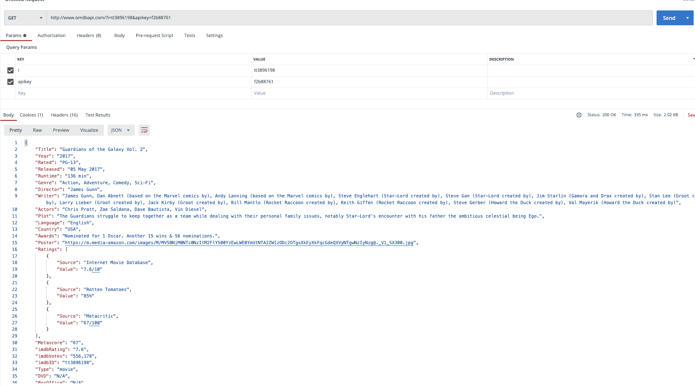
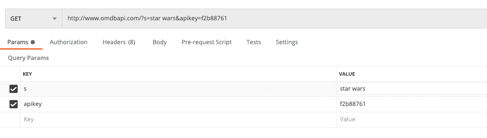
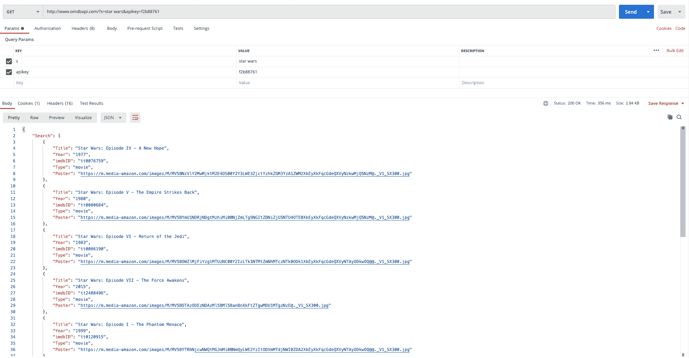
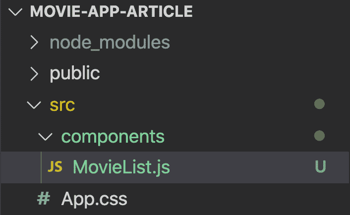
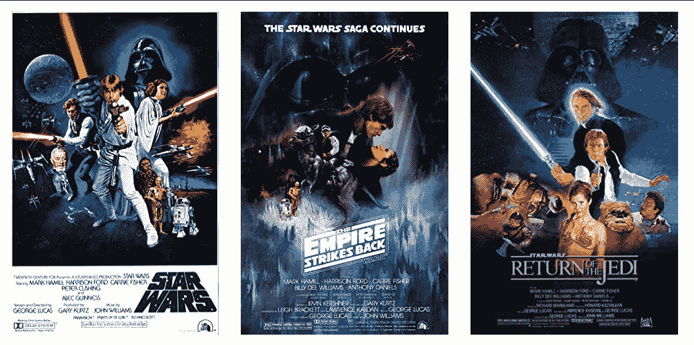
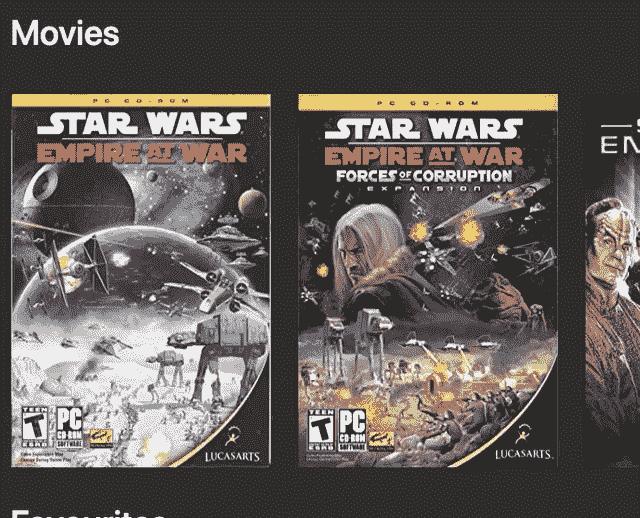
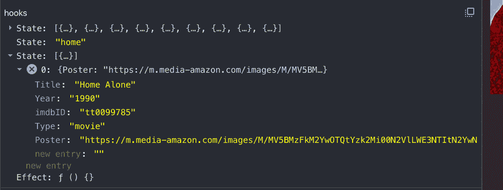
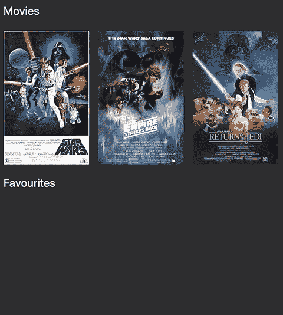
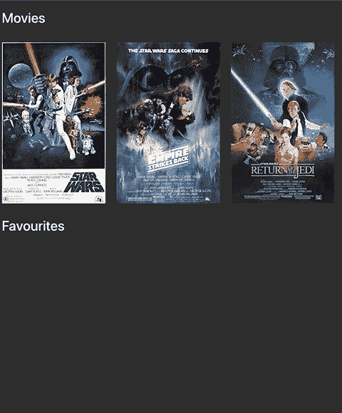
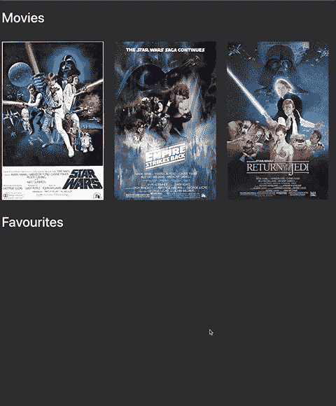

# React 电影应用教程-用 React 和 OMBD API 构建一个有趣的组合项目

> 原文：<https://www.freecodecamp.org/news/react-movie-app-tutorial/>

在本 React 电影应用教程中，我们将:

*   使用真正的 API 在我们打字时搜索电影
*   创造“网飞风格”的水平滚动效果
*   在我们的收藏夹中添加和删除电影
*   将我们的收藏夹保存到本地存储，以便在应用程序刷新时显示

### 这是我们将要构建的:


如果你想补充你的阅读，这里有一个视频演示。

[https://www.youtube.com/embed/jc9_Bqzy2YQ?feature=oembed](https://www.youtube.com/embed/jc9_Bqzy2YQ?feature=oembed)

Don't forget to [subscribe](https://youtube.com/c/ChrisBlakely?sub_confirmation=1 )! 

最后，如果你在跟随过程中迷路了，[你可以在这里](https://github.com/chrisblakely01/react-movie-app)(在 GitHub 上)找到完整的代码。

## 我们走吧！

如果我们没有任何电影可以展示，我们的电影应用程序就没有任何用处。

我们将使用 [OMDB API](http://www.omdbapi.com/) 作为我们的电影来源。这个 API 是免费使用的，我们所要做的就是注册并获得一个 API 密钥。

## 如何获取 API 密钥

去[http://www.omdbapi.com/apikey.aspx](http://www.omdbapi.com/apikey.aspx)并填写表格。您应该会收到这样一封电子邮件:


单击激活链接(以绿色突出显示)，您就可以开始了。呜哇！

## 用 PostMan 探索 API

这是一个可选的步骤，所以如果你想进入反应-y 善良随意跳到下一节。

我们将使用 Postman ( [下载 if 如果你还没有得到它](https://www.postman.com/downloads/))来玩 API。

启动 Postman，并粘贴您在电子邮件中收到的“OMBb API”URL(在上图中以黄色突出显示)。单击“发送”,您应该会在“正文”部分收到一些 JSON，如下所示:



任务成功！嗯，任务的一部分是成功的——毕竟我们在这里才刚刚开始。但这意味着我们电子邮件中的 URL 工作正常，我们的 React 应用程序将能够检索电影。

## 如何按标题搜索电影

到目前为止，我们已经使用 API 检索了一部电影，但是我们想要做的是搜索“包含搜索词的标题”。为此，我们将查询参数`i`更改为`s`，如下所示:



这将在 API 中查询标题中包含“星球大战”的所有电影。再次点击“发送”，这一次你会看到不同的回应:



注意我们是如何接收到一组项目的。数组中的每一项都包含一部电影的一些细节(标题、年份等等)。我们将为每个对象获取**海报**图像，并将其显示在我们的应用程序中

## 如何建立一个 React 项目

好了，现在我们可以进入正题了——创建一个 React 项目。我们将利用`create-react-app`快速起飞。

启动终端并键入:

`npx create-create-app movie-app`

当它完成它的工作后，我们将添加 Bootstrap 来帮助我们很好地定位东西，而不需要太多我们自己的 CSS。

运行以下命令:

```
cd movie-app
npm install boostrap
```

这就是我们所需要的，所以继续运行应用程序吧:

`npm start`

## 如何将电影添加到状态

**App** 组件将保存应用的状态。这样，我们可以将所有东西组织在一个地方，并将不同的状态片段传递给不同的组件。

打开`App.js`，删除所有内容，并替换为以下内容:

```
import React, { useState, useEffect } from 'react';
import 'bootstrap/dist/css/bootstrap.min.css';
import './App.css';

const App = () => {
	const [movies, setMovies] = useState([        {
            "Title": "Star Wars: Episode IV - A New Hope",
            "Year": "1977",
            "imdbID": "tt0076759",
            "Type": "movie",
            "Poster": "https://m.media-amazon.com/images/M/MV5BNzVlY2MwMjktM2E4OS00Y2Y3LWE3ZjctYzhkZGM3YzA1ZWM2XkEyXkFqcGdeQXVyNzkwMjQ5NzM@._V1_SX300.jpg"
        },
        {
            "Title": "Star Wars: Episode V - The Empire Strikes Back",
            "Year": "1980",
            "imdbID": "tt0080684",
            "Type": "movie",
            "Poster": "https://m.media-amazon.com/images/M/MV5BYmU1NDRjNDgtMzhiMi00NjZmLTg5NGItZDNiZjU5NTU4OTE0XkEyXkFqcGdeQXVyNzkwMjQ5NzM@._V1_SX300.jpg"
        },
        {
            "Title": "Star Wars: Episode VI - Return of the Jedi",
            "Year": "1983",
            "imdbID": "tt0086190",
            "Type": "movie",
            "Poster": "https://m.media-amazon.com/images/M/MV5BOWZlMjFiYzgtMTUzNC00Y2IzLTk1NTMtZmNhMTczNTk0ODk1XkEyXkFqcGdeQXVyNTAyODkwOQ@@._V1_SX300.jpg"
        }]);

	return (
		<div className='container-fluid movie-app'>
			<div className='row'>

			</div>
		</div>
	);
};

export default App; 
```

*   我们正在创建一个状态对象来保存我们的电影列表。这最终将来自 API，但现在我们只是对一些数据进行硬编码——这些数据来自 Postman 中的响应。
*   我们正在添加来自 Bootstrap 的 CSS 并添加一些基本的标记

如果您保存/运行该应用程序，您将会看到，尽管我们已经设置了一些状态，但我们还没有呈现任何内容，因此屏幕将是空白的。

## 如何创建 MovieList 组件

啊，我们的第一个组件！我们将创建一个 **MovieList** 组件来显示搜索请求中返回的电影列表。

在 **src** 文件夹下创建一个名为**组件**的新文件夹。在组件文件夹中创建一个名为 **MovieList.js:** 的新文件



打开 MovieList.js 并添加以下内容:

```
import React from 'react';

const MovieList = (props) => {
	return (
		<>
			{props.movies.map((movie, index) => (
				<div className='image-container d-flex justify-content-start m-3'>
					</img>
				</div>
			))}
		</>
	);
};

export default MovieList; 
```

*   我们将传入一系列电影作为**道具**
*   我们将使用地图功能来循环播放这些电影
*   对于每部电影，我们将使用海报 URL 作为图像源来显示一张**图像**

## 如何呈现我们的电影列表

在我们看到东西在浏览器中工作之前，只差一步了——你兴奋吗？！

跳回 **App.js** ，用以下内容更新它:

```
import React, { useState, useEffect } from 'react';
import 'bootstrap/dist/css/bootstrap.min.css';
import './App.css';
import MovieList from './components/MovieList';

const App = () => {
	const [movies, setMovies] = useState([
		{
			Title: 'Star Wars: Episode IV - A New Hope',
			Year: '1977',
			imdbID: 'tt0076759',
			Type: 'movie',
			Poster:
				'https://m.media-amazon.com/images/M/MV5BNzVlY2MwMjktM2E4OS00Y2Y3LWE3ZjctYzhkZGM3YzA1ZWM2XkEyXkFqcGdeQXVyNzkwMjQ5NzM@._V1_SX300.jpg',
		},
		{
			Title: 'Star Wars: Episode V - The Empire Strikes Back',
			Year: '1980',
			imdbID: 'tt0080684',
			Type: 'movie',
			Poster:
				'https://m.media-amazon.com/images/M/MV5BYmU1NDRjNDgtMzhiMi00NjZmLTg5NGItZDNiZjU5NTU4OTE0XkEyXkFqcGdeQXVyNzkwMjQ5NzM@._V1_SX300.jpg',
		},
		{
			Title: 'Star Wars: Episode VI - Return of the Jedi',
			Year: '1983',
			imdbID: 'tt0086190',
			Type: 'movie',
			Poster:
				'https://m.media-amazon.com/images/M/MV5BOWZlMjFiYzgtMTUzNC00Y2IzLTk1NTMtZmNhMTczNTk0ODk1XkEyXkFqcGdeQXVyNTAyODkwOQ@@._V1_SX300.jpg',
		},
	]);

	return (
		<div className='container-fluid movie-app'>
			<div className='row'>
				<MovieList movies={movies} />
			</div>
		</div>
	);
};

export default App; 
```

*   我们正在导入 MovieList 组件(IDE 中的第 4 行)
*   我们正在**呈现**movie list 并传递我们作为道具存储在 state 中的电影(IDE 中的第 37 行)

保存并运行应用程序，然后如果您进入浏览器，您应该会看到以下内容:



These movies are taking from our **movies** state object in App.js

我们有一些电影海报。太棒了。

## 如何向 API 添加调用

现在我们知道我们的应用程序能够呈现从 API 接收的电影，我们可以添加逻辑来请求获取电影并在屏幕上呈现这些电影。

用以下内容更新 **App.js** :

```
import React, { useState, useEffect } from 'react';
import 'bootstrap/dist/css/bootstrap.min.css';
import './App.css';
import MovieList from './components/MovieList';

const App = () => {
	const [movies, setMovies] = useState([]);

	const getMovieRequest = async () => {
		const url = `http://www.omdbapi.com/?s=star wars&apikey=263d22d8`;

		const response = await fetch(url);
		const responseJson = await response.json();

		if (responseJson.Search) {
			setMovies(responseJson.Search);
		}
	};

	useEffect(() => {
		getMovieRequest();
	}, []);

	return (
		<div className='container-fluid movie-app'>
			<div className='row'>
				<MovieList movies={movies} />
			</div>
		</div>
	);
};

export default App; 
```

*   我们将从电影状态值中删除硬编码的电影(IDE 中的第 7 行)
*   我们添加了一个调用 API 的函数。这使用了 Fetch API(IDE 中的第 9 行)
*   我们现在硬编码一个搜索值——稍后我们将添加一个用户可以输入搜索值的输入(IDE 中的第 10 行)
*   如果我们在搜索中得到任何电影，我们将把它设置为我们的电影状态
*   我们使用一个 **useEffect** 来确保 API 调用只在应用程序第一次加载时发生(IDE 中的第 20 行)

由于我们已经将`movie`状态值作为道具传递给了`MovieList`，这将自动运行，而无需我们更改 JSX。多好啊！

## 如何添加水平滚动

当我们在这里的时候，我们将添加奇特的水平滚动效果和一个黑暗的背景——网飞风格。

转到`App.css`并删除那里的所有内容。然后添加以下内容:

```
body {
	background: #141414;
	color: #ffffff;
}

.movie-app > .row {
	overflow-x: auto;
	flex-wrap: nowrap;
} 
```

就是这样！尝试在浏览器中水平滚动影片。

## 如何添加标题和搜索输入

到目前为止，我们一直使用硬编码的搜索值，但这可能不会取悦非星战迷。

接下来，我们将添加一个标题和一个搜索输入，让用户搜索他们想要的任何内容。

### 如何添加标题

向名为 **MovieListHeading.js.** 的**组件**文件夹添加一个新组件，打开它并添加以下内容:

```
import React from 'react';

const MovieListHeading = (props) => {
	return (
		<div className='col'>
			<h1>{props.heading}</h1>
		</div>
	);
};

export default MovieListHeading; 
```

*   它接受一个在引导列中呈现的标题属性
*   这允许我们以后重用它

### 如何添加搜索输入

向名为 **SearchBox.js.** 的 **components** 文件夹添加一个新组件，打开它并添加以下内容:

```
import React from 'react';

const SearchBox = (props) => {
	return (
		<div className='col col-sm-4'>
			<input
				className='form-control'
				value={props.value}
				onChange={(event) => props.setSearchValue(event.target.value)}
				placeholder='Type to search...'
			></input>
		</div>
	);
};

export default SearchBox; 
```

*   这将呈现一个输入
*   从 **props** 中获取一个值，当用户输入时，调用一个函数更新该值。这也是取自道具。

### 如何将搜索输入保存到状态

现在我们有了一些新的组件，我们需要知道用户输入了什么，这样我们就可以把它发送给 API。用以下内容更新 **App.js** :

```
import React, { useState, useEffect } from 'react';
import 'bootstrap/dist/css/bootstrap.min.css';
import './App.css';
import MovieList from './components/MovieList';
import MovieListHeading from './components/MovieListHeading';
import SearchBox from './components/SearchBox';

const App = () => {
	const [movies, setMovies] = useState([]);
	const [searchValue, setSearchValue] = useState('');

	const getMovieRequest = async () => {
		const url = `http://www.omdbapi.com/?s=star wars&apikey=263d22d8`;

		const response = await fetch(url);
		const responseJson = await response.json();

		if (responseJson.Search) {
			setMovies(responseJson.Search);
		}
	};

	useEffect(() => {
		getMovieRequest();
	}, []);

	return (
		<div className='container-fluid movie-app'>
			<div className='row d-flex align-items-center mt-4 mb-4'>
				<MovieListHeading heading='Movies' />
				<SearchBox searchValue={searchValue} setSearchValue={setSearchValue} />
			</div>
			<div className='row'>
				<MovieList movies={movies} />
			</div>
		</div>
	);
};

export default App; 
```

*   我们添加了一个新的**状态值**来存储用户输入的内容(IDE 中的第 10 行)
*   我们正在导入组件(IDE 中的第 5/6 行)
*   我们添加了一个新的“行”来保存我们的**移动标题**和**搜索框**组件(IDE 中的第 29 行)
*   我们正在将**搜索值**和**设置搜索值**函数传递给**搜索框**组件(第 31 行)

通过在 App.js 中保存输入的状态，我们可以很容易地将搜索值传递给`getMovieRequest`函数。

### 当搜索值改变时如何调用 API

现在我们知道了用户输入了什么，我们需要用这个值调用 API。使用以下内容更新 App.js:

```
import React, { useState, useEffect } from 'react';
import 'bootstrap/dist/css/bootstrap.min.css';
import './App.css';
import MovieList from './components/MovieList';
import MovieListHeading from './components/MovieListHeading';
import SearchBox from './components/SearchBox';

const App = () => {
	const [movies, setMovies] = useState([]);
	const [searchValue, setSearchValue] = useState('');

	const getMovieRequest = async (searchValue) => {
		const url = `http://www.omdbapi.com/?s=${searchValue}&apikey=263d22d8`;

		const response = await fetch(url);
		const responseJson = await response.json();

		if (responseJson.Search) {
			setMovies(responseJson.Search);
		}
	};

	useEffect(() => {
		getMovieRequest(searchValue);
	}, [searchValue]);

	return (
		<div className='container-fluid movie-app'>
			<div className='row d-flex align-items-center mt-4 mb-4'>
				<MovieListHeading heading='Movies' />
				<SearchBox searchValue={searchValue} setSearchValue={setSearchValue} />
			</div>
			<div className='row'>
				<MovieList movies={movies} />
			</div>
		</div>
	);
};

export default App; 
```

*   我们正在更新我们的 **getMovieRequest** 函数以接受一个参数:**search value**(IDE 中的第 12 行)
*   我们使用模板字符串将这个值传递给请求(IDE 中的第 13 行)
*   我们正在更新 **useEffect** 钩子，以便每当 **searchValue 改变**时运行(IDE 中的第 25 行)
*   当 useEffect 钩子运行时，它将新的 **searchValue** 传递给我们的 **getMovieRequest** 函数(IDE 中的第 24 行)
*   如果我们像往常一样得到结果，这会调用 API 并更新状态

在浏览器中尝试一下——你会看到结果实时更新。

## 如何添加收藏夹

能够搜索电影固然很好，但我们怎么才能记住观看所有这些精彩的电影呢？当然是通过将它们添加到收藏夹！

我们将添加一个漂亮的“缩放”效果，当用户悬停在海报上时，会显示一个“添加到收藏夹”按钮，如下图所示。

我们还将添加逻辑来添加/显示用户选择的任何喜爱的电影:



### 如何添加覆盖图

我们将从添加叠加和缩放效果开始。转到 **MovieList.js** 并用以下内容更新它:

```
import React from 'react';

const MovieList = (props) => {
	return (
		<>
			{props.movies.map((movie, index) => (
				<div className='image-container d-flex justify-content-start m-3'>
					</img>
					<div className='overlay d-flex align-items-center justify-content-center'>
						Add to Favourites
					</div>
				</div>
			))}
		</>
	);
};

export default MovieList; 
```

*   我们正在向父 div: **image-container 添加一个新类。**这将允许我们添加缩放效果(IDE 中的第 7 行)
*   我们正在添加一个新的 div，这将是覆盖。我们最初将隐藏这个 div，当用户悬停时显示它(ide 中的第 9 行)
*   我们正在添加一些文本(IDE 中的第 10 行)

现在，如果您保存并运行它，什么也不会发生。我们需要添加一些 CSS 来创造奇迹。转到 **App.css 并将以下内容添加到文件中:**

```
 .image-container {
	position: relative;
	transition: transform 0.2s;
}

.image-container:hover {
	cursor: pointer;
	transform: scale(1.1);
}

.image-container:hover .overlay {
	opacity: 1;
}

.overlay {
	position: absolute;
	background: rgba(0, 0, 0, 0.8);
	width: 100%;
	transition: 0.5s ease;
	opacity: 0;
	bottom: 0;
	font-size: 20px;
	padding: 20px;
	text-align: center;
} 
```

*   我们向图像容器添加了一个过渡效果，以便当用户悬停时“缩放”它(给我们缩放效果)
*   我们正在给最初隐藏的**覆盖图**添加一些样式
*   当用户悬停时，我们增加了**的不透明度**(即显示覆盖图)

如果您在浏览器中运行此程序，您可以看到图像“缩放”,当您悬停在上面时会出现覆盖图。整洁！

### 如何创建添加到收藏夹组件

接下来，我们将创建一个“添加到收藏夹”组件，并将其传递给 MovieList，然后我们将在叠加中呈现它。

在**组件**文件夹中创建一个名为 **AddToFavourites.js 的新文件。**

```
import React from 'react';

const AddFavourite = () => {
	return (
		<>
			<span className='mr-2'>Add to Favourites</span>
			<svg
				width='1em'
				height='1em'
				viewBox='0 0 16 16'
				class='bi bi-heart-fill'
				fill='red'
				xmlns='http://www.w3.org/2000/svg'
			>
				<path
					fill-rule='evenodd'
					d='M8 1.314C12.438-3.248 23.534 4.735 8 15-7.534 4.736 3.562-3.248 8 1.314z'
				/>
			</svg>
		</>
	);
};

export default AddFavourite; 
```

这将返回文本“添加到收藏夹”和一个“心形”图标(取自 www.icons.getboostrap.com)。

接下来，我们将这个组件导入到 **App.js** 中，并将其传递给我们的 **MovieList 组件**。使用以下内容更新 App.js:

```
import React, { useState, useEffect } from 'react';
import 'bootstrap/dist/css/bootstrap.min.css';
import './App.css';
import MovieList from './components/MovieList';
import MovieListHeading from './components/MovieListHeading';
import SearchBox from './components/SearchBox';
import AddFavourites from './components/AddFavourites';

const App = () => {
	const [movies, setMovies] = useState([]);
	const [searchValue, setSearchValue] = useState('');

	const getMovieRequest = async (searchValue) => {
		const url = `http://www.omdbapi.com/?s=${searchValue}&apikey=263d22d8`;

		const response = await fetch(url);
		const responseJson = await response.json();

		if (responseJson.Search) {
			setMovies(responseJson.Search);
		}
	};

	useEffect(() => {
		getMovieRequest(searchValue);
	}, [searchValue]);

	return (
		<div className='container-fluid movie-app'>
			<div className='row d-flex align-items-center mt-4 mb-4'>
				<MovieListHeading heading='Movies' />
				<SearchBox searchValue={searchValue} setSearchValue={setSearchValue} />
			</div>
			<div className='row'>
				<MovieList movies={movies} favouriteComponent={AddFavourites} />
			</div>
		</div>
	);
};

export default App; 
```

*   我们正在导入新的 **AddFavourites** 组件(IDE 中的第 7 行)
*   我们将它作为一个**道具**(favorite component)传递给我们的 **MovieList** 组件(第 35 行)

现在我们的 MovieList 组件接受这个组件作为道具，我们可以在我们的覆盖图中呈现它

记住 React 组件只是函数——所以我们可以像传递普通函数一样传递它们！

打开 **MovieList.js** 并用以下内容更新它:

```
import React from 'react';

const MovieList = (props) => {
	const FavouriteComponent = props.favouriteComponent;
	return (
		<>
			{props.movies.map((movie, index) => (
				<div className='image-container d-flex justify-content-start m-3'>
					</img>
					<div className='overlay d-flex align-items-center justify-content-center'>
						<FavouriteComponent />
					</div>
				</div>
			))}
		</>
	);
};

export default MovieList; 
```

*   我们从 props 中取出我们的**favorite component**,并将其赋给一个变量。这让我们可以将它用作 react 组件(IDE 中的第 4 行)
*   我们正在覆盖图中呈现我们的**favorite component**(IDE 中的第 15 行)

这种方法让我们可以定制覆盖图中呈现的内容。我们可以传递任何 react 组件，MovieList 组件将呈现它。这使得我们的 MovieList 组件可重用。

### 如何将收藏夹保存到状态

所以我们已经有了我们最喜欢的组件，虽然它看起来很好，但它还不能做任何事情。

当用户点击“添加到收藏夹”组件时，我们希望将他们点击的电影保存到一个名为**收藏夹**的新状态对象中。然后我们将在 UI 中呈现这个列表。

打开 **App.js** ，用以下内容更新它:

```
import React, { useState, useEffect } from 'react';
import 'bootstrap/dist/css/bootstrap.min.css';
import './App.css';
import MovieList from './components/MovieList';
import MovieListHeading from './components/MovieListHeading';
import SearchBox from './components/SearchBox';
import AddFavourites from './components/AddFavourites';

const App = () => {
	const [movies, setMovies] = useState([]);
	const [searchValue, setSearchValue] = useState('');
	const [favourites, setFavourites] = useState([]);

	const getMovieRequest = async (searchValue) => {
		const url = `http://www.omdbapi.com/?s=${searchValue}&apikey=263d22d8`;

		const response = await fetch(url);
		const responseJson = await response.json();

		if (responseJson.Search) {
			setMovies(responseJson.Search);
		}
	};

	const addFavouriteMovie = (movie) => {
		const newFavouriteList = [...favourites, movie];
		setFavourites(newFavouriteList);
	};

	useEffect(() => {
		getMovieRequest(searchValue);
	}, [searchValue]);

	return (
		<div className='container-fluid movie-app'>
			<div className='row d-flex align-items-center mt-4 mb-4'>
				<MovieListHeading heading='Movies' />
				<SearchBox searchValue={searchValue} setSearchValue={setSearchValue} />
			</div>
			<div className='row'>
				<MovieList
					movies={movies}
					favouriteComponent={AddFavourites}
					handleFavouritesClick={addFavouriteMovie}
				/>
			</div>
		</div>
	);
};

export default App; 
```

*   我们正在添加一个新的状态对象来保存我们的收藏夹。我们将把用户点击的任何电影添加到这个数组中(IDE 中的第 12 行)
*   我们正在创建一个名为**addfavoritemovie，**的函数，它接受一部**电影**。这将获取当前的 favourites 数组，复制它，将新电影添加到其中，并将所有内容保存回状态(IDE 中的第 25 行)
*   我们将这个函数作为一个**prop(handlefavoritesclick)**传递给我们的 **MovieList** 组件(IDE 中的第 44 行)

现在我们有了状态对象，以及更新状态对象的方法，我们需要从 **MovieList** 中的**收藏夹组件**中调用它。

打开 **MovieList.js** 并用以下内容更新它:

```
import React from 'react';

const MovieList = (props) => {
	const FavouriteComponent = props.favouriteComponent;

	return (
		<>
			{props.movies.map((movie, index) => (
				<div className='image-container d-flex justify-content-start m-3'>
					</img>
					<div
						onClick={() => props.handleFavouritesClick(movie)}
						className='overlay d-flex align-items-center justify-content-center'
					>
						<FavouriteComponent />
					</div>
				</div>
			))}
		</>
	);
};

export default MovieList; 
```

*   我们在这里所做的就是从 props 中取出**handlefavoritesclick**函数，并将其添加到覆盖图中的 **onClick** 属性中
*   我们将当前电影的地图函数传递给 handleFavouritesClick 函数

现在，如果你运行应用程序，点击任何电影的“添加到收藏夹”，并打开 React dev 工具(在 Chrome 中)，你会看到它在状态中更新。

不幸的是，钩子的名字和我们给它们起的名字不一样，但是我们可以猜猜是哪一个:



### 如何呈现喜爱的电影

到目前为止，情况看起来不错。我们有能力将东西保存到收藏夹，但是还没有真正显示出来。

我们将重用 **MovieList 组件**来显示我们的收藏夹。多花哨啊！

打开 **App.js** ，用以下内容更新它:

```
import React, { useState, useEffect } from 'react';
import 'bootstrap/dist/css/bootstrap.min.css';
import './App.css';
import MovieList from './components/MovieList';
import MovieListHeading from './components/MovieListHeading';
import SearchBox from './components/SearchBox';
import AddFavourites from './components/AddFavourites';

const App = () => {
	const [movies, setMovies] = useState([]);
	const [searchValue, setSearchValue] = useState('');
	const [favourites, setFavourites] = useState([]);

	const getMovieRequest = async (searchValue) => {
		const url = `http://www.omdbapi.com/?s=${searchValue}&apikey=263d22d8`;

		const response = await fetch(url);
		const responseJson = await response.json();

		if (responseJson.Search) {
			setMovies(responseJson.Search);
		}
	};

	const addFavouriteMovie = (movie) => {
		const newFavouriteList = [...favourites, movie];
		setFavourites(newFavouriteList);
	};

	useEffect(() => {
		getMovieRequest(searchValue);
	}, [searchValue]);

	return (
		<div className='container-fluid movie-app'>
			<div className='row d-flex align-items-center mt-4 mb-4'>
				<MovieListHeading heading='Movies' />
				<SearchBox searchValue={searchValue} setSearchValue={setSearchValue} />
			</div>
			<div className='row'>
				<MovieList
					movies={movies}
					favouriteComponent={AddFavourites}
					handleFavouritesClick={addFavouriteMovie}
				/>
			</div>
			<div className='row d-flex align-items-center mt-4 mb-4'>
				<MovieListHeading heading='Favourites' />
			</div>
			<div className='row'>
				<MovieList movies={favourites} favouriteComponent={AddFavourites} />
			</div>
		</div>
	);
};

export default App; 
```

*   我们正在添加一个新的**行**，并在其中使用**movie listhead**组件添加一个新的标题(IDE 中的第 47 行)
*   我们在它下面添加了一个新行，并使用 **MovieList** 组件(第 51 行)呈现我们的**收藏夹**

这是一个如何创建可重用组件的例子。如果一个组件使用相似的逻辑，但是在不同的情况下显示不同的数据，您可以重用它。

在浏览器中启动它，一切都应该工作了:



## 如何删除收藏夹

接下来，我们想添加从收藏夹中删除电影的功能。我们将采用与添加收藏夹类似的方法:

*   创建一个 **remove 组件**，我们将它传递给我们的 **MovieList** ，它在覆盖图中被渲染
*   创建一个名为 **clicked** 的函数，将被点击的电影从状态中移除。
*   当用户点击移除组件时，传递一个函数来处理 **onClick** 事件

### 如何创建 RemoveFavourites 组件

在 components 文件夹中创建一个名为 **RemoveFavourites.js** 的新文件，并添加以下内容:

```
import React from 'react';

const RemoveFavourites = () => {
	return (
		<>
			<span className='mr-2'>Remove from favourites</span>
			<svg
				width='1em'
				height='1em'
				viewBox='0 0 16 16'
				class='bi bi-x-square'
				fill='currentColor'
				xmlns='http://www.w3.org/2000/svg'
			>
				<path
					fill-rule='evenodd'
					d='M14 1H2a1 1 0 0 0-1 1v12a1 1 0 0 0 1 1h12a1 1 0 0 0 1-1V2a1 1 0 0 0-1-1zM2 0a2 2 0 0 0-2 2v12a2 2 0 0 0 2 2h12a2 2 0 0 0 2-2V2a2 2 0 0 0-2-2H2z'
				/>
				<path
					fill-rule='evenodd'
					d='M4.646 4.646a.5.5 0 0 1 .708 0L8 7.293l2.646-2.647a.5.5 0 0 1 .708.708L8.707 8l2.647 2.646a.5.5 0 0 1-.708.708L8 8.707l-2.646 2.647a.5.5 0 0 1-.708-.708L7.293 8 4.646 5.354a.5.5 0 0 1 0-.708z'
				/>
			</svg>
		</>
	);
};

export default RemoveFavourites; 
```

*   我们正在添加文本“从收藏夹中删除”(IDE 中的第 6 行)
*   我们添加了一个来自 icons.getbootrap.com 的“删除”图标(IDE 中的第 7 行)

### 如何从状态中删除收藏夹

类似于我们之前所做的，我们需要写一个函数，让**从我们的**收藏状态中移除**一部选中的电影。**

打开 **App.js** 并用以下内容更新它:

```
import React, { useState, useEffect } from 'react';
import 'bootstrap/dist/css/bootstrap.min.css';
import './App.css';
import MovieList from './components/MovieList';
import MovieListHeading from './components/MovieListHeading';
import SearchBox from './components/SearchBox';
import AddFavourites from './components/AddFavourites';
import RemoveFavourites from './components/RemoveFavourites';

const App = () => {
	const [movies, setMovies] = useState([]);
	const [searchValue, setSearchValue] = useState('');
	const [favourites, setFavourites] = useState([]);

	const getMovieRequest = async (searchValue) => {
		const url = `http://www.omdbapi.com/?s=${searchValue}&apikey=263d22d8`;

		const response = await fetch(url);
		const responseJson = await response.json();

		if (responseJson.Search) {
			setMovies(responseJson.Search);
		}
	};

	const addFavouriteMovie = (movie) => {
		const newFavouriteList = [...favourites, movie];
		setFavourites(newFavouriteList);
	};

	const removeFavouriteMovie = (movie) => {
		const newFavouriteList = favourites.filter(
			(favourite) => favourite.imdbID !== movie.imdbID
		);

		setFavourites(newFavouriteList);
	};

	useEffect(() => {
		getMovieRequest(searchValue);
	}, [searchValue]);

	return (
		<div className='container-fluid movie-app'>
			<div className='row d-flex align-items-center mt-4 mb-4'>
				<MovieListHeading heading='Movies' />
				<SearchBox searchValue={searchValue} setSearchValue={setSearchValue} />
			</div>
			<div className='row'>
				<MovieList
					movies={movies}
					favouriteComponent={AddFavourites}
					handleFavouritesClick={addFavouriteMovie}
				/>
			</div>
			<div className='row d-flex align-items-center mt-4 mb-4'>
				<MovieListHeading heading='Favourites' />
			</div>
			<div className='row'>
				<MovieList
					movies={favourites}
					handleFavouritesClick={removeFavouriteMovie}
					favouriteComponent={RemoveFavourites}
				/>
			</div>
		</div>
	);
};

export default App; 
```

*   我们正在导入我们的 **RemoveFavourites** 组件(IDE 中的第 8 行)
*   我们正在创建一个名为**remove favoritemovie**的函数来从我们的收藏夹状态中删除给定的电影(IDE 中的第 31 行)
*   要删除，我们使用过滤功能。这将返回新版本的**收藏夹**数组，其中不包括我们希望删除的电影
*   我们将把我们的 **RemoveFavourites** 组件和我们的**remove favoritemovie**函数传递给我们的 **MovieList** 组件(IDE 中的第 60 行)

因为我们已经对 MovieList 组件进行了编码，以接受一个要呈现的组件和一个要调用的函数，所以一切都正常！

现在，如果您在浏览器中运行此程序，您应该能够删除收藏夹:



## 如何从本地存储中保存或删除电影

我们要做的最后一件事是保存到本地存储。这使得我们可以在页面重新加载或在不同窗口打开应用程序时保留我们最喜欢的电影。

当事情发生变化时，我们会将我们的收藏夹保存到**本地存储器**，当应用程序加载时，我们会从本地存储器中检索我们的**收藏夹**，将其保存到或**收藏夹**状态。

最后一次打开 **App.js** ，用以下内容更新:

```
import React, { useState, useEffect } from 'react';
import 'bootstrap/dist/css/bootstrap.min.css';
import './App.css';
import MovieList from './components/MovieList';
import MovieListHeading from './components/MovieListHeading';
import SearchBox from './components/SearchBox';
import AddFavourites from './components/AddFavourites';
import RemoveFavourites from './components/RemoveFavourites';

const App = () => {
	const [movies, setMovies] = useState([]);
	const [favourites, setFavourites] = useState([]);
	const [searchValue, setSearchValue] = useState('');

	const getMovieRequest = async (searchValue) => {
		const url = `http://www.omdbapi.com/?s=${searchValue}&apikey=263d22d8`;

		const response = await fetch(url);
		const responseJson = await response.json();

		if (responseJson.Search) {
			setMovies(responseJson.Search);
		}
	};

	useEffect(() => {
		getMovieRequest(searchValue);
	}, [searchValue]);

	useEffect(() => {
		const movieFavourites = JSON.parse(
			localStorage.getItem('react-movie-app-favourites')
		);

		setFavourites(movieFavourites);
	}, []);

	const saveToLocalStorage = (items) => {
		localStorage.setItem('react-movie-app-favourites', JSON.stringify(items));
	};

	const addFavouriteMovie = (movie) => {
		const newFavouriteList = [...favourites, movie];
		setFavourites(newFavouriteList);
		saveToLocalStorage(newFavouriteList);
	};

	const removeFavouriteMovie = (movie) => {
		const newFavouriteList = favourites.filter(
			(favourite) => favourite.imdbID !== movie.imdbID
		);

		setFavourites(newFavouriteList);
		saveToLocalStorage(newFavouriteList);
	};

	return (
		<div className='container-fluid movie-app'>
			<div className='row d-flex align-items-center mt-4 mb-4'>
				<MovieListHeading heading='Movies' />
				<SearchBox searchValue={searchValue} setSearchValue={setSearchValue} />
			</div>
			<div className='row'>
				<MovieList
					movies={movies}
					handleFavouritesClick={addFavouriteMovie}
					favouriteComponent={AddFavourites}
				/>
			</div>
			<div className='row d-flex align-items-center mt-4 mb-4'>
				<MovieListHeading heading='Favourites' />
			</div>
			<div className='row'>
				<MovieList
					movies={favourites}
					handleFavouritesClick={removeFavouriteMovie}
					favouriteComponent={RemoveFavourites}
				/>
			</div>
		</div>
	);
};

export default App; 
```

*   我们正在添加一个名为 **saveToLocalStorage 的函数。**该函数获取一个项目列表，并通过**键将它们保存到本地存储中。**在这种情况下，关键是**反应-电影-应用程序-收藏夹。**(IDE 中的第 38 行)
*   当我们**添加一部喜爱的电影**(IDE 中的第 45 行)时，我们正在保存到本地存储
*   当我们**删除一部喜爱的电影**(IDE 中的第 54 行)时，我们正在保存到本地存储器
*   当应用加载时，我们使用 **useEffect** 钩子从本地存储中检索收藏夹，并且我们将它设置为 state(IDE 中的第 30 行)

在你的浏览器中启动它，你应该能够保存喜欢的电影——即使你关闭了浏览器！



## 结局-接下来呢？

感谢你的阅读，更重要的是，祝贺你坚持到最后！

如果你喜欢这篇文章，一定要去看看 reactbeginnerprojects.com。你会找到一堆免费的项目，你可以尝试去学习作为一名 React 开发人员找到工作所需的关键技能，并充实你的投资组合。