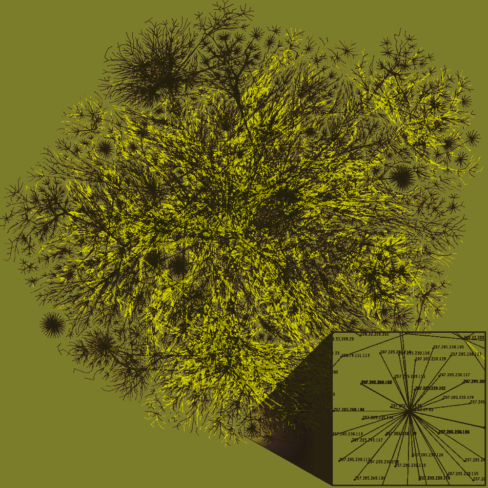
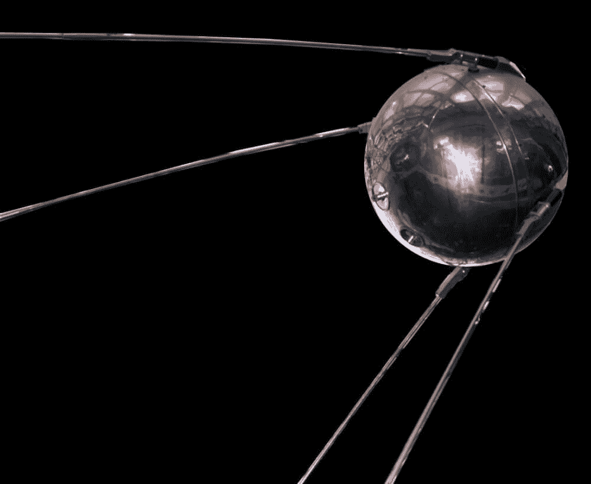
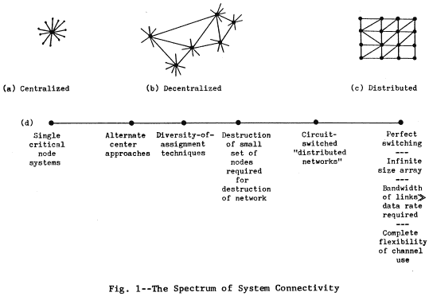
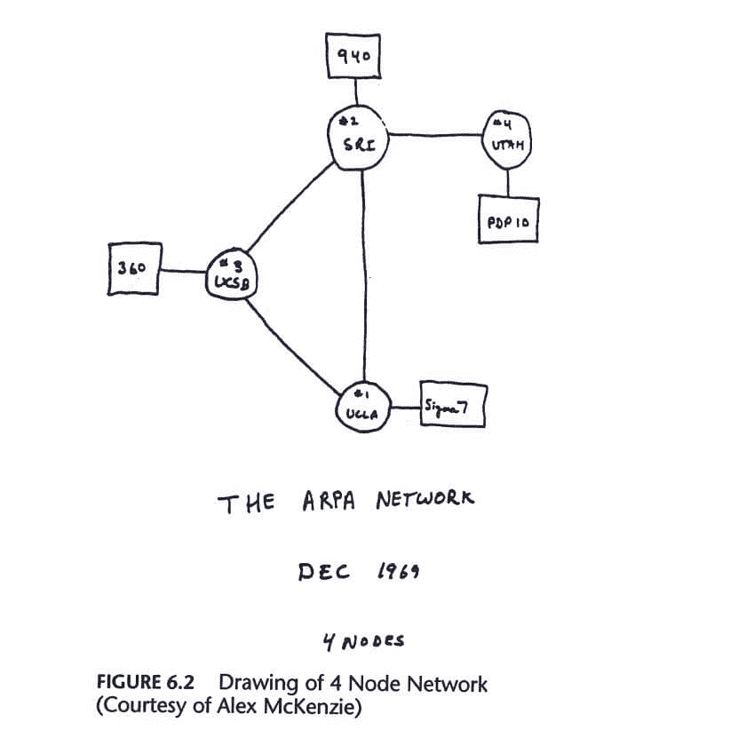

# 互联网简史——谁发明了它，它是如何工作的，以及它是如何成为我们今天使用的网络的

> 原文：<https://www.freecodecamp.org/news/brief-history-of-the-internet/>

让我们先澄清一些关于互联网的误解。互联网不是网络。互联网不是云。互联网并不神奇。

它可能看起来像是我们认为理所当然的自动操作，但在幕后有一个完整的过程使它运行。

## 因此...互联网。这是什么？

互联网实际上是一根电线。嗯，许多电线连接着世界各地的电脑。

互联网也是基础设施。这是一个由相互连接的计算机组成的全球网络，这些计算机通过一套协议以标准化的方式进行通信。

真的，是网络的网络。这是一个完全分布式的计算设备系统，它确保通过网络的每个部分实现端到端连接。目标是每台设备都能够与任何其他设备通信。

Visualisation of a possible routing path on the Internet. Image from [Wikimedia Foundation](https://en.wikipedia.org/wiki/Internet#/media/File:Internet_map_1024_-_transparent,_inverted.png).

互联网是我们每天都在使用的东西，我们许多人都无法想象没有它的生活。互联网及其带来的所有技术进步已经改变了我们的社会。它改变了我们的工作，我们消费新闻和分享信息的方式，以及我们相互交流的方式。

它还创造了如此多的机会，帮助人类进步，塑造了我们的人类体验。

没有别的东西能像它一样——它是有史以来最伟大的发明之一。但是我们有没有停下来想一想为什么它会被创造出来，它是如何发生的，或者是由谁创造出来的？互联网是如何变成今天这个样子的？

这篇文章更像是一次时光倒流之旅。我们将了解互联网的起源以及这些年来它已经走了多远，因为这对我们的编码之旅很有帮助。

了解互联网是如何产生的历史让我意识到一切都归结于解决问题。这就是编码的意义所在。遇到问题，努力寻找解决方案，一旦找到解决方案，就改进它。

互联网，一项如此广阔和不断变化的技术，不仅仅是一个人或一个机构的工作。许多人通过开发新功能为它的发展做出了贡献。

所以它是随着时间发展起来的。它至少经历了 40 年的发展，并且一直在进化。

它不仅仅是为了创造而创造。我们今天知道和使用的互联网是一个实验的结果，阿帕网，互联网的前身网络。

这一切都是因为一个问题而开始的。

## 害怕人造卫星

冷战期间，1957 年 10 月 4 日，苏联向太空发射了第一颗人造卫星“斯普特尼克”。

由于它是世界上第一个飘入太空的人造物体，这让美国人感到震惊。

苏联人不仅在科学和技术上领先，而且是一种威胁。美国人担心苏联会监视他们的敌人，赢得冷战，并担心对美国本土的核攻击是可能的。

Image from [Wikimedia Foundation](https://en.wikipedia.org/wiki/Sputnik_1#/media/File:Sputnik_asm.jpg)

所以美国人开始更认真地思考科学和技术。人造卫星唤醒之后，太空竞赛开始了。不久之后，在 1958 年，美国政府资助了各种机构，其中之一是 ARPA。

ARPA 代表高级研究计划局。这是国防部在计算机科学方面的一个研究项目，是科学家和研究人员分享信息、发现、知识和交流的一种方式。它也允许并帮助了计算机科学领域的发展和进化。

在那里，ARPA 的董事之一 J.C.R. Licklider 的愿景在未来几年开始形成。

没有 ARPA，互联网就不会存在。正是因为这个机构，互联网的第一个版本诞生了——阿帕网。

## 创建一个全球计算机网络

尽管 Licklider 在 ARPANET 创建前几年就离开了 ARPA，但他的想法和愿景为创建互联网奠定了基础和基石。事实上，它已经成为我们今天所知道的，我们可能认为是理所当然的。

当时的计算机并不像我们现在所知道的那样。它们体积庞大，极其昂贵。他们被视为数字处理机器，主要是计算器，只能执行有限的任务。

所以在大型计算机时代，每台计算机只能运行一个特定的任务。要进行需要多项任务的实验，需要不止一台计算机。但这意味着购买更昂贵的硬件。

解决方法是什么？

将多台计算机连接到同一个网络，让这些不同的系统使用同一种语言进行相互通信。

多台计算机连接到一个网络的想法并不新鲜。这种基础设施存在于 20 世纪 50 年代，被称为广域网。

然而，广域网有许多技术上的限制，并且被限制在很小的区域和它们能做的事情上。每台机器都说自己的语言，这使得它无法与其他机器交流。

因此，Licklider 在 20 世纪 60 年代早期提出并推广的“全球网络”的想法是革命性的。这与他的更大愿景紧密相连，即计算机和人类之间的完美共生。

他确信，在未来，计算机将提高生活质量，摆脱重复性的任务，为人类留下空间和时间来进行更深入的创造性思考，让他们的想象力自由流动。

只有当不同的系统打破语言障碍并整合到一个更大的网络中时，这一目标才能实现。这种“网络化”的理念造就了我们今天使用的互联网。本质上，不同系统之间的通信需要通用的标准。

## 构建分布式分组交换网络

直到此时(20 世纪 60 年代末)，当你想在计算机上运行任务时，数据是通过电话线用一种叫做“电路交换”的方法发送的。

这种方法对于打电话来说效果很好，但是对于计算机和互联网来说效率很低。

使用这种方法，您只能以完整数据包的形式发送数据，即通过网络发送的数据，并且一次只能发送到一台计算机。丢失信息并不得不从头开始整个过程是很常见的。这既费时又低效，而且成本高昂。

然后在冷战时代，这也是危险的。对电话系统的攻击会摧毁整个通信系统。

这个问题的答案是分组交换。

这是一种简单而有效的数据传输方法。它不是将数据作为一个大数据流发送，而是将其分割成小块。

然后，它将信息包分解成块，并以尽可能快的速度向尽可能多的方向转发，每个块在网络中走自己不同的路线，直到它们到达目的地。

一旦到了那里，它们就被重新组装。这之所以成为可能，是因为每个数据包都有关于发送者、目的地和号码的信息。然后，这允许接收者将它们以原始形式重新组合在一起。

这种方法被不同的科学家研究过，但是 Paul Baran 关于分布式网络的想法后来被 ARPANET 采用。

巴兰试图找出一种能在核攻击中幸存的通讯系统。本质上，他想发现一种可以处理故障的通信系统。

他得出结论，网络可以围绕两种类型的结构建立:集中式和分布式。

从这些结构中产生了三种类型的网络:集中式、分散式和分布式。在这三个当中，只有最后一个能够在攻击中存活下来。

Image from [RAND CORPORATION](https://www.rand.org/pubs/research_memoranda/RM3097/RM3097.chapter2.html)

如果这种网络的一部分被破坏了，它的其余部分还会继续工作，任务会简单地转移到另一部分。

当时，他们没有想到网络的快速扩张，我们也不需要。只是在接下来的几年里，这种扩张才开始成形。巴兰的想法领先于他的时代，然而，他们奠定了互联网现在如何工作的基础。

实验性的分组交换网络是成功的。它导致了采用这种方法的 ARPANET 体系结构的早期创建。

## 阿帕网是如何建成的

起初是对冷战威胁的回应，现在变成了不同的东西。互联网的第一个原型慢慢开始成形，第一个计算机网络阿帕网建成。

现在的目标是资源共享，无论是数据、发现还是应用。它将允许人们，无论他们身在何处，都可以利用遥远的昂贵计算能力，就好像他们就在他们面前一样。

到目前为止，科学家还不能使用位于其他位置的计算机上的可用资源。每台大型计算机都使用自己的语言，因此系统之间缺乏沟通和不兼容。

然而，为了让计算机更有效，它们需要说同一种语言，并连接成一个网络。

因此，解决方案是建立一个网络，在相距数英里的多台资源共享大型超级计算机之间建立通信链接。

一个实验性的全国性分组交换网络的建立开始了，这个网络把由机构和大学管理的中心连接起来。

1969 年 10 月 29 日，不同的计算机第一次连接并说话，这是一种从一台计算机到另一台计算机的“节点到节点”通信。这是一个即将彻底改变通信的实验。

第一条信息从加州大学洛杉矶分校(UCLA)传递到斯坦福研究所(SRI)。

上面简单地写着“LO”。

最初，所谓的“登录”是不可行的，因为系统崩溃了，必须重新启动。但是成功了！迈出了第一步，语言障碍被打破了。

到 1969 年底，在整个网络的四个节点之间建立了连接，其中包括加州大学洛杉矶分校、斯坦福大学、UCSB 大学(加州大学圣巴巴拉分校)和犹他大学。

但是这个网络多年来稳步发展，越来越多的大学加入进来。

到 1973 年，甚至有节点连接到英格兰和挪威。ARPANET 设法将这些由大学运营的超级计算中心连接到它的网络中。

那个时代最伟大的成就之一就是一种新的文化正在出现。一种围绕通过分享解决问题和通过网络集体寻找最佳解决方案的文化。

在那段时间里，科学家和研究人员对网络的每个方面都提出了质疑——技术方面以及道德方面。

进行这些讨论的环境是欢迎所有人的，没有等级之分。每个人都可以自由表达自己的观点，并合作解决出现的重大问题。

我们看到这种文化延续到了今天的互联网上。通过论坛、社交媒体等，人们提出问题以获得答案，或者聚在一起处理影响人类状况和体验的任何问题。

随着时间的推移，出现了更多与 ARPANET 无关的独立分组交换网络(存在于国际层面，并在 20 世纪 70 年代开始激增)。这是一个新的挑战。

这些不同的网络有自己的方言，也有自己的数据传输标准。他们不可能融入这个更大的网络，也就是我们今天所知道的互联网。

让这些不同的网络相互交流——或者说是互联，科学家们用这个术语来描述这个过程——被证明是一个挑战。

## 对共同标准的需求

现在，我们的设备被设计成可以自动连接到更广泛的全球网络。但在当时，这个过程是一项复杂的任务。

这个世界范围的基础设施，网络的网络，我们称之为互联网，是基于某些商定的协议。这些都是基于网络如何通信和交换数据。

从 ARPANET 的早期开始，它仍然缺乏一种通用语言，使自己网络之外的计算机能够与自己网络上的计算机进行通信。尽管它是一个安全可靠的分组交换网络。

这些早期的网络如何相互通信？我们需要网络进一步扩展，以实现“全球网络”的愿景。

为了建立一个开放的网络，需要一个通用协议。也就是一套规则。

这些规则对于安全的数据传输必须足够严格，但也要足够宽松，以适应数据传输的所有方式。

## TCP/IP 化险为夷

温顿·瑟夫和鲍勃·汗开始设计我们现在称之为互联网的东西。1978 年，传输控制协议和互联网协议诞生了，也称为 TCP/IP。

互连的规则是:

*   独立网络不需要改变
*   有一种实现交流的努力
*   除此之外，内部网络还会存在连接这些网络的网关。他们的工作是在网络之间进行翻译。对此将有一个普遍的、一致同意的议定书。
*   没有中央控制，没有一个人或组织负责。

正如中央应急基金解释的那样:

> TCP 的工作仅仅是获取一台主机产生的消息流，并在外部接收主机上不加改变地再现该流。

互联网协议(IP)使得在众多可用的机器中查找信息成为可能。

### 那么数据是如何传播的呢？

那么，数据包是如何从一个目的地到达另一个目的地的呢？比如从发送目的地到接收目的地？TCP/IP 在其中扮演了什么角色，它是如何使这一旅程成为可能的？

当用户发送或接收信息时，第一步是发送者机器上的 TCP 将数据分成包并分发它们。这些数据包在互联网上从一个路由器传到另一个路由器。

在此期间，IP 协议负责这些数据包的寻址和转发。最后，TCP 将数据包重组为原始状态。

## 互联网接下来发生了什么？

在整个 80 年代，这个协议经过了彻底的测试，并被许多网络采用。互联网只是继续快速增长和扩展。

互联的全球网络终于开始出现了。研究人员、科学家和程序员仍然广泛使用它来交换消息和信息。公众对此一无所知。

但这种情况在 80 年代末即将改变，当时互联网再次发生了变化。

这要感谢蒂姆·伯纳斯·李，他介绍了网络——我们今天是如何认识和使用互联网的。

互联网从仅仅将信息从一台计算机发送到另一台计算机，到为人们创建一种可访问的、直观的方式来浏览起初是一组相互链接的网站。网络是建立在互联网之上的。互联网是它的主干。

我希望这篇文章对我们今天使用的这个信息星系的起源提供了一些背景和见解。我希望你喜欢了解它实际上是如何开始的，以及它成为我们今天知道和使用的互联网的途径。