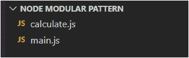
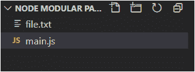
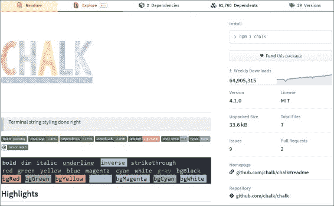
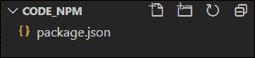
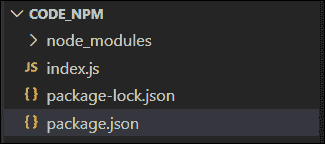
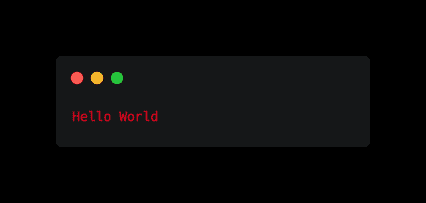

# 模块化编程如何在 Node.js 中工作

> 原文：<https://www.freecodecamp.org/news/modular-programming-nodejs-npm-modules/>

模块是 Node.js 的基本特性之一。

当您构建一个应用程序时，随着代码变得越来越复杂，您不能将整个代码放在一个文件中。

由于这变得难以管理，您可以使用 Node 的模块模式来编写不同的文件，并将它们(包括函数、对象和方法)导出到主文件。

现在你可能会问——到底什么是`module`？

简单来说，`module`就是一个 JavaScript 文件。就是这样。

借助 Node 的模块化功能，我们可以导入自己的外部文件、核心(本地)节点模块和 NPM 模块。在本文中，我们将详细讨论其中的每一个。

## **如何导入自己的文件**

在本文中，我们将讨论如何导出和导入我们自己的文件。

基本上，有两个文件:`calculate.js`，我们将从那里导出，以及`main.js`，我们将从那里导入该文件。


为了简单起见，我们将两个文件放在同一个文件夹中。



### 如何导入函数

```
//---- Exported file [calculate.js] ----
const add = (a,b)=>{
    return a + b
}

module.exports = add 
```

这里我们使用`module.exports`导出一个名为`add`的函数。然后使用`require`方法将这个函数导入到不同的文件中。

在 Node 中，每个文件被称为一个`module`，`exports`是模块对象的一个属性。

我们现在可以调用不同文件中的函数，即`main.js`，通过传递如下所示的参数。

```
//------ Main File[main.js] ----

const add = require('./calculate') //name of the desired file
const result = add(2,4)
console.log(result); //Output : 6 
```

### 如何导入对象

我们还可以导出整个对象并访问其中的不同方法。

```
//---- Exported file [calculate.js]  ----
const add = {
    result : (a,b)=>{
        return a + b
    }
}
module.exports = add 
```

我们导出了对象`add`，并使用`require`方法将其导入到我们的主文件中。

我们现在可以使用`.`点操作符来访问`add`对象的`result`方法:

```
//---- Main file[main.js] ----
const add = require('./calculate')

const result = add.result(5,8)

console.log(result) //Output : 13 
```

另一种导出上述对象的方法是只导出我们需要的方法，而不是导出整个对象。

```
//---- Exported file [calculate.js]  ----
const add = {
    result : (a,b)=>{
        return a + b
    }
}

module.exports = add.result 
```

如您所见，我们在`add`对象中导入了`result`方法。所以这个方法可以在主文件中直接调用。

如果您不需要整个对象，而只需要它的一些方法/函数，这是一个很好的实践。这也使我们的代码更加安全。

```
//---- Main file[main.js] ----

const add = require('./calculate')
const result = add(5,8)
console.log(result) //Output : 13 
```

### 如何导入函数构造函数:

函数构造器基本上用于创建一个对象的新实例，它拥有与主对象/函数相同的属性。

在下面的例子中，我们使用关键字`new`创建了一个新的‘Add’对象实例。我们创建对象实例的过程称为“实例化”。

然后我们使用`module.exports`导出这个实例:

```
//---- Exported file [calculate.js]  ----

function Add (){
    this.result = (a,b)=>{
        return a + b
    }
}

module.exports = new Add() 
```

现在，我们可以将它导入到我们的主文件中，并访问其中的“result”方法，以获得我们计算的值。

```
//---- Main file[main.js] ----

const add = require('./calculate2')
const result = add.result(1,3)
console.log(result); //Output : 4 
```

这样我们可以导出和导入一个函数构造器。

还有一种方法可以做到这一点，那就是在主文件中创建我们的新实例，而不是在导出的文件中，如上图所示`module.exports = new Add()`。

当我们导出类似于函数构造器的 ES6 类时，我们将看到这是如何工作的。

### 如何导入 ES6 类

`class`是一种特殊类型的函数，其中`class`关键字帮助初始化它。它使用`constructor`方法来存储属性。

现在我们将使用`module.exports`导出整个`class`:

```
//---- Exported file [calculate.js]  ----

const Add = class{
    constructor(a,b){
        this.a = a;
        this.b = b;
    }

    result(){
        return this.a + this.b
    }
}

module.exports = Add; 
```

现在，在我们的主文件中，我们使用关键字`new`创建一个新的实例，并访问`result`方法来获得我们计算的值。

```
 //---- Main file[main.js] ----

const add = require('./calculate')

const result = new add(2,5)

console.log(result.result()); //Output : 7 
```

## 如何导入节点核心(本机)模块

Node 提供了一组模块来简化我们的生活，而不是每次都创建我们自己的定制模块。

我们将讨论一些模块，但是你可以在官方的节点 API 文档[中找到完整的列表。](https://nodejs.org/dist/latest-v15.x/docs/api/)

导入节点模块类似于导入您自己的模块。您使用相同的`require()`函数在自己的文件中访问它。

但是有一些你可能在不知不觉中使用过的模块不需要导入。例如`console.log()`–我们已经多次使用`console`模块，而没有在我们自己的本地文件中获取它，因为这些方法在**全球**都可用。

让我们来看看其中一个核心本机模块，即**文件系统** ( `fs`)。
我们可以使用文件系统模块执行 n 种操作，例如读取文件、写入文件和更新文件等等。

我们将使用`fs`模块来读取一个文件。即使在这个方法中，我们也有两种方式来执行这个动作:一种是通过使用同步函数`fs.readFileSync()`，另一种是通过异步函数`fs.readFile()`。

我们将在以后的文章中讨论同步-异步节点函数。

今天，我们将使用异步版本，即`fs.readFile()`。

对于这个例子，我们创建了两个文件:`main.js`，我们将在这里执行文件读取操作，以及`file.txt`，这是我们将要读取的文件。



`file.txt`中包含一些文本。

```
Hello World!
```

现在，我们使用`fs`模块读取文件，而不导入它，如下所示:

```
fs.readFile('./file.txt','utf-8',(err,data)=>{
    if (err) throw err
    console.log(data);
})
```

它将抛出一个错误，因为没有定义`fs`。这是因为文件系统`fs`模块不像`console`模块那样是全局可用的。

```
ReferenceError: fs is not defined
    at Object.<anonymous> (C:\Users\Sarvesh Kadam\Desktop\Training\blog\code snippets\Node Modular Pattern\main.js:3:1)
    at Module._compile (internal/modules/cjs/loader.js:1256:30)
    at Object.Module._extensions..js (internal/modules/cjs/loader.js:1277:10)
    at Module.load (internal/modules/cjs/loader.js:1105:32)
    at Function.Module._load (internal/modules/cjs/loader.js:967:14)
    at Function.executeUserEntryPoint [as runMain] (internal/modules/run_main.js:60:12)
    at internal/main/run_main_module.js:17:47 
```

因此，我们需要使用`require()`函数从文件系统模块导入所有数据，并将所有数据存储在变量`fs`中。

```
const fs = require('fs')

fs.readFile('./file.txt','utf-8',(err,data)=>{
    if (err) throw err
    console.log(data);
})
```

现在你可以给这个变量取任何名字。为了可读性，我将其命名为`fs`,这是大多数开发人员遵循的标准。

使用`fs`变量，我们可以访问`readFile()`方法，在这里我们传递了三个参数，即文件路径、字符编码`utf-8`，以及给出输出的回调函数。

你可能会问为什么我们把`utf-8`作为`readFile()`中的参数？

因为它对值进行编码并将文本作为输出给出，而不是给出如下所示的缓冲区:

`<Buffer 48 65 6c 6c 6f 20 57 6f 72 6c 64 21 21>`

反过来，回调函数有两个参数:一个错误(`err`)和文件中的实际内容(`data`)。然后我们在控制台中打印出`data`。

```
//Output:
Hello World! 
```

## **如何导入 NPM 模块**

那么到底什么是节点包管理器呢？

包是由包管理器管理的一段代码。它只不过是管理软件包的安装和更新的软件。

官方[文件](https://docs.npmjs.com/)中的 NPM:

> NPM 是世界上最大的软件注册中心。来自各大洲的开源开发者使用 npm 来共享和借用包，许多组织也使用 npm 来管理私有开发。

因此，在 NPM，我们通过将别人的开源代码导入到我们的项目中，来使用由 NPM 管理的开源代码。

NPM 一般下载的时候会附带 Node JS。你可以通过在你的命令提示符下运行命令`npm -v`来检查你的机器上是否安装了 NPM。如果它返回一些版本号，这意味着 NPM 安装成功。

在 npmjs.com，NPM 有它的注册中心，在那里你可以找到你可以使用的软件包。

让我们来看一个名为 [chalk](https://www.npmjs.com/package/chalk) 的包，它基本上用于终端造型。



在上图中，我们可以看到该软件包的每周下载量，这表明它有多受欢迎。

还有，你可以看到这个包里面有依赖项。因此，这个模块将作为我们项目的依赖项，它本身依赖于其他模块。
整个管理过程由包经理负责。

甚至连 GitHub 上的源代码都是给我们的。我们可以导航到它，并验证是否存在任何未解决的问题。在继续之前还有一件事:NPM 软件包有不同的版本。版本遵循的模式是语义版本化。

如你所见，我写这篇文章时最新版本的[粉笔](https://www.npmjs.com/package/chalk)模块是 **4.1.0。**

它遵循语义版本化`Major_changes` **。** `Minor_changes` **。** `Patch`图案。

`Major_changes`，顾名思义，是对模块所做的重大更改，这些更改可能会影响您现有的代码。

`Minor_changes`是新的增强或特性以及已经添加的缺陷修复，它们不会影响您现有的代码。

`Patch`是不会让你现有代码崩溃的小 bug 修复。

你可以在[semver.org](https://semver.org/)上了解更多关于语义版本控制的信息。

#### 如何安装 NPM

现在，要从 NPM 导入任何包，首先需要在本地项目文件夹中初始化 NPM，方法是在命令提示符下运行命令:

```
npm init 
```

一旦您运行上面的命令，它将要求您提供一些数据，如下所示，例如包名、版本等等。

正如圆括号 **()** 中提到的，这些数据中的大部分可以保留为默认值。
此外，像`author`和`license`这样的字段是为创建那些 NPM 包的人准备的。

另一方面，我们只是导入并使用它们来创建我们自己的应用程序。

```
package name: (code_npm) code_npm
version: (1.0.0) 1.0.0
description: npm demo
entry point: (index.js) index.js
test command: test
git repository:
keywords: npm test
author: Sarvesh
license: (ISC) 
```

一旦您输入了所有字段，它将创建一个 JSON 文件，其中的值具有上述属性，并且它会像这样要求您进行确认:

```
Is this OK? (yes) yes 
```

一旦您确认了`yes`，它将创建一个包含您输入的所有数据的`package.json`文件，如下图所示:

```
{
  "name": "code_npm",
  "version": "1.0.0",
  "description": "npm demo",
  "main": "index.js",
  "scripts": {
    "test": "echo \"Error: no test specified\" && exit 1"
  },
  "keywords": [
    "npm",
    "test"
  ],
  "author": "Sarvesh",
  "license": "ISC"
} 
```

此外，您可以看到一个添加了`test`属性的`script`对象。您可以使用`npm test`命令来运行它，它将返回如下期望的输出:

```
"Error: no test specified" 
```

现在，您可以简单地运行以下命令，而不是使用这种冗长的方法来初始化 NPM 并输入自定义属性值:

```
npm init -y 
```

一旦你运行这个命令，它将直接用默认值创建一个`package.json`文件。



现在要在您的项目中安装最新版本的 **chalk** 包，您需要执行命令:

```
npm install chalk 
```

你也可以安装任何你需要的特定版本的粉笔，只需添加如下图所示的`@version number`。你也可以简单地放置代表安装的简写的`i`标志来代替`install`:

```
npm i chalk@4.0.0 
```

这将安装两个东西，一个`node_modules`文件夹和一个`package-lock.json`文件。



此外，它将向我们的`package.json`文件添加一个名为`dependencies`的新属性，该文件包含已安装软件包的名称及其版本。

```
"dependencies": {
    "chalk": "^4.0.0"
  } 
```

`node_module`文件夹包含 packages 文件夹及其依赖项的文件夹。当安装 npm 软件包时，它会进行修改。

`package-lock.json`包含让 NPM 更快更安全的代码。

```
"chalk": {
      "version": "4.0.0",
      "resolved": "https://registry.npmjs.org/chalk/-/chalk-4.0.0.tgz",
      "integrity": "sha512-N9oWFcegS0sFr9oh1oz2d7Npos6vNoWW9HvtCg5N1KRFpUhaAhvTv5Y58g880fZaEYSNm3qDz8SU1UrGvp+n7A==",
      "requires": {
        "ansi-styles": "^4.1.0",
        "supports-color": "^7.1.0"
      } 
```

主要包含`version`等属性，是语义版本号。

`resolved`属性是获取包的目录或位置。在这种情况下，它是从[粉笔](https://www.npmjs.com/package/chalk)中提取的。

`integrity`属性是为了确保我们再次安装依赖项时得到相同的代码。

`requires`对象属性表示`chalk`包的依赖关系。

**注意**:这两个文件`node_modules`和`package-lock.json`不要做任何修改

#### 如何使用 NPM

现在，一旦我们将 chalk 安装到我们的项目中，我们就可以使用`require()`方法将它导入到我们的根项目文件中。然后我们可以将该模块存储在一个名为`chalk`的变量中。

```
const chalk = require('chalk')

console.log(chalk.red("Hello World"))
```

使用`chalk`包的`red()`方法，我们将“Hello World”文本颜色设置为红色。

在运行命令`node index.js`时，我们得到以下输出:



现在有很多方法可以使用 chalk 包来设计命令行输出。要了解更多信息，你可以参考关于 NPM 的官方文件。

此外，您可以全局安装 NPM 软件包(即在我们的操作系统上)，而不是在您的本地项目中安装，方法是在命令行上添加`-g`标志(如下所述，它代表全局):

```
npm i nodemon -g 
```

这个全局包不会以任何方式影响我们的`package.json`,因为它不是本地安装的。

我们已经在全球范围内安装了`nodemon`包，用于在观察到目录中的文件发生变化时自动重启节点应用程序。
更多信息可以参考[节点门](https://www.npmjs.com/package/nodemon)。

我们可以通过使用以下命令运行应用程序来使用 nodemon 包:

```
nodemon index.js 
```

它的工作方式与`node index.js`类似，除了它会关注文件的变化，并且一旦检测到变化，它会重启应用程序。

```
[nodemon] 2.0.6
[nodemon] to restart at any time, enter `rs`
[nodemon] watching path(s): *.*
[nodemon] watching extensions: js,mjs,json
[nodemon] starting `node index.js`
Hello World 
```

**注意**:当你使用`nodemon`时，`chalk`的造型可能不起作用。

最后，我们将经历`dev dependencies`。有一些 NPM 包或模块，我们在项目的生产环境中不需要，但只用于我们的开发需求。

我们可以使用如下所示的`dev`标志在我们的项目中安装这些模块:

```
 npm i nodemon --save-dev 
```

然后它在`package.json`中创建了一个名为`devDependencies`的新属性:

```
"devDependencies": {
    "nodemon": "^2.0.6"
  } 
```

## 结论

使用 Node 的模块模式，我们可以通过以函数、对象、函数构造器和 ES6 类的形式导出文件来导入我们自己的文件。

Node 有自己的一套核心(本地)模块可供我们使用。有些是全局可用的，而有些需要在本地导入到您的项目/文件夹中。

NPM 是一个包经理，管理第三方开源代码，我们可以在我们的项目中使用。在使用 NPM 模块之前，您需要在您的项目文件夹的根目录下使用命令行上的`npm init`来本地初始化 NPM。

您可以使用命令`npm i <package name>`安装任何 NPM 软件包。您可以使用`-g`标志在全球范围内安装 NPM 软件包。也可以使用`--save-dev`标志使包依赖于开发。

感谢您的阅读！如果你喜欢这篇文章，请在 Twitter 上联系我，我会继续记录我的学习。