# 如何使用 Pexels API 和 Chakra UI 用 NextJS 构建图片库

> 原文：<https://www.freecodecamp.org/news/build-an-image-gallery-with-nextjs/>

在本文中，我们将使用 [Pexels API](https://www.pexels.com/api/) 和 [Chakra UI v1](https://chakra-ui.com/) 构建一个带有 [Next.js](https://nextjs.org/) 的图库，这是一个模块化且可访问的组件库。

我们还将使用 [Next.js 图像组件](https://nextjs.org/blog/next-10#built-in-image-component-and-automatic-image-optimization)来优化从 Pexels API 获取的图像。

如果你想直接进入代码，请点击这里查看 GitHub Repo。

这里有一个部署版本的链接:[https://next-image-gallery.vercel.app/](https://next-image-gallery.vercel.app/)。

#### 在这篇文章中，我们将涵盖哪些概念和主题？

*   如何用 [Next.js](https://nextjs.org/) 安装使用 [Chakra UI v1](https://chakra-ui.com/)
*   如何从一个 API 中获取 Next.js 中的数据
*   如何使用 [Next.js 图片组件](https://nextjs.org/docs/basic-features/image-optimization)
*   如何在 Next.js 中设置[动态路由](https://nextjs.org/docs/routing/dynamic-routes)

## 目录

*   [先决条件](#prerequisites)
*   [如何设置和安装 Next.js](#how-to-setup-and-install-next-js)
*   [如何生成 Pexels API 密钥](#how-to-generate-the-pexels-api-key)
*   [如何向图库添加标题](#how-to-add-a-heading-to-the-gallery)
*   [如何从 Pexels API 获取数据](#how-to-fetch-data-from-the-pexels-api)
*   [如何在页面上显示照片](#how-to-display-photos-on-the-page)
*   [如何使用 Chakra UI 设计图像风格](#how-to-style-images-with-chakra-ui)
*   [如何向图库添加搜索功能](#how-to-add-search-functionality-to-the-gallery)
*   [如何给图像添加动态路线](#how-to-add-dynamic-routes-to-images)
*   [结论](#conclusion)

现在让我们开始吧。

## 先决条件

在我们开始之前，您应该已经:

1.  HTML、CSS 和 JavaScript 的知识。
2.  [React](https://www.freecodecamp.org/learn/front-end-libraries/react/) 和 Next.js 的基础知识。
3.  安装在本地开发机器上的[节点](https://nodejs.org/en/)和 NPM。
4.  您选择的任何代码编辑器。
5.  [反应开发工具](https://chrome.google.com/webstore/detail/react-developer-tools/fmkadmapgofadopljbjfkapdkoienihi?hl=en)(可选)

如果你觉得自己的进步受到了阻碍，因为你对这些主题了解不够，那就去看看 https://www.freecodecamp.org/learn 吧。那里令人敬畏的模块将让你立刻开始。

## 如何设置和安装 Next.js

我们将使用 [Create Next App](https://nextjs.org/docs/api-reference/create-next-app) 快速初始化一个 Next.js 项目。在项目的根目录中，在终端中运行以下命令。

```
npx create-next-app next-image-gallery
cd next-image-gallery
npm run dev
```

bash

最后一个命令`npm run dev`，将在您系统的端口 3000 上启动开发服务器。

在浏览器中导航到 [http://localhost:3000](http://localhost:3000/) 。这是您的应用程序的外观。

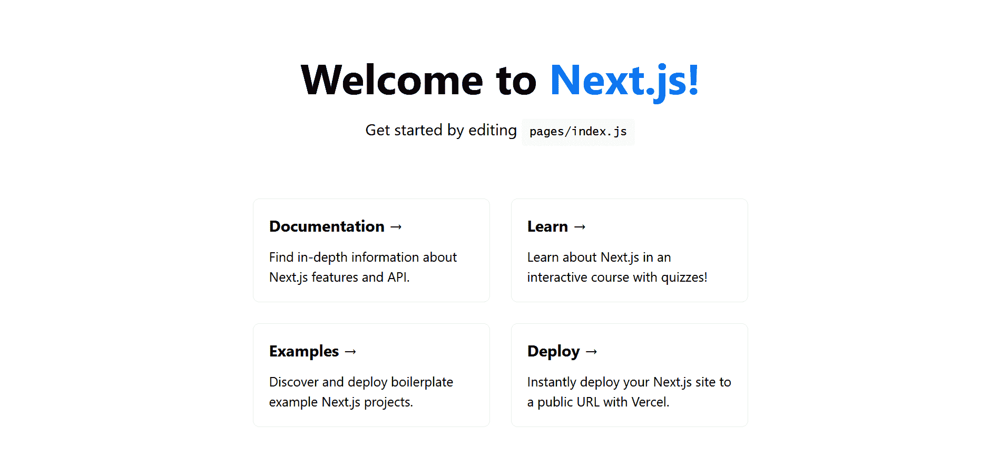

Welcome to Next.js - http://localhost:3000

运行以下命令安装 Chakra UI:

```
npm i @chakra-ui/react @emotion/react @emotion/styled framer-motion @chakra-ui/icons
```

bash

下一步是清理由`create-next-app`生成的样本代码，并将项目配置为使用 Chakra UI。

1.  删除`styles`和`pages/api`文件夹。
2.  像这样更新你的`pages/_app.js`:

```
// pages/_app.js
import { ChakraProvider } from "@chakra-ui/react";

function MyApp({ Component, pageProps }) {
  return (
    <ChakraProvider>
      <Component {...pageProps} />
    </ChakraProvider>
  );
}

export default MyApp; 
```

_app.js

3.这样修改`pages/index.js`:

```
// pages/index.js
import Head from "next/head";

export default function Home() {
  return (
    <div>
      <Head>
        <title> NextJS Image Gallery</title>
        <link rel="icon" href="/favicon.ico" />
      </Head>
    </div>
  );
} 
```

index.js

再次前往 [http://localhost:3000](http://localhost:3000/) 。你会看到 app 是空白的，只是标题改成了`NextJS Image Gallery`。

您现在可以关闭开发服务器了。

## 如何生成 Pexels API 密钥

我们将使用 [Pexels API](https://www.pexels.com/api/) 为我们的图库获取图像。您需要创建一个 Pexels API 密钥来验证您的 API 请求。API 本身是完全免费使用的。

您可以每小时向 Pexels API 发出多达 200 个请求，每月发出多达 20，000 个请求。

前往[https://www.pexels.com/join-consumer/](https://www.pexels.com/join-consumer/)，在 Pexels 上创建一个新账户。

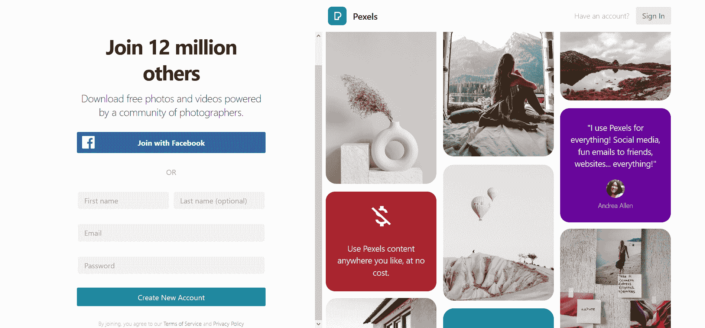

Create New Account

填写您的详细信息后，您还需要在申请 API 密钥之前确认您的帐户。因此，请检查您的收件箱并确认您的 Pexels 帐户。

导航至[https://www.pexels.com/api/new/](https://www.pexels.com/api/new/)并填写新 API 密钥的详细信息，然后点击**请求 API 密钥**

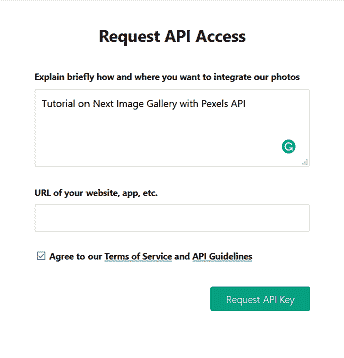

Request API Key

记得遵循 [API 指南](https://www.pexels.com/api/documentation/#guidelines)。现在复制下一页显示的 API 密钥。

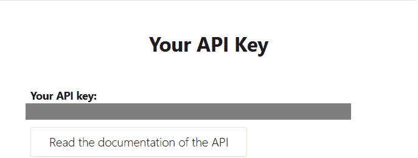

API Key

在项目的根目录下，创建一个名为`.env.local`的新文件来安全地存储这个 API 密匙。运行以下命令创建文件:

```
touch .env.local
```

bash

在这个`.env.local`文件中，创建一个名为`PEXELS_API_KEY`的新环境变量，并将 API 键粘贴到那里。

```
NEXT_PUBLIC_PEXELS_API_KEY = ''
```

.env.local

Next.js 内置了将环境变量从`.env.local`加载到`process.env`的支持。

默认情况下，通过`.env.local`加载的所有环境变量只在 Node.js 环境中可用。这意味着它们不会暴露在浏览器中。使用`NEXT_PUBLIC_`前缀将环境变量暴露给浏览器。

你可以在这里阅读更多相关信息[。](https://nextjs.org/docs/basic-features/environment-variables)

## 如何向图库添加标题

在本节中，我们将向图库添加一个标题。

像这样导入并添加`Box`组件到`index.js`:

```
//pages/index.js
import Head from "next/head";
import { Box } from "@chakra-ui/react";
export default function Home() {
  return (
    <div>
      <Head>
        <title> NextJS Image Gallery</title>
        <link rel="icon" href="/favicon.ico" />
      </Head>
      <Box overflow="hidden" bg="purple.100" minH="100vh"></Box>
    </div>
  );
} 
```

index.js

导航到 [http://localhost:3000](http://localhost:3000/) 。你会看到你的应用程序有一个浅紫色的背景色。

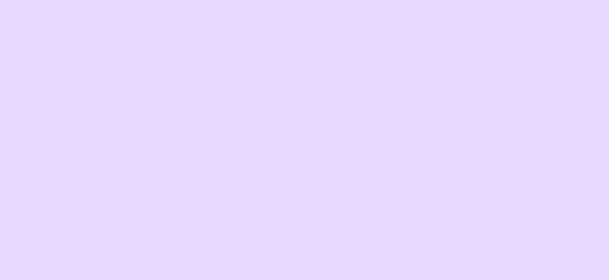

Blank Page with light Purple background

我们正在做的是:

*   在查克拉 UI 中，`bg`是``background`` 属性的速记道具。通过`bg="purple.100"`，应用的背景变成浅紫色。颜色后面的数字代表颜色的深浅，最浅的是`50`，最深的是`900`。这里有一张来自[脉轮 UI 文档](https://chakra-ui.com/docs/theming/theme#purple)的图片，可以更好地说明这一点。

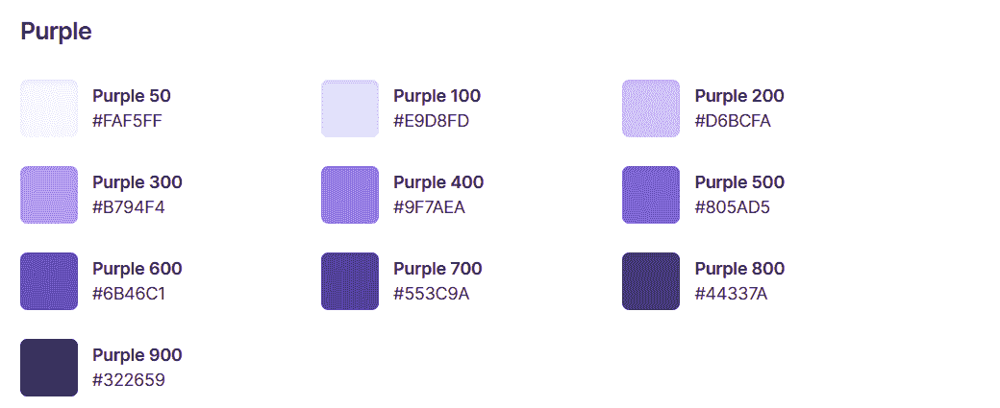

Shades of Purple

*   设置`minH="100vh"`使应用程序至少达到父元素高度的 100%。`minH`是`min-height`属性的简写道具。
*   为了在内容溢出父元素时去掉多余的滚动条，传递了`overflow="hidden"`。

要添加标题，我们将使用 Chakra UI 中的`Text`和`Container`组件。

像这样修改`index.js`中的`Box`导入:

```
import { Box, Container, Text } from "@chakra-ui/react"; 
```

Importing Box, Container, and Text components

现在，将`Container`组件添加到`Box`组件中。

```
<Box overflow="hidden" bg="purple.100" minH="100vh">
  <Container></Container>
</Box> 
```

Container

你会看到你的应用程序没有变化，但是`Container`组件在你的应用程序中增加了一些水平填充，这在添加`Text`组件后会更加明显。

在`Container`组件中添加以下代码:

```
<Container>
  <Text
    color="pink.800"
    fontWeight="semibold"
    mb="1rem"
    textAlign="center"
    textDecoration="underline"
    fontSize={["4xl", "4xl", "5xl", "5xl"]}
  >
    NextJS Image Gallery
  </Text>
</Container>
```

Heading

我们把上面的代码分解一下，讨论一下。

*   `color`用于将文本的颜色设置为`pink.900`。
*   `fontWeight`用于设置字符的粗细。
*   `mb`是`margin-bottom`和`1rem=16px`的速记道具。
*   `textAlign="center"`将文本居中对齐。
*   `textDecoration="underline"`在文本下添加一行。
*   `fontSize`顾名思义，设置文字的大小。

以下是您的应用程序的外观:

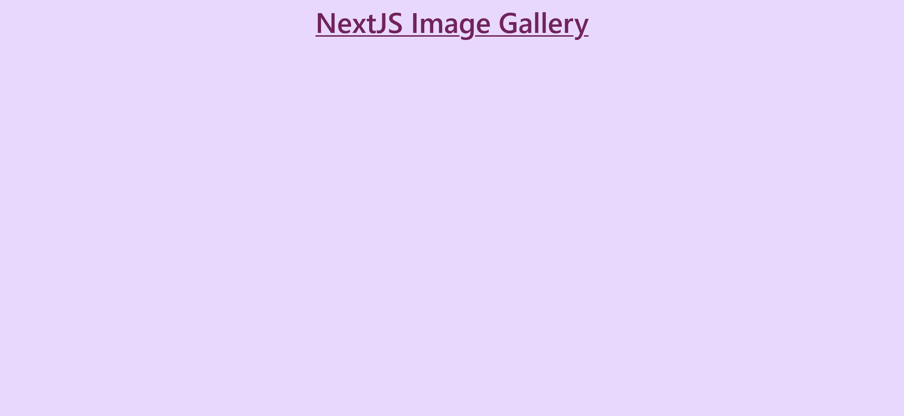

Heading - NextJS Image Gallery

```
xs: "12px"
sm: "14px"
md: "16px"
lg: "18px"
xl: "20px" 
```

Reference for xs, sm, md, lg & xl 

你可能会问为什么`fontSize`有四个值作为花括号里面的数组？

`{}`用于告诉 JSX 解析器将`{}`中的表达式解释为 JavaScript。这里，`{}`用于传递一个数组中`fontSize`的值。这个数组是查克拉 UI 中媒体查询的简写。

这些值在一个数组中传递，以使文本具有响应性，并根据设备改变字体大小——也就是说，标题在桌面上会更大。

数组的每个索引对应于一个特定的断点和属性值。这意味着`font-size`根据断点变化。你可以在这里了解更多信息。

```
const breakpoints = {
  sm: "30em",
  md: "48em",
  lg: "62em",
  xl: "80em",
}
```

default breakpoints

它遵循“移动优先”的方法，因此第一个值适用于较小的设备，最后一个值适用于桌面设备。

上述代码将生成如下 CSS:

```
.css-px6f4t {
 text-align:center;
 -webkit-text-decoration:underline;
 text-decoration:underline;
 font-size:2.25rem;
 color:#702459;
 font-weight:600;
 margin-bottom:1rem;
}
@media screen and (min-width:30em) {
 .css-px6f4t {
  font-size:2.25rem;
 }
}
@media screen and (min-width:48em) {
 .css-px6f4t {
  font-size:3rem;
 }
}
@media screen and (min-width:62em) {
 .css-px6f4t {
  font-size:3rem;
 }
} 
```

Generated CSS

这是在[多边形](https://polypane.app/)中看到的标题大小的并排差异。

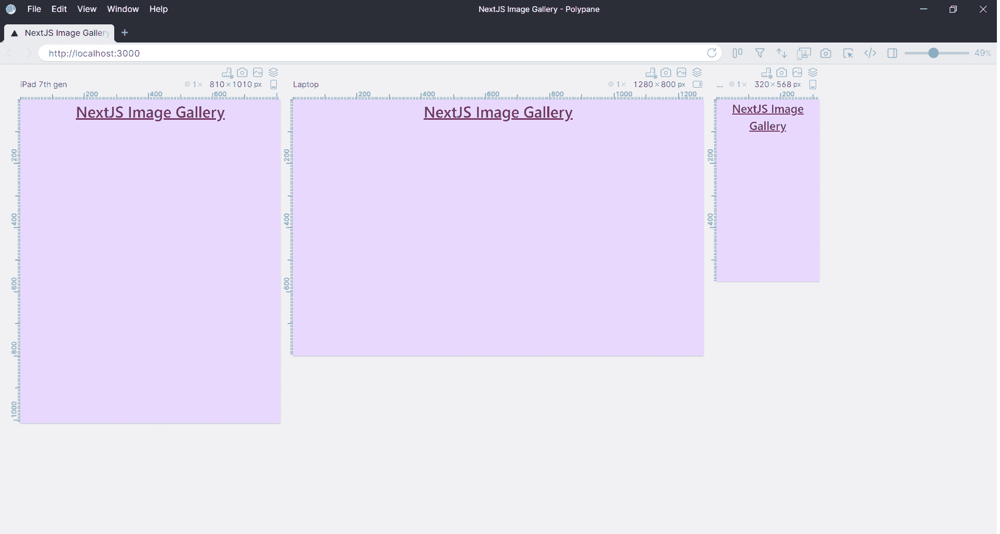

Polypane

## 如何从 Pexels API 获取数据

您已经生成了 API 密钥，所以让我们编写代码从 API 获取数据。我们将创建一个单独的文件，并定义在其中获取数据的函数。

在项目的根目录下，创建一个名为`lib`的文件夹。在其中，创建一个名为`api.js`的文件。

在终端中运行以下命令:

```
mkdir lib
cd lib
touch api.js
```

bash

这是照片的 Pexels API 基础 URL:[https://api.pexels.com/v1](https://api.pexels.com/v1/)/。

Pexels API 有三个端点:

*   `/curated`接收 Pexels 团队策划的实时照片。
*   `/search`基于查询搜索照片。
*   `/photos/:id`从其 id 中获取单张照片。

我们将使用`/curated`端点在应用程序的登录页面上显示 Pexels 团队策划的照片。

将以下代码添加到`api.js`:

```
const API_KEY = process.env.NEXT_PUBLIC_PEXELS_API_KEY;

export const getCuratedPhotos = async () => {
  const res = await fetch(
    `https://api.pexels.com/v1/curated?page=11&per_page=18`,
    {
      headers: {
        Authorization: API_KEY,
      },
    }
  );
  const responseJson = await res.json();
  return responseJson.photos;
}; 
```

api.js

我们来讨论一下上面的代码:

*   我们首先创建一个名为`API_KEY`的变量，它使用`process.env.`访问`NEXT_PUBLIC_PEXELS_API_KEY`环境变量
*   然后我们创建一个名为`getCuratedPhotos()`的异步函数，它使用`fetch()`方法从 API 中获取数据。
*   如果您仔细查看获取 URL，您会注意到我们在`/curated`端点后添加了`?page=11&per_page=18`。这些是可选参数，可以作为查询字符串[传递给`/curated`端点](https://en.wikipedia.org/wiki/Query_string)。这里的`page=11`表示发送第 11 页，`per_page=18`表示每页发送 18 张照片。
*   您还可以删除这些可选参数，在这种情况下，API 端点将从第一页向您发送 15 张图片。您可以在一次请求中获取多达 80 张照片。
*   Pexels API 键在`headers`下的`Authorization`字段中传递。
*   `res.json()`解析 JSON 格式的响应。
*   `responseJson`包含类似`page`、`per_page`等字段，我们的应用程序不使用这些字段。因此只返回响应的`photos`字段，如下所示:

```
[
  {
    id: 4905078,
    width: 7952,
    height: 5304,
    url: "https://www.pexels.com/photo/ocean-waves-under-blue-sky-4905078/",
    photographer: "Nick Bondarev",
    photographer_url: "https://www.pexels.com/@nick-bondarev",
    photographer_id: 2766954,
    src: {
      original:
        "https://images.pexels.com/photos/4905078/pexels-photo-4905078.jpeg",
      large2x:
        "https://images.pexels.com/photos/4905078/pexels-photo-4905078.jpeg?auto=compress&cs=tinysrgb&dpr=2&h=650&w=940",
      large:
        "https://images.pexels.com/photos/4905078/pexels-photo-4905078.jpeg?auto=compress&cs=tinysrgb&h=650&w=940",
      medium:
        "https://images.pexels.com/photos/4905078/pexels-photo-4905078.jpeg?auto=compress&cs=tinysrgb&h=350",
      small:
        "https://images.pexels.com/photos/4905078/pexels-photo-4905078.jpeg?auto=compress&cs=tinysrgb&h=130",
      portrait:
        "https://images.pexels.com/photos/4905078/pexels-photo-4905078.jpeg?auto=compress&cs=tinysrgb&fit=crop&h=1200&w=800",
      landscape:
        "https://images.pexels.com/photos/4905078/pexels-photo-4905078.jpeg?auto=compress&cs=tinysrgb&fit=crop&h=627&w=1200",
      tiny:
        "https://images.pexels.com/photos/4905078/pexels-photo-4905078.jpeg?auto=compress&cs=tinysrgb&dpr=1&fit=crop&h=200&w=280",
    },
    liked: false,
  },
]; 
```

photo object

在`src`字段中，我们有许多不同的图像格式可供选择。在本教程中，我们将在登录页面上使用`portrait`类型的图片。你也可以自由探索其他形式。

当我们开发我们的应用程序时，我们将编写函数来搜索一张照片并在`api.js`中获得一张照片。现在，我们将使用该功能在我们的登录页面或主页上显示图像。

## 如何在页面上显示照片

现在我们已经创建了获取数据的函数，让我们在页面上显示它们。

首先，在`index.js`中导入`getCuratedPhotos()`函数。

```
import Head from "next/head";
import { Box, Container, Text } from "@chakra-ui/react";
import {getCuratedPhotos} from "../lib/api" 
```

index.js

我们将使用 Next.js 中可用的`getServerSideProps()`函数，并使用其中的`getCuratedPhotos()`函数从 Pexels API 获取数据，并将其注入到我们的页面中。你可以在这里阅读更多关于`getServerSideProps()`。

在`index.js`文件的底部添加以下代码:

```
export async function getServerSideProps() {
  const data = await getCuratedPhotos();
  return {
    props: {
      data,
    },
  };
}
```

getServerSideProps() - index.js

上面的异步函数使用`getCuratedPhotos()`从 Pexels API 获取图像，并将其存储在`data`变量中。这个`data`变量在`props`属性中作为道具可用。

这个`data`作为一个道具可用，所以将其作为一个参数添加到`Home`组件函数中。

```
export default function Home({data}) {
...
}
```

index.js

重启您的开发服务器，在您的`Home`组件中，`console.log`这个`data`:

```
export default function Home({data}) {
  console.log(data)
  return (
 ...
 } 
```

index.js

前往 [http://localhost:3000/](http://localhost:3000/) ，按下 Chrome 中的`CTRL + Shift + J`或 Firefox 中的`CTRL + Shift + K`打开控制台。

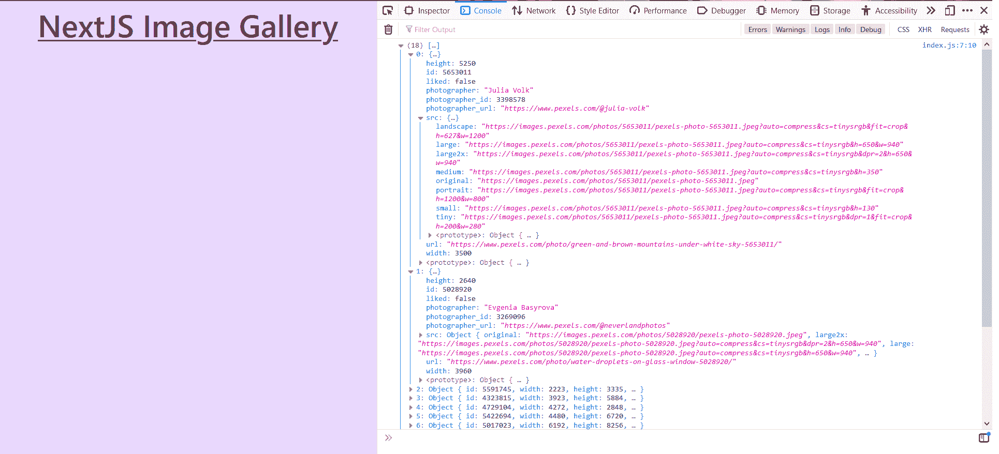

console.log(data)

移除`console.log`并将以下代码添加到`index.js`文件的顶部，以从`react`导入`useState()`钩子。

```
import React, { useState } from "react"; 
```

我们将来自 Pexels API 的数据存储在一个名为`photos`的状态中。在 return 语句前添加以下代码:

```
const [photos, setPhotos] = useState(data);
```

useState() hook

要显示图像，映射到`photos`数组并在`img`元素的`src`属性中传递`src.original`。

在`Container`组件后添加以下代码:

```
{
  photos.map((pic) => (
    
  ))
} 
```

.map() on photos array

您的应用程序现在看起来将如下所示:

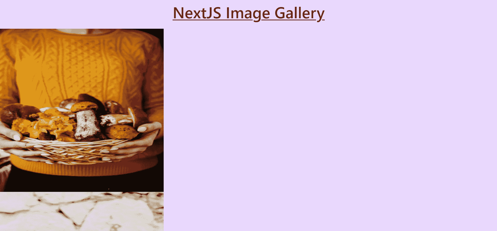

Displaying images using img element

除了图像大小不合适的事实之外，我们使用``来显示图像还有另一个问题。

前往 [http://localhost:3000/](http://localhost:3000/) ，打开**开发者工具**，然后打开**网络**标签(Firefox 中的 **Ctrl+ Shift + E** ，Chrome 中的 **Ctrl + Shift + J** )。它看起来会像这样:

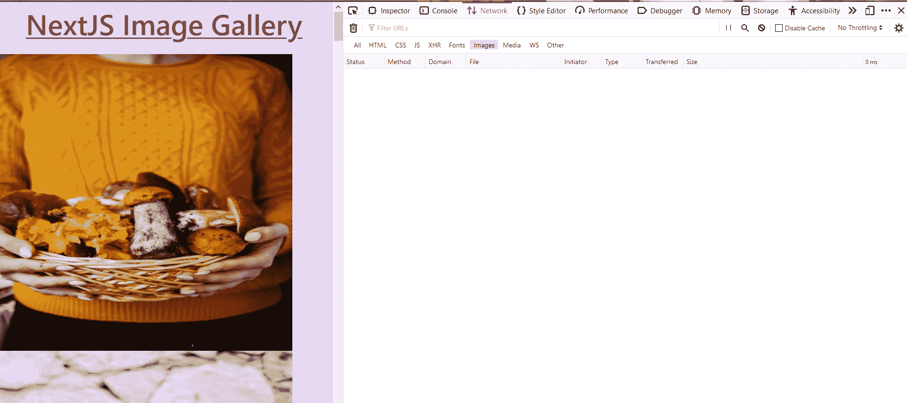

Network tab

现在重新加载您的页面。您将看到空的**网络**选项卡现在被数据填充。

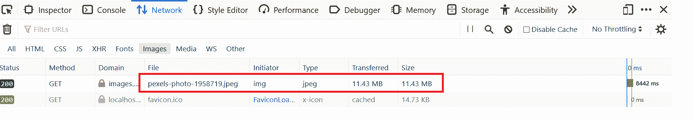

Single request

正如您在上面的图像中看到的，请求的文件大小超过 11 MB，这是针对单个文件或图像的。根据图像的质量，大小可以从 10 到 100 MB 不等，甚至更大。

假设你的应用程序登陆页面上有 80 张图片。每次有人访问你的画廊或网站时，传输大约 800 MB 的文件有意义吗？不是这样的。

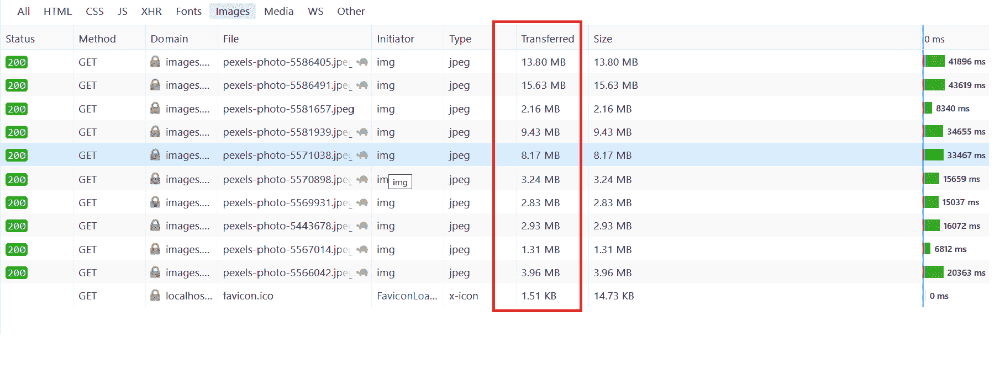

Multiple requests

这就是为什么今天，网络上的大多数图片都是以 [WebP](https://en.wikipedia.org/wiki/WebP) 格式提供的。这种格式显著地**缩小了图像的尺寸**，你**几乎察觉不到任何视觉差异**。

所以，我们需要把图像格式改成`webp`，但问题是，怎么改？需要手动吗？如果是的话，不会很费时间很累吗？

**不，你不需要手动操作。**

[Next.js 版本 10](https://nextjs.org/blog/next-10) 内置了对使用**图像**组件进行图像优化的支持。你可以在这里阅读更多关于[的更新。](https://nextjs.org/blog/next-10#built-in-image-component-and-automatic-image-optimization)

所以，让我们用 Next.js `Image`组件替换`img`元素。首先，像这样将这个组件导入到您的`index.js`中:

```
import Image from "next/image"; 
```

Importing Image component

但是等等，在我们在代码中使用这个组件之前，我们需要告诉 Next.js 我们的图像来自外部资源，比如来自 Pexels。

通过运行以下命令，停止开发服务器并创建一个`next.config.js`文件:

```
touch next.config.js
```

bash

将以下代码添加到`next.config.js`:

```
module.exports = {
  images: {
    domains: ["images.pexels.com"],
  },
}; 
```

next.config.js

仅此而已。您可以在`images`字段中添加其他配置，如`path`、`imageSizes`、`deviceSizes`等。但是在本教程中，我们将把它们保留为默认值。你可以在这里阅读更多关于[的配置。](https://nextjs.org/docs/basic-features/image-optimization)

用`Image`组件替换`img`并通过道具，如下图所示:

```
{
  photos.map((pic) => (
    <Image
      src={pic.src.portrait}
      height={600}
      width={400}
      alt={pic.url}
    />
  ))
} 
```

如上所述，Pexels API 在`src`字段下提供相同图像的不同格式或大小，如`portrait`、`landscape`、`tiny`等。

本教程使用登录页面上的`portrait`图像，但是您可以自由探索其他尺寸。

```
src: {
    original: "https://images.pexels.com/photos/4905078/pexels-photo-4905078.jpeg",
    large2x: "https://images.pexels.com/photos/4905078/pexels-photo-4905078.jpeg?auto=compress&cs=tinysrgb&dpr=2&h=650&w=940",
    large: "https://images.pexels.com/photos/4905078/pexels-photo-4905078.jpeg?auto=compress&cs=tinysrgb&h=650&w=940",
    medium: "https://images.pexels.com/photos/4905078/pexels-photo-4905078.jpeg?auto=compress&cs=tinysrgb&h=350",
    small: "https://images.pexels.com/photos/4905078/pexels-photo-4905078.jpeg?auto=compress&cs=tinysrgb&h=130",
    portrait: "https://images.pexels.com/photos/4905078/pexels-photo-4905078.jpeg?auto=compress&cs=tinysrgb&fit=crop&h=1200&w=800",
    landscape: "https://images.pexels.com/photos/4905078/pexels-photo-4905078.jpeg?auto=compress&cs=tinysrgb&fit=crop&h=627&w=1200",
    tiny: "https://images.pexels.com/photos/4905078/pexels-photo-4905078.jpeg?auto=compress&cs=tinysrgb&dpr=1&fit=crop&h=200&w=280",
  } 
```

`src` field of the photo object

正如您在上面的示例`src`字段中看到的，图像的`portrait`格式的宽度为 **800** ，高度为 **1200** 。但是它太大了，无法在网页上显示，所以我们将通过除以 2 来缩小它。所以`600`和`400`被传入`Image`组件的高度和宽度。

重启您的开发服务器，然后前往 [http://localhost:3000/](http://localhost:3000/) 。你会看到应用本身看起来一模一样。但是这一次如果你打开**网络**标签并重新加载页面，你会看到一些真正神奇的东西。

您的图像现在是`webp`格式，并且尺寸已经缩小。

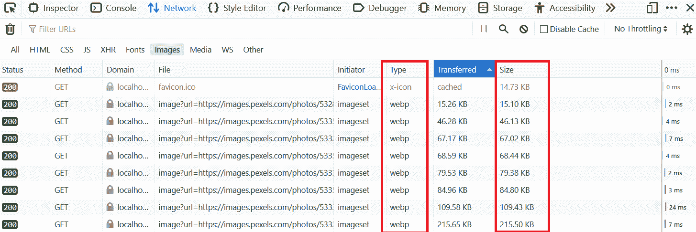

Network tab

Next.js 图像组件还为图像添加了[延迟加载](https://en.wikipedia.org/wiki/Lazy_loading)。这里有一个例子来解释如果你不熟悉延迟加载，你应该如何以及为什么使用它。

即使图像现在是`webp`格式，当有人访问你的网站时，有必要加载所有的图像吗？如果访问者只是来了又走，没有滚动，在页面底部加载图片有意义吗？

没有必要加载用户或访问者在大多数情况下不会看到的图像。

这就是**懒加载**来拯救世界的地方。当需要图像时，或者在这种情况下，当图像进入视野时，它延迟对图像的请求。这大大有助于降低初始页面权重，提高网站性能。

如果您转到 [http://localhost:3000/](http://localhost:3000/) 并滚动浏览所有图像，您将看到不在视窗中的图像最初没有被加载。但是当你向下滚动时，它们被转移和加载。

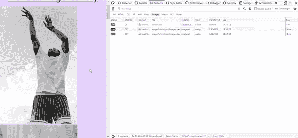

Lazy Loading

默认情况下，`Image`组件的`layout`属性的值为`intrinsic`，这意味着图像将缩小较小视窗的尺寸，但保持较大视窗的原始尺寸。

有许多道具可以传递给`Image`组件来进一步修改这个组件。你可以在这里读到它们。

## 如何使用 Chakra UI 设计图像样式

为了设计图像的样式，我们将使用 Chakra UI 的`Wrap`组件。

[Wrap](https://chakra-ui.com/docs/layout/wrap) 是一个布局组件，在这个场景中，它在其子元素或图像之间添加一个定义的空间。如果没有足够的空间容纳任何孩子，它会自动“包装”它的孩子。

从 Chakra UI 导入`Wrap`和`WrapItem`。

```
import { Box, Container, Text, Wrap, WrapItem } from "@chakra-ui/react"; 
```

`WrapItem`包含单个子节点，而`Wrap`包含所有的`WrapItem`组件。

修改表达式以显示如下图像:

```
<Wrap px="1rem" spacing={4} justify="center">
  {photos.map((pic) => (
    <Image src={pic.src.portrait} height={600} width={400} alt={pic.url} />
  ))}
</Wrap>
```

Wrap

下面是上面代码中发生的情况:

*   `px="1rem"`是`padding-left`和`padding-right`的速记道具。这增加了 1 雷姆的水平填充。
*   `spacing={4}`在每个子对象之间应用间距。一旦每个图像都用`WrapItem`包装，就会看到这一点。
*   `justify="center"`将图像居中对齐。

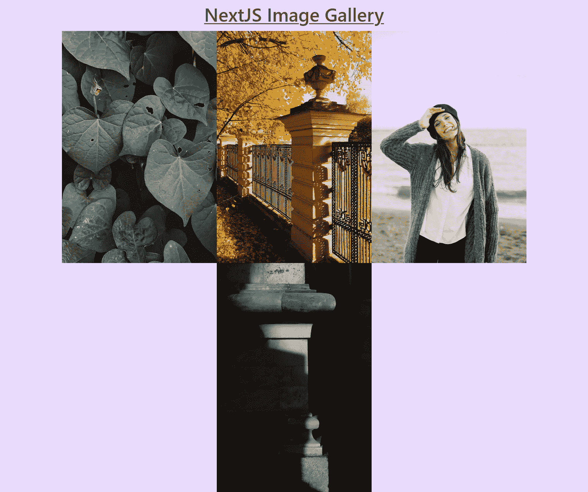

Wrap

现在用`WrapItem`包裹每张图片。在 JavaScript 表达式中添加以下代码:

```
<Wrap px="1rem" spacing={4} justify="center">
  {photos.map((pic) => (
    <WrapItem
      key={pic.id}
      boxShadow="base"
      rounded="20px"
      overflow="hidden"
      bg="white"
      lineHeight="0"
      _hover={{ boxShadow: "dark-lg" }}
    >
      <Image src={pic.src.portrait} height={600} width={400} alt={pic.url} />
    </WrapItem>
  ))}
</Wrap> 
```

Wrap and WrapItem

让我们逐一讨论传递给`WrapItem`的道具:

*   给每个图像一个唯一的键，以便 React 可以区分孩子或图片。
*   `boxShadow="base"`给`WrapItem`添加阴影。
*   `rounded="20px"`增加一个 20px 的`border-radius`。
*   `overflow="hidden"`确保图像不会溢出`WrapItem`，并且看起来是圆形的。
*   `bg="white"`给`WrapItem`添加白色背景。
*   `lineHeight="0"`将`line-height`属性设置为零。
*   `_hover={{ boxShadow: "dark-lg" }}`当您将鼠标悬停在图像上时，改变`boxShadow`。

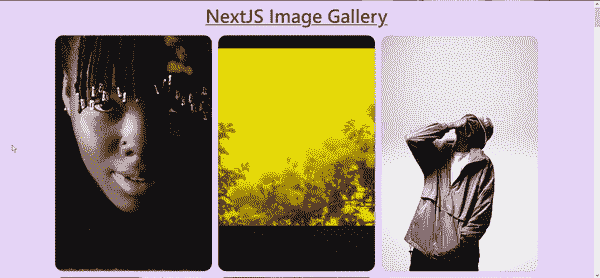

GIF

你会看到，自从我们将`WrapItem`添加到图像中后，`spacing={4}`也开始生效。

## 如何向图库添加搜索功能

下一步是添加一个特性，允许用户搜索图像并向他们显示这些图像。为此，我们将在 Pexels API 中使用`/search`端点。

在`lib/api.js`中，创建一个新函数`getQueryPhotos()`，根据用户的搜索输入搜索图像。

```
export const getQueryPhotos = async (query) => {
  const res = await fetch(`https://api.pexels.com/v1/search?query=${query}`, {
    headers: {
      Authorization: API_KEY,
    },
  });
  const responseJson = await res.json();
  return responseJson.photos;
}; 
```

api.js

上面的函数`getQueryPhotos()`类似于`getCuratedPhotos`，但是这里我们给函数添加了一个`query`参数，并修改了 API 端点以包含这个`query`。

```
`https://api.pexels.com/v1/search?query=${query}`
```

API endpoint - searching for images

在`index.js`中导入`getQueryPhotos()`功能。

```
import { getCuratedPhotos, getQueryPhotos } from "../lib/api"; 
```

Importing `getQueryPhotos()` in index.js

现在，我们将创建一个表单来接受用户输入并搜索相同的内容。

我们将从 Chakra UI 导入并使用`Input`、`IconButton`、`InputRightElement`和`InputGroup`来创建这个表单。

像这样修改 Chakra UI 导入并为`SearchIcon`添加一个导入:

```
import {
  Box,
  Container,
  Text,
  Wrap,
  WrapItem,
  Input,
  IconButton,
  InputRightElement,
  InputGroup,
} from "@chakra-ui/react";
import { SearchIcon } from "@chakra-ui/icons"; 
```

在`index.js`文件的`Container`组件中为输入表单添加以下代码:

```
<InputGroup pb="1rem">
  <Input placeholder="Search for Apple" variant="ghost" />

  <InputRightElement
    children={
      <IconButton
        aria-label="Search"
        icon={<SearchIcon />}
        bg="pink.400"
        color="white"
      />
    }
  />
</InputGroup> 
```

Input Form

这就是我们正在做的。

*   `InputGroup`用于对`Input`和`InputRightElement`组件进行分组。这里的`pb`是`padding-bottom`的简写。
*   `Input`是用户输入查询的输入字段。它有一个占位符“搜索苹果”。
*   `InputRightElement`用于在`Input`组件的右边添加一个元素。一个带有搜索图标的[图标按钮](https://chakra-ui.com/docs/form/icon-button)被传递给`InputRightElement`的`children`道具。
*   是 Chakra UI 中的一个组件，当你想要一个图标作为按钮时，这个组件很有用。要渲染的图标在`icon`道具内部传递。

下面是输入字段的外观。

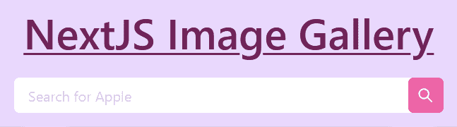

Input field

这个表单还没有做任何事情。让我们改变这一点。

定义一个名为`query`的新状态来存储用户的输入:

```
export default function Home({ data }) {
  const [photos, setPhotos] = useState(data);
  const [query, setQuery] = useState("");

...
}
```

`query` state 

修改`Input`组件，使用`value`方法和`onChange`事件在输入字段和`query`状态之间创建一个双向绑定:

```
<Input
  placeholder="Search for Apple"
  variant="ghost"
  value={query}
  onChange={(e) => setQuery(e.target.value)}
/>
```

Two Way Data Bind

现在，创建一个名为`handleSubmit()`的函数来处理搜索图标的点击事件。现在我们只需要`console.log`输入查询，然后清除字段。

```
export default function Home({ data }) {
  const [photos, setPhotos] = useState(data);
  const [query, setQuery] = useState("");

  const handleSubmit = async (e) => {
    await e.preventDefault();
    await console.log(query);
    await setQuery("");
  };

...
}
```

handleSubmit

将该函数添加到`IconButton`的`onClick`事件中:

```
<InputRightElement
  children={
    <IconButton
      aria-label="Search"
      icon={<SearchIcon />}
      onClick={handleSubmit}
      bg="pink.400"
      color="white"
    />
  }
/> 
```

onClick = {handleSubmit}

转到 [http://localhost:3000/](http://localhost:3000/) 并在输入字段中键入一些内容，然后单击 search 按钮。

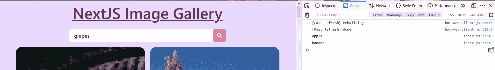

console.log(query)

但是这个表单仍然缺少一些东西:如果您试图通过点击**输入**而不是搜索按钮来搜索某个东西，它将刷新页面，并且查询不会被记录。

要解决这个问题，请用`form`元素将`InputGroup`括起来，并将`handleSubmit`函数传递给`onSubmit`事件，如下所示:

```
<form onSubmit={handleSubmit}>
  <InputGroup pb="1rem">
    <Input
      placeholder="Search for Apple"
      variant="ghost"
      value={query}
      onChange={(e) => setQuery(e.target.value)}
    />

    <InputRightElement
      children={
        <IconButton
          aria-label="Search"
          icon={<SearchIcon />}
          onClick={handleSubmit}
          bg="pink.400"
          color="white"
        />
      }
    />
  </InputGroup>
</form> 
```

你会注意到点击**回车**现在可以工作了。

现在像这样更新`handleSubmit`函数，根据用户的查询获取图像:

```
const handleSubmit = async (e) => {
  await e.preventDefault();
  const res = await getQueryPhotos(query);
  await setPhotos(res);
  await setQuery("");
}
```

上述函数将`query`变量传递给`getQueryPhotos()`函数，从该函数返回的数据使用`setPhotos(res)`覆盖了`photos`变量中先前的值。

完成了！你现在可以在你的应用中搜索图片。

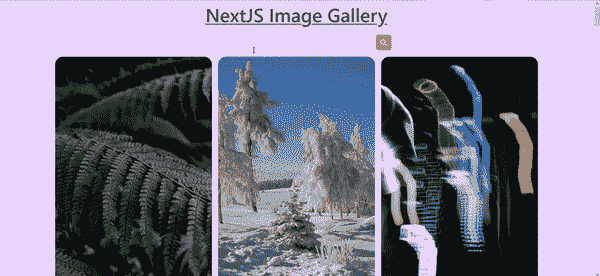

Searching for Apple

还是少了点什么。这是什么？

如果用户试图在没有任何查询的情况下进行搜索，比如使用**空字符串**，会怎么样？当前代码仍将尝试使用`""`发出请求，我们将遇到以下错误。

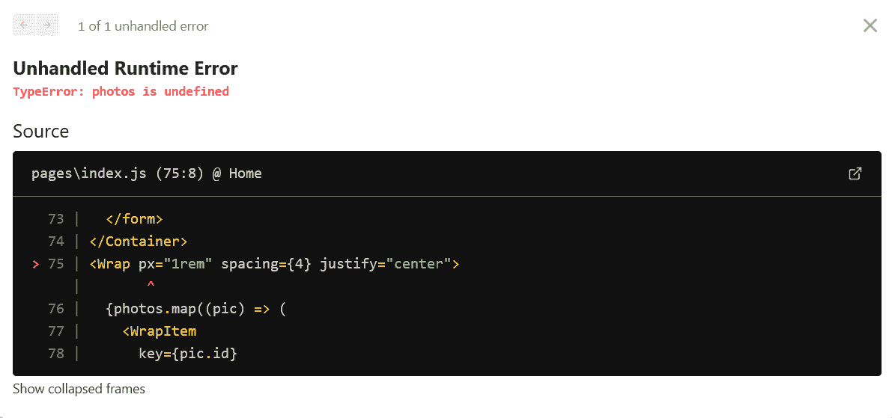

为了解决这个问题，我们将使用 Chakra UI 中的`Toast`。

从 Chakra UI 导入`useToast`:

```
import {
  Box,
  Container,
  Text,
  Wrap,
  WrapItem,
  Input,
  IconButton,
  InputRightElement,
  InputGroup,
  useToast
} from "@chakra-ui/react"; 
```

在定义状态的地方添加下面的代码来初始化 Toast。

```
export default function Home({ data }) {
  const [photos, setPhotos] = useState(data);
  const [query, setQuery] = useState("");
  const toast = useToast();

...
}
```

像这样修改`handleSubmit()`函数:

```
const handleSubmit = async (e) => {
  await e.preventDefault();
  if (query == "") {
    toast({
      title: "Error.",
      description: "Empty Search",
      status: "error",
      duration: 9000,
      isClosable: true,
      position: "top",
    });
  } else {
    const res = await getQueryPhotos(query);
    await setPhotos(res);
    await setQuery("");
  }
}; 
```

在上面的代码中，我们用一个简单的`if/else`语句来检查`query`是否为空。如果它是空的，那么我们显示一个带有`Empty Search`文本的错误提示。

尝试不在输入字段中键入任何内容就按下 **Enter** 。你会看到这样的祝酒词:

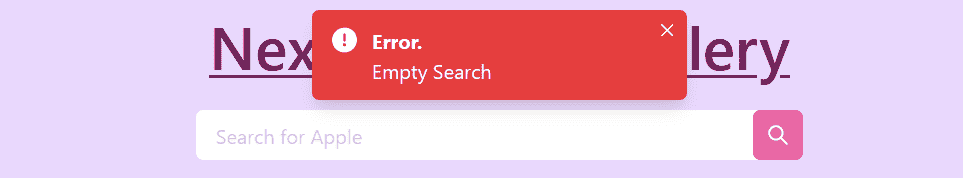

Empty Search toast

## 如何向图像添加动态路线

我们将为每张图片创建一个动态路径，这样用户可以点击图片来获取更多信息。

Next.js 有一个非常酷的特性，你可以通过在页面上添加括号(`[param]`)来创建动态路线，其中`param`可以是 URL slugs、漂亮的 URL、ID 等等。

这里的`param`是`id`，因为要从 Pexels API 获取特定的照片，您需要提供它的`id`。

在项目的根目录下运行以下命令，在 pages 下的`photos`目录中创建`[id].js`。

```
mkdir pages/photos
cd pages/photos
touch [id].js
```

从`index.js`的`next/link`导入`Link`。`Link`有助于路由之间的客户端转换。你可以在这里阅读更多关于`Link`T5 的内容。

```
import Link from "next/link" 
```

import Link from "next/link"

将此`Link`添加到每个图像，如下所示:

```
<Link href={`/photos/${pic.id}`}>
  <a>
    <Image src={pic.src.portrait} height={600} width={400} alt={pic.url} />
  </a>
</Link> 
```

Link

打开你的应用，试着点击任何一张图片。它将显示一个错误，因为我们已经创建了`photos/[id].js`，但没有在其中添加任何代码。

但是如果你注意到这个页面的网址，它会是这样的:

```
http://localhost:3000/photos/2977079
```

我们现在将在`lib/api.js`中创建第三个名为`getPhotoById()`的函数，以根据其 id 获取特定的照片。

将以下代码添加到`api.js`:

```
export const getPhotoById = async (id) => {
  const res = await fetch(`https://api.pexels.com/v1/photos/${id}`, {
    headers: {
      Authorization: API_KEY,
    },
  });
  const responseJson = await res.json();
  return responseJson;
};
```

上面的代码使用`/photos`端点从 Pexels API 获取单个图像。你会注意到，与`getCuratedPhotos`和`getQueryPhotos`不同，`getPhotoById`返回的是`responseJson`，而不是`responseJson.photos`。

将以下代码添加到`photos/[id].js`:

```
import { getPhotoById } from "../../lib/api";
import {
  Box,
  Divider,
  Center,
  Text,
  Flex,
  Spacer,
  Button,
} from "@chakra-ui/react";
import Image from "next/image";
import Head from "next/head";
import Link from "next/link";
import { InfoIcon, AtSignIcon } from "@chakra-ui/icons";

export default function Photos() {

    return (
      <Box p="2rem" bg="gray.200" minH="100vh">
        <Head>
          <title>Image</title>
          <link rel="icon" href="/favicon.ico" />
        </Head>

      </Box>
    )
  } 
```

[id].js

我们已经使用`bg`道具和`Box`组件添加了浅灰色的背景色。为了节省时间，我们已经提前导入了所有的组件和图标。

在`[id].js`中创建一个`getServerSideProps()`函数，从 Pexels API 中获取数据。

```
export async function getServerSideProps({ params }) {
  const pic = await getPhotoById(params.id);
  return {
    props: {
      pic,
    },
  };
} 
```

getServerSideProps({params})

重新启动开发服务器。

你可能会问`getServerSideProps()`是如何从`params`参数中得到图像的`id`的？

由于该页面使用了动态路由，`params`包含了路由参数。这里的页面名称是`[id].js`，所以`params`看起来会像`{ id: ... }`。

你可以试试`console.log(params)`——它看起来会像这样。

```
{ id: '4956064' }
```

将这个`pic`属性作为参数传递给`Photos`组件函数。

```
export default function Photos({ pic }) {
...
} 
```

将以下代码添加到`Box`组件中:

```
<Box p="2rem" bg="gray.200" minH="100vh">
  <Head>
    <title> Image: {pic.id}</title>
    <link rel="icon" href="/favicon.ico" />
  </Head>

  <Flex px="1rem" justify="center" align="center">
    <Text
      letterSpacing="wide"
      textDecoration="underline"
      as="h2"
      fontWeight="semibold"
      fontSize="xl"
      as="a"
      target="_blank"
      href={pic.photographer_url}
    >
      <AtSignIcon />
      {pic.photographer}
    </Text>
    <Spacer />
    <Box as="a" target="_blank" href={pic.url}>
      <InfoIcon focusable="true" boxSize="2rem" color="red.500" />{" "}
    </Box>{" "}
    <Spacer />
    <Link href={`/`} >
         <Button
            as="a"
            borderRadius="full"
            colorScheme="pink"
            fontSize="lg"
            size="lg"
            cursor="pointer"
          >
            🏠 Home
         </Button>
    </Link>
  </Flex>
  <Divider my="1rem" />

  <Center>
    <Box as="a" target="_blank" href={pic.url}>
      <Image
        src={pic.src.original}
        width={pic.width / 4}
        height={pic.height / 4}
        quality={50}
        priority
        loading="eager"        
      />
    </Box>
  </Center>
</Box> 
```

[id].js

以下是您的页面现在的外观:

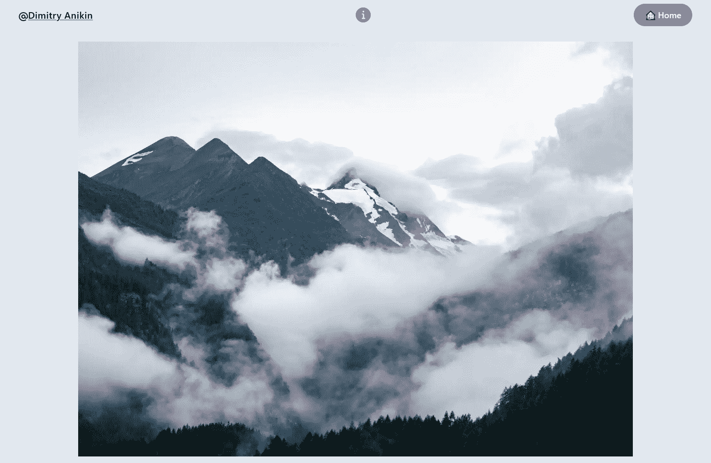

Photo page

让我们一段一段地分解这段代码。

*   我们首先修改页面的标题，在文本之后传递图片的 id。

```
<Head>
  <title> Image: {pic.id}</title>
  <link rel="icon" href="/favicon.ico" />
</Head>
```

*   然后我们使用`Flex`组件创建一个导航栏。

```
<Flex px="1rem" justify="center" align="center">
...
</Flex>
```

这里的`px`是`padding-left`和`padding-right`的速记道具，`justify`和`align`分别代表`justify-content`和`align-items`。

*   然后我们使用`Text`和`AtSignIcon`图标添加一个到摄影师的链接。你也可以用`@`标志代替`AtSignIcon`。

```
<Text
  letterSpacing="wide"
  textDecoration="underline"
  as="h2"
  fontWeight="semibold"
  fontSize="xl"
  as="a"
  target="_blank"
  href={pic.photographer_url}
>
  <AtSignIcon />
  {pic.photographer}
</Text> 
```

道具是 Chakra UI 中的一个特性，允许你传递一个 HTML 标签或者组件来渲染。

在这里，我们将它与`<a>`标签一起使用，因此`Text`组件将在页面上呈现为`<a>`标签。

`target="_blank"`确保链接在新的窗口或标签中打开。

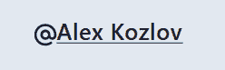

Photographer link

*   然后我们添加一个`Spacer`组件，当它与`Flex`一起使用时，在 Flex 的子组件之间分配空白空间。你可以在这里了解更多关于[的信息。](https://next.chakra-ui.com/docs/layout/flex#flex-and-spacer-vs-grid-vs-stack)

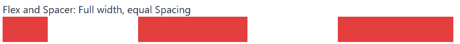

[Image Source - Chakra UI docs](https://next.chakra-ui.com/docs/layout/flex#flex-and-spacer-vs-grid-vs-stack)

*   接下来，我们在 Pexels 上添加一个链接到照片的信息图标。

```
<Box as="a" target="_blank" href={pic.url}>
  <InfoIcon focusable="true" boxSize="2rem" color="red.500" />
</Box>
<Spacer /> 
```

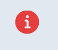

Info Icon

*   然后我们在导航中添加`Home`按钮，使用来自`next/link`的`Link`组件将用户带回应用程序的登陆页面。

```
<Link href={`/`}>
  <Button
    as="a"
    borderRadius="full"
    colorScheme="pink"
    fontSize="lg"
    size="lg"
    cursor="pointer"
  >
    🏠 Home
  </Button>
</Link>
```

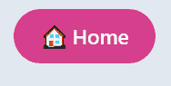

Home button

*   然后我们使用`Divider`组件来划分导航条和图像。

```
<Divider my="1rem" /> 
```

这里的`my`是`margin-top`和`margin-bottom`的速记道具。

*   最后，我们使用`Center`组件将图像添加到页面中，顾名思义，该组件使其子代居中。

```
<Center>
  <Box as="a" target="_blank" href={pic.url}>
    <Image
      src={pic.src.original}
      width={pic.width / 4}
      height={pic.height / 4}
      priority
      quality={50}
      loading="eager"
    />
  </Box>
</Center>
```

在上面的代码中，我们使用`Box`组件通过`as`属性在 Pexels 上添加一个到原始图像的链接。

您还会注意到我们已经在`Image`组件中传递了一些额外的道具。

*   `src`:我们这次是通过`original`图像。
*   我们通过将原始宽度和高度除以 4 来缩放图像。
*   通过传递`priority`，图像被视为高优先级，并被[预加载](https://web.dev/preload-responsive-images/#preload-overview)。
*   默认情况下，`Image`组件将优化图像的质量降低到 75%，但是由于图像仍然太大，我们通过传递`quality={50}`将其质量进一步降低到 50%。
*   默认情况下，加载行为在`Image`组件中是懒惰的，但是这里我们希望图像立即显示，因此我们传递了`loading="eager"`。

下面是上面的代码。

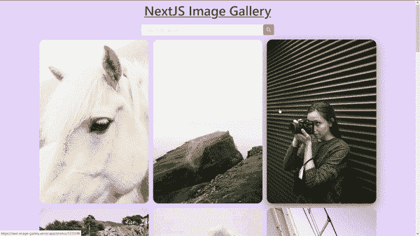

Next Image Gallery

## 你做到了！🎉

祝贺👏关于建立这个**下一个影像画廊**项目。

## 结论

在本教程中，我们学习了如何使用 Pexels API 和 Chakra UI 用 Next.js 构建图片库。

我们讨论了如何在任何 Next.js 项目中安装和使用 Chakra UI v1。我们还看到了如何从 API 获取数据并在 Next.js 中创建动态路由。

以下是您可以在项目中探索和使用的一些其他 API:

*   [Unsplash API](https://unsplash.com/developers)
*   [Pixabay API](https://pixabay.com/service/about/api/)
*   [flickr API](https://www.flickr.com/services/api/)
*   [最终空间 API](https://finalspaceapi.com/)

以下是一些有用的附加资源:

*   [Next.js 文档](https://nextjs.org/docs/getting-started)
*   [Chakra UI 文档](https://chakra-ui.com/docs/getting-started)
*   [pexel 的 API 文档](https://www.pexels.com/api/documentation/)

你想要本教程的第二部分吗，在这里我们使用[帧运动](https://www.framer.com/motion/)给图像添加动画？在[推特](https://twitter.com/noharashutosh)上让我知道。

你还想看什么项目或教程？在 [Twitter](https://twitter.com/noharashutosh) 上联系我，我将在下一篇文章中介绍它们！

如果你想自己添加功能，请分享并[标记我](https://twitter.com/noharashutosh)——我很想听听这些功能:)