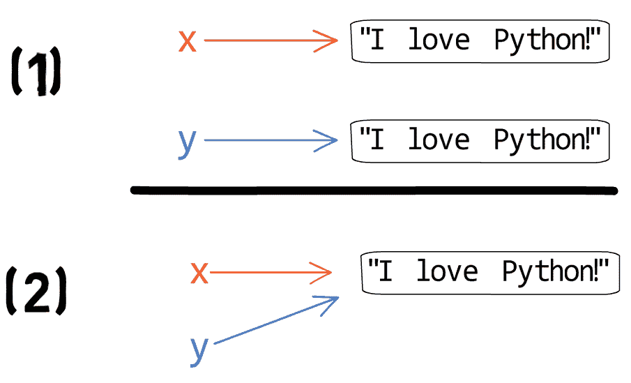
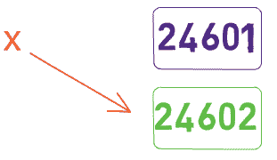
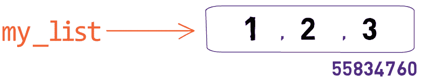
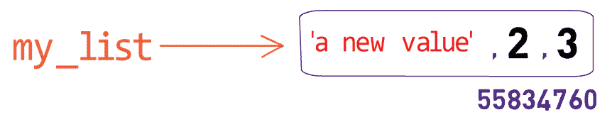
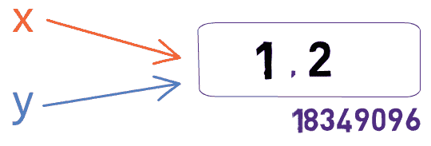
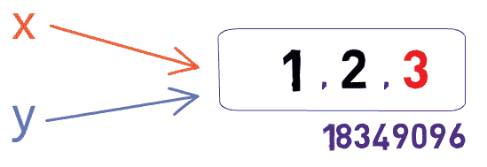
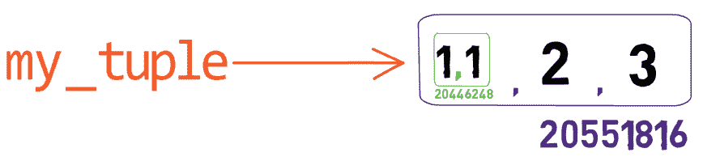
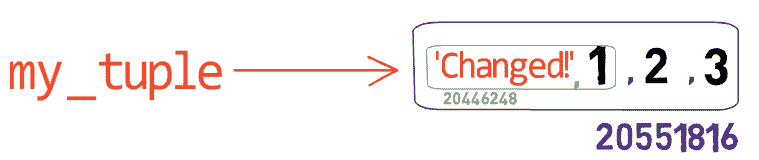

# Python 中可变对象与不可变对象的对比——可视化实践指南

> 原文：<https://www.freecodecamp.org/news/mutable-vs-immutable-objects-python/>

Python 是一门很棒的语言。因为它的简单，许多人选择它作为他们的第一编程语言。

有经验的程序员也一直在使用 Python，这要归功于它广泛的社区、丰富的包和清晰的语法。

但是有一个问题似乎让初学者和一些有经验的开发人员感到困惑:Python 对象。具体来说，**可变**和**不可变**对象之间的区别。

在这篇文章中，我们将加深对 Python 对象的了解，了解可变对象**和不可变对象**之间的区别，并看看我们如何使用**解释器**来更好地理解 Python 是如何运行的。****

我们将使用重要的功能和关键字，如`id`和`is`，我们将了解`x == y`和`x is y`的区别。

你准备好了吗？让我们开始吧。

# 在 Python 中，一切都是对象

不像其他编程语言中的语言*支持*对象，在 Python 中，一切都是对象——包括整数、列表，甚至函数。

我们可以使用我们的解释器来验证:

```
>>> isinstance(1, object)
True

>>> isinstance(False, object)
True

def my_func():
   return "hello"

>>> isinstance(my_func, object)
True
```

Everything in Python is an object

Python 有一个内置函数`id`，返回内存中某个对象的地址。例如:

```
>>> x = 1
>>> id(x)
1470416816
```

The function `id(obj)` returns the address of `obj` in memory

上面，我们创建了一个名为`x`的**对象**，并赋予其值`1`。然后我们使用了`id(x)`,发现这个对象位于内存中的地址`1470416816`。

这允许我们检查关于 Python 的有趣的事情。假设我们在 Python 中创建了两个变量——一个名为`x`，一个名为`y`——并赋予它们相同的值。例如，在这里:

```
>>> x = "I love Python!"
>>> y = "I love Python!"
```

我们可以使用等式运算符(`==`)来验证它们在 Python 的眼中确实具有相同的值:

```
>>> x == y
True
```

但是这些在内存中是同一个对象吗？理论上，这里可以有两种截然不同的场景。

根据场景 **(1)** ，我们实际上有两个不同的对象，一个名为`x`，另一个名为`y`，它们恰好具有相同的值。

然而，也有可能 Python 实际上只在这里存储了一个对象，它有两个引用它的名称——如场景 **(2)** 所示:



我们可以使用上面介绍的`id`函数来检查这一点:

```
>>> x = "I love Python!"
>>> y = "I love Python!"
>>> x == y
True

>>> id(x)
52889984

>>> id(y)
52889384
```

因此我们可以看到，Python 的行为符合上述场景(1)。即使本例中的`x == y`(即`x`和`y`具有相同的*值*，但它们在内存中是不同的对象。这是因为`id(x) != id(y)`，我们可以明确地验证:

```
>>> id(x) == id(y)
False
```

有一种更简单的方法来进行上面的比较，那就是使用 Python 的`is`操作符。检查`x is y`是否和检查`id(x) == id(y)`一样，也就是说`x`和`y`在内存中是否是同一个对象:

```
>>> x == y
True

>>> id(x) == id(y)
False

>>> x is y
False
```

这揭示了等式运算符`==`和等式运算符`is`之间的重要区别。

正如你在上面的例子中看到的，Python 中的两个名字(`x`和`y`)完全有可能被绑定到两个不同的对象(因此，`x is y`是`False`)，其中这两个对象具有相同的值(因此`x == y`是`True`)。

我们如何创建另一个变量来指向`x`所指向的同一个对象呢？我们可以简单地使用赋值操作符`=`，就像这样:

```
>>> x = "I love Python!"
>>> z = x
```

为了验证它们确实指向相同的对象，我们可以使用`is`操作符:

```
>>> x is z
True
```

当然，这意味着它们在内存中有相同的地址，我们可以使用`id`显式地验证这一点:

```
>>> id(x)
54221824

>>> id(z)
54221824
```

当然，它们有相同的值，所以我们期望`x == z`也返回`True`:

```
>>> x == z
True
```

# Python 中的可变和不可变对象

我们已经说过 Python 中的一切都是对象，然而对象之间有一个重要的区别。一些对象是**可变的**，而一些是**不可变的**。

正如我之前提到的，这个事实给许多 Python 新手造成了困惑，所以我们要确保它是清楚的。

## Python 中的不可变对象

对于 Python 中的一些类型，一旦我们创建了这些类型的实例，它们就永远不会改变。它们是**不可变的**。

比如`int`对象在 Python 中是不可变的。如果我们试图改变一个`int`对象的值会发生什么？

```
>>> x = 24601
>>> x
24601

>>> x = 24602
>>> x
24602
```

嗯，看来我们改`x`成功了。这也正是很多人困惑的地方。引擎盖下到底发生了什么？让我们使用`id`来进一步调查:

```
>>> x = 24601
>>> x
24601

>>> id(x)
1470416816

>>> x = 24602
>>> x
24602

>>> id(x)
1470416832
```

所以我们可以看到，通过赋值`x = 24602`，我们并没有改变`x`之前已经绑定的对象的值。相反，我们创建了一个新的对象，并将名字`x`绑定到它上面。

所以在通过使用`x = 24601`将`24601`分配给`x`之后，我们有如下状态:


在使用了`x = 24602`之后，我们创建了一个新对象，并将名称`x`绑定到这个新对象上。值为`24601`的另一个对象不再是`x`(或本例中的任何其他名称)可到达的:



每当我们给一个绑定到一个`int`对象的名字(在上面的例子中是- `x`)赋值时，我们实际上改变了这个名字到另一个对象的绑定。

这同样适用于`tuple` s，字符串(`str`对象)，以及`bool` s。换句话说，`int`(以及其他数字类型如`float`)、`tuple`、`bool`、`str`对象是**不可变的**。

让我们来检验这个假设。如果我们创建一个`tuple`对象，然后给它一个不同的值，会发生什么？

```
>>> my_tuple = (1, 2, 3)
>>> id(my_tuple)
54263304

>>> my_tuple = (3, 4, 5)
>>> id(my_tuple)
56898184
```

就像一个`int`对象一样，我们可以看到我们的赋值实际上改变了名称`my_tuple`绑定到的对象。

如果我们试图改变`tuple`的一个元素会发生什么？

```
>>> my_tuple[0] = 'a new value'
Traceback (most recent call last):
  File "<stdin>", line 1, in <module>
TypeError: 'tuple' object does not support item assignment
```

正如我们所见，Python 不允许我们修改`my_tuple`的内容，因为它是不可变的。

## Python 中的可变对象

Python 中的一些类型在创建后可以修改，它们被称为**可变**。例如，我们知道可以修改一个`list`对象的内容:

```
>>> my_list = [1, 2, 3]
>>> my_list[0] = 'a new value'
>>> my_list
['a new value', 2, 3]
```

这是否意味着我们在给第一个元素`my_list`赋值时实际上创建了一个新对象？同样，我们可以使用`id`来检查:

```
>>> my_list = [1, 2, 3]
>>> id(my_list)
55834760

>>> my_list
[1, 2, 3]

>>> my_list[0] = 'a new value'
>>> id(my_list)
55834760

>>> my_list
['a new value', 2, 3]
```

所以我们的第一个赋值`my_list = [1, 2, 3]`在地址`55834760`中创建了一个对象，其值为`1`、`2`和`3`:



然后我们使用`my_list[0] = 'a new value'`修改了这个`list`对象的第一个元素，也就是说——没有创建新的`list`对象:



现在，让我们创建两个名字——`x`和`y`，它们都绑定到同一个`list`对象。我们可以通过使用`is`，或者通过显式检查它们的`id`来验证这一点:

```
>>> x = y = [1, 2]
>>> x is y
True

>>> id(x)
18349096

>>> id(y)
18349096

>>> id(x) == id(y)
True
```

如果我们使用`x.append(3)`，现在会发生什么？也就是说，如果我们以`x`的名字给对象添加一个新元素(`3`)？

`x`会被改变吗？会不会`y`？

我们已经知道，它们基本上是同一个物体的两个名称:



由于该对象已更改，当我们检查其名称时，我们可以看到新值:

```
>>> x.append(3)
>>> x
[1, 2, 3]

>>> y
[1, 2, 3]
```

请注意，`x`和`y`与之前有相同的`id`——因为它们仍然绑定到相同的`list`对象:

```
>>> id(x)
18349096

>>> id(y)
18349096
```



除了`list` s，其他可变的 Python 类型还包括`set` s 和`dict` s

# Python 中字典键的含义

Python 中常用字典(`dict`对象)。快速提醒一下，我们这样定义它们:

```
my_dict = {"name": "Omer", "number_of_pets": 1}
```

然后，我们可以通过特定元素的键名来访问它:

```
>>> my_dict["name"]
'Omer'
```

字典是可变的，所以我们可以在创建后改变它们的内容。在任何给定的时刻，字典中的一个键只能指向一个元素:

```
>>> my_dict["name"] = "John"
>>> my_dict["name"]
'John'
```

有趣的是注意到一个**字典的键必须是不可变的**:

```
>>> my_dict = {[1,2]: "Hello"}
Traceback (most recent call last):
  File "<stdin>", line 1, in <module>
TypeError: unhashable type: 'list'
```

为什么会这样呢？

让我们考虑下面的假设场景(注意:下面的片段实际上不能在 Python 中运行):

```
>>> x = [1, 2]
>>> y = [1, 2, 3]
>>> my_dict = {x: 'a', y: 'b'}
```

This is a hypothetic case that cannot really be run in Python

到目前为止，事情似乎没有那么糟糕。我们假设，如果我们用键`[1, 2]`访问`my_dict`，我们将得到相应的值`'a'`，如果我们访问键`[1, 2, 3]`，我们将得到值`'b'`。

现在，如果我们尝试使用:

```
>>> x.append(3)
```

在这种情况下，`x`的值为`[1, 2, 3]`，而`y`的值也为`[1, 2, 3]`。当我们要求`my_dict[[1, 2, 3]]`时，我们应该得到什么？会是`'a'`还是`'b'`？为了避免这种情况，Python 不允许字典键是可变的。

# 把事情看得更远一些

让我们试着将我们的知识应用到一个更有趣的案例中。

下面，我们定义一个`list`(一个**可变**对象)和一个`tuple`(一个**不可变**对象)。`list`包括一个`tuple`,`tuple`包括一个`list`:

```
>>> my_list = [(1, 1), 2, 3]
>>> my_tuple = ([1, 1], 2, 3)
>>> type(my_list)
<class 'list'>

>>> type(my_list[0])
<class 'tuple'>

>>> type(my_tuple)
<class 'tuple'>

>>> type(my_tuple[0])
<class 'list'>
```

到目前为止一切顺利。现在，试着自己思考一下——当我们尝试执行以下每条语句时，会发生什么？

(1) `>>> my_list[0][0] = 'Changed!'`

(2) `>>> my_tuple[0][0] = 'Changed!'`

在语句(1)中，我们试图做的是改变`my_list`的第一个元素，即一个`tuple`。既然一个`tuple`是**不可改变的**，这种尝试注定要失败:

```
>>> my_list[0][0] = 'Changed!'
Traceback (most recent call last):
  File "<stdin>", line 1, in <module>
TypeError: 'tuple' object does not support item assignment
```

注意，我们试图做的是*而不是*改变列表，而是——改变它的第一个元素的内容。

让我们考虑陈述(2)。在这种情况下，我们访问的是`my_tuple`的第一个元素，恰好是一个`list`，并修改它。让我们进一步调查这个案例，看看这些元素的地址:

```
>>> my_tuple = ([1, 1], 2, 3)
>>> id(my_tuple)
20551816

>>> type(my_tuple[0])
<class 'list'>

>>> id(my_tuple[0])
20446248
```



当我们改变`my_tuple[0][0]`时，我们根本没有真正改变`my_tuple`！的确，改变之后，`my_tuple`的第一个元素仍然是内存中地址为`20446248`的对象。然而，我们确实改变了那个对象的值:

```
>>> my_tuple[0][0] = 'Changed!'
>>> id(my_tuple)
20551816

>>> id(my_tuple[0])
20446248

>>> my_tuple
(['Changed!', 1], 2, 3)
```

Both `id(my_tuple)` and `id(my_tuple[0])` remain the same after the change



由于我们只修改了`my_tuple[0]`的值，这是一个可变的`list`对象，这个操作确实是 Python 允许的。

# 概述

在这篇文章中，我们学习了 Python 对象。我们说过在 Python **中，一切都是对象**，并且使用`id`和`is`来加深我们对使用 Python 创建和修改对象时发生的事情的理解。

我们还了解了**可变**对象和**不可变**对象之间的区别，前者可以在创建后修改，后者则不能。

我们看到，当我们要求 Python 修改绑定到某个名称的不可变对象时，我们实际上创建了一个新对象并将该名称绑定到它。

然后我们学习了为什么在 Python 中字典键必须是不可变的。

理解 Python 如何“看到”对象是成为更好的 Python 程序员的关键。我希望这篇文章对你掌握 Python 有所帮助。

[**奥默**](https://www.linkedin.com/in/omer-rosenbaum-034a08b9/)*[**斯温**](https://swimm.io/) **的首席技术官。网络培训专家，Checkpoint 安全学院创始人。** [**计算机网络(希伯来语)**](https://data.cyber.org.il/networks/networks.pdf) **的作者。访问我的**[**YouTube 频道**](https://www.youtube.com/watch?v=79jlgESHzKQ&list=PL9lx0DXCC4BMS7dB7vsrKI5wzFyVIk2Kg) **。***