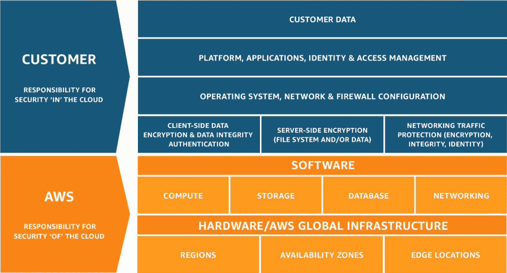
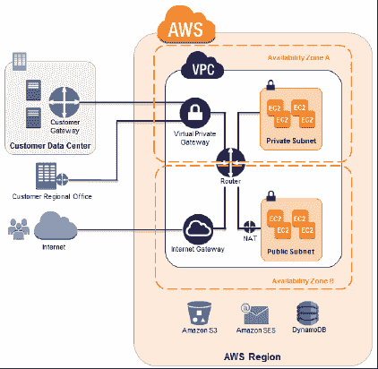
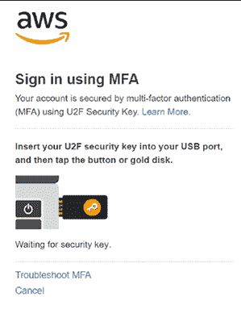
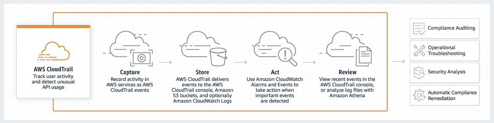
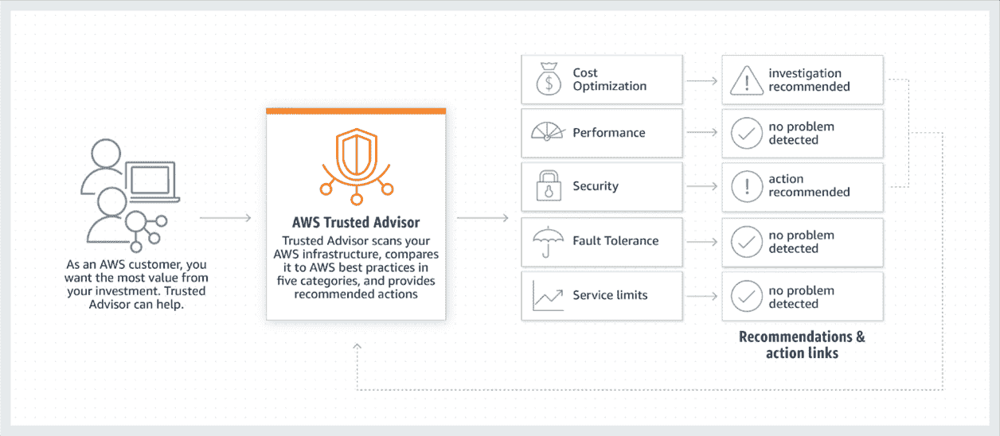

# 如何在 AWS 上保护您的工作负载

> 原文：<https://www.freecodecamp.org/news/how-to-secure-your-workloads-on-aws/>

如今，企业都在努力省钱，所以很多企业都在转向云计算。一项研究表明，[全球公共云服务市场](https://www.gartner.com/en/newsroom/press-releases/2020-07-23-gartner-forecasts-worldwide-public-cloud-revenue-to-grow-6point3-percent-in-2020#:~:text=The%20worldwide%20public%20cloud%20services,increasing%2095.4%25%20to%20%241.2%20billion.)将在 2020 年增长 6.3%。

云服务收入将从 2019 年的 2427 亿美元增长到 2579 亿美元。但是，随着技术变得越来越先进，黑客们越来越善于利用这种技术来获取您的关键任务数据。2020 年 1 月至 4 月，基于云的攻击增长了 630%。

随着越来越多的数据存储在云中，企业需要有强大的安全策略。它们还必须包括处理存储在 AWS 等云服务中的数据的最佳实践。

到 2020 年底，大约 83%的[企业工作负载将迁移到云](https://www.varonis.com/blog/cybersecurity-statistics/)，有大量的关键数据需要保护。

在本文中，我们将讨论一些企业应该实施的最佳实践，以保护他们已经转移到云的数据。

## 浏览 AWS 文档

AWS 文件详细说明了客户和 AWS 的责任。[共享责任模式](https://aws.amazon.com/compliance/shared-responsibility-model)声明 AWS 负责保护运行 AWS 云上提供的服务的基础设施。

客户的责任包括他们选择使用的服务的安全配置和管理。

[Source](https://aws.amazon.com/compliance/shared-responsibility-model)

## 使用身份和访问管理

AWS 文档明确指出，客户需要使用身份和访问管理(IAM)工具来保护他们的数据。 [AWS IAM 工具](https://aws.amazon.com/iam/)允许您管理有权访问云的用户。

IAM 允许用户控制对某些资源的访问。该工具还使客户端能够创建和管理 AWS 用户和组。

[Source](https://aws.amazon.com/blogs/aws/category/iam)

提供了允许或拒绝访问各种 AWS 资源的特定权限。如果您希望将权限分配给任何一个资源，您可以创建如下策略:

*   **动作**:允许哪些服务动作。
*   **资源**:对于哪些资源，你将允许那些动作。
*   **生效**:无论您是拒绝还是允许访问。
*   **条件**:动作生效的要求。

您的网站管理员可以在 AWS 帐户中创建一个或多个 IAM 用户。您可以在 AWS 管理控制台中创建用户，并且一次最多可以添加十个用户。

## 使用多因素身份验证

虽然在 AWS 上存储数据是相当安全的，但是您仍然必须采取预防措施，防止未经授权的访问。

正如 AWS 所建议的，您可以使用[多因素认证(MFA)](https://aws.amazon.com/iam/features/mfa/) 来获得额外的安全层。仅使用您的用户 ID 和密码可能不够安全，因为黑客已经开发了许多方法来破解您的密码。

[Source](https://aws.amazon.com/blogs/security/use-yubikey-security-key-sign-into-aws-management-console)

您还可以使用 MFA 控制对 AWS API 的访问。您可以在 AWS 帐户中为 IAM 用户启用和管理虚拟 MFA 设备。

只需登录 AWS 管理控制台，选择用户后添加 MFA 即可。

## 拥有强大的安全设备

亚马逊的关系数据库必须加密，除非它们已经在存储级加密。IAM 密钥必须每三个月更换一次。

您还必须对 EC2 实例进行逻辑标记，因为这可以提供关于实例位置及其用法的更多信息。它还可以帮助您保持环境的一致性。

标签也可以帮助你更有效地管理你的亚马逊资源。您的网站管理员可以定位、分类和识别资源以满足他们的各种需求。

过滤可以帮助您找到并验证您的组织中采用的标记标准。您可以使用自动化工具来协助标记过程。有一个资源组标记 API 可以帮助您过滤、管理和搜索标记。

## **培训你的员工**

当您采取措施增强 AWS 云系统的安全性时，您还必须为员工组织定期培训。

研究表明，黑客经常以员工为目标来访问受保护的网络。防御中的一个小失误都可能导致潜在的数据泄露，从而损害您的组织。

您的员工必须了解您用来保护 AWS 数据的安全协议。如果您组织中的每个人都不知道这些协议，那么您在实施这些协议时可能会遇到问题。

当你引入新的流程时，你应该为你的员工组织一次短期培训。你也可以制作自学视频，最后进行一次小测验。

## 使用端到端加密

端到端加密有助于保护您的数据免受未经授权的访问——您只需在 AWS 上安装 SSL 证书。

AWS 管理控制台可以在控制台服务端点和客户端浏览器之间使用 SSL 证书。SSL 证书将允许浏览器和 web 服务器之间的加密交互。客户端浏览器可以验证控制服务端点的身份。

[Source](https://aws.amazon.com/blogs/security/how-to-improve-ldap-security-in-aws-directory-service-with-client-side-ldaps)

使用 HTTPS 协议有助于保护您的敏感数据。但是，当您的服务器处理数百个 SSL/ TLS 会话时，您还必须考虑额外的资源需求。

要安装证书，您需要将证书和中间文件转换为 PEM 格式。然后，您必须将它上传到您的 AWS 帐户，并配置一个 HTTPS 监听器。让我们更深入地看看这个过程。

### 如何在 AWS 服务器上安装 SSL

CSR 生成并提交给证书颁发机构后，证书颁发机构会验证详细信息并颁发 SSL 证书。

私钥文件和证书文件都在。CRT 格式。一旦你有了这两个文件，你需要把它们上传到服务器。

*   首次登录 AWS 并登录 AWS EC2。
*   然后，浏览导航菜单>>点击**网络安全**>选择**负载均衡器**。
*   上传证书时，浏览主窗格并选择负载平衡器图标。
*   现在，点击' **Listeners** 选项卡，并点击' **Edit** 和' **Add** 。
*   在 SSL 证书栏中选择 HTTPS，并在同一栏中点击“**更改**”。
*   单击单选按钮“**向 AWS 身份和访问管理(IAM)** 上传新的 SSL 证书。您也可以在这里重命名证书。
*   在私钥字段中，将私钥的全部内容粘贴到提供的框**“——开始 RSA 私钥——”和“—结束 RSA 私钥——**中。
*   在公钥证书中，将证书的详细信息粘贴到相应的字段**“——开始证书——”和“—结束证书—”**中。
*   最后，将证书链或 CA Bundle.crt 粘贴到相应的列**“——开始证书——”和“—结束证书——**。
*   点击**保存**完成安装过程。上传证书后，IAM 将验证并确认安装。
*   重启您的 **AWS EC2** 实例以查看更改。

## 制定适当的恢复政策

您应该有一个可靠的备份和恢复策略。即使您的安全性是一流的，备份和灾难恢复也是至关重要的。

AWS backup 可以帮助您找到合适的工具来实现可扩展的备份和恢复解决方案。他们的集中式备份流程允许您轻松地自动化和集中备份。

您的网站管理员可以轻松地监控许多 AWS 资源的备份过程。此外，只需几次点击，您就可以在 AWS 备份控制台中创建备份策略。

要启动 AWS 备份，您必须登录您的 AWS 帐户并启动 AWS 备份控制台。

接下来，创建备份计划并分配资源。资源将根据您的策略进行备份。

资源备份后，用户可以根据需要对其进行监控、恢复或修改。

以下是创建灾难恢复计划(DRP)应采取的几个步骤:

*   创建一套定义与 DRP 相关的规则和条例的说明。这称为灾难恢复管理应急声明。
*   运行业务影响分析，了解关键 IT 应用程序和组件以及与业务相关的风险的影响。
*   采取预防、检测和纠正控制措施，检测并最大限度地降低风险率。此外，保持安全软件更新，安装火警，运行员工培训课程，并安装网络和服务器监控软件。
*   找到在故障期间会受到轻微影响的应用程序和业务部门(低故障保证)。
*   运行测试来检查在每个测试过程之后是否发生了变化。应对管理层和员工进行灾难恢复流程培训。

## **使用 CloudTrail**

[CloudTrail](https://aws.amazon.com/cloudtrail) 有助于您的 AWS 帐户的运营和风险审计以及合规性和治理。

它的服务允许你的网站管理员持续监控你的 AWS 账户的活动。它还保存了所有 AWS 服务中所有活动的历史记录。

[Source](https://aws.amazon.com/cloudtrail)

CloudTrail 将帮助您跟踪资源变化，分析您的安全协议，并检测您帐户上的异常活动。您必须确定对您的活动至关重要的数据。

您可以分析 CloudTrail 的日志，因为它们收集了有关您的 AWS 帐户使用情况的关键数据。CloudTrail 必须跨所有地理区域启用，以便让您获得这些见解。

### 如何设置 AWS CloudTrail

当您在 AWS 帐户中创建踪迹时，它允许您利用其他 AWS 服务。这样，您就可以检查存储在 CloudTrail 日志中的事件数据。创建 AWS 帐户时，默认情况下会出现 CloudTrail。

#### 为所有宗教设置云轨迹

为您的 CloudTrail 命名，并为“将轨迹应用于所有区域”选择“是”。你应该把它应用到所有地区，即使你只是处理一个国家。您可以检查其他地区的活动，与您的活动进行比较。

#### 选择事件日志

您可以记录不同的事件，如管理、数据和洞察事件。您应该根据组织的需求选择事件类型。

#### 启用日志文件验证

您应该在您的 S3 存储桶上配置日志，默认情况下使用 SSE-S3 加密进行编码。在“存储位置”选项下，您可以单击“是”来“启用日志文件验证”。

#### 配置 CloudWatch 警报

在 AWS 帐户中创建踪迹后，您可以通过单击“配置”按钮来配置 CloudWatch 安全性。

之后，通过单击“使用 CloudFormation 模板为安全和网络相关 API 活动创建 CloudWatch 警报”来启用 IAM。

当您这样做时，您将收到一个关于任何 API 安全调用的通知。

现在 CloudTrail 应该已经设置好了。

## 使用 AWS 可信顾问

[AWS 可信顾问](https://aws.amazon.com/premiumsupport/technology/trusted-advisor)帮助您密切关注云服务的所有领域。

它监视云环境和运行在其上的应用程序。它还允许你扫描你的内部网络，并与 AWS 的标准进行比较。

您可以从 AWS 管理控制台访问 AWS Trusted Advisor。所有的账户都可以使用一些支票。

企业必须订阅 AWS 支持的业务或企业级别，才能访问所有检查。

[Source](https://aws.amazon.com/premiumsupport/technology/trusted-advisor)

您可以通过 AWS 免费获得以下检查:

*   **Check IAM use** :检查客户端是否遵循安全最佳实践，以及是否创建了用户、组和角色来控制对 AWS 资源的访问。
*   **服务极限检查**:检查您对于不同产品的基本服务极限的位置。
*   **根帐户上的 MFA 检查**:检查您是否使用 MFA。
*   安全组(特定端口无限制检查):这个检查是必不可少的，如果对 EC2 实例的访问过于宽松，它会通知网站管理员。它有助于防止拒绝服务或黑客攻击。

## 结论

随着越来越多的企业将其数据转移到云上，他们必须采取更多的预防措施来安全有效地管理这些数据。

向云的迁移导致了更多的数据泄露，SSL 证书对于安全的 AWS 服务变得至关重要。

我希望您在本文中学到了一些帮助管理 AWS 服务的最佳实践。