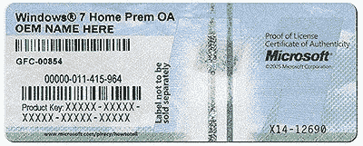
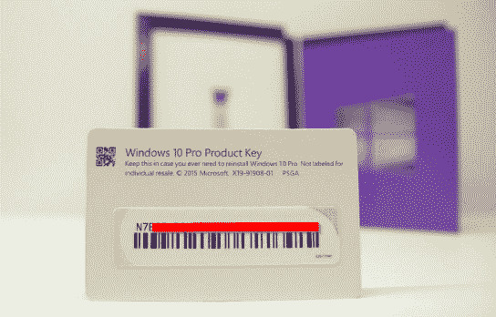
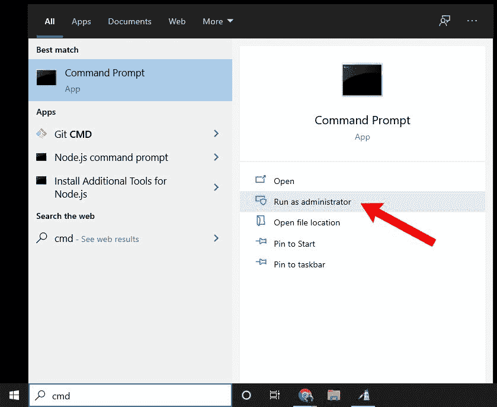
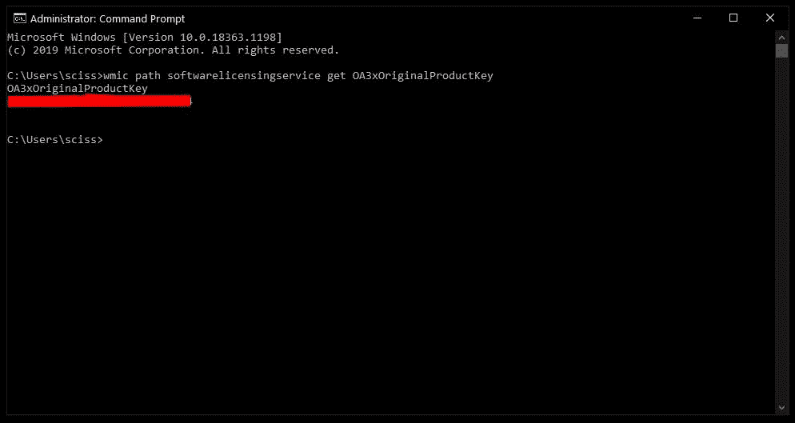
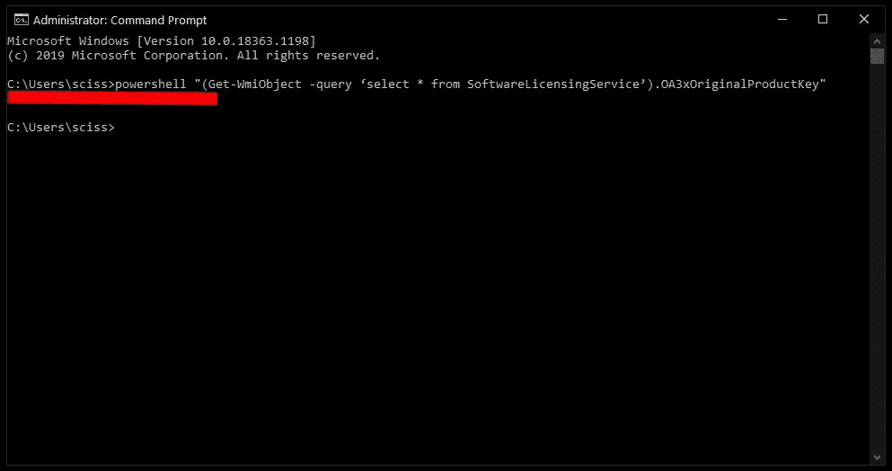
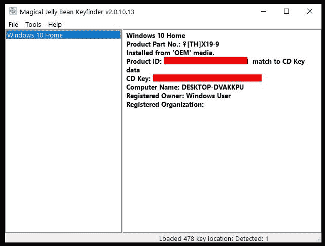

# 如何找到 Windows 10 产品密钥

> 原文：<https://www.freecodecamp.org/news/how-to-find-a-windows-10-product-key/>

如果您找不到 Windows 10 产品密钥，我们会帮您找到。

在这个快速教程中，我们将讨论什么是 Windows 产品密钥，我将分享几种在现代 Windows 机器上找到产品密钥的方法。

## 什么是 Windows 10 产品密钥？

Windows 产品密钥或许可证是一个 25 位数的代码，用于激活您的 Windows 安装。

过去，要找到 Windows 产品密钥，您只需在机器上的某个地方寻找一个标签。

通常你可以在台式电脑的侧面或者笔记本电脑的底部找到这个标签:



An old-school Windows product key sticker – [Source](https://answers.microsoft.com/en-us/windows/forum/windows_10-win_licensing/how-to-find-your-windows-product-key/f032f08f-f114-46f6-ab81-b28004dd43a0)

或者，如果您购买了 Windows 的实体版本，您的产品密钥将包含在包装盒的某个地方:



A Windows 10 product key label - [Source](https://answers.microsoft.com/en-us/windows/forum/windows_10-win_licensing/how-to-find-your-windows-product-key/f032f08f-f114-46f6-ab81-b28004dd43a0)

如今，如果你从微软商店或亚马逊等其他在线零售商那里购买 Windows 10 家庭版或专业版，它将包含你的产品密钥的数字副本。

但是，如果你的电脑相对较新，并且预装了 Windows，你可能想知道如何找到你的密钥——机器上可能没有标签，计算机制造商可能没有在包装盒中包括标签。

无论您是自己安装并激活 Windows，还是预装 Windows，您的产品密钥都存储在 [BIOS](https://www.freecodecamp.org/news/uefi-vs-bios/) 中。如果你想重新安装或升级 Windows，这真的很容易——机器上没有可能损坏的标签，也没有可能丢失的小标签。

不过，有时您可能需要产品密钥，例如，如果您想要将 Windows Home 或 Pro 许可证转移到另一台计算机。

不管是什么原因，这里有一些方法来获得您的 Windows 10 产品密钥。

## 如何通过命令提示符获取 Windows 10 产品密钥

如果您想从 Windows 获得产品密钥，最简单的方法是通过 Windows 命令提示符。

首先，按 Windows 键，搜索“cmd”，然后单击“以管理员身份运行”:



然后，运行以下命令:

```
wmic path softwarelicensingservice get OA3xOriginalProductKey
```

之后，您将看到您的 Windows 10 产品密钥:



或者，您可以在命令提示符终端中运行此命令:

```
powershell "(Get-WmiObject -query ‘select * from SoftwareLicensingService’).OA3xOriginalProductKey"
```



这两个命令都试图从名为 OA3 BIOS 标记的地方读取您的 Windows 产品密钥。换句话说，它们可能只有在预装了 Windows 的情况下才起作用，而不是在你自己构建机器并安装/激活 Windows 的情况下。

如果您的产品密钥由于某种原因没有保存到您的 BIOS/UEFI 中，那么这些命令要么抛出一个错误，要么返回一个空字符串。在这种情况下，或者如果您更喜欢 GUI，请尝试下一种方法。

## 如何通过第三方程序获取您的 Windows 10 产品密钥

有一些工具可以检测你的 Windows 产品密钥，比如贝拉克顾问(Belarc Advisor)或 T2 神奇的软糖键盘探测器(Jelly Bean KeyFinder)。

我们将在本教程中使用神奇的果冻豆键盘查找器，因为，好吧，来吧，这个名字，对不对？

你所要做的就是下载并安装神奇的果冻豆键盘查找器。然后打开 KeyFinder 程序查看您的产品密钥:



一旦你把你的产品密钥复制到一个安全的地方，就可以随意卸载神奇的果冻豆密钥查找器了。

以上是一些快速找到 Windows 10 产品密钥的方法。

这些方法或项目对你有用吗？您是否找到了获取产品密钥的其他方法？在推特上让我知道。