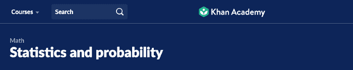
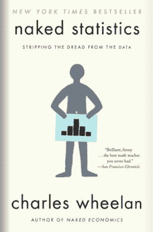
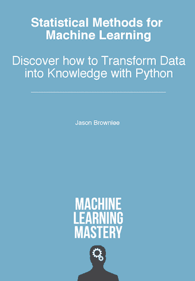

# 数据科学统计学——有志 ML 从业者完全指南

> 原文：<https://www.freecodecamp.org/news/statistics-for-data-science/>

在这个高度互联的世界中，数据正以前所未有的速度生成和消费。

尽管我们很享受数据的超导性，但它也会招致滥用。数据专业人员需要接受培训，不仅要使用统计方法来解释数字，还要揭露这种滥用，保护我们不被误导。

没有多少数据科学家受过正规的统计学培训。也很少有好的书籍和课程从数据科学的角度教授这些统计方法。

通过这篇文章，我打算阐明以下几点:

*   **什么是统计？**
*   **与机器学习有关的统计学。**
*   ****为什么**你要掌握**统计****
*   **哪些 c **课程**** **你应该跟着**去掌握这些话题
*   如何学习统计学**成为一名实践者而不是应试者**
*   ****P **实用提示**** **和学习资源****

## **什么是统计学？**

**统计学是一套数学方法和工具，使我们能够回答有关数据的重要问题。它分为两类:**

1.  **描述性统计数据(Descriptive Statistics)-这种方法通过将原始观察数据转化为易于解释和分享的有意义信息来总结数据。**
2.  ****推论统计学**——这提供了研究在小样本数据上进行的实验的方法，并向整个群体(整个领域)给出推论。**

**现在，统计学和机器学习是两个密切相关的研究领域。统计学是应用机器学习的重要前提，因为它帮助我们选择、评估和解释预测模型。**

# **统计学和机器学习**

**机器学习的核心是以统计学为中心的。如果你没有很好地掌握统计基础知识，你就无法用机器学习解决现实世界的问题。**

**当然有一些因素使学习统计学变得困难。我说的是数学方程式、希腊符号和精心定义的概念，这些都让你很难对这门学科产生兴趣。**

**我们可以通过简单明了的解释、节奏适当的教程和动手实验来解决这些问题，从而用应用统计方法解决问题。**

**从探索性数据分析到设计假设检验实验，统计在解决所有主要行业和领域的问题中发挥着不可或缺的作用。**

**任何希望深入了解机器学习的人都应该了解统计方法如何形成回归算法和分类算法的基础，统计如何让我们从数据中学习，以及它如何帮助我们从未标记的数据中提取意义。**

## **为什么要掌握统计学？**

**每个组织都在努力成为数据驱动型组织。这就是为什么我们看到对数据科学家和分析师的需求如此增长。**

**现在，为了解决问题、回答问题和制定策略，我们需要理解这些数据。幸运的是，统计学提供了一系列工具来产生这些见解。**

### **从数据到知识**

**孤立地看，原始观察只是数据。我们使用 ****描述性统计**** 将这些观察转化为有意义的见解。**

**然后，我们可以使用 ****推断统计**** 来研究小样本数据，并将我们的发现推广到整个人群。**

### **统计数据有助于回答以下问题...**

*   **什么特性最重要？**
*   **我们应该如何设计实验来开发我们的产品策略？**
*   **我们应该衡量哪些绩效指标？**
*   **最常见和预期的结果是什么？**
*   **我们如何区分噪音和有效数据？**

**所有这些都是数据团队每天必须回答的常见而重要的问题。**

**答案帮助我们有效地做决定。统计方法不仅帮助我们建立预测模型项目，还帮助我们解释结果。**

## **统计和机器学习项目**

**[几乎每个机器学习项目](https://towardsdatascience.com/task-cheatsheet-for-almost-every-machine-learning-project-d0946861c6d0)都由以下任务组成。统计在所有这些方面都以某种形式发挥着核心作用。方法如下:**

### **定义问题陈述**

**预测建模最关键的部分是问题的实际定义，它给了我们追求的真正目标。**

**这有助于我们决定我们正在处理的问题的类型(即回归或分类)。它还帮助我们决定与目标相关的输入、输出和度量的结构和类型。**

**但是问题框架并不总是简单明了的。如果你是机器学习的新手，这可能需要对该领域的观察进行大量的探索。这里需要掌握的两个主要概念是**探索性数据分析(EDA)和数据挖掘**。**

### **初始数据探索**

**数据探索包括深入了解数据中变量的分布以及变量之间的关系。**

**在某种程度上，领域专业知识可以帮助您掌握特定类型的变量。然而，该领域的专家和新手都从实际处理该领域的真实观察中受益。**

**统计学中重要的相关概念归结为学习**描述统计学和数据可视化。****

### **数据清理**

**通常，你从实验或数据仓库中收集的数据点不是原始的。数据可能受到了破坏其完整性的处理或操纵。这进一步影响了使用数据的下游流程或模型。**

**常见的例子包括缺失值、数据损坏、数据错误(来自坏的传感器)和无格式数据(不同比例的观察)。**

**如果想掌握清洗方法，需要学习**离群点检测**和**缺失值插补。****

### **数据准备和设置转换管道**

**如果数据包含错误和不一致，通常不能直接用于建模。**

**首先，数据可能需要经过一系列转换，以改变其形状或结构，使其更适合您定义的问题或您正在使用的学习算法。**********

****然后，您可以开发这样的转换管道，应用于数据，为模型产生一致和兼容的输入。****

****你应该掌握像**数据采样和特征选择方法、数据转换、缩放、**和**编码这样的概念。******

### ****型号选择和评估****

****解决预测问题的关键步骤是选择和评估学习方法。估计统计数据有助于根据看不见的数据对模型预测进行评分。****

****实验设计是统计学的一个分支，它推动了模型的选择和评估过程。它需要很好地理解**统计假设检验**和**估计统计。******

### ****微调模型****

****几乎每个机器学习算法都有一套超参数，允许你为你选择的问题框架定制学习方法。****

****这种超参数调整通常是经验性的，而不是分析性的。它需要大量的实验来评估不同超参数设置对模型性能的影响。****

## ****从业人员统计课程****

****一个好的从业者统计课程不应该仅仅包括我刚刚讨论的过多的方法和工具。它还应该涵盖和探讨行业中最常见的问题。****

****以下是一份广泛使用的技能清单，你需要知道这些技能才能在数据科学和 ML 面试中胜出，并在该领域找到一份工作。****

### ****一般统计技能****

*   ****如何为有效决策定义统计上可回答的问题？****
*   ****计算和解释常见的统计数据，以及如何使用标准的数据可视化技术来交流发现。****
*   ****了解数理统计是如何应用到领域，概念，如中心极限定理和大数定律。****
*   ****从位置和可变性 ****(ANOVA)的估计中做出推断。********
*   **如何识别目标变量和自变量之间的关系？**
*   **如何设计统计假设检验实验，A/B 检验，等等。**
*   **如何计算和解释性能指标，如 p 值、alpha、type1 和 type2 错误等。**

### **重要的统计概念**

*   ******入门—**** 了解数据类型(矩形和非矩形)、位置估计、可变性估计、数据分布、二进制和分类数据、相关性、不同类型变量之间的关系。**
*   ******统计量的分布**** —随机数、大数定律、中心极限定理、标准差等等。**
*   ******数据抽样与分布——****随机抽样、抽样偏倚、选择偏倚、抽样分布、自举、置信区间、正态分布、t 分布、二项式分布、卡方分布、f 分布、泊松和指数分布。**
*   ******统计实验和显著性检验—**** A/B 检验，进行假设检验(空/备择)，重采样，统计显著性，置信区间，p 值，α，t 检验，自由度，ANOVA，临界值，协方差和相关性，效应大小，统计功效。**
*   ******非参数统计方法—**** 秩数据，正态性检验，数据归一化，秩相关，秩显著性检验，独立性检验**

## **实用学习技巧**

**大多数大学都设计了统计学课程来测试学生的填鸭式学习能力。他们只是检查学生是否能解方程，定义术语，并确定推导方程的图，而不是专注于应用这些方法解决现实世界的问题。**

**然而，有抱负的从业者应该遵循使用可执行 Python 代码学习和实现不同问题的统计方法的循序渐进的过程。**

**让我们更深入地看看研究统计学的两种主要方法:**

### **自上而下的方法**

**假设你被要求设计一个实验来测试一个产品特性的两个版本的效率。这一功能被认为可以提高在线门户网站的用户参与度。**

**使用自上而下的方法，您将首先了解关于问题的更多信息。一旦目标明确，你就可以学习应用适当的统计方法。**

**这能让你参与进来，并提供更好的实践学习体验。**

### **自下而上的方法**

**这是大多数大学和在线课程教授统计学的方法。它侧重于学习数学符号的理论概念，概念的历史，以及如何实现它。**

**对于像我这样容易对理论学习失去兴趣的人来说，这不是学习应用统计学的正确方法。这使得它过于元，这使得主题干燥和压抑，与解决问题没有任何直接联系。**

**你可能已经知道了，我推荐用自上而下的方法来学习统计学。**

**现在让我们来看看我推荐的一些具体资源，让你开始走上正确的道路。**

### **学习资源**

*   **[****实用统计学书籍****](https://learning.oreilly.com/library/view/practical-statistics-for/9781491952955/)****–这将从数据科学的角度教你统计学。你应该至少读这本书的前三章。******

********

*   ****[****统计与概率|可汗学院****](https://www.khanacademy.org/math/statistics-probability)****–本课程将让你为面试中所有统计与概率相关的问题做好充分的准备。一个免费的课程，有很好的视频讲座和练习题的汇编。********

********

*   ****[****赤裸裸的统计****](https://wwnorton.com/books/Naked-Statistics/)**–**对于恐惧数学、更喜欢理解实际例子的人来说，这是一本令人惊叹的书，解释了统计如何应用于现实生活场景。****

****

*   ****机器学习的统计方法—**这本书是机器学习从业者的统计方法速成课程。理想情况下，有开发背景的人。**

****

# **接下来…**

**我将遵循代码优先的方法，针对上述每个主题创建一系列教程，以便我们能够理解和可视化这些概念的意义和应用。**

**如果我错过了任何细节，或者如果你希望我涵盖统计学的任何其他方面，请回复这个故事，我会将它添加到课程中。**

# **[数据科学与 Harshit](https://www.youtube.com/c/DataSciencewithHarshit?sub_confirmation=1)**

 **[https://www.youtube.com/embed/_ANbV9lVA-M?feature=oembed](https://www.youtube.com/embed/_ANbV9lVA-M?feature=oembed)** 

**通过这个渠道，我计划推出几个涵盖整个数据科学领域的[系列。以下是你应该订阅](https://towardsdatascience.com/hitchhikers-guide-to-learning-data-science-2cc3d963b1a2?source=---------8------------------)[频道](https://www.youtube.com/channel/UCH-xwLTKQaABNs2QmGxK2bQ)的原因:**

*   **本系列将涵盖所有必需/要求的高质量教程，涉及每个主题和子主题，如 [Python 数据科学基础](https://towardsdatascience.com/python-fundamentals-for-data-science-6c7f9901e1c8?source=---------5------------------)。**
*   **解释了为什么我们在 ML 和深度学习中这样做的数学和推导。**
*   **[与谷歌、微软、亚马逊等公司的数据科学家和工程师](https://www.youtube.com/watch?v=a2pkZCleJwM&t=2s)以及大数据驱动型公司的首席执行官的播客。**
*   **[项目和说明](https://towardsdatascience.com/building-covid-19-analysis-dashboard-using-python-and-voila-ee091f65dcbb?source=---------2------------------)实施到目前为止所学的主题。了解新的认证、训练营以及破解这些认证的资源，例如谷歌的 [****TensorFlow 开发者证书考试。****](https://youtu.be/yapSsspJzAw)**

**如果这个教程有帮助，你应该看看我在 [Wiplane Academy](https://www.wiplane.com/) 上的数据科学和机器学习课程。它们全面而紧凑，帮助您建立一个坚实的工作基础来展示。**