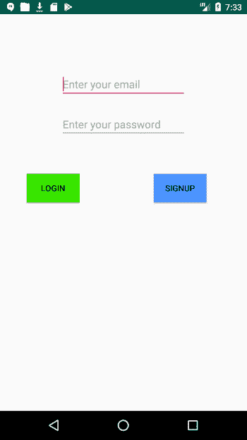
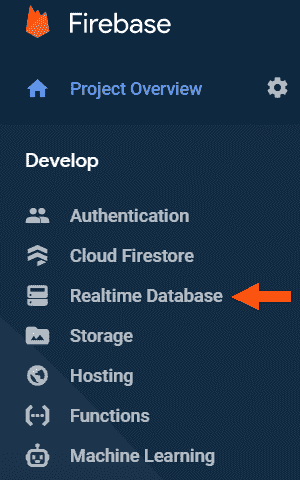
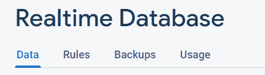
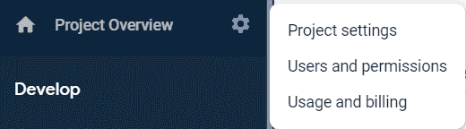
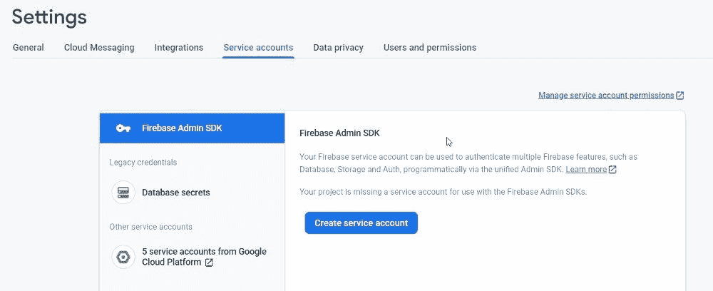

# 如何使用 Firebase 认证用户并在数据库中保存数据

> 原文：<https://www.freecodecamp.org/news/authenticate-users-and-save-data-in-a-database-using-firebase/>

当您着手构建一个应用程序时，有大量的事情需要考虑。这些都主要与项目的客户部分有关。

当您开始考虑应用程序的服务器时，事情会变得非常复杂。缓解这种压力的一种方法是使用 Firebase，特别是两个特性:

1.  使用 Firebase Auth 验证用户
2.  使用实时数据库存储数据

在本文中，您将了解到:

*   如何在 Kotlin 中构建一个 Android 应用程序，使用 Firebase Auth 来验证用户
*   如何使用 Retrofit2 向您的服务器发出请求
*   如何用 Express 在 Node.js 中构建一个服务器，它将接收来自应用程序的请求，并从 Firebase 中的实时数据库获取数据

所有这些看起来似乎是一项简单的任务，但事实并非如此。有很多设置要做，我们还必须处理各种配置。但是我也将概述一些陷阱，这将有助于节省您的时间和挫折。

相信我——你想从我的错误中吸取教训。

如果你想跳过所有的解释，你可以到文章的底部，通过链接查看完整的源代码。

好了，我们开始吧。

## 设置您的项目

我们的应用程序将包括前端和后端。从前端的角度来看，将有一个登录/注册页面和另一个页面，将获取/发送随机数据到我们的数据库。

我们将在这里使用 Firebase 身份验证来验证注册用户。有几种方法可以验证用户:

*   电子邮件和密码
*   谷歌/脸书/Twitter/Github 账户(所谓的联合身份提供商身份认证)
*   电话号码
*   自定义授权
*   匿名授权

在我们的应用程序中，我们将使用 Email & Password 选项，因为这是更简单的方法(在大多数情况下，也是更常见的解决方案)。

这种认证将发生在我们的客户端，不需要任何通信到我们的后端为这项任务。

为了向我们的服务器发出请求，我们将通过发出 GET 请求来使用 [Retrofit2](https://square.github.io/retrofit/) 。在这些 GET 请求中，我们将发送需要更新的数据和一个令牌(关于令牌的更多信息在服务器部分)。

从后端来看，我们的服务器负责接受用户使用我们的应用程序获取/保存/删除数据(或 [CRUD](https://en.wikipedia.org/wiki/Create,_read,_update_and_delete) )的请求。

为了能够让认证用户访问数据库，我们需要使用 [Firebase 的管理 SDK](https://firebase.google.com/docs/admin/setup) 。这个框架将使我们能够访问 API 来验证经过身份验证的用户，并将请求传递给我们的数据库。

我们将使用 Firebase 的[实时数据库](https://firebase.google.com/docs/database)保存用户数据。在后端完成所有工作后，我们将通过 [Heroku](https://www.heroku.com/) 部署它。


Photo by [dylan nolte](https://unsplash.com/@dylan_nolte?utm_source=medium&utm_medium=referral) on Unsplash

### 如何构建客户端/用户界面

打开一个新的 Kotlin 项目后，我们需要导入一些依赖项。首先，您需要将 Firebase 添加到您的项目中。

[按照这里概述的步骤](https://firebase.google.com/docs/android/setup#console)进行。

完成后，将以下依赖项添加到应用程序级 build.gradle 文件中:

```
implementation 'com.google.firebase:firebase-auth:19.4.0'
```

当用户打开应用程序时，他们可以登录或注册(如果是第一次)。

因为我们已经同意根据用户的电子邮件和密码的组合来验证用户，所以我们将创建一个简单的活动，它有两个 EditTexts 来完成这个任务。我们还将有两个按钮来表示注册或登录的选择。

```
<?xml version="1.0" encoding="utf-8"?>
<androidx.constraintlayout.widget.ConstraintLayout xmlns:android="http://schemas.android.com/apk/res/android"
    xmlns:app="http://schemas.android.com/apk/res-auto"
    xmlns:tools="http://schemas.android.com/tools"
    android:orientation="vertical" android:layout_width="match_parent"
    android:layout_height="match_parent">

    <EditText
        android:id="@+id/email_edit_text"
        android:layout_width="wrap_content"
        android:layout_height="wrap_content"
        android:ems="10"
        android:hint="Enter your email"
        android:inputType="textEmailAddress"
        app:layout_constraintBottom_toBottomOf="parent"
        app:layout_constraintEnd_toEndOf="parent"
        app:layout_constraintStart_toStartOf="parent"
        app:layout_constraintTop_toTopOf="parent"
        app:layout_constraintVertical_bias="0.153" />

    <EditText
        android:id="@+id/password_edit_text"
        android:layout_width="wrap_content"
        android:layout_height="wrap_content"
        android:ems="10"
        android:hint="Enter your password"
        android:inputType="textPassword"
        app:layout_constraintBottom_toBottomOf="parent"
        app:layout_constraintEnd_toEndOf="parent"
        app:layout_constraintStart_toStartOf="parent"
        app:layout_constraintTop_toBottomOf="@+id/email_edit_text"
        app:layout_constraintVertical_bias="0.046" />

    <Button
        android:id="@+id/Login"
        android:layout_width="wrap_content"
        android:layout_height="wrap_content"
        android:text="Login"
        android:background="#39e600"
        android:onClick="loginUser"
        app:layout_constraintBottom_toBottomOf="parent"
        app:layout_constraintEnd_toEndOf="parent"
        app:layout_constraintHorizontal_bias="0.139"
        app:layout_constraintStart_toStartOf="parent"
        app:layout_constraintTop_toBottomOf="@+id/password_edit_text"
        app:layout_constraintVertical_bias="0.146" />

    <Button
        android:id="@+id/Signup"
        android:layout_width="wrap_content"
        android:layout_height="wrap_content"
        android:text="Signup"
        android:background="#4d94ff"
        android:onClick="signupUser"
        app:layout_constraintBottom_toBottomOf="parent"
        app:layout_constraintEnd_toEndOf="parent"
        app:layout_constraintHorizontal_bias="0.647"
        app:layout_constraintStart_toEndOf="@+id/Login"
        app:layout_constraintTop_toBottomOf="@+id/password_edit_text"
        app:layout_constraintVertical_bias="0.146" />
</androidx.constraintlayout.widget.ConstraintLayout>
```

Our Login Screen Layout

```
package com.tomerpacific.todo.activities

import android.content.Intent
import android.os.Bundle
import android.view.KeyEvent
import android.view.View
import android.view.inputmethod.EditorInfo
import android.widget.EditText
import android.widget.Toast
import androidx.appcompat.app.AppCompatActivity
import com.google.android.gms.tasks.OnCompleteListener
import com.google.firebase.auth.FirebaseAuth
import com.google.firebase.auth.UserProfileChangeRequest
import com.tomerpacific.todo.R

class LoginActivity : AppCompatActivity() {

    private var userEmail : String = ""
    private var userPassword: String = ""

    override fun onCreate(savedInstanceState: Bundle?) {
        super.onCreate(savedInstanceState)
        setContentView(R.layout.activity_login)

      // START 1 ---------------------- //

        findViewById<EditText>(R.id.email_edit_text).apply {
            setOnEditorActionListener {_, actionId, keyEvent ->
                if (actionId == EditorInfo.IME_ACTION_SEARCH || actionId == EditorInfo.IME_ACTION_DONE ||
                    keyEvent == null ||
                    keyEvent.keyCode == KeyEvent.KEYCODE_ENTER) {
                    userEmail = text.toString()
                }
                false
            }

            setOnFocusChangeListener {view, gainedFoucs ->
                userEmail = text.toString()
            }
        }

        findViewById<EditText>(R.id.password_edit_text).apply {
            setOnEditorActionListener {_, actionId, keyEvent ->
                if (actionId == EditorInfo.IME_ACTION_SEARCH || actionId == EditorInfo.IME_ACTION_DONE ||
                    keyEvent == null ||
                    keyEvent.keyCode == KeyEvent.KEYCODE_ENTER) {
                    userPassword = text.toString()
                }
                false
            }

            setOnFocusChangeListener {view, gainedFoucs ->
                userPassword = text.toString()
            }
        }

      // END 1 ---------------------------------------- //
    }

    override fun onStart() {
        super.onStart()
        FirebaseAuth.getInstance().currentUser?.let {
            Intent(this@LoginActivity, MainActivity::class.java).apply {
                startActivity(this)
            }
        }
    }

  // START 2 ----------------------- //
    fun loginUser(view : View) {

        if (userEmail.isEmpty() || userPassword.isEmpty()) {
            Toast.makeText(this, "Please make sure to fill in your email and password", Toast.LENGTH_SHORT).show()
            return
        }

        FirebaseAuth.getInstance().signInWithEmailAndPassword(userEmail, userPassword)
            .addOnCompleteListener(this) { task ->
                if (task.isSuccessful) {
                    updateFirebaseUserDisplayName()
                } else {
                    Toast.makeText(this, "An error has occurred during login. Please try again later.", Toast.LENGTH_SHORT).show()
                }
            }
    }

  // END 2 ----------------------------- //

  // START 3 --------------------------- //
    fun signupUser(view: View) {

        if (userEmail.isEmpty() || userPassword.isEmpty()) {
            Toast.makeText(this, "Please make sure to fill in your email and password", Toast.LENGTH_SHORT).show()
            return
        }

        FirebaseAuth.getInstance().createUserWithEmailAndPassword(userEmail, userPassword)
            .addOnCompleteListener(this) { task ->
                if (task.isSuccessful) {
                    updateFirebaseUserDisplayName()
                } else {
                    Toast.makeText(this, "An error has occurred during signup. Please try again later.", Toast.LENGTH_SHORT).show()
                }
            }
    }

    private fun updateFirebaseUserDisplayName() {

        FirebaseAuth.getInstance().currentUser?.apply {
            val profileUpdates : UserProfileChangeRequest = UserProfileChangeRequest.Builder().setDisplayName(userEmail).build()
            updateProfile(profileUpdates)?.addOnCompleteListener(OnCompleteListener {
                when(it.isSuccessful) {
                    true -> apply {
                        Intent(this@LoginActivity, MainActivity::class.java).apply {
                            startActivity(this)
                            finish()
                        }
                    }
                    false -> Toast.makeText(this@LoginActivity, "Login has failed", Toast.LENGTH_SHORT).show()
                }
            })
        }
    }
  // END 3 ------------------------------------- //

}
```

LoginActivity.kt

让我们看看上面的代码是怎么回事。

1.  我们将监听器附加到我们的编辑文本，以识别它们何时失去焦点或者用户何时按下了完成按钮。
2.  loginUser 方法负责根据用户以前的凭证对用户进行身份验证(使用 signInWithEmailAndPassword API)。
3.  signupUser 方法使用 createUserWithEmailAndPassword API。
4.  您可以看到，我们已经覆盖了 **onStart** 生命周期方法，以识别用户何时返回应用程序，并在用户已经登录的情况下适当地更新 UI。

运行我们的应用程序时，我们会看到:



Nothing too fancy

那是容易的部分。在我们继续编写与后端通信的逻辑之前，让我们首先构建后端。


Photo by [Roger Starnes Sr](https://unsplash.com/@rstar50?utm_source=medium&utm_medium=referral) on Unsplash

### 如何设置服务器

我们将在构建服务器时使用 Express。下面是这样一个服务器的模板，它还添加了标头以绕过我们可能遇到的任何 CORS 问题:

```
const express = require('express')
var bodyParser = require('body-parser')
const app = express()
var port = process.env.PORT || 3000

app.use(bodyParser.urlencoded())

app.use(function(req, res, next) {
  res.setHeader('Access-Control-Allow-Origin', '*')
  res.header('Access-Control-Allow-Methods', 'GET, OPTIONS')
  res.header('Access-Control-Allow-Headers', 'Content-Type, Authorization')
  res.header('Access-Control-Allow-Credentials', true)
  return next()
});

app.listen(port, () => console.log(`Example app listening at http://localhost:${port}`))
```

与我们在客户端所做的类似，我们也需要将 Firebase 添加到 Node.js 服务器中。如果您回想一下在 Firebase 中创建项目的步骤，并选择了一个 Android 项目，那么您需要向该项目添加另一个代表我们的服务器的应用程序。通过在 Firebase 控制台的主屏幕中点击添加应用程序，


您将看到一个可供选择的平台:


You need to choose the Web option (the one with the </> icon)

在 Firebase 控制台中完成初始配置后，您需要将配置对象添加到项目中:

```
var firebaseConfig = {
  apiKey: "API_KEY",
  authDomain: "PROJECT_ID.firebaseapp.com",
  databaseURL: "https://PROJECT_ID.firebaseio.com",
  projectId: "PROJECT_ID",
  storageBucket: "PROJECT_ID.appspot.com",
  messagingSenderId: "SENDER_ID",
  appId: "APP_ID",
  measurementId: "G-MEASUREMENT_ID",
};
```

Example of firebaseConfig (fill in your projects’ details)

我们将把这些配置放在主文件(app.js)中:

```
const express = require('express')
var bodyParser = require('body-parser')
const app = express()
var port = process.env.PORT || 3000

<--- FIREBASE CONFIG --->
var firebaseConfig = {
  apiKey: "API_KEY",
  authDomain: "PROJECT_ID.firebaseapp.com",
  databaseURL: "https://PROJECT_ID.firebaseio.com",
  projectId: "PROJECT_ID",
  storageBucket: "PROJECT_ID.appspot.com",
  messagingSenderId: "SENDER_ID",
  appId: "APP_ID",
  measurementId: "G-MEASUREMENT_ID",
};

  // Initialize Firebase
firebase.initializeApp(firebaseConfig);
<---- END FIREBASE CONFIG --->

app.use(bodyParser.urlencoded())

app.use(function(req, res, next) {
  res.setHeader('Access-Control-Allow-Origin', '*')
  res.header('Access-Control-Allow-Methods', 'GET, OPTIONS')
  res.header('Access-Control-Allow-Headers', 'Content-Type, Authorization')
  res.header('Access-Control-Allow-Credentials', true)
  return next()
});

app.listen(port, () => console.log(`Example app listening at http://localhost:${port}`))
```

您可能会想:“我将所有这些秘密信息保存在客户机中。大家都会看得见的！”。这是完全正确的，但在 Firebase 的情况下，这是可以的。

### 如何配置数据库

我们正在实现这一目标，但我们仍有一些更多的配置工作要做。这次它与我们的实时数据库有关。

转到 Firebase 控制台，选择您在本文前面创建的项目。在左侧菜单中，您会看到一个实时数据库选项。点击它。



接下来，在右侧，将加载一个窗口，其中包含以下选项卡:



在“数据”选项卡下，会有您的数据库的 URL。记住它，因为我们以后会用到它。

另一个要查看的重要选项卡是 Rules 选项卡。这些规则指定谁可以访问您的数据库以及他们可以在那里做什么。

最初(出于测试目的)，那里的规则相当宽松，任何人都可以读写你的数据库。**在你激活你的应用程序之前，确保用更严格的东西更新这些规则**。别担心，你会看到一个例子。

### 如何设置 Firebase Admin SDK

接下来，我们需要设置 [Firebase Admin SDK](https://firebase.google.com/docs/admin/setup) 。因为我们已经在 firebase 控制台中设置了必要的东西，所以我们需要安装 Firebase 管理包。

```
npm install firebase-admin --save
```

现在我们需要生成一个私钥，因为我们的项目是一个服务帐户。在 Firebase 控制台中，按照下列步骤操作:

首先，在项目概述旁边，有一个齿轮图标。点击它并选择**项目设置**:



然后点击 **服务账户**选项卡，并点击创建服务账户按钮。



选择 Node.js 作为配置片段，并点击**生成新的私钥。**

将这个文件放在您的项目中，并在 Firebase 提供的代码片段中更改它的路径。

⚠️确保排除这个文件在您的。gitignore 文件，永远不要把它上传到任何公共存储库。

综上所述，我们的 app.js 文件将如下所示:

```
const express = require('express')
var bodyParser = require('body-parser')
const app = express()
var port = process.env.PORT || 3000

<--- FIREBASE CONFIG --->
var firebaseConfig = {
  apiKey: "API_KEY",
  authDomain: "PROJECT_ID.firebaseapp.com",
  databaseURL: "https://PROJECT_ID.firebaseio.com",
  projectId: "PROJECT_ID",
  storageBucket: "PROJECT_ID.appspot.com",
  messagingSenderId: "SENDER_ID",
  appId: "APP_ID",
  measurementId: "G-MEASUREMENT_ID",
};

  // Initialize Firebase
firebase.initializeApp(firebaseConfig);
<---- END FIREBASE CONFIG --->

const serviceAccount = require("PATH_TO_YOUR_SERVICE_ACCOUNT_FILE.json");

admin.initializeApp({
  credential: admin.credential.cert(serviceAccount),
  databaseURL: "URL_TO_DATABASE"
});  

app.use(bodyParser.urlencoded())

app.use(function(req, res, next) {
  res.setHeader('Access-Control-Allow-Origin', '*')
  res.header('Access-Control-Allow-Methods', 'GET, OPTIONS')
  res.header('Access-Control-Allow-Headers', 'Content-Type, Authorization')
  res.header('Access-Control-Allow-Credentials', true)
  return next()
});

app.listen(port, () => console.log(`app listening at http://localhost:${port}`))
```

还记得我之前提到的数据库 URL 吗？您需要将它插入到传递给 Firebase 的 admin initializeApp 方法的对象中。

### 如何创建端点和部署

唷，这是一个很大的设置。现在，我们的服务器能够运行，但它不会做任何事情，因为没有配置端点。

为了解决这种情况，让我们定义一个端点:

```
app.get('/getData', function (req, res) {
  if (req.headers.authtoken) {
    admin.auth().verifyIdToken(req.headers.authtoken)
    .then(() => {
      var database = admin.database()
      var uid = req.query.uid
      database.ref('/users/' + uid).once('value')
      .then(function(snapshot) {
        var data = snapshot.val() ? snapshot.val() : []
        res.status(200).send({ our_data: data})
      }).catch(function(error) {
        res.status(500).json({ error: error})
      })
    }).catch(() => {
      res.status(403).send('Unauthorized')
    })
  } else {
    res.status(403).send('Unauthorized')
  }
})
```

我们的端点称为 getData，您可以看到，在执行任何其他逻辑之前，我们正在提取发送的 authtoken，并使用 Firebase admin 对其进行验证。

如果一切正常，我们继续获取用户 ID，并使用它从数据库中获取用户数据。

## 如何在客户端发出请求

正如我前面提到的，我们将使用 Retrofit2 向服务器发出请求。

这里我不会详细介绍如何使用 Retrofit2(有很多文章都是这么做的)，所以下面您可以找到使用 Retrofit2 进行网络请求的标准实现。

```
fun fetchDataFromDB() {
        val user = FirebaseAuth.getInstance().currentUser

        if (user != null) {
            user.getIdToken(false).addOnCompleteListener{
                if (it.isSuccessful) {
                    val token = it.result?.token

                    val retrofit = Retrofit.Builder()
                        .baseUrl(TodoConstants.BASE_URL_FOR_REQUEST)
                        .addConverterFactory(GsonConverterFactory.create())
                        .build()
                    val service = retrofit.create(DataService::class.java)
                    val call = service.getData(token, getUserUUID())

                    call.enqueue(object: Callback<Result> {
                        override fun onResponse(call: Call<Result>, response: Response<Result>) {
                            if (response.isSuccessful) {
                                val body = response.body() as Result
                               //Here we have the data sent back from the server
                            }
                        }

                        override fun onFailure(call: Call<Result>, t: Throwable) {

                        }
                    })
                }
            }
        }
    }
```

注意，在获得 FirebaseUser 对象后，我们使用 getIdToken 方法提取令牌，该令牌将被发送到服务器。

同样，我们可以创建另一个 GET 请求来设置数据库中的数据。

就是这样！感谢跟随。

本文基于我在构建自己的应用程序时所经历的事情。可以在下面查看一下(源代码也有):

[Todo - Apps on Google PlayEver had a hard time remembering all the things you need to get done in a day? Ever needed a place to write down your grocery list? This application will let you write down all the tasks you want to get accomplished and let you share it with anyone through Whatsapp.tomerpacificApps on Google Play](https://play.google.com/store/apps/details?id=com.tomerpacific.todo)[TomerPacific/TodoTodo List application that uses Firebase to Authenticate users and save data in a database. There is also an option to export the list to WhatsApp. - TomerPacific/TodoTomerPacificGitHub](https://github.com/TomerPacific/Todo)