# Linux 命令手册——初学者学习 Linux 命令

> 原文：<https://www.freecodecamp.org/news/the-linux-commands-handbook/>

这本 Linux 命令手册将涵盖开发人员需要的 60 个核心 Bash 命令。每个命令都包括示例代码和何时使用它的提示。

这本 Linux 命令手册遵循 80/20 法则:你将会在学习一个主题的 20%的时间里学会 80%的内容。

我发现这种方法给你一个全面的概述。

本手册并不试图涵盖世界上所有与 Linux 及其命令相关的内容。它专注于您将在 80%或 90%的时间里使用的小型核心命令，并试图简化更复杂命令的使用。

所有这些命令都适用于 Linux、macOS、WSL 以及任何有 UNIX 环境的地方。

我希望这本手册的内容能帮助你实现你的愿望:**熟悉 Linux** 。

您可以在浏览器中将此页面加入书签，以便将来参考本手册。

并且可以[免费下载 PDF / ePUB / Mobi 格式的这本手册](https://flaviocopes.com/page/linux-commands-handbook/)。

尽情享受吧！

## 目录

*   [Linux 和 shells 简介](#introductiontolinuxandshells)
*   [Linux`man`命令](#the-linux-man-command)
*   [Linux`ls`命令](#the-linux-ls-command)
*   [Linux`cd`命令](#the-linux-cd-command)
*   [Linux`pwd`命令](#the-linux-pwd-command)
*   [Linux`mkdir`命令](#the-linux-mkdir-command)
*   [Linux`rmdir`命令](#the-linux-rmdir-command)
*   [Linux`mv`命令](#the-linux-mv-command)
*   [Linux`cp`命令](#the-linux-cp-command)
*   [Linux`open`命令](#the-linux-open-command)
*   [Linux`touch`命令](#the-linux-touch-command)
*   [Linux`find`命令](#the-linux-find-command)
*   [Linux`ln`命令](#the-linux-ln-command)
*   [Linux`gzip`命令](#the-linux-gzip-command)
*   [Linux`gunzip`命令](#the-linux-gunzip-command)
*   [Linux`tar`命令](#the-linux-tar-command)
*   [Linux`alias`命令](#the-linux-alias-command)
*   [Linux`cat`命令](#the-linux-cat-command)
*   [Linux`less`命令](#the-linux-less-command)
*   [Linux`tail`命令](#the-linux-tail-command)
*   [Linux`wc`命令](#the-linux-wc-command)
*   [Linux`grep`命令](#the-linux-grep-command)
*   [Linux`sort`命令](#the-linux-sort-command)
*   [Linux`uniq`命令](#the-linux-uniq-command)
*   [Linux`diff`命令](#the-linux-diff-command)
*   [Linux`echo`命令](#the-linux-echo-command)
*   [Linux`chown`命令](#the-linux-chown-command)
*   [Linux`chmod`命令](#the-linux-chmod-command)
*   [Linux`umask`命令](#the-linux-umask-command)
*   [Linux`du`命令](#the-linux-du-command)
*   [Linux`df`命令](#the-linux-df-command)
*   [Linux`basename`命令](#the-linux-basename-command)
*   [Linux`dirname`命令](#the-linux-dirname-command)
*   [Linux`ps`命令](#the-linux-ps-command)
*   [Linux`top`命令](#the-linux-top-command)
*   [Linux`kill`命令](#the-linux-kill-command)
*   [Linux`killall`命令](#the-linux-killall-command)
*   [Linux`jobs`命令](#the-linux-jobs-command)
*   [Linux`bg`命令](#the-linux-bg-command)
*   [Linux`fg`命令](#the-linux-fg-command)
*   [Linux`type`命令](#the-linux-type-command)
*   [Linux`which`命令](#the-linux-which-command)
*   [Linux`nohup`命令](#the-linux-nohup-command)
*   [Linux`xargs`命令](#the-linux-xargs-command)
*   [Linux`vim`编辑命令](#the-linux-vim-editor-command)
*   [Linux`emacs`编辑命令](#the-linux-emacs-editor-command)
*   [Linux`nano`编辑命令](#the-linux-nano-editor-command)
*   [Linux`whoami`命令](#the-linux-whoami-command)
*   [Linux`who`命令](#the-linux-who-command)
*   [Linux`su`命令](#the-linux-su-command)
*   [Linux`sudo`命令](#the-linux-sudo-command)
*   [Linux`passwd`命令](#the-linux-passwd-command)
*   [Linux`ping`命令](#the-linux-ping-command)
*   [Linux`traceroute`命令](#the-linux-traceroute-command)
*   [Linux`clear`命令](#the-linux-clear-command)
*   [Linux`history`命令](#the-linux-history-command)
*   [Linux`export`命令](#the-linux-export-command)
*   [Linux`crontab`命令](#the-linux-crontab-command)
*   [Linux`uname`命令](#the-linux-uname-command)
*   [Linux`env`命令](#the-linux-env-command)
*   [Linux`printenv`命令](#the-linux-printenv-command)
*   [结论](#conclusion)

## Linux 和 shells 简介

### 什么是 Linux？

Linux 是一种操作系统，就像 macOS 或 Windows 一样。

它也是最受欢迎的开源操作系统，它给了你很多自由。

它为组成互联网的绝大多数服务器提供动力。这是一切建立的基础。但不仅仅如此。Android 是基于 Linux(的修改版本)的。

1991 年，Linux“核心”(称为“T0”内核“T1”)在芬兰诞生，它从最初的不起眼开始已经走过了漫长的道路。它后来成为 GNU 操作系统的内核，创造了 GNU/Linux 二重奏。

Linux 有一点是微软、苹果和谷歌这样的公司永远无法提供的:用你的电脑做任何你想做的事情的自由。

他们实际上是反其道而行之，建造围墙花园，尤其是在移动端。

Linux 是终极自由。

它是由志愿者开发的，有些是由依赖它的公司支付的，有些是独立的。但是没有一家商业公司能够决定 Linux 的内容，或者项目的优先级。

你也可以使用 Linux 作为你的日常电脑。我使用 macOS 是因为我真的很喜欢它的应用程序和设计(我也曾经是 iOS 和 Mac 应用程序的开发者)。但是在使用 macOS 之前，我使用 Linux 作为我主要的计算机操作系统。

没有人可以规定你可以运行哪些应用程序，或者用跟踪你、你的位置等的应用程序“呼叫总部”。

Linux 也很特别，因为不像 Windows 或 macOS 那样只有“一个 Linux”。相反，我们有**个分布**。

一个“发行版”是由一个公司或组织制作的，它将 Linux 核心与额外的程序和工具打包在一起。

例如，你有 Debian、Red Hat 和 Ubuntu，它们可能是最流行的发行版。

但是还有很多很多。您也可以创建自己的发行版。但最有可能的是，你会使用一个受欢迎的网站，它有很多用户和一个围绕它的社区。这可以让你做你需要做的事情，而不用浪费太多时间去重新发明轮子和找出常见问题的答案。

一些台式电脑和笔记本电脑预装了 Linux。或者，您可以将它安装在基于 Windows 的计算机或 Mac 上。

但是你不需要仅仅为了了解 Linux 的工作原理而中断现有的计算机。

我没有 Linux 电脑。

如果你使用 Mac，你只需要知道 macOS 是一个 UNIX 操作系统。它与 GNU/Linux 系统共享许多相同的思想和软件，因为 GNU/Linux 是 UNIX 的免费替代品。

> UNIX 是一个总称，从 70 年代开始，它集合了大公司和机构使用的许多操作系统

macOS 终端可以让您访问我将在本手册的其余部分描述的完全相同的命令。

微软有一个官方的用于 Linux 的 Windows 子系统，你可以(也应该！)在 Windows 上安装。这将使你能够在你的 PC 上以一种非常简单的方式运行 Linux。

但是绝大多数时候你会通过像 DigitalOcean 这样的 VPS(虚拟专用服务器)在云中运行 Linux 计算机。

### 什么是 Linux shell？

外壳是一个命令解释器，它向用户展示一个接口，以便与底层操作系统一起工作。

它允许您使用文本和命令执行操作，并为用户提供高级功能，如能够创建脚本。

这一点很重要:shells 让您以比 GUI(图形用户界面)更优化的方式执行事情。命令行工具可以提供许多不同的配置选项，使用起来不会太复杂。

有许多不同种类的贝壳。这篇文章主要关注 Unix shells，也就是你在 Linux 和 macOS 计算机上常见的那些。

随着时间的推移，为这些系统创建了许多不同种类的 shells，其中一些占主导地位:Bash、Csh、Zsh、Fish 等等！

所有的 Shell 都来源于 Bourne Shell，称为`sh`。“伯恩”是因为它的创作者是史蒂夫·伯恩。

Bash 的意思是*伯恩-再一次壳*。Bash 是专有的，不是开源的，它创建于 1989 年，是为了给 GNU 项目和自由软件基金会创造一个免费的替代品。由于项目必须付费才能使用 Bourne shell，Bash 变得非常流行。

如果您使用 Mac，请尝试打开 Mac 终端。默认情况下，它运行 ZSH(或者，前卡特琳娜，Bash)。

您可以设置您的系统运行任何类型的 shell——例如我使用的是 Fish shell。

每个 shell 都有自己独特的特性和高级用法，但是它们都有一个共同的功能:它们可以让您执行程序，并且可以被编程。

在本手册的其余部分，我们将详细了解您将使用的最常用命令。

## Linux 的`man`命令

我将介绍的第一个命令将帮助您理解所有其他命令。

每当我不知道如何使用命令时，我就键入`man <command>`来获取手册:

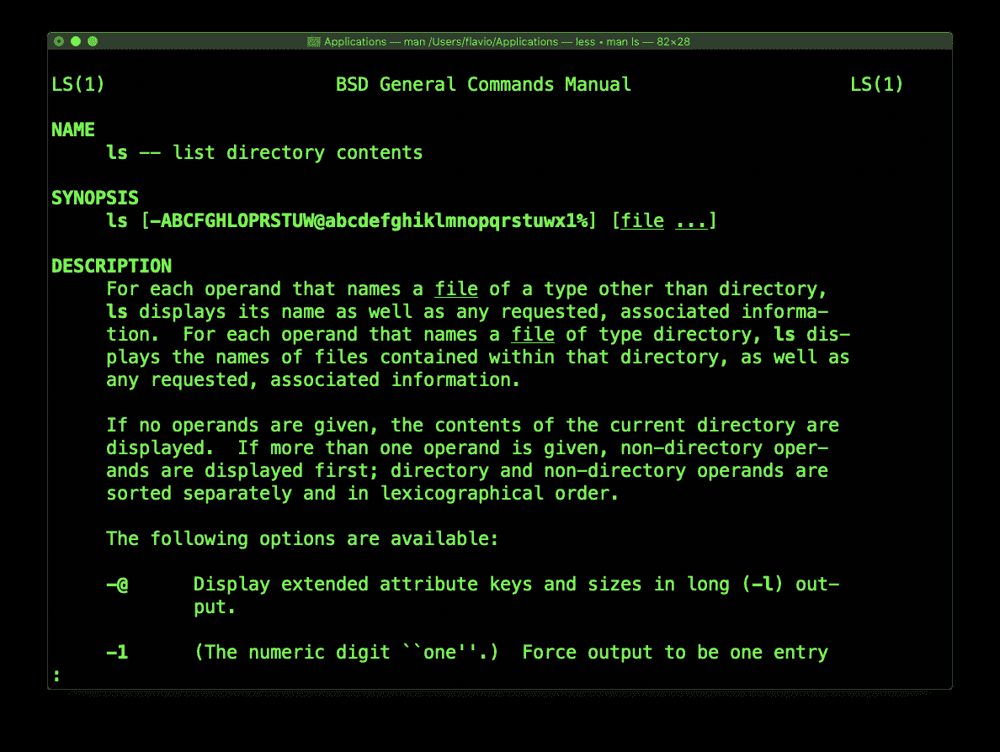

这是一个男人(来自 *_manual_* )的页面。作为开发人员，手册页是学习的重要工具。它们包含了太多的信息，有时简直太多了。
上面的截图只是对`ls`命令解释的 14 个屏幕中的一个。

大多数时候，当我需要快速学习一个命令时，我会使用这个名为**tldr pages**:[https://tldr . sh](https://tldr.sh/)的网站。这是一个你可以安装的命令，你可以像这样运行它:`tldr <command>`。它为您提供了命令的快速概述，以及一些常见使用场景的便利示例:

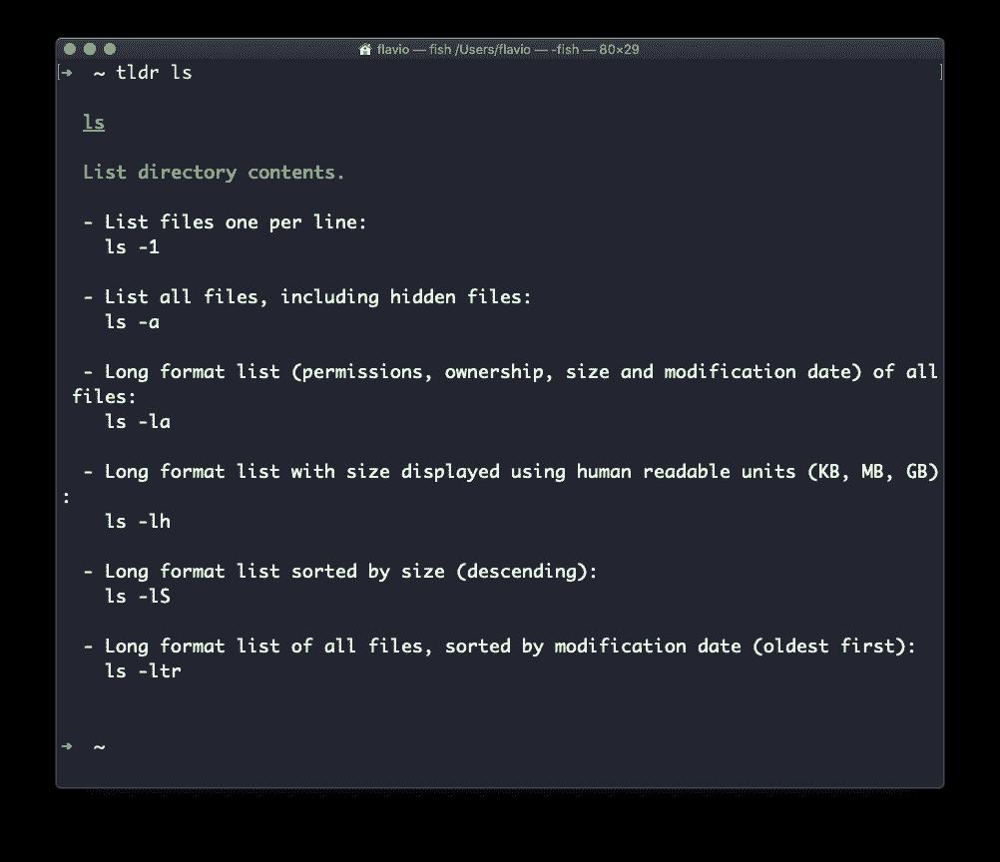

这不是对`man`的替代，而是一个方便的工具，可以避免迷失在`man`页面的大量信息中。然后您可以使用`man`页面来探索您可以在命令中使用的所有不同的选项和参数。

## Linux 的`ls`命令

在一个文件夹中，您可以使用`ls`命令列出该文件夹包含的所有文件:

```
ls 
```

如果您添加文件夹名称或路径，它将打印该文件夹的内容:

```
ls /bin 
```

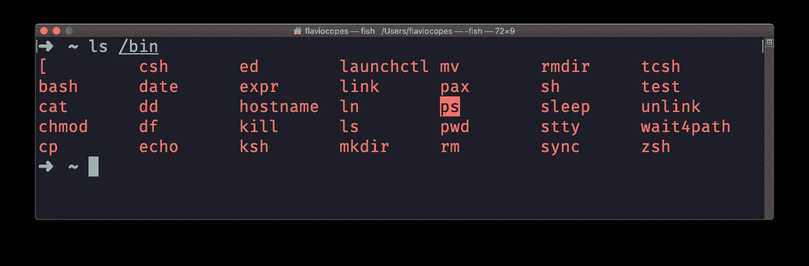

接受多种选择。我最喜欢的一个组合是`-al`。试试看:

```
ls -al /bin 
```


与普通的`ls`命令相比，这将返回更多的信息。

从左至右，您有:

*   文件权限(如果您的系统支持 ACL，您还会获得一个 ACL 标志)
*   指向该文件的链接数量
*   文件的所有者
*   文件的组
*   以字节为单位的文件大小
*   文件的上次修改日期时间
*   文件名

这组数据由`l`选项生成。`a`选项也显示隐藏的文件。

隐藏文件是以点(`.`)开头的文件。

## Linux 的`cd`命令

一旦你有了一个文件夹，你可以使用`cd`命令移动到其中。`cd`表示 **c** 汉格**d**I 工厂。您调用它来指定要移入的文件夹。您可以指定文件夹名称或完整路径。

示例:

```
mkdir fruits
cd fruits 
```

现在你在`fruits`文件夹中。

您可以使用`..`特殊路径来指示父文件夹:

```
cd .. #back to the home folder 
```

#字符表示注释的开始，在找到注释后，它会持续整个行。

你可以用它来形成一个路径:

```
mkdir fruits
mkdir cars
cd fruits
cd ../cars 
```

还有一个特殊的路径指示符是`.`，指示**当前的**文件夹。

您也可以使用从根文件夹`/`开始的绝对路径:

```
cd /etc 
```

## Linux 的`pwd`命令

每当您在文件系统中感到迷失时，调用`pwd`命令来知道您在哪里:

```
pwd 
```

它将打印当前的文件夹路径。

## Linux 的`mkdir`命令

使用`mkdir`命令创建文件夹:

```
mkdir fruits 
```

您可以使用一个命令创建多个文件夹:

```
mkdir dogs cars 
```

您也可以通过添加`-p`选项来创建多个嵌套文件夹:

```
mkdir -p fruits/apples 
```

UNIX 命令中的选项通常采用这种形式。您可以将它们添加到命令名之后，它们会改变命令的行为。你也可以经常组合多个选项。

您可以通过键入`man <commandname>`找到命令支持的选项。例如，现在尝试使用`man mkdir`(按`q`键退出手册页)。手册页是 UNIX 令人惊奇的内置帮助。

## Linux 的`rmdir`命令

正如您可以使用`mkdir`创建文件夹一样，您也可以使用`rmdir`删除文件夹:

```
mkdir fruits
rmdir fruits 
```

您也可以一次删除多个文件夹:

```
mkdir fruits cars
rmdir fruits cars 
```

您删除的文件夹必须是空的。

要删除包含文件的文件夹，我们将使用更通用的`rm`命令，使用`-rf`选项删除文件和文件夹:

```
rm -rf fruits cars 
```

请小心，因为这个命令不要求确认，它会立即删除您要求它删除的任何内容。

从命令行删除文件时没有 **bin** ，恢复丢失的文件可能很困难。

## Linux 的`mv`命令

一旦你有了一个文件，你可以使用`mv`命令移动它。您可以指定文件的当前路径及其新路径:

```
touch test
mv pear new_pear 
```

`pear`文件现在被移动到`new_pear`。这就是你**重命名**文件和文件夹的方法。

如果最后一个参数是文件夹，位于第一个参数路径的文件将被移动到该文件夹中。在这种情况下，您可以指定一个文件列表，它们都将被移动到由最后一个参数标识的文件夹路径中:

```
touch pear
touch apple
mkdir fruits
mv pear apple fruits #pear and apple moved to the fruits folder 
```

## Linux 的`cp`命令

您可以使用`cp`命令复制文件:

```
touch test
cp apple another_apple 
```

要复制文件夹，您需要添加`-r`选项来递归复制整个文件夹内容:

```
mkdir fruits
cp -r fruits cars 
```

## Linux 的`open`命令

`open`命令允许您使用以下语法打开文件:

```
open <filename> 
```

您也可以打开一个目录，在 macOS 上，它会打开 Finder 应用程序并打开当前目录:

```
open <directory name> 
```

我一直用它来打开当前目录:

```
open . 
```

> 特殊的`.`符号指向当前目录，因为`..`指向父目录

同样的命令也可以用于运行应用程序:

```
open <application name> 
```

## Linux 的`touch`命令

您可以使用`touch`命令创建一个空文件:

```
touch apple 
```

如果文件已经存在，它会以写模式打开文件，并更新文件的时间戳。

## Linux 的`find`命令

`find`命令可用于查找符合特定搜索模式的文件或文件夹。它递归搜索。

让我们通过例子来学习如何使用它。

找到当前树下所有扩展名为`.js`的文件，并打印每个匹配文件的相对路径:

```
find . -name '*.js' 
```

在像`*`这样的特殊字符周围使用引号来避免 shell 解释它们是很重要的。

在当前树下查找与名称“src”匹配的目录:

```
find . -type d -name src 
```

使用`-type f`仅搜索文件，或使用`-type l`仅搜索符号链接。

`-name`区分大小写。使用`-iname`执行不区分大小写的搜索。

您可以在多个根树下搜索:

```
find folder1 folder2 -name filename.txt 
```

在当前树下查找与名称“node_modules”或“public”匹配的目录:

```
find . -type d -name node_modules -or -name public 
```

您也可以使用`-not -path`排除路径:

```
find . -type d -name '*.md' -not -path 'node_modules/*' 
```

您可以搜索超过 100 个字符(字节)的文件:

```
find . -type f -size +100c 
```

搜索大于 100KB 但小于 1MB 的文件:

```
find . -type f -size +100k -size -1M 
```

搜索 3 天前编辑过的文件:

```
find . -type f -mtime +3 
```

搜索在过去 24 小时内编辑的文件:

```
find . -type f -mtime -1 
```

您可以通过添加`-delete`选项删除所有匹配搜索的文件。这将删除过去 24 小时内编辑的所有文件:

```
find . -type f -mtime -1 -delete 
```

您可以对每个搜索结果执行一个命令。在这个例子中，我们运行`cat`来打印文件内容:

```
find . -type f -exec cat {} \; 
```

注意终止`\;`。`{}`在执行时用文件名填充。

## Linux 的`ln`命令

`ln`命令是 Linux 文件系统命令的一部分。

它被用来创建链接。什么是链接？它就像指向另一个文件的指针，或者指向另一个文件的文件。您可能熟悉 Windows 快捷方式。他们很相似。

我们有两种类型的链接:**硬链接**和**软链接**。

#### 硬链接

很少使用硬链接。它们有一些限制:不能链接到目录，也不能链接到外部文件系统(磁盘)。

使用以下语法创建硬链接:

```
ln <original> <link> 
```

例如，假设您有一个名为 recipes.txt 的文件。您可以使用以下命令创建指向该文件的硬链接:

```
ln recipes.txt newrecipes.txt 
```

您创建的新硬链接与常规文件没有区别:

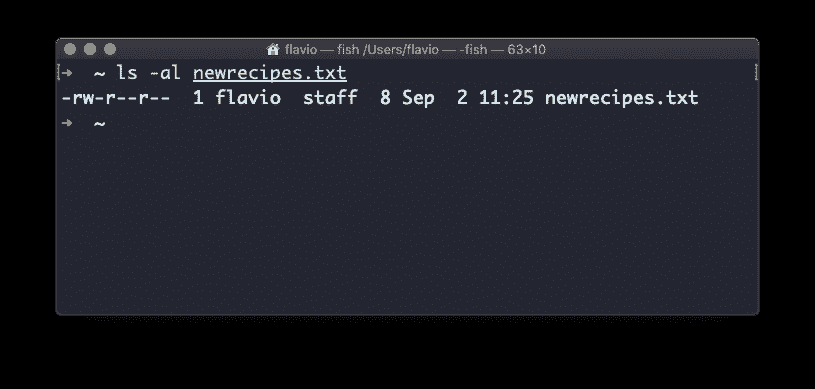

现在，无论您何时编辑这些文件中的任何一个，它们的内容都会更新。

如果您删除了原始文件，链接仍将包含原始文件内容，因为在有一个指向它的硬链接之前，它不会被删除。

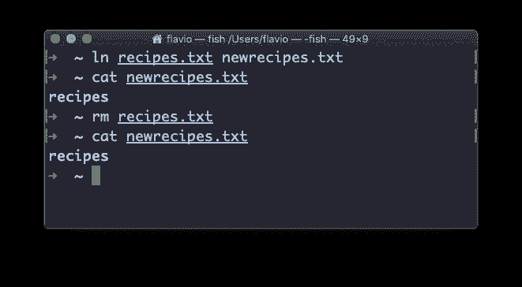

#### 软链接

软链接就不一样了。它们更加强大，因为您可以链接到其他文件系统和目录。但是请记住，当原件被删除时，链接将被断开。

使用`ln`的`-s`选项创建软链接:

```
ln -s <original> <link> 
```

例如，假设您有一个名为 recipes.txt 的文件。您可以使用以下内容创建一个指向它的软链接:

```
ln -s recipes.txt newrecipes.txt 
```

在这种情况下，当您使用`ls -al`列出文件时，您可以看到有一个特殊的`l`标志。文件名末尾有一个`@`，如果启用了颜色，它也会有不同的颜色:

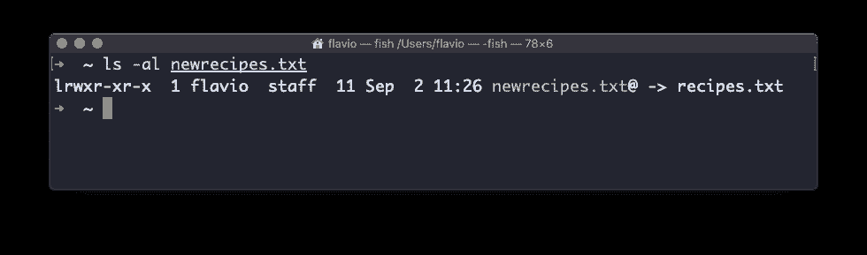
现在如果你删除原始文件，链接会断开，如果你试图访问它，shell 会告诉你“没有这样的文件或目录”:

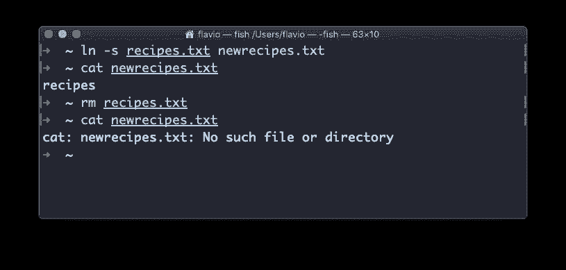

## Linux 的`gzip`命令

您可以使用 gzip 压缩协议压缩一个名为 [LZ77](https://en.wikipedia.org/wiki/LZ77_and_LZ78) 的文件，方法是使用`gzip`命令。

下面是最简单的用法:

```
gzip filename 
```

这将压缩文件，并为其添加一个扩展名`.gz`。原始文件被删除。

为了防止这种情况，您可以使用`-c`选项，并使用输出重定向将输出写入`filename.gz`文件:

```
gzip -c filename > filename.gz 
```

> `-c`选项指定输出将进入标准输出流，保持原始文件不变。

或者您可以使用`-k`选项:

```
gzip -k filename 
```

有各种压缩级别。压缩越多，压缩(和解压缩)的时间就越长。级别范围从 1(最快、最差的压缩)到 9(最慢、较好的压缩)，默认值为 6。

您可以使用`-<NUMBER>`选项选择特定级别:

```
gzip -1 filename 
```

您可以通过列出多个文件来压缩它们:

```
gzip filename1 filename2 
```

您可以使用`-r`选项递归压缩一个目录中的所有文件:

```
gzip -r a_folder 
```

`-v`选项打印压缩百分比信息。这里有一个与`-k` (keep)选项一起使用的例子:

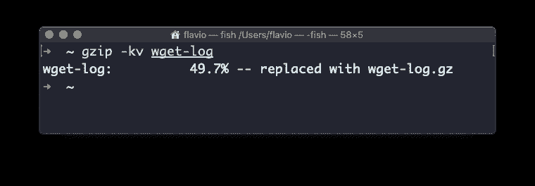
`gzip`也可以用来解压文件，使用`-d`选项:

```
gzip -d filename.gz 
```

## Linux 的`gunzip`命令

`gunzip`命令基本上等同于`gzip`命令，除了默认情况下`-d`选项始终处于启用状态。

可以通过以下方式调用该命令:

```
gunzip filename.gz 
```

这将执行 gunzip 并删除`.gz`扩展名，将结果放入`filename`文件中。如果该文件存在，它将覆盖该文件。

您可以使用`-c`选项通过输出重定向提取到不同的文件名:

```
gunzip -c filename.gz > anotherfilename 
```

## Linux 的`tar`命令

`tar`命令用于创建一个档案，将多个文件组合成一个文件。

它的名字来自过去，意思是*磁带存档*(回到档案存储在磁带上的时代)。

该命令创建一个名为`archive.tar`的档案，其内容为`file1`和`file2`:

```
tar -cf archive.tar file1 file2 
```

> `c`选项代表*创建*。`f`选项用于写入归档文件。

要从当前文件夹的归档中提取文件，请使用:

```
tar -xf archive.tar 
```

> `x`选项代表*提取*。

要将它们提取到特定目录，请使用:

```
tar -xf archive.tar -C directory 
```

您也可以只列出归档中包含的文件:

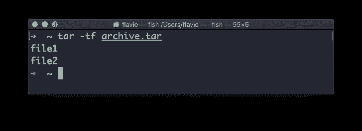
`tar`常用于创建一个**压缩档案**，gzipping 这个档案。

这是通过使用`z`选项完成的:

```
tar -czf archive.tar.gz file1 file2 
```

这就像创建一个 tar 存档，然后在上面运行`gzip`。

要解压缩 gzip 压缩文件，您可以使用`gunzip`或`gzip -d`，然后将其解压缩。但是`tar -xf`会识别出这是一个 gzip 压缩文件，并为你做这件事:

```
tar -xf archive.tar.gz 
```

## Linux 的`alias`命令

通常总是用一组您喜欢使用的选项来运行程序。

例如，以`ls`命令为例。默认情况下，它只打印很少的信息:

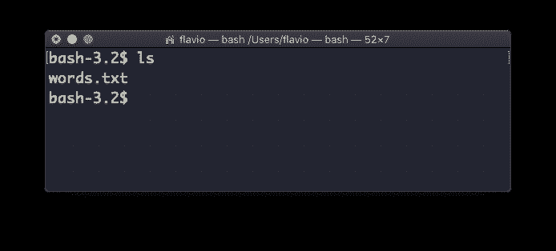

但是如果你使用`-al`选项，它会打印一些更有用的东西，包括文件修改日期、大小、所有者和权限。它还会列出隐藏文件(以`.`开头的文件):

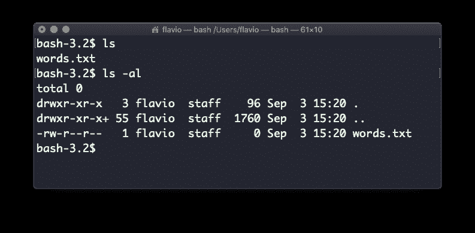

你可以创建一个新的命令，例如我喜欢称它为`ll`，这是`ls -al`的别名。

你这样做:

```
alias ll='ls -al' 
```

一旦你这样做了，你就可以像调用一个普通的 UNIX 命令一样调用`ll`:

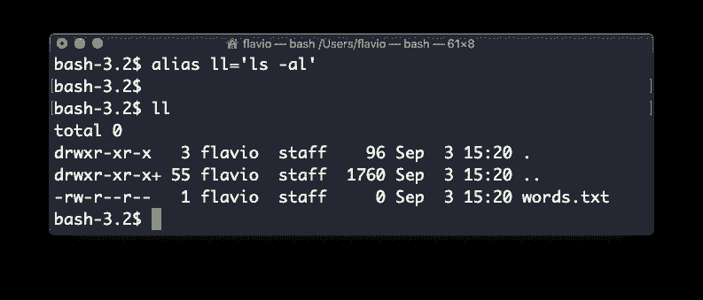

现在不带任何选项调用`alias`将列出定义的别名:

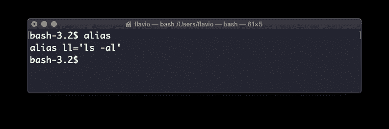
别名将一直工作到终端会话关闭。

要使它永久化，您需要将它添加到 shell 配置中。如果使用 Bash shell，这可能是`~/.bashrc`或`~/.profile`或`~/.bash_profile`，这取决于用例。

如果命令中有变量，请小心使用引号:如果使用双引号，变量将在定义时被解析。如果使用单引号，它在调用时被解析。这两者是不同的:

```
alias lsthis="ls $PWD"
alias lscurrent='ls $PWD' 
```

$PWD 指的是外壳所在的当前文件夹。如果您现在导航到新文件夹，`lscurrent`会列出新文件夹中的文件，而`lsthis`仍会列出您定义别名时所在文件夹中的文件。

## Linux 的`cat`命令

在某些方面类似于 [`tail`](https://www.freecodecamp.org/news/unix-command-tail/) ，我们有`cat`。除了`cat`还可以添加内容到一个文件，这使它超级强大。

最简单的用法是，`cat`将文件内容打印到标准输出中:

```
cat file 
```

您可以打印多个文件的内容:

```
cat file1 file2 
```

使用输出重定向操作符`>`可以将多个文件的内容连接成一个新文件:

```
cat file1 file2 > file3 
```

使用`>>`您可以将多个文件的内容添加到一个新文件中，如果它不存在，则创建它:

```
cat file1 file2 >> file3 
```

当你查看源代码文件时，看到行号是很有帮助的。您可以使用`-n`选项让`cat`打印它们:

```
cat -n file1 
```

您只能使用`-b`向非空行添加一个数字，或者您也可以使用`-s`删除所有多个空行。

`cat`通常与管道操作符`|`结合使用，将文件内容作为另一个命令`cat file1 | anothercommand`的输入。

## Linux 的`less`命令

`less`命令是我经常使用的命令。它在一个漂亮的交互式用户界面中向你展示了存储在一个文件中的内容。

用法:`less <filename>`。

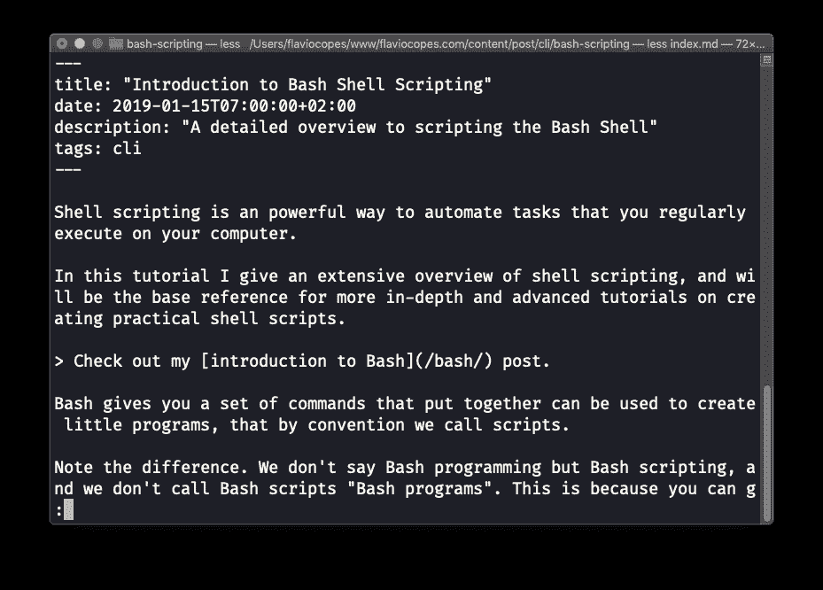

一旦进入`less`会话，您可以按下`q`退出。

您可以使用`up`和`down`键浏览文件内容，或者使用`space bar`和`b`逐页浏览。您也可以按下`G`跳到文件的结尾，然后按下`g`跳回到开头。

您可以通过按下`/`并键入要搜索的单词来搜索文件中的内容。这样搜索*前进*。您可以使用`?`符号并键入一个单词来向后搜索。

这个命令只是显示文件的内容。按`v`可以直接打开编辑器。它将使用系统编辑器，大多数情况下是`vim`。

按下`F`键进入*跟随模式*，或者*手表模式*。当文件被其他人修改时，比如来自另一个程序，你可以实时看到这些变化。

默认情况下不会发生这种情况，您只能看到打开时的文件版本。您需要按`ctrl-C`来退出此模式。在这种情况下，行为类似于运行`tail -f <filename>`命令。

您可以打开多个文件，并使用`:n`(转到下一个文件)和`:p`(转到上一个文件)浏览它们。

## Linux 的`tail`命令

在我看来，tail 的最佳用例是在用`-f`选项调用时。它在最后打开文件，并观察文件的变化。

每当文件中有新内容时，都会在窗口中打印出来。这非常适合查看日志文件，例如:

```
tail -f /var/log/system.log 
```

要退出，按`ctrl-C`。

您可以打印文件的最后 10 行:

```
tail -n 10 <filename> 
```

您可以使用行号前的`+`从特定行开始打印整个文件内容:

```
tail -n +10 <filename> 
```

我可以做得更多，一如既往，我的建议是检查一下。

## Linux 的`wc`命令

`wc`命令为我们提供了关于文件或它通过管道接收的输入的有用信息。

```
echo test >> test.txt
wc test.txt
1       1       5 test.txt 
```

例如，通过管道，我们可以计算运行`ls -al`命令的输出:

```
ls -al | wc
6      47     284 
```

返回的第一列是行数。第二是字数。第三是字节数。

我们可以告诉它只计算行数:

```
wc -l test.txt 
```

或者只是这些话:

```
wc -w test.txt 
```

或者只是字节:

```
wc -c test.txt 
```

ASCII 字符集的字节等同于字符。但是对于非 ASCII 字符集，字符的数量可能会有所不同，因为一些字符可能需要多个字节(例如在 Unicode 中就发生了这种情况)。

在这种情况下，`-m`标志将帮助您获得正确的值:

```
wc -m test.txt 
```

## Linux 的`grep`命令

`grep`命令是一个非常有用的工具。当你掌握了它，它会在你的日常编码中给你巨大的帮助。

> 如果你想知道，`grep`代表*全局正则表达式打印*。

您可以使用`grep`在文件中搜索，或者结合管道来过滤另一个命令的输出。

例如，我们如何在`index.md`文件中找到`document.getElementById`行:

```
grep -n document.getElementById index.md 
```

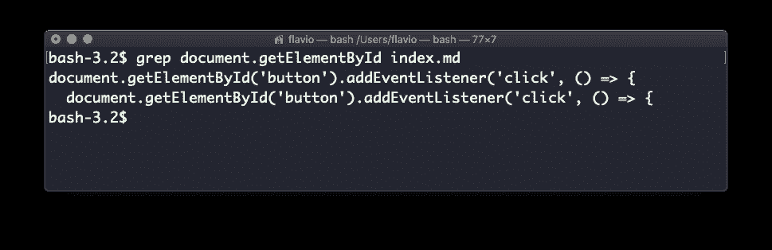

使用`-n`选项将显示行号:

```
grep -n document.getElementById index.md 
```

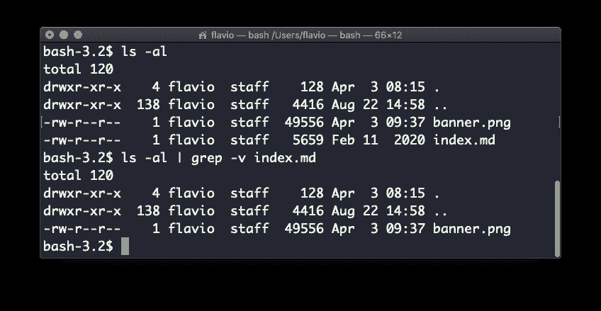

一件非常有用的事情是告诉 grep 在匹配的行之前打印 2 行，在匹配的行之后打印 2 行，以给你更多的上下文。这是使用`-C`选项完成的，它接受许多行:

```
grep -nC 2 document.getElementById index.md 
```

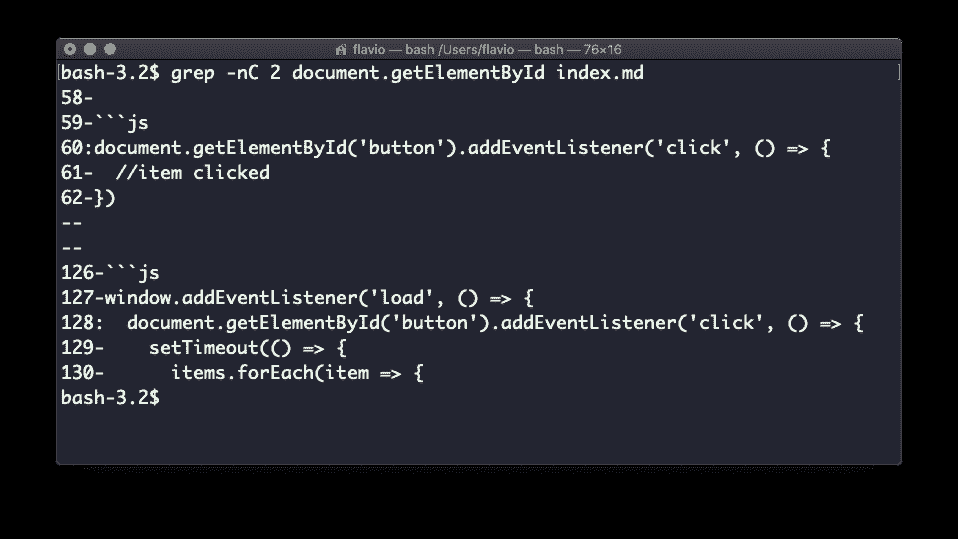

默认情况下，搜索区分大小写。使用`-i`标志使其不敏感。

如上所述，您可以使用 grep 来过滤另一个命令的输出。我们可以使用以下方法复制与上述相同的功能:

```
less index.md | grep -n document.getElementById 
```

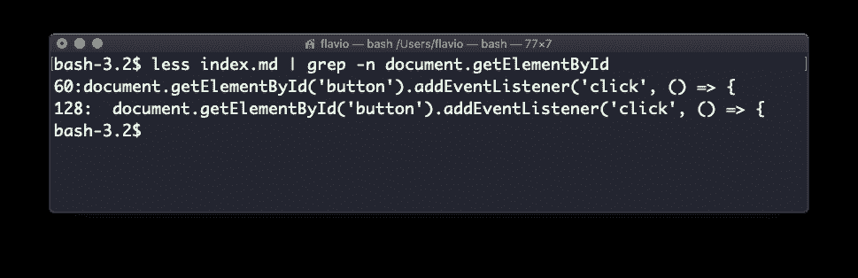

搜索字符串可以是正则表达式，这使得`grep`非常强大。

您可能会发现另一件非常有用的事情是使用`-v`选项反转结果，排除匹配特定字符串的行:

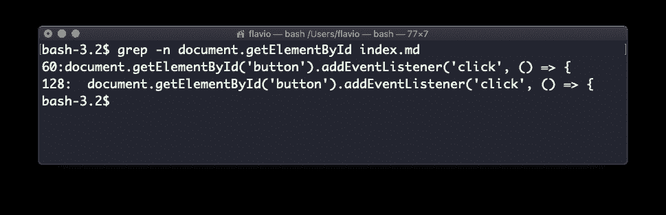

## Linux 的`sort`命令

假设您有一个包含狗的名字的文本文件:

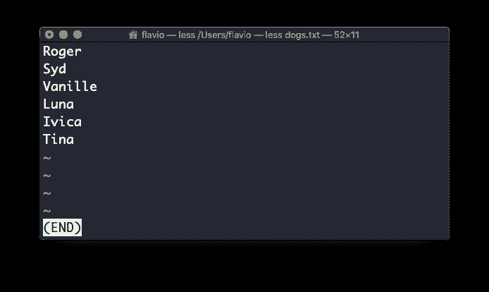

这个列表是无序的。

`sort`命令帮助您按名称对它们进行排序:

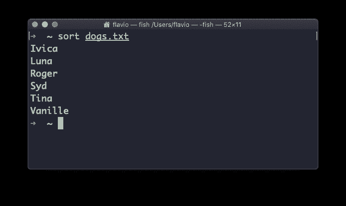

使用`r`选项颠倒顺序:

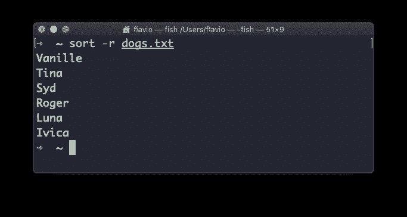

默认情况下，排序区分大小写，并按字母顺序排列。使用`--ignore-case`选项不区分大小写排序，使用`-n`选项按数字顺序排序。

如果文件包含重复的行:

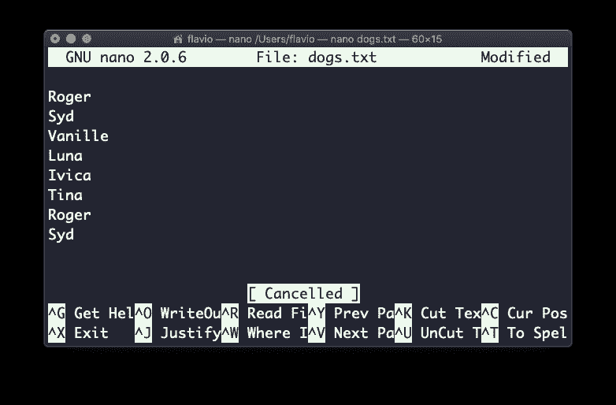

您可以使用`-u`选项来删除它们:

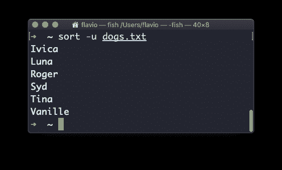

不像许多 UNIX 命令那样只对文件起作用，它也对管道起作用。因此您可以在另一个命令的输出中使用它。例如，您可以使用以下命令对由`ls`返回的文件进行排序:

```
ls | sort 
```

`sort`非常强大，有更多的选项，你可以通过调用`man sort`来探索。

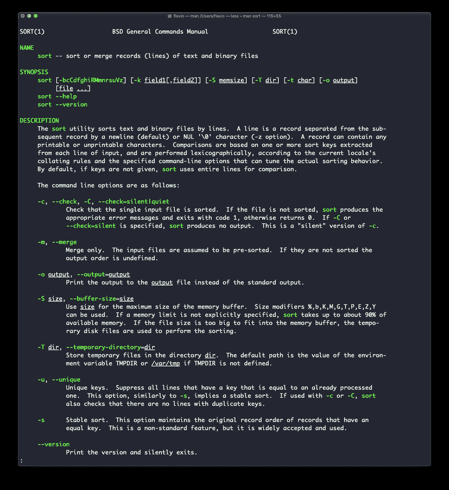

## Linux 的`uniq`命令

`uniq`是一个帮助你排序文本行的命令。

您可以从文件中获取这些行，或者使用管道从另一个命令的输出中获取:

```
uniq dogs.txt

ls | uniq 
```

你需要考虑这个关键的东西:`uniq`只会检测相邻的重复行。

这意味着您很可能会将它与`sort`一起使用:

```
sort dogs.txt | uniq 
```

使用`-u` ( *唯一的*)选项，`sort`命令有自己的方式来删除重复项。但是`uniq`拥有更大的权力。

默认情况下，它会删除重复的行:

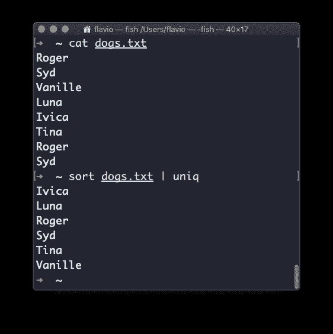

您可以告诉它只显示重复的行，例如，使用`-d`选项:

```
sort dogs.txt | uniq -d 
```

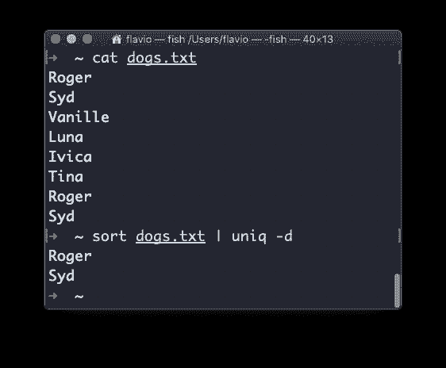

您可以使用`-u`选项只显示不重复的行:

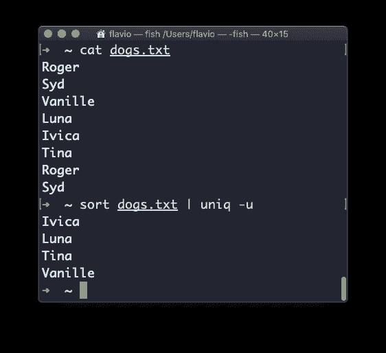

您可以使用`-c`选项计算每行的出现次数:

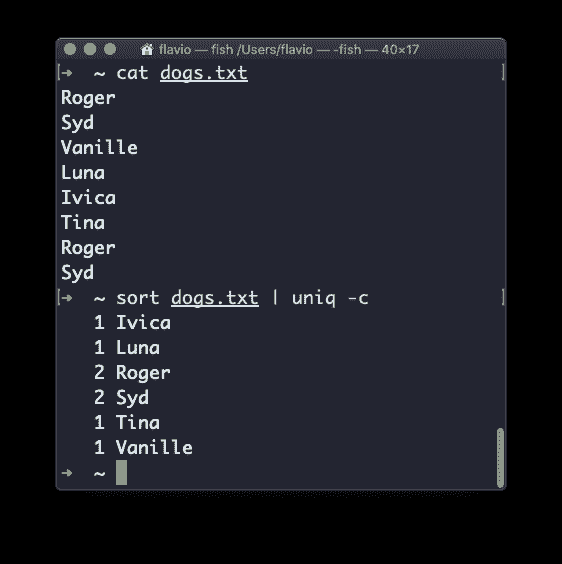

使用特殊组合:

```
sort dogs.txt | uniq -c | sort -nr 
```

然后按最频繁的顺序对这些行进行排序:

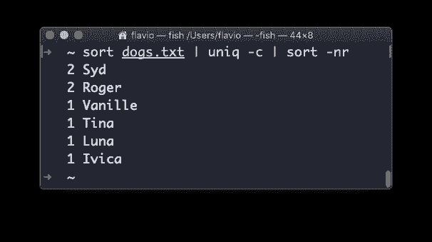

## Linux 的`diff`命令

`diff`是一个方便的命令。假设您有 2 个文件，它们包含几乎相同的信息，但您无法发现这两个文件之间的差异。

会处理这些文件，并告诉您有什么不同。

假设你有 2 个文件:`dogs.txt`和`moredogs.txt`。不同的是，`moredogs.txt`多了一个狗名:

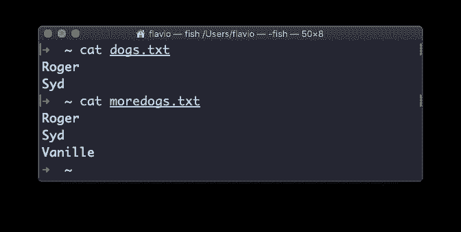

`diff dogs.txt moredogs.txt`会告诉你第二个文件还有一行，第 3 行与第`Vanille`行:

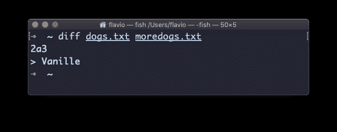

如果您颠倒文件的顺序，它会告诉您第二个文件缺少第 3 行，其内容是`Vanille`:

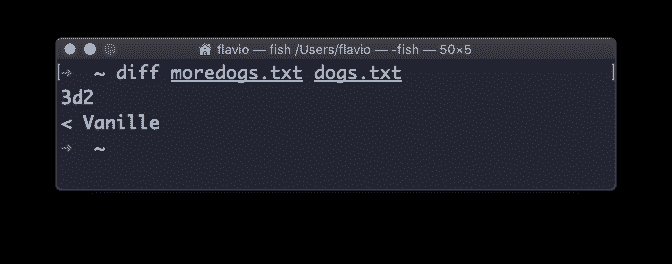

使用`-y`选项将逐行比较两个文件:

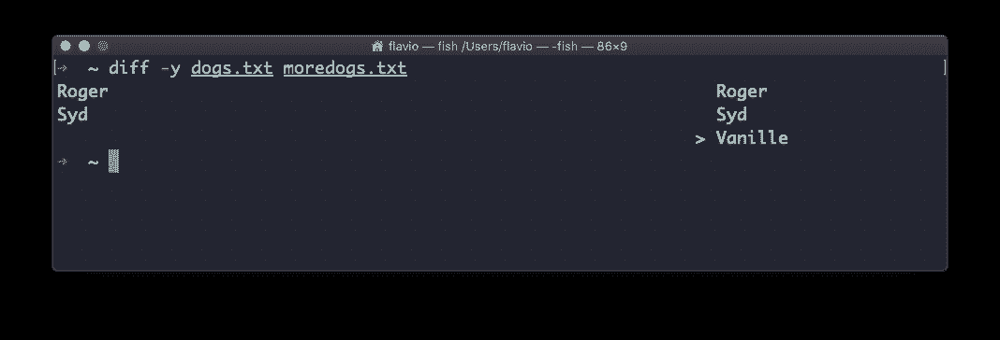

然而`-u`选项对您来说更熟悉，因为 Git 版本控制系统使用它来显示版本之间的差异:

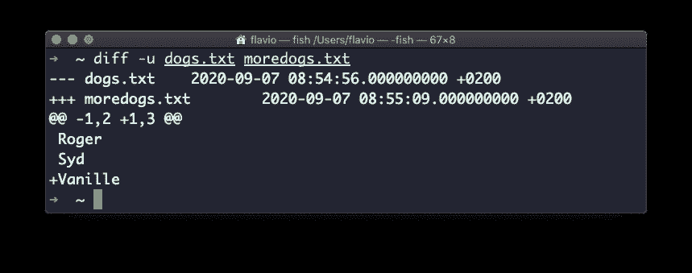

比较目录的工作方式相同。您必须使用`-r`选项进行递归比较(进入子目录):

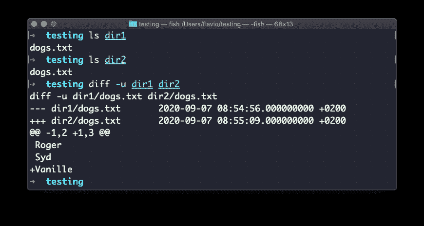

如果您对哪些文件不同而不是内容感兴趣，请使用`r`和`q`选项:

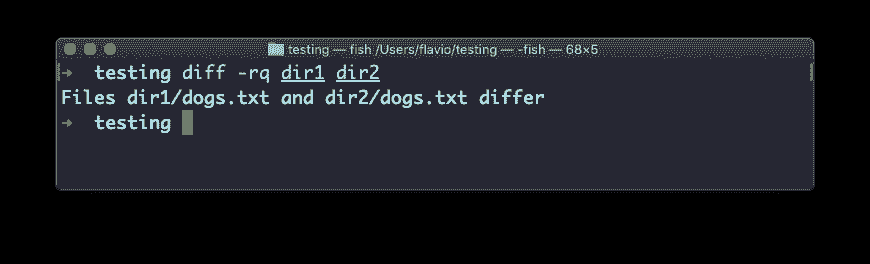

通过运行`man diff`，您可以在手册页中探索更多选项:

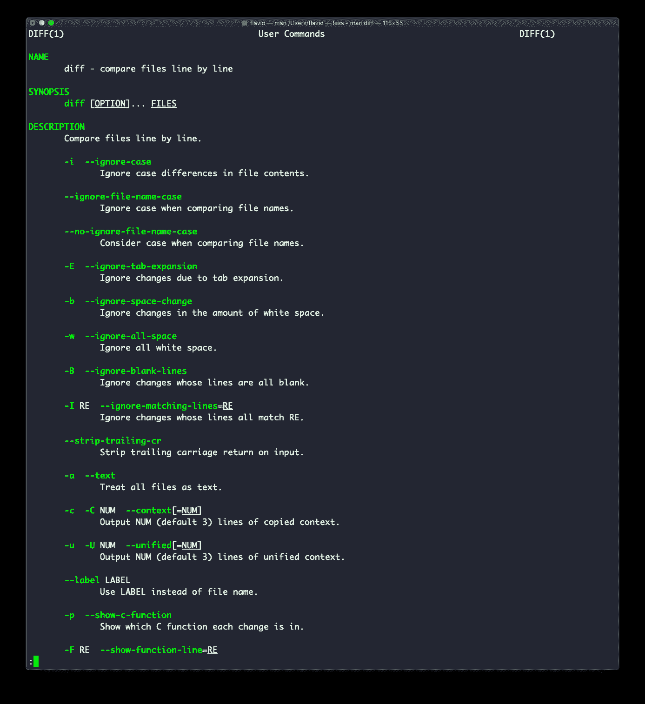

## Linux 的`echo`命令

`echo`命令完成一项简单的工作:它将传递给它的参数打印到输出中。

这个例子:

```
echo "hello" 
```

将打印`hello`到终端。

我们可以将输出附加到文件中:

```
echo "hello" >> output.txt 
```

我们可以插入环境变量:

```
echo "The path variable is $PATH" 
```

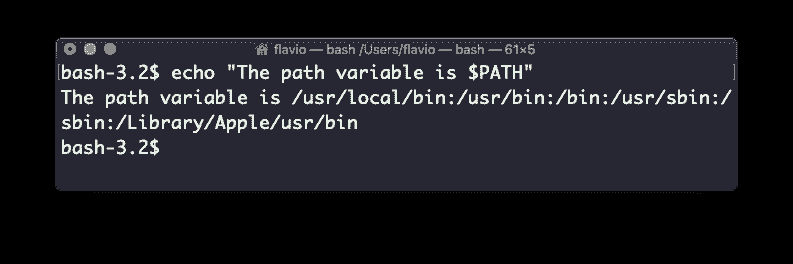

注意特殊字符需要用反斜杠`\`进行转义。`$`例如:

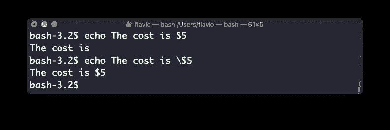
这只是开始。当涉及到与 shell 特性的交互时，我们可以做一些很好的事情。

我们可以回显当前文件夹中的文件:

```
echo * 
```

我们可以回显当前文件夹中以字母`o`开头的文件:

```
echo o* 
```

这里可以使用任何有效的 Bash(或者您正在使用的任何 shell)命令和特性。

您可以打印您的个人文件夹路径:

```
echo ~ 
```


您还可以执行命令，并将结果打印到标准输出(或文件，如您所见):

```
echo $(ls -al) 
```

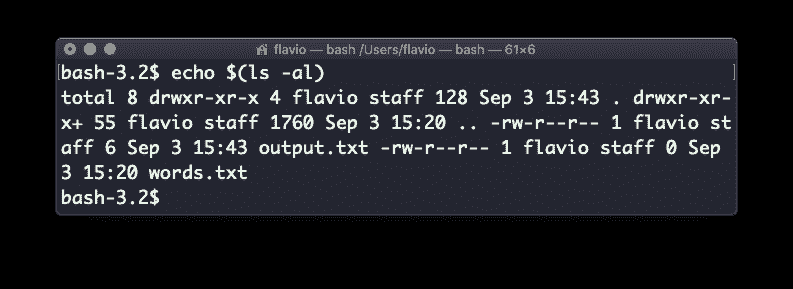

注意，缺省情况下不保留空格。为此，您需要用双引号将命令括起来:

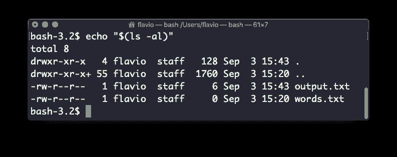

您可以生成字符串列表，例如范围:

```
echo {1..5} 
```


## Linux 的`chown`命令

像 Linux 或 macOS 这样的操作系统(以及一般的 UNIX 系统)中的每个文件/目录都有一个**所有者**。

文件的所有者可以用它做任何事情。它可以决定那个文件的命运。

所有者(和`root`用户)也可以使用`chown`命令将所有者更改为另一个用户:

```
chown <owner> <file> 
```

像这样:

```
chown flavio test.txt 
```

例如，如果您有一个属于`root`的文件，您不能以另一个用户的身份写入该文件:

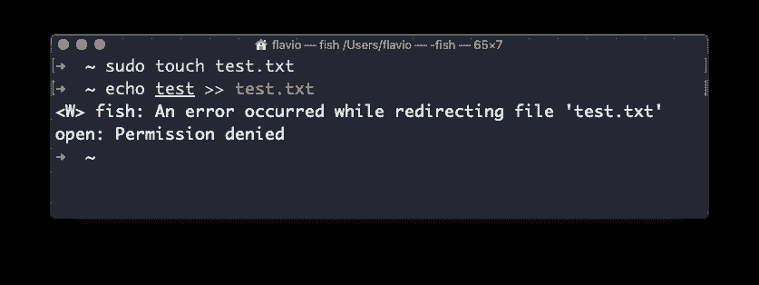

您可以使用`chown`将所有权转让给您:

需要改变一个目录的所有权，并递归地改变包含的所有文件，以及所有子目录和其中包含的文件，这是很常见的。

您可以使用`-R`标志来实现:

```
chown -R <owner> <file> 
```

文件/目录不仅仅有一个所有者，它们还有一个**组**。通过此命令，您可以在更改所有者的同时进行更改:

```
chown <owner>:<group> <file> 
```

示例:

```
chown flavio:users test.txt 
```

您也可以使用`chgrp`命令更改文件的组:

```
chgrp <group> <filename> 
```

## Linux 的`chmod`命令

Linux / macOS 操作系统(以及一般的 UNIX 系统)中的每个文件都有 3 种权限:读、写和执行。

进入一个文件夹，运行`ls -al`命令。

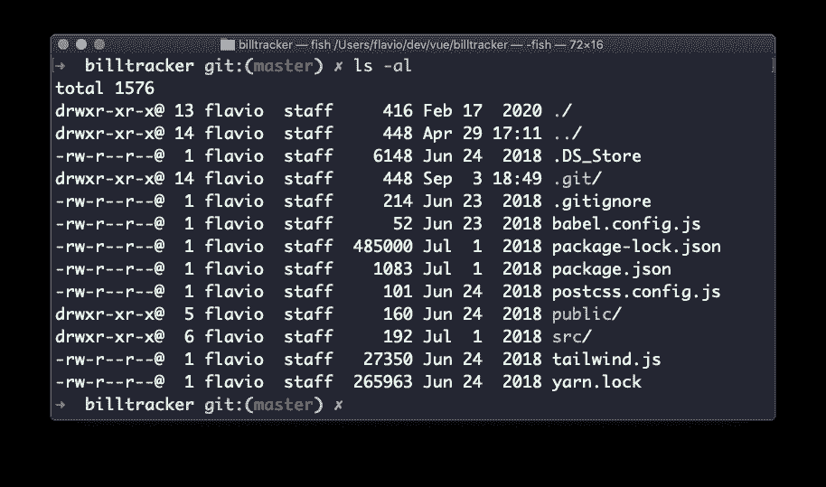
你在每一行文件上看到的怪异字符串，和`drwxr-xr-x`一样，定义了文件或文件夹的权限。

我们来解剖一下。

第一个字母表示文件的类型:

*   `-`表示这是一个普通文件
*   `d`表示这是一个目录
*   `l`表示这是一个链接

那么你有 3 组值:

*   第一组代表文件的所有者的权限
*   第二组代表与文件相关联的组的成员的权限
*   第三组代表**其他所有人的权限**

这些集合由 3 个值组成。`rwx`表示特定的*角色*拥有读取、写入和执行权限。任何被删除的内容都用一个`-`进行交换，这允许您形成各种值和相对权限的组合:`rw-`、`r--`、`r-x`等等。

您可以使用`chmod`命令更改文件的权限。

`chmod`可用于 2 种方式。第一种是使用符号参数，第二种是使用数字参数。我们先从符号开始，这样更直观。

您键入`chmod`,后跟一个空格和一个字母:

*   `a`代表*所有*
*   `u`代表*用户*
*   `g`代表*组*
*   `o`代表*其他*

然后输入`+`或`-`来添加或删除权限。然后输入一个或多个许可符号(`r`、`w`、`x`)。

后跟文件或文件夹名称。

以下是一些例子:

```
chmod a+r filename #everyone can now read
chmod a+rw filename #everyone can now read and write
chmod o-rwx filename #others (not the owner, not in the same group of the file) cannot read, write or execute the file 
```

通过在`+` / `-`前添加多个字母，您可以将相同的权限应用于多个角色:

```
chmod og-r filename #other and group can't read any more 
```

如果您正在编辑一个文件夹，您可以使用`-r`(递归)标志将权限应用于该文件夹中包含的每个文件。

数字参数更快，但是我发现当你不每天使用它们的时候很难记住它们。您使用一个数字来表示角色的权限。该数值最大为 7，计算方法如下:

*   `1`如果有执行权限
*   `2`如果有写权限
*   `4`如果有读取权限

这给了我们 4 种组合:

*   `0`没有权限
*   `1`可以执行
*   `2`会写字
*   `3`能写，能执行
*   `4`可以阅读
*   `5`可以读取、执行
*   `6`会读，会写
*   `7`能够读、写和执行

我们 3 个一组地使用它们来设置所有 3 个组的权限:

```
chmod 777 filename
chmod 755 filename
chmod 644 filename 
```

## Linux 的`umask`命令

当您创建一个文件时，您不必预先决定权限。权限有默认值。

这些默认值可以使用`umask`命令进行控制和修改。

键入不带参数的`umask`将显示当前的 umask，在本例中为`0022`:

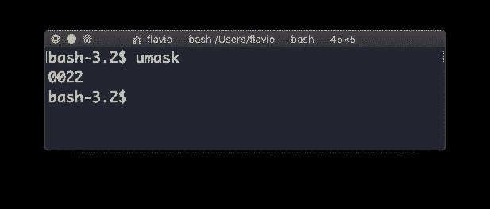

`0022`是什么意思？这是一个代表权限的八进制值。

另一个常见的值是`0002`。

使用`umask -S`查看人类可读的符号:

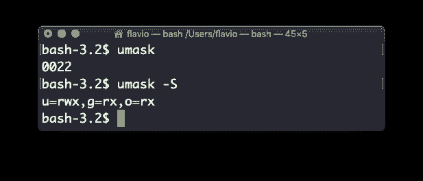
在这种情况下，文件的所有者用户(`u`)拥有文件的读、写和执行权限。

属于同一组的其他用户(`g`)具有读取和执行权限，与所有其他用户(`o`)相同。

在数字符号中，我们通常改变最后 3 位数字。

下面的列表给出了这个数字的含义:

*   读、写、执行
*   `1`读和写
*   `2`阅读并执行
*   `3`只读
*   `4`编写并执行
*   `5`只写
*   `6`仅执行
*   `7`没有权限

注意，这个数字符号与我们在`chmod`中使用的不同。

我们可以为掩码设置一个新值，以数字格式设置该值:

```
umask 002 
```

或者，您可以更改特定角色的权限:

```
umask g+r 
```

## Linux 的`du`命令

`du`命令将计算整个目录的大小:

```
du 
```

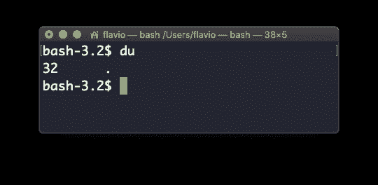

这里的`32`数字是以字节表示的值。

运行`du *`将单独计算每个文件的大小:

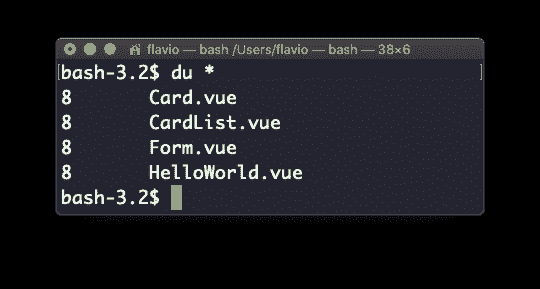

您可以设置`du`使用`du -m`以兆字节显示数值，使用`du -g`以千兆字节显示数值。

`-h`选项将显示适合尺寸的人类可读符号:

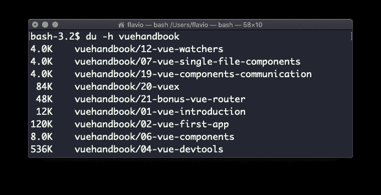

添加`-a`选项也将打印目录中每个文件的大小:

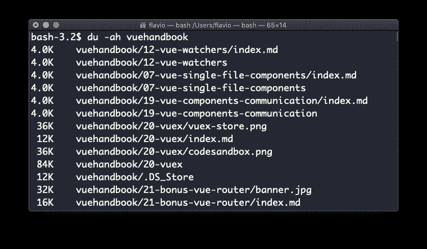

一个方便的方法是按大小对目录进行排序:

```
du -h <directory> | sort -nr 
```

然后通过管道连接到`head`，只得到前 10 个结果:

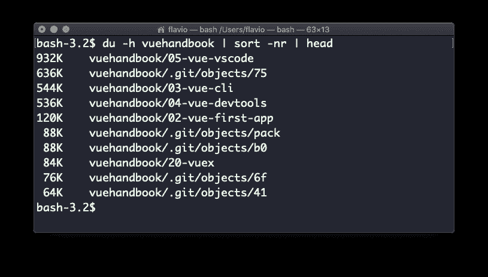

## Linux 的`df`命令

`df`命令用于获取磁盘使用信息。

它的基本形式将打印有关已装入卷的信息:

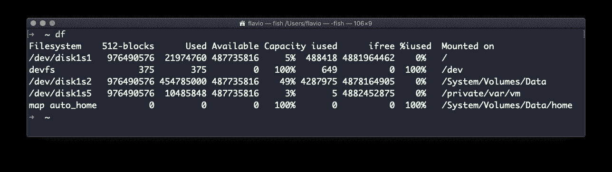

使用`-h`选项(`df -h`)将以人类可读的格式显示这些值:

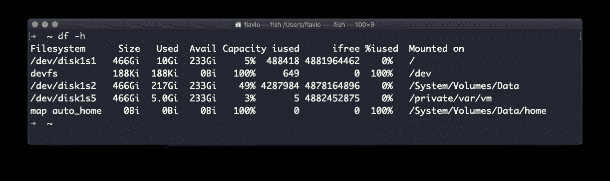

您还可以指定文件名或目录名，以获取有关它所在的特定卷的信息:

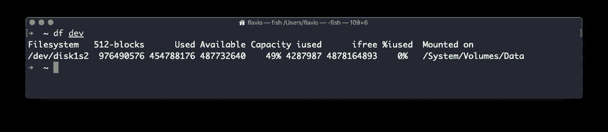

## Linux 的`basename`命令

假设您有一个文件的路径，例如`/Users/flavio/test.txt`。

运转

```
basename /Users/flavio/test.txt 
```

将返回`test.txt`字符串:

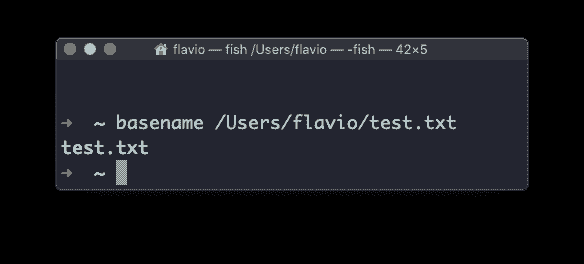

如果你在指向一个目录的路径字符串上运行`basename`，你将得到路径的最后一段。在本例中，`/Users/flavio`是一个目录:

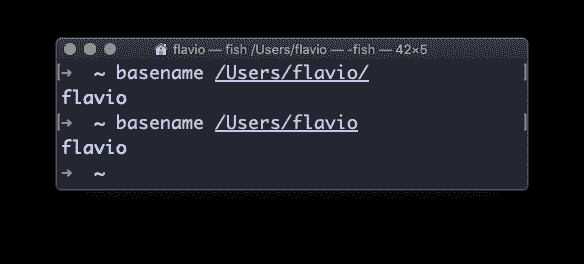

## Linux 的`dirname`命令

假设您有一个文件的路径，例如`/Users/flavio/test.txt`。

运转

```
dirname /Users/flavio/test.txt 
```

将返回`/Users/flavio`字符串:

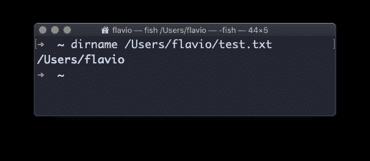

## Linux 的`ps`命令

你的电脑一直在运行大量不同的进程。

您可以使用`ps`命令对它们进行检查:

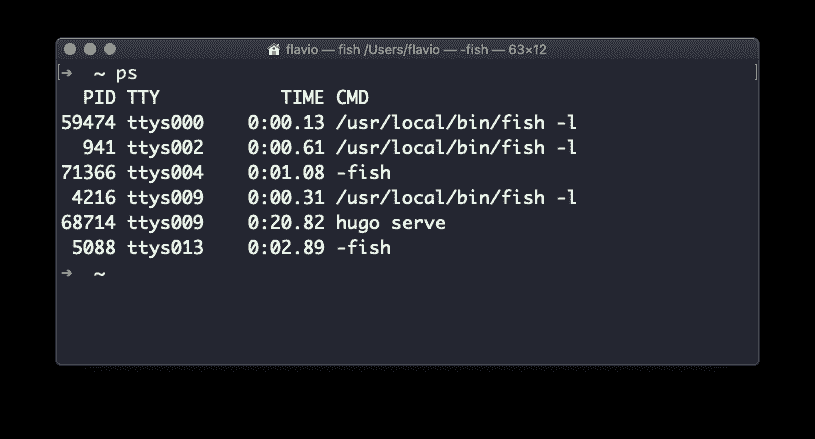

这是当前会话中当前运行的用户启动的进程的列表。

这里我有几个`fish` shell 实例，大部分是由编辑器内的 VS 代码打开的，还有一个 Hugo 运行一个站点的开发预览的实例。

这些只是分配给当前用户的命令。为了列出**所有的**进程，我们需要将一些选项传递给`ps`。

我最常用的是`ps ax`:

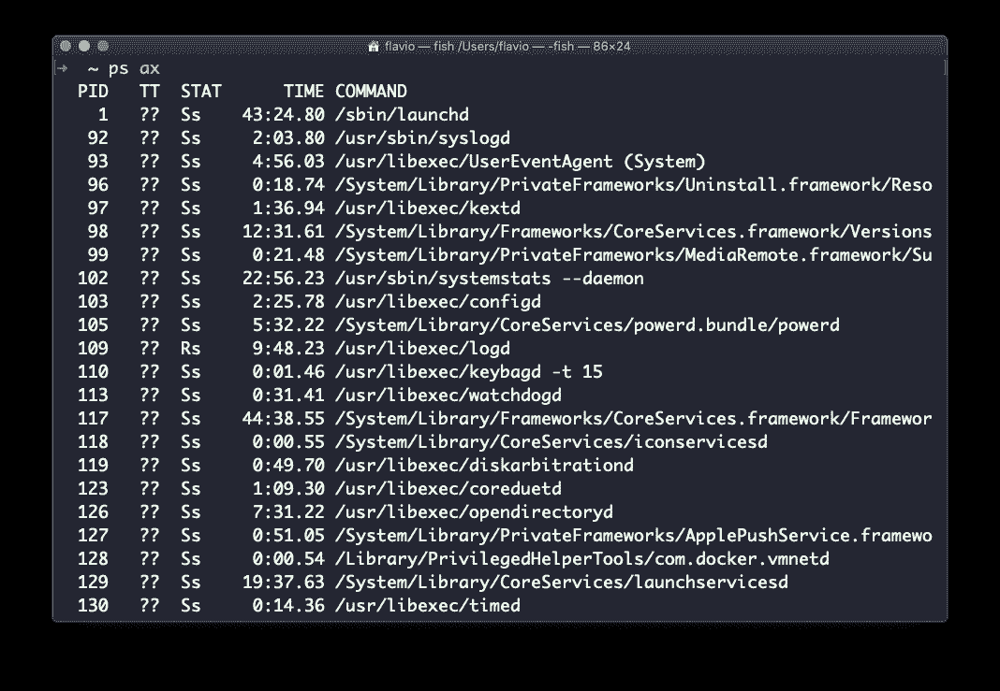

> `a`选项用于列出其他用户的进程，而不仅仅是您自己的进程。`x`显示未链接到任何终端的流程(不是由用户通过终端发起的)。

如您所见，较长的命令被删除了。使用命令`ps axww`在新的一行上继续命令列表，而不是将其删除:

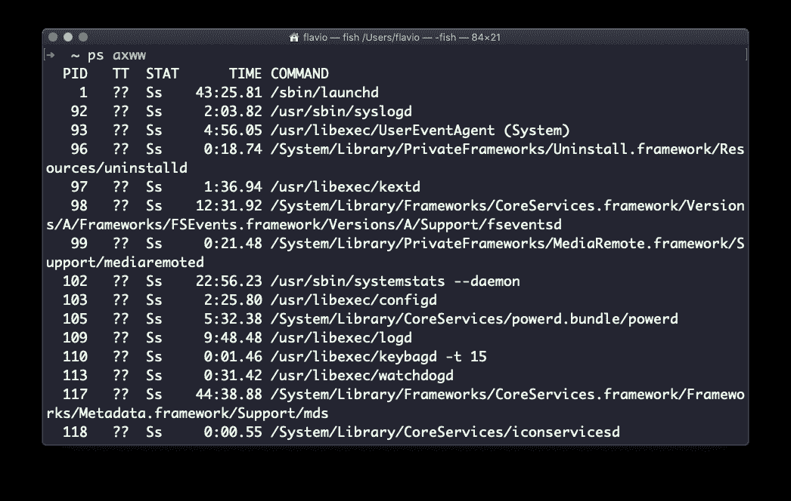

> 我们需要指定`w` 2 次来应用这个设置(不是打错字)。

您可以将`grep`与管道结合起来搜索特定的流程，如下所示:

```
ps axww | grep "Visual Studio Code" 
```

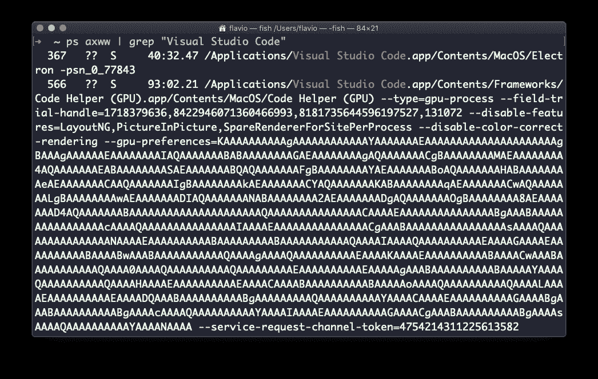
`ps`返回的列代表一些关键信息。

第一个信息是`PID`，进程 ID。当您想在另一个命令中引用这个进程时，这是关键，例如杀死它。

然后我们有`TT`告诉我们使用的终端 id。

然后`STAT`告诉我们流程的状态:

`I`一个空闲的进程(睡眠时间超过 20 秒左右)
`R`一个可运行的进程
`S`一个睡眠时间少于 20 秒左右的进程
`T`一个停止的进程
`U`一个不间断等待的进程
`Z`一个死进程(一个*僵尸*

如果你有不止一个字母，第二个代表进一步的信息，这可能是非常技术性的。

通常有`+`表示进程在其终端处于前台。`s`表示该流程是一个[会话的领导者](https://unix.stackexchange.com/questions/18166/what-are-session-leaders-in-ps)。

告诉我们流程已经运行了多长时间。

## Linux 的`top`命令

`top`命令用于显示系统中正在运行的进程的动态实时信息。

了解是怎么回事真的是得心应手。

它的用法很简单——您只需键入`top`,终端将完全沉浸在这个新视图中:

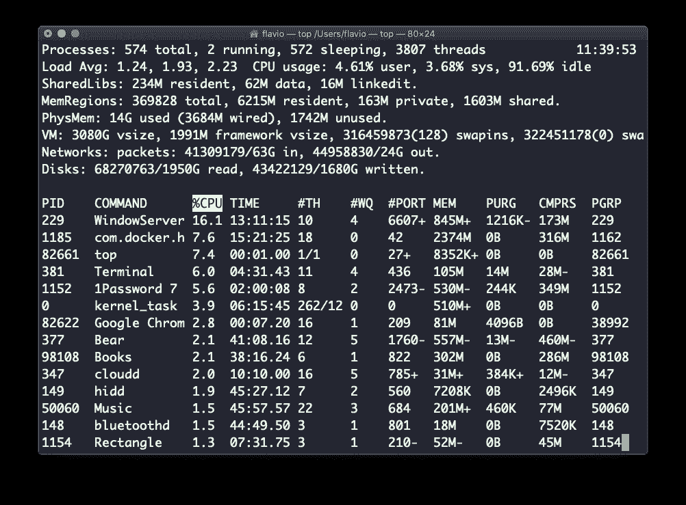
这个过程是长期运行的。要退出，您可以键入字母`q`或`ctrl-C`。

我们得到了很多信息:进程的数量，有多少正在运行或休眠，系统负载，CPU 使用情况，等等。

下面，占用内存和 CPU 最多的进程列表会不断更新。

默认情况下，正如您可以从突出显示的`%CPU`列中看到的，它们是按照使用的 CPU 排序的。

您可以添加一个标志，以便按使用的内存对进程进行排序:

```
top -o mem 
```

## Linux 的`kill`命令

Linux 进程可以接收**信号**并对其做出反应。

这是我们与正在运行的程序进行交互的一种方式。

`kill`程序可以向一个程序发送各种信号。

它不只是用来终止一个程序，就像它的名字所暗示的那样，但这是它的主要工作。

我们是这样使用它的:

```
kill <PID> 
```

默认情况下，这会向指定的进程 id 发送`TERM`信号。

我们可以使用标志来发送其他信号，包括:

```
kill -HUP <PID>
kill -INT <PID>
kill -KILL <PID>
kill -TERM <PID>
kill -CONT <PID>
kill -STOP <PID> 
```

`HUP`表示**挂机**。当启动一个进程的终端窗口在终止该进程之前被关闭时，它被自动发送。

`INT`表示**中断**，它发送的信号与我们在终端中按下`ctrl-C`时使用的信号相同，通常会终止进程。

`KILL`不发送给进程，而是发送给操作系统内核，操作系统内核立即停止并终止进程。

`TERM`表示**终止**。该进程将接收它并自行终止。是`kill`发出的默认信号。

`CONT`表示**继续**。它可用于恢复已停止的进程。

`STOP`不是发送给进程，而是发送给操作系统内核，它会立即停止(但不会终止)进程。

你可能会看到用数字代替，比如`kill -1 <PID>`。在这种情况下，

`1`对应`HUP`。
`2`对应`INT`。
`9`对应`KILL`。
`15`对应`TERM`。
`18`对应`CONT`。
`15`对应`STOP`。

## Linux 的`killall`命令

类似于`kill`命令，`killall`将一次向多个进程发送信号，而不是向特定的进程 id 发送信号。

这是语法:

```
killall <name> 
```

其中`name`是一个程序的名称。例如，你可以运行多个`top`程序实例，而`killall top`将终止它们。

您可以指定信号，如使用`kill`(并查看`kill`教程以了解更多关于我们可以发送的信号的具体种类)，例如:

```
killall -HUP top 
```

## Linux 的`jobs`命令

当我们在 Linux / macOS 中运行一个命令时，我们可以使用命令后的`&`符号将其设置为在后台运行。

例如，我们可以在后台运行`top`:

```
top & 
```

这对于长时间运行的程序来说非常方便。

我们可以使用`fg`命令回到那个程序。如果我们在后台只有一个作业，这很好，否则我们需要使用作业号:`fg 1`、`fg 2`等等。

为了获得作业编号，我们使用`jobs`命令。

假设我们先运行`top &`，然后运行`top -o mem &`，那么我们有两个顶级实例在运行。`jobs`会告诉我们这个:

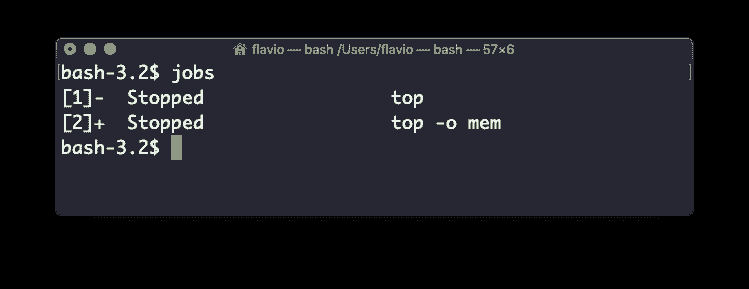
现在我们可以切换回那些使用`fg <jobid>`的人之一。要再次停止程序，我们可以点击`cmd-Z`。

运行`jobs -l`还将打印每个作业的进程 id。

## Linux 的`bg`命令

当命令正在运行时，您可以使用`ctrl-Z`暂停它。

该命令将立即停止，您将返回到 shell 终端。

您可以在后台继续执行该命令，因此它将继续运行，但不会阻止您在终端中执行其他工作。

在本例中，我停止了两个命令:

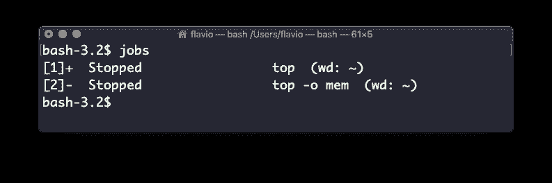
我可以运行`bg 1`在后台恢复执行作业#1。

我也可以不带任何选项地说`bg`，因为默认情况下是选择列表中的作业#1。

## Linux 的`fg`命令

当一个命令在后台运行时，因为你在末尾用`&`启动了它(例如:`top &`或者因为你用`bg`命令把它放到后台)，你可以用`fg`把它放到前台。

运转

```
fg 
```

将在前台恢复上次暂停的作业。

您还可以通过作业编号来指定您想要将哪个作业恢复到前台，这可以使用`jobs`命令来获得。

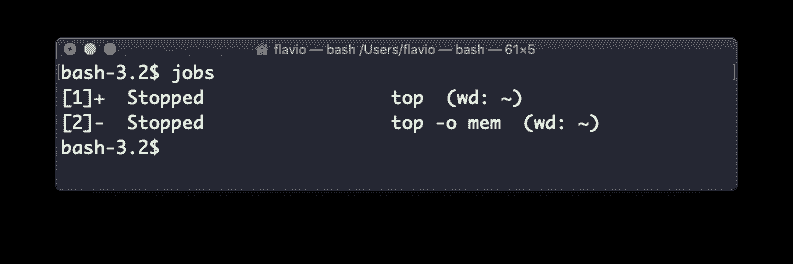

运行`fg 2`将恢复作业#2:

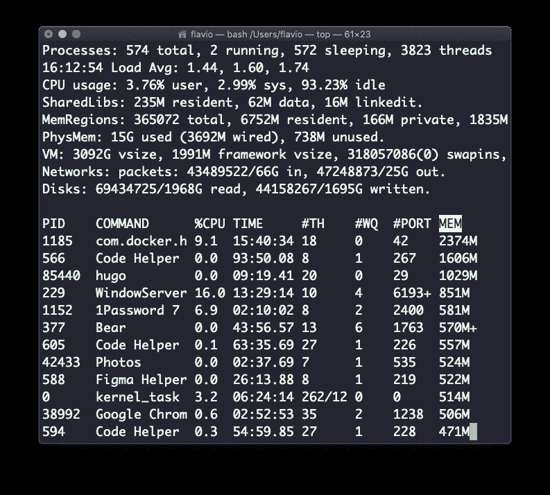

## Linux 的`type`命令

命令可以是以下四种类型之一:

*   可执行文件
*   外壳内置程序
*   外壳函数
*   化名

如果我们想知道或者只是好奇的话,`type`命令可以帮助解决这个问题。它会告诉你如何解释这个命令。

输出将取决于所使用的 shell。这是 Bash:

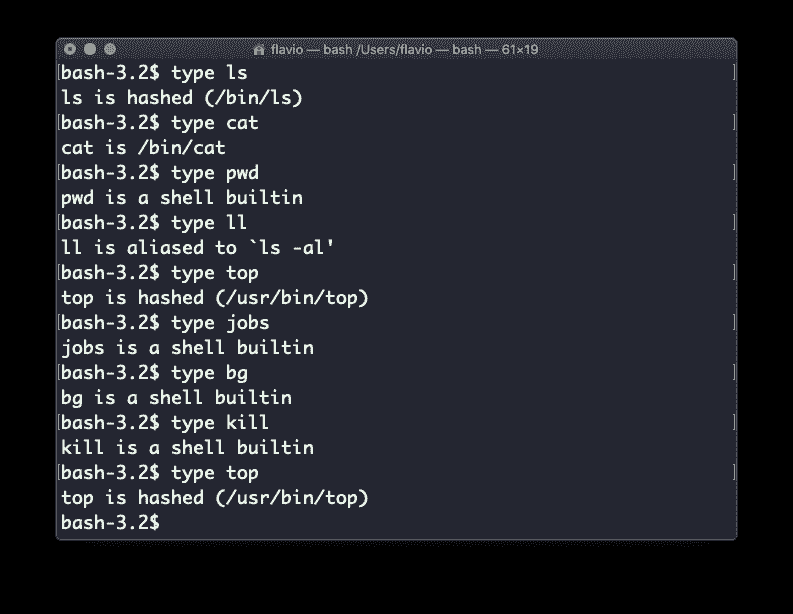

这是 Zsh:


这是鱼:

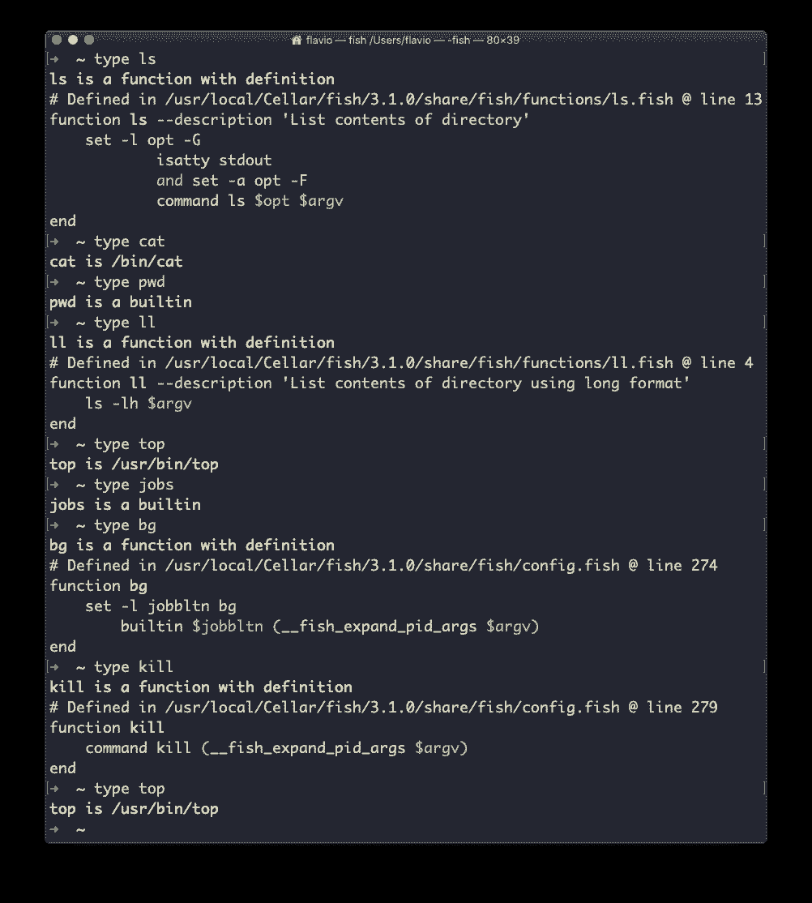
这里最有趣的事情之一是，对于别名，它会告诉你别名是什么。在 Bash 和 Zsh 中，您可以看到`ll`别名，但是 Fish 默认提供了它，所以它会告诉您这是一个内置的 shell 函数。

## Linux 的`which`命令

假设您有一个可以执行的命令，因为它在 shell 路径中，但是您想知道它的位置。

您可以使用`which`来完成。该命令将返回指定命令的路径:

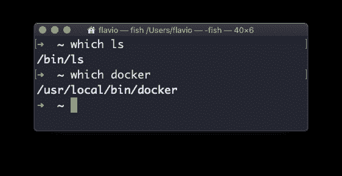
`which`只对存储在磁盘上的可执行文件有效，对别名或内置 shell 函数无效。

## Linux 的`nohup`命令

有时，您必须在远程机器上运行一个长期存在的进程，然后您需要断开连接。

或者，如果您和服务器之间有任何网络问题，您只是想防止命令被暂停。

即使在注销或关闭服务器会话后，也可以运行命令的方法是使用`nohup`命令。

使用`nohup <command>`让进程继续工作，即使在您注销后。

## Linux 的`xargs`命令

在 UNIX shell 中使用`xargs`命令将标准输入转换成命令的参数。

换句话说，通过使用`xargs`，一个命令的输出被用作另一个命令的输入。

下面是您将使用的语法:

```
command1 | xargs command2 
```

我们使用管道(`|`)将输出传递给`xargs`。这将负责运行`command2`命令，使用`command1`的输出作为它的参数。

我们来做一个简单的例子。你想从一个目录中删除一些特定的文件。这些文件列在一个文本文件中。

我们有三档:`file1`、`file2`、`file3`。

在`todelete.txt`中，我们有一个想要删除的文件列表，在这个例子中是`file1`和`file3`:

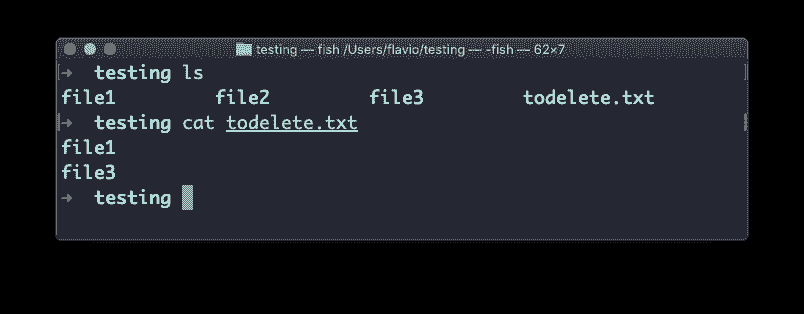

我们将通过`xargs`把`cat todelete.txt`的输出传递给`rm`命令。

这样一来:

```
cat todelete.txt | xargs rm 
```

这就是结果，我们列出的文件现在被删除:


它的工作方式是`xargs`将运行`rm` 2 次，每次运行一个由`cat`返回的行。

这是`xargs`最简单的用法。有几个选项我们可以使用。

最有用的一个，在我看来(尤其是开始学`xargs`的时候)，是`-p`。使用这个选项会让`xargs`打印一个确认提示，告诉他将要采取的行动:

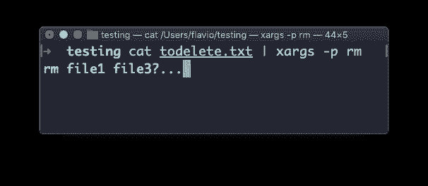

`-n`选项让您告诉`xargs`一次执行一个迭代，因此您可以用`-p`单独确认它们。这里我们告诉`xargs`用`-n1`一次执行一次迭代:

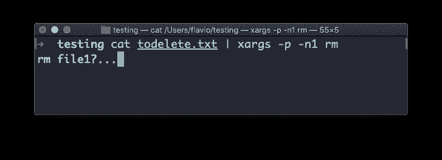

`-I`选项是另一个广泛使用的选项。它允许您将输出放入一个占位符中，然后您可以做各种事情。

其中之一是运行多个命令:

```
command1 | xargs -I % /bin/bash -c 'command2 %; command3 %' 
```

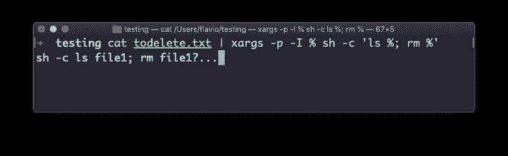

> 你可以把我上面用的符号`%`换成其他任何东西——它是一个变量。

## Linux `vim`编辑器命令

`vim`是一款**非常**受欢迎的文件编辑器，尤其是在程序员当中。它被积极地开发和频繁地更新，并且有一个大的社区围绕着它。甚至还有一个 [Vim 会议](https://vimconf.org/)！

`vi`在现代系统中只是`vim`的别名，意思是被证明的`vi` i `m`。

您可以通过在命令行运行`vi`来启动它。

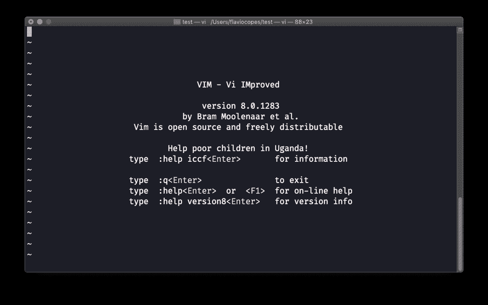

您可以在调用时指定文件名来编辑该特定文件:

```
vi test.txt 
```

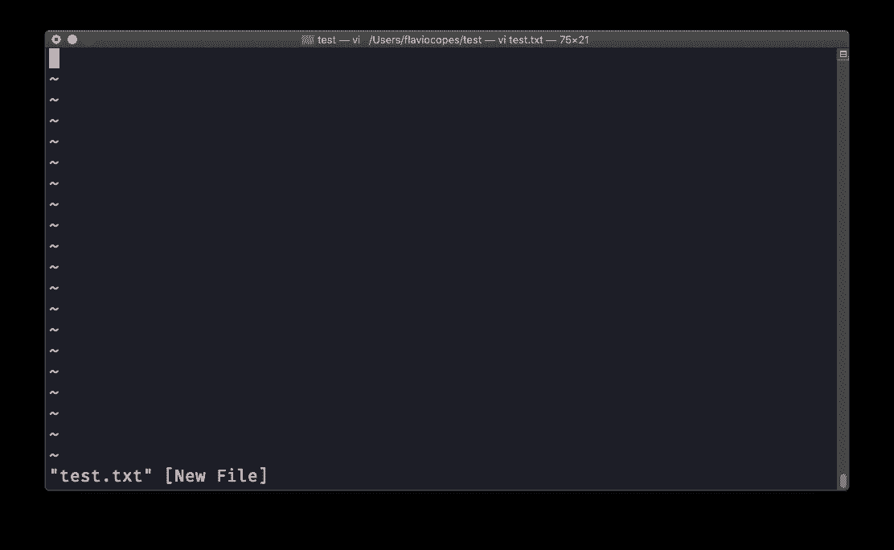

您必须知道，Vim 有两种主要模式:

*   *命令*(或*正常*)模式
*   *插入*模式

当您启动编辑器时，您处于命令模式。在基于 GUI 的编辑器中，您无法像预期的那样输入文本。你必须进入**插入模式**。

您可以通过按下`i`键来完成此操作。一旦你这样做了，`-- INSERT --`这个词就会出现在编辑器的底部:

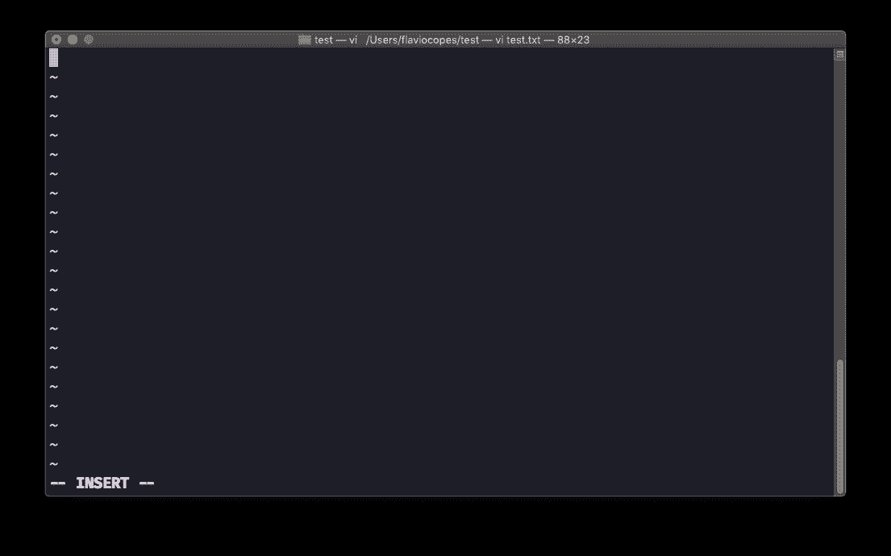

现在，您可以开始键入文件内容并将其填充到屏幕上:

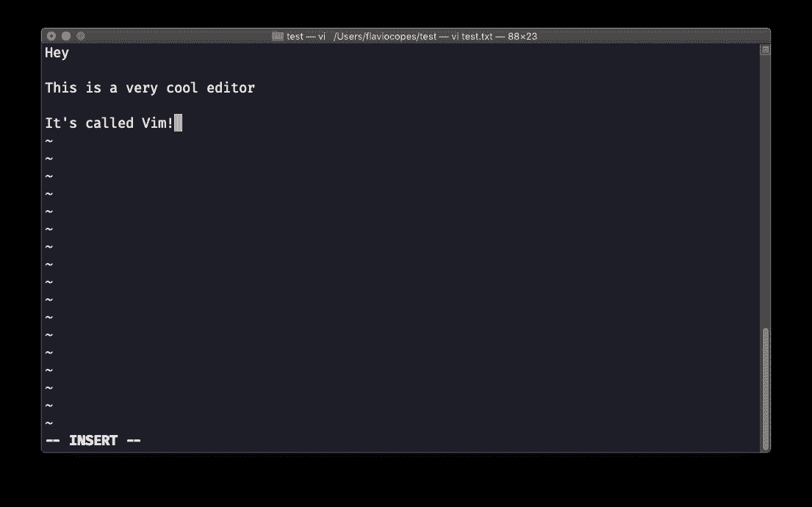

您可以使用箭头键或使用`h` - `j` - `k` - `l`键在文件中移动。`h-l`为左右，`j-k`为上下。

一旦你完成编辑，你可以按下`esc`键退出插入模式，回到**命令模式**。

此时，您可以浏览文件，但不能向其中添加内容(注意您按的键，因为它们可能是命令)。

你现在可能想做的一件事是**保存文件**。您可以通过按下`:`(冒号)，然后按下`w`来完成。

您可以通过按`:`然后按`w`和`q` : `:wq`来**保存和退出**

您可以通过按`:`然后按`q`和`!` : `:q!`来**退出而不保存**

你可以通过进入命令模式并按下`u`来**撤销**并编辑。按下`ctrl-r`可以**重做**(取消撤消)。

这些是使用 Vim 的基础。从这里开始一个兔子洞，我们不能在这个小介绍中进入。

我将只提到那些可以让您开始使用 Vim 进行编辑的命令:

*   按下`x`键删除当前高亮显示的字符
*   按下`A`转到当前所选行的末尾
*   按下`0`转到该行的开头
*   转到单词的第一个字符，按下`d`，然后按下`w`，删除该单词。如果您用`e`而不是`w`跟随它，则下一个单词之前的空白会被保留
*   使用`d`和`w`之间的数字删除 1 个以上的单词，例如使用`d3w`向前删除 3 个单词
*   按下`d`,然后按下`d`,删除一整行。按下`d`,然后按下`$`,删除光标所在的整行，直到结束

要了解更多关于 Vim 的信息，我可以推荐 [Vim FAQ](https://vimhelp.org/vim_faq.txt.html) 。您还可以运行`vimtutor`命令，该命令应该已经安装在您的系统中，将极大地帮助您开始您的`vim`探索。

## Linux `emacs`编辑器命令

`emacs`是一个很棒的编辑器，历史上被认为是 UNIX 系统的编辑器*。众所周知，`vi` vs `emacs`激烈的战争和激烈的讨论给世界各地的开发者造成了许多非生产性的时间。*

`emacs`很强大。有些人整天把它当成一种操作系统([https://news.ycombinator.com/item?id=19127258](https://news.ycombinator.com/item?id=19127258))。这里只说基本的。

您可以通过调用`emacs`来打开一个新的 emacs 会话:

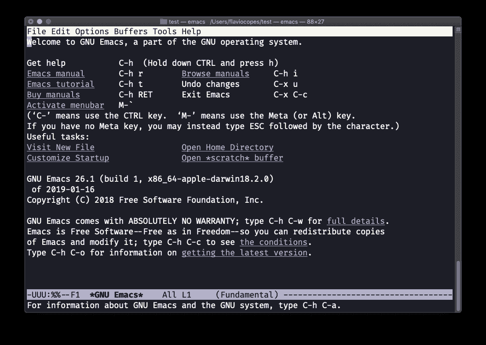

> macOS 用户，现在停一秒。如果你使用的是 Linux，这没有问题，但是 macOS 不提供使用 GPLv3 的应用程序，而且每个已经更新到 GPLv3 的内置 UNIX 命令也没有更新。
> 
> 虽然我到目前为止列出的命令有一点问题，但是在这种情况下，使用 2007 年的 emacs 版本与使用经过 12 年改进和变化的版本并不完全相同。
> 
> 这不是 Vim 的问题，它是最新的。为了解决这个问题，运行`brew install emacs`和运行`emacs`将使用家酿软件的新版本(确保你已经安装了[家酿软件](https://flaviocopes.com/homebrew/))。

您也可以通过调用`emacs <filename>`来编辑现有文件:

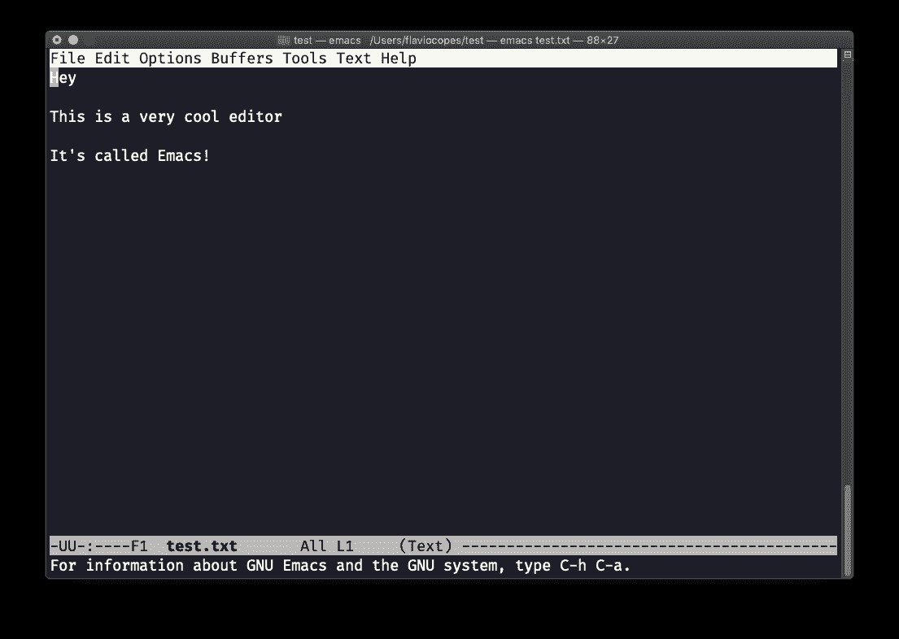

您现在可以开始编辑了。完成后，按下`ctrl-x`，然后按下`ctrl-w`。您确认文件夹:


Emacs 告诉您文件存在，询问您是否应该覆盖它:

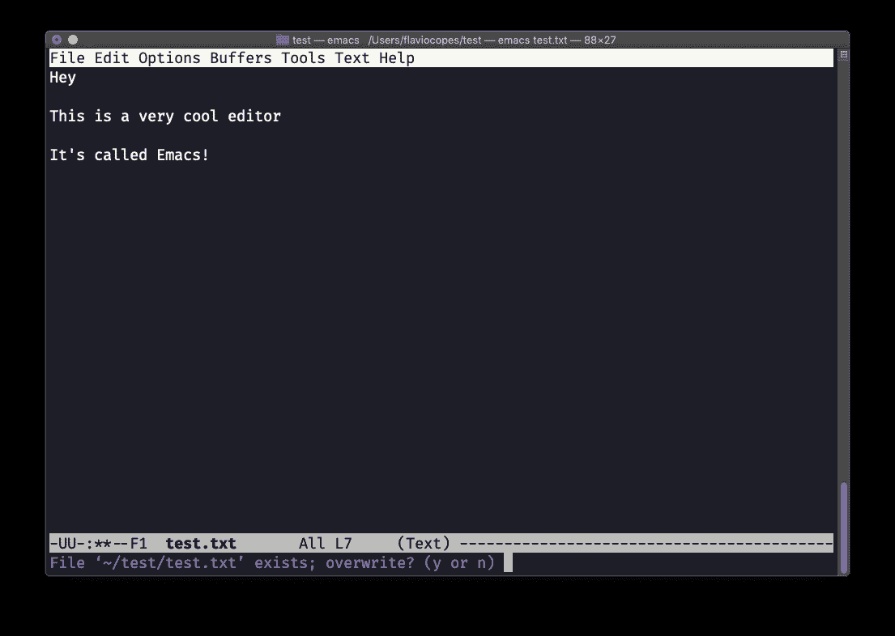

回答`y`，你会得到一个成功的确认:

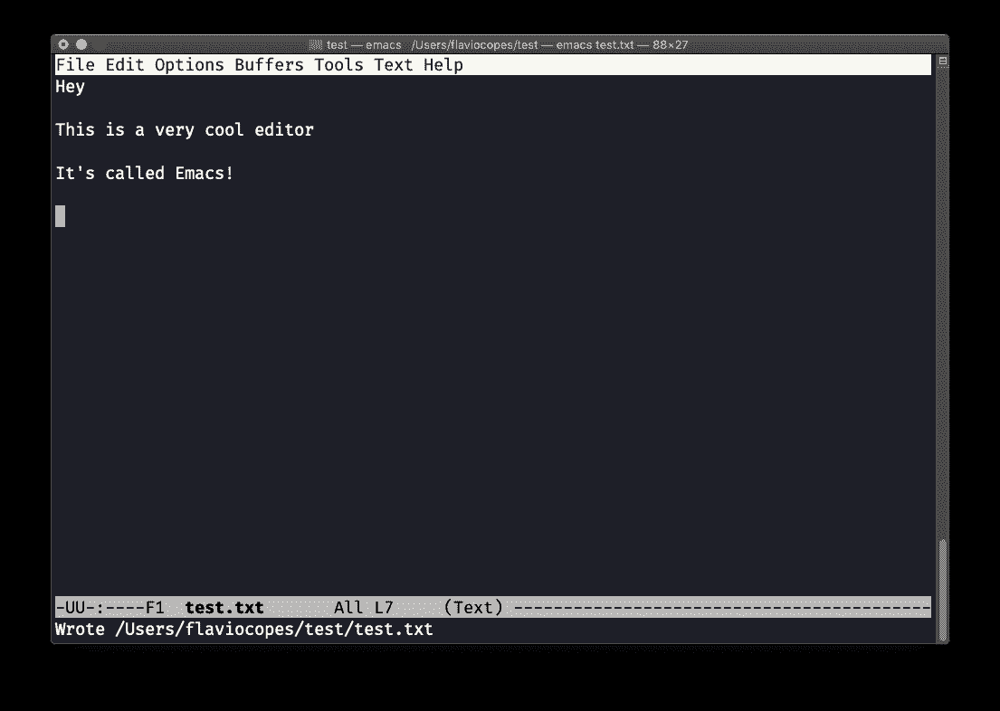
您可以通过按`ctrl-x`然后按`ctrl-c`退出 Emacs。
或`ctrl-x`后接`c`(按住`ctrl`)。

关于 Emacs 有很多需要了解的东西，肯定比我在这篇简介中所能写的要多。我鼓励你打开 Emacs，按`ctrl-h` `r`打开内置手册，按`ctrl-h` `t`打开官方教程。

## Linux `nano`编辑器命令

是一个初学者友好的编辑器。

使用`nano <filename>`运行它。

您可以直接在文件中键入字符，而不用担心模式。

您可以使用`ctrl-X`退出而不进行编辑。如果您编辑了文件缓冲区，编辑器将要求您确认，您可以保存编辑，或放弃它们。

底部的帮助显示了允许您处理文件的键盘命令:

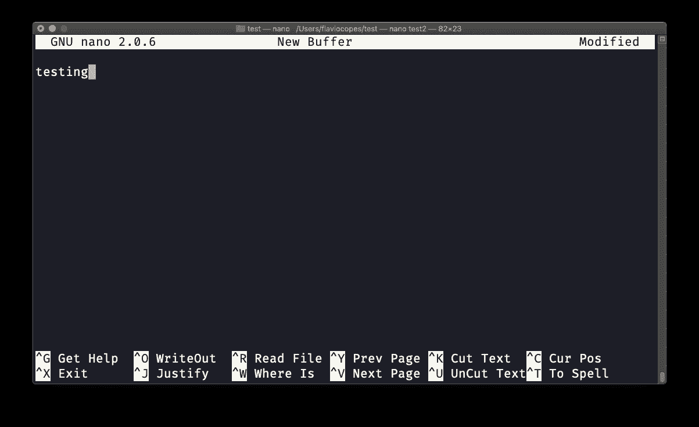
`pico`或多或少是相同的，尽管`nano`是`pico`的 GNU 版本，在历史上的某个时候并没有开源。`nano`克隆是为了满足 GNU 操作系统许可证的要求。

## Linux 的`whoami`命令

键入`whoami`打印当前登录到终端会话的用户名:

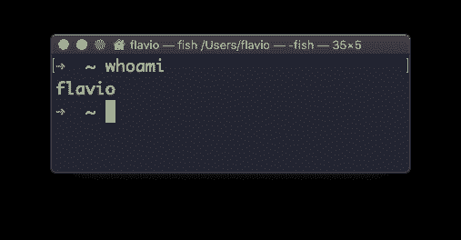

> 注意:这不同于`who am i`命令，它打印更多的信息

## Linux 的`who`命令

`who`命令显示登录到系统的用户。

除非您使用的是多人都可以访问的服务器，否则您很可能是唯一一个多次登录的用户:

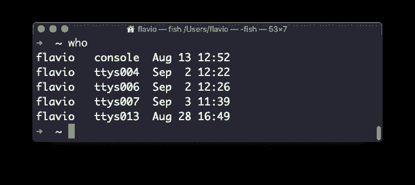

为什么要多次？因为每个打开的外壳都将被视为一次访问。

您可以看到所用终端的名称，以及会话开始的时间/日期。

`-aH`标志将告诉`who`显示更多信息，包括终端的空闲时间和进程 ID:

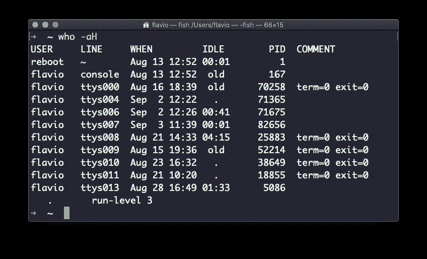

特殊的`who am i`命令将列出当前终端会话的详细信息:

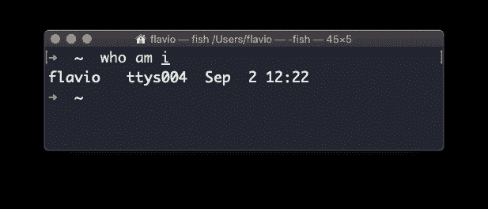

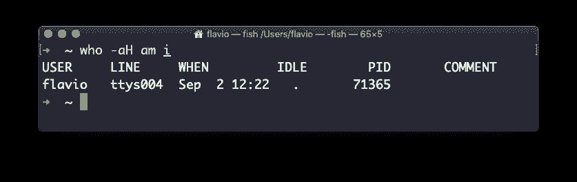

## Linux 的`su`命令

当您使用一个用户登录到终端 shell 时，您可能需要切换到另一个用户。

例如，您以 root 用户身份登录以执行一些维护，但随后您想切换到用户帐户。

您可以使用`su`命令来完成:

```
su <username> 
```

比如:`su flavio`。

如果你以用户身份登录，运行`su`而不运行其他任何东西，会提示你输入`root`用户密码，因为这是默认行为。

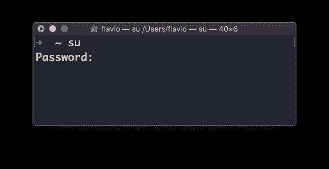
`su`将作为另一个用户启动一个新的 shell。

完成后，在 shell 中键入`exit`将关闭该 shell，并返回到当前用户的 shell。

## Linux 的`sudo`命令

`sudo`通常用于以 root 身份运行命令。

您必须被启用才能使用`sudo`，一旦您被启用，您就可以通过输入您的用户密码(*而不是*root 用户密码)以 root 用户身份运行命令。

权限是高度可配置的，尤其是在多用户服务器环境中。一些用户可以通过`sudo`获得运行特定命令的权限。

例如，您可以编辑系统配置文件:

```
sudo nano /etc/hosts 
```

否则将无法保存，因为您没有对它的权限
。

您可以运行`sudo -i`以 root 用户身份启动一个 shell:

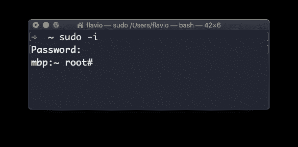

您可以使用`sudo`作为任何用户运行命令。默认为`root`，但是使用`-u`选项指定另一个用户:

```
sudo -u flavio ls /Users/flavio 
```

## Linux 的`passwd`命令

Linux 中的用户被分配了一个密码。您可以使用`passwd`命令更改密码。

这里有两种情况。

第一种是当你想改变你的密码。在这种情况下，请键入:

```
passwd 
```

交互式提示会要求您输入旧密码，然后要求您输入新密码:

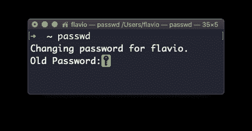

当您是`root`(或拥有超级用户权限)时，您可以设置想要更改密码的用户名:

```
passwd <username> <new password> 
```

在这种情况下，您不需要输入旧的。

## Linux 的`ping`命令

命令 pings 本地网络或互联网上的特定网络主机。

您可以将它与语法`ping <host>`一起使用，其中`<host>`可以是域名或 IP 地址。

这里有一个 pinging】的例子:

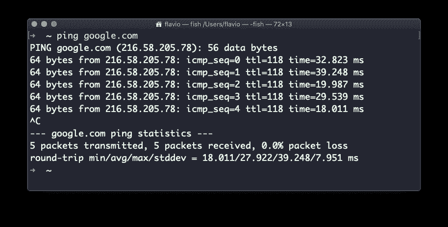
命令向服务器发送请求，服务器返回响应。

默认情况下，保持每秒发送一次请求。它会一直运行，直到你用`ctrl-C`停止它，除非你通过了你想用`-c`选项尝试的次数:`ping -c 2 google.com`。

一旦`ping`停止，它将打印一些关于结果的统计数据:包丢失的百分比，以及关于网络性能的统计数据。

如您所见，屏幕显示了主机 IP 地址，以及获得响应所需的时间。

并非所有服务器都支持 ping，以防请求超时:

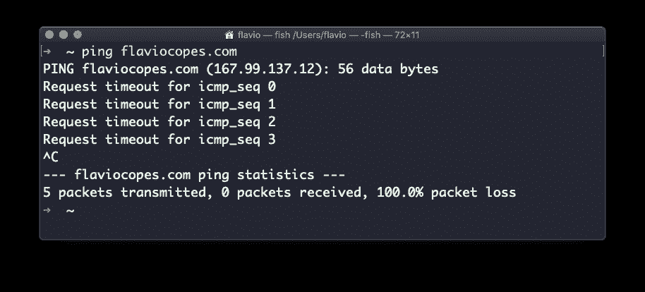

有时这是故意的，为了“隐藏”服务器，或者只是为了减轻负载。ping 数据包也可以被防火墙过滤。

`ping`使用 **ICMP 协议** ( *互联网控制消息协议*)，一种类似 TCP 或 UDP 的网络层协议。

该请求向服务器发送一个带有`ECHO_REQUEST`消息的数据包，服务器返回一个`ECHO_REPLY`消息。我就不赘述了，但这是基本概念。

ping 主机有助于了解主机是否可达(假设它实现了 ping ),以及它离您有多远，需要多长时间才能收到您的回复。

通常服务器离你越近，你收到信息的时间就越短。简单的物理定律导致更长的距离在电缆中引入更多的延迟。

## Linux 的`traceroute`命令

当你试图联系互联网上的主机时，你会通过你的家庭路由器。然后，您到达您的 ISP 网络，该网络又经过它自己的上游网络路由器，依此类推，直到您最终到达主机。

您是否曾经想知道您的数据包要经过哪些步骤才能做到这一点？

`traceroute`命令就是为此而产生的。

你调用

```
traceroute <host> 
```

并且它将(缓慢地)收集信息包传输过程中的所有信息。

在这个例子中，我试着用`traceroute flaviocopes.com`打开我的博客:

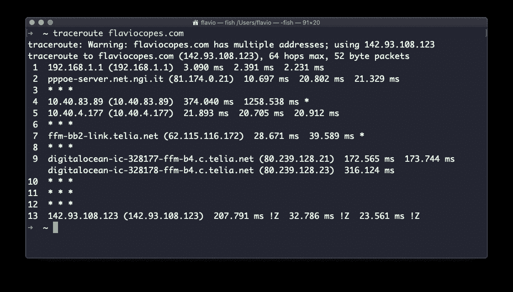

并不是每个路由器都会返回信息给我们。在这种情况下，`traceroute`打印`* * *`。否则，我们可以看到主机名、IP 地址和一些性能指标。

对于每台路由器，我们可以看到 3 个样本，这意味着默认情况下，traceroute 会尝试 3 次，以获得到达目的地所需时间的准确指示。

这就是为什么与简单地对主机执行`ping`相比，执行`traceroute`需要这么长时间。

您可以使用`-q`选项自定义该数字:

```
traceroute -q 1 flaviocopes.com 
```

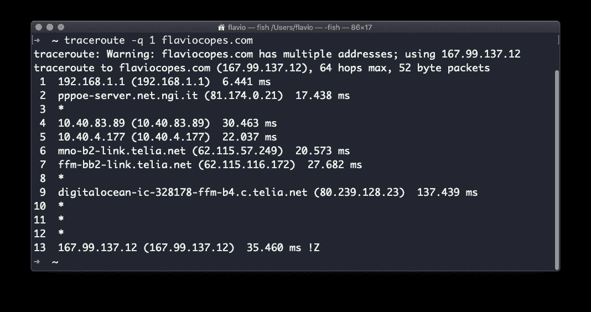

## Linux 的`clear`命令

键入`clear`清除所有之前在当前终端运行的命令。

屏幕将会清空，您将会在顶部看到提示:

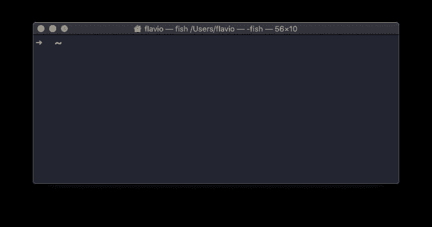

> 注意:该命令有一个方便的快捷方式:`ctrl-L`

一旦这样做，您将无法滚动查看之前输入的命令的输出。

所以你可能想用`clear -x`来代替，它仍然会清空屏幕，但是可以让你通过向上滚动来查看之前的工作。

## Linux 的`history`命令

每次运行一个命令，它都会被记录在历史中。

您可以使用以下方式显示所有历史记录:

```
history 
```

这用数字显示了历史:

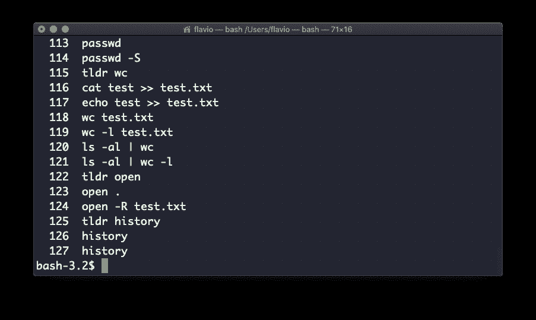

您可以使用语法`!<command number>`来重复存储在历史中的命令。在上面的例子中，输入`!121`将重复`ls -al | wc -l`命令。

通常，最后 500 条命令存储在历史记录中。

您可以将它与`grep`结合起来，找到您运行的命令:

```
history | grep docker 
```

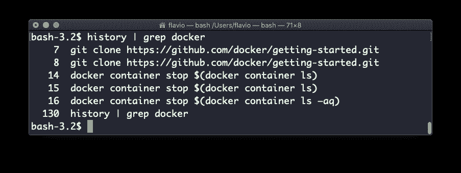
要清除历史，运行`history -c`。

## Linux 的`export`命令

`export`命令用于将变量导出到子进程。

这是什么意思？

假设您有一个以这种方式定义的变量测试:

```
TEST="test" 
```

您可以使用`echo $TEST`打印其值:


但是如果您尝试用上面的命令在文件`script.sh`中定义一个 Bash 脚本:


然后当你设置了`chmod u+x script.sh`并用`./script.sh`执行这个脚本时，`echo $TEST`行将什么也不打印！

这是因为在 Bash 中,`TEST`变量是在 shell 本地定义的。当执行一个 shell 脚本或另一个命令时，会启动一个子 shell 来执行它，它不包含当前的 shell 局部变量。

为了使变量在那里可用，我们需要不这样定义`TEST`:

```
TEST="test" 
```

但是这样一来:

```
export TEST="test" 
```

试试看，现在运行`./script.sh`应该会打印“test”:

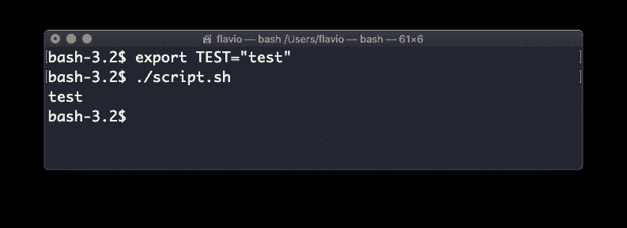
有时候需要给变量追加一些东西。这通常是用`PATH`变量来完成的。使用以下语法:

```
export PATH=$PATH:/new/path 
```

以这种方式创建新变量时，使用`export`是很常见的。但是当您用 Bash 在`.bash_profile`或`.bashrc`配置文件中创建变量时，或者用 Zsh 在`.zshenv`中创建变量时，您也可以使用它。

要删除变量，使用`-n`选项:

```
export -n TEST 
```

不带任何选项调用`export`将列出所有导出的变量。

## Linux 的`crontab`命令

Cron 作业是计划在特定时间间隔运行的作业。您可能每小时、每天或每两周执行一次命令。或者在周末。

它们非常强大，尤其是在服务器上用于执行维护和自动化时。

`crontab`命令是使用 cron 作业的入口点。

您可以做的第一件事是探索哪些 cron 作业是由您定义的:

```
crontab -l 
```

你可能没有，像我一样:


奔跑

```
crontab -e 
```

编辑 cron 作业，并添加新作业。

默认情况下，这用默认编辑器打开，通常是`vim`。我更喜欢`nano`。您可以使用这一行来使用不同的编辑器:

```
EDITOR=nano crontab -e 
```

现在，您可以为每个 cron 作业添加一行。

定义 cron 作业的语法有点吓人。这就是为什么我通常使用一个网站来帮助我生成它而不出错:[https://crontab-generator.org/](https://crontab-generator.org/)


您为 cron 作业选择一个时间间隔，并键入要执行的命令。

我选择每 12 小时运行一个位于`/Users/flavio/test.sh`的脚本。这是我需要运行的 crontab 行:

```
* */12 * * * /Users/flavio/test.sh >/dev/null 2>&1 
```

我跑`crontab -e`:

```
EDITOR=nano crontab -e 
```

我添加了那行，然后我按下`ctrl-X`和`y`来保存。

如果一切顺利，cron 作业就设置好了:

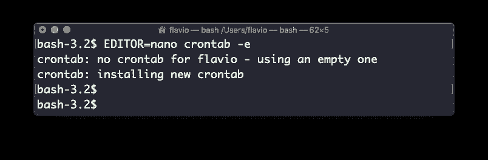

完成后，您可以通过运行以下命令来查看活动 cron 作业的列表:

```
crontab -l 
```

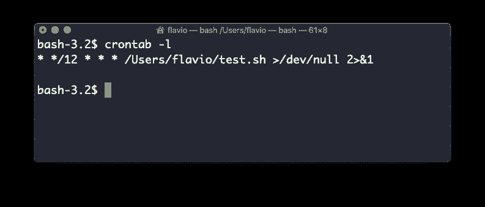

您可以删除再次运行`crontab -e`的 cron 作业，删除该行并退出编辑器:

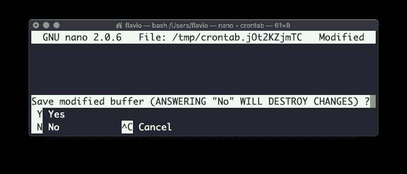

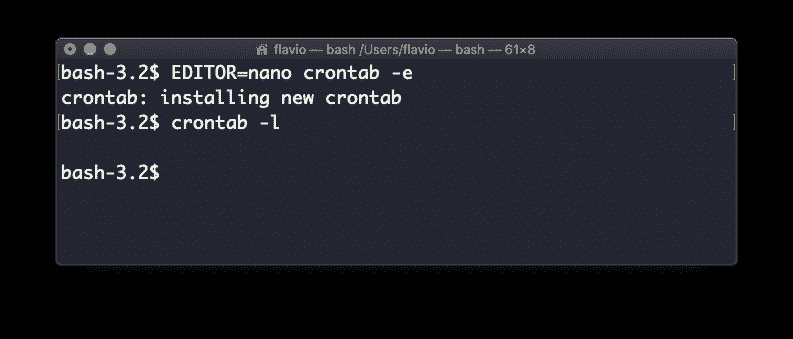

## Linux 的`uname`命令

不带任何选项调用`uname`将返回操作系统代码名称:

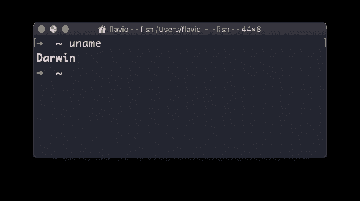

`m`选项显示硬件名称(本例中为`x86_64`),`p`选项打印处理器架构名称(本例中为`i386`):

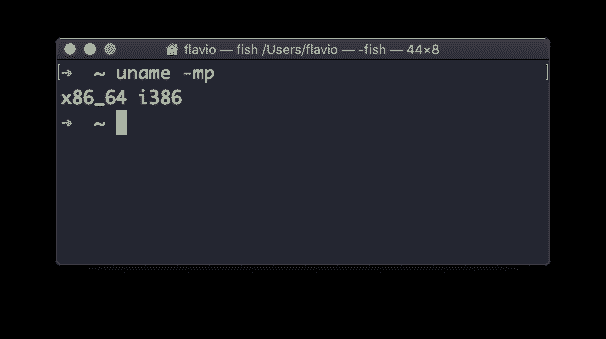

`s`选项打印操作系统名称。`r`打印版本，`v`打印版本:


`n`选项打印节点网络名称:

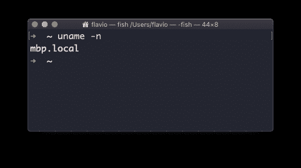

`a`选项打印所有可用信息:

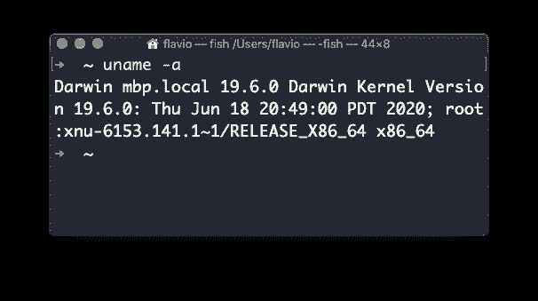

在 macOS 上，您还可以使用`sw_vers`命令来打印关于 macOS 操作系统的更多信息。注意，这不同于达尔文(内核)版本，上面的版本是`19.6.0`。

> 达尔文是 macOS 内核的名字。内核是操作系统的“核心”，而操作系统整体称为 macOS。在 Linux 中，Linux 是内核，GNU/Linux 将是操作系统名称(尽管我们都称它为“Linux”)。

## Linux 的`env`命令

`env`命令可用于传递环境变量，而无需在外部环境(当前 shell)上设置它们。

假设您想要运行 Node.js 应用程序，并为其设置`USER`变量。

你可以跑

```
env USER=flavio node app.js 
```

并且可以通过 Node `process.env`接口从 Node.js 应用程序访问`USER`环境变量。

您也可以使用`-i`选项运行命令清除所有已经设置的环境变量:

```
env -i node app.js 
```

在这种情况下，您将得到一个错误消息`env: node: No such file or directory`，因为`node`命令是不可到达的，因为 shell 用来在公共路径中查找命令的`PATH`变量是未设置的。

因此，您需要将完整路径传递给`node`程序:

```
env -i /usr/local/bin/node app.js 
```

尝试使用包含以下内容的简单`app.js`文件:

```
console.log(process.env.NAME)
console.log(process.env.PATH) 
```

您将看到如下输出

```
undefined
undefined 
```

您可以传递一个 env 变量:

```
env -i NAME=flavio node app.js 
```

输出将会是

```
flavio
undefined 
```

移除`-i`选项将使`PATH`在程序中再次可用:

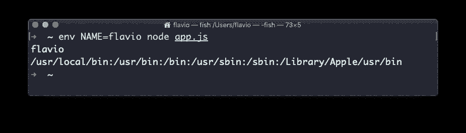

`env`命令也可以用来打印出所有的环境变量。如果不带选项运行:

```
env 
```

它将返回环境变量集的列表，例如:

```
HOME=/Users/flavio
LOGNAME=flavio
PATH=/usr/local/bin:/usr/bin:/bin:/usr/sbin:/sbin:/Library/Apple/usr/bin
PWD=/Users/flavio
SHELL=/usr/local/bin/fish 
```

您也可以使用`-u`选项使变量在您运行的程序中不可访问。例如，这段代码从命令环境中删除了`HOME`变量:

```
env -u HOME node app.js 
```

## Linux 的`printenv`命令

这里有一个`printenv`命令的快速指南，用于打印环境变量的值

在任何 shell 中，都有大量的环境变量，或者由系统设置，或者由您自己的 shell 脚本和配置设置。

您可以使用`printenv`命令将它们全部打印到终端。输出将是这样的:

```
HOME=/Users/flavio
LOGNAME=flavio
PATH=/usr/local/bin:/usr/bin:/bin:/usr/sbin:/sbin:/Library/Apple/usr/bin
PWD=/Users/flavio
SHELL=/usr/local/bin/fish 
```

通常是多几行。

您可以附加一个变量名作为参数，以便只显示该变量值:

```
printenv PATH 
```

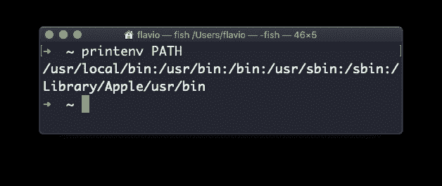

## 结论

非常感谢您阅读本手册。

我希望它能启发您更多地了解 Linux 及其功能。这是永远不会过时的知识。

记住，如果你愿意，你可以[下载 PDF / ePUB / Mobi 格式的手册](https://flaviocopes.com/page/linux-commands-handbook/)！

我**每天在我的网站【flaviocopes.com[上发布编程教程](https://flaviocopes.com)**如果你想查看更多类似的精彩内容。

你可以在推特上找到我。