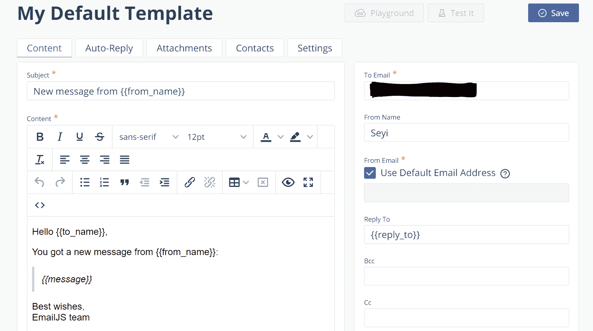
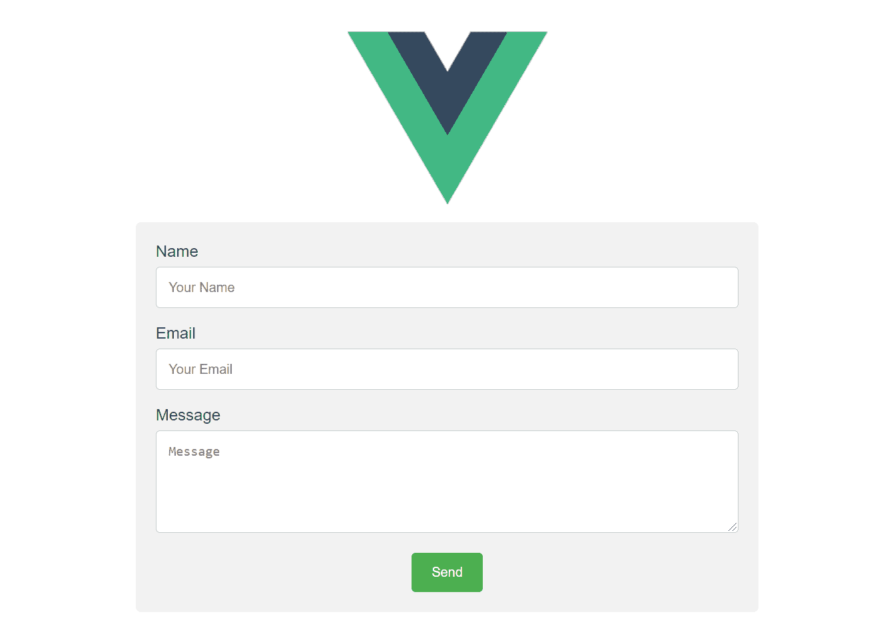
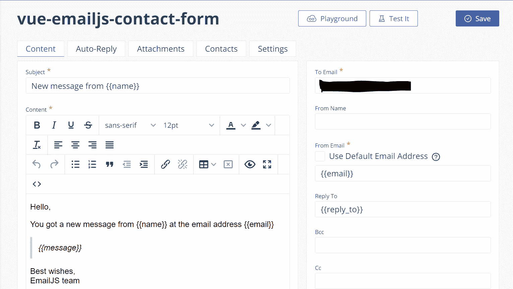

# 如何使用 EmailJS 从 Vue.js 应用程序发送电子邮件

> 原文：<https://www.freecodecamp.org/news/send-emails-from-your-vue-application/>

几天前，我决定做一个简单的 Vue 项目，需要通过我刚刚创建的联系人发送电子邮件。我希望每次有人填写我的联系表格时，我都能收到自动发送的电子邮件。

所以我开始搜索并偶然发现了 [EmailJs](https://www.emailjs.com/) 。我决定写这篇文章，因为我觉得他们的文档很棒，而且非常容易使用。我也希望它能帮助其他人:)

## 我们开始吧！

在本文中，我将向您展示如何使用 EmailJS 从 Vuejs 应用程序发送电子邮件。

在继续之前，我假设您的计算机上安装了 Vue CLI，因为我将使用它创建一个迷你演示项目。如果没有，你可能要检查如何安装它[这里](https://cli.vuejs.org/guide/installation.html)。

我们将使用以下命令创建项目:

```
vue create vue-emailjs-demo
```

然后，系统会提示我们选择默认预设或手动选择功能。选择`****default****`。

将创建一个新的项目目录，您可以使用以下命令导航到该目录:

```
cd vue-emailjs-demo
```

## 如何安装电子邮件

EmailJS 只使用客户端技术帮助你发送电子邮件。不需要服务器——只需将 EmailJS 连接到一个受支持的电子邮件服务，创建一个电子邮件模板，并使用他们的 JavaScript 库来触发电子邮件。

在我们开始编写代码之前，您需要[创建一个 EmailJS 帐户](https://dashboard.emailjs.com/sign-in)。使用您的帐户，您可以创建电子邮件模板，并选择您希望自动发送的电子邮件发送到的电子邮件。

登录新帐户后，您将被引导至[仪表盘](https://dashboard.emailjs.com/admin)。

## 如何创建电子邮件模板

电子邮件模板可以选择在几乎任何字段中包含动态变量(例如，主题、内容、收件人、发件人姓名等)。它们是由 JavaScript 调用填充的。我们很快会谈到这一点。

首先让我们添加一个电子邮件服务。我选择了 Gmail，但你可以自由选择最适合你需求的服务。

此外，如果你不想开始为你的`Service ID`想名字，点击搜索图标，它会自动为你生成。

接下来，我们将创建电子邮件模板。导航到模板页面。创建新模板。我们的电子邮件模板将定义我们的电子邮件的主题，它将包含什么内容，它应该被发送到哪里，等等。



上面显示的像`{{from_name}}`一样的双花括号是变量。当用户填写我们的表单时，我们将使用这些变量将信息传递给 EmailJS。

下面是我们模板中可用字段的简要说明:

*   ****主题:**** 邮件的主题。
*   ****内容:******邮件正文。我们将在这里传递用户消息、他们的姓名以及他们的回信地址。**
*   ****收件人:**包含该邮件的目的地。**
*   ******从名** :** 这是可选的。但是你可以在那里写你的名字。**
*   ******发件人电子邮件:**** 发件人的电子邮件地址将会显示给收件人。如果启用了默认电子邮件地址复选框，EmailJS 将使用与正在使用的电子邮件服务相关联的电子邮件地址。**
*   ******回复:**** 设置回复邮件发送到的邮件地址。**
*   ******“密件抄送”和“抄送:**** ”这两个字段通常用于向您列出的每个人发送邮件副本。`**Reply To**`、`**BCC and CC**`、**、**在本指南中不使用，因为我们希望尽量保持简单。如果你需要更多的信息，你可以在这里查看电子邮件文档。**

**注意:在本文的某个地方，我们将使用`Service ID`和`Template ID`。我们还需要一个`User ID`。你可以在仪表盘的**集成**部分找到你的`User ID`。您可以将详细信息复制到剪贴板，并在需要时进行粘贴。**

## **如何在应用程序中安装电子邮件**

**现在转到代码:)要在您的应用程序中安装 EmailJS，请使用以下命令:**

```
`npm install emailjs-com --save`
```

**我们将通过一个非常简单的联系方式发送电子邮件。它将收集数据，包括:姓名(发件人)，电子邮件(发件人)，和信息内容。简单的东西！**

**您可以编辑我们使用 Vue CLI 时自动为我们创建的`HelloWorld.Vue`组件，也可以创建一个名为`ContactForm.vue`的新组件。我会做后者。**

**下面我们将构建联系人表单组件`ContactForm.vue`。**

**让我们从`template`开始:**

```
`<template>
    <div class="container">
        <form>
          <label>Name</label>
          <input 
            type="text" 
            v-model="name"
            name="name"
            placeholder="Your Name"
          >
          <label>Email</label>
          <input 
            type="email" 
            v-model="email"
            name="email"
            placeholder="Your Email"
            >
          <label>Message</label>
          <textarea 
            name="message"
            v-model="message"
            cols="30" rows="5"
            placeholder="Message">
          </textarea>

          <input type="submit" value="Send">
        </form>
    </div>
</template>`
```

### **解释我们的标记**

**正如我前面提到的，我们将通过一个非常简单的联系方式发送电子邮件。所以创建一个包含表单内容的`div`元素。我们将向表单添加样式，所以向`div` 元素添加一个类`container`。**

```
`<style scoped>
* {box-sizing: border-box;}

.container {
  display: block;
  margin:auto;
  text-align: center;
  border-radius: 5px;
  background-color: #f2f2f2;
  padding: 20px;
  width: 50%;
}

label {
  float: left;
}

input[type=text], [type=email], textarea {
  width: 100%;
  padding: 12px;
  border: 1px solid #ccc;
  border-radius: 4px;
  box-sizing: border-box;
  margin-top: 6px;
  margin-bottom: 16px;
  resize: vertical;
}

input[type=submit] {
  background-color: #4CAF50;
  color: white;
  padding: 12px 20px;
  border: none;
  border-radius: 4px;
  cursor: pointer;
}

input[type=submit]:hover {
  background-color: #45a049;
}
</style>`
```

**您可以使用以下命令启动服务器:**

```
`npm run serve`
```

**现在，打开浏览器到 localhost:8080，您应该会看到您的表单:**

****

**我们还将创建一个名为`sendEmail`的方法来处理数据的提交。但是在此之前，我们需要在我们的文件中导入`emailjs`。**

**在`script`下添加以下一行:**

```
`import emailjs from 'emailjs-com';`
```

**下面是我们的`script`中所需的其余代码:**

```
`<script>
export default {
  name: 'ContactUs',
  data() {
    return {
      name: '',
      email: '',
      message: ''
    }
  },
  methods: {
    sendEmail(e) {
      try {
        emailjs.sendForm('YOUR_SERVICE_ID', 'YOUR_TEMPLATE_ID', e.target,
        'YOUR_USER_ID', {
          name: this.name,
          email: this.email,
          message: this.message
        })

      } catch(error) {
          console.log({error})
      }
      // Reset form field
      this.name = ''
      this.email = ''
      this.message = ''
    },
  }
}
</script>`
```

### **这段代码在做什么**

**上面我用了一个`try...catch`但是你不一定要用。还记得我让你将你的服务 ID、模板 ID 和用户 ID 详细信息复制到你的剪贴板，并在需要时粘贴它们吗？你现在绝对需要它们！因此，用您的实际细节替换片段的这一部分。**

**`emailjs.sendForm()` 是我们如何在传递服务 ID、模板 ID、用户 ID 和表单数据之后将数据发送到 EmailJS，这些数据被传递到`sendEmail()`中。我们 console.log()使用`catch()`块遇到的任何错误。**

**需要注意的是，`sendForm()`根据指定的电子邮件模板和传递的表单数据发送电子邮件。因此，请确保您的表单输入名称与 EmailJS 模板中的变量相同。**

**下面是我修改后的 EmailJS 模板，包括(发件人的)姓名、(发件人的)电子邮件和邮件内容。**

****

**就是这样！**

**检查模板中包含的`To Email`地址，您应该已经将电子邮件发送到那里了。如果你愿意，你也可以在模板右上角的**测试它**或**游乐场**功能上玩玩。**

### **GitHub 回购**

**你可以在我的 [GitHub 账号](https://github.com/Seybel/vue-emailjs-demo)中找到这篇文章的代码。**

**如果你觉得这篇文章有帮助，请随意分享。感谢阅读！**